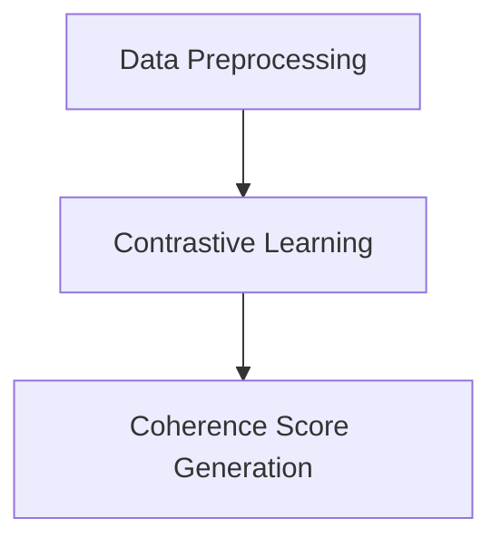

                 

# Self-Consistency CoT: Techniques to Enhance AI Output Coherence

> Keywords: Self-Consistency Contrastive Learning, AI, Text Generation, Coherence, Textual Understanding

> Abstract: This article delves into the concept of Self-Consistency Contrastive Learning for Text (CoT), a cutting-edge technique designed to improve the coherence of AI-generated outputs. By breaking down the core principles, algorithms, and practical implementations, we aim to provide a comprehensive understanding of how this technique can be leveraged to enhance the quality of AI text generation.

## Table of Contents

1. **Self-Consistency CoT: Fundamental Concepts**
    1.1. **Definition of Self-Consistency CoT**
    1.2. **Algorithm Principles of Self-Consistency CoT**
    1.3. **Mathematical Model and Detailed Explanation**
  
2. **Technical Implementation of Self-Consistency CoT**
    2.1. **Implementation Framework of Self-Consistency CoT**
    2.2. **Algorithm Principles of Contrastive Learning**
  
3. **Project Practice: Building and Applying Self-Consistency CoT**
    3.1. **Development Environment Setup**
    3.2. **Source Code Implementation and Analysis**
    3.3. **Case Analysis and Detailed Explanation**
    3.4. **Project Summary**

4. **Best Practices, Summary, and Extension Reading**

5. **Conclusion**

---

## 1. Self-Consistency CoT: Fundamental Concepts

### 1.1 Definition of Self-Consistency CoT

Self-Consistency Contrastive Learning for Text (CoT) is an advanced technique aimed at enhancing the coherence of AI-generated outputs. At its core, CoT leverages contrastive learning to enable models to capture the consistency information within texts, thereby improving the overall coherence of the generated content.

The workflow of CoT can be summarized into three main steps:

1. **Data Preprocessing**: Input texts are encoded into vectors.
2. **Contrastive Learning**: By comparing different segments of the same text, the model learns to identify consistency information.
3. **Generation of Coherence Scores**: The model generates coherence scores based on the comparison results of text segments.

To illustrate this process, we can represent it using a Mermaid flowchart:



### 1.2 Algorithm Principles of Self-Consistency CoT

The core algorithm of CoT is contrastive learning, which fundamentally aims to learn the similarity and difference between data points to enhance the model's generalization ability. Here's the pseudocode for contrastive learning:

```python
# Input: Text encoding vector X
# Output: Coherence score S

# For each text segment X_i, generate its corresponding representation vector v_i
v_i = encode(X_i)

# For each text segment X_i, select its k nearest neighbors X_j
for i in range(len(X)):
    neighbors = select_neighbors(X_i, k)

    # Compute the representation vector v_j of the neighbor text segment X_j
    v_j = encode(X_j)

    # Compute the similarity s_ij between the text segment and its neighbor
    s_ij = cosine_similarity(v_i, v_j)

    # Use the similarity s_ij as the input for the coherence score S_ij
    S[i][j] = s_ij

# Compute the average coherence score S over all text segments
S = average(S)
```

### 1.3 Mathematical Model of Self-Consistency CoT

The mathematical model of CoT can be expressed as:

$$
L = -\sum_{i=1}^{n} \sum_{j \in N_i} \log(p(s_{ij} | s_i, s_j))
$$

Here, $L$ represents the loss function, $s_{ij}$ denotes the coherence score of the text segment $X_i$ and its neighbor $X_j$, and $p(s_{ij} | s_i, s_j)$ indicates the probability of $s_{ij}$ given $s_i$ and $s_j$.

For example, let's consider two text segments $X_1$ and $X_2$ with coherence scores $s_1$ and $s_2$ respectively. Using the above mathematical model, we can compute their loss function $L$:

$$
L = -\log(p(s_{12} | s_1, s_2))
$$

If $s_1$ and $s_2$ are highly coherent, i.e., $s_1 \approx s_2$, then $L$ will have a small value, indicating that the model has a high confidence in the coherence of these two text segments.

