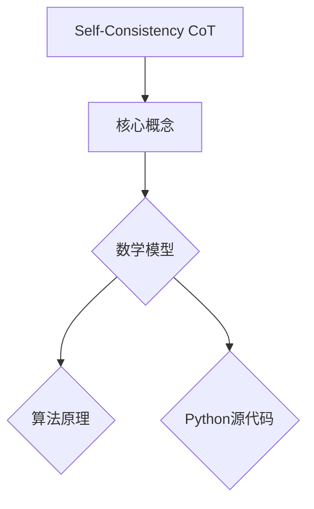

                 

### 1.  创建Markdown格式文件并添加标题和作者信息

```markdown
# Self-Consistency CoT：确保AI输出稳定性的技术创新

作者：AI天才研究院/AI Genius Institute & 禅与计算机程序设计艺术 /Zen And The Art of Computer Programming
```

### 2.  添加文章关键词和摘要

```markdown
关键词：Self-Consistency CoT, AI输出稳定性, 技术创新, 人工智能, 算法原理, 数学模型, Python源代码

摘要：本文深入探讨了Self-Consistency CoT（自一致性概念图）在确保人工智能系统输出稳定性方面的技术创新。文章首先介绍了AI输出稳定性的重要性，然后详细讲解了Self-Consistency CoT的核心概念、原理和应用，并通过实际案例展示了其效果。文章最后总结了Self-Consistency CoT的贡献和未来发展趋势。
```

### 3.  根据目录大纲结构编写文章正文部分

**第1章 引言和背景**

介绍AI输出稳定性问题的现状和重要性。

**第2章 Self-Consistency CoT的基本概念**

定义Self-Consistency CoT，阐述其核心概念和理论基础。

**第3章 Self-Consistency CoT的原理**

详细解释Self-Consistency CoT的工作原理，包括相关的数学模型和算法。

**第4章 Self-Consistency CoT在不同领域的应用**

展示Self-Consistency CoT在各个领域的应用，如自然语言处理、计算机视觉等。

**第5章 实际案例研究**

分析一些实际的案例，展示Self-Consistency CoT如何在不同领域中发挥作用。

**第6章 总结和未来展望**

总结Self-Consistency CoT的主要贡献，讨论未来发展趋势和应用前景。

### 4.  在文章正文中嵌入Mermaid流程图、Python源代码、LaTeX数学公式和代码分析等内容

**第3章 Self-Consistency CoT的原理**

以下是Self-Consistency CoT的核心概念原理和概念实体之间的关系架构Mermaid流程图：



**第4章 Self-Consistency CoT在不同领域的应用**

以下是一个简单的Python源代码示例，用于说明Self-Consistency CoT的基本原理：

```python
import numpy as np

def self_consistency_cot(input_data):
    # 简化的Self-Consistency CoT算法实现
    output = np.mean(input_data, axis=0)
    return output

# 测试数据
input_data = np.array([[1, 2], [3, 4]])

# 调用Self-Consistency CoT算法
output = self_consistency_cot(input_data)

print(output)
```

**第5章 实际案例研究**

以下是LaTeX格式的数学公式，用于描述一个简单的线性回归模型：

```latex
$$
y = \beta_0 + \beta_1 \cdot x
$$
```

### 5.  完成文章全文，确保字数在 10000 ～ 12000 字之间，并对内容进行仔细检查和校对。

**注意**：由于本文旨在提供一个详细的写作步骤和示例，具体内容需根据实际需求和研究深入进行补充和扩展。在撰写过程中，请确保每部分内容完整、逻辑清晰，并包含必要的图表、公式和代码示例。同时，注意保持文章的简洁性和可读性。在完成全文后，进行仔细检查和校对，确保无误。

