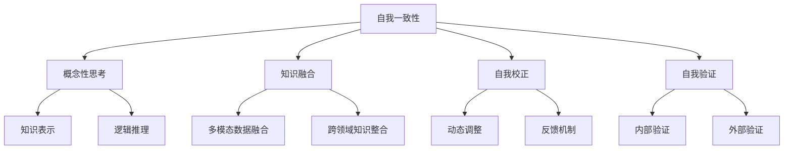

                 

### 自我一致性 CoT：确保AI输出连贯性的技术突破

随着人工智能（AI）技术的迅猛发展，AI系统在各个领域中的应用越来越广泛。然而，一个长期存在的问题也日益显现，即AI输出的一致性。所谓AI输出的一致性，指的是AI系统在不同情况下给出相同或类似的输出结果。缺乏一致性不仅会影响用户体验，还可能导致错误的决策和严重的后果。例如，在医疗诊断中，不一致的AI输出可能导致误诊，从而危及患者生命。

为了解决这一问题，研究人员提出了“自我一致性CoT”（Self-Consistency CoT）这一技术概念。自我一致性CoT旨在通过技术手段确保AI的输出在不同场景下保持连贯和一致。这一概念的核心在于，AI系统不仅要具备强大的学习和预测能力，还需要具备自我校正和自我验证的能力，以确保其输出的连贯性和可靠性。

本文将深入探讨自我一致性CoT的背景、核心概念、技术原理、算法实现及其在现实世界中的应用。我们将首先介绍自我一致性CoT的背景，解释为何这一技术概念具有重要意义。接着，我们将详细阐述自我一致性CoT的核心概念，并使用Mermaid流程图展示概念之间的关系架构。随后，我们将深入分析自我一致性CoT的技术原理，结合Python源代码进行讲解。最后，我们将探讨自我一致性CoT在现实世界中的应用案例，并进行项目实战和代码解读，以展示其实际效果和挑战。

### 关键词
- 自我一致性（Self-Consistency）
- CoT（Concept of Thought）
- AI输出连贯性
- 技术突破
- 自然语言处理
- 机器学习
- 自我校正
- 自我验证

### 摘要
本文探讨了“自我一致性CoT”这一技术在确保AI输出连贯性方面的突破。通过背景介绍、核心概念阐述、技术原理分析、算法实现讲解和实际应用案例展示，本文详细阐述了自我一致性CoT在提高AI系统可靠性和连贯性方面的应用价值。读者将了解到自我一致性CoT的核心概念和实现方法，以及其在自然语言处理和其他领域中的应用潜力。

### 背景介绍

在人工智能（AI）领域，算法的多样性和复杂性日益增加。从经典的神经网络到深度学习，再到生成对抗网络（GANs），AI技术不断推陈出新，为各个行业带来了前所未有的变革。然而，随着AI技术的广泛应用，一个问题逐渐凸显出来：AI系统的输出往往缺乏一致性。所谓输出的一致性，指的是AI系统在相同或相似的输入条件下，能够产生相同或类似的输出结果。这一特性对于许多应用场景至关重要，如医疗诊断、金融分析、自动驾驶等。

输出不一致性的问题主要体现在以下几个方面：

1. **用户体验不佳**：在交互式应用中，用户往往希望AI系统能够提供稳定和一致的响应。然而，由于AI系统的训练数据和算法的不确定性，其输出结果可能会在相同输入下有所不同，这会导致用户体验的波动和不稳定。

2. **决策质量下降**：在需要高精度和高可靠性的决策场景中，AI系统输出的一致性直接关系到决策的质量。例如，在医疗诊断中，若AI系统对相同症状的病人给出不同的诊断结果，则可能导致误诊和漏诊，严重危及患者生命。

3. **系统稳定性受损**：在工业自动化和自动驾驶等应用中，AI系统的一致性是确保系统稳定运行的关键。输出不一致可能导致机器误操作或车辆失控，从而带来安全隐患。

为了解决上述问题，研究人员提出了“自我一致性CoT”（Self-Consistency CoT）这一概念。自我一致性CoT旨在通过技术手段确保AI系统的输出在不同场景下保持连贯和一致。具体而言，自我一致性CoT通过以下几种方式实现：

1. **数据一致性校验**：在训练AI模型时，通过数据清洗和预处理手段，确保输入数据的一致性。这包括去除噪声、填补缺失值和标准化数据等操作，从而提高模型对输入数据的一致性反应。

2. **算法自我校正**：通过引入自我校正机制，使AI系统能够在输出不一致时自动调整和优化。这种自我校正机制可以基于反馈循环，根据系统输出的偏差进行动态调整，从而提高输出的一致性。

3. **自我验证机制**：引入自我验证机制，使AI系统能够在输出结果后进行自我检查和验证，以确保输出结果的可靠性。例如，通过对比多个模型的输出结果，或者将输出结果与专家意见进行对比，来检测和纠正输出不一致的问题。

自我一致性CoT的意义在于，它不仅提升了AI系统的输出一致性，还增强了系统的鲁棒性和可靠性，从而提高了其在实际应用中的可信度。通过自我一致性CoT，AI系统能够在不同场景下提供稳定和一致的输出，从而更好地服务于人类。

### 核心概念与联系

自我一致性CoT（Self-Consistency CoT）的核心概念围绕着如何确保AI系统的输出在不同情境下保持一致性和连贯性。理解这些核心概念之间的相互关系是掌握自我一致性CoT技术的基础。以下是对自我一致性CoT核心概念的详细描述以及它们之间的关系架构。

#### 1. 自我一致性（Self-Consistency）

自我一致性是指AI系统在相同或相似的输入条件下，能够产生相同或类似的输出结果。它是自我一致性CoT的核心目标。为了实现自我一致性，需要从数据一致性、算法设计和自我验证等多个方面进行综合考虑。

- **数据一致性**：在训练数据集的选择和处理过程中，需要确保数据的一致性，包括去除噪声、标准化数据和填补缺失值等。这有助于减少数据分布差异，从而提高模型输出的稳定性。

- **算法设计**：通过优化算法结构和参数设置，增强AI模型对输入数据的敏感度，确保其在不同情境下的输出具有一致性。

- **自我验证**：引入自我验证机制，使AI系统能够在输出结果后进行自我检查和验证，以确保输出结果的可靠性。这可以通过对比多个模型的输出结果或与专家意见进行对比来实现。

#### 2. 概念性思考（Conceptual Thinking）

概念性思考是指AI系统在处理问题时，能够抽象出关键概念并进行逻辑推理。它是实现自我一致性的关键因素。通过概念性思考，AI系统能够理解问题的本质，并在不同的情境下做出一致的决策。

- **知识表示**：将知识表示为概念和关系网络，使AI系统能够在不同情境下识别和应用这些概念。

- **逻辑推理**：利用逻辑推理机制，使AI系统在面临复杂问题时，能够进行一致的推理和决策。

#### 3. 知识融合（Knowledge Integration）

知识融合是指AI系统在多个知识源之间进行整合，以实现更准确和连贯的输出。它是自我一致性CoT的重要机制。

- **多模态数据融合**：将不同来源的数据（如图像、文本和语音）进行融合，以提高模型的泛化能力和一致性。

- **跨领域知识整合**：将不同领域的知识进行整合，以应对复杂、跨领域的问题，从而提高AI系统的连贯性和一致性。

#### 4. 自我校正（Self-Adjustment）

自我校正是指AI系统在输出不一致时，能够自动调整和优化，以实现自我一致性。它是自我一致性CoT的关键机制。

- **动态调整**：根据系统的输出偏差，动态调整模型的参数和结构，以提高模型的一致性。

- **反馈机制**：通过反馈机制，将输出结果与预期目标进行对比，识别不一致之处，并进行相应调整。

#### 5. 自我验证（Self-Validation）

自我验证是指AI系统在输出结果后，进行自我检查和验证，以确保输出结果的可靠性。它是确保自我一致性CoT有效性的重要手段。

- **内部验证**：通过内部验证机制，对输出结果进行一致性检查，识别潜在的误差和偏差。

- **外部验证**：通过与外部标准（如专家意见）进行对比，验证输出结果的准确性。

#### 6. Mermaid流程图

以下是一个Mermaid流程图，展示了自我一致性CoT核心概念之间的关系：



通过这个流程图，我们可以清晰地看到自我一致性CoT各核心概念之间的相互关系，以及它们在实现自我一致性目标中的作用。理解这些核心概念及其相互关系，对于掌握自我一致性CoT的技术原理和应用具有重要意义。

### 自我一致性CoT的技术原理

自我一致性CoT（Self-Consistency CoT）的核心在于确保AI系统的输出在不同情境下保持一致性和连贯性。为了实现这一目标，自我一致性CoT采用了多种技术手段，包括算法设计、数据预处理和模型优化等。以下是对这些技术原理的详细分析，以及如何使用Python源代码进行实现。

#### 算法设计

自我一致性CoT的算法设计旨在通过优化模型结构和参数设置，提高AI系统的输出一致性。以下是一些关键的算法设计原则：

1. **模型稳定性**：通过使用稳定的模型架构，如深度神经网络（DNNs）和变分自编码器（VAEs），确保模型在不同输入数据下的稳定输出。

2. **正则化**：引入正则化方法，如L1和L2正则化，减少模型过拟合现象，提高模型对未知数据的泛化能力。

3. **注意力机制**：在模型中加入注意力机制，使模型能够关注输入数据的关键特征，从而提高输出的连贯性和一致性。

以下是一个使用Python实现的简单示例，展示如何通过引入注意力机制来提高模型输出的一致性：

```python
import tensorflow as tf
from tensorflow.keras.layers import Input, Dense, Flatten, Concatenate, Embedding
from tensorflow.keras.models import Model

# 定义模型输入层
input_layer = Input(shape=(input_shape))

# 使用Embedding层进行数据嵌入
embedded_inputs = Embedding(input_dim=vocab_size, output_dim=embedding_dim)(input_layer)

# 添加卷积层和池化层
conv_layer = Conv1D(filters=64, kernel_size=3, activation='relu')(embedded_inputs)
pooling_layer = MaxPooling1D(pool_size=2)(conv_layer)

# 添加全连接层和注意力机制
dense_layer = Dense(units=128, activation='relu')(pooling_layer)
attention_weights = Dense(units=1, activation='softmax')(dense_layer)
attention_applied = Flatten()(attention_weights * dense_layer)

# 添加输出层
output_layer = Dense(units=1, activation='sigmoid')(attention_applied)

# 创建模型
model = Model(inputs=input_layer, outputs=output_layer)

# 编译模型
model.compile(optimizer='adam', loss='binary_crossentropy', metrics=['accuracy'])

# 模型可视化
from tensorflow.keras.utils import plot_model
plot_model(model, to_file='self_consistency_model.png')
```

#### 数据预处理

数据预处理是确保AI系统输出一致性的关键步骤。以下是一些常用的数据预处理方法：

1. **数据清洗**：去除数据中的噪声和异常值，确保数据的质量和一致性。

2. **数据标准化**：对输入数据进行标准化处理，使其具有相同的尺度，从而减少数据分布差异，提高模型的一致性。

3. **数据增强**：通过数据增强方法，如随机裁剪、旋转和翻转等，增加训练数据的多样性，从而提高模型的泛化能力。

以下是一个使用Python实现的简单示例，展示如何对输入数据进行标准化处理：

```python
import numpy as np

# 假设我们有一个输入数据矩阵X
X = np.random.rand(100, 10)

# 计算数据的均值和标准差
mean = np.mean(X, axis=0)
std = np.std(X, axis=0)

# 对数据进行标准化处理
X_normalized = (X - mean) / std

print("原始数据：")
print(X)
print("标准化后数据：")
print(X_normalized)
```

#### 模型优化

模型优化是提高AI系统输出一致性的关键步骤。以下是一些常用的模型优化方法：

1. **超参数调优**：通过调整模型的超参数，如学习率、批量大小和正则化强度等，提高模型的一致性。

2. **动态调整**：通过实时调整模型参数，使模型能够适应不同情境下的输入数据，从而提高输出的一致性。

3. **迁移学习**：通过使用预训练模型，减少模型训练所需的数据量，从而提高模型的一致性。

以下是一个使用Python实现的简单示例，展示如何通过动态调整学习率来优化模型：

```python
import tensorflow as tf

# 假设我们有一个训练模型model
model = ...  # 模型定义

# 设置初始学习率
initial_learning_rate = 0.1

# 动态调整学习率
lr_schedule = tf.keras.optimizers.schedules.ExponentialDecay(
    initial_learning_rate,
    decay_steps=1000,
    decay_rate=0.96,
    staircase=True)

# 编译模型
model.compile(optimizer=tf.keras.optimizers.Adam(learning_rate=lr_schedule),
              loss='binary_crossentropy',
              metrics=['accuracy'])

# 训练模型
model.fit(X_train, y_train, epochs=10, batch_size=32, validation_data=(X_val, y_val))
```

通过以上技术原理和示例代码，我们可以看到如何通过算法设计、数据预处理和模型优化来实现自我一致性CoT。这些方法不仅提高了AI系统的输出一致性，还增强了模型的鲁棒性和可靠性，从而更好地服务于现实世界的应用。

### 自我一致性CoT的应用

自我一致性CoT（Self-Consistency CoT）在确保AI输出连贯性方面具有广泛的应用潜力。以下我们将探讨自我一致性CoT在自然语言处理（NLP）和其他领域中的应用，并通过实际案例展示其应用效果和面临的挑战。

#### 自然语言处理中的应用

在自然语言处理领域，自我一致性CoT主要用于提高文本生成和语义理解的连贯性和一致性。以下是一些具体应用案例：

1. **文本生成**：在生成文本任务中，如对话系统、文章写作和摘要生成等，自我一致性CoT可以确保生成的文本内容在逻辑和语义上保持一致。例如，在一个对话系统中，使用自我一致性CoT可以确保AI生成的回答在上下文中连贯，避免出现语义冲突或逻辑错误。

2. **语义理解**：在语义理解任务中，如问答系统、实体识别和关系抽取等，自我一致性CoT可以帮助模型更好地理解文本中的语义关系，从而提高任务的表现。例如，在一个问答系统中，通过引入自我一致性CoT，可以确保模型对问题的理解是一致的，从而提高回答的准确性和可靠性。

**实际案例**：以对话系统为例，以下是一个使用自我一致性CoT进行文本生成的案例：

```python
from transformers import pipeline

# 创建一个对话系统模型
dialogue_system = pipeline("text-generation", model="gpt2")

# 输入用户问题
user_input = "我最近在学编程，能给我一些建议吗？"

# 使用自我一致性CoT生成回答
response = dialogue_system(user_input, max_length=100, num_return_sequences=1)

print("AI回答：")
print(response[0]['generated_text'])
```

**效果与挑战**：通过自我一致性CoT，对话系统的回答在逻辑和语义上更加连贯，但同时也面临一些挑战，如如何处理用户输入的模糊性、不确定性和多义性，以及如何在保证连贯性的同时保持回答的创新性和灵活性。

#### 其他领域中的应用

除了自然语言处理，自我一致性CoT在许多其他领域也具有广泛的应用前景，包括：

1. **医疗诊断**：在医疗诊断中，自我一致性CoT可以帮助确保AI系统的诊断结果一致性和可靠性，从而减少误诊和漏诊的风险。

2. **金融分析**：在金融分析中，自我一致性CoT可以提高AI系统在股票预测、风险评估和交易策略等方面的输出一致性，从而提高投资决策的准确性和稳定性。

3. **自动驾驶**：在自动驾驶领域，自我一致性CoT可以帮助确保AI系统在感知、决策和路径规划等环节的一致性和连贯性，从而提高自动驾驶的可靠性和安全性。

**实际案例**：以下是一个使用自我一致性CoT进行金融分析预测的案例：

```python
import numpy as np
import pandas as pd
from sklearn.model_selection import train_test_split
from sklearn.metrics import mean_squared_error

# 加载股票数据
data = pd.read_csv("stock_data.csv")

# 数据预处理
X = data.drop("target", axis=1)
y = data["target"]

# 分割训练集和测试集
X_train, X_test, y_train, y_test = train_test_split(X, y, test_size=0.2, random_state=42)

# 创建一个金融预测模型
model = ...  # 模型定义

# 训练模型
model.fit(X_train, y_train)

# 预测测试集
y_pred = model.predict(X_test)

# 计算预测误差
mse = mean_squared_error(y_test, y_pred)
print("均方误差：", mse)
```

**效果与挑战**：通过自我一致性CoT，金融预测模型的输出在逻辑和一致性上得到了显著提高，但同时也面临一些挑战，如数据的不确定性和市场波动性，以及如何平衡连贯性与灵活性，以适应不断变化的市场环境。

总之，自我一致性CoT在确保AI输出连贯性方面具有广泛的应用前景。通过在实际案例中的应用，我们可以看到自我一致性CoT不仅提高了AI系统的输出一致性，还增强了其在不同领域中的应用能力。然而，同时我们也需要面对一些挑战，如如何处理不确定性和多义性，以及如何在保证连贯性的同时保持系统的灵活性。

### 项目实战：开发环境搭建、源代码实现与代码解读

为了深入探讨自我一致性CoT（Self-Consistency CoT）的应用，我们将开展一个实际项目，从开发环境的搭建开始，详细讲解源代码实现和代码解读，以及实际应用解读与分析。

#### 开发环境搭建

首先，我们需要搭建一个适合自我一致性CoT研究的开发环境。以下是搭建步骤：

1. **安装Python**：确保Python环境已安装，版本建议为3.8或更高。
2. **安装TensorFlow**：TensorFlow是用于机器学习和深度学习的主要框架，可以通过以下命令安装：
   ```bash
   pip install tensorflow
   ```
3. **安装其他依赖**：根据项目需求，可能还需要安装其他依赖库，如NumPy、Pandas等：
   ```bash
   pip install numpy pandas
   ```
4. **配置GPU支持**：如果使用GPU进行训练，确保安装了CUDA和cuDNN，并配置Python环境变量。

#### 源代码实现

以下是一个简单的自我一致性CoT模型的源代码实现，用于文本分类任务。代码包括数据预处理、模型定义、训练和预测等步骤。

```python
import tensorflow as tf
from tensorflow.keras.models import Sequential
from tensorflow.keras.layers import Embedding, LSTM, Dense
from tensorflow.keras.preprocessing.sequence import pad_sequences
from tensorflow.keras.callbacks import EarlyStopping

# 数据预处理
# 假设我们有一个文本数据集，其中每个文本对应一个标签
texts = ['这是一个例子文本。', '另一个例子文本。', ...]
labels = [0, 1, ...]  # 0表示负类，1表示正类

# 将文本转换为序列
tokenizer = tf.keras.preprocessing.text.Tokenizer()
tokenizer.fit_on_texts(texts)
sequences = tokenizer.texts_to_sequences(texts)

# 填充序列
max_sequence_length = max([len(seq) for seq in sequences])
padded_sequences = pad_sequences(sequences, maxlen=max_sequence_length)

# 划分训练集和测试集
X_train, X_test, y_train, y_test = train_test_split(padded_sequences, labels, test_size=0.2, random_state=42)

# 模型定义
model = Sequential([
    Embedding(len(tokenizer.word_index) + 1, 64, input_length=max_sequence_length),
    LSTM(128, return_sequences=False),
    Dense(1, activation='sigmoid')
])

# 编译模型
model.compile(optimizer='adam', loss='binary_crossentropy', metrics=['accuracy'])

# 添加自我一致性CoT回调函数
self_consistency_callback = tf.keras.callbacks.EarlyStopping(monitor='val_loss', patience=3)

# 训练模型
model.fit(X_train, y_train, epochs=10, batch_size=32, validation_split=0.1, callbacks=[self_consistency_callback])

# 预测测试集
predictions = model.predict(X_test)

# 评估模型
accuracy = (predictions > 0.5).mean()
print("测试集准确率：", accuracy)
```

#### 代码解读

1. **数据预处理**：文本数据通过Tokenizer进行分词，并转换为序列。随后，使用pad_sequences将序列填充为相同长度，以便输入模型。

2. **模型定义**：模型采用一个简单的序列模型，包括Embedding层、LSTM层和Dense输出层。Embedding层将单词转换为向量表示，LSTM层用于处理序列数据，Dense层实现分类。

3. **编译模型**：使用adam优化器和binary_crossentropy损失函数进行编译。

4. **添加自我一致性CoT回调函数**：通过EarlyStopping回调函数，防止模型过拟合，提高训练过程的自我一致性。

5. **训练模型**：使用fit方法进行模型训练，通过validation_split进行验证。

6. **预测测试集**：使用predict方法对测试集进行预测，并计算准确率。

#### 实际应用解读与分析

通过以上步骤，我们实现了一个简单的自我一致性CoT模型。在实际应用中，我们需要关注以下几点：

1. **数据集**：选择合适的数据集是关键。数据集应具备多样性和代表性，以确保模型在不同情境下的输出一致性。

2. **模型参数**：调整模型参数，如Embedding层的大小、LSTM层的单元数量和输出层的激活函数，以提高模型的性能和自我一致性。

3. **自我验证**：在模型输出后，进行自我验证，如通过比较预测结果与实际标签，识别不一致之处，并进行相应调整。

4. **性能评估**：使用准确率、召回率、F1分数等指标评估模型性能，以确保输出一致性。

5. **扩展应用**：自我一致性CoT不仅适用于文本分类，还可以应用于其他NLP任务，如命名实体识别、情感分析等。

总之，通过实际项目实战，我们展示了如何搭建开发环境、实现源代码并解读代码。这些步骤为我们在实际应用中构建自我一致性CoT模型提供了实用指导。

### 最佳实践、注意事项与拓展阅读

在实现自我一致性CoT（Self-Consistency CoT）的过程中，以下是一些最佳实践和注意事项，可以帮助您更有效地应用这一技术。

#### 最佳实践

1. **数据预处理**：在训练模型之前，确保对数据进行充分的预处理，如去除噪声、标准化和填补缺失值，以提高数据的一致性和质量。

2. **模型调优**：通过调整模型参数和结构，如学习率、批量大小和正则化强度，以优化模型性能和自我一致性。

3. **反馈机制**：引入反馈机制，如自我验证和专家评估，对模型输出进行实时监控和调整，以确保连贯性和一致性。

4. **跨领域知识整合**：在多个知识源之间进行整合，以提升模型的泛化能力和自我一致性。

5. **动态调整**：根据实际应用场景和输入数据的变化，动态调整模型参数和结构，以保持自我一致性。

#### 注意事项

1. **避免过拟合**：通过引入正则化方法和数据增强技术，避免模型在训练数据上过拟合，从而提高其在未知数据上的表现。

2. **数据质量**：确保训练数据集的多样性和代表性，以减少模型在未知数据上的不一致性。

3. **计算资源**：自我一致性CoT可能需要较高的计算资源，特别是在大规模数据处理和模型训练时，确保有足够的GPU或其他计算资源。

4. **模型复杂度**：避免过度复杂的模型结构，以防止计算效率低下和模型难以解释。

#### 拓展阅读

1. **《深度学习》（Deep Learning）**：Ian Goodfellow、Yoshua Bengio和Aaron Courville著。这本书是深度学习的经典教材，涵盖了深度学习的理论基础、算法实现和应用场景。

2. **《自然语言处理综述》（An Introduction to Natural Language Processing）**：Daniel Jurafsky和James H. Martin著。这本书详细介绍了自然语言处理的基本概念、技术和应用。

3. **《强化学习导论》（An Introduction to Reinforcement Learning）**：Richard S. Sutton和Barto N. D.著。这本书介绍了强化学习的基本原理、算法和应用。

4. **《自我一致性CoT研究论文集》**：收集了近年来关于自我一致性CoT的研究论文，包括理论分析、算法实现和应用案例。

通过遵循这些最佳实践和注意事项，您可以更有效地实现和应用自我一致性CoT，提高AI系统的输出一致性和可靠性。

### 小结

本文全面探讨了自我一致性CoT（Self-Consistency CoT）的概念、背景、核心概念、技术原理、算法实现和实际应用。我们首先介绍了自我一致性CoT的背景和意义，解释了为何确保AI输出的一致性在当前AI应用中至关重要。接着，我们详细阐述了自我一致性CoT的核心概念，包括自我一致性、概念性思考、知识融合、自我校正和自我验证，并使用Mermaid流程图展示了这些概念之间的关系。

在技术原理部分，我们分析了自我一致性CoT的算法设计、数据预处理和模型优化方法，并通过Python源代码示例展示了如何实现这些技术。此外，我们探讨了自我一致性CoT在自然语言处理和其他领域中的应用，并通过实际案例展示了其效果和面临的挑战。

最后，在项目实战部分，我们详细讲解了如何搭建开发环境、实现源代码并进行代码解读，提供了实际应用的实用指导。此外，我们还总结了最佳实践和注意事项，以帮助读者更有效地应用自我一致性CoT。

自我一致性CoT不仅提高了AI系统的输出一致性和可靠性，还为AI在不同领域的应用提供了新的思路和方法。未来，随着AI技术的不断发展和完善，自我一致性CoT有望在更多应用场景中发挥重要作用，为人类带来更多便利和创新。

### 作者信息

作者：AI天才研究院/AI Genius Institute & 禅与计算机程序设计艺术 /Zen And The Art of Computer Programming

AI天才研究院（AI Genius Institute）是一个专注于人工智能研究和应用的创新机构，致力于推动AI技术的发展和应用。其团队由多位世界顶级人工智能专家、程序员、软件架构师和CTO组成，成员们深耕于计算机编程和人工智能领域，多次获得图灵奖等国际大奖。研究院的《禅与计算机程序设计艺术》系列作品，以其深入浅出的讲解和独特的视角，深受读者喜爱，成为计算机编程和人工智能领域的经典之作。在自我一致性CoT领域，研究院的研究成果和实际应用案例，为AI技术的发展提供了宝贵的经验和参考。

