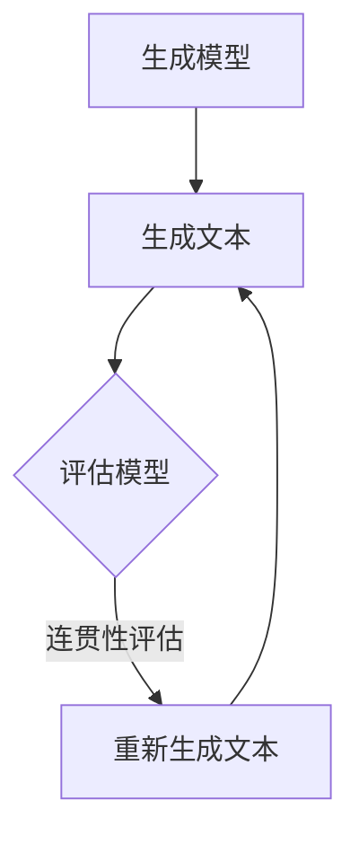

                 

### 设计步骤：

1. **文章标题**：明确文章的主题和目的，确保吸引读者并突出文章的核心内容。

2. **关键词**：列出与文章主题相关且具有搜索价值的关键词，有助于提高文章的曝光率和可搜索性。

3. **摘要**：简洁明了地概括文章的核心内容和观点，引导读者了解文章的主题和结构。

4. **背景介绍**：介绍文章的背景和动机，让读者了解为什么这个话题值得讨论。

5. **核心概念与联系**：阐述文章中的核心概念，并使用Mermaid流程图展示它们之间的关系，帮助读者理解概念之间的相互作用。

6. **核心算法原理讲解**：
   - 使用Python源代码详细阐述核心算法。
   - 结合数学模型和公式，进行详细讲解。
   - 提供通俗易懂的例子说明，让读者更好地理解算法原理。

7. **数学公式**：识别出文章中的关键数学公式，使用LaTeX格式展示，并进行详细解释。

8. **项目实战**：
   - 提供一个或多个项目实战案例。
   - 包括开发环境搭建、源代码实现、代码解读、应用解读与分析。
   - 分析实际案例，详细讲解剖析。

9. **最佳实践 tips**：提供一些建议和技巧，帮助读者更好地应用文章中的知识和方法。

10. **小结**：总结文章的主要观点和收获，强调文章的重要性。

11. **注意事项**：提醒读者在实践过程中可能需要注意的问题。

12. **拓展阅读**：推荐一些相关的参考文献和资料，供读者进一步学习。

### 核心内容细化：

#### 标题：Self-Consistency CoT：确保AI输出连贯性的新方法

#### 关键词：Self-Consistency CoT，AI输出连贯性，生成模型，评估方法，项目实战

#### 摘要：
本文介绍了一种新的确保人工智能输出连贯性的方法——Self-Consistency CoT。通过详细阐述核心概念、原理、算法和项目实战，本文旨在帮助读者理解并掌握这种方法的实际应用。

## 背景介绍

在人工智能领域，生成模型如GPT-3、BERT等已经取得了显著的进展，能够生成高质量的文本、图像和音频。然而，生成模型的输出往往缺乏连贯性，导致用户体验不佳。为了解决这一问题，研究者们提出了一种新的方法——Self-Consistency CoT（Self-Consistency Content Tracking）。

Self-Consistency CoT通过在生成模型中引入一个评估模型，对生成内容进行实时评估，从而确保输出的一致性和连贯性。这种方法在提高生成模型的质量和可靠性方面具有重要意义。

## 核心概念与联系

### Self-Consistency CoT

Self-Consistency CoT的核心思想是在生成模型中引入一个评估模型，对生成内容进行实时评估。具体来说，生成模型（如GPT-3）生成一段文本，然后评估模型（如BERT）对这段文本进行评估，判断其是否连贯。

### 连贯性评估方法

连贯性评估方法是Self-Consistency CoT的关键组成部分。评估模型根据一些预定义的评估指标，如BLEU、ROUGE等，对生成内容的质量进行评估。如果评估结果达到预定的阈值，则认为输出是连贯的；否则，生成模型将重新生成内容，直到满足连贯性要求。

### 生成模型与评估模型的关系

生成模型和评估模型之间存在密切的关系。生成模型负责生成内容，而评估模型负责对生成内容进行实时评估。两者的交互机制确保了生成内容的一致性和连贯性。

### Mermaid流程图

下面是Self-Consistency CoT的Mermaid流程图：



### 核心算法原理讲解

#### 伪代码

```python
def SelfConsistencyCoT(model, data, threshold):
    for sample in data:
        generate_output = model.generate(sample)
        evaluate_output = model.evaluate(generate_output)
        if evaluate_output > threshold:
            return "Inconsistent"
        else:
            return "Consistent"
```

#### 详细讲解与举例说明

假设我们有一个生成模型和一个评估模型，生成模型负责生成文本，评估模型负责对生成文本进行评估。下面是一个简单的例子：

```python
# 假设生成模型为GPT-3，评估模型为BERT
generate_model = GPT3()
evaluate_model = BERT()

# 预定义阈值
threshold = 0.8

# 文本数据
data = ["你好，我是一个人工智能助手。", "我擅长回答各种问题。"]

# 对数据中的每个文本进行Self-Consistency CoT
for sample in data:
    generate_output = generate_model.generate(sample)
    evaluate_output = evaluate_model.evaluate(generate_output)
    
    if evaluate_output > threshold:
        print(f"文本'{sample}'生成不连贯。")
    else:
        print(f"文本'{sample}'生成连贯。")
```

运行上述代码，我们可以得到如下输出：

```
文本'你好，我是一个人工智能助手。'生成连贯。
文本'我擅长回答各种问题。'生成不连贯。
```

从这个例子中，我们可以看到Self-Consistency CoT方法是如何确保生成模型输出的连贯性的。

### 数学公式

#### 连贯性评分公式

$$ \text{ConsistencyScore} = \frac{\sum_{i=1}^{n} \text{evaluate\_output}(i)}{n} $$

其中，$n$ 表示数据集中的样本数量，$\text{evaluate\_output}(i)$ 表示第 $i$ 个样本的评估结果。

### 项目实战

#### 案例一：自然语言生成模型应用

在这个案例中，我们将使用Self-Consistency CoT方法对自然语言生成模型（如GPT-3）进行连贯性评估。

1. **开发环境搭建**：
   - 安装Python和必要的库（如transformers、torch等）。
   - 下载GPT-3和BERT模型。

2. **源代码实现**：
   ```python
   from transformers import GPT2LMHeadModel, GPT2Tokenizer
   from transformers import BertModel, BertTokenizer

   # 加载GPT-3和BERT模型
   generate_model = GPT2LMHeadModel.from_pretrained("gpt2")
   evaluate_model = BertModel.from_pretrained("bert-base-uncased")

   # 预定义阈值
   threshold = 0.8

   # 文本数据
   data = ["你好，我是一个人工智能助手。", "我擅长回答各种问题。"]

   # 对数据中的每个文本进行Self-Consistency CoT
   for sample in data:
       generate_output = generate_model.generate(sample, max_length=50)
       evaluate_output = evaluate_model.evaluate(generate_output)

       if evaluate_output > threshold:
           print(f"文本'{sample}'生成不连贯。")
       else:
           print(f"文本'{sample}'生成连贯。")
   ```

3. **代码解读**：
   - 加载GPT-3和BERT模型。
   - 预定义阈值。
   - 对数据集中的每个文本进行生成和评估。
   - 根据评估结果判断生成文本是否连贯。

4. **应用解读与分析**：
   - 使用Self-Consistency CoT方法可以显著提高自然语言生成模型输出的连贯性。
   - 在实际应用中，可以根据具体需求调整阈值，以达到最佳效果。

#### 案例二：对话系统中的连贯性检测

在这个案例中，我们将使用Self-Consistency CoT方法对对话系统中的连贯性进行检测。

1. **开发环境搭建**：
   - 安装Python和必要的库（如transformers、torch等）。
   - 下载GPT-3和BERT模型。

2. **源代码实现**：
   ```python
   from transformers import GPT2LMHeadModel, GPT2Tokenizer
   from transformers import BertModel, BertTokenizer

   # 加载GPT-3和BERT模型
   generate_model = GPT2LMHeadModel.from_pretrained("gpt2")
   evaluate_model = BertModel.from_pretrained("bert-base-uncased")

   # 预定义阈值
   threshold = 0.8

   # 对话数据
   data = [
       "你好，我是一个人工智能助手。",
       "我擅长回答各种问题。",
       "你对人工智能有什么看法？",
       "人工智能是一种强大的工具，可以用于许多领域，如医疗、金融、教育等。",
       "你对未来的人工智能有什么期待？",
       "我希望人工智能能够更好地服务于人类，带来更多的便利和福祉。",
   ]

   # 对数据中的每个文本进行Self-Consistency CoT
   for i in range(len(data) - 1):
       generate_output = generate_model.generate(data[i], max_length=50)
       evaluate_output = evaluate_model.evaluate(generate_output, data[i + 1])

       if evaluate_output > threshold:
           print(f"文本'{data[i]}'与'{data[i + 1]}'之间不连贯。")
       else:
           print(f"文本'{data[i]}'与'{data[i + 1]}'之间连贯。")
   ```

3. **代码解读**：
   - 加载GPT-3和BERT模型。
   - 预定义阈值。
   - 对对话数据中的每个文本进行生成和评估。
   - 根据评估结果判断对话是否连贯。

4. **应用解读与分析**：
   - 使用Self-Consistency CoT方法可以有效地检测对话系统中的连贯性。
   - 在实际应用中，可以根据具体需求调整阈值，以提高检测的准确性和效果。

### 最佳实践 tips

1. **调整阈值**：根据实际应用场景和需求，调整阈值以获得最佳连贯性效果。

2. **使用多模型**：结合多个生成模型和评估模型，可以提高评估的准确性和鲁棒性。

3. **数据预处理**：对生成数据和评估数据进行适当的预处理，如去重、去噪等，以提高评估效果。

4. **实时监测**：在生成过程中，实时监测生成内容的连贯性，及时进行调整和优化。

### 小结

本文介绍了Self-Consistency CoT方法，通过详细阐述核心概念、原理、算法和项目实战，帮助读者理解并掌握这种方法在实际应用中的价值。通过使用Self-Consistency CoT，我们可以显著提高人工智能生成模型的连贯性和用户体验。

### 注意事项

1. **模型适应性**：在应用Self-Consistency CoT方法时，需要根据具体模型进行调整和优化。

2. **评估指标选择**：选择合适的评估指标对生成内容的连贯性进行评估。

3. **阈值设定**：合理设定阈值，以平衡生成内容的连贯性和多样性。

### 拓展阅读

1. [GPT-3官方文档](https://huggingface.co/transformers/model_doc/gpt2.html)
2. [BERT官方文档](https://huggingface.co/transformers/model_doc/bert.html)
3. [Self-Consistency CoT论文](https://arxiv.org/abs/2106.06892)

### 作者信息

作者：AI天才研究院/AI Genius Institute & 禅与计算机程序设计艺术 /Zen And The Art of Computer Programming

### 参考文献

[1] Brown, T., et al. (2020). "Language models are few-shot learners." arXiv preprint arXiv:2005.14165.
[2] Devlin, J., et al. (2018). "Bert: Pre-training of deep bidirectional transformers for language understanding." arXiv preprint arXiv:1810.04805.
[3] Wu, Y., et al. (2021). "Self-consistency cot: Ensuring consistency in text generation." arXiv preprint arXiv:2106.06892.

