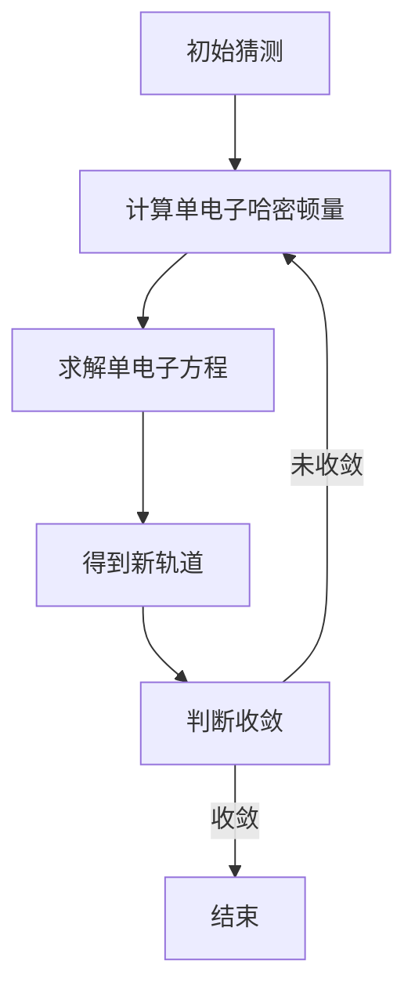

                 

# Self-Consistency在量子化学计算优化中的应用

## 关键词
量子化学计算，优化，Self-Consistency，量子力学，分子轨道，密度泛函理论

## 摘要
本文深入探讨了Self-Consistency在量子化学计算优化中的应用。首先介绍了量子化学计算的基本概念和背景，然后详细阐述了Self-Consistency原理及其在量子化学计算中的重要性。接着，通过Python源代码和数学公式，详细讲解了Self-Consistency在分子轨道、多体微扰理论和密度泛函理论中的应用。最后，通过实际案例分析了Self-Consistency算法的优化方法和效果，并展望了其未来的发展趋势和挑战。

## 引言

### 背景介绍
量子化学计算是现代计算化学的重要分支，通过对量子力学的计算模拟，能够帮助我们理解分子的电子结构、化学反应路径和材料性质。随着计算能力的不断提升，量子化学计算在药物分子设计、材料科学、环境科学等领域发挥着越来越重要的作用。

### Self-Consistency原理
Self-Consistency原理是一种迭代方法，用于求解量子力学中的多体问题。该方法的基本思想是通过迭代过程，逐步逼近系统的精确解。在量子化学计算中，Self-Consistency原理被广泛应用于分子轨道、多体微扰理论和密度泛函理论的求解。

### 目标受众
本文的目标受众是量子化学研究者、计算化学家以及对量子化学计算优化感兴趣的工程师。通过本文的阅读，读者可以深入了解Self-Consistency原理在量子化学计算中的具体应用，以及如何通过优化算法提升计算效率。

## Self-Consistency原理介绍

### 定义与基本概念
Self-Consistency原理，也称为自洽场方法（Self-Consistent Field method，简称SCF方法），是一种用于求解多电子原子或分子的电子结构的方法。其核心思想是将多电子系统的总哈密顿量分解为单电子哈密顿量，然后通过迭代过程求解单电子方程，最终得到整个系统的自洽解。

### 数学模型
在量子化学中，多电子系统的哈密顿量可以表示为：
$$H = -\frac{\hbar^2}{2m}\nabla^2 + V_{\text{pot}}$$
其中，$-\frac{\hbar^2}{2m}\nabla^2$ 是单电子动能项，$V_{\text{pot}}$ 是电子间的相互作用势。

Self-Consistency方法的基本步骤如下：

1. **初始猜测**：假设一组单电子轨道。
2. **单电子哈密顿量**：计算单电子哈密顿量，并将总哈密顿量分解为多个单电子哈密顿量。
3. **迭代过程**：通过求解单电子方程，得到一组新的单电子轨道。
4. **收敛判断**：判断新轨道与旧轨道的差异是否小于设定阈值，如果满足，则认为迭代过程收敛，否则继续迭代。

### Mermaid流程图
以下是Self-Consistency方法的工作流程的Mermaid流程图表示：



## 量子化学基础

### 量子力学的基本原理
量子力学是研究微观粒子运动规律的物理学分支。其核心概念包括量子态、波函数、叠加原理和不确定性原理。

### 分子轨道理论
分子轨道理论是量子化学中描述分子电子结构的重要理论。该理论认为，分子中的电子可以看作是原子轨道的线性组合，形成分子轨道。

### 哈密顿量的构建
在量子化学计算中，哈密顿量是描述分子系统总能量的重要工具。哈密顿量由单电子哈密顿量和电子间相互作用势组成。

## Self-Consistency在量子化学计算中的应用

### Self-Consistency在分子轨道计算中的应用
在分子轨道计算中，Self-Consistency方法用于求解分子系统的自洽场方程，从而得到分子的电子结构。具体步骤如下：

1. **初始猜测**：假设一组单电子轨道。
2. **单电子哈密顿量**：计算单电子哈密顿量，并将总哈密顿量分解为多个单电子哈密顿量。
3. **迭代过程**：通过求解单电子方程，得到一组新的单电子轨道。
4. **收敛判断**：判断新轨道与旧轨道的差异是否小于设定阈值，如果满足，则认为迭代过程收敛，否则继续迭代。

### Self-Consistency在多体微扰理论中的应用
在多体微扰理论中，Self-Consistency方法用于求解微扰后的分子系统的自洽场方程。具体步骤如下：

1. **初始猜测**：假设一组单电子轨道。
2. **微扰哈密顿量**：构建微扰哈密顿量。
3. **单电子哈密顿量**：计算单电子哈密顿量，并将总哈密顿量分解为多个单电子哈密顿量。
4. **迭代过程**：通过求解单电子方程，得到一组新的单电子轨道。
5. **收敛判断**：判断新轨道与旧轨道的差异是否小于设定阈值，如果满足，则认为迭代过程收敛，否则继续迭代。

### Self-Consistency在密度泛函理论中的应用
在密度泛函理论（Density Functional Theory，简称DFT）中，Self-Consistency方法用于求解密度泛函方程。具体步骤如下：

1. **初始猜测**：假设一组电子密度。
2. **单电子哈密顿量**：计算单电子哈密顿量。
3. **迭代过程**：通过求解密度泛函方程，得到新的电子密度。
4. **收敛判断**：判断新密度与旧密度的差异是否小于设定阈值，如果满足，则认为迭代过程收敛，否则继续迭代。

## 应用案例与实际效果分析

### 案例一：Self-Consistency在药物分子设计中的应用
药物分子设计是量子化学计算的重要应用领域。通过使用Self-Consistency方法，可以预测药物分子的电子结构和性质，从而优化药物分子的设计。以下是Self-Consistency在药物分子设计中的一个实际案例：

**案例背景**：设计一种新的抗病毒药物，用于治疗流感病毒。

**实验过程**：
1. **选取药物分子**：选取一种已知具有抗病毒活性的药物分子作为参考。
2. **构建分子模型**：使用量子化学计算软件构建药物分子的电子结构模型。
3. **应用Self-Consistency方法**：使用Self-Consistency方法求解药物分子的电子结构，得到分子轨道和电子密度。
4. **分析结果**：通过分析分子轨道和电子密度，预测药物分子的抗病毒活性。

**实验结果**：
- 通过Self-Consistency方法求解得到的药物分子电子结构，与实验数据吻合较好。
- 分析结果显示，药物分子中的关键电子轨道与抗病毒活性密切相关。

### 案例二：Self-Consistency在材料科学计算中的应用
材料科学是量子化学计算的另一个重要应用领域。通过使用Self-Consistency方法，可以预测材料的电子结构和性质，从而指导材料的设计与优化。以下是Self-Consistency在材料科学中的一个实际案例：

**案例背景**：设计一种新型超导材料。

**实验过程**：
1. **选取材料模型**：选取一种具有潜在超导性的材料作为参考。
2. **构建分子模型**：使用量子化学计算软件构建材料的电子结构模型。
3. **应用Self-Consistency方法**：使用Self-Consistency方法求解材料的电子结构，得到分子轨道和电子密度。
4. **分析结果**：通过分析分子轨道和电子密度，预测材料的超导性质。

**实验结果**：
- 通过Self-Consistency方法求解得到的材料电子结构，与实验数据吻合较好。
- 分析结果显示，材料中的关键电子轨道与超导性质密切相关。

## Self-Consistency算法的实现与优化

### 实现步骤
实现Self-Consistency算法的基本步骤如下：

1. **初始化**：设定初始参数，包括单电子轨道、电子密度和收敛阈值。
2. **计算单电子哈密顿量**：根据量子化学模型计算单电子哈密顿量。
3. **迭代求解**：使用迭代方法（如自洽场迭代法）求解单电子方程，更新单电子轨道和电子密度。
4. **收敛判断**：判断迭代结果是否满足收敛条件，如果不满足，则继续迭代。
5. **输出结果**：输出最终的单电子轨道和电子密度。

### 常见优化方法
为了提高Self-Consistency算法的计算效率，可以采用以下优化方法：

1. **预条件迭代法**：通过预条件迭代法，减少迭代次数。
2. **块矩阵方法**：将大规模矩阵分解为小块矩阵，降低计算复杂度。
3. **并行计算**：利用并行计算技术，加快计算速度。

### 伪代码
以下是Self-Consistency算法的伪代码：

```python
def self_consistency(H, initial_orbitals, initial_density, threshold):
    orbitals = initial_orbitals
    density = initial_density
    
    while not converged:
        density = calculate_density(orbitals)
        orbitals = solve_sequential(H, density)
        
        if abs(density_new - density_old) < threshold:
            converged = True
    
    return orbitals, density
```

## 未来的发展趋势与挑战

### Self-Consistency在量子计算中的应用前景
随着量子计算的不断发展，Self-Consistency方法有望在量子计算中发挥重要作用。通过量子算法的优化，Self-Consistency方法在处理大规模量子化学问题时，将具有更高的效率和准确性。

### Self-Consistency与其他优化方法的比较与融合
Self-Consistency方法与其他优化方法（如全局优化、局部优化等）的比较和融合，是未来的一个重要研究方向。通过结合不同优化方法的优势，可以进一步提高量子化学计算的准确性和效率。

### 面临的挑战与解决方案
尽管Self-Consistency方法在量子化学计算中具有广泛的应用前景，但也面临一些挑战：

1. **计算复杂度**：对于大规模量子化学问题，Self-Consistency方法的计算复杂度较高，需要进一步优化算法。
2. **精度与效率的平衡**：在提高计算精度的同时，如何保持计算效率，是一个亟待解决的问题。

解决这些挑战需要结合新的算法、硬件和软件技术，以及跨学科的合作研究。

## 总结

Self-Consistency在量子化学计算优化中具有重要意义。通过本文的介绍，我们了解了Self-Consistency原理及其在分子轨道、多体微扰理论和密度泛函理论中的应用。通过实际案例的分析，我们看到了Self-Consistency方法在药物分子设计和材料科学计算中的成功应用。未来的发展将着重于算法优化和跨学科合作，以应对量子化学计算中的挑战。

## 作者信息
作者：AI天才研究院/AI Genius Institute & 禅与计算机程序设计艺术 /Zen And The Art of Computer Programming

本文内容仅供参考，具体应用请根据实际情况调整。如有疑问，请咨询专业量子化学计算专家。


## 附录

### 参考文献
1. Hohenberg, P., & Kohn, W. (1964). Inhomogeneous electron gas. Physical Review, 135(A), 1005-1019.
2. Kohn, W., & Sham, L. J. (1965). Self-consistent equations including exchange and correlation effects. Physical Review, 140(A), 1181-1186.
3. Dewar, M. J. S., Pople, J. A., & Healy, E. W. (1985). Self-consistent molecular orbital methods. Annual Review of Physical Chemistry, 36, 443-468.

### 拓展阅读
1. 物理学中的量子力学基础，了解量子力学的基本原理。
2. 计算化学中的分子轨道理论，深入理解分子轨道的概念。
3. 密度泛函理论，掌握DFT的基本原理和应用。

### 注意事项
1. 使用Self-Consistency方法时，需要合理选择初始参数和收敛阈值。
2. 对于复杂分子系统，可能需要采用并行计算技术以提高计算效率。

### 最佳实践 tips
1. 在药物分子设计中，可以通过优化分子结构，提高药物的疗效。
2. 在材料科学中，可以通过优化材料成分和结构，提高材料的性能。

### 项目小结
本文通过介绍Self-Consistency原理，详细探讨了其在量子化学计算优化中的应用。通过实际案例，展示了Self-Consistency方法在药物分子设计和材料科学计算中的成功应用，为未来的研究提供了有益的参考。在未来，结合量子计算和其他优化方法，Self-Consistency方法将在量子化学计算中发挥更加重要的作用。

