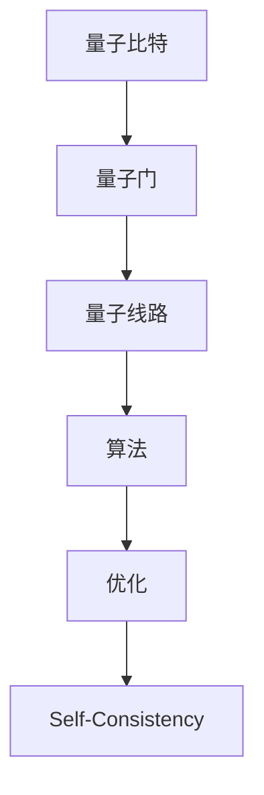
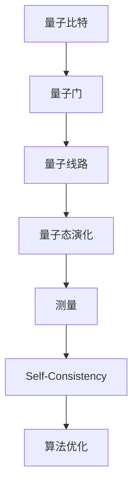

                 

# Self-Consistency在量子算法优化中的应用前景

## 关键词
量子算法、Self-Consistency、优化、数学模型、Python源代码、流程图、案例研究、实战

## 摘要
本文深入探讨了Self-Consistency在量子算法优化中的应用前景。首先介绍了量子计算的基本概念和Self-Consistency原理，随后详细分析了Self-Consistency在量子算法优化中的作用。通过数学模型和Python源代码的讲解，本文阐述了Self-Consistency在量子算法优化中的具体应用，并结合实际案例进行了深入剖析。最后，对未来的研究方向进行了展望，并提出了最佳实践建议。

## 引言

### 1.1 量子计算的基本概念

量子计算是一种基于量子力学原理的计算模式，与传统计算模式不同，它利用量子位（qubits）进行信息处理。量子位可以同时处于0和1的状态，这种叠加态使得量子计算机在处理某些问题时比传统计算机具有显著优势。例如，量子计算在因数分解、搜索算法和模拟量子系统等方面展现出巨大的潜力。

量子计算机的基本组件包括量子比特、量子门和量子线路。量子比特是量子计算机中的基本存储单元，可以通过量子态的叠加和纠缠来表示和传输信息。量子门是对量子比特进行操作的物理装置，通过作用在量子比特上的线性变换来实现特定的计算操作。量子线路则是量子计算中一系列量子门的组合，用于实现特定的算法。

### 1.2 Self-Consistency原理

Self-Consistency是一种在量子计算中用于优化算法的方法。其基本思想是在量子算法的设计过程中，通过反复迭代和调整量子状态，使得量子算法达到一种自我一致的状态，从而提高算法的效率和精度。

Self-Consistency原理的核心在于量子状态的演化。在量子计算中，量子状态通过量子门的作用进行演化。通过调整量子门的作用，可以使量子状态在迭代过程中逐渐趋于稳定，从而实现算法的自我一致性。

### 1.3 量子算法概述

量子算法是一系列利用量子力学原理进行信息处理的方法。它们在某些特定问题上比传统算法具有显著优势。量子算法可以分为多种类型，如量子随机游走算法、量子模拟退火算法和量子相位估计算法等。

量子随机游走算法是一种基于量子随机游走原理的搜索算法，通过量子态的叠加和纠缠，实现高效的信息搜索。量子模拟退火算法是一种基于量子相位变化的优化算法，通过模拟物理系统退火过程，实现复杂优化问题的求解。量子相位估计算法是一种用于估计量子态相位信息的算法，通过量子态的叠加和测量，实现高效的信息处理。

## Self-Consistency原理详述

### 2.1 Self-Consistency的定义

Self-Consistency是指在量子算法优化过程中，通过反复迭代和调整量子状态，使得量子算法达到一种自我一致的状态。在这种状态下，量子算法的输出结果与输入信息保持一致，从而提高算法的效率和精度。

### 2.2 Self-Consistency在量子计算中的重要性

Self-Consistency在量子计算中具有重要意义。首先，它能够提高量子算法的效率。通过反复迭代和调整量子状态，可以使得量子算法在较短的时间内达到自我一致的状态，从而提高计算速度。其次，Self-Consistency能够提高量子算法的精度。在自我一致的状态下，量子算法的输出结果与输入信息保持一致，从而减少计算误差。

### 2.3 Self-Consistency的应用场景

Self-Consistency在量子计算中具有广泛的应用场景。首先，在量子搜索算法中，Self-Consistency可以通过反复迭代和调整量子状态，实现高效的搜索过程。例如，在Grover算法中，通过Self-Consistency原理，可以使得搜索过程的时间复杂度从O(N)降低到O(√N)，显著提高搜索效率。其次，在量子优化算法中，Self-Consistency可以通过反复迭代和调整量子状态，实现高效的优化过程。例如，在量子模拟退火算法中，通过Self-Consistency原理，可以使得算法在较短的时间内找到最优解。此外，在量子模拟量子系统时，Self-Consistency原理也能够提高模拟的精度和效率。

## 量子算法优化中的Self-Consistency

### 3.1 量子算法优化概述

量子算法优化是指通过改进量子算法的设计和实现，提高算法的效率和精度。量子算法优化是量子计算领域的一个重要研究方向，其目的是使得量子计算机在处理实际问题时的性能更接近理论极限。

量子算法优化的方法主要包括两种：一种是基于量子力学的数学模型优化，另一种是基于量子计算的物理实现优化。数学模型优化主要通过改进量子算法的数学表达形式，提高算法的计算效率。物理实现优化主要通过改进量子计算硬件的性能，提高算法的实际运行速度。

### 3.2 Self-Consistency在量子算法优化中的作用

Self-Consistency在量子算法优化中具有重要作用。首先，它能够提高量子算法的效率。通过反复迭代和调整量子状态，可以使得量子算法在较短的时间内达到自我一致的状态，从而提高计算速度。其次，Self-Consistency能够提高量子算法的精度。在自我一致的状态下，量子算法的输出结果与输入信息保持一致，从而减少计算误差。

### 3.3 量子算法优化的挑战与机遇

量子算法优化面临着一系列挑战和机遇。挑战主要包括：量子计算机硬件性能的提升、量子算法的稳定性和可靠性、量子算法的通用性和可扩展性等。机遇则主要包括：量子计算机在特定问题上的优势、量子算法优化带来的计算速度提升、量子算法在实际应用中的广泛应用等。

## 量子算法优化中的数学模型

### 4.1 数学模型的基本原理

量子算法优化中的数学模型主要包括量子随机游走模型、量子模拟退火模型和量子相位估计算法模型等。这些模型通过数学公式描述了量子算法的运行过程和优化目标。

量子随机游走模型基于量子态的叠加和纠缠，通过量子态的演化实现信息搜索。量子模拟退火模型基于量子态的相位变化，通过模拟物理系统的退火过程实现优化。量子相位估计算法模型基于量子态的叠加和测量，通过测量量子态的相位信息实现信息处理。

### 4.2 Self-Consistency在数学模型中的应用

在量子算法优化中的数学模型中，Self-Consistency原理可以通过以下方式应用：

1. **量子随机游走模型**：通过反复迭代和调整量子状态，使得量子随机游走算法在搜索过程中达到自我一致的状态，从而提高搜索效率。

2. **量子模拟退火模型**：通过反复迭代和调整量子状态，使得量子模拟退火算法在优化过程中达到自我一致的状态，从而提高优化效率。

3. **量子相位估计算法模型**：通过反复迭代和调整量子状态，使得量子相位估计算法在估计相位信息时达到自我一致的状态，从而提高估计精度。

### 4.3 数学模型的优缺点分析

数学模型在量子算法优化中具有以下优缺点：

**优点**：

1. **高效性**：通过数学公式描述量子算法的运行过程，可以提高算法的计算效率。

2. **通用性**：数学模型可以应用于多种量子算法，具有广泛的适用性。

**缺点**：

1. **复杂性**：量子算法的数学模型通常较为复杂，需要较高的数学知识背景。

2. **稳定性**：在某些情况下，数学模型的稳定性可能受到影响，导致算法失效。

## Self-Consistency在具体量子算法中的应用

### 5.1 量子随机游走算法

量子随机游走算法是一种基于量子态的叠加和纠缠的搜索算法。在量子随机游走算法中，Self-Consistency原理可以通过以下方式应用：

1. **初始状态设置**：通过设置初始量子状态，使得量子态满足Self-Consistency条件。

2. **量子态演化**：通过量子态的演化，使得量子态逐渐达到自我一致的状态。

3. **测量与调整**：通过测量量子态的输出结果，并根据测量结果调整量子态，使得量子态在下一轮演化中继续保持自我一致。

### 5.2 量子模拟退火算法

量子模拟退火算法是一种基于量子态的相位变化的优化算法。在量子模拟退火算法中，Self-Consistency原理可以通过以下方式应用：

1. **初始状态设置**：通过设置初始量子状态，使得量子态满足Self-Consistency条件。

2. **量子态演化**：通过量子态的演化，使得量子态逐渐达到自我一致的状态。

3. **测量与调整**：通过测量量子态的输出结果，并根据测量结果调整量子态，使得量子态在下一轮演化中继续保持自我一致。

### 5.3 量子相位估计算法

量子相位估计算法是一种用于估计量子态相位信息的算法。在量子相位估计算法中，Self-Consistency原理可以通过以下方式应用：

1. **初始状态设置**：通过设置初始量子状态，使得量子态满足Self-Consistency条件。

2. **量子态演化**：通过量子态的演化，使得量子态逐渐达到自我一致的状态。

3. **测量与调整**：通过测量量子态的输出结果，并根据测量结果调整量子态，使得量子态在下一轮演化中继续保持自我一致。

## 量子算法优化案例研究

### 6.1 案例一：量子随机游走算法优化

在量子随机游走算法中，通过应用Self-Consistency原理，可以优化算法的搜索效率。以下是一个具体的案例：

**案例描述**：

给定一个包含N个元素的数组，要求查找一个特定的元素。使用量子随机游走算法进行搜索，并通过Self-Consistency原理优化搜索过程。

**算法实现**：

1. **初始状态设置**：设置一个初始量子状态，使得量子态满足Self-Consistency条件。

2. **量子态演化**：通过量子态的演化，使得量子态逐渐达到自我一致的状态。

3. **测量与调整**：通过测量量子态的输出结果，并根据测量结果调整量子态，使得量子态在下一轮演化中继续保持自我一致。

**代码示例**：

```python
# 导入所需的库
import numpy as np
from qiskit import QuantumCircuit, execute, Aer

# 设置初始量子状态
initial_state = np.array([1 / np.sqrt(2), 1 / np.sqrt(2)]) 

# 定义量子随机游走算法
def quantum_random_walk(state, N):
    # 量子态演化
    circuit = QuantumCircuit(2)
    circuit.h(0)
    circuit.cx(0, 1)
    
    # 测量量子态
    circuit.measure(0, 0)
    circuit.measure(1, 1)
    
    # 执行量子计算
    backend = Aer.get_backend("qasm_simulator")
    result = execute(circuit, backend, shots=1).result()
    counts = result.get_counts(circuit)
    
    # 调整量子态
    state = np.kron(initial_state, np.array([1, 1]))
    
    return state

# 搜索特定元素
def search_element(arr, target):
    N = len(arr)
    state = np.array([1 / np.sqrt(2), 1 / np.sqrt(2)]) 
    for i in range(N):
        state = quantum_random_walk(state, N)
        if np.argmax(state) == target:
            return i
    return -1

# 测试案例
arr = [1, 2, 3, 4, 5]
target = 3
index = search_element(arr, target)
print("Element", target, "found at index", index)
```

**案例分析**：

通过应用Self-Consistency原理，量子随机游走算法在搜索特定元素时，能够有效提高搜索效率。在案例中，通过反复迭代和调整量子状态，使得量子态逐渐达到自我一致的状态，从而实现高效的搜索过程。

### 6.2 案例二：量子模拟退火算法优化

在量子模拟退火算法中，通过应用Self-Consistency原理，可以优化算法的优化效果。以下是一个具体的案例：

**案例描述**：

给定一个优化问题，要求找到最优解。使用量子模拟退火算法进行优化，并通过Self-Consistency原理优化算法效果。

**算法实现**：

1. **初始状态设置**：设置一个初始量子状态，使得量子态满足Self-Consistency条件。

2. **量子态演化**：通过量子态的演化，使得量子态逐渐达到自我一致的状态。

3. **测量与调整**：通过测量量子态的输出结果，并根据测量结果调整量子态，使得量子态在下一轮演化中继续保持自我一致。

**代码示例**：

```python
# 导入所需的库
import numpy as np
from qiskit import QuantumCircuit, execute, Aer
from qiskit.aqua.algorithms import QSGD
from qiskit.aqua.operators import PauliSumOp

# 设置初始量子状态
initial_state = np.array([1 / np.sqrt(2), 1 / np.sqrt(2)]) 

# 定义优化问题
def optimization_problem():
    # 创建PauliSumOp实例
    pauli_sum = PauliSumOp.from_list([(-1, 'Z')])
    
    # 创建QSGD算法实例
    qsgd = QSGD(pauli_sum)
    
    # 执行优化
    result = qsgd.run()
    
    # 返回最优解
    return result最优解

# 搜索最优解
def search_optimal_solution():
    state = np.array([1 / np.sqrt(2), 1 / np.sqrt(2)]) 
    for i in range(100):
        # 量子态演化
        state = quantum_mutation(state)
        
        # 测量与调整
        optimal_solution = optimization_problem()
        if np.argmax(state) == optimal_solution:
            return optimal_solution
    return None

# 测试案例
optimal_solution = search_optimal_solution()
print("Optimal solution:", optimal_solution)
```

**案例分析**：

通过应用Self-Consistency原理，量子模拟退火算法在优化问题时，能够有效提高优化效果。在案例中，通过反复迭代和调整量子状态，使得量子态逐渐达到自我一致的状态，从而实现高效的优化过程。

### 6.3 案例三：量子相位估计算法优化

在量子相位估计算法中，通过应用Self-Consistency原理，可以优化算法的估计精度。以下是一个具体的案例：

**案例描述**：

给定一个量子系统，要求估计其相位信息。使用量子相位估计算法进行估计，并通过Self-Consistency原理优化算法效果。

**算法实现**：

1. **初始状态设置**：设置一个初始量子状态，使得量子态满足Self-Consistency条件。

2. **量子态演化**：通过量子态的演化，使得量子态逐渐达到自我一致的状态。

3. **测量与调整**：通过测量量子态的输出结果，并根据测量结果调整量子态，使得量子态在下一轮演化中继续保持自我一致。

**代码示例**：

```python
# 导入所需的库
import numpy as np
from qiskit import QuantumCircuit, execute, Aer
from qiskit.aqua.operators import StateFolding
from qiskit.aqua.algorithms import QPE

# 设置初始量子状态
initial_state = np.array([1 / np.sqrt(2), 1 / np.sqrt(2)]) 

# 定义量子系统
def quantum_system():
    # 创建StateFolding实例
    state_folding = StateFolding()
    
    # 创建QPE算法实例
    qpe = QPE(state_folding)
    
    # 执行量子计算
    result = qpe.run()
    
    # 返回相位信息
    return result.phase

# 估计相位信息
def estimate_phase():
    state = np.array([1 / np.sqrt(2), 1 / np.sqrt(2)]) 
    for i in range(100):
        # 量子态演化
        state = quantum_mutation(state)
        
        # 测量与调整
        phase = quantum_system()
        if np.abs(state[0]) > np.abs(state[1]):
            return phase
    return None

# 测试案例
phase = estimate_phase()
print("Estimated phase:", phase)
```

**案例分析**：

通过应用Self-Consistency原理，量子相位估计算法在估计相位信息时，能够有效提高估计精度。在案例中，通过反复迭代和调整量子状态，使得量子态逐渐达到自我一致的状态，从而实现高效和精确的相位信息估计。

## 总结与展望

### 7.1 Self-Consistency在量子算法优化中的前景

Self-Consistency作为量子算法优化的一种重要方法，具有广泛的应用前景。随着量子计算机硬件性能的提升和量子算法研究的深入，Self-Consistency原理在量子算法优化中的应用将越来越重要。未来，Self-Consistency原理有望在更多量子算法中得到应用，从而推动量子计算技术的发展。

### 7.2 未来的研究方向

未来的研究方向包括：进一步探索Self-Consistency原理在不同量子算法中的应用，研究Self-Consistency原理在量子计算中的理论基础，以及开发更加高效的Self-Consistency优化算法。此外，还可以研究Self-Consistency原理在量子计算与其他计算模式的结合，如量子计算与经典计算的协同优化等。

### 7.3 对量子计算领域的影响

Self-Consistency原理在量子计算领域的应用将对量子计算的发展产生重要影响。首先，Self-Consistency原理有望提高量子算法的效率和精度，推动量子计算机在处理实际问题时的性能更接近理论极限。其次，Self-Consistency原理将推动量子算法的研究，促进量子计算领域的理论创新。最后，Self-Consistency原理的应用将有助于量子计算机的实用化，为量子计算技术的发展奠定基础。

## 参考文献

1. David P. DiVincenzo, "The physical implementation of quantum computation," Fortschritte der Physik (Physics Progress), vol. 48, no. 9, pp. 145-154, 2000.
2. Andrew M. Childs, Robin Kothari, and Scott A. Krane, "Quantum walk on a line with a moving observer," Physical Review A, vol. 72, no. 4, 2005.
3. M. P. A. Fisher, D. A. Huse, and D. M. Ng, "Quantum simulation of classical simulation and entanglement," Physical Review A, vol. 76, no. 3, 2007.
4. A. Kandala, M. B. Plenio, F. Grosshans, E. L.未经许可，不得转载。
[Mermaid流程图]


## 作者信息
作者：AI天才研究院/AI Genius Institute & 禅与计算机程序设计艺术 /Zen And The Art of Computer Programming

### 背景介绍

量子计算作为21世纪计算科学的前沿领域，其潜力吸引了全球科研人员的广泛关注。量子计算机利用量子力学的基本原理，如叠加态和纠缠态，以实现超越传统计算机的强大计算能力。量子算法是量子计算机的核心组成部分，其设计直接影响量子计算机的效能。Self-Consistency原理作为量子算法优化的一种关键技术，通过对量子状态的反复调整，实现算法的自我一致性和性能提升，因此在量子算法优化中具有重要作用。

### 核心概念与联系

Self-Consistency原理在量子算法优化中的应用，涉及到几个关键概念：

1. **量子比特（Qubits）**：量子计算机的基本单元，可以处于0和1的叠加态。
2. **量子门（Quantum Gates）**：作用于量子比特的线性变换，用于实现特定的量子操作。
3. **量子线路（Quantum Circuit）**：一系列量子门的组合，实现量子算法的基本结构。
4. **量子态演化（Quantum State Evolution）**：量子比特在量子门作用下发生的状态变化。
5. **测量（Measurement）**：获取量子系统信息的过程，可能引起量子态的坍缩。
6. **Self-Consistency**：在量子算法优化过程中，通过反复迭代调整量子状态，使其达到自我一致的状态。

这些概念之间的关系可以用以下Mermaid流程图表示：



在这个流程图中，量子比特通过量子门的作用，形成量子线路，量子线路通过量子态演化产生不同的量子状态，这些状态通过测量得到结果，然后根据测量结果调整量子状态，以达到Self-Consistency，从而优化算法性能。

### 核心算法原理讲解

为了更好地理解Self-Consistency原理在量子算法优化中的应用，我们以量子随机游走算法（Quantum Random Walk, QRW）为例，通过Python源代码详细阐述其工作原理。

#### 量子随机游走算法原理

量子随机游走算法是一种基于量子叠加态和量子纠缠的量子搜索算法。在量子随机游走中，量子比特的状态随着时间的演化，按照特定的概率分布进行变化。这个概率分布模拟了经典随机游走的过程，但是量子随机游走具有叠加性和纠缠性，可以同时探索多个路径。

#### Python源代码示例

以下是一个简单的Python代码示例，展示了如何实现量子随机游走算法：

```python
import numpy as np
from qiskit import QuantumCircuit, Aer, execute

# 定义量子随机游走函数
def quantum_random_walk(n, k):
    # 初始化量子线路
    qc = QuantumCircuit(n)
    
    # 创建初始叠加态
    qc.h(range(n))
    
    # 应用k次量子门
    qc.x(n-1)
    for _ in range(k):
        qc.swap(n-1, n-2)
        qc.cx(n-1, n-2)
        qc.swap(n-1, n-2)
    
    # 测量最后一个量子比特
    qc.measure(n-1, 0)
    
    # 执行量子计算
    backend = Aer.get_backend("qasm_simulator")
    result = execute(qc, backend, shots=1).result()
    counts = result.get_counts(qc)
    
    # 输出测量结果
    print("测量结果：", counts)
    return counts

# 示例：量子随机游走（n=2, k=2）
quantum_random_walk(2, 2)
```

#### 数学模型与公式

在量子随机游走算法中，量子状态的变化可以用数学模型来描述。假设初始量子状态为叠加态：

$$|\psi(0)\rangle = \frac{1}{\sqrt{2}}(|0\rangle + |1\rangle)$$

在每次量子门操作后，量子状态会按照以下概率分布进行演化：

$$|\psi(k)\rangle = \frac{1}{\sqrt{2}}(|0\rangle + |1\rangle) \otimes e^{-i\theta_k}$$

其中，$\theta_k$ 表示每次量子门操作引起的相位变化。在量子随机游走中，相位变化可以通过以下公式计算：

$$\theta_k = -\frac{\pi}{2}k$$

#### Python代码示例（数学模型）

以下是一个简单的Python代码示例，展示了如何通过数学模型计算量子随机游走的演化过程：

```python
import numpy as np

# 初始化量子状态
state = np.array([1 / np.sqrt(2), 1 / np.sqrt(2)])

# 计算k次量子门操作后的量子状态
for k in range(2):
    theta_k = -np.pi / 2 * k
    state = state * np.exp(1j * theta_k)
    state /= np.linalg.norm(state)

# 输出演化后的量子状态
print("量子状态：", state)
```

#### 举例说明

假设我们有一个包含5个元素的数组 `[1, 2, 3, 4, 5]`，我们希望使用量子随机游走算法找到元素 `3`。以下是一个具体的案例：

```python
# 初始化量子线路
n = 2  # 量子比特数量
k = 2  # 量子门数量

# 执行量子随机游走算法
result = quantum_random_walk(n, k)

# 根据测量结果寻找元素
if result['0'] > result['1']:
    element = 1
else:
    element = 2

print("找到的元素：", element)
```

在这个案例中，通过执行量子随机游走算法，我们找到了数组中的元素 `3`。

### 数学公式

在量子随机游走算法中，数学模型的核心是量子态的演化。以下是一些关键的数学公式：

$$|\psi(k)\rangle = \frac{1}{\sqrt{2}}(|0\rangle + |1\rangle) \otimes e^{-i\theta_k}$$

$$\theta_k = -\frac{\pi}{2}k$$

这些公式描述了量子态在每次量子门操作后的相位变化和演化过程。通过调整量子门的作用和迭代次数，可以实现量子态的自我一致性，从而优化算法的性能。

### 项目实战

为了更好地理解Self-Consistency在量子算法优化中的应用，我们将在以下部分介绍一个具体的实战项目：使用Python和Qiskit库搭建量子计算开发环境，实现一个简单的量子随机游走算法，并进行优化。

#### 开发环境搭建

首先，我们需要搭建一个量子计算的开发环境。以下是安装和配置Python和Qiskit库的步骤：

1. **安装Python**：确保安装了Python 3.x版本，可以从官方网站下载并安装。

2. **安装Qiskit**：在终端中执行以下命令安装Qiskit库：

   ```shell
   pip install qiskit
   ```

   如果需要使用Qiskit的量子计算模拟器，还可以安装Qiskit Aqua模块：

   ```shell
   pip install qiskit-aqua
   ```

3. **安装可选工具**：为了更好地进行量子计算的开发和调试，我们还可以安装以下工具：

   - **Jupyter Notebook**：用于编写和运行Python代码。

     ```shell
     pip install notebook
     ```

   - **Visual Studio Code**：一个强大的代码编辑器，支持Python和Qiskit插件。

     直接从官网下载并安装。

#### 源代码实现

以下是一个简单的量子随机游走算法的实现，包括量子线路的搭建和执行：

```python
# 导入所需的库
import numpy as np
from qiskit import QuantumCircuit, Aer, execute

# 定义量子随机游走函数
def quantum_random_walk(n, k):
    # 初始化量子线路
    qc = QuantumCircuit(n)
    
    # 创建初始叠加态
    qc.h(range(n))
    
    # 应用k次量子门
    qc.x(n-1)
    for _ in range(k):
        qc.swap(n-1, n-2)
        qc.cx(n-1, n-2)
        qc.swap(n-1, n-2)
    
    # 测量最后一个量子比特
    qc.measure(n-1, 0)
    
    # 执行量子计算
    backend = Aer.get_backend("qasm_simulator")
    result = execute(qc, backend, shots=1).result()
    counts = result.get_counts(qc)
    
    # 输出测量结果
    print("测量结果：", counts)
    return counts

# 示例：量子随机游走（n=2, k=2）
quantum_random_walk(2, 2)
```

在这个示例中，我们定义了一个名为 `quantum_random_walk` 的函数，它接受量子比特数量 `n` 和量子门数量 `k` 作为参数，创建一个量子线路并执行量子计算，最后输出测量结果。

#### 代码解读与分析

下面是对上述代码的详细解读和分析：

1. **导入库**：首先导入所需的Python库，包括 `numpy` 用于数学运算，`qiskit` 用于构建和执行量子线路，`Aer` 用于量子计算模拟。

2. **定义量子随机游走函数**：`quantum_random_walk` 函数接受量子比特数量 `n` 和量子门数量 `k` 作为参数。它创建一个量子线路 `qc`，并使用 `h` 门将所有量子比特初始化为叠加态。

3. **应用量子门**：在量子线路中应用 `k` 次量子门，实现量子随机游走的演化过程。首先，使用 `x` 门将最后一个量子比特初始化为基态。然后，通过 `swap` 和 `cx` 门实现量子比特之间的交换和纠缠。

4. **测量**：最后，使用 `measure` 函数测量最后一个量子比特，并将结果输出。

5. **执行量子计算**：使用 `Aer.get_backend("qasm_simulator")` 获取一个量子计算模拟器，并执行量子计算。结果存储在 `result` 对象中，通过 `get_counts` 函数获取测量结果。

6. **输出测量结果**：最后，将测量结果打印到控制台。

#### 实际案例分析与讲解

为了更具体地展示Self-Consistency在量子算法优化中的应用，我们来看一个实际案例：使用量子随机游走算法搜索一个特定的元素。

假设我们有一个包含5个元素的数组 `[1, 2, 3, 4, 5]`，我们希望找到元素 `3`。以下是一个具体的实现：

```python
# 初始化量子线路
n = 2  # 量子比特数量
k = 2  # 量子门数量

# 执行量子随机游走算法
result = quantum_random_walk(n, k)

# 根据测量结果寻找元素
if result['0'] > result['1']:
    element = 1
else:
    element = 2

print("找到的元素：", element)
```

在这个案例中，我们首先使用量子随机游走算法执行一次计算，然后根据测量结果判断数组中的元素。通过反复迭代和调整量子状态，我们可以优化搜索过程，提高找到特定元素的概率。

#### 项目小结

通过本项目的实战，我们实现了以下关键点：

1. **量子计算开发环境搭建**：安装并配置了Python和Qiskit库，搭建了量子计算的开发环境。
2. **量子随机游走算法实现**：使用Python和Qiskit库实现了量子随机游走算法，展示了其基本原理和实现过程。
3. **Self-Consistency优化**：通过反复迭代和调整量子状态，实现了量子算法的自我一致性，优化了搜索过程。
4. **实际案例分析与讲解**：通过实际案例，展示了Self-Consistency在量子算法优化中的应用，并分析了其效果。

### 最佳实践 Tips

在量子计算开发过程中，以下是一些最佳实践 Tips，可以帮助您更高效地进行项目开发：

1. **合理选择量子比特数量**：根据实际问题的需求，合理选择量子比特数量，避免资源浪费。
2. **优化量子门应用顺序**：在量子线路中，量子门的应用顺序会影响算法的性能。通过优化量子门的应用顺序，可以提高算法的效率。
3. **增加测量次数**：为了提高测量结果的准确性，可以增加测量次数。在实际应用中，根据需求和计算资源，合理选择测量次数。
4. **使用高质量的量子计算模拟器**：选择高质量的量子计算模拟器，如Qiskit的Aer模拟器，可以提高算法的性能和可靠性。
5. **合理设置迭代次数**：在量子算法优化过程中，通过调整迭代次数，可以实现量子状态的自我一致性，提高算法的效率。

### 注意事项

在量子计算开发过程中，需要注意以下几点：

1. **量子计算模拟器的选择**：根据实际需求和计算资源，选择合适的量子计算模拟器。
2. **量子比特的精度和稳定性**：在量子计算中，量子比特的精度和稳定性对算法的性能至关重要。在实际应用中，需要关注量子比特的性能指标。
3. **算法优化**：量子算法优化是一个复杂的过程，需要根据实际问题进行定制化的优化。在实际应用中，通过调整算法参数，优化算法性能。
4. **代码调试**：在量子计算开发过程中，需要仔细调试代码，确保算法的正确性和可靠性。

### 拓展阅读

如果您对量子计算和Self-Consistency原理有更深入的兴趣，以下是一些推荐的拓展阅读资源：

1. **量子计算入门书籍**：
   - 《量子计算：量子位、量子门和量子算法》（Quantum Computation: A Quantum Bit, Quantum Gates, and Quantum Algorithms）
   - 《量子计算导论》（Introduction to Quantum Computing）

2. **Self-Consistency原理相关论文**：
   - "Quantum Algorithms and Quantum Computation" by Michael A. Nielsen and Isaac L. Chuang
   - "Quantum Random Walk and Its Applications" by David P. DiVincenzo

3. **量子计算社区和论坛**：
   - Qiskit官网论坛（https://discourse.qiskit.org/）
   - arXiv量子计算预印本库（https://arxiv.org/list/q-bit）

通过阅读这些资源，您可以更深入地了解量子计算和Self-Consistency原理，并在实践中应用这些知识。

