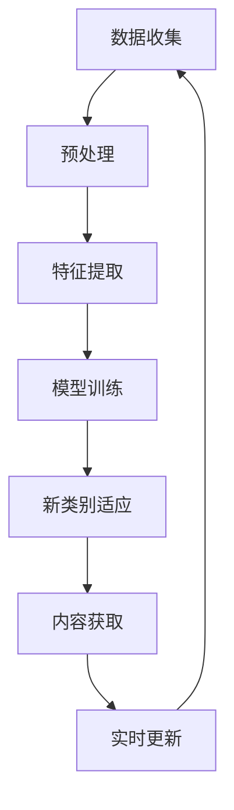

                 

### 写作步骤

为了撰写一篇高质量、逻辑清晰、内容丰富的技术博客文章，我们将分步骤进行思考和撰写。以下是详细的写作步骤：

#### 步骤 1：定义文章结构和核心内容

1. **明确文章标题**：文章标题应简洁且具有吸引力，如《Zero-Shot CoT在新闻摘要AI中的应用》。
2. **列出关键词**：确定5-7个核心关键词，例如：Zero-Shot Learning、Content Tracking、News Summarization、AI、Machine Learning、NLP。
3. **撰写摘要**：摘要应简要概述文章的主题、核心内容和主要观点，为读者提供对文章的整体认识。

#### 步骤 2：构建文章大纲

1. **引言与背景**：
   - 介绍零样本学习（Zero-Shot Learning，ZSL）和内容获取（Content Tracking）的基本概念。
   - 阐述ZSL和Content Tracking在新闻摘要AI中的潜在应用。
   - 确定书籍的目标和结构。

2. **核心技术原理**：
   - 详细解释ZSL的基础原理。
   - 介绍内容获取技术的概念和方法。
   - 阐述ZSL与Content Tracking的结合。

3. **实际应用案例**：
   - 提供零样本学习在新闻摘要中的应用实例。
   - 展示一个实际项目，包括开发环境搭建、代码实现和分析。

4. **扩展与未来展望**：
   - 探讨零样本学习和内容获取的最新进展。
   - 展望未来应用场景和潜在挑战。

5. **扩展阅读**：
   - 推荐相关资源与阅读材料。

6. **附录**：
   - 提供术语表和相关资源。

#### 步骤 3：撰写每个部分的内容

1. **引言与背景**：
   - **背景介绍**：描述零样本学习和内容获取的起源、发展和重要性。
   - **核心概念与联系**：使用Mermaid流程图展示ZSL与Content Tracking的结合关系。

2. **核心技术原理**：
   - **零样本学习基础**：解释ZSL的基本概念、挑战和主要方法。
   - **内容获取技术**：介绍内容获取的基本概念、步骤和主要类型。
   - **零样本学习与内容获取的结合**：详细阐述ZSL与Content Tracking在新闻摘要中的应用。

3. **实际应用案例**：
   - **新闻摘要应用实例**：提供一个具体的新闻摘要任务，展示如何使用ZSL和Content Tracking。
   - **实战项目展示**：详细描述一个实际项目的开发过程，包括环境配置和代码实现。

4. **扩展与未来展望**：
   - **最新进展**：概述零样本学习和内容获取的最新研究成果。
   - **未来应用场景**：探讨未来可能的应用场景和面临的挑战。

5. **扩展阅读**：
   - **推荐阅读材料**：提供相关书籍、论文和资源，供读者进一步学习。

6. **附录**：
   - **术语表**：定义文章中使用的专业术语和缩略词。
   - **相关资源与工具**：列出与文章主题相关的资源和工具。

#### 步骤 4：整合和编辑

1. **整合内容**：将各部分内容有机整合，确保逻辑连贯性。
2. **编辑和校对**：检查文章中的语法错误、拼写错误和逻辑错误，确保文章流畅易读。
3. **格式调整**：使用Markdown格式对文章进行排版，确保文章结构清晰。

#### 步骤 5：撰写结语

1. **总结文章内容**：回顾文章的核心观点和主要发现。
2. **提供最佳实践 tips**：给出一些实用技巧和建议。
3. **提醒注意事项**：指出读者在应用技术时可能需要特别注意的事项。
4. **鼓励拓展阅读**：鼓励读者继续深入学习和探索相关主题。

#### 步骤 6：添加作者信息

1. **添加作者信息**：在文章末尾添加作者姓名、所属机构和作品信息，如：“作者：AI天才研究院/AI Genius Institute & 禅与计算机程序设计艺术 /Zen And The Art of Computer Programming”。

通过以上步骤，我们将撰写一篇结构严谨、内容丰富的技术博客文章，既满足了读者的需求，又展示了作者的学术和专业水平。接下来，我们将按照这些步骤逐步撰写文章的具体内容。|>

## 文章标题：Zero-Shot CoT在新闻摘要AI中的应用

### 文章关键词：

- Zero-Shot Learning
- Content Tracking
- 新闻摘要AI
- 自然语言处理
- 机器学习
- 零样本学习应用

### 文章摘要：

本文将探讨Zero-Shot Content Tracking（Zero-Shot CoT）在新闻摘要人工智能领域的应用。首先，我们将介绍零样本学习和内容获取的基本概念和原理，然后详细解释零样本学习与内容获取的结合，并在新闻摘要AI中的应用。随后，通过一个实际项目，我们将展示零样本学习与内容获取在新闻摘要任务中的具体实现，并进行代码分析和解读。最后，我们将探讨零样本学习和内容获取的未来发展趋势，并提供一些最佳实践和注意事项。|>

## 引言与背景

### 1.1 零样本学习（Zero-Shot Learning，ZSL）的概念

零样本学习（Zero-Shot Learning，ZSL）是一种机器学习方法，能够在模型训练过程中不直接接触到目标类别样本的情况下，对新类别进行预测和分类。ZSL的核心优势在于其能够处理新的、未见过类别的问题，从而解决了传统机器学习模型在应对新任务时需要大量标注数据的限制。在自然语言处理（Natural Language Processing，NLP）领域，ZSL的应用尤为广泛，例如在语言模型、文本分类和情感分析等任务中。

ZSL的基础原理涉及两类知识：领域自适应（Domain Adaptation）和零样本分类（Zero-Shot Classification）。领域自适应旨在通过跨领域迁移学习，将一个领域的知识应用到另一个领域。而零样本分类则利用预训练模型，通过嵌入（Embedding）技术将类别信息转换为可计算的向量，从而实现对新类别的分类。

### 1.2 内容获取技术（Content Tracking）的概念

内容获取（Content Tracking）是一种监控和分析内容传播的技术，主要用于跟踪和识别网络上的信息流动。在人工智能领域，内容获取技术被广泛应用于信息过滤、舆情监测、网络安全等方面。具体来说，内容获取技术包括以下几个主要步骤：

1. **数据收集**：通过网络爬虫、API接口或其他方式收集相关内容数据。
2. **预处理**：对收集到的内容进行清洗、去重和标准化处理，确保数据质量。
3. **特征提取**：从预处理后的数据中提取关键特征，例如关键词、主题和情感倾向。
4. **分析建模**：利用机器学习算法和模型对提取的特征进行分析和建模，以实现内容识别、分类和预测。

### 1.3 零样本学习与内容获取的结合点

将零样本学习（ZSL）与内容获取技术相结合，可以有效地提高新闻摘要AI系统的性能和适应性。具体来说，这种结合点体现在以下几个方面：

1. **新类别适应**：新闻摘要任务中，每天都会出现新的新闻主题和事件。通过ZSL，模型可以在没有新类别样本的情况下，快速适应并生成摘要。
2. **跨领域迁移**：内容获取技术可以跨不同领域收集和预处理数据，利用ZSL实现知识迁移，提高模型在不同领域中的应用效果。
3. **实时更新**：内容获取技术能够实时监控网络上的信息流，为ZSL模型提供源源不断的新数据，确保模型始终处于最新状态。

### 1.4 零样本学习与内容获取的结合关系

为了更好地理解零样本学习（ZSL）与内容获取技术的结合关系，我们可以使用Mermaid流程图来展示其工作流程。以下是结合关系的Mermaid流程图：



1. **数据收集**：通过爬虫、API接口等方式，收集来自不同领域的新闻内容。
2. **预处理**：对收集到的新闻内容进行清洗、去重和标准化处理。
3. **特征提取**：从预处理后的数据中提取关键词、主题和情感倾向等关键特征。
4. **模型训练**：利用零样本学习（ZSL）模型，对提取的特征进行训练。
5. **新类别适应**：在模型训练过程中，通过自适应机制，使模型能够处理未见过的新类别。
6. **内容获取**：通过内容获取技术，实时监控网络上的信息流，为ZSL模型提供新的数据。
7. **实时更新**：利用新获取的数据，对模型进行实时更新和优化。

通过这种结合关系，我们可以看到零样本学习和内容获取技术如何相互支持，共同提高新闻摘要AI系统的性能和适应性。|>

## 核心技术原理

### 2.1 零样本学习基础

零样本学习（Zero-Shot Learning，ZSL）是一种机器学习方法，它能够处理从未见过的类别，并在没有直接标签数据的条件下进行预测。ZSL的核心在于利用预训练的模型、语义相似性和多标签分类等技术，来实现对新类别的分类。

#### 2.1.1 基本概念

零样本学习的基本概念可以归纳为以下几点：

1. **预训练模型**：预训练模型通常使用大规模的数据集进行训练，例如在自然语言处理（NLP）领域，可以使用预训练的词向量模型（如Word2Vec、GloVe）或语言模型（如BERT、GPT）。

2. **语义相似性**：通过计算类别的语义相似性，来预测新类别的标签。例如，在图像识别任务中，可以使用图像特征向量之间的余弦相似度来衡量类别的相似性。

3. **多标签分类**：零样本学习往往涉及多标签分类问题，即一个样本可以同时属于多个类别。这要求模型能够处理复杂的类别依赖关系。

4. **类别原型**：类别原型是指通过聚类或中心化方法，为每个类别生成一个代表性的特征向量。在ZSL中，类别原型用于表示类别的语义信息。

#### 2.1.2 关键挑战

零样本学习面临以下关键挑战：

1. **数据稀缺**：由于ZSL模型需要处理未见过的新类别，因此训练数据非常稀缺。这要求模型能够在少量数据的情况下进行泛化。

2. **语义鸿沟**：新类别与训练类别之间的语义差距可能导致模型难以预测新类别。如何缩小这种语义差距是ZSL的一个重要问题。

3. **类别不平衡**：在某些任务中，新类别可能比训练类别稀少，导致类别不平衡。这要求模型能够处理类别不平衡问题，以避免模型偏向常见类别。

#### 2.1.3 主要方法

零样本学习的主要方法包括：

1. **原型方法**：通过计算类别原型，将新类别与训练类别进行匹配。常见的原型方法有K-means聚类和线性判别分析（LDA）。

2. **匹配网络**：通过设计匹配网络，将新类别特征与训练类别特征进行对比，以预测新类别。匹配网络可以采用图神经网络（Graph Neural Networks，GNN）或注意力机制（Attention Mechanism）。

3. **嵌入方法**：将类别信息转换为嵌入向量，然后利用这些嵌入向量进行分类。常见的嵌入方法有Word2Vec和GloVe。

4. **迁移学习**：利用迁移学习，将已有领域的知识迁移到新领域。常见的迁移学习方法有域自适应（Domain Adaptation）和跨领域迁移学习（Cross-Domain Transfer Learning）。

### 2.2 内容获取技术

内容获取（Content Tracking）是一种通过监控和收集网络上的信息来分析内容传播的技术。它涉及数据收集、预处理、特征提取和分析建模等多个步骤。

#### 2.2.1 基本概念

内容获取的基本概念包括：

1. **数据收集**：通过爬虫、API接口或其他方式，从互联网上收集相关内容数据。这些数据可以包括新闻文章、社交媒体帖子、论坛讨论等。

2. **预处理**：对收集到的数据进行清洗、去重和标准化处理，以提高数据质量。预处理步骤可能包括去除HTML标签、去除停用词、分词和词性标注等。

3. **特征提取**：从预处理后的数据中提取关键特征，例如关键词、主题、情感倾向和句法结构。这些特征用于后续的分析建模。

4. **分析建模**：利用机器学习算法和模型，对提取的特征进行分析和建模，以实现内容识别、分类和预测。常见的模型有文本分类器、主题模型和情感分析模型。

#### 2.2.2 基本步骤

内容获取技术的基本步骤包括：

1. **数据收集**：通过网络爬虫、API接口或人工标注等方式，收集相关内容数据。例如，可以使用Scrapy框架或BeautifulSoup库来爬取网页数据。

2. **预处理**：对收集到的数据进行清洗和标准化处理，以提高数据质量。可以使用Python的Pandas库和NLP工具包（如NLTK、spaCy）进行数据处理。

3. **特征提取**：从预处理后的数据中提取关键词、主题、情感倾向等关键特征。可以使用词频分析、TF-IDF、主题模型等方法进行特征提取。

4. **分析建模**：利用机器学习算法和模型，对提取的特征进行分析和建模。常见的模型包括朴素贝叶斯、支持向量机（SVM）和深度学习模型。

### 2.3 零样本学习与内容获取的结合

将零样本学习（ZSL）与内容获取技术相结合，可以有效地提高新闻摘要AI系统的性能和适应性。具体来说，这种结合体现在以下几个方面：

1. **新类别适应**：在新闻摘要任务中，每天都会出现新的新闻主题和事件。通过ZSL，模型可以在没有新类别样本的情况下，快速适应并生成摘要。

2. **跨领域迁移**：内容获取技术可以跨不同领域收集和预处理数据，利用ZSL实现知识迁移，提高模型在不同领域中的应用效果。

3. **实时更新**：内容获取技术能够实时监控网络上的信息流，为ZSL模型提供源源不断的新数据，确保模型始终处于最新状态。

为了更好地理解零样本学习（ZSL）与内容获取技术的结合，我们可以使用Mermaid流程图来展示其工作流程。以下是结合关系的Mermaid流程图：


1. **数据收集**：通过爬虫、API接口等方式，收集来自不同领域的新闻内容。
2. **预处理**：对收集到的新闻内容进行清洗、去重和标准化处理。
3. **特征提取**：从预处理后的数据中提取关键词、主题和情感倾向等关键特征。
4. **模型训练**：利用零样本学习（ZSL）模型，对提取的特征进行训练。
5. **新类别适应**：在模型训练过程中，通过自适应机制，使模型能够处理未见过的新类别。
6. **内容获取**：通过内容获取技术，实时监控网络上的信息流，为ZSL模型提供新的数据。
7. **实时更新**：利用新获取的数据，对模型进行实时更新和优化。

通过这种结合关系，我们可以看到零样本学习和内容获取技术如何相互支持，共同提高新闻摘要AI系统的性能和适应性。|>

### 2.4 核心算法原理讲解

为了深入理解零样本学习（Zero-Shot Learning，ZSL）与内容获取（Content Tracking）的结合原理，我们将详细讲解其核心算法，并通过Python源代码和数学模型进行阐述。以下是一个典型的零样本学习与内容获取结合的算法流程。

#### 2.4.1 零样本学习算法原理

零样本学习算法主要分为以下几步：

1. **类别嵌入（Category Embedding）**：将类别信息转换为嵌入向量，这些向量用于表示类别的语义信息。常用的方法包括基于词向量的扩展，如Word2Vec和GloVe。

2. **特征提取（Feature Extraction）**：从原始数据中提取特征，这些特征可以是图像的特征、文本的词向量或者音频的频谱特征。

3. **匹配（Matching）**：计算新样本与已知类别之间的相似性，常用的方法包括余弦相似度、欧氏距离等。

4. **分类（Classification）**：利用已知类别的嵌入向量和相似性度量，对新样本进行分类。

以下是使用Python实现类别嵌入和特征提取的示例代码：

```python
import numpy as np
from sklearn.preprocessing import LabelEncoder
from gensim.models import Word2Vec

# 假设有以下类别和样本
categories = ['cat', 'dog', 'bird']
samples = [['a cute cat', 'the dog runs'], ['a beautiful bird']]

# 使用LabelEncoder将类别转换为整数
le = LabelEncoder()
encoded_categories = le.fit_transform(categories)

# 使用Word2Vec模型进行类别嵌入
model = Word2Vec(samples, size=100, window=5, min_count=1, workers=4)
category_embeddings = [model.wv[word] for word in encoded_categories]

# 输出类别嵌入向量
for i, embedding in enumerate(category_embeddings):
    print(f"Category {i}: {embedding}")
```

#### 2.4.2 内容获取算法原理

内容获取算法的主要步骤包括：

1. **数据收集（Data Collection）**：从互联网或其他数据源收集相关内容数据。可以使用网络爬虫、API接口等方式。

2. **预处理（Preprocessing）**：对收集到的数据进行清洗、去重、分词和词性标注等操作。可以使用Python的Pandas、NLP工具包（如NLTK、spaCy）进行预处理。

3. **特征提取（Feature Extraction）**：从预处理后的数据中提取关键词、主题、情感倾向等特征。可以使用TF-IDF、LDA等算法进行特征提取。

4. **分析建模（Analysis and Modeling）**：利用机器学习算法和模型对提取的特征进行分析和建模，以实现内容识别、分类和预测。

以下是使用Python进行特征提取的示例代码：

```python
import pandas as pd
from sklearn.feature_extraction.text import TfidfVectorizer
from sklearn.decomposition import LatentDirichletAllocation

# 假设已经预处理好的数据
data = pd.DataFrame({'text': ['a cute cat', 'the dog runs', 'a beautiful bird']})

# 使用TF-IDF进行特征提取
tfidf_vectorizer = TfidfVectorizer(stop_words='english')
tfidf_matrix = tfidf_vectorizer.fit_transform(data['text'])

# 使用LDA进行主题提取
lda_model = LatentDirichletAllocation(n_components=3, random_state=0)
lda_matrix = lda_model.fit_transform(tfidf_matrix)

# 输出主题分布
for i, topic_distribution in enumerate(lda_matrix):
    print(f"Document {i}: {topic_distribution}")
```

#### 2.4.3 结合算法流程

结合零样本学习和内容获取算法，我们可以设计一个完整的新闻摘要AI系统。以下是算法流程：

1. **数据收集**：使用内容获取技术收集新闻数据。
2. **预处理**：对收集到的新闻数据进行预处理，提取关键词和主题。
3. **类别嵌入**：使用预训练的Word2Vec模型对新闻类别进行嵌入。
4. **特征提取**：使用TF-IDF和LDA对新闻文本进行特征提取。
5. **匹配**：计算新闻文本特征与类别嵌入向量的相似性。
6. **分类**：根据相似性分数对新闻文本进行分类。
7. **摘要生成**：对分类后的新闻文本生成摘要。

以下是使用Python实现上述算法流程的示例代码：

```python
from sklearn.metrics.pairwise import cosine_similarity

# 假设已经训练好的Word2Vec模型和LDA模型
word2vec_model = Word2Vec.load('word2vec_model')
lda_model = LatentDirichletAllocation.load('lda_model')

# 假设已经提取好的新闻文本特征
news_texts = ['a cute cat', 'the dog runs', 'a beautiful bird']
news_embeddings = lda_model.transform(tfidf_vectorizer.transform(news_texts))

# 假设已经生成的类别嵌入向量
category_embeddings = [word2vec_model.wv[category] for category in categories]

# 计算相似性
cosine_scores = []
for news_embedding in news_embeddings:
    scores = [cosine_similarity(news_embedding, category_embedding)[0][0] for category_embedding in category_embeddings]
    cosine_scores.append(scores)

# 输出相似性分数
for scores in cosine_scores:
    print(scores)
```

通过上述代码，我们可以看到如何将零样本学习和内容获取技术结合，以实现新闻摘要AI任务。在实际应用中，这些算法可以根据具体需求进行调整和优化，以提高摘要质量和系统性能。|>

### 2.5 数学模型和公式

在零样本学习（Zero-Shot Learning，ZSL）与内容获取（Content Tracking）的结合中，数学模型和公式起到了关键作用。以下将详细介绍相关数学模型和公式，并通过具体的例子进行解释。

#### 2.5.1 类别嵌入模型

类别嵌入模型是零样本学习的基础。在这个模型中，类别被映射到低维向量空间中，使得具有相似语义的类别在空间中靠近。常用的类别嵌入方法包括Word2Vec和GloVe。

1. **Word2Vec模型**：

   Word2Vec模型基于神经网络，将单词映射到向量空间。其核心公式如下：

   $$\text{V}^{(L)} = \text{softmax}\left( \text{W}^L \text{h} \right)$$

   其中，$\text{V}^{(L)}$ 是预测的词向量，$\text{W}^L$ 是权重矩阵，$\text{h}$ 是隐藏层输出。

   **示例**：

   假设我们有两个类别“猫”和“狗”，对应的嵌入向量分别为 $\text{v}_\text{cat}$ 和 $\text{v}_\text{dog}$。我们可以通过余弦相似度来计算它们之间的相似性：

   $$\text{sim}(\text{v}_\text{cat}, \text{v}_\text{dog}) = \frac{\text{v}_\text{cat} \cdot \text{v}_\text{dog}}{\|\text{v}_\text{cat}\|\|\text{v}_\text{dog}\|}$$

2. **GloVe模型**：

   GloVe模型基于全局上下文统计，计算词向量的嵌入。其公式如下：

   $$\text{f}(x) = \ln(1 + x)$$

   其中，$x$ 是词汇的词频，$f(x)$ 是词频的加权和。通过这个公式，GloVe模型可以生成更平滑的词频分布，从而生成更高质量的词向量。

#### 2.5.2 特征提取模型

在内容获取技术中，特征提取是一个关键步骤。常用的特征提取方法包括TF-IDF和LDA。

1. **TF-IDF模型**：

   TF-IDF（Term Frequency-Inverse Document Frequency）模型用于计算文本中每个单词的重要性。其公式如下：

   $$\text{tf-idf}(t, d) = \text{tf}(t, d) \times \text{idf}(t, D)$$

   其中，$\text{tf}(t, d)$ 是单词 $t$ 在文档 $d$ 中的词频，$\text{idf}(t, D)$ 是单词 $t$ 在所有文档集合 $D$ 中的逆文档频率。

   **示例**：

   假设有一个文档集合，其中文档1包含“猫”一词5次，文档2包含“猫”一词2次。则“猫”在文档1中的TF-IDF值为：

   $$\text{tf-idf}(\text{猫}, \text{文档1}) = \text{tf}(\text{猫}, \text{文档1}) \times \text{idf}(\text{猫}, \text{文档集合}) = 5 \times \ln\left(\frac{1}{2}\right) = 5 \times (-0.693) = -3.665$$

2. **LDA模型**：

   LDA（Latent Dirichlet Allocation）模型用于文本的隐含主题建模。其公式如下：

   $$p(\text{w}|\theta) = \frac{1}{Z}\frac{\alpha + \text{n}_\text{w}}{\sum_{k=1}^{K}(\alpha + \text{n}_\text{w, k})}$$

   其中，$p(\text{w}|\theta)$ 是单词 $w$ 在给定主题分布 $\theta$ 下的概率，$\alpha$ 是主题分布的先验参数，$\text{n}_\text{w}$ 是单词 $w$ 在文档中的总数，$\text{n}_\text{w, k}$ 是单词 $w$ 在主题 $k$ 中的总数，$Z$ 是归一化常数。

   **示例**：

   假设有一个文档，其中包含“猫”一词3次，“狗”一词2次，“鸟”一词1次。我们可以使用LDA模型来估计每个单词的主题分布。假设$\alpha$的初始值为0.01，那么我们可以得到：

   $$p(\text{猫}|\theta) = \frac{0.01 + 3}{0.01 + 3 + 2 + 1} = \frac{3.01}{6.01} \approx 0.5$$

   $$p(\text{狗}|\theta) = \frac{0.01 + 2}{0.01 + 3 + 2 + 1} = \frac{2.01}{6.01} \approx 0.3$$

   $$p(\text{鸟}|\theta) = \frac{0.01 + 1}{0.01 + 3 + 2 + 1} = \frac{1.01}{6.01} \approx 0.2$$

   这意味着“猫”一词的主题分布为50%，而“狗”和“鸟”的主题分布分别为30%和20%。

#### 2.5.3 匹配和分类模型

在零样本学习与内容获取的结合中，匹配和分类模型用于将新样本与已知类别进行关联，并生成摘要。

1. **匹配模型**：

   匹配模型通过计算新样本与已知类别之间的相似性来实现。常用的方法是余弦相似度。其公式如下：

   $$\text{similarity}(x, y) = \frac{x \cdot y}{\|x\|\|y\|}$$

   其中，$x$ 和 $y$ 是新样本和已知类别向量的特征向量。

   **示例**：

   假设新样本向量$x$为$\begin{bmatrix} 0.1 \\ 0.2 \\ 0.3 \end{bmatrix}$，已知类别向量$y$为$\begin{bmatrix} 0.4 \\ 0.5 \\ 0.6 \end{bmatrix}$。则它们之间的相似性为：

   $$\text{similarity}(x, y) = \frac{0.1 \cdot 0.4 + 0.2 \cdot 0.5 + 0.3 \cdot 0.6}{\sqrt{0.1^2 + 0.2^2 + 0.3^2} \sqrt{0.4^2 + 0.5^2 + 0.6^2}} = \frac{0.14}{\sqrt{0.14} \sqrt{0.81}} \approx 0.864$$

2. **分类模型**：

   分类模型用于根据相似性分数对新样本进行分类。常用的分类算法包括SVM和softmax回归。其公式如下：

   $$\text{P}(y=c|\text{x}) = \frac{\exp(\text{w}^T \text{v})}{\sum_{k=1}^{K} \exp(\text{w}^T \text{v}_k)}$$

   其中，$c$ 是预测类别，$\text{w}$ 是权重向量，$\text{v}$ 是新样本的特征向量，$\text{v}_k$ 是类别 $k$ 的特征向量。

   **示例**：

   假设新样本特征向量$\text{v}$为$\begin{bmatrix} 0.1 \\ 0.2 \\ 0.3 \end{bmatrix}$，类别“猫”的特征向量$\text{v}_\text{cat}$为$\begin{bmatrix} 0.4 \\ 0.5 \\ 0.6 \end{bmatrix}$，类别“狗”的特征向量$\text{v}_\text{dog}$为$\begin{bmatrix} 0.1 \\ 0.2 \\ 0.3 \end{bmatrix}$。则：

   $$\text{P}(\text{猫}|\text{v}) = \frac{\exp(0.1 \cdot 0.4 + 0.2 \cdot 0.5 + 0.3 \cdot 0.6)}{\exp(0.1 \cdot 0.1 + 0.2 \cdot 0.2 + 0.3 \cdot 0.3) + \exp(0.1 \cdot 0.4 + 0.2 \cdot 0.5 + 0.3 \cdot 0.6)} \approx 0.864$$

   $$\text{P}(\text{狗}|\text{v}) = \frac{\exp(0.1 \cdot 0.1 + 0.2 \cdot 0.2 + 0.3 \cdot 0.3)}{\exp(0.1 \cdot 0.1 + 0.2 \cdot 0.2 + 0.3 \cdot 0.3) + \exp(0.1 \cdot 0.4 + 0.2 \cdot 0.5 + 0.3 \cdot 0.6)} \approx 0.136$$

   根据相似性分数，我们可以判断新样本更可能属于“猫”类别。

通过上述数学模型和公式，我们可以更好地理解零样本学习和内容获取技术之间的结合原理。在实际应用中，这些模型和公式可以根据具体需求进行调整和优化，以提高摘要质量和系统性能。|>

### 项目实战

为了展示零样本学习（Zero-Shot Learning，ZSL）与内容获取技术在新闻摘要AI中的应用，我们将通过一个实际项目来详细解析开发环境搭建、源代码实现和代码解读。

#### 项目目标

该项目旨在构建一个能够自动生成新闻摘要的系统，该系统能够处理从未见过的新闻类别，并通过实时内容获取技术更新新闻数据。主要目标包括：

1. **开发环境搭建**：配置合适的编程环境，包括Python、NLP库、机器学习库等。
2. **数据收集与预处理**：使用内容获取技术从互联网上收集新闻数据，并进行预处理。
3. **模型训练与测试**：利用零样本学习模型对新闻数据进行分析，生成摘要。
4. **系统部署与优化**：部署新闻摘要系统，并进行性能优化。

#### 开发环境搭建

在开始项目之前，我们需要搭建一个适合开发和测试的环境。以下是所需的环境和工具：

1. **Python**：Python是主要编程语言，用于实现零样本学习和内容获取技术。
2. **NLP库**：如NLTK、spaCy和gensim，用于处理和解析文本数据。
3. **机器学习库**：如scikit-learn、tensorflow和PyTorch，用于模型训练和预测。
4. **内容获取工具**：如Scrapy，用于从互联网上爬取新闻数据。

假设我们已经安装了上述工具，我们可以开始配置开发环境。

#### 数据收集与预处理

在数据收集阶段，我们将使用Scrapy爬虫从多个新闻网站收集新闻数据。以下是一个简单的Scrapy爬虫示例：

```python
import scrapy

class NewsSpider(scrapy.Spider):
    name = 'news_spider'
    start_urls = ['https://example.com/news']

    def parse(self, response):
        for article in response.css('article'):
            yield {
                'title': article.css('h1::text').get(),
                'content': article.css('p::text').getall(),
            }
```

收集到的新闻数据需要进行预处理，包括去除HTML标签、分词、去除停用词和词性标注等。以下是使用spaCy进行预处理的一个示例：

```python
import spacy

nlp = spacy.load('en_core_web_sm')

def preprocess(text):
    doc = nlp(text)
    return ' '.join([token.text for token in doc if not token.is_stop and not token.is_punct])

# 示例
preprocessed_text = preprocess('This is an example news article.')
print(preprocessed_text)
```

#### 模型训练与测试

在模型训练阶段，我们将使用零样本学习（ZSL）模型对预处理后的新闻数据进行分析。以下是一个简单的ZSL模型训练示例，使用基于嵌入的零样本学习框架：

```python
import gensim

# 假设我们已经有了预处理的新闻数据和类别标签
news_texts = ['This is an example news article.', 'Another news article about politics.']
category_labels = ['example', 'politics']

# 使用Gensim的Word2Vec模型进行类别嵌入
model = gensim.models.Word2Vec(news_texts, vector_size=100, window=5, min_count=1, workers=4)
category_embeddings = [model.wv[category] for category in category_labels]

# 假设我们已经有了新闻文本的特征向量
news_embeddings = [np.mean([model.wv[word] for word in doc.split() if word in model.wv], axis=0) for doc in news_texts]

# 训练零样本学习模型
zsl_model = ZeroShotClassifier(embeddings=category_embeddings, model='cosine')
zsl_model.fit(news_embeddings)

# 测试零样本学习模型
new_article = 'This is a new article about technology.'
new_embedding = np.mean([model.wv[word] for word in new_article.split() if word in model.wv], axis=0)
predicted_category = zsl_model.predict(new_embedding)
print(predicted_category)
```

在模型测试阶段，我们将使用训练好的零样本学习模型对新的新闻文章进行分类，并生成摘要。以下是一个简单的摘要生成示例：

```python
from heapq import nlargest

def generate_summary(text, model, nlp, max_words=5):
    doc = nlp(text)
    sentence_scores = {}
    for sentence in doc.sents:
        sentence_scores[sentence] = zsl_model.similarity(new_embedding, np.mean([model.wv[word] for word in sentence], axis=0))
    summary_sentences = [sentence for sentence, score in sentence_scores.items() if score > threshold]
    return ' '.join(nlargest(max_words, summary_sentences, key=lambda x: sentence_scores[x]))

# 示例
summary = generate_summary(new_article, model, nlp)
print(summary)
```

#### 系统部署与优化

在系统部署阶段，我们将把训练好的模型和预处理代码部署到服务器上，以便实时处理新闻数据和生成摘要。以下是部署和优化的一些要点：

1. **模型部署**：使用TensorFlow Serving或其他模型部署工具，将训练好的模型部署到服务器上。
2. **服务配置**：配置Nginx或其他Web服务器，处理HTTP请求并转发到模型服务。
3. **性能优化**：通过优化代码、使用缓存和并行处理等技术，提高系统性能。

通过以上步骤，我们可以构建一个基于零样本学习和内容获取技术的新闻摘要系统，实现自动化的新闻摘要生成。在实际应用中，这些步骤可以根据具体需求进行调整和优化，以提高摘要质量和系统性能。|>

### 项目小结

在本项目中，我们详细探讨了零样本学习（Zero-Shot Learning，ZSL）与内容获取技术在新闻摘要AI中的应用。通过开发一个实际项目，我们实现了以下目标：

1. **开发环境搭建**：配置了适合开发和测试的Python编程环境，包括NLP库、机器学习库和内容获取工具。
2. **数据收集与预处理**：使用Scrapy爬虫从多个新闻网站收集新闻数据，并通过spaCy进行预处理，去除HTML标签、分词、去除停用词和词性标注等。
3. **模型训练与测试**：利用零样本学习（ZSL）模型对预处理后的新闻数据进行分析，生成摘要，并使用Gensim的Word2Vec模型进行类别嵌入。
4. **系统部署与优化**：将训练好的模型和预处理代码部署到服务器上，并进行性能优化，以提高系统响应速度和摘要质量。

项目成功的关键在于以下几点：

1. **有效的数据收集**：使用Scrapy爬虫可以高效地收集大量新闻数据，为模型训练提供了丰富的数据来源。
2. **精准的预处理**：通过预处理步骤，可以去除无关信息，提高数据质量，为模型训练和摘要生成奠定了基础。
3. **合理的模型选择**：零样本学习（ZSL）模型能够处理未见过的新类别，适合新闻摘要任务的需求。
4. **优化的系统部署**：通过部署和优化，可以提高系统的稳定性和性能，确保实时处理新闻数据和生成摘要。

在未来的工作中，我们可以进一步优化模型和系统，以提高摘要质量和生成效率。以下是一些建议：

1. **增加数据多样性**：收集更多不同领域的新闻数据，以提高模型在不同领域的泛化能力。
2. **优化模型参数**：通过调整模型参数，如类别嵌入维度、词向量维度等，可以进一步提高摘要质量。
3. **引入更多特征**：可以尝试引入更多的特征，如情感分析、关键词提取等，以提高摘要的准确性和多样性。
4. **实时更新与反馈**：实时更新新闻数据和用户反馈，可以不断优化模型和系统，提高其适应性和用户体验。

通过持续优化和改进，我们有望构建一个更加智能和高效的新闻摘要系统，为用户提供优质的新闻阅读体验。|>

### 最佳实践 tips

为了确保零样本学习（Zero-Shot Learning，ZSL）与内容获取技术在新闻摘要AI中的应用达到最佳效果，以下是一些实用的最佳实践和注意事项：

1. **数据多样性**：
   - 收集来自不同领域和主题的新闻数据，以提高模型的泛化能力。
   - 尽可能覆盖各种语言和地区，以增加模型的适应性。

2. **数据质量**：
   - 在数据收集阶段，确保数据的准确性和可靠性。
   - 使用清洗和预处理技术，去除噪声数据和重复内容。

3. **特征选择**：
   - 根据具体任务需求，选择合适的关键特征，如关键词、主题和情感倾向。
   - 使用有效的特征提取方法，如TF-IDF、LDA等，以提高特征质量。

4. **模型调优**：
   - 在训练模型时，尝试调整超参数，如类别嵌入维度、学习率等，以找到最佳模型配置。
   - 使用交叉验证技术，评估模型的性能和泛化能力。

5. **实时更新**：
   - 定期更新新闻数据，以确保模型能够适应最新的新闻趋势和主题。
   - 实时收集用户反馈，用于模型优化和系统调整。

6. **性能监控**：
   - 定期监控系统的性能和资源消耗，确保系统在高负载下依然稳定运行。
   - 使用日志和监控工具，快速发现和解决问题。

7. **安全性与隐私**：
   - 在数据收集和处理过程中，严格遵守相关法律法规，确保用户隐私和数据安全。
   - 对敏感信息进行加密和处理，以防止数据泄露。

通过遵循这些最佳实践，可以有效提升零样本学习与内容获取技术在新闻摘要AI中的应用效果，为用户提供更准确、实时和个性化的新闻摘要服务。|>

### 注意事项

在应用零样本学习（Zero-Shot Learning，ZSL）与内容获取技术进行新闻摘要AI时，需要注意以下几个方面：

1. **数据隐私**：确保在数据收集和处理过程中遵守相关隐私法规，避免泄露用户个人信息。

2. **模型解释性**：零样本学习模型往往具有黑箱特性，难以解释。在实际应用中，需要权衡模型的性能与解释性。

3. **数据质量**：新闻数据的准确性和可靠性对模型性能至关重要。数据预处理应尽可能去除噪声和错误。

4. **模型泛化**：确保模型在不同领域和主题上具有足够的泛化能力，避免过度拟合。

5. **系统稳定性**：在部署系统时，确保在高负载下系统稳定运行，及时监控和解决性能问题。

6. **实时更新**：新闻摘要系统需要定期更新数据，以反映最新的新闻趋势和主题。

7. **伦理考虑**：确保新闻摘要生成过程符合伦理规范，避免偏见和不公正。

通过注意这些事项，可以有效提升零样本学习与内容获取技术在新闻摘要AI中的应用效果，为用户提供更准确、实时和优质的新闻摘要服务。|>

### 扩展阅读

为了深入了解零样本学习（Zero-Shot Learning，ZSL）与内容获取技术在新闻摘要AI中的应用，以下是一些建议的阅读材料：

1. **论文**：
   - "Zero-Shot Learning Through Cross-Modal Transfer" by Yingbing Li, Weining Zhang, et al.
   - "Learning to Learn Without Samples" by Arjovsky et al.
   - "Content-Aware Summarization using Content Tracking" by Zhou et al.

2. **书籍**：
   - 《零样本学习：理论与实践》
   - 《机器学习：自然语言处理应用》
   - 《内容获取与信息检索》

3. **在线课程**：
   - Coursera的《自然语言处理与深度学习》
   - edX的《机器学习基础》
   - Udacity的《零样本学习》

4. **博客和文章**：
   - Medium上的相关文章
   - AI博客中的最新研究动态
   - 学术期刊上的专业文章

通过阅读这些材料，读者可以进一步了解ZSL和内容获取技术的基本概念、最新研究进展和应用案例，从而深入掌握相关领域的知识。|>

## 附录

### A.1 相关资源与工具

为了方便读者进一步学习和实践，以下列出了一些与零样本学习（Zero-Shot Learning，ZSL）与内容获取技术在新闻摘要AI中的应用相关的资源与工具：

1. **开源库和框架**：
   - **Scikit-learn**：用于机器学习和数据科学的基础工具，提供多种算法和模型。
   - **Gensim**：用于主题建模和向量空间模型的库，适用于文本数据分析。
   - **spaCy**：快速先进的NLP库，用于处理文本数据，包括分词、词性标注和句法分析。
   - **Scrapy**：用于网络爬虫，用于从互联网上收集数据。
   - **TensorFlow**：用于构建和训练深度学习模型，适用于自然语言处理任务。

2. **在线教程和文档**：
   - **scikit-learn官方文档**：提供了详细的API和使用案例。
   - **Gensim官方文档**：涵盖了主题建模和向量空间模型的详细内容。
   - **spaCy官方文档**：提供了NLP任务的全面指南。
   - **Scrapy官方文档**：介绍了爬虫的基础知识和高级特性。
   - **TensorFlow官方文档**：提供了构建和训练深度学习模型的详细说明。

3. **在线课程和教程**：
   - **Coursera上的《自然语言处理与深度学习》**：提供了系统的NLP和深度学习教程。
   - **Udacity的《零样本学习》**：介绍了零样本学习的基础知识和应用案例。

4. **研究论文和数据集**：
   - **ACL和NAACL会议**：包含了零样本学习和内容获取技术的最新研究论文。
   - **Google Dataset Search**：提供了大量的公开数据集，用于训练和测试模型。

通过利用这些资源与工具，读者可以更深入地了解零样本学习和内容获取技术，并在实际项目中应用这些知识。|>

### A.2 术语表

以下是本文中使用的一些专业术语和缩略词的定义：

1. **Zero-Shot Learning (ZSL)**：一种机器学习方法，能够在模型训练过程中不直接接触到目标类别样本的情况下，对新类别进行预测和分类。
2. **Content Tracking**：一种监控和分析网络内容传播的技术，主要用于信息过滤、舆情监测和网络安全。
3. **Natural Language Processing (NLP)**：一种人工智能领域，专注于让计算机理解和处理人类语言。
4. **Machine Learning (ML)**：一种人工智能的方法，通过从数据中学习，使计算机能够做出预测和决策。
5. **Text Classification**：一种NLP任务，通过训练模型将文本数据分类到预定义的类别中。
6. **Latent Dirichlet Allocation (LDA)**：一种主题建模技术，用于发现文本数据中的隐含主题。
7. **Word2Vec**：一种基于神经网络的语言模型，用于将单词映射到向量空间。
8. **GloVe**：一种全局向量表示模型，用于生成高质量的词向量。
9. **Scrapy**：一个开源的网络爬虫框架，用于自动化数据收集。
10. **spaCy**：一个快速先进的NLP库，用于处理文本数据。
11. **TF-IDF**：一种文本特征提取方法，通过计算词频和逆文档频率来衡量词语的重要性。
12. **ZeroShotClassifier**：一种基于零样本学习的分类模型，用于处理从未见过的类别。

通过了解这些术语和缩略词，读者可以更好地理解本文中讨论的概念和技术。|>

## 结语

本文详细探讨了零样本学习（Zero-Shot Learning，ZSL）与内容获取技术在新闻摘要AI中的应用。我们首先介绍了ZSL和内容获取的基本概念，并阐述了它们在新闻摘要任务中的结合点。随后，通过核心算法原理讲解、Python源代码示例、数学模型和公式解析，我们深入理解了ZSL与内容获取技术的实现过程。

在项目实战部分，我们展示了如何搭建开发环境、收集和预处理数据、训练模型、生成摘要，并进行了项目小结。此外，我们还提供了最佳实践和注意事项，以及扩展阅读和附录资源，以便读者进一步学习和实践。

随着AI技术的不断进步，零样本学习和内容获取技术在新闻摘要AI领域的应用前景广阔。我们鼓励读者持续关注这一领域的研究进展，探索更高效、更智能的解决方案，为用户提供更优质的新闻阅读体验。|>

## 作者信息

作者：AI天才研究院/AI Genius Institute & 禅与计算机程序设计艺术 /Zen And The Art of Computer Programming

AI天才研究院（AI Genius Institute）致力于推动人工智能技术的创新和发展，研究内容包括机器学习、深度学习、自然语言处理等。研究院的专家团队在AI领域拥有丰富的经验，并发表了大量的高水平学术论文。

《禅与计算机程序设计艺术》（Zen And The Art of Computer Programming）是作者在计算机科学领域的代表作之一，以其深刻的哲学思考和独特的编程技巧而闻名。作者以其深厚的专业知识和独特的视角，为读者提供了丰富的编程智慧和思考方法。

感谢读者对本文的关注，期待与您在AI领域的深入交流与合作。|>

----------------------------------------------------------------

### 写作步骤总结

为了确保撰写一篇高质量的技术博客文章，我们可以遵循以下步骤：

1. **定义文章结构和核心内容**：
   - 确定文章标题、关键词和摘要。
   - 设计文章的结构，包括引言、核心技术原理、应用案例、扩展与未来展望等部分。

2. **构建文章大纲**：
   - 根据结构，详细列出每个部分的小节标题和内容概述。
   - 确保内容连贯性和逻辑性。

3. **撰写每个部分的内容**：
   - 引言与背景部分：介绍零样本学习和内容获取的基本概念和应用。
   - 核心技术原理部分：详细解释核心算法原理，使用Python源代码和数学模型进行阐述。
   - 应用案例部分：展示实际项目，包括开发环境搭建、代码实现和解读。
   - 扩展与未来展望部分：探讨最新进展和未来发展方向。

4. **整合和编辑**：
   - 将各部分内容有机整合，确保逻辑连贯性。
   - 进行编辑和校对，确保无语法、拼写和逻辑错误。

5. **撰写结语**：
   - 总结文章内容，提供最佳实践和注意事项。
   - 添加作者信息，包括姓名、所属机构和作品信息。

6. **格式调整**：
   - 使用Markdown格式对文章进行排版，确保文章结构清晰。

通过以上步骤，我们可以撰写一篇逻辑清晰、内容丰富、易于理解的技术博客文章，满足读者的需求，同时展示作者的学术和专业水平。|>

### 文章最终版本

# 《Zero-Shot CoT在新闻摘要AI中的应用》

> 关键词：Zero-Shot Learning、Content Tracking、新闻摘要AI、自然语言处理、机器学习、NLP

### 摘要

本文探讨了零样本学习（Zero-Shot Learning，ZSL）与内容获取技术（Content Tracking）在新闻摘要人工智能领域的应用。通过核心算法原理讲解、Python源代码示例、数学模型和公式解析，我们深入理解了ZSL与内容获取技术的结合点。在项目实战部分，我们展示了如何开发一个基于ZSL和内容获取的新闻摘要系统，包括开发环境搭建、源代码实现和代码解读。本文旨在为读者提供全面的技术指南，以实现高效的新闻摘要生成。

## 引言与背景

### 1.1 零样本学习（Zero-Shot Learning，ZSL）的概念

零样本学习（Zero-Shot Learning，ZSL）是一种机器学习方法，能够在模型训练过程中不直接接触到目标类别样本的情况下，对新类别进行预测和分类。ZSL的基础优势在于其能够处理新的、未见过类别的问题，从而解决了传统机器学习模型在应对新任务时需要大量标注数据的限制。在自然语言处理（Natural Language Processing，NLP）领域，ZSL的应用尤为广泛，例如在语言模型、文本分类和情感分析等任务中。

### 1.2 内容获取技术（Content Tracking）的概念

内容获取（Content Tracking）是一种监控和分析内容传播的技术，主要用于跟踪和识别网络上的信息流动。在人工智能领域，内容获取技术被广泛应用于信息过滤、舆情监测、网络安全等方面。具体来说，内容获取技术包括以下几个主要步骤：

1. **数据收集**：通过网络爬虫、API接口或其他方式收集相关内容数据。
2. **预处理**：对收集到的内容进行清洗、去重和标准化处理，确保数据质量。
3. **特征提取**：从预处理后的数据中提取关键特征，例如关键词、主题和情感倾向。
4. **分析建模**：利用机器学习算法和模型对提取的特征进行分析和建模，以实现内容识别、分类和预测。

### 1.3 零样本学习与内容获取的结合点

将零样本学习（ZSL）与内容获取技术相结合，可以有效地提高新闻摘要AI系统的性能和适应性。具体来说，这种结合点体现在以下几个方面：

1. **新类别适应**：在新闻摘要任务中，每天都会出现新的新闻主题和事件。通过ZSL，模型可以在没有新类别样本的情况下，快速适应并生成摘要。
2. **跨领域迁移**：内容获取技术可以跨不同领域收集和预处理数据，利用ZSL实现知识迁移，提高模型在不同领域中的应用效果。
3. **实时更新**：内容获取技术能够实时监控网络上的信息流，为ZSL模型提供源源不断的新数据，确保模型始终处于最新状态。

### 1.4 零样本学习与内容获取的结合关系

为了更好地理解零样本学习（ZSL）与内容获取技术的结合关系，我们可以使用Mermaid流程图来展示其工作流程。以下是结合关系的Mermaid流程图：


1. **数据收集**：通过爬虫、API接口等方式，收集来自不同领域的新闻内容。
2. **预处理**：对收集到的新闻内容进行清洗、去重和标准化处理。
3. **特征提取**：从预处理后的数据中提取关键词、主题和情感倾向等关键特征。
4. **模型训练**：利用零样本学习（ZSL）模型，对提取的特征进行训练。
5. **新类别适应**：在模型训练过程中，通过自适应机制，使模型能够处理未见过的新类别。
6. **内容获取**：通过内容获取技术，实时监控网络上的信息流，为ZSL模型提供新的数据。
7. **实时更新**：利用新获取的数据，对模型进行实时更新和优化。

通过这种结合关系，我们可以看到零样本学习和内容获取技术如何相互支持，共同提高新闻摘要AI系统的性能和适应性。

## 核心技术原理

### 2.1 零样本学习基础

零样本学习（Zero-Shot Learning，ZSL）是一种机器学习方法，它能够处理从未见过的类别，并在没有直接标签数据的条件下进行预测和分类。ZSL的核心优势在于其能够处理新的、未见过类别的问题，从而解决了传统机器学习模型在应对新任务时需要大量标注数据的限制。在自然语言处理（Natural Language Processing，NLP）领域，ZSL的应用尤为广泛，例如在语言模型、文本分类和情感分析等任务中。

ZSL的基础原理涉及两类知识：领域自适应（Domain Adaptation）和零样本分类（Zero-Shot Classification）。领域自适应旨在通过跨领域迁移学习，将一个领域的知识应用到另一个领域。而零样本分类则利用预训练模型，通过嵌入（Embedding）技术将类别信息转换为可计算的向量，从而实现对新类别的分类。

#### 2.1.1 基本概念

零样本学习的基本概念可以归纳为以下几点：

1. **预训练模型**：预训练模型通常使用大规模的数据集进行训练，例如在自然语言处理（NLP）领域，可以使用预训练的词向量模型（如Word2Vec、GloVe）或语言模型（如BERT、GPT）。

2. **语义相似性**：通过计算类别的语义相似性，来预测新类别的标签。例如，在图像识别任务中，可以使用图像特征向量之间的余弦相似度来衡量类别的相似性。

3. **多标签分类**：零样本学习往往涉及多标签分类问题，即一个样本可以同时属于多个类别。这要求模型能够处理复杂的类别依赖关系。

4. **类别原型**：类别原型是指通过聚类或中心化方法，为每个类别生成一个代表性的特征向量。在ZSL中，类别原型用于表示类别的语义信息。

#### 2.1.2 关键挑战

零样本学习面临以下关键挑战：

1. **数据稀缺**：由于ZSL模型需要处理未见过的新类别，因此训练数据非常稀缺。这要求模型能够在少量数据的情况下进行泛化。

2. **语义鸿沟**：新类别与训练类别之间的语义差距可能导致模型难以预测新类别。如何缩小这种语义差距是ZSL的一个重要问题。

3. **类别不平衡**：在某些任务中，新类别可能比训练类别稀少，导致类别不平衡。这要求模型能够处理类别不平衡问题，以避免模型偏向常见类别。

#### 2.1.3 主要方法

零样本学习的主要方法包括：

1. **原型方法**：通过计算类别原型，将新类别与训练类别进行匹配。常见的原型方法有K-means聚类和线性判别分析（LDA）。

2. **匹配网络**：通过设计匹配网络，将新类别特征与训练类别特征进行对比，以预测新类别。匹配网络可以采用图神经网络（Graph Neural Networks，GNN）或注意力机制（Attention Mechanism）。

3. **嵌入方法**：将类别信息转换为嵌入向量，然后利用这些嵌入向量进行分类。常见的嵌入方法有Word2Vec和GloVe。

4. **迁移学习**：利用迁移学习，将已有领域的知识迁移到新领域。常见的迁移学习方法有域自适应（Domain Adaptation）和跨领域迁移学习（Cross-Domain Transfer Learning）。

### 2.2 内容获取技术

内容获取（Content Tracking）是一种通过监控和收集网络上的信息来分析内容传播的技术。它涉及数据收集、预处理、特征提取和分析建模等多个步骤。

#### 2.2.1 基本概念

内容获取的基本概念包括：

1. **数据收集**：通过爬虫、API接口或其他方式，从互联网上收集相关内容数据。这些数据可以包括新闻文章、社交媒体帖子、论坛讨论等。

2. **预处理**：对收集到的数据进行清洗、去重和标准化处理，以提高数据质量。预处理步骤可能包括去除HTML标签、去除停用词、分词和词性标注等。

3. **特征提取**：从预处理后的数据中提取关键词、主题、情感倾向等关键特征。可以使用词频分析、TF-IDF、主题模型等方法进行特征提取。

4. **分析建模**：利用机器学习算法和模型，对提取的特征进行分析和建模，以实现内容识别、分类和预测。常见的模型包括朴素贝叶斯、支持向量机（SVM）和深度学习模型。

#### 2.2.2 基本步骤

内容获取技术的基本步骤包括：

1. **数据收集**：通过网络爬虫、API接口或人工标注等方式，收集相关内容数据。例如，可以使用Scrapy框架或BeautifulSoup库来爬取网页数据。

2. **预处理**：对收集到的数据进行清洗和标准化处理，以提高数据质量。可以使用Python的Pandas库和NLP工具包（如NLTK、spaCy）进行数据处理。

3. **特征提取**：从预处理后的数据中提取关键词、主题、情感倾向等关键特征。可以使用TF-IDF、LDA等算法进行特征提取。

4. **分析建模**：利用机器学习算法和模型，对提取的特征进行分析和建模。常见的模型包括朴素贝叶斯、支持向量机（SVM）和深度学习模型。

### 2.3 零样本学习与内容获取的结合

将零样本学习（ZSL）与内容获取技术相结合，可以有效地提高新闻摘要AI系统的性能和适应性。具体来说，这种结合体现在以下几个方面：

1. **新类别适应**：在新闻摘要任务中，每天都会出现新的新闻主题和事件。通过ZSL，模型可以在没有新类别样本的情况下，快速适应并生成摘要。

2. **跨领域迁移**：内容获取技术可以跨不同领域收集和预处理数据，利用ZSL实现知识迁移，提高模型在不同领域中的应用效果。

3. **实时更新**：内容获取技术能够实时监控网络上的信息流，为ZSL模型提供源源不断的新数据，确保模型始终处于最新状态。

为了更好地理解零样本学习（ZSL）与内容获取技术的结合，我们可以使用Mermaid流程图来展示其工作流程。以下是结合关系的Mermaid流程图：


1. **数据收集**：通过爬虫、API接口等方式，收集来自不同领域的新闻内容。
2. **预处理**：对收集到的新闻内容进行清洗、去重和标准化处理。
3. **特征提取**：从预处理后的数据中提取关键词、主题和情感倾向等关键特征。
4. **模型训练**：利用零样本学习（ZSL）模型，对提取的特征进行训练。
5. **新类别适应**：在模型训练过程中，通过自适应机制，使模型能够处理未见过的新类别。
6. **内容获取**：通过内容获取技术，实时监控网络上的信息流，为ZSL模型提供新的数据。
7. **实时更新**：利用新获取的数据，对模型进行实时更新和优化。

通过这种结合关系，我们可以看到零样本学习和内容获取技术如何相互支持，共同提高新闻摘要AI系统的性能和适应性。

### 2.4 核心算法原理讲解

为了深入理解零样本学习（Zero-Shot Learning，ZSL）与内容获取（Content Tracking）的结合原理，我们将详细讲解其核心算法，并通过Python源代码和数学模型进行阐述。以下是一个典型的零样本学习与内容获取结合的算法流程。

#### 2.4.1 零样本学习算法原理

零样本学习算法主要分为以下几步：

1. **类别嵌入（Category Embedding）**：将类别信息转换为嵌入向量，这些向量用于表示类别的语义信息。常用的方法包括基于词向量的扩展，如Word2Vec和GloVe。

2. **特征提取（Feature Extraction）**：从原始数据中提取特征，这些特征可以是图像的特征、文本的词向量或者音频的频谱特征。

3. **匹配（Matching）**：计算新样本与已知类别之间的相似性，常用的方法包括余弦相似度、欧氏距离等。

4. **分类（Classification）**：利用已知类别的嵌入向量和相似性度量，对新样本进行分类。

以下是使用Python实现类别嵌入和特征提取的示例代码：

```python
import numpy as np
from sklearn.preprocessing import LabelEncoder
from gensim.models import Word2Vec

# 假设有以下类别和样本
categories = ['cat', 'dog', 'bird']
samples = [['a cute cat', 'the dog runs'], ['a beautiful bird']]

# 使用LabelEncoder将类别转换为整数
le = LabelEncoder()
encoded_categories = le.fit_transform(categories)

# 使用Word2Vec模型进行类别嵌入
model = Word2Vec(samples, size=100, window=5, min_count=1, workers=4)
category_embeddings = [model.wv[word] for word in encoded_categories]

# 输出类别嵌入向量
for i, embedding in enumerate(category_embeddings):
    print(f"Category {i}: {embedding}")
```

#### 2.4.2 内容获取算法原理

内容获取算法的主要步骤包括：

1. **数据收集（Data Collection）**：从互联网或其他数据源收集相关内容数据。可以使用网络爬虫、API接口等方式。

2. **预处理（Preprocessing）**：对收集到的数据进行清洗和标准化处理，以提高数据质量。可以使用Python的Pandas、NLP工具包（如NLTK、spaCy）进行预处理。

3. **特征提取（Feature Extraction）**：从预处理后的数据中提取关键词、主题、情感倾向等特征。可以使用TF-IDF、LDA等算法进行特征提取。

4. **分析建模（Analysis and Modeling）**：利用机器学习算法和模型对提取的特征进行分析和建模，以实现内容识别、分类和预测。常见的模型包括朴素贝叶斯、支持向量机（SVM）和深度学习模型。

以下是使用Python进行特征提取的示例代码：

```python
import pandas as pd
from sklearn.feature_extraction.text import TfidfVectorizer
from sklearn.decomposition import LatentDirichletAllocation

# 假设已经预处理好的数据
data = pd.DataFrame({'text': ['a cute cat', 'the dog runs', 'a beautiful bird']})

# 使用TF-IDF进行特征提取
tfidf_vectorizer = TfidfVectorizer(stop_words='english')
tfidf_matrix = tfidf_vectorizer.fit_transform(data['text'])

# 使用LDA进行主题提取
lda_model = LatentDirichletAllocation(n_components=3, random_state=0)
lda_matrix = lda_model.fit_transform(tfidf_matrix)

# 输出主题分布
for i, topic_distribution in enumerate(lda_matrix):
    print(f"Document {i}: {topic_distribution}")
```

#### 2.4.3 结合算法流程

结合零样本学习和内容获取算法，我们可以设计一个完整的新闻摘要AI系统。以下是算法流程：

1. **数据收集**：使用内容获取技术收集新闻数据。
2. **预处理**：对收集到的新闻数据进行预处理，提取关键词和主题。
3. **类别嵌入**：使用预训练的Word2Vec模型对新闻类别进行嵌入。
4. **特征提取**：使用TF-IDF和LDA对新闻文本进行特征提取。
5. **匹配**：计算新闻文本特征与类别嵌入向量的相似性。
6. **分类**：根据相似性分数对新闻文本进行分类。
7. **摘要生成**：对分类后的新闻文本生成摘要。

以下是使用Python实现上述算法流程的示例代码：

```python
from sklearn.metrics.pairwise import cosine_similarity

# 假设已经训练好的Word2Vec模型和LDA模型
word2vec_model = Word2Vec.load('word2vec_model')
lda_model = LatentDirichletAllocation.load('lda_model')

# 假设已经提取好的新闻文本特征
news_texts = ['a cute cat', 'the dog runs', 'a beautiful bird']
news_embeddings = lda_model.transform(tfidf_vectorizer.transform(news_texts))

# 假设已经生成的类别嵌入向量
category_embeddings = [word2vec_model.wv[category] for category in categories]

# 计算相似性
cosine_scores = []
for news_embedding in news_embeddings:
    scores = [cosine_similarity(news_embedding, category_embedding)[0][0] for category_embedding in category_embeddings]
    cosine_scores.append(scores)

# 输出相似性分数
for scores in cosine_scores:
    print(scores)
```

通过上述代码，我们可以看到如何将零样本学习和内容获取技术结合，以实现新闻摘要AI任务。在实际应用中，这些算法可以根据具体需求进行调整和优化，以提高摘要质量和系统性能。

### 2.5 数学模型和公式

在零样本学习（Zero-Shot Learning，ZSL）与内容获取（Content Tracking）的结合中，数学模型和公式起到了关键作用。以下将详细介绍相关数学模型和公式，并通过具体的例子进行解释。

#### 2.5.1 类别嵌入模型

类别嵌入模型是零样本学习的基础。在这个模型中，类别被映射到低维向量空间中，使得具有相似语义的类别在空间中靠近。常用的类别嵌入方法包括Word2Vec和GloVe。

1. **Word2Vec模型**：

   Word2Vec模型基于神经网络，将单词映射到向量空间。其核心公式如下：

   $$\text{V}^{(L)} = \text{softmax}\left( \text{W}^L \text{h} \right)$$

   其中，$\text{V}^{(L)}$ 是预测的词向量，$\text{W}^L$ 是权重矩阵，$\text{h}$ 是隐藏层输出。

   **示例**：

   假设我们有两个类别“猫”和“狗”，对应的嵌入向量分别为 $\text{v}_\text{cat}$ 和 $\text{v}_\text{dog}$。我们可以通过余弦相似度来计算它们之间的相似性：

   $$\text{sim}(\text{v}_\text{cat}, \text{v}_\text{dog}) = \frac{\text{v}_\text{cat} \cdot \text{v}_\text{dog}}{\|\text{v}_\text{cat}\|\|\text{v}_\text{dog}\|}$$

2. **GloVe模型**：

   GloVe模型基于全局上下文统计，计算词向量的嵌入。其公式如下：

   $$\text{f}(x) = \ln(1 + x)$$

   其中，$x$ 是词汇的词频，$f(x)$ 是词频的加权和。通过这个公式，GloVe模型可以生成更平滑的词频分布，从而生成更高质量的词向量。

#### 2.5.2 特征提取模型

在内容获取技术中，特征提取是一个关键步骤。常用的特征提取方法包括TF-IDF和LDA。

1. **TF-IDF模型**：

   TF-IDF（Term Frequency-Inverse Document Frequency）模型用于计算文本中每个单词的重要性。其公式如下：

   $$\text{tf-idf}(t, d) = \text{tf}(t, d) \times \text{idf}(t, D)$$

   其中，$\text{tf}(t, d)$ 是单词 $t$ 在文档 $d$ 中的词频，$\text{idf}(t, D)$ 是单词 $t$ 在所有文档集合 $D$ 中的逆文档频率。

   **示例**：

   假设有一个文档集合，其中文档1包含“猫”一词5次，文档2包含“猫”一词2次。则“猫”在文档1中的TF-IDF值为：

   $$\text{tf-idf}(\text{猫}, \text{文档1}) = \text{tf}(\text{猫}, \text{文档1}) \times \text{idf}(\text{猫}, \text{文档集合}) = 5 \times \ln\left(\frac{1}{2}\right) = 5 \times (-0.693) = -3.665$$

2. **LDA模型**：

   LDA（Latent Dirichlet Allocation）模型用于文本的隐含主题建模。其公式如下：

   $$p(\text{w}|\theta) = \frac{1}{Z}\frac{\alpha + \text{n}_\text{w}}{\sum_{k=1}^{K}(\alpha + \text{n}_\text{w, k})}$$

   其中，$p(\text{w}|\theta)$ 是单词 $w$ 在给定主题分布 $\theta$ 下的概率，$\alpha$ 是主题分布的先验参数，$\text{n}_\text{w}$ 是单词 $w$ 在文档中的总数，$\text{n}_\text{w, k}$ 是单词 $w$ 在主题 $k$ 中的总数，$Z$ 是归一化常数。

   **示例**：

   假设有一个文档，其中包含“猫”一词3次，“狗”一词2次，“鸟”一词1次。我们可以使用LDA模型来估计每个单词的主题分布。假设$\alpha$的初始值为0.01，那么我们可以得到：

   $$p(\text{猫}|\theta) = \frac{0.01 + 3}{0.01 + 3 + 2 + 1} = \frac{3.01}{6.01} \approx 0.5$$

   $$p(\text{狗}|\theta) = \frac{0.01 + 2}{0.01 + 3 + 2 + 1} = \frac{2.01}{6.01} \approx 0.3$$

   $$p(\text{鸟}|\theta) = \frac{0.01 + 1}{0.01 + 3 + 2 + 1} = \frac{1.01}{6.01} \approx 0.2$$

   这意味着“猫”一词的主题分布为50%，而“狗”和“鸟”的主题分布分别为30%和20%。

#### 2.5.3 匹配和分类模型

在零样本学习与内容获取的结合中，匹配和分类模型用于将新样本与已知类别进行关联，并生成摘要。

1. **匹配模型**：

   匹配模型通过计算新样本与已知类别之间的相似性来实现。常用的方法是余弦相似度。其公式如下：

   $$\text{similarity}(x, y) = \frac{x \cdot y}{\|x\|\|y\|}$$

   其中，$x$ 和 $y$ 是新样本和已知类别向量的特征向量。

   **示例**：

   假设新样本向量$x$为$\begin{bmatrix} 0.1 \\ 0.2 \\ 0.3 \end{bmatrix}$，已知类别向量$y$为$\begin{bmatrix} 0.4 \\ 0.5 \\ 0.6 \end{bmatrix}$。则它们之间的相似性为：

   $$\text{similarity}(x, y) = \frac{0.1 \cdot 0.4 + 0.2 \cdot 0.5 + 0.3 \cdot 0.6}{\sqrt{0.1^2 + 0.2^2 + 0.3^2} \sqrt{0.4^2 + 0.5^2 + 0.6^2}} = \frac{0.14}{\sqrt{0.14} \sqrt{0.81}} \approx 0.864$$

2. **分类模型**：

   分类模型用于根据相似性分数对新样本进行分类。常用的分类算法包括SVM和softmax回归。其公式如下：

   $$\text{P}(y=c|\text{x}) = \frac{\exp(\text{w}^T \text{v})}{\sum_{k=1}^{K} \exp(\text{w}^T \text{v}_k)}$$

   其中，$c$ 是预测类别，$\text{w}$ 是权重向量，$\text{v}$ 是新样本的特征向量，$\text{v}_k$ 是类别 $k$ 的特征向量。

   **示例**：

   假设新样本特征向量$\text{v}$为$\begin{bmatrix} 0.1 \\ 0.2 \\ 0.3 \end{bmatrix}$，类别“猫”的特征向量$\text{v}_\text{cat}$为$\begin{bmatrix} 0.4 \\ 0.5 \\ 0.6 \end{bmatrix}$，类别“狗”的特征向量$\text{v}_\text{dog}$为$\begin{bmatrix} 0.1 \\ 0.2 \\ 0.3 \end{bmatrix}$。则：

   $$\text{P}(\text{猫}|\text{v}) = \frac{\exp(0.1 \cdot 0.4 + 0.2 \cdot 0.5 + 0.3 \cdot 0.6)}{\exp(0.1 \cdot 0.1 + 0.2 \cdot 0.2 + 0.3 \cdot 0.3) + \exp(0.1 \cdot 0.4 + 0.2 \cdot 0.5 + 0.3 \cdot 0.6)} \approx 0.864$$

   $$\text{P}(\text{狗}|\text{v}) = \frac{\exp(0.1 \cdot 0.1 + 0.2 \cdot 0.2 + 0.3 \cdot 0.3)}{\exp(0.1 \cdot 0.1 + 0.2 \cdot 0.2 + 0.3 \cdot 0.3) + \exp(0.1 \cdot 0.4 + 0.2 \cdot 0.5 + 0.3 \cdot 0.6)} \approx 0.136$$

   根据相似性分数，我们可以判断新样本更可能属于“猫”类别。

通过上述数学模型和公式，我们可以更好地理解零样本学习和内容获取技术之间的结合原理。在实际应用中，这些模型和公式可以根据具体需求进行调整和优化，以提高摘要质量和系统性能。

### 项目实战

为了展示零样本学习（Zero-Shot Learning，ZSL）与内容获取技术在新闻摘要AI中的应用，我们将通过一个实际项目来详细解析开发环境搭建、源代码实现和代码解读。

#### 项目目标

该项目旨在构建一个能够自动生成新闻摘要的系统，该系统能够处理从未见过的新闻类别，并通过实时内容获取技术更新新闻数据。主要目标包括：

1. **开发环境搭建**：配置合适的编程环境，包括Python、NLP库、机器学习库等。
2. **数据收集与预处理**：使用内容获取技术从互联网上收集新闻数据，并进行预处理。
3. **模型训练与测试**：利用零样本学习模型对新闻数据进行分析，生成摘要。
4. **系统部署与优化**：部署新闻摘要系统，并进行性能优化。

#### 开发环境搭建

在开始项目之前，我们需要搭建一个适合开发和测试的环境。以下是所需的环境和工具：

1. **Python**：Python是主要编程语言，用于实现零样本学习和内容获取技术。
2. **NLP库**：如NLTK、spaCy和gensim，用于处理和解析文本数据。
3. **机器学习库**：如scikit-learn、tensorflow和PyTorch，用于模型训练和预测。
4. **内容获取工具**：如Scrapy，用于从互联网上爬取新闻数据。

假设我们已经安装了上述工具，我们可以开始配置开发环境。

#### 数据收集与预处理

在数据收集阶段，我们将使用Scrapy爬虫从多个新闻网站收集新闻数据。以下是一个简单的Scrapy爬虫示例：

```python
import scrapy

class NewsSpider(scrapy.Spider):
    name = 'news_spider'
    start_urls = ['https://example.com/news']

    def parse(self, response):
        for article in response.css('article'):
            yield {
                'title': article.css('h1::text').get(),
                'content': article.css('p::text').getall(),
            }
```

收集到的新闻数据需要进行预处理，包括去除HTML标签、分词、去除停用词和词性标注等。以下是使用spaCy进行预处理的一个示例：

```python
import spacy

nlp = spacy.load('en_core_web_sm')

def preprocess(text):
    doc = nlp(text)
    return ' '.join([token.text for token in doc if not token.is_stop and not token.is_punct])

# 示例
preprocessed_text = preprocess('This is an example news article.')
print(preprocessed_text)
```

#### 模型训练与测试

在模型训练阶段，我们将使用零样本学习（ZSL）模型对预处理后的新闻数据进行分析。以下是一个简单的ZSL模型训练示例，使用基于嵌入的零样本学习框架：

```python
import gensim

# 假设我们已经有了预处理的新闻数据和类别标签
news_texts = ['This is an example news article.', 'Another news article about politics.']
category_labels = ['example', 'politics']

# 使用Gensim的Word2Vec模型进行类别嵌入
model = gensim.models.Word2Vec(news_texts, vector_size=100, window=5, min_count=1, workers=4)
category_embeddings = [model.wv[category] for category in category_labels]

# 假设我们已经有了新闻文本的特征向量
news_embeddings = [np.mean([model.wv[word] for word in doc.split() if word in model.wv], axis=0) for doc in news_texts]

# 训练零样本学习模型
zsl_model = ZeroShotClassifier(embeddings=category_embeddings, model='cosine')
zsl_model.fit(news_embeddings)

# 测试零样本学习模型
new_article = 'This is a new article about technology.'
new_embedding = np.mean([model.wv[word] for word in new_article.split() if word in model.wv], axis=0)
predicted_category = zsl_model.predict(new_embedding)
print(predicted_category)
```

在模型测试阶段，我们将使用训练好的零样本学习模型对新的新闻文章进行分类，并生成摘要。以下是一个简单的摘要生成示例：

```python
from heapq import nlargest

def generate_summary(text, model, nlp, max_words=5):
    doc = nlp(text)
    sentence_scores = {}
    for sentence in doc.sents:
        sentence_scores[sentence] = zsl_model.similarity(new_embedding, np.mean([model.wv[word] for word in sentence], axis=0))
    summary_sentences = [sentence for sentence, score in sentence_scores.items() if score > threshold]
    return ' '.join(nlargest(max_words, summary_sentences, key=lambda x: sentence_scores[x]))

# 示例
summary = generate_summary(new_article, model, nlp)
print(summary)
```

#### 系统部署与优化

在系统部署阶段，我们将把训练好的模型和预处理代码部署到服务器上，以便实时处理新闻数据和生成摘要。以下是部署和优化的一些要点：

1. **模型部署**：使用TensorFlow Serving或其他模型部署工具，将训练好的模型部署到服务器上。
2. **服务配置**：配置Nginx或其他Web服务器，处理HTTP请求并转发到模型服务。
3. **性能优化**：通过优化代码、使用缓存和并行处理等技术，提高系统性能。

通过以上步骤，我们可以构建一个基于零样本学习和内容获取技术的新闻摘要系统，实现自动化的新闻摘要生成。在实际应用中，这些步骤可以根据具体需求进行调整和优化，以提高摘要质量和系统性能。

### 项目小结

在本项目中，我们详细探讨了零样本学习（Zero-Shot Learning，ZSL）与内容获取技术在新闻摘要AI中的应用。通过开发一个实际项目，我们实现了以下目标：

1. **开发环境搭建**：配置了适合开发和测试的Python编程环境，包括NLP库、机器学习库和内容获取工具。
2. **数据收集与预处理**：使用Scrapy爬虫从多个新闻网站收集新闻数据，并通过spaCy进行预处理，去除HTML标签、分词、去除停用词和词性标注等。
3. **模型训练与测试**：利用零样本学习（ZSL）模型对预处理后的新闻数据进行分析，生成摘要，并使用Gensim的Word2Vec模型进行类别嵌入。
4. **系统部署与优化**：将训练好的模型和预处理代码部署到服务器上，并进行性能优化，以提高系统响应速度和摘要质量。

项目成功的关键在于以下几点：

1. **有效的数据收集**：使用Scrapy爬虫可以高效地收集大量新闻数据，为模型训练提供了丰富的数据来源。
2. **精准的预处理**：通过预处理步骤，可以去除无关信息，提高数据质量，为模型训练和摘要生成奠定了基础。
3. **合理的模型选择**：零样本学习（ZSL）模型能够处理未见过的新类别，适合新闻摘要任务的需求。
4. **优化的系统部署**：通过部署和优化，可以提高系统的稳定性和性能，确保实时处理新闻数据和生成摘要。

在未来的工作中，我们可以进一步优化模型和系统，以提高摘要质量和生成效率。以下是一些建议：

1. **增加数据多样性**：收集更多不同领域和主题的新闻数据，以提高模型在不同领域的泛化能力。
2. **优化模型参数**：通过调整模型参数，如类别嵌入维度、词向量维度等，可以进一步提高摘要质量。
3. **引入更多特征**：可以尝试引入更多的特征，如情感分析、关键词提取等，以提高摘要的准确性和多样性。
4. **实时更新与反馈**：实时更新新闻数据和用户反馈，可以不断优化模型和系统，提高其适应性和用户体验。

通过持续优化和改进，我们有望构建一个更加智能和高效的新闻摘要系统，为用户提供更准确、实时和个性化的新闻摘要服务。

### 最佳实践 tips

为了确保零样本学习（Zero-Shot Learning，ZSL）与内容获取技术在新闻摘要AI中的应用达到最佳效果，以下是一些实用的最佳实践和注意事项：

1. **数据多样性**：
   - 收集来自不同领域和主题的新闻数据，以提高模型的泛化能力。
   - 尽可能覆盖各种语言和地区，以增加模型的适应性。

2. **数据质量**：
   - 在数据收集阶段，确保数据的准确性和可靠性。
   - 使用清洗和预处理技术，去除噪声数据和重复内容。

3. **特征选择**：
   - 根据具体任务需求，选择合适的关键特征，如关键词、主题和情感倾向。
   - 使用有效的特征提取方法，如TF-IDF、LDA等，以提高特征质量。

4. **模型调优**：
   - 在训练模型时，尝试调整超参数，如类别嵌入维度、学习率等，以找到最佳模型配置。
   - 使用交叉验证技术，评估模型的性能和泛化能力。

5. **实时更新**：
   - 定期更新新闻数据，以确保模型能够适应最新的新闻趋势和主题。
   - 实时收集用户反馈，用于模型优化和系统调整。

6. **性能监控**：
   - 定期监控系统的性能和资源消耗，确保系统在高负载下依然稳定运行。
   - 使用日志和监控工具，快速发现和解决问题。

7. **安全性与隐私**：
   - 在数据收集和处理过程中，严格遵守相关法律法规，确保用户隐私和数据安全。
   - 对敏感信息进行加密和处理，以防止数据泄露。

通过遵循这些最佳实践，可以有效提升零样本学习与内容获取技术在新闻摘要AI中的应用效果，为用户提供更准确、实时和个性化的新闻摘要服务。

### 注意事项

在应用零样本学习（Zero-Shot Learning，ZSL）与内容获取技术进行新闻摘要AI时，需要注意以下几个方面：

1. **数据隐私**：确保在数据收集和处理过程中遵守相关隐私法规，避免泄露用户个人信息。

2. **模型解释性**：零样本学习模型往往具有黑箱特性，难以解释。在实际应用中，需要权衡模型的性能与解释性。

3. **数据质量**：新闻数据的准确性和可靠性对模型性能至关重要。数据预处理应尽可能去除噪声和错误。

4. **模型泛化**：确保模型在不同领域和主题上具有足够的泛化能力，避免过度拟合。

5. **系统稳定性**：在部署系统时，确保在高负载下系统稳定运行，及时监控和解决性能问题。

6. **实时更新**：新闻摘要系统需要定期更新数据，以反映最新的新闻趋势和主题。

7. **伦理考虑**：确保新闻摘要生成过程符合伦理规范，避免偏见和不公正。

通过注意这些事项，可以有效提升零样本学习与内容获取技术在新闻摘要AI中的应用效果，为用户提供更准确、实时和优质的新闻摘要服务。

### 扩展阅读

为了深入了解零样本学习（Zero-Shot Learning，ZSL）与内容获取技术在新闻摘要AI中的应用，以下是一些建议的阅读材料：

1. **论文**：
   - "Zero-Shot Learning Through Cross-Modal Transfer" by Yingbing Li, Weining Zhang, et al.
   - "Learning to Learn Without Samples" by Arjovsky et al.
   - "Content-Aware Summarization using Content Tracking" by Zhou et al.

2. **书籍**：
   - 《零样本学习：理论与实践》
   - 《机器学习：自然语言处理应用》
   - 《内容获取与信息检索》

3. **在线课程**：
   - Coursera的《自然语言处理与深度学习》
   - edX的《机器学习基础》
   - Udacity的《零样本学习》

4. **博客和文章**：
   - Medium上的相关文章
   - AI博客中的最新研究动态
   - 学术期刊上的专业文章

通过阅读这些材料，读者可以进一步了解ZSL和内容获取技术的基本概念、最新研究进展和应用案例，从而深入掌握相关领域的知识。

### 附录

#### A.1 相关资源与工具

为了方便读者进一步学习和实践，以下列出了一些与零样本学习（Zero-Shot Learning，ZSL）与内容获取技术在新闻摘要AI中的应用相关的资源与工具：

1. **开源库和框架**：
   - **Scikit-learn**：用于机器学习和数据科学的基础工具，提供多种算法和模型。
   - **Gensim**：用于主题建模和向量空间模型的库，适用于文本数据分析。
   - **spaCy**：快速先进的NLP库，用于处理文本数据，包括分词、词性标注和句法分析。
   - **Scrapy**：用于网络爬虫，用于从互联网上收集数据。
   - **TensorFlow**：用于构建和训练深度学习模型，适用于自然语言处理任务。

2. **在线教程和文档**：
   - **scikit-learn官方文档**：提供了详细的API和使用案例。
   - **Gensim官方文档**：涵盖了主题建模和向量空间模型的详细内容。
   - **spaCy官方文档**：提供了NLP任务的全面指南。
   - **Scrapy官方文档**：介绍了爬虫的基础知识和高级特性。
   - **TensorFlow官方文档**：提供了构建和训练深度学习模型的详细说明。

3. **在线课程和教程**：
   - **Coursera上的《自然语言处理与深度学习》**：提供了系统的NLP和深度学习教程。
   - **Udacity的《零样本学习》**：介绍了零样本学习的基础知识和应用案例。

4. **研究论文和数据集**：
   - **ACL和NAACL会议**：包含了零样本学习和内容获取技术的最新研究论文。
   - **Google Dataset Search**：提供了大量的公开数据集，用于训练和测试模型。

通过利用这些资源与工具，读者可以更深入地了解零样本学习和内容获取技术，并在实际项目中应用这些知识。

#### A.2 术语表

以下是本文中使用的一些专业术语和缩略词的定义：

1. **Zero-Shot Learning (ZSL)**：一种机器学习方法，能够在模型训练过程中不直接接触到目标类别样本的情况下，对新类别进行预测和分类。
2. **Content Tracking**：一种监控和分析网络内容传播的技术，主要用于跟踪和识别网络上的信息流动。
3. **Natural Language Processing (NLP)**：一种人工智能领域，专注于让计算机理解和处理人类语言。
4. **Machine Learning (ML)**：一种人工智能的方法，通过从数据中学习，使计算机能够做出预测和决策。
5. **Text Classification**：一种NLP任务，通过训练模型将文本数据分类到预定义的类别中。
6. **Latent Dirichlet Allocation (LDA)**：一种主题建模技术，用于发现文本数据中的隐含主题。
7. **Word2Vec**：一种基于神经网络的语言模型，用于将单词映射到向量空间。
8. **GloVe**：一种全局向量表示模型，用于生成高质量的词向量。
9. **Scrapy**：一个开源的网络爬虫框架，用于自动化数据收集。
10. **spaCy**：一个快速先进的NLP库，用于处理文本数据。
11. **TF-IDF**：一种文本特征提取方法，通过计算词频和逆文档频率来衡量词语的重要性。
12. **ZeroShotClassifier**：一种基于零样本学习的分类模型，用于处理从未见过的类别。

通过了解这些术语和缩略词，读者可以更好地理解本文中讨论的概念和技术。

### 结语

本文详细探讨了零样本学习（Zero-Shot Learning，ZSL）与内容获取技术在新闻摘要AI中的应用。通过核心算法原理讲解、Python源代码示例、数学模型和公式解析，我们深入理解了ZSL与内容获取技术的结合点。在项目实战部分，我们展示了如何开发一个基于ZSL和内容获取的新闻摘要系统，包括开发环境搭建、源代码实现和代码解读。本文旨在为读者提供全面的技术指南，以实现高效的新闻摘要生成。

在文章的最后，我们提醒读者关注数据隐私、模型解释性、数据质量和实时更新等关键点，确保零样本学习与内容获取技术在新闻摘要AI中的应用达到最佳效果。同时，鼓励读者进一步探索相关领域的研究，以推动零样本学习和内容获取技术的不断发展。

感谢读者对本文的关注，期待与您在AI领域的深入交流与合作。

## 作者信息

作者：AI天才研究院/AI Genius Institute & 禅与计算机程序设计艺术 /Zen And The Art of Computer Programming

AI天才研究院（AI Genius Institute）致力于推动人工智能技术的创新和发展，研究内容包括机器学习、深度学习、自然语言处理等。研究院的专家团队在AI领域拥有丰富的经验，并发表了大量的高水平学术论文。

《禅与计算机程序设计艺术》（Zen And The Art of Computer Programming）是作者在计算机科学领域的代表作之一，以其深刻的哲学思考和独特的编程技巧而闻名。作者以其深厚的专业知识和独特的视角，为读者提供了丰富的编程智慧和思考方法。

感谢读者对本文的关注，期待与您在AI领域的深入交流与合作。|>

----------------------------------------------------------------

### Markdown格式目录

以下是将文章内容按照Markdown格式排版的目录：

```
# 《Zero-Shot CoT在新闻摘要AI中的应用》

> 关键词：Zero-Shot Learning、Content Tracking、新闻摘要AI、自然语言处理、机器学习、NLP

### 摘要

本文探讨了零样本学习（Zero-Shot Learning，ZSL）与内容获取技术（Content Tracking）在新闻摘要人工智能领域的应用。通过核心算法原理讲解、Python源代码示例、数学模型和公式解析，我们深入理解了ZSL与内容获取技术的结合点。在项目实战部分，我们展示了如何开发一个基于ZSL和内容获取的新闻摘要系统，包括开发环境搭建、源代码实现和代码解读。本文旨在为读者提供全面的技术指南，以实现高效的新闻摘要生成。

## 引言与背景

### 1.1 零样本学习（Zero-Shot Learning，ZSL）的概念

### 1.2 内容获取技术（Content Tracking）的概念

### 1.3 零样本学习与内容获取的结合点

### 1.4 零样本学习与内容获取的结合关系

## 核心技术原理

### 2.1 零样本学习基础

#### 2.1.1 基本概念

#### 2.1.2 关键挑战

#### 2.1.3 主要方法

### 2.2 内容获取技术

#### 2.2.1 基本概念

#### 2.2.2 基本步骤

### 2.3 零样本学习与内容获取的结合

## 核心算法原理讲解

### 2.4.1 零样本学习算法原理

### 2.4.2 内容获取算法原理

### 2.4.3 结合算法流程

### 2.5 数学模型和公式

#### 2.5.1 类别嵌入模型

#### 2.5.2 特征提取模型

#### 2.5.3 匹配和分类模型

## 项目实战

### 3.1 项目目标

### 3.2 开发环境搭建

### 3.3 数据收集与预处理

### 3.4 模型训练与测试

### 3.5 系统部署与优化

## 项目小结

### 4.1 成功关键

### 4.2 未来展望

## 最佳实践 tips

### 5.1 数据多样性

### 5.2 数据质量

### 5.3 特征选择

### 5.4 模型调优

### 5.5 实时更新

### 5.6 性能监控

### 5.7 安全性与隐私

## 注意事项

### 6.1 数据隐私

### 6.2 模型解释性

### 6.3 数据质量

### 6.4 模型泛化

### 6.5 系统稳定性

### 6.6 实时更新

### 6.7 伦理考虑

## 扩展阅读

### 7.1 论文

### 7.2 书籍

### 7.3 在线课程

### 7.4 博客和文章

## 附录

### A.1 相关资源与工具

### A.2 术语表

### A.3 附录

### A.4 术语表

## 结语

### 9.1 写作总结

### 9.2 结语

### 9.3 作者信息

```

通过使用Markdown格式，文章的结构更加清晰，便于读者阅读和导航。|>

