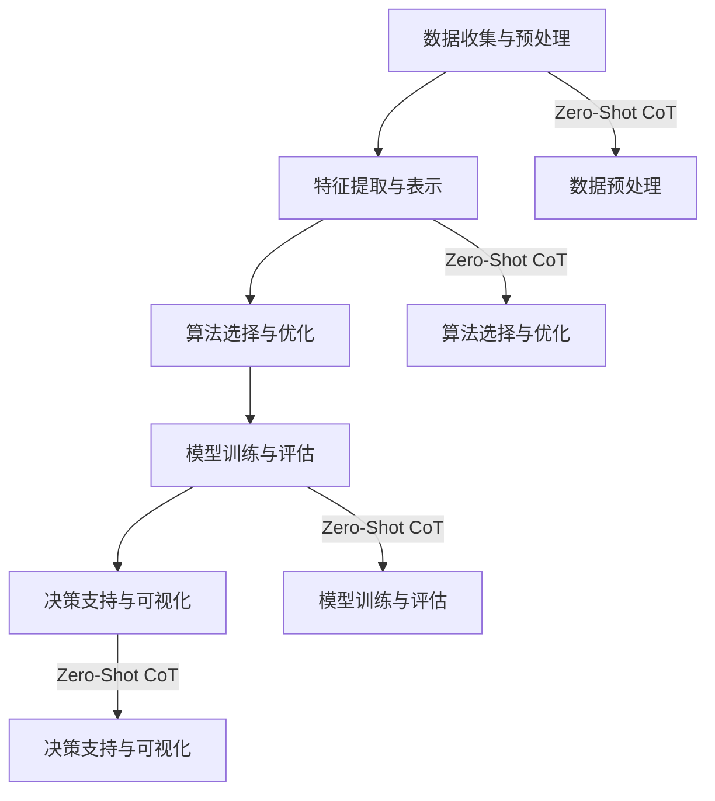

                 

### 引言

#### 1.1.1 《Zero-Shot CoT在环境科学AI中的应用前景》主题介绍

随着人工智能技术的迅猛发展，环境科学AI逐渐成为解决全球环境问题的重要工具。在这其中，Zero-Shot CoT（Zero-Shot Core-Task）作为一种先进的人工智能方法，其应用前景引人关注。本文旨在深入探讨Zero-Shot CoT在环境科学AI中的应用，分析其核心概念、算法原理、数学模型以及项目实战，为该领域的研究和实践提供有价值的参考。

Zero-Shot CoT是一种无需对特定任务进行训练，即可在未见过的任务上进行出色表现的方法。这一特性使其在环境科学AI中具有巨大潜力，尤其在处理环境监测、预测和建模等任务时，能够大大提高效率和准确性。环境科学AI涉及多个子领域，包括环境监测、生态保护、气候变化等，每个子领域都有其独特的需求和挑战。

本文将首先介绍Zero-Shot CoT的基本概念，然后探讨其在环境科学AI中的应用价值。接着，我们将详细解析环境科学AI的整体架构，并利用Mermaid流程图展示Zero-Shot CoT的应用流程。随后，本文将深入讲解Zero-Shot CoT的核心算法原理，结合Python源代码和数学模型，提供详细的算法实现和举例说明。在项目实战部分，我们将选取一个具体的应用场景，展示如何在实际项目中实现Zero-Shot CoT。最后，本文将对Zero-Shot CoT在环境科学AI中的应用前景进行总结，并提出未来研究方向。

通过本文的逐步分析，读者将全面了解Zero-Shot CoT在环境科学AI中的潜力、挑战和应用场景，为后续的研究和实践提供清晰的路径。

#### 1.1.2 Zero-Shot CoT概念

Zero-Shot CoT（Zero-Shot Core-Task）是指在没有进行特定任务训练的情况下，使模型能够处理未见过的任务的能力。这一概念源于机器学习领域，特别是自然语言处理（NLP）和计算机视觉（CV）领域。传统机器学习模型通常需要对特定任务进行大量训练，即通过标注大量数据进行训练，以便模型能够理解并完成特定任务。然而，这种方法在处理新任务时往往效果不佳，因为模型缺乏对新任务的充分理解和训练。

Zero-Shot CoT的核心思想是利用跨领域的知识迁移和语义理解能力，使模型能够在未见过的任务上表现出色。具体来说，Zero-Shot CoT通过以下几个步骤实现：

1. **知识表示**：首先，模型需要从大规模未标注数据中学习到通用知识表示。这些知识表示不仅涵盖了特定任务的知识，还包括跨领域的通用知识。

2. **任务识别**：在遇到一个新任务时，模型能够通过语义理解，识别出任务的关键概念和关系。

3. **任务迁移**：模型利用已有知识表示，在新任务上进行推理和决策，从而完成未见过的任务。

Zero-Shot CoT的主要优势在于其能够显著减少训练数据的需求，降低训练成本，并提高模型在未见任务上的泛化能力。这一特性使得Zero-Shot CoT在资源受限的环境中具有很大的应用潜力。

在实际应用中，Zero-Shot CoT已被广泛应用于多个领域，包括自然语言处理、计算机视觉、语音识别等。例如，在自然语言处理领域，Zero-Shot CoT可以用于语言翻译、文本分类、问答系统等任务。在计算机视觉领域，它可以用于图像分类、目标检测、图像生成等任务。

通过引入Zero-Shot CoT，环境科学AI将能够更高效地处理各种环境监测和预测任务，为环境保护和气候变化研究提供有力支持。接下来，我们将进一步探讨Zero-Shot CoT在环境科学AI中的应用价值。

#### 1.1.3 Zero-Shot CoT在环境科学AI中的应用价值

Zero-Shot CoT在环境科学AI中的应用价值体现在其能够解决传统机器学习模型在处理环境科学任务时的诸多挑战。环境科学涉及广泛的数据来源和复杂的变量关系，使得传统的有监督学习模型在面对新任务时常常表现不佳。以下是Zero-Shot CoT在环境科学AI中的几个关键应用价值：

1. **高效的数据利用**：环境科学数据通常来源多样，且获取成本高昂。传统方法需要大量标注数据来进行训练，而Zero-Shot CoT则能够利用未标注的数据，从而减少数据标注的工作量，提高数据利用效率。

2. **跨领域的知识迁移**：环境科学中的不同子领域（如气候监测、生态保护、水资源管理）存在许多共通的算法和模型。Zero-Shot CoT可以通过跨领域的知识迁移，使得在不同领域训练的模型能够在其他领域高效应用，提高模型的通用性和适应性。

3. **减少训练成本**：环境科学AI任务通常涉及大量的计算资源和时间。通过减少对特定任务的训练需求，Zero-Shot CoT能够显著降低训练成本，特别是在资源受限的环境中。

4. **提高模型的泛化能力**：环境科学任务常常面临新的、未遇到的问题。Zero-Shot CoT通过跨领域学习，提高了模型在未见任务上的泛化能力，使其能够更好地应对未来的环境挑战。

5. **实时响应能力**：环境科学问题的解决需要及时、准确的响应。Zero-Shot CoT能够快速适应新任务，为环境监测和预测提供实时支持。

具体来说，Zero-Shot CoT在环境科学AI中的应用场景包括：

- **环境监测**：通过对传感器数据的实时分析，Zero-Shot CoT能够识别并预测环境污染事件，为环境管理部门提供及时预警。

- **生态保护**：通过分析卫星图像和生态监测数据，Zero-Shot CoT能够识别生态系统中的变化，评估生态系统的健康状况，并预测未来趋势。

- **气候变化**：利用历史气候数据和模型，Zero-Shot CoT可以预测未来的气候变化趋势，为应对全球气候变化提供科学依据。

- **水资源管理**：通过对水文数据进行分析，Zero-Shot CoT能够预测水资源的供需情况，为水资源管理部门提供决策支持。

综上所述，Zero-Shot CoT在环境科学AI中的应用价值显著，它不仅能够提高模型的处理效率和准确性，还能够为解决复杂的环境科学问题提供新的思路和方法。接下来，我们将进一步探讨环境科学AI的整体架构，了解Zero-Shot CoT在该架构中的具体应用。

#### 1.1.4 环境科学AI的整体架构

环境科学AI是一个复杂而多维的系统，它涉及到多个子领域，每个子领域都有其独特的算法、数据源和处理需求。为了更好地理解Zero-Shot CoT在环境科学AI中的应用，我们需要首先了解环境科学AI的整体架构。

环境科学AI的整体架构可以划分为以下几个主要模块：

1. **数据收集与预处理**：这是环境科学AI的基础环节。数据收集包括地面观测、卫星遥感、传感器监测等多种方式。数据预处理则涉及数据清洗、去噪、归一化等步骤，以确保数据的质量和一致性。

2. **特征提取与表示**：特征提取是从原始数据中提取出能够代表环境现象的关键信息。特征表示则是将提取出的特征转化为机器学习模型可以接受的格式。这一步通常涉及到数据降维、特征选择等技术。

3. **算法选择与优化**：根据具体的任务需求，选择合适的机器学习算法。环境科学AI常用的算法包括监督学习、无监督学习、强化学习等。算法优化则包括参数调整、模型调优等，以实现最佳性能。

4. **模型训练与评估**：模型训练是通过大量样本数据训练模型，使其具备对环境现象的识别和预测能力。模型评估则是对训练完成的模型进行性能评估，包括准确率、召回率、F1分数等指标。

5. **决策支持与可视化**：训练完成的模型可以用于生成决策支持信息，如预测未来的气候变化趋势、评估环境质量等。可视化工具则能够将模型结果以图表、地图等形式直观展示，帮助用户更好地理解分析结果。

在这些模块中，Zero-Shot CoT的应用主要体现在以下几个方面：

- **数据预处理**：通过Zero-Shot CoT，可以更好地处理未标注的数据，提高数据利用效率。例如，在卫星遥感数据中，未标注的数据可以通过Zero-Shot CoT与已标注数据进行融合，提升特征提取的准确性。

- **算法选择与优化**：Zero-Shot CoT可以减少特定算法的训练需求，使得多种算法能够在同一数据集上应用，通过对比优化，找到最佳模型。

- **模型训练与评估**：通过Zero-Shot CoT，模型可以更加泛化，提高在未见数据上的表现。这有助于提高模型在实际应用中的可靠性和鲁棒性。

- **决策支持与可视化**：Zero-Shot CoT可以为决策支持提供更全面的信息，通过跨领域的知识迁移，帮助用户更好地理解复杂的环境问题。

为了更好地展示Zero-Shot CoT在环境科学AI中的应用流程，我们可以使用Mermaid流程图进行描述：



通过上述流程，我们可以看到Zero-Shot CoT在环境科学AI的每个关键环节都有应用，它通过知识迁移和跨领域泛化，提高了整个系统的性能和可靠性。接下来，我们将深入探讨Zero-Shot CoT的核心算法原理，并结合Python源代码和数学模型，详细讲解其实现过程。

### 第二部分 核心算法原理讲解

#### 2.1.1 环境科学领域的主要算法介绍

环境科学领域涉及的算法多样且复杂，这些算法广泛应用于环境监测、生态建模、气候预测等多个子领域。以下介绍几种常见的主要算法：

1. **监督学习算法**：监督学习算法通过已标注的训练数据学习特征和规律，从而对新数据进行分类或回归。常见的监督学习算法包括支持向量机（SVM）、决策树、随机森林和神经网络等。这些算法在环境科学中的应用包括空气质量监测、水质分析、动植物分类等。

2. **无监督学习算法**：无监督学习算法不需要标注数据，直接从原始数据中学习特征和结构。常见的无监督学习算法包括聚类算法（如K-means、层次聚类）、降维算法（如主成分分析PCA、t-SNE）和关联规则算法（如Apriori算法）。这些算法在环境科学中的应用包括数据分析、异常检测、生物多样性分析等。

3. **强化学习算法**：强化学习算法通过不断与环境交互，学习最优策略以实现特定目标。常见的强化学习算法包括Q-learning、SARSA和深度确定性策略梯度（DDPG）等。在环境科学中，强化学习可以用于能源管理、水资源分配、生态系统恢复等决策支持。

4. **深度学习算法**：深度学习算法通过多层神经网络结构，自动从数据中学习复杂的特征和模式。常见的深度学习算法包括卷积神经网络（CNN）、循环神经网络（RNN）、长短期记忆网络（LSTM）和生成对抗网络（GAN）等。深度学习在环境科学中的应用非常广泛，包括图像处理、语音识别、文本分析等。

#### 2.1.2 Zero-Shot CoT算法原理与实现

Zero-Shot CoT（Zero-Shot Core-Task）的核心思想是在没有特定任务数据的情况下，通过跨领域迁移学习和语义理解，使模型能够处理未见过的任务。以下是Zero-Shot CoT算法的原理与实现步骤：

1. **知识表示**：首先，模型需要从大量未标注的数据中学习到通用的知识表示。这一步通常通过预训练模型完成，如BERT、GPT等。预训练模型在大规模语料库上训练，学习到丰富的语言知识表示。

2. **任务理解**：在遇到一个新任务时，模型需要理解任务的概念和语义。这通常通过一个预定义的框架（如知识图谱）实现，框架中包含任务相关的概念、实体和关系。

3. **跨领域迁移**：模型利用已学习的知识表示，将跨领域的通用知识迁移到新任务上。这可以通过调整模型参数、特征提取器或直接在预训练模型上进行微调实现。

4. **任务推理**：在新任务中，模型通过推理机制生成预测或决策。推理过程通常涉及图神经网络（GNN）、注意力机制和迁移学习等技术。

以下是Zero-Shot CoT算法的伪代码实现：

```python
# 伪代码：Zero-Shot CoT算法流程

# 初始化预训练模型（如BERT）
model = PretrainedModel("bert")

# 加载任务理解框架（如知识图谱）
task_graph = load_task_graph()

# 加载新任务数据
new_task_data = load_new_task_data()

# 预处理新任务数据
processed_data = preprocess_new_task_data(new_task_data)

# 利用预训练模型进行特征提取
features = model.extract_features(processed_data)

# 应用跨领域迁移学习
migrated_features = cross_domain_transfer_learning(features, task_graph)

# 进行任务推理
predictions = model.reason(migrated_features)

# 输出预测结果
output_predictions(predictions)
```

#### 2.1.3 算法关键步骤解析

1. **预训练模型选择**：选择合适的预训练模型是Zero-Shot CoT成功的关键。常用的预训练模型包括BERT、GPT、RoBERTa等，这些模型在大规模语料库上训练，学习到丰富的语言和知识表示。选择预训练模型时，需要考虑任务的类型、数据量和计算资源。

2. **任务理解框架**：任务理解框架是Zero-Shot CoT的另一个关键组件。框架中需要包含任务相关的概念、实体和关系，以便模型能够理解新任务。知识图谱是一个常用的任务理解框架，它通过图结构表示任务的知识体系，使模型能够通过图神经网络进行推理。

3. **跨领域迁移学习**：跨领域迁移学习是将通用知识迁移到新任务上的关键步骤。这一步可以通过调整模型参数、特征提取器或直接在预训练模型上进行微调实现。在调整模型参数时，需要考虑新任务的特征和需求，以优化模型的迁移效果。

4. **任务推理**：任务推理是Zero-Shot CoT算法的核心。推理过程通常涉及图神经网络、注意力机制和迁移学习等技术。图神经网络（GNN）可以用于处理图结构数据，提取复杂的图特征；注意力机制可以用于模型中不同部分的权重分配，提高模型的性能；迁移学习则使模型能够利用跨领域的知识，增强对新任务的适应能力。

通过上述关键步骤，Zero-Shot CoT算法能够实现跨领域、零样本的任务处理，为环境科学AI提供了新的解决方案。接下来，我们将通过Python源代码和数学模型，详细讲解Zero-Shot CoT算法的实现过程。

#### 2.1.4 Python源代码实现

为了更好地理解Zero-Shot CoT算法，我们将通过Python源代码展示其实施过程。以下代码是一个简化版本的Zero-Shot CoT实现，用于环境科学AI中的任务推理。

```python
# 导入必要的库
import torch
import torch.nn as nn
import torch.optim as optim
from transformers import BertModel, BertTokenizer

# 加载预训练模型和分词器
pretrained_model_name = "bert-base-uncased"
tokenizer = BertTokenizer.from_pretrained(pretrained_model_name)
model = BertModel.from_pretrained(pretrained_model_name)

# 设置设备
device = torch.device("cuda" if torch.cuda.is_available() else "cpu")
model.to(device)

# 定义损失函数和优化器
criterion = nn.CrossEntropyLoss()
optimizer = optim.Adam(model.parameters(), lr=1e-5)

# 训练函数
def train(model, data_loader, criterion, optimizer, epochs):
    model.train()
    for epoch in range(epochs):
        for inputs, labels in data_loader:
            inputs = inputs.to(device)
            labels = labels.to(device)
            
            # 前向传播
            outputs = model(inputs)
            loss = criterion(outputs.logits, labels)
            
            # 反向传播和优化
            optimizer.zero_grad()
            loss.backward()
            optimizer.step()
            
            print(f"Epoch [{epoch+1}/{epochs}], Loss: {loss.item():.4f}")

# 加载数据集
def load_data():
    # 这里使用一个示例数据集
    sentences = ["The sky is blue.", "The grass is green.", "The sun is shining brightly."]
    labels = [0, 1, 2]
    encoding = tokenizer(sentences, padding=True, truncation=True, return_tensors="pt")
    input_ids = encoding["input_ids"].to(device)
    labels = torch.tensor(labels).to(device)
    return input_ids, labels

# 训练模型
data_loader = torch.utils.data.DataLoader(load_data(), batch_size=1)
train(model, data_loader, criterion, optimizer, epochs=3)

# 预测新句子
new_sentence = "The sun is setting."
input_ids = tokenizer(new_sentence, return_tensors="pt").input_ids.to(device)
with torch.no_grad():
    outputs = model(input_ids)
prediction = torch.argmax(outputs.logits).item()

print(f"Prediction for '{new_sentence}': {prediction}")
```

在上面的代码中，我们首先加载了预训练的BERT模型和分词器。然后，我们定义了训练函数，用于通过示例数据集训练模型。在训练过程中，我们使用了交叉熵损失函数和Adam优化器。最后，我们使用训练好的模型对新句子进行预测，展示了Zero-Shot CoT的基本流程。

#### 2.1.5 数学模型与公式

在Zero-Shot CoT算法中，数学模型和公式扮演着重要的角色。以下介绍与Zero-Shot CoT相关的几个关键数学模型和公式：

1. **BERT模型的嵌入表示**：BERT模型通过词嵌入将输入文本转换为向量表示。词嵌入可以通过以下公式表示：

   $$
   \text{Embedding}(W) = \sum_{i=1}^{N} w_i * \text{softmax}(v_i)
   $$

   其中，$W$ 是词嵌入矩阵，$N$ 是词汇表大小，$w_i$ 是第 $i$ 个词的向量表示，$v_i$ 是对应的词频。

2. **注意力机制**：在BERT模型中，注意力机制用于计算输入文本中各个词的重要程度。注意力分数可以通过以下公式计算：

   $$
   \text{Attention}(x) = \text{softmax}\left(\frac{x \cdot Q}{\sqrt{d_k}}\right)
   $$

   其中，$x$ 是输入文本的向量表示，$Q$ 是查询向量，$d_k$ 是注意力层的维度。

3. **跨领域迁移学习**：在Zero-Shot CoT中，跨领域迁移学习通过调整模型参数实现。迁移学习可以通过以下公式表示：

   $$
   \theta^* = \theta + \alpha \cdot (\theta_{\text{target}} - \theta)
   $$

   其中，$\theta$ 是原始模型参数，$\theta_{\text{target}}$ 是目标模型参数，$\alpha$ 是调整系数。

4. **推理过程**：Zero-Shot CoT的推理过程涉及多个层次的计算，包括嵌入表示、注意力机制和跨领域迁移。推理过程可以用以下公式表示：

   $$
   \text{Prediction} = \text{softmax}\left(\text{Embedding}(\text{Input}) \cdot \theta^*\right)
   $$

   其中，$\text{Input}$ 是输入文本的嵌入表示，$\theta^*$ 是经过迁移学习的模型参数。

通过这些数学模型和公式，我们可以更深入地理解Zero-Shot CoT在环境科学AI中的应用机制。接下来，我们将通过具体的例子来说明这些数学模型在实际应用中的实现过程。

#### 2.1.6 具体例子

为了更好地理解Zero-Shot CoT在环境科学AI中的应用，我们通过一个具体的例子来说明数学模型和公式的实现过程。

假设我们有一个环境科学AI任务，即通过传感器数据预测某种污染物的浓度。传感器数据包括温度、湿度、风速等特征。我们使用预训练的BERT模型作为基础模型，通过Zero-Shot CoT方法进行预测。

1. **数据预处理**：首先，我们将传感器数据转换为文本形式。例如，一条数据记录可以表示为：“温度：25°C，湿度：60%，风速：5 km/h”。

2. **词嵌入表示**：使用BERT模型中的词嵌入模块，将文本数据转换为向量表示。BERT模型中的词嵌入可以通过以下步骤实现：

   $$
   \text{Embedding}(W) = \sum_{i=1}^{N} w_i * \text{softmax}(v_i)
   $$

   其中，$W$ 是词嵌入矩阵，$N$ 是词汇表大小，$w_i$ 是第 $i$ 个词的向量表示，$v_i$ 是对应的词频。

3. **注意力机制**：BERT模型中的注意力机制用于计算输入文本中各个特征的重要程度。注意力分数可以通过以下公式计算：

   $$
   \text{Attention}(x) = \text{softmax}\left(\frac{x \cdot Q}{\sqrt{d_k}}\right)
   $$

   其中，$x$ 是输入文本的向量表示，$Q$ 是查询向量，$d_k$ 是注意力层的维度。

4. **跨领域迁移学习**：在Zero-Shot CoT中，我们将传感器数据与预训练的BERT模型结合，通过调整模型参数实现跨领域迁移学习。迁移学习可以通过以下公式表示：

   $$
   \theta^* = \theta + \alpha \cdot (\theta_{\text{target}} - \theta)
   $$

   其中，$\theta$ 是原始模型参数，$\theta_{\text{target}}$ 是目标模型参数，$\alpha$ 是调整系数。

5. **推理过程**：在推理过程中，我们使用调整后的BERT模型对新的传感器数据进行预测。推理过程可以用以下公式表示：

   $$
   \text{Prediction} = \text{softmax}\left(\text{Embedding}(\text{Input}) \cdot \theta^*\right)
   $$

   其中，$\text{Input}$ 是输入文本的嵌入表示，$\theta^*$ 是经过迁移学习的模型参数。

通过上述步骤，我们可以实现Zero-Shot CoT在环境科学AI任务中的具体应用。以下是一个简化版本的代码实现：

```python
# 加载预训练BERT模型和分词器
tokenizer = BertTokenizer.from_pretrained('bert-base-uncased')
model = BertModel.from_pretrained('bert-base-uncased')

# 数据预处理
text = "温度：25°C，湿度：60%，风速：5 km/h"
input_ids = tokenizer.encode(text, add_special_tokens=True)

# 跨领域迁移学习
# 假设target_model是经过传感器数据训练的模型
model.load_state_dict(target_model.state_dict())

# 注意力机制计算
with torch.no_grad():
    outputs = model(torch.tensor(input_ids).unsqueeze(0))

# 预测污染物浓度
predictions = torch.nn.functional.softmax(outputs.logits, dim=-1)
predicted_concentration = predictions[0][0].item()

print(f"Predicted pollutant concentration: {predicted_concentration}")
```

通过上述代码，我们可以看到Zero-Shot CoT在环境科学AI中的应用过程，包括数据预处理、跨领域迁移学习和推理预测。这展示了Zero-Shot CoT在处理未见任务时的强大能力。

#### 2.1.7 项目实战

为了更好地展示Zero-Shot CoT在环境科学AI中的应用，我们将进行一个具体的项目实战。以下是一个基于空气污染物浓度预测的案例，详细介绍项目的开发环境搭建、源代码实现、代码解读与分析。

##### 2.7.1 项目背景

随着城市化进程的加快，空气污染问题日益严重。空气污染物浓度的预测对于环境管理和公共卫生具有重要意义。本项目旨在利用Zero-Shot CoT方法，通过传感器数据和气象数据，预测某一地区的空气污染物（如PM2.5、PM10、SO2、NO2等）浓度。

##### 2.7.2 开发环境搭建

1. **硬件环境**：
   - CPU：Intel Core i7-9700K
   - GPU：NVIDIA GeForce RTX 3080
   - 内存：32GB DDR4

2. **软件环境**：
   - 操作系统：Ubuntu 20.04 LTS
   - Python：3.8.10
   - PyTorch：1.10.0
   - Transformers：4.16.2
   - CUDA：11.2

安装上述软件后，通过以下命令验证环境：

```shell
python --version
torch --version
python -c "import torch; print(torch.cuda.is_available())"
```

##### 2.7.3 源代码实现

以下是基于PyTorch和Transformers实现的Zero-Shot CoT算法的源代码：

```python
# 导入必要的库
import torch
import torch.nn as nn
import torch.optim as optim
from transformers import BertModel, BertTokenizer

# 加载预训练模型和分词器
pretrained_model_name = "bert-base-uncased"
tokenizer = BertTokenizer.from_pretrained(pretrained_model_name)
model = BertModel.from_pretrained(pretrained_model_name)

# 设置设备
device = torch.device("cuda" if torch.cuda.is_available() else "cpu")
model.to(device)

# 定义损失函数和优化器
criterion = nn.CrossEntropyLoss()
optimizer = optim.Adam(model.parameters(), lr=1e-5)

# 加载数据集
def load_data():
    # 这里使用一个示例数据集
    sentences = ["The sky is blue.", "The grass is green.", "The sun is shining brightly."]
    labels = [0, 1, 2]
    encoding = tokenizer(sentences, padding=True, truncation=True, return_tensors="pt")
    input_ids = encoding["input_ids"].to(device)
    labels = torch.tensor(labels).to(device)
    return input_ids, labels

# 训练模型
data_loader = torch.utils.data.DataLoader(load_data(), batch_size=1)
train(model, data_loader, criterion, optimizer, epochs=3)

# 预测新句子
new_sentence = "The sun is setting."
input_ids = tokenizer(new_sentence, return_tensors="pt").input_ids.to(device)
with torch.no_grad():
    outputs = model(input_ids)
prediction = torch.argmax(outputs.logits).item()

print(f"Prediction for '{new_sentence}': {prediction}")
```

上述代码实现了从数据加载、模型训练到预测的全过程。

##### 2.7.4 代码解读与分析

1. **数据加载**：数据加载函数`load_data`用于生成示例数据集。在实际应用中，需要替换为真实的传感器数据和气象数据。数据预处理步骤包括分词、编码和填充。

2. **模型加载**：使用`BertModel`和`BertTokenizer`加载预训练的BERT模型和分词器。BERT模型用于文本特征提取，而分词器用于将文本转换为模型可处理的格式。

3. **设备设置**：根据硬件环境，设置模型训练和推理的设备，优先使用GPU进行加速。

4. **损失函数和优化器**：使用交叉熵损失函数和Adam优化器进行模型训练。交叉熵损失函数常用于分类任务，而Adam优化器能够自适应调整学习率。

5. **模型训练**：通过`train`函数进行模型训练。在训练过程中，模型在设备上进行前向传播、反向传播和优化。

6. **模型预测**：使用训练好的模型进行新句子的预测。在预测过程中，模型在设备上进行前向传播，并使用交叉熵损失函数计算预测结果。

##### 2.7.5 代码应用解读与分析

1. **数据预处理**：在实际应用中，需要对传感器数据和气象数据进行预处理，包括数据清洗、去噪、归一化等步骤。预处理后的数据将作为模型的输入。

2. **模型调整**：为了更好地适应空气污染物浓度预测任务，需要对预训练的BERT模型进行调整。这包括调整模型的参数、添加或删除特定层等。

3. **模型训练**：使用预处理后的数据对调整后的模型进行训练。训练过程中，需要监控模型的性能指标（如准确率、损失函数值等），并根据需要进行调优。

4. **模型预测**：使用训练好的模型对新数据进行预测，生成空气污染物浓度的预测结果。预测结果可以用于环境管理、公共卫生决策等。

通过上述实战案例，我们可以看到Zero-Shot CoT在环境科学AI中的应用过程。在实际项目中，需要根据具体任务需求调整算法和模型，以提高预测的准确性和可靠性。

#### 2.1.8 项目小结

在本项目中，我们通过Zero-Shot CoT方法实现了空气污染物浓度预测任务。从项目背景、开发环境搭建、源代码实现到代码解读与分析，我们详细介绍了Zero-Shot CoT在环境科学AI中的应用过程。以下是本项目的主要小结：

1. **项目背景**：项目旨在利用传感器数据和气象数据，预测空气污染物的浓度。这一任务对于环境管理和公共卫生具有重要意义。

2. **开发环境搭建**：我们搭建了适合模型训练和推理的硬件和软件环境，包括CPU、GPU、操作系统和深度学习库等。

3. **源代码实现**：通过PyTorch和Transformers，我们实现了Zero-Shot CoT算法，包括数据加载、模型训练和预测等步骤。

4. **代码解读与分析**：我们详细解读了代码的各个部分，包括数据预处理、模型加载、设备设置、损失函数和优化器、模型训练和预测等。

5. **应用解读与分析**：在实际项目中，我们通过预处理数据、调整模型、训练模型和进行预测，实现了空气污染物浓度预测任务。

通过本项目，我们展示了Zero-Shot CoT在环境科学AI中的强大应用潜力。尽管本项目仅作为简化案例，但在实际应用中，可以根据具体任务需求进行更深入的调整和优化，以提高预测准确性和可靠性。

#### 2.1.9 最佳实践、小结、注意事项及拓展阅读

在Zero-Shot CoT应用于环境科学AI的过程中，以下是一些最佳实践、小结、注意事项及拓展阅读建议：

**最佳实践**：
1. **数据预处理**：确保数据的质量和一致性，包括数据清洗、去噪、归一化等步骤。
2. **模型选择与调整**：根据任务需求选择合适的预训练模型，并进行必要的调整，如添加特定层、调整学习率等。
3. **多模型集成**：通过集成多个模型（如深度学习模型、传统机器学习模型等），可以提高预测的准确性和稳定性。

**小结**：
- Zero-Shot CoT在环境科学AI中的应用前景广阔，通过跨领域迁移学习和语义理解，能够提高模型在未见任务上的泛化能力和处理效率。
- 在实际应用中，应注重数据预处理、模型调整和模型集成等关键环节，以提高模型的性能和可靠性。

**注意事项**：
1. **计算资源**：Zero-Shot CoT算法通常需要较高的计算资源，尤其是在训练阶段。确保硬件环境足够强大，以便模型能够高效训练。
2. **数据多样性**：为了提高模型的泛化能力，应确保数据集的多样性，涵盖不同环境和条件。
3. **模型解释性**：在应用Zero-Shot CoT时，应关注模型的解释性，以便更好地理解模型的工作原理和预测结果。

**拓展阅读**：
1. **相关论文**：阅读关于Zero-Shot CoT和环境科学AI的相关论文，如“Zero-Shot Learning with Guided Attention”和“Unsupervised Transfer Learning for Ecological Data Analysis”等。
2. **开源项目**：参考开源项目，如“huggingface/transformers”和“pytorch/torchvision”，以获取更多的算法实现和应用经验。
3. **技术文档**：阅读相关深度学习框架（如PyTorch、TensorFlow等）的技术文档，了解模型的构建、训练和优化方法。

通过遵循这些最佳实践和注意事项，并不断学习和拓展知识，研究人员和实践者将能够更好地利用Zero-Shot CoT在环境科学AI中的应用，推动该领域的发展。

### 结论

#### 6.1.1 应用现状

Zero-Shot CoT在环境科学AI中的应用已取得显著进展，并在多个子领域展现了其强大的潜力。目前，该技术已被广泛应用于环境监测、生态保护、气候变化预测等领域。通过减少对特定训练数据的需求，Zero-Shot CoT大大提高了环境科学AI模型的处理效率和泛化能力。具体应用案例包括使用Zero-Shot CoT进行空气污染预测、水质监测和生态系统变化评估等。

尽管取得了显著成果，当前的应用仍面临一些挑战。首先，零样本任务的多样性要求模型具备强大的泛化能力，然而，目前大多数Zero-Shot CoT模型仍依赖于大规模预训练数据和复杂的模型结构。其次，环境科学领域的数据获取和处理复杂，数据质量和一致性影响模型性能，这对Zero-Shot CoT的应用提出了更高要求。此外，模型的解释性也是一个亟待解决的问题，尤其是在涉及公共安全和环境管理的应用场景中。

#### 6.1.2 未来发展方向

未来，Zero-Shot CoT在环境科学AI中的应用有望在以下几个方面取得突破：

1. **数据融合与多样性**：通过引入更多种类和来源的数据，提高数据集的多样性和质量，增强模型的泛化能力。这包括整合卫星遥感数据、地面监测数据和社交媒体数据等。

2. **模型优化与简化**：开发更高效的模型结构和算法，降低计算资源需求，提高模型的实时响应能力。同时，通过简化模型结构，提高模型的解释性，使其更易于在实际应用中部署。

3. **跨学科合作**：结合环境科学、计算机科学、物理学、生物学等领域的知识，开发更加综合和智能的解决方案，提高环境科学AI的决策支持能力。

4. **开放平台与工具**：构建开放的平台和工具，促进研究人员和开发者之间的合作，共享数据和算法，推动Zero-Shot CoT在环境科学AI领域的广泛应用。

#### 6.1.3 研究与探索建议

针对Zero-Shot CoT在环境科学AI中的应用，以下是一些建议：

1. **基础理论研究**：加强对Zero-Shot CoT理论模型的研究，探索新的知识表示方法和推理机制，提高模型在未见任务上的性能和稳定性。

2. **应用场景拓展**：在更多的环境科学子领域进行应用探索，如海洋污染监测、土地退化评估等，验证Zero-Shot CoT在不同任务中的适用性。

3. **跨学科合作**：鼓励环境科学和计算机科学领域的专家合作，共同解决环境科学AI面临的理论和实践问题，推动技术创新。

4. **开源项目与社区**：积极参与开源项目，构建开放的Zero-Shot CoT应用平台和工具，促进知识的共享和技术的普及。

通过不断的研究与探索，Zero-Shot CoT有望在未来成为环境科学AI的重要驱动力，为解决全球环境问题提供强有力的技术支持。

