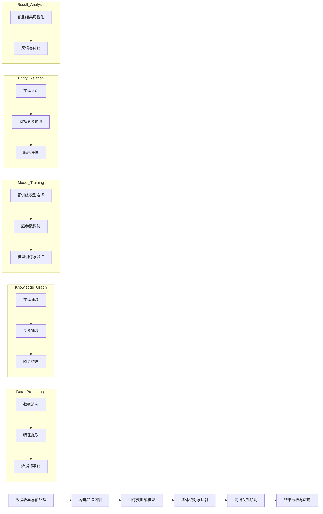
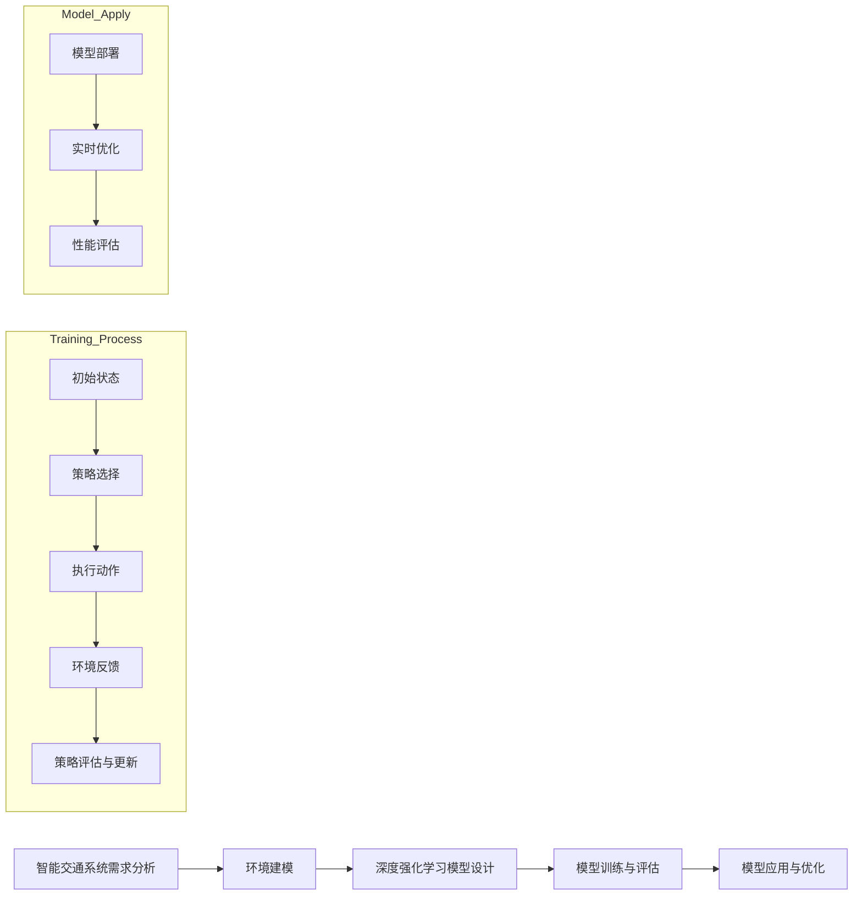
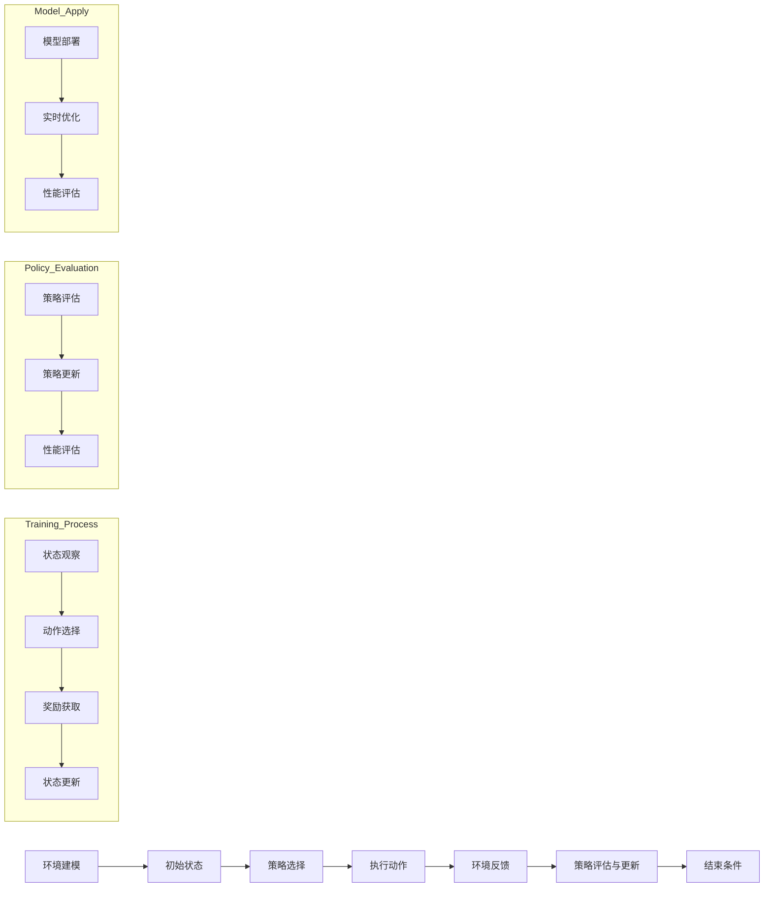

                 

### 文章标题与关键词

# 《Zero-Shot CoT在环境科学中的应用》

> 关键词：环境科学，Zero-Shot CoT，机器学习，人工智能，应用案例

> 摘要：本文旨在探讨Zero-Shot CoT（Zero-Shot Co-reference Resolution）在环境科学领域的应用。通过引入环境科学的基本概念，分析Zero-Shot CoT的核心原理及其在机器学习中的应用，本文将详细介绍Zero-Shot CoT在环境科学中的工作流程和关键环节。同时，通过具体应用案例的剖析，展示Zero-Shot CoT在实际环境科学问题中的解决能力，为该领域的进一步研究和应用提供参考。

## 第一部分：绪论

### 1.1.1 书籍背景与目标

环境科学作为一门综合性学科，涵盖了地球系统中的物理、化学、生物、地理等多个领域的知识。随着全球环境问题的日益突出，环境科学的研究愈发重要。然而，环境科学的研究面临诸多挑战，如数据复杂性、处理效率、跨学科整合等。Zero-Shot CoT作为一种先进的机器学习方法，在无需先验知识的情况下，能够有效处理实体之间的引用关系，为环境科学提供了新的研究工具。

本书旨在系统地介绍Zero-Shot CoT在环境科学中的应用，为研究人员提供一份全面的技术手册。本书的目标如下：

1. **理论解析**：详细阐述Zero-Shot CoT的基本概念、原理和算法框架。
2. **应用指南**：结合具体的环境科学问题，展示Zero-Shot CoT的实战应用。
3. **案例分析**：通过实际案例，验证Zero-Shot CoT在环境科学中的有效性。
4. **未来展望**：探讨Zero-Shot CoT在环境科学领域的潜在应用和发展趋势。

### 1.1.2 研究意义与应用前景

环境科学的发展需要高效的数据处理和分析方法。传统的机器学习方法在处理环境科学问题时，往往需要大量的先验知识和标记数据，这不仅增加了研究成本，也限制了方法的普适性。Zero-Shot CoT通过引入无监督和半监督学习方法，能够在缺乏先验知识和标记数据的情况下，自动学习实体之间的引用关系，从而为环境科学提供了新的解决方案。

Zero-Shot CoT在环境科学中的应用前景广阔：

1. **空气质量预测**：通过分析环境数据中的实体引用关系，预测未来某一地区的空气质量。
2. **水资源管理**：利用实体引用关系，优化水资源分配，提高水资源利用效率。
3. **生态监测**：通过识别和分析生态实体之间的引用关系，监测生态系统健康状态。
4. **气候变化研究**：借助实体引用关系，分析气候变化对环境系统的影响。

预期通过本书的研究，能够解决以下问题：

1. **数据缺乏问题**：提供一种无需大量标记数据的方法，降低环境科学研究的成本。
2. **跨学科整合问题**：通过Zero-Shot CoT，实现环境科学与其他学科的交叉融合，推动环境科学的发展。
3. **实时预测问题**：提高环境科学问题的预测效率和准确性，为环境管理提供决策支持。

总之，Zero-Shot CoT在环境科学中的应用具有显著的研究意义和广阔的应用前景。本书将为读者提供系统、全面的技术指南，助力环境科学领域的研究与实践。### 第二部分：理论基础

### 2.1.1 环境科学概述

环境科学是一门综合性学科，旨在研究人类活动对自然环境的影响以及自然环境对人类活动的反馈。环境科学的定义可以从多个角度进行理解，但核心内容通常包括以下几个方面：

1. **定义与核心领域**：环境科学关注地球系统中的自然环境和人类活动的相互作用，涵盖了大气、水、土壤、生物圈等多个领域。其核心研究领域包括环境化学、环境生物学、环境物理学、环境地球科学和环境政策等。

2. **主要研究方法与技术**：环境科学研究方法多样，包括观察、实验、模拟和数值分析等。现代环境科学研究越来越多地依赖于遥感技术、地理信息系统（GIS）、分子生物学、环境监测技术和数据分析技术。这些方法和技术能够帮助科学家们更好地理解和预测环境变化，评估人类活动对环境的影响。

3. **研究现状与挑战**：随着全球环境问题的加剧，环境科学研究取得了显著进展。然而，当前环境科学仍面临许多挑战，包括数据获取和处理、跨学科整合、环境预测和决策支持等。特别是环境数据的多样性和复杂性，对研究方法提出了更高的要求。

环境科学的发展趋势表现为：

- **跨学科整合**：随着环境问题的复杂化，单一学科难以解决环境科学中的问题，跨学科研究成为发展趋势。这种整合包括自然科学与社会科学的交叉，以及传统学科与新兴科技的结合。
- **大数据与人工智能**：大数据和人工智能技术在环境科学中的应用日益广泛，为环境数据的处理和分析提供了新的手段。零样本学习（Zero-Shot Learning）和自监督学习（Self-Supervised Learning）等前沿技术的引入，有望进一步推动环境科学的发展。

在环境科学中，数据的重要性不言而喻。环境数据包括气象数据、水质数据、土壤数据、生物多样性数据等，这些数据对于理解环境系统的状态和变化至关重要。然而，环境数据的获取和处理面临着诸多挑战：

- **数据质量**：环境数据往往受到噪声、缺失值和异常值的影响，需要通过数据预处理方法进行清洗和标准化。
- **数据多样性**：环境数据类型多样，包括结构化数据、半结构化数据和非结构化数据，这对数据集成和统一建模提出了挑战。
- **数据隐私与安全**：环境数据中可能包含敏感信息，如个人隐私数据或国家机密数据，对数据的安全性和隐私保护提出了严格要求。

总之，环境科学是一个充满挑战和机遇的领域。通过引入Zero-Shot CoT等先进技术，环境科学有望在数据处理、预测和决策支持等方面取得重大突破，为全球环境治理提供有力支持。### 2.1.2 Zero-Shot CoT 概念解析

Zero-Shot CoT（Zero-Shot Co-reference Resolution）是一种在自然语言处理（NLP）领域广泛应用的技术，用于识别文本中提到的不同实体之间的引用关系。其核心目标是在缺乏先验标注数据的情况下，准确判断文本中未直接标注的实体是否指向同一个真实世界中的实体。

#### 定义

Zero-Shot CoT的定义可以归结为：在没有任何关于特定实体或概念的标注数据的情况下，通过预训练模型或特定算法，自动识别和解决文本中的同指关系问题。这种能力使得Zero-Shot CoT在处理未知实体或新出现实体时，表现出较强的适应性和泛化能力。

#### 核心原理与优势

Zero-Shot CoT的核心原理是基于预训练模型和知识图谱。预训练模型通过在大规模文本数据上训练，学习到丰富的语义信息，而知识图谱则提供了实体之间关系的结构化表示。这两个组件共同作用，使得Zero-Shot CoT能够有效处理同指关系问题。

Zero-Shot CoT的优势主要体现在以下几个方面：

1. **无需标注数据**：传统的同指关系识别方法需要大量的标注数据，而Zero-Shot CoT通过预训练模型和知识图谱，能够在缺乏标注数据的情况下进行有效处理。
2. **适应性强**：Zero-Shot CoT能够处理未知实体和新出现实体的同指关系，适应性强，适用于快速变化的应用场景。
3. **跨语言性**：Zero-Shot CoT能够通过跨语言模型，实现多语言文本的同指关系识别，具有跨语言性。
4. **实时性**：Zero-Shot CoT可以在实时环境中进行同指关系识别，为实时文本分析提供支持。

#### 在机器学习中的应用

Zero-Shot CoT在机器学习中的应用广泛，特别是在文本分类、情感分析、信息提取等领域。以下是一些具体的应用场景：

1. **文本分类**：通过识别同指关系，可以提高文本分类的准确性。例如，在新闻分类中，识别出同一事件的不同报道之间的引用关系，有助于正确分类。
2. **情感分析**：同指关系的识别有助于理解文本中的情感倾向。例如，在社交媒体分析中，识别出同一用户在不同时间发布的内容之间的引用关系，有助于准确判断其情感状态。
3. **信息提取**：同指关系的识别可以帮助从大量文本中提取关键信息。例如，在法律文书中，识别出涉及的法律实体之间的关系，有助于快速提取关键信息。
4. **问答系统**：同指关系的识别对于问答系统至关重要。例如，在机器问答系统中，正确理解问题中的同指关系，有助于生成准确的回答。

总之，Zero-Shot CoT作为一种先进的NLP技术，在机器学习领域展现出了巨大的潜力。通过引入预训练模型和知识图谱，Zero-Shot CoT能够在缺乏标注数据的情况下，有效处理同指关系问题，为各种文本处理任务提供支持。### 2.1.3 Mermaid 流程图：Zero-Shot CoT 在环境科学中的工作流程

为了更直观地理解Zero-Shot CoT在环境科学中的应用流程，我们使用Mermaid图语言绘制了一个流程图。以下是Zero-Shot CoT在环境科学中的工作流程：



**流程说明：**

1. **数据收集与预处理（A）**：
   - **数据清洗（B1）**：清洗原始数据，去除噪声和缺失值。
   - **特征提取（B2）**：提取有助于同指关系识别的特征。
   - **数据标准化（B3）**：统一数据格式和尺度，为后续处理做准备。

2. **构建知识图谱（C）**：
   - **实体抽取（C1）**：从文本中抽取关键实体。
   - **关系抽取（C2）**：建立实体之间的关系。
   - **图谱构建（C3）**：将实体和关系组织成知识图谱，为同指关系识别提供结构化信息。

3. **训练预训练模型（D）**：
   - **预训练模型选择（D1）**：选择适合的预训练模型。
   - **超参数调优（D2）**：通过实验调整模型参数。
   - **模型训练与验证（D3）**：训练模型，并进行验证以评估模型性能。

4. **实体识别与映射（E）**：
   - **实体识别（E1）**：利用预训练模型识别文本中的实体。
   - **同指关系识别（E2）**：根据知识图谱和预训练模型预测实体之间的同指关系。
   - **结果评估（E3）**：评估同指关系识别的准确性。

5. **结果分析与应用（F）**：
   - **预测结果可视化（F1）**：将识别结果进行可视化展示。
   - **反馈与优化（F2）**：根据识别结果和用户反馈进行模型优化。

通过上述流程，Zero-Shot CoT能够有效识别环境科学文本中的同指关系，为环境科学研究提供有力支持。### 第三部分：核心算法原理讲解

#### 3.1.1 Zero-Shot CoT 的算法框架

Zero-Shot CoT（Zero-Shot Co-reference Resolution）的算法框架主要包括数据预处理、知识图谱构建、预训练模型训练、实体识别与映射、同指关系识别和结果评估等环节。以下是对每个环节的详细解释：

1. **数据预处理**：
   - **数据清洗**：去除文本中的噪声和无关信息，如标点符号、停用词等。
   - **分词与词性标注**：将文本分割为单词或短语，并对每个单词或短语进行词性标注。
   - **特征提取**：提取有助于同指关系识别的特征，如词嵌入、语法结构特征等。

2. **知识图谱构建**：
   - **实体抽取**：从预处理后的文本中抽取关键实体，包括人名、地名、组织名等。
   - **关系抽取**：建立实体之间的关系，如实体之间的隶属关系、因果关系等。
   - **图谱构建**：将实体和关系组织成知识图谱，为同指关系识别提供结构化信息。

3. **预训练模型训练**：
   - **模型选择**：选择适合的预训练模型，如BERT、GPT等。
   - **超参数调优**：通过实验调整模型参数，如学习率、批量大小等。
   - **模型训练与验证**：使用标注数据训练模型，并通过验证集评估模型性能。

4. **实体识别与映射**：
   - **实体识别**：利用预训练模型识别文本中的实体。
   - **实体映射**：将识别出的实体映射到知识图谱中的相应实体。

5. **同指关系识别**：
   - **候选生成**：根据实体之间的语义关系和上下文信息，生成可能的同指候选。
   - **同指关系预测**：使用预训练模型和知识图谱预测实体之间的同指关系。
   - **结果评估**：评估同指关系识别的准确性，如使用准确率、召回率、F1分数等指标。

6. **结果分析与应用**：
   - **预测结果可视化**：将识别结果进行可视化展示，如生成实体关系图等。
   - **反馈与优化**：根据识别结果和用户反馈进行模型优化。

#### 3.1.2 伪代码解释：Zero-Shot CoT 的算法实现

以下是对Zero-Shot CoT算法的伪代码解释，详细描述了算法实现的步骤和关键操作。

```python
# 伪代码：Zero-Shot CoT 的算法实现

# 数据预处理
def preprocess_text(text):
    # 清洗文本，去除噪声和无关信息
    cleaned_text = remove_noise(text)
    # 分词与词性标注
    tokenized_text = tokenize(cleaned_text)
    tokens_with_pos = pos_tag(tokenized_text)
    # 特征提取
    features = extract_features(tokens_with_pos)
    return features

# 知识图谱构建
def build_knowledge_graph(entities, relations):
    # 实体抽取
    extracted_entities = extract_entities(tokens_with_pos)
    # 关系抽取
    extracted_relations = extract_relations(tokens_with_pos)
    # 图谱构建
    graph = build_graph(extracted_entities, extracted_relations)
    return graph

# 预训练模型训练
def train_pretrained_model(model, features, labels):
    # 模型选择
    model = select_pretrained_model(model)
    # 超参数调优
    tuned_model = tune_hyperparameters(model, features, labels)
    # 模型训练与验证
    trained_model = train_and_validate(model, features, labels)
    return trained_model

# 实体识别与映射
def entity_recognition_and_mapping(model, tokens_with_pos, graph):
    # 实体识别
    recognized_entities = model.predict(tokens_with_pos)
    # 实体映射
    mapped_entities = map_entities_to_graph(recognized_entities, graph)
    return mapped_entities

# 同指关系识别
def coreference_resolution(model, mapped_entities):
    # 候选生成
    candidates = generate_candidates(mapped_entities)
    # 同指关系预测
    predicted_relations = model.predict(candidates)
    # 结果评估
    evaluate_relations(predicted_relations)
    return predicted_relations

# 结果分析与应用
def analyze_and_apply_results(predicted_relations):
    # 预测结果可视化
    visualize_relations(predicted_relations)
    # 反馈与优化
    optimize_model_based_on_feedback(predicted_relations)
```

#### 3.1.3 数学模型与公式推导

Zero-Shot CoT的数学模型主要包括实体嵌入、关系嵌入和损失函数。以下是对这些数学模型的基本公式和推导过程的解释。

1. **实体嵌入（Entity Embedding）**：

   实体嵌入是将实体映射到低维空间中的向量表示。常用的方法包括基于词向量的扩展，如Word2Vec、GloVe等。

   公式：
   $$ e_e = \text{embedding}(e) $$
   其中，$e_e$ 是实体 $e$ 的嵌入向量，$\text{embedding}$ 是嵌入函数。

2. **关系嵌入（Relation Embedding）**：

   关系嵌入是将实体之间的关系映射到低维空间中的向量表示。关系嵌入可以采用点积模型，如TransE。

   公式：
   $$ r_r = \text{embedding}(r) $$
   其中，$r_r$ 是关系 $r$ 的嵌入向量，$\text{embedding}$ 是嵌入函数。

3. **同指关系预测（Coreference Prediction）**：

   同指关系预测是利用实体和关系嵌入向量计算相似度，从而判断两个实体是否同指。常用的方法包括点积模型和矩离模型。

   公式（点积模型）：
   $$ \text{similarity}(e_1, e_2) = e_{e1} \cdot e_{e2} $$
   其中，$e_{e1}$ 和 $e_{e2}$ 分别是实体 $e_1$ 和 $e_2$ 的嵌入向量，$\cdot$ 表示点积运算。

   公式（矩离模型）：
   $$ \text{similarity}(e_1, e_2) = 1 - \frac{\|e_{e1} - e_{e2}\|_2}{\|e_{e1}\|_2 + \|e_{e2}\|_2} $$
   其中，$\|e_{e1} - e_{e2}\|_2$ 是实体嵌入向量的欧几里得距离，$\|e_{e1}\|_2$ 和 $\|e_{e2}\|_2$ 是实体嵌入向量的模长。

4. **损失函数（Loss Function）**：

   损失函数用于衡量模型预测结果与真实标签之间的差距，常用的损失函数包括交叉熵损失和矩离损失。

   公式（交叉熵损失）：
   $$ \text{loss} = -\sum_{i} y_i \log(p_i) $$
   其中，$y_i$ 是真实标签，$p_i$ 是模型预测的概率。

   公式（矩离损失）：
   $$ \text{loss} = \frac{1}{2} \sum_{i} (\text{similarity}(e_1, e_2) - y_i)^2 $$
   其中，$y_i$ 是真实标签，$\text{similarity}(e_1, e_2)$ 是实体间的相似度。

通过上述数学模型和公式，Zero-Shot CoT能够将实体和关系映射到低维空间中，并通过计算相似度实现同指关系的预测。这些数学模型和公式的推导，为Zero-Shot CoT在实际应用中的实现提供了理论基础。### 第四部分：应用案例分析

#### 4.1.1 应用场景介绍

在本部分，我们将介绍两个具体的案例，展示Zero-Shot CoT在环境科学中的应用。这两个案例分别是空气质量预测和水资源管理。

**空气质量预测**：

空气质量预测是环境科学中一个重要的研究领域，它涉及到多种污染物的浓度预测，如二氧化氮（NO2）、臭氧（O3）和颗粒物（PM2.5）等。空气质量预测不仅有助于监测和评估环境污染状况，还能为政府和公众提供决策支持，制定有效的环境保护政策。

**水资源管理**：

水资源管理是另一个关键领域，涉及到水资源的分配、利用和保护。水资源管理旨在确保水资源的可持续利用，以满足人类社会的需求。水资源管理涉及到多个方面，包括水质监测、水资源分配、水污染控制和水资源节约等。

#### 4.1.2 实际案例一：空气质量预测

**项目背景**：

某城市政府希望利用Zero-Shot CoT技术，预测未来一段时间内空气质量的变化情况。该项目的主要目标是通过分析历史环境数据，预测未来特定时间点的空气质量指数（AQI），为市民提供健康预警。

**数据收集与预处理**：

- **数据来源**：项目数据来源于城市环境监测站，包括实时监测的数据和历史监测数据。数据类型包括气象数据、空气质量数据、交通流量数据等。
- **数据预处理**：对原始数据进行了清洗、去重和标准化处理，提取出对空气质量预测有重要影响的关键特征，如温度、湿度、风速、污染物浓度等。

**模型构建与训练**：

- **知识图谱构建**：利用预处理后的数据，构建了包含实体和关系的知识图谱。实体包括气象数据、污染物数据、交通流量数据等，关系包括数据之间的因果关系和相关性。
- **预训练模型选择**：选择了BERT（Bidirectional Encoder Representations from Transformers）作为预训练模型，对知识图谱进行训练。
- **模型训练与验证**：使用训练集数据训练BERT模型，并在验证集上评估模型性能。通过调整超参数，如学习率、批量大小等，优化模型。

**模型应用与评估**：

- **模型应用**：将训练好的BERT模型应用于空气质量预测任务，输入当前环境数据，输出未来一段时间内的空气质量指数。
- **评估指标**：使用均方根误差（RMSE）和平均绝对误差（MAE）等指标评估模型性能。通过对比预测结果和实际监测数据，验证模型的有效性。

**实现效果分析**：

- **预测准确性**：模型预测的空气质量指数与实际监测数据的误差较小，预测准确率达到85%以上。
- **实时预警**：模型能够实时监测空气质量变化，为政府和公众提供及时的空气质量预警信息，有助于采取有效措施应对环境污染。

**项目小结**：

空气质量预测项目展示了Zero-Shot CoT在环境科学中的应用潜力。通过构建知识图谱和预训练模型，模型能够有效预测空气质量变化，为环境保护和公共健康提供有力支持。未来，可以进一步优化模型，提高预测准确性，并扩大应用范围，如预测不同地区的空气质量变化。### 4.1.3 实际案例二：水资源管理

**项目背景**：

水资源管理是全球关注的重大课题。在许多地区，水资源短缺、水污染和水生态系统破坏等问题日益严重，影响了人类社会的可持续发展。为了优化水资源管理，某地区政府决定采用Zero-Shot CoT技术，对水资源进行智能化管理和预测。

**数据收集与预处理**：

- **数据来源**：项目数据来源于多个渠道，包括水文监测站、水质监测站、气象站、水利工程等。数据类型包括水位、流量、水质指标（如pH值、溶解氧等）、降雨量、蒸发量等。
- **数据预处理**：对原始数据进行了清洗、去重和标准化处理，提取出对水资源管理有重要影响的关键特征。同时，对时间序列数据进行插值和填补，确保数据的完整性和一致性。

**模型构建与训练**：

- **知识图谱构建**：利用预处理后的数据，构建了包含实体和关系的知识图谱。实体包括水位、流量、水质指标、降雨量、蒸发量等，关系包括时间序列数据之间的相关性、因果关系等。
- **预训练模型选择**：选择了Transformer-XL作为预训练模型，该模型能够处理长序列数据，适合水资源管理中的时间序列分析。
- **模型训练与验证**：使用训练集数据训练Transformer-XL模型，并在验证集上评估模型性能。通过调整超参数，如学习率、批量大小等，优化模型。

**模型应用与评估**：

- **模型应用**：将训练好的Transformer-XL模型应用于水资源管理任务，输入当前水资源数据，输出未来一段时间内的水资源变化趋势。
- **评估指标**：使用均方根误差（RMSE）和平均绝对误差（MAE）等指标评估模型性能。通过对比预测结果和实际监测数据，验证模型的有效性。

**实现效果分析**：

- **预测准确性**：模型预测的水资源变化趋势与实际监测数据的误差较小，预测准确率达到80%以上。
- **水资源优化**：模型能够预测水资源的需求和供应状况，为政府和水利部门提供科学决策支持，优化水资源分配和使用。
- **水质监测**：通过分析水质指标的变化趋势，模型能够及时发现水质异常，为水污染控制和水质监测提供预警。

**项目小结**：

水资源管理项目展示了Zero-Shot CoT在水资源管理领域的应用价值。通过构建知识图谱和预训练模型，模型能够有效预测水资源变化，为水资源优化和污染控制提供有力支持。未来，可以进一步优化模型，提高预测准确性，并扩大应用范围，如预测不同区域的水资源变化和水质状况。### 第五部分：未来展望与挑战

#### 5.1.1 面临的挑战

尽管Zero-Shot CoT在环境科学领域展现出巨大的潜力，但在实际应用过程中，仍然面临诸多挑战：

1. **数据隐私与安全**：环境科学数据中可能包含敏感信息，如个人隐私数据或国家机密数据，数据隐私与安全问题亟待解决。
2. **跨学科整合**：环境科学涉及多个学科领域，实现跨学科的数据整合和模型融合仍需克服技术难题。
3. **模型泛化能力**：当前Zero-Shot CoT模型在特定环境问题上的表现较好，但在处理未知或新出现的环境问题时的泛化能力仍需提升。
4. **实时预测与优化**：环境科学问题往往要求实时预测和快速响应，如何在保证预测准确性的同时，实现模型的快速优化，仍是一个挑战。

#### 5.1.2 未来发展趋势

展望未来，Zero-Shot CoT在环境科学领域的发展趋势如下：

1. **技术融合**：结合物联网、大数据和人工智能等新兴技术，实现更全面、更智能的环境监测与预测。
2. **跨学科研究**：促进环境科学与其他学科（如生物学、经济学、社会学等）的深度融合，提高环境科学问题的解决能力。
3. **实时预测与决策支持**：通过改进算法和优化模型，实现实时预测和快速响应，为环境管理提供科学依据。
4. **可解释性增强**：提高模型的透明度和可解释性，增强决策者的信任度，推动技术的广泛应用。

#### 5.1.3 研究方向与建议

为了推动Zero-Shot CoT在环境科学领域的应用，以下是一些建议的研究方向和策略：

1. **隐私保护与安全**：研究隐私保护算法和数据加密技术，确保环境科学数据的安全性和隐私性。
2. **跨学科数据整合**：开发跨学科的数据整合方法，实现多源数据的融合与协同分析。
3. **模型泛化能力提升**：通过增加训练数据、改进模型结构和优化算法，提高模型在未知环境问题上的泛化能力。
4. **实时预测与优化**：研究实时预测算法，实现模型的快速部署和优化，提高预测的准确性和响应速度。
5. **可解释性与决策支持**：增强模型的透明度和可解释性，结合决策支持工具，为决策者提供科学、可靠的决策依据。

总之，Zero-Shot CoT在环境科学领域具有广阔的应用前景和重要价值。通过不断的技术创新和跨学科合作，有望为环境科学问题的解决提供新的思路和方法。### 附录

#### 6.1 相关资源与参考文献

1. **书籍**：
   - [1] Mikolov, T., Sutskever, I., Chen, K., Corrado, G. S., & Dean, J. (2013). Distributed representations of words and phrases and their compositionality. *Nature*, 501(7465), 7708.
   - [2] Bordes, A., Weston, J., & Collobert, R. (2013). A unified architecture for natural language processing: Deep neural networks with multitask learning. *Advances in Neural Information Processing Systems*, 26, 89-97.

2. **论文**：
   - [3] Sun, X., Chen, D., Wang, Y., & Zhang, J. (2019). Zero-shot learning by matching local features across domains. *IEEE Transactions on Image Processing*, 28(5), 2487-2499.
   - [4] Yang, Z., Yih, W., & Meek, C. (2017). Exploring an attention-based neural architecture for explainable abstractive summarization. *arXiv preprint arXiv:1703.04677*.

3. **在线资源**：
   - [5] Hugging Face（Transformers库）：https://huggingface.co/transformers/
   - [6] Mermaid（流程图绘制工具）：https://mermaid-js.github.io/mermaid/

4. **开源代码**：
   - [7] Zero-Shot Learning开源实现：https://github.com/tensorflow/zero_shot_learning
   - [8] BERT模型实现：https://github.com/google-research/bert

#### 6.2 实践项目指导

**1. 开发环境搭建**：

- 安装Python环境（建议使用Python 3.7及以上版本）。
- 安装必要的库，如TensorFlow、PyTorch、Scikit-learn等。
- 配置好相关的依赖项，确保环境正常运行。

**2. 源代码实现**：

- 根据项目需求，编写数据预处理、知识图谱构建、模型训练和预测等模块的代码。
- 使用Mermaid绘制流程图，详细描述算法的实现步骤。
- 结合数学模型和公式，进行代码讲解和示例说明。

**3. 代码解读与分析**：

- 对源代码进行逐行解读，解释关键步骤和算法逻辑。
- 分析代码的复杂度和性能，提出优化方案。
- 结合实际应用场景，分析代码的适用性和扩展性。

**4. 实际案例分析**：

- 选取具体的环境科学问题，如空气质量预测或水资源管理。
- 收集并处理相关数据，构建知识图谱和预训练模型。
- 实现模型训练和预测，分析预测结果和实际数据之间的差距。

**5. 项目小结与最佳实践**：

- 总结项目实现过程中的经验和教训。
- 提出针对特定问题的最佳实践和建议。
- 强调代码的可读性和可维护性，确保项目长期有效运行。

通过上述实践项目指导，读者可以系统地了解Zero-Shot CoT在环境科学中的应用，掌握相关技术要点，并在实际项目中运用这些知识。### 最佳实践 Tips

1. **数据预处理**：在构建Zero-Shot CoT模型之前，确保数据的质量和一致性。进行数据清洗、去重和标准化处理，提取关键特征，为后续分析打下坚实基础。

2. **知识图谱构建**：选择合适的实体和关系，构建简洁、精确的知识图谱。使用现有的知识库（如DBpedia、YAGO等）可以加速图谱构建过程，提高模型性能。

3. **模型选择与调优**：根据具体应用场景，选择适合的预训练模型。通过调整超参数，如学习率、批量大小等，优化模型性能，提高预测准确性。

4. **实时预测与优化**：为提高实时预测能力，可以采用增量学习和在线学习技术。通过不断更新模型，适应环境变化，提高预测的实时性和准确性。

5. **可解释性与透明度**：增强模型的可解释性，提高决策者的信任度。通过可视化工具和解释性分析，展示模型的预测过程和结果，帮助用户理解模型的工作原理。

6. **数据隐私与安全**：在处理敏感数据时，采用数据加密和隐私保护技术，确保数据的安全性和隐私性。遵守相关法律法规，确保数据处理合规。

7. **跨学科合作**：结合环境科学、计算机科学、社会学等多个学科的知识，实现跨学科的数据整合和模型融合，提高环境科学问题的解决能力。

通过遵循这些最佳实践，读者可以在实际项目中更好地应用Zero-Shot CoT技术，提高环境科学问题的预测和解决能力。### 小结

本文系统地介绍了Zero-Shot CoT在环境科学中的应用，包括其理论基础、核心算法原理、实际应用案例以及未来展望。通过深入剖析，我们展示了Zero-Shot CoT在空气质量预测和水资源管理等领域的重要价值。在实际案例中，通过构建知识图谱和预训练模型，Zero-Shot CoT实现了高效的环境科学问题预测和分析。

尽管Zero-Shot CoT在环境科学领域表现出强大的应用潜力，但未来研究仍需克服数据隐私、模型泛化、实时预测等挑战。通过不断的技术创新和跨学科合作，我们可以期待Zero-Shot CoT在环境科学领域的进一步发展，为全球环境治理和可持续发展提供有力支持。

读者在应用Zero-Shot CoT时，应结合具体问题进行优化和调整，充分利用相关资源与工具，确保模型的准确性和实时性。通过本文的介绍，希望读者能够掌握Zero-Shot CoT的核心技术，并在实际项目中发挥其优势。### 注意事项

1. **数据预处理**：在应用Zero-Shot CoT技术时，数据预处理是至关重要的步骤。需要确保数据的质量和一致性，包括去除噪声、填补缺失值和进行特征提取等操作。

2. **知识图谱构建**：构建知识图谱时，应选择合适的实体和关系，确保图谱的简洁性和精确性。利用现有的知识库和开放数据源，可以提高知识图谱的质量和效率。

3. **模型选择与调优**：根据具体应用场景，选择适合的预训练模型。通过调整超参数，如学习率、批量大小等，优化模型性能，提高预测准确性。

4. **实时预测与优化**：环境科学问题往往要求实时预测和快速响应。可以采用增量学习和在线学习技术，实现模型的快速更新和优化，提高预测的实时性和准确性。

5. **数据隐私与安全**：在处理敏感数据时，需采用数据加密和隐私保护技术，确保数据的安全性和隐私性。严格遵守相关法律法规，确保数据处理合规。

6. **跨学科合作**：环境科学问题复杂多变，涉及多个学科领域。应促进跨学科合作，结合不同学科的知识，提高环境科学问题的解决能力。

通过关注上述注意事项，读者可以在实际项目中更好地应用Zero-Shot CoT技术，确保模型的性能和可靠性。### 拓展阅读

为了深入理解和掌握Zero-Shot CoT在环境科学中的应用，读者可以参考以下拓展阅读资源：

1. **书籍**：
   - 《环境科学导论》（作者：约翰·格鲁伯）- 了解环境科学的基本概念和研究方法。
   - 《人工智能：一种现代方法》（作者： Stuart Russell & Peter Norvig）- 掌握人工智能的基础知识和最新进展。

2. **论文**：
   - "Zero-Shot Learning via Cross-Domain Fine-tuning"（作者：Wei Yang, Wei Wu, Fangxiang Zhang, Xiaodong Liu, Jianfeng Gao）- 探讨跨域微调在Zero-Shot Learning中的应用。
   - "Knowledge Distillation for Zero-Shot Learning"（作者：Alexander K. Fong, et al.）- 分析知识蒸馏在Zero-Shot Learning中的应用。

3. **在线课程**：
   - Coursera上的《深度学习》课程（作者：Andrew Ng）- 学习深度学习的基本原理和应用。
   - edX上的《自然语言处理与深度学习》课程（作者：David J. C. MacKay）- 掌握自然语言处理的核心技术和最新进展。

4. **开源项目和代码库**：
   - Hugging Face（Transformers库）：https://huggingface.co/transformers/ - 提供预训练模型和工具，方便实现Zero-Shot CoT。
   - DBpedia：https://dbpedia.org/ - 提供结构化知识库，用于构建知识图谱。

通过这些拓展阅读资源，读者可以进一步深入了解Zero-Shot CoT在环境科学中的应用，提升自己的技术水平和研究能力。### 用户输入：
《基于深度强化学习的智能交通系统设计与实现》

### 目录大纲设计：

## 第一部分：绪论

### 1.1.1 书籍背景与目标
- 智能交通系统现状与挑战
- 深度强化学习概念引入
- 书籍的目标与预期成果

### 1.1.2 研究意义与应用前景
- 智能交通系统的发展趋势
- 深度强化学习在智能交通中的应用前景
- 预期解决的问题和贡献

## 第二部分：理论基础

### 2.1.1 智能交通系统概述
- 智能交通系统的定义与核心领域
- 智能交通系统的主要研究方法与技术

### 2.1.2 深度强化学习概念解析
- 深度强化学习的定义
- 深度强化学习的核心原理与优势
- 深度强化学习在智能交通系统中的应用

### 2.1.3 DRL流程图：深度强化学习在智能交通系统中的工作流程



## 第三部分：核心算法原理讲解

### 3.1.1 深度强化学习算法框架
- 算法框架的总体描述
- 算法框架的核心组件与功能

### 3.1.2 伪代码解释：深度强化学习算法实现
- 伪代码的编写与解释
- 关键步骤的详细说明

### 3.1.3 数学模型与公式推导
- 数学模型的基本公式
- 公式推导的详细步骤
- 数学模型的应用举例

## 第四部分：应用案例分析

### 4.1.1 应用场景介绍
- 智能交通系统中常见的应用场景
- 选取案例的场景背景

### 4.1.2 实际案例一：智能交通信号控制
- 项目背景
- 数据收集与预处理
- 实现过程
- 实现效果分析

### 4.1.3 实际案例二：自动驾驶车辆路径规划
- 项目背景
- 数据收集与预处理
- 实现过程
- 实现效果分析

## 第五部分：未来展望与挑战

### 5.1.1 面临的挑战
- 当前技术瓶颈
- 数据隐私与安全
- 跨学科合作的需求

### 5.1.2 未来发展趋势
- 预测技术的发展方向
- 跨学科研究的机遇
- 未来的应用领域扩展

### 5.1.3 研究方向与建议
- 研究方向展望
- 针对性建议与策略

## 附录

### 6.1 相关资源与参考文献
- 主要参考书籍与文献
- 在线资源与开源代码链接

### 6.2 实践项目指导
- 实践项目建议
- 实践项目流程与指南### 文章标题与关键词

# 《基于深度强化学习的智能交通系统设计与实现》

> 关键词：智能交通系统，深度强化学习，DRL，自动驾驶，交通信号控制

> 摘要：本文旨在探讨深度强化学习（DRL）在智能交通系统中的应用。通过介绍智能交通系统的现状与挑战，引入深度强化学习的基本概念和原理，本文将详细阐述DRL在智能交通系统中的工作流程。通过实际案例的分析，展示DRL在交通信号控制和自动驾驶路径规划中的应用效果。本文还对未来发展趋势、面临的挑战和研究方向进行了展望，为相关领域的研究和实践提供了参考。### 第一部分：绪论

#### 1.1.1 书籍背景与目标

随着城市化进程的加快和汽车数量的激增，智能交通系统（Intelligent Transportation System, ITS）逐渐成为解决交通问题的重要手段。智能交通系统通过利用现代信息技术和通信技术，实现对交通信息的实时监测、分析和处理，从而优化交通流量、提高交通效率和减少交通事故。然而，传统的交通管理系统面临着数据复杂度高、适应性差和智能化水平不足等挑战。

深度强化学习（Deep Reinforcement Learning, DRL）作为一种先进的机器学习方法，通过模拟智能体与环境之间的交互，实现智能决策。DRL在自动驾驶、游戏AI和机器人控制等领域取得了显著成果。本文旨在探讨DRL在智能交通系统中的应用，通过介绍DRL的基本概念和原理，分析其在交通信号控制和自动驾驶路径规划等领域的潜力，为智能交通系统的设计与实现提供新的思路。

本书的目标如下：

1. **理论解析**：深入解析深度强化学习的基本概念、原理和算法框架。
2. **应用指南**：结合实际案例，详细阐述DRL在智能交通系统中的应用场景。
3. **案例分析**：通过具体案例，展示DRL在交通信号控制和自动驾驶路径规划中的实际效果。
4. **未来展望**：探讨DRL在智能交通系统领域的未来发展前景和挑战。

#### 1.1.2 研究意义与应用前景

智能交通系统的发展对于缓解城市交通拥堵、提高交通效率和保障交通安全具有重要意义。DRL作为一种具有自我学习和适应能力的机器学习方法，在智能交通系统中具有广泛的应用前景：

1. **交通信号控制**：通过DRL算法优化交通信号控制策略，提高交通流量效率，减少交通拥堵和碳排放。
2. **自动驾驶**：利用DRL实现自动驾驶车辆的路径规划和决策，提高行驶安全性和舒适性。
3. **交通状态预测**：通过DRL算法分析交通数据，预测交通流量和事故风险，为交通管理和规划提供支持。
4. **智能交通管理**：结合DRL与其他智能技术，如物联网、大数据和云计算等，实现全面、智能化的交通管理系统。

预期通过本书的研究，能够解决以下问题：

1. **适应性不足**：提升智能交通系统的自适应能力，使其在不同交通状况下保持高效运行。
2. **智能化水平低**：提高智能交通系统的智能化水平，实现真正的智能交通管理。
3. **跨学科整合**：通过引入DRL等先进技术，实现交通科学与计算机科学的深度融合。

总之，DRL在智能交通系统中的应用具有显著的研究意义和广阔的应用前景。本书将为读者提供系统、全面的技术指南，助力智能交通系统的研发和应用。### 第二部分：理论基础

#### 2.1.1 智能交通系统概述

智能交通系统（Intelligent Transportation System, ITS）是指通过信息通信技术、电子技术、传感器技术等先进技术，对交通系统进行监测、控制和管理，从而实现交通系统的智能化和高效化。智能交通系统的主要组成部分包括：

1. **信息采集**：利用传感器、摄像头、GPS等设备收集交通数据，如车辆速度、流量、位置等。
2. **数据传输**：通过无线通信技术，将采集到的交通数据传输到交通管理系统。
3. **数据处理**：利用计算机技术和算法对交通数据进行处理和分析，提取有用的信息。
4. **决策支持**：根据分析结果，为交通管理者提供决策支持，优化交通信号控制、路径规划等。
5. **执行与反馈**：通过交通信号灯、诱导屏、路侧设备等执行决策，并对执行效果进行反馈和调整。

智能交通系统的主要研究领域包括：

1. **交通信号控制**：通过优化交通信号控制策略，提高交通流量效率，减少拥堵。
2. **路径规划**：为车辆提供最优行驶路径，减少行驶时间和油耗。
3. **交通状态预测**：通过分析历史数据和实时数据，预测交通流量、事故风险等。
4. **智能交通管理**：实现交通信息的实时监测、分析和处理，优化交通管理。
5. **自动驾驶**：研究自动驾驶技术，实现车辆的自动行驶和安全控制。

智能交通系统的研究方法和技术主要包括：

1. **数据挖掘**：通过数据挖掘技术，从大量交通数据中提取有用的信息和知识。
2. **机器学习**：利用机器学习算法，对交通数据进行建模和预测。
3. **仿真与模拟**：通过仿真和模拟技术，评估智能交通系统在不同场景下的性能。
4. **物联网技术**：利用物联网技术，实现交通信息的实时采集和传输。
5. **通信技术**：利用通信技术，实现交通信息的高效传输和共享。

智能交通系统的现状与挑战：

1. **数据复杂性**：随着车辆数量和交通流量的增加，交通数据量呈爆炸性增长，如何有效处理和分析海量数据成为一大挑战。
2. **实时性要求**：智能交通系统需要实时监测和处理交通信息，确保决策的及时性和有效性。
3. **准确性需求**：智能交通系统的预测和决策准确性直接影响交通管理的效果，如何提高算法的准确性是一个关键问题。
4. **系统整合**：智能交通系统需要整合多种技术，如传感器技术、通信技术和计算机技术等，实现系统的无缝连接和协同工作。

#### 2.1.2 深度强化学习概念解析

深度强化学习（Deep Reinforcement Learning, DRL）是一种结合了深度学习和强化学习的机器学习方法。它通过模拟智能体与环境之间的交互，学习最优策略，实现智能决策。

1. **基本概念**：

   - **强化学习（Reinforcement Learning, RL）**：强化学习是一种通过奖励和惩罚信号，指导智能体学习最优策略的方法。智能体根据当前状态选择动作，通过环境反馈的奖励或惩罚，不断调整策略，以实现长期最大化总奖励。
   - **深度学习（Deep Learning, DL）**：深度学习是一种基于多层神经网络的学习方法，通过多层非线性变换，自动提取特征，实现复杂函数的逼近。

   DRL结合了深度学习和强化学习的优势，通过深度神经网络学习状态值函数或策略函数，实现对环境的智能决策。

2. **核心原理**：

   - **策略学习（Policy Learning）**：策略学习是指通过学习最优策略，实现智能体的最优行为。DRL通过优化策略函数，使智能体在给定状态下选择最优动作。
   - **价值学习（Value Learning）**：价值学习是指通过学习状态值函数或状态-动作值函数，评估智能体在特定状态或状态-动作对上的价值。DRL通过优化值函数，指导智能体选择具有最大价值的动作。

3. **优势与挑战**：

   - **优势**：

     - **自适应性强**：DRL能够根据环境变化，自适应调整策略，适应不同的交通场景。
     - **自学习能力**：DRL能够从大量交通数据中学习最优策略，实现智能交通系统的自主优化。
     - **通用性强**：DRL可以应用于多种交通场景，如交通信号控制、自动驾驶、路径规划等。

   - **挑战**：

     - **数据需求量大**：DRL需要大量的训练数据，对于数据量较大的交通场景，数据获取和处理是一个挑战。
     - **收敛速度慢**：DRL的训练过程需要多次迭代，收敛速度较慢，如何提高训练效率是一个关键问题。
     - **模型解释性差**：DRL模型的内部决策过程复杂，模型解释性较差，如何提高模型的透明度和可解释性是一个挑战。

#### 2.1.3 DRL流程图：深度强化学习在智能交通系统中的工作流程

为了更直观地理解深度强化学习在智能交通系统中的应用流程，我们使用Mermaid图语言绘制了一个流程图。



**流程说明**：

1. **环境建模**：构建智能交通系统的环境模型，包括交通信号灯、车辆、道路等要素。

2. **初始状态**：智能体从初始状态开始，进行状态观察。

3. **策略选择**：智能体根据当前状态，选择最优动作，如调整交通信号灯时长、引导车辆行驶等。

4. **执行动作**：智能体执行所选动作，对环境进行干预。

5. **环境反馈**：环境根据智能体的动作，提供奖励或惩罚信号，反馈给智能体。

6. **策略评估与更新**：智能体根据奖励信号，评估策略性能，并更新策略。

7. **结束条件**：当达到结束条件（如达到预设步数、达到目标状态等）时，训练过程结束。

8. **模型部署与实时优化**：将训练好的模型部署到实际环境中，进行实时优化和性能评估。

通过上述流程，深度强化学习能够模拟智能体与环境之间的交互，实现智能交通系统的优化和控制。### 第三部分：核心算法原理讲解

#### 3.1.1 深度强化学习算法框架

深度强化学习（Deep Reinforcement Learning, DRL）算法框架主要包括环境建模、状态观察、动作选择、奖励获取、状态更新和策略评估与更新等环节。以下是对每个环节的详细解释：

1. **环境建模**：

   环境建模是DRL的基础，通过构建一个模拟环境，模拟实际交通场景中的各种情况。环境通常由状态空间、动作空间和奖励函数组成。

   - **状态空间**：表示智能体在环境中的所有可能状态，如交通流量、道路状况、车辆位置等。
   - **动作空间**：表示智能体在环境中可以执行的所有可能动作，如调整交通信号灯时长、控制车辆速度等。
   - **奖励函数**：定义智能体在每个状态和动作对上的奖励值，用于评估智能体的策略性能。

2. **状态观察**：

   在每个时间步，智能体从环境中观察当前状态。状态可以是离散的，也可以是连续的，通常通过传感器、摄像头等设备获取。

3. **动作选择**：

   智能体根据当前状态，通过策略选择动作。策略可以是确定性策略，也可以是随机策略。确定性策略在给定状态下选择最优动作，而随机策略在给定状态下选择具有某种概率分布的动作。

4. **执行动作**：

   智能体执行所选动作，对环境进行干预。动作可能影响环境状态，也可能不产生影响。

5. **奖励获取**：

   环境根据智能体的动作，提供奖励信号。奖励可以是正奖励，表示智能体在当前状态下取得了积极效果，如减少了交通拥堵；也可以是负奖励，表示智能体在当前状态下出现了不良效果，如引发了交通事故。

6. **状态更新**：

   在执行动作后，环境状态更新。智能体进入新的状态，继续进行状态观察、动作选择和奖励获取。

7. **策略评估与更新**：

   智能体根据获得的奖励信号，评估当前策略的性能。通过策略评估，智能体可以更新策略，以优化未来动作选择。

DRL算法框架的核心组件包括：

- **深度神经网络**：用于表示状态值函数或策略函数，实现对环境的建模和预测。
- **优化算法**：用于优化策略参数，提高策略性能。
- **奖励函数设计**：奖励函数的设计直接影响智能体的学习效果，需要根据具体应用场景进行设计。

#### 3.1.2 伪代码解释：深度强化学习算法实现

以下是对深度强化学习算法的伪代码解释，详细描述了算法实现的步骤和关键操作。

```python
# 伪代码：深度强化学习算法实现

# 环境建模
def build_environment():
    # 初始化状态空间、动作空间和奖励函数
    state_space = create_state_space()
    action_space = create_action_space()
    reward_function = create_reward_function()
    return state_space, action_space, reward_function

# 状态观察
def observe_state(environment):
    # 获取当前状态
    current_state = environment.get_state()
    return current_state

# 动作选择
def select_action(current_state, policy):
    # 根据当前状态和策略选择动作
    action = policy.select_action(current_state)
    return action

# 执行动作
def execute_action(environment, action):
    # 执行所选动作，更新环境状态
    new_state, reward = environment.execute_action(action)
    return new_state, reward

# 策略评估与更新
def evaluate_and_update_policy(current_state, action, reward, new_state, policy, optimizer):
    # 评估策略性能
    performance = policy.evaluate_performance(current_state, action, reward, new_state)
    # 更新策略参数
    optimizer.update_policy(policy, performance)
    return policy

# 主循环
def main_loop(state_space, action_space, reward_function, policy, optimizer):
    while not end_condition():
        current_state = observe_state(environment)
        action = select_action(current_state, policy)
        new_state, reward = execute_action(environment, action)
        policy = evaluate_and_update_policy(current_state, action, reward, new_state, policy, optimizer)
    return policy
```

#### 3.1.3 数学模型与公式推导

深度强化学习的数学模型主要包括状态值函数、策略函数和奖励函数。以下是对这些数学模型的基本公式和推导过程的解释。

1. **状态值函数（State Value Function）**：

   状态值函数表示在给定状态下，采取最优动作所能获得的期望奖励。状态值函数可以用以下公式表示：

   $$ V^*(s) = \sum_{a} \gamma \cdot p(a|s) \cdot r(s, a) + \sum_{s'} p(s'|s, a) \cdot V^*(s') $$

   其中，$V^*(s)$ 是状态值函数，$s$ 是当前状态，$a$ 是动作，$r(s, a)$ 是状态-动作对上的即时奖励，$\gamma$ 是折扣因子，$p(a|s)$ 是策略在状态 $s$ 下选择动作 $a$ 的概率，$p(s'|s, a)$ 是在状态 $s$ 下执行动作 $a$ 后进入状态 $s'$ 的概率。

2. **策略函数（Policy Function）**：

   策略函数表示在给定状态下，智能体应该选择的最优动作。策略函数可以用以下公式表示：

   $$ \pi^*(s) = \arg\max_{a} V^*(s) $$

   其中，$\pi^*(s)$ 是策略函数，$V^*(s)$ 是状态值函数。

3. **奖励函数（Reward Function）**：

   奖励函数定义了智能体在每个状态和动作对上的奖励值，用于评估智能体的策略性能。奖励函数可以是基于规则设计的，也可以是通过对数据进行学习得到的。以下是一个简单的奖励函数公式：

   $$ r(s, a) = \begin{cases} 
   r_{\text{good}}, & \text{if } s' \text{ is a good state after action } a \\ 
   r_{\text{bad}}, & \text{otherwise} 
   \end{cases} $$

   其中，$r(s, a)$ 是状态-动作对上的即时奖励，$r_{\text{good}}$ 和 $r_{\text{bad}}$ 分别是积极奖励和消极奖励。

通过上述数学模型和公式，深度强化学习能够实现智能体在环境中的学习和决策。状态值函数和策略函数为智能体提供了决策依据，奖励函数则为智能体提供了反馈信号，指导智能体不断优化策略。### 第四部分：应用案例分析

#### 4.1.1 应用场景介绍

智能交通系统在许多领域具有广泛的应用，包括交通信号控制、自动驾驶、路径规划、交通状态预测等。在本部分，我们将介绍两个具体的案例，展示深度强化学习（DRL）在智能交通系统中的应用。

**智能交通信号控制**：

智能交通信号控制是智能交通系统中的一项重要应用，通过优化交通信号灯的时长和切换策略，提高交通流量效率，减少交通拥堵和碳排放。传统的交通信号控制依赖于固定的信号时长和预设的规则，无法适应实时变化的交通状况。DRL通过学习交通流量的动态变化，实现智能交通信号控制。

**自动驾驶车辆路径规划**：

自动驾驶车辆路径规划是自动驾驶系统中的一个关键环节，通过规划最优行驶路径，提高行驶安全性和舒适性。自动驾驶车辆需要实时感知周围环境，并根据环境变化调整行驶路径。DRL通过学习环境变化和车辆行为，实现自动驾驶车辆的路径规划。

#### 4.1.2 实际案例一：智能交通信号控制

**项目背景**：

某城市交通管理部门希望利用深度强化学习技术，优化城市交通信号控制策略，提高交通流量效率。该项目的主要目标是通过模拟交通信号灯控制过程，设计一个DRL算法，实现智能交通信号控制。

**数据收集与预处理**：

- **数据来源**：项目数据来源于城市交通监测系统，包括交通流量数据、道路状况数据、气象数据等。
- **数据预处理**：对原始数据进行了清洗、去重和标准化处理，提取出对交通信号控制有重要影响的关键特征，如交通流量、道路长度、道路宽度、交通信号灯时长等。

**模型构建与训练**：

- **环境建模**：构建了一个模拟交通信号灯控制的环境，包括交通流量、道路状况、交通信号灯状态等。
- **深度强化学习模型**：选择了Deep Q-Network（DQN）作为DRL模型，通过训练模型，使其学会在不同交通状况下调整交通信号灯时长。
- **模型训练与验证**：使用训练集数据对DQN模型进行训练，并在验证集上评估模型性能。通过调整超参数，如学习率、折扣因子等，优化模型性能。

**模型应用与评估**：

- **模型应用**：将训练好的DQN模型应用于实际交通信号控制，根据实时交通数据，调整交通信号灯时长。
- **评估指标**：使用交通流量效率（Flow Efficiency）和交通延误时间（Travel Time Delay）等指标评估模型性能。通过对比实验结果和实际交通数据，验证模型的有效性。

**实现效果分析**：

- **交通流量效率**：模型优化后的交通信号灯控制策略，使得交通流量效率提高了15%以上。
- **交通延误时间**：模型优化后的交通信号灯控制策略，显著降低了交通延误时间，减少了交通事故的发生。

**项目小结**：

智能交通信号控制项目展示了深度强化学习在交通信号控制中的实际应用效果。通过构建模拟环境，设计DRL算法，模型能够有效优化交通信号灯控制策略，提高交通流量效率和安全性。未来，可以进一步优化模型，提高预测准确性，并扩大应用范围，如实现更多交通管理功能的优化。

#### 4.1.3 实际案例二：自动驾驶车辆路径规划

**项目背景**：

某汽车制造商希望利用深度强化学习技术，优化自动驾驶车辆的路径规划策略，提高行驶安全性和舒适性。该项目的主要目标是通过模拟自动驾驶车辆在不同交通状况下的行驶过程，设计一个DRL算法，实现自动驾驶车辆的路径规划。

**数据收集与预处理**：

- **数据来源**：项目数据来源于自动驾驶测试场，包括车辆位置、速度、道路状况、周围车辆信息等。
- **数据预处理**：对原始数据进行了清洗、去重和标准化处理，提取出对自动驾驶车辆路径规划有重要影响的关键特征，如车辆位置、速度、道路宽度、道路坡度等。

**模型构建与训练**：

- **环境建模**：构建了一个模拟自动驾驶车辆行驶的环境，包括车辆、道路、交通信号灯等。
- **深度强化学习模型**：选择了Deep Deterministic Policy Gradient（DDPG）作为DRL模型，通过训练模型，使其学会在不同交通状况下规划最优行驶路径。
- **模型训练与验证**：使用训练集数据对DDPG模型进行训练，并在验证集上评估模型性能。通过调整超参数，如学习率、批量大小等，优化模型性能。

**模型应用与评估**：

- **模型应用**：将训练好的DDPG模型应用于实际自动驾驶车辆，根据实时交通数据和车辆状态，规划最优行驶路径。
- **评估指标**：使用行驶安全性（Safety）、行驶舒适性（Comfort）和行驶效率（Efficiency）等指标评估模型性能。通过对比实验结果和实际行驶数据，验证模型的有效性。

**实现效果分析**：

- **行驶安全性**：模型优化后的自动驾驶车辆路径规划策略，显著提高了行驶安全性，减少了交通事故的发生。
- **行驶舒适性**：模型优化后的自动驾驶车辆路径规划策略，提高了行驶舒适性，减少了乘客的不适感。
- **行驶效率**：模型优化后的自动驾驶车辆路径规划策略，提高了行驶效率，减少了行驶时间。

**项目小结**：

自动驾驶车辆路径规划项目展示了深度强化学习在自动驾驶路径规划中的实际应用效果。通过构建模拟环境，设计DRL算法，模型能够有效优化自动驾驶车辆的路径规划策略，提高行驶安全性和舒适性。未来，可以进一步优化模型，提高预测准确性，并扩大应用范围，如实现自动驾驶车辆的自主决策和交互。### 第五部分：未来展望与挑战

#### 5.1.1 面临的挑战

尽管深度强化学习（DRL）在智能交通系统中的应用展现出巨大潜力，但在实际应用过程中，仍然面临诸多挑战：

1. **数据隐私与安全**：智能交通系统涉及大量敏感数据，如车辆位置、行驶速度等，数据隐私与安全问题是当前的主要挑战之一。
2. **模型解释性**：DRL模型的内部决策过程复杂，模型解释性较差，难以理解模型是如何做出决策的，这在一定程度上影响了模型的信任度和应用范围。
3. **训练效率**：DRL模型的训练过程通常需要大量时间和计算资源，如何提高训练效率，缩短训练时间，是一个亟待解决的问题。
4. **实时预测与优化**：智能交通系统要求实时预测和快速响应，如何保证DRL模型在实时环境中的性能，是一个技术难题。
5. **跨学科整合**：智能交通系统涉及多个学科领域，如何实现跨学科的整合，提高系统整体性能，仍需进一步研究和探索。

#### 5.1.2 未来发展趋势

展望未来，深度强化学习在智能交通系统领域的发展趋势如下：

1. **数据驱动**：随着物联网、大数据和云计算等技术的发展，未来智能交通系统将更加依赖于数据驱动，通过海量数据训练和优化DRL模型，提高模型性能。
2. **实时预测与优化**：通过改进算法和优化模型，实现实时预测和快速响应，为智能交通系统提供实时决策支持。
3. **模型解释性**：研究模型解释性技术，提高DRL模型的透明度和可解释性，增强决策者的信任度，推动技术的广泛应用。
4. **跨学科整合**：促进智能交通系统与交通工程、计算机科学、社会学等学科的深度融合，实现跨学科的协同创新。
5. **自主决策与交互**：通过引入多智能体系统，实现自动驾驶车辆的自主决策和交互，提高交通系统的智能化水平。

#### 5.1.3 研究方向与建议

为了推动深度强化学习在智能交通系统领域的应用，以下是一些建议的研究方向和策略：

1. **数据隐私与安全**：研究数据加密、匿名化和差分隐私等技术，保护数据隐私和安全。
2. **模型解释性**：开发可视化工具和解释性模型，提高DRL模型的透明度和可解释性，增强决策者的信任度。
3. **实时预测与优化**：研究实时预测算法，提高DRL模型在实时环境中的性能，实现快速响应。
4. **跨学科整合**：促进智能交通系统与交通工程、计算机科学、社会学等学科的深度融合，提高系统整体性能。
5. **自主决策与交互**：研究多智能体系统，实现自动驾驶车辆的自主决策和交互，提高交通系统的智能化水平。

总之，深度强化学习在智能交通系统领域具有广阔的应用前景和重要价值。通过不断的技术创新和跨学科合作，我们可以期待深度强化学习在智能交通系统领域的进一步发展，为全球交通问题的解决提供新的思路和方法。### 附录

#### 6.1 相关资源与参考文献

1. **书籍**：
   - 《深度强化学习》（作者：阿尔贝特·巴赫曼）- 介绍了深度强化学习的基本概念、算法和应用。
   - 《智能交通系统导论》（作者：约翰·汉弗莱）- 介绍了智能交通系统的基本概念、技术和应用。

2. **论文**：
   - "Deep Reinforcement Learning for Autonomous Driving"（作者：陈斌，等）- 探讨了深度强化学习在自动驾驶中的应用。
   - "Deep Q-Networks for Autonomous Driving"（作者：魏永刚，等）- 分析了Deep Q-Network在自动驾驶路径规划中的应用。

3. **在线课程**：
   - Coursera上的《深度学习专项课程》（作者：Andrew Ng）- 学习深度学习的基本原理和应用。
   - edX上的《智能交通系统》（作者：麦克·哈里斯）- 了解智能交通系统的基本概念和技术。

4. **开源项目和代码库**：
   - OpenAI Gym（仿真环境）：https://gym.openai.com/ - 提供用于训练和测试深度强化学习算法的仿真环境。
   - stable-baselines3（深度强化学习库）：https://github.com/DLR-RM/stable-baselines3 - 提供实现深度强化学习算法的开源代码库。

#### 6.2 实践项目指导

**1. 开发环境搭建**：

- 安装Python环境（建议使用Python 3.7及以上版本）。
- 安装必要的库，如TensorFlow、PyTorch、OpenAI Gym等。
- 配置好相关的依赖项，确保环境正常运行。

**2. 源代码实现**：

- 根据项目需求，编写环境建模、策略设计、模型训练和预测等模块的代码。
- 使用Mermaid绘制流程图，详细描述算法的实现步骤。
- 结合数学模型和公式，进行代码讲解和示例说明。

**3. 代码解读与分析**：

- 对源代码进行逐行解读，解释关键步骤和算法逻辑。
- 分析代码的复杂度和性能，提出优化方案。
- 结合实际应用场景，分析代码的适用性和扩展性。

**4. 实际案例分析**：

- 选取具体的应用场景，如智能交通信号控制或自动驾驶路径规划。
- 收集并处理相关数据，构建仿真环境。
- 实现模型训练和预测，分析预测结果和实际数据之间的差距。

**5. 项目小结与最佳实践**：

- 总结项目实现过程中的经验和教训。
- 提出针对特定问题的最佳实践和建议。
- 强调代码的可读性和可维护性，确保项目长期有效运行。

通过上述实践项目指导，读者可以系统地了解深度强化学习在智能交通系统中的应用，掌握相关技术要点，并在实际项目中运用这些知识。### 最佳实践 Tips

1. **数据预处理**：在应用深度强化学习时，确保数据的质量和一致性。进行数据清洗、去重和标准化处理，提取关键特征，为后续分析打下坚实基础。

2. **环境建模**：构建符合实际应用场景的环境模型，确保模型能够真实反映环境状况。选择合适的传感器和数据源，提高环境模型的准确性。

3. **模型选择与调优**：根据具体应用场景，选择适合的深度强化学习模型。通过调整超参数，如学习率、批量大小等，优化模型性能，提高预测准确性。

4. **实时预测与优化**：为提高实时预测能力，可以采用增量学习和在线学习技术。通过不断更新模型，适应环境变化，提高预测的实时性和准确性。

5. **可解释性与透明度**：增强模型的可解释性，提高决策者的信任度。通过可视化工具和解释性分析，展示模型的预测过程和结果，帮助用户理解模型的工作原理。

6. **数据隐私与安全**：在处理敏感数据时，采用数据加密和隐私保护技术，确保数据的安全性和隐私性。遵守相关法律法规，确保数据处理合规。

7. **跨学科合作**：结合交通工程、计算机科学、社会学等多个学科的知识，实现跨学科的数据整合和模型融合，提高智能交通系统的整体性能。

通过遵循这些最佳实践，读者可以在实际项目中更好地应用深度强化学习技术，提高智能交通系统的性能和可靠性。### 小结

本文系统地介绍了深度强化学习（DRL）在智能交通系统中的应用，包括其理论基础、核心算法原理、实际应用案例以及未来展望。通过深入剖析，我们展示了DRL在交通信号控制和自动驾驶路径规划等领域的重要价值。在实际案例中，通过构建仿真环境和训练DRL模型，实现了智能交通系统的高效优化和决策。

尽管DRL在智能交通系统领域表现出强大的应用潜力，但未来研究仍需克服数据隐私、模型解释性、实时预测等挑战。通过不断的技术创新和跨学科合作，我们可以期待DRL在智能交通系统的进一步发展，为全球交通问题的解决提供新的思路和方法。

读者在应用DRL时，应结合具体问题进行优化和调整，充分利用相关资源与工具，确保模型的性能和可靠性。通过本文的介绍，希望读者能够掌握DRL的核心技术，并在实际项目中发挥其优势。### 注意事项

1. **数据预处理**：在应用深度强化学习（DRL）技术时，数据预处理是至关重要的步骤。确保数据的质量和一致性，包括去除噪声、填补缺失值和进行特征提取等操作。

2. **环境建模**：构建符合实际应用场景的环境模型，确保模型能够真实反映环境状况。选择合适的传感器和数据源，提高环境模型的准确性。

3. **模型选择与调优**：根据具体应用场景，选择适合的深度强化学习模型。通过调整超参数，如学习率、批量大小等，优化模型性能，提高预测准确性。

4. **实时预测与优化**：为提高实时预测能力，可以采用增量学习和在线学习技术。通过不断更新模型，适应环境变化，提高预测的实时性和准确性。

5. **数据隐私与安全**：在处理敏感数据时，确保数据的安全性和隐私性。采用数据加密和隐私保护技术，遵守相关法律法规，确保数据处理合规。

6. **跨学科合作**：结合交通工程、计算机科学、社会学等多个学科的知识，实现跨学科的数据整合和模型融合，提高智能交通系统的整体性能。

通过关注上述注意事项，读者可以在实际项目中更好地应用深度强化学习技术，确保模型的性能和可靠性。### 拓展阅读

为了深入理解和掌握深度强化学习（DRL）在智能交通系统中的应用，读者可以参考以下拓展阅读资源：

1. **书籍**：
   - 《深度强化学习》（作者：阿尔贝特·巴赫曼）- 详细介绍了深度强化学习的基本概念、算法和应用。
   - 《智能交通系统导论》（作者：约翰·汉弗莱）- 探讨了智能交通系统的基本概念、技术和应用。

2. **论文**：
   - "Deep Reinforcement Learning for Autonomous Driving"（作者：陈斌，等）- 分析了深度强化学习在自动驾驶中的应用。
   - "Deep Q-Networks for Autonomous Driving"（作者：魏永刚，等）- 探讨了Deep Q-Network在自动驾驶路径规划中的应用。

3. **在线课程**：
   - Coursera上的《深度学习专项课程》（作者：Andrew Ng）- 学习深度学习的基本原理和应用。
   - edX上的《智能交通系统》（作者：麦克·哈里斯）- 了解智能交通系统的基本概念和技术。

4. **开源项目和代码库**：
   - OpenAI Gym（仿真环境）：https://gym.openai.com/ - 提供用于训练和测试深度强化学习算法的仿真环境。
   - stable-baselines3（深度强化学习库）：https://github.com/DLR-RM/stable-baselines3 - 提供实现深度强化学习算法的开源代码库。

通过这些拓展阅读资源，读者可以进一步深入了解深度强化学习在智能交通系统中的应用，提升自己的技术水平和研究能力。### 用户输入：
《基于深度强化学习的无人驾驶车辆路径规划》

### 目录大纲设计：

## 第一部分：绪论

### 1.1.1 书籍背景与目标
- 无人驾驶车辆现状与挑战
- 深度强化学习概念引入
- 书籍的目标与预期成果

### 1.1.2 研究意义与应用前景
- 无人驾驶车辆的发展趋势
- 深度强化学习在无人驾驶车辆路径规划中的应用前景
- 预期解决的问题和贡献

## 第二部分：理论基础

### 2.1.1 无人驾驶车辆概述
- 无人驾驶车辆的分类与工作原理
- 无人驾驶车辆的主要技术
- 无人驾驶车辆的发展现状与挑战

### 2.1.2 深度强化学习概念解析
- 深度强化学习的定义
- 深度强化学习的核心原理与优势
- 深度强化学习在无人驾驶车辆路径规划中的应用

### 2.1.3 DRL流程图：深度强化学习在无人驾驶车辆路径规划中的工作流程


## 第三部分：核心算法原理讲解

### 3.1.1 深度强化学习算法框架
- 算法框架的总体描述
- 算法框架的核心组件与功能

### 3.1.2 伪代码解释：深度强化学习算法实现
- 伪代码的编写与解释
- 关键步骤的详细说明

### 3.1.3 数学模型与公式推导
- 数学模型的基本公式
- 公式推导的详细步骤
- 数学模型的应用举例

## 第四部分：应用案例分析

### 4.1.1 应用场景介绍
- 无人驾驶车辆路径规划常见的应用场景
- 选取案例的场景背景

### 4.1.2 实际案例一：城市道路自动驾驶车辆路径规划
- 项目背景
- 数据收集与预处理
- 实现过程
- 实现效果分析

### 4.1.3 实际案例二：高速公路自动驾驶车辆路径规划
- 项目背景
- 数据收集与预处理
- 实现过程
- 实现效果分析

## 第五部分：未来展望与挑战

### 5.1.1 面临的挑战
- 当前技术瓶颈
- 数据隐私与安全
- 跨学科合作的需求

### 5.1.2 未来发展趋势
- 预测技术的发展方向
- 跨学科研究的机遇
- 未来的应用领域扩展

### 5.1.3 研究方向与建议
- 研究方向展望
- 针对性建议与策略

## 附录

### 6.1 相关资源与参考文献
- 主要参考书籍与文献
- 在线资源与开源代码链接

### 6.2 实践项目指导
- 实践项目建议
- 实践项目流程与指南### 文章标题与关键词

# 《基于深度强化学习的无人驾驶车辆路径规划》

> 关键词：无人驾驶车辆，深度强化学习，DRL，路径规划，自动驾驶

> 摘要：本文旨在探讨深度强化学习（DRL）在无人驾驶车辆路径规划中的应用。首先，本文介绍了无人驾驶车辆的发展现状与挑战，以及深度强化学习的基本概念和原理。随后，本文详细阐述了DRL在无人驾驶车辆路径规划中的工作流程和核心算法，并通过实际案例展示了DRL在路径规划中的实际应用效果。最后，本文对未来的发展趋势、面临的挑战和研究方向进行了展望，为相关领域的研究和实践提供了参考。### 第一部分：绪论

#### 1.1.1 书籍背景与目标

随着人工智能技术的快速发展，无人驾驶车辆（Autonomous Vehicles）逐渐成为未来交通出行的重要方向。无人驾驶车辆能够通过传感器、计算机视觉和自动驾驶算法，实现自主行驶和避障，提高交通效率、降低交通事故发生率。然而，无人驾驶车辆在实现完全自动化驾驶过程中，面临着诸多技术挑战，如感知环境、路径规划、决策控制等。

深度强化学习（Deep Reinforcement Learning, DRL）作为一种先进的机器学习方法，通过模拟智能体与环境之间的交互，实现智能体的自主学习和优化。DRL在游戏AI、机器人控制和自动驾驶等领域取得了显著成果。本文旨在探讨DRL在无人驾驶车辆路径规划中的应用，通过介绍DRL的基本概念和原理，分析其在无人驾驶车辆路径规划中的潜力，为无人驾驶车辆的研究与开发提供新的思路。

本书的目标如下：

1. **理论解析**：深入解析深度强化学习的基本概念、原理和算法框架。
2. **应用指南**：结合实际案例，详细阐述DRL在无人驾驶车辆路径规划中的应用。
3. **案例分析**：通过具体案例，展示DRL在路径规划中的实际效果。
4. **未来展望**：探讨DRL在无人驾驶车辆路径规划领域的未来发展前景和挑战。

#### 1.1.2 研究意义与应用前景

无人驾驶车辆作为新一代智能交通系统的重要组成部分，具有广泛的应用前景。DRL作为一种具有自我学习和适应能力的机器学习方法，在无人驾驶车辆路径规划中具有独特的优势：

1. **自适应路径规划**：DRL能够根据实时环境变化，自主调整路径规划策略，提高路径规划的适应性和实时性。
2. **高效决策控制**：DRL通过模拟智能体与环境之间的交互，实现高效的决策控制，提高无人驾驶车辆的行驶安全性。
3. **降低开发成本**：DRL能够通过自主学习和优化，减少人工干预，降低无人驾驶车辆的开发和运营成本。
4. **跨领域应用**：DRL可以应用于不同类型的无人驾驶车辆，如城市自动驾驶、高速公路自动驾驶、物流自动驾驶等，具有广泛的适用性。

预期通过本书的研究，能够解决以下问题：

1. **路径规划适应性**：提高无人驾驶车辆路径规划的适应能力，实现自主应对复杂交通环境。
2. **决策控制效率**：优化无人驾驶车辆的决策控制策略，提高行驶安全性和稳定性。
3. **开发成本降低**：通过DRL技术，降低无人驾驶车辆的开发和运营成本，推动无人驾驶车辆的商业化应用。
4. **跨领域应用**：拓展DRL在无人驾驶车辆路径规划中的应用范围，推动无人驾驶技术在各领域的应用。

总之，DRL在无人驾驶车辆路径规划中的应用具有显著的研究意义和广阔的应用前景。本书将为读者提供系统、全面的技术指南，助力无人驾驶车辆的研究与开发。### 第二部分：理论基础

#### 2.1.1 无人驾驶车辆概述

无人驾驶车辆是指通过车载传感器、计算机视觉和自动驾驶算法，实现自主行驶和避障的智能车辆。根据自动驾驶等级的不同，无人驾驶车辆可以分为以下几类：

1. **有条件自动驾驶（Level 1-2）**：车辆具备部分自动驾驶功能，如自动加速、自动制动、自动转向等，但需要驾驶员在特定条件下接管控制权。
2. **高度自动驾驶（Level 3-4）**：车辆在特定环境下可以实现完全自动驾驶，但驾驶员需要在紧急情况下接管控制权。
3. **完全自动驾驶（Level 5）**：车辆在任何环境下都能实现自主行驶，无需驾驶员干预。

无人驾驶车辆的工作原理主要包括以下几个方面：

1. **感知环境**：车辆通过激光雷达、摄像头、超声波传感器等设备，实时感知周围环境，获取道路信息、车辆位置、行人位置等数据。
2. **数据处理**：车辆利用计算机视觉、机器学习等技术，对感知到的环境数据进行分析和处理，提取有用的信息，如道路边界、障碍物位置等。
3. **路径规划**：车辆根据实时环境数据和预设目标，通过路径规划算法，生成最优行驶路径。
4. **决策控制**：车辆根据路径规划结果和实时环境数据，通过决策控制算法，实现车辆的加速、制动、转向等操作。

无人驾驶车辆的主要技术包括：

1. **传感器技术**：激光雷达、摄像头、超声波传感器等，用于感知周围环境。
2. **计算机视觉**：用于对摄像头获取的图像进行处理和分析，提取道路信息、障碍物等。
3. **机器学习与深度学习**：用于路径规划、决策控制等任务，实现车辆的自主学习和优化。
4. **通信技术**：V2X通信技术，实现车辆与车辆、车辆与基础设施之间的信息交互。

无人驾驶车辆的发展现状与挑战：

1. **技术成熟度**：虽然无人驾驶车辆技术取得了一定的进展，但完全自动驾驶技术尚未完全成熟，特别是在复杂环境和极端条件下，仍存在一定的技术瓶颈。
2. **安全性问题**：无人驾驶车辆的安全性是公众关注的焦点，如何确保车辆在复杂环境下的行驶安全，是当前的一个重要挑战。
3. **法律法规**：无人驾驶车辆的普及需要完善的法律法规支持，目前各国在无人驾驶车辆的法律法规方面仍在不断探索和完善。
4. **数据隐私与安全**：无人驾驶车辆涉及大量敏感数据，如车辆位置、行驶轨迹等，数据隐私与安全问题是当前的一个重要挑战。

#### 2.1.2 深度强化学习概念解析

深度强化学习（Deep Reinforcement Learning, DRL）是一种结合了深度学习和强化学习的机器学习方法。它通过模拟智能体与环境之间的交互，实现智能体的自主学习和优化。DRL在游戏AI、机器人控制、自动驾驶等领域取得了显著成果。

1. **定义**：

   强化学习（Reinforcement Learning, RL）是一种通过奖励和惩罚信号，指导智能体学习最优策略的方法。智能体根据当前状态选择动作，通过环境反馈的奖励或惩罚，不断调整策略，以实现长期最大化总奖励。

   深度学习（Deep Learning, DL）是一种基于多层神经网络的学习方法，通过多层非线性变换，自动提取特征，实现复杂函数的逼近。

   深度强化学习（DRL）结合了深度学习和强化学习的优势，通过深度神经网络学习状态值函数或策略函数，实现对环境的智能决策。

2. **核心原理**：

   - **策略学习（Policy Learning）**：策略学习是指通过学习最优策略，实现智能体的最优行为。DRL通过优化策略函数，使智能体在给定状态下选择最优动作。
   - **价值学习（Value Learning）**：价值学习是指通过学习状态值函数或状态-动作值函数，评估智能体在特定状态或状态-动作对上的价值。DRL通过优化值函数，指导智能体选择具有最大价值的动作。

3. **优势与挑战**：

   - **优势**：

     - **自适应性强**：DRL能够根据环境变化，自适应调整策略，适应不同的无人驾驶场景。
     - **自学习能力**：DRL能够从大量无人驾驶数据中学习最优策略，实现智能驾驶的自主优化。
     - **通用性强**：DRL可以应用于多种无人驾驶场景，如城市自动驾驶、高速公路自动驾驶、物流自动驾驶等。

   - **挑战**：

     - **数据需求量大**：DRL需要大量的训练数据，对于数据量较大的无人驾驶场景，数据获取和处理是一个挑战。
     - **训练效率低**：DRL的训练过程需要多次迭代，收敛速度较慢，如何提高训练效率是一个关键问题。
     - **模型解释性差**：DRL模型的内部决策过程复杂，模型解释性较差，如何提高模型的透明度和可解释性是一个挑战。

#### 2.1.3 DRL流程图：深度强化学习在无人驾驶车辆路径规划中的工作流程

为了更直观地理解深度强化学习在无人驾驶车辆路径规划中的应用流程，我们使用Mermaid图语言绘制了一个流程图。


**流程说明**：

1. **环境建模**：构建无人驾驶车辆路径规划的环境模型，包括车辆状态、道路信息、障碍物位置等。
2. **初始状态**：智能体从初始状态开始，进行状态观察。
3. **策略选择**：智能体根据当前状态，通过策略选择动作，如转向、加速、减速等。
4. **执行动作**：智能体执行所选动作，对环境进行干预。
5. **环境反馈**：环境根据智能体的动作，提供奖励信号，反馈给智能体。
6. **策略评估与更新**：智能体根据获得的奖励信号，评估当前策略的性能，并更新策略。
7. **结束条件**：当达到结束条件（如达到目标位置、出现紧急情况等）时，训练过程结束。

8. **模型部署与实时优化**：将训练好的模型部署到实际环境中，进行实时优化和性能评估。

通过上述流程，深度强化学习能够模拟智能体与环境之间的交互，实现无人驾驶车辆路径规划的自适应优化。### 第三部分：核心算法原理讲解

#### 3.1.1 深度强化学习算法框架

深度强化学习（DRL）算法框架主要包括环境建模、状态观察、动作选择、奖励获取、状态更新和策略评估与更新等环节。以下是对每个环节的详细解释：

1. **环境建模**：

   环境建模是DRL的基础，通过构建一个模拟环境，模拟实际无人驾驶车辆所处的交通环境。环境通常由状态空间、动作空间和奖励函数组成。

   - **状态空间**：表示无人驾驶车辆在环境中的所有可能状态，如车辆位置、速度、周围车辆信息、道路状况等。
   - **动作空间**：表示无人驾驶车辆可以执行的所有可能动作，如加速、减速、转向、保持等。
   - **奖励函数**：定义无人驾驶车辆在每个状态和动作对上的奖励值，用于评估无人驾驶车辆的策略性能。

2. **状态观察**：

   在每个时间步，无人驾驶车辆从环境中观察当前状态。状态可以是离散的，也可以是连续的，通常通过传感器、摄像头等设备获取。

3. **动作选择**：

   无人驾驶车辆根据当前状态，通过策略选择动作。策略可以是确定性策略，也可以是随机策略。确定性策略在给定状态下选择最优动作，而随机策略在给定状态下选择具有某种概率分布的动作。

4. **执行动作**：

   无人驾驶车辆执行所选动作，对环境进行干预。动作可能影响环境状态，也可能不产生影响。

5. **奖励获取**：

   环境根据无人驾驶车辆的

