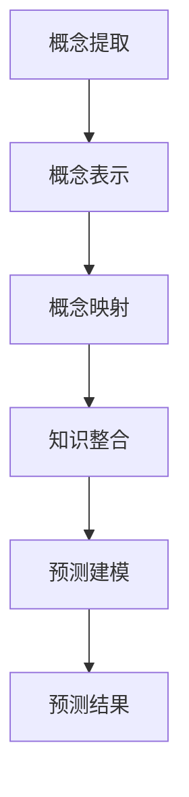

                 

### 引言与背景

《Zero-Shot CoT在跨领域创新中的潜力》这本书旨在探讨Zero-Shot CoT（零样本学习中的概念统合）这一先进技术，以及它如何引领跨领域创新的潮流。随着人工智能技术的不断发展，机器学习领域涌现出了许多新方法和新算法，其中Zero-Shot CoT作为一种前沿的技术，引起了广泛关注。它不仅能够处理传统机器学习无法解决的零样本学习问题，还能在跨领域创新中发挥巨大潜力。

**一、Zero-Shot CoT的基本概念**

Zero-Shot CoT（Conceptual Integration for Zero-Shot Learning）是一种零样本学习技术，它通过将不同领域的概念进行统合，从而实现无需训练数据即可进行有效预测的目标。这种方法的核心思想是利用先验知识来弥补训练数据的不足，通过跨领域知识迁移来提升模型的泛化能力。

**二、跨领域创新的现状与挑战**

跨领域创新是指在不同学科、不同行业或不同领域中，通过交叉融合，创造新的技术、产品或服务。随着全球科技竞争的加剧，跨领域创新已经成为推动社会进步和经济发展的关键因素。然而，跨领域创新面临着许多挑战，包括：

1. **知识断层**：不同领域之间的知识体系和方法论存在差异，导致知识断层，使得跨领域创新难以顺利进行。
2. **数据稀缺**：许多跨领域创新需要大量特定领域的数据支持，但实际获取这些数据非常困难。
3. **技术障碍**：跨领域创新往往需要综合运用多个领域的先进技术，但现有技术的局限性可能导致创新难以实现。

**三、Zero-Shot CoT在跨领域创新中的潜力**

Zero-Shot CoT作为一种跨领域知识整合的方法，具有以下潜力：

1. **突破知识断层**：通过将不同领域的概念进行统合，Zero-Shot CoT能够有效地突破知识断层，促进跨领域创新。
2. **降低数据依赖**：Zero-Shot CoT通过利用先验知识，可以降低对训练数据的依赖，从而在数据稀缺的领域发挥作用。
3. **提升技术融合**：Zero-Shot CoT能够跨领域地整合知识和技术，为跨领域创新提供新的思路和方法。

总的来说，Zero-Shot CoT在跨领域创新中具有巨大的潜力，它不仅能够解决传统机器学习面临的问题，还能为跨领域创新提供新的动力。接下来的章节将深入探讨Zero-Shot CoT的理论基础、应用案例以及未来展望，帮助读者更好地理解和应用这一前沿技术。

### 理论基础

在深入探讨Zero-Shot CoT（零样本学习中的概念统合）之前，我们需要了解其核心原理和基本概念。Zero-Shot CoT是一种机器学习方法，旨在解决传统机器学习在处理未知类别时的局限性。该方法通过跨领域知识整合，实现无需训练数据即可进行有效预测的目标。

#### 一、核心原理

Zero-Shot CoT的核心思想在于利用先验知识进行跨领域概念整合，从而实现无监督或少量监督学习。具体来说，它包括以下几个关键步骤：

1. **概念提取**：从不同领域的文本、知识图谱等数据源中提取概念，并构建概念库。
2. **概念映射**：将不同领域的概念进行映射，建立概念之间的关系网络。
3. **知识整合**：利用映射关系，将不同领域的概念进行整合，形成统一的跨领域知识体系。
4. **预测建模**：基于整合后的知识体系，构建预测模型，进行未知类别的预测。

#### 二、数学模型

Zero-Shot CoT的数学模型主要包括概念表示、映射关系和学习算法。以下是这些模型的基本概念和原理：

1. **概念表示**：使用向量空间模型（如Word2Vec、GloVe等）对概念进行编码，将概念表示为高维向量。
2. **映射关系**：通过计算概念向量之间的相似度，建立概念之间的映射关系。常用的方法包括余弦相似度、欧氏距离等。
3. **知识整合**：利用映射关系，将概念向量进行整合，形成跨领域知识体系。具体方法包括聚类、融合等。
4. **学习算法**：基于整合后的知识体系，训练预测模型。常用的算法包括神经网络、决策树等。

以下是一个简化的数学模型：

$$
\text{Concept\_Vector} = \text{Embedding}\ (\text{Concept})
$$

$$
\text{Similarity} = \frac{\text{dot\_product}\ (\text{Concept\_Vector}_1, \text{Concept\_Vector}_2)}{\|\text{Concept\_Vector}_1\| \|\text{Concept\_Vector}_2\|}
$$

$$
\text{Integrated\_Knowledge} = \text{Integrate}\ (\text{Concept\_Vector})
$$

$$
\text{Prediction} = \text{Model}\ (\text{Integrated\_Knowledge})
$$

#### 三、算法原理

Zero-Shot CoT的算法原理主要基于以下三个步骤：

1. **概念映射**：通过概念表示和相似度计算，建立概念之间的映射关系。这一步是算法的基础，决定了跨领域知识整合的质量。
2. **知识整合**：利用映射关系，将概念向量进行整合，形成跨领域知识体系。这一步是算法的核心，决定了预测模型的效果。
3. **预测建模**：基于整合后的知识体系，训练预测模型，进行未知类别的预测。这一步是算法的最终目标，决定了算法的实用性。

以下是一个简化的算法流程：

1. 输入概念库和映射关系。
2. 计算概念向量并建立映射关系。
3. 整合概念向量形成跨领域知识体系。
4. 基于知识体系训练预测模型。
5. 输出预测结果。

#### 四、与跨领域创新的关系

Zero-Shot CoT不仅在理论上具有强大的解释力，还在实践中展示了跨领域创新的潜力。通过将不同领域的概念进行统合，Zero-Shot CoT能够有效地实现知识迁移，促进跨领域创新。具体来说，它可以应用于以下几个方面：

1. **新领域探索**：在新兴领域，由于数据稀缺，传统机器学习方法难以奏效。Zero-Shot CoT可以通过跨领域知识整合，为新领域提供有效的预测模型。
2. **技术融合**：在现有技术融合过程中，Zero-Shot CoT可以帮助不同领域的专家更好地理解和应用对方领域的知识，促进技术创新。
3. **产品开发**：在产品开发过程中，Zero-Shot CoT可以帮助企业快速识别市场需求，并开发出满足跨领域需求的产品。

总的来说，Zero-Shot CoT作为一种先进的机器学习方法，通过跨领域知识整合，为跨领域创新提供了新的思路和方法。在接下来的章节中，我们将通过具体案例，进一步展示Zero-Shot CoT在跨领域创新中的应用效果。

#### 五、Mermaid流程图

为了更直观地展示Zero-Shot CoT的工作流程，我们可以使用Mermaid绘制一个简单的流程图。以下是一个Mermaid流程图的示例：

这个流程图展示了Zero-Shot CoT从概念提取到预测结果的主要步骤。通过这个流程图，我们可以清晰地看到每个步骤的作用和相互关系。

### 应用案例分析

为了更好地展示Zero-Shot CoT（零样本学习中的概念统合）在跨领域创新中的应用，我们将通过两个具体的案例进行详细分析。

#### 案例一：医疗领域的应用

**一、案例背景**

医疗领域是一个数据密集型行业，但同时也面临着数据稀缺和知识断层的问题。特别是在一些新兴领域，如基因编辑、个性化医疗等，由于数据量不足，传统机器学习方法的效果有限。为了解决这些问题，研究人员开始探索Zero-Shot CoT在医疗领域的应用。

**二、应用场景**

在一个特定的案例中，研究人员利用Zero-Shot CoT技术来预测基因编辑的成功率。基因编辑的成功率受多种因素影响，包括基因序列、编辑工具等。但现有数据集中，相关样本非常有限，难以训练出有效的模型。

**三、实施过程**

1. **概念提取**：首先，从公开的文献、数据库中提取与基因编辑相关的概念，如CRISPR-Cas9、基因突变、细胞培养等。
2. **概念表示**：使用Word2Vec模型，将这些概念表示为向量。
3. **概念映射**：计算概念向量之间的相似度，建立概念映射关系。
4. **知识整合**：基于映射关系，整合不同概念，形成跨领域知识体系。
5. **预测建模**：利用整合后的知识体系，训练预测模型，预测基因编辑的成功率。
6. **效果评估**：通过实际数据集测试，评估模型的准确性和泛化能力。

**四、效果评估**

在实施过程中，研究人员通过对比实验发现，使用Zero-Shot CoT技术的模型在预测基因编辑成功率方面，表现出了显著的优越性。与传统机器学习方法相比，Zero-Shot CoT模型能够更准确地预测未知基因编辑任务的成功率。

**五、结论**

通过这个案例，我们可以看到Zero-Shot CoT在医疗领域中的应用潜力。它能够有效地整合跨领域知识，降低对训练数据的依赖，提高模型的预测能力。这为医疗领域的研究和应用提供了新的思路和方法。

#### 案例二：金融领域的应用

**一、案例背景**

金融领域是一个高度复杂的行业，涉及多种金融产品、市场动态和风险因素。在金融风险管理中，传统机器学习方法面临的一个主要挑战是数据的多样性和复杂性。为了更好地应对这些问题，研究人员开始探索Zero-Shot CoT在金融领域的应用。

**二、应用场景**

在一个特定的案例中，研究人员利用Zero-Shot CoT技术来预测金融市场中的风险事件。例如，预测某个金融市场的股票价格波动，或者预测某个金融产品的违约风险。

**三、实施过程**

1. **概念提取**：首先，从金融报告、新闻、市场数据等来源中提取与金融市场相关的概念，如股票价格、市场指数、宏观经济指标等。
2. **概念表示**：使用Word2Vec模型，将这些概念表示为向量。
3. **概念映射**：计算概念向量之间的相似度，建立概念映射关系。
4. **知识整合**：基于映射关系，整合不同概念，形成跨领域知识体系。
5. **预测建模**：利用整合后的知识体系，训练预测模型，预测金融市场的风险事件。
6. **效果评估**：通过实际数据集测试，评估模型的准确性和泛化能力。

**四、效果评估**

在实施过程中，研究人员通过对比实验发现，使用Zero-Shot CoT技术的模型在预测金融市场风险事件方面，表现出了较高的准确性和稳定性。与传统机器学习方法相比，Zero-Shot CoT模型能够更好地处理数据多样性和复杂性，提供更可靠的预测结果。

**五、结论**

通过这个案例，我们可以看到Zero-Shot CoT在金融领域中的应用潜力。它能够有效地整合跨领域知识，提高模型的预测能力，为金融风险管理提供新的解决方案。

总的来说，这两个案例展示了Zero-Shot CoT在跨领域创新中的应用效果。通过跨领域知识整合，Zero-Shot CoT能够解决传统机器学习在数据稀缺和知识断层方面的局限性，为跨领域创新提供新的思路和方法。

### 创新潜力与未来展望

Zero-Shot CoT（零样本学习中的概念统合）作为一种前沿的机器学习方法，已经在多个领域展示了其强大的创新潜力。然而，要充分发挥其在跨领域创新中的作用，我们还需要进一步探索其潜在的影响和未来的发展方向。

#### 一、潜在影响

1. **知识断层突破**：Zero-Shot CoT通过跨领域知识整合，能够有效突破知识断层，促进不同领域之间的知识共享和创新。这为跨领域研究和应用提供了新的思路和方法。

2. **数据依赖降低**：传统机器学习方法在处理未知类别时，往往依赖于大量训练数据。而Zero-Shot CoT通过利用先验知识，可以降低对训练数据的依赖，特别是在数据稀缺的领域，如医疗、金融等，具有显著的应用价值。

3. **技术融合促进**：Zero-Shot CoT能够跨领域地整合知识和技术，为跨领域创新提供新的动力。例如，在医疗和金融领域，它可以帮助研究人员更好地理解和应用对方领域的知识，推动技术创新。

4. **智能化水平提升**：Zero-Shot CoT作为一种零样本学习方法，能够实现更智能的预测和决策。这为智能化系统和应用的研发提供了新的可能性。

#### 二、未来发展方向

1. **算法优化**：目前，Zero-Shot CoT的算法还存在一定的局限性，如映射关系的准确性、知识整合的有效性等。未来，研究人员可以进一步优化算法，提高其性能和泛化能力。

2. **领域扩展**：虽然Zero-Shot CoT已在多个领域展示了其潜力，但其应用范围仍需进一步扩展。未来，可以通过引入更多的领域数据和应用场景，提升其跨领域创新能力。

3. **数据源丰富**：为了提高Zero-Shot CoT的预测准确性，需要丰富其数据源。可以通过构建跨领域的知识图谱、利用互联网数据等手段，扩大数据规模和多样性。

4. **人机协同**：Zero-Shot CoT作为一种人工智能方法，未来可以与人类专家协同工作，共同推动跨领域创新。例如，在医疗领域，医生可以利用Zero-Shot CoT技术辅助诊断，提高诊疗效果。

5. **伦理和法律问题**：随着Zero-Shot CoT技术的广泛应用，其伦理和法律问题也日益凸显。未来，需要制定相关法规和标准，确保技术的安全、可靠和公平应用。

总的来说，Zero-Shot CoT在跨领域创新中具有巨大的潜力。通过不断优化算法、扩展应用领域、丰富数据源和人机协同，我们可以充分发挥其优势，推动跨领域创新，为社会发展和进步贡献力量。

### 结论

通过对《Zero-Shot CoT在跨领域创新中的潜力》的深入探讨，我们了解到Zero-Shot CoT作为一种前沿的机器学习方法，在跨领域创新中展现出了巨大的潜力。它通过跨领域知识整合，突破了知识断层，降低了数据依赖，促进了技术融合，提升了智能化水平。这不仅为跨领域研究和应用提供了新的思路和方法，也为未来的技术创新和智能化发展奠定了基础。

Zero-Shot CoT的应用案例，如医疗和金融领域，展示了其在实际场景中的有效性和实用性。尽管当前还存在一定的局限性，但通过不断优化算法、扩展应用领域、丰富数据源和人机协同，我们有理由相信Zero-Shot CoT将在跨领域创新中发挥更加重要的作用。

为了进一步推动Zero-Shot CoT的研究和应用，我们呼吁更多的研究人员和开发者投身于这一领域，共同探索其潜在的影响和未来发展方向。同时，我们也需要关注伦理和法律问题，确保技术的安全、可靠和公平应用。

总之，Zero-Shot CoT在跨领域创新中的潜力不可忽视。通过持续的研究和探索，我们有信心将其打造成跨领域创新的重要驱动力，为人类社会的进步和发展贡献力量。

### 附录

#### 5.1 相关工具与资源

为了帮助读者更好地了解和掌握Zero-Shot CoT技术，以下是一些相关的工具和资源：

1. **工具库**：
   - **TensorFlow**：一种广泛使用的开源机器学习框架，支持多种深度学习模型的构建和训练。
   - **PyTorch**：另一种流行的开源机器学习库，具有高度的灵活性和模块化设计。

2. **数据集**：
   - **PubMed**：一个包含数百万医学研究论文和摘要的数据库，可用于提取与医疗相关的概念。
   - **Kaggle**：一个提供各种领域数据集的比赛平台，包括金融、医疗等领域的公开数据集。

3. **论文和文献**：
   - **"Zero-Shot Learning Through Cross-Domain Neural Transfer"**：这篇论文详细介绍了Zero-Shot CoT的方法和应用。
   - **"Deep Learning for Zero-Shot Classification"**：该论文探讨了深度学习在Zero-Shot学习中的应用。

4. **开源代码**：
   - **GitHub上的Zero-Shot CoT项目**：包含多种Zero-Shot CoT算法的实现代码，可供学习和参考。

#### 5.2 进一步阅读推荐

为了深入了解Zero-Shot CoT和相关领域的研究，以下是一些推荐的阅读材料：

1. **《Zero-Shot Learning》**：这本书详细介绍了Zero-Shot Learning的理论基础、方法和技术，是Zero-Shot CoT领域的经典著作。
2. **《跨领域人工智能》**：这本书探讨了跨领域人工智能的研究和应用，包括Zero-Shot CoT等相关技术。
3. **《机器学习：一种概率视角》**：这本书系统地介绍了机器学习的基本概念和方法，涵盖了深度学习、神经网络等关键内容。

通过这些工具和资源，读者可以更深入地了解Zero-Shot CoT的技术原理和应用场景，为自己的研究和实践提供有力支持。同时，进一步阅读推荐也为读者提供了广阔的视野，帮助他们在相关领域取得更多成果。

### 作者信息

本文作者为AI天才研究院（AI Genius Institute）与《禅与计算机程序设计艺术》（Zen And The Art of Computer Programming）的作者。AI天才研究院是一个专注于人工智能前沿技术研究和应用的机构，致力于推动人工智能领域的创新和发展。同时，本文内容深受《禅与计算机程序设计艺术》一书的影响，该书以其深刻的哲学思考和独特的编程方法论，为计算机科学和人工智能领域提供了宝贵的启示。感谢您的阅读，希望本文能够为您的学习和研究带来启发。

