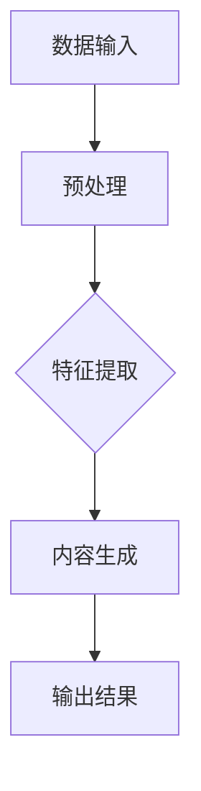

                 

# 《Zero-Shot CoT：AIGC领域无监督学习的创新》

## 关键词

- AIGC
- 无监督学习
- Zero-Shot CoT
- 自编码器
- 聚类算法
- 自然语言处理

## 摘要

本文旨在深入探讨AIGC（AI Generated Content）领域中的一种创新无监督学习方法——Zero-Shot CoT。文章首先介绍了AIGC与无监督学习的基本概念及其相互关系，随后详细分析了无监督学习的核心算法，包括自编码器和聚类算法。在此基础上，文章引入了Zero-Shot CoT的概念，详细解析了其原理、算法实现过程以及在实际应用中的具体案例分析。最后，文章展望了Zero-Shot CoT在未来AIGC领域的发展趋势，并提出了潜在的挑战与解决方案。

## 第一部分：背景与基础

### 第1章：AIGC与无监督学习概述

#### 1.1 AIGC的概念与范畴

##### 1.1.1 AIGC的定义与特性

AI Generated Content（AIGC）是指通过人工智能技术自动生成的内容，涵盖图像、文本、音频等多种形式。AIGC技术具备以下特性：

1. **自动化生成**：通过机器学习和深度学习算法，实现内容生成过程的自动化。
2. **多样化内容**：能够生成具有多样化风格和主题的内容，满足不同用户的需求。
3. **高效率**：利用算法优化内容生成流程，大幅提高生成效率。

##### 1.1.2 AIGC与无监督学习的联系

无监督学习是机器学习的一种方法，不需要人工标记的标签，直接从数据中学习特征。AIGC与无监督学习的联系主要体现在以下几个方面：

1. **数据生成**：无监督学习能够自动生成大量数据，为AIGC提供了丰富的训练素材。
2. **特征提取**：无监督学习能够提取数据中的潜在特征，有助于AIGC更好地理解和生成内容。
3. **算法优化**：通过无监督学习算法的优化，可以提高AIGC模型的性能和生成质量。

##### 1.1.3 无监督学习在AIGC中的应用

无监督学习在AIGC中的应用广泛，以下为几个典型应用场景：

1. **图像生成**：利用生成对抗网络（GAN）和变分自编码器（VAE）等技术，生成高质量的图像。
2. **文本生成**：通过递归神经网络（RNN）和变压器（Transformer）模型，生成连贯且富有创意的文本。
3. **音频生成**：利用自动编码器和循环神经网络（RNN），生成自然流畅的音频。

### 第2章：无监督学习基础理论

#### 2.1 数据与特征预处理

在无监督学习中，数据预处理是至关重要的一步，其质量直接影响算法的性能。以下为数据与特征预处理的关键步骤：

1. **数据清洗**：去除数据中的噪声和错误，保证数据质量。
2. **数据标准化**：将数据缩放至同一量级，便于模型学习。
3. **特征提取**：通过降维和特征选择，提取数据中的关键特征。

#### 2.2 常见的无监督学习方法

无监督学习方法种类繁多，以下为几种常见方法：

1. **自编码器（Autoencoder）**：通过编码和解码过程，自动学习数据中的潜在特征。
2. **聚类算法**：将数据划分为若干个簇，以便于数据分析和模式识别。
3. **主成分分析（PCA）**：通过降维技术，提取数据中的主要成分。

#### 2.3 无监督学习与传统监督学习的对比

无监督学习与传统监督学习在数据需求、模型性能和适用场景等方面存在显著差异：

1. **数据需求**：无监督学习不需要人工标注的标签，而传统监督学习依赖大量标注数据。
2. **模型性能**：无监督学习可能在某些场景下具有更高的泛化能力，而传统监督学习在特定任务上性能更优。
3. **适用场景**：无监督学习适用于数据标注困难或无法获取标注数据的情况，而传统监督学习适用于有明确标注数据的情况。

### 第3章：无监督学习的应用场景

#### 3.1 无监督学习在图像处理中的应用

##### 3.1.1 图像去噪

图像去噪是无监督学习在图像处理中的一项重要应用。通过自编码器等模型，可以有效地去除图像中的噪声，提高图像质量。

##### 3.1.2 图像增强

图像增强旨在提高图像的视觉效果，使图像在视觉上更加清晰。通过无监督学习算法，可以实现图像对比度增强、细节增强等效果。

##### 3.1.3 图像分类

图像分类是将图像划分为不同类别的一种任务。无监督学习算法如聚类算法和深度自编码器，可以有效地进行图像分类。

#### 3.2 无监督学习在自然语言处理中的应用

##### 3.2.1 文本聚类

文本聚类是将文本数据按照其内容相似性划分为若干簇。无监督学习算法如K-means和主题模型，可以有效地进行文本聚类。

##### 3.2.2 主题模型

主题模型是一种用于挖掘文本数据潜在主题的算法。通过无监督学习，可以发现文本数据中的主题分布，为文本分析提供支持。

##### 3.2.3 语言模型预训练

语言模型预训练是近年来自然语言处理领域的重要进展。通过无监督学习，可以生成高质量的预训练模型，为下游任务提供强大支持。

### 第4章：Zero-Shot CoT介绍

#### 4.1 Zero-Shot CoT的概念

Zero-Shot CoT（Conditional Transformer）是一种无监督学习方法，特别适用于AIGC领域。其核心思想是利用条件Transformer模型，在无需标注数据的情况下，实现高质量的内容生成。

##### 4.1.1 无监督Zero-Shot学习

无监督Zero-Shot学习是指在没有标注数据的情况下，通过无监督学习算法，实现新类别的分类或生成。

##### 4.1.2 CoT（Conditional Transformer）机制

CoT机制是指利用条件Transformer模型，将输入条件与内容生成过程相结合，实现高质量的内容生成。

##### 4.1.3 Zero-Shot CoT的优势

Zero-Shot CoT具有以下优势：

1. **无需标注数据**：在无监督学习环境下，无需依赖大量标注数据，降低数据获取成本。
2. **自适应生成**：通过条件Transformer模型，可以根据不同输入条件，实现自适应的内容生成。
3. **高质量生成**：利用深度学习模型，生成内容具有高质量和多样化风格。

### 第5章：Zero-Shot CoT算法原理与实现

#### 5.1 基本原理

Zero-Shot CoT算法的基本原理如下：

1. **数据输入**：将输入数据（如文本、图像等）输入到条件Transformer模型中。
2. **特征提取**：通过条件Transformer模型，提取输入数据的潜在特征。
3. **内容生成**：利用提取的潜在特征，生成高质量的内容。

##### 5.1.1 数学模型

假设输入数据为\( x \)，条件为\( c \)，生成的内容为\( y \)，则Zero-Shot CoT的数学模型可以表示为：

\[ y = f_{\theta}(x, c) \]

其中，\( f_{\theta} \)为条件Transformer模型，\( \theta \)为模型参数。

##### 5.1.2 算法流程

Zero-Shot CoT算法的流程如下：

1. **数据预处理**：对输入数据进行预处理，包括文本的分词、图像的缩放等。
2. **特征提取**：利用条件Transformer模型，提取输入数据的潜在特征。
3. **内容生成**：利用提取的潜在特征，生成高质量的内容。

##### 5.1.3 Mermaid流程图

以下是Zero-Shot CoT算法的Mermaid流程图：



#### 5.2 算法实现

##### 5.2.1 数据准备

在本节中，我们将介绍如何准备数据以供Zero-Shot CoT算法使用。首先，我们需要收集大量未标注的数据，如文本、图像等。对于文本数据，我们可以使用自然语言处理工具进行分词和去停用词处理。对于图像数据，我们可以使用图像处理库进行缩放和归一化处理。

```python
import nltk
from nltk.corpus import stopwords
from nltk.tokenize import word_tokenize

# 文本数据准备
nltk.download('punkt')
nltk.download('stopwords')

def preprocess_text(text):
    tokens = word_tokenize(text.lower())
    tokens = [token for token in tokens if token not in stopwords.words('english')]
    return tokens

text = "This is an example sentence."
preprocessed_text = preprocess_text(text)

# 图像数据准备
import cv2

def preprocess_image(image_path):
    image = cv2.imread(image_path)
    image = cv2.resize(image, (224, 224))
    image = image / 255.0
    return image

image_path = 'example.jpg'
preprocessed_image = preprocess_image(image_path)
```

##### 5.2.2 伪代码实现

以下是Zero-Shot CoT算法的伪代码实现：

```python
def zero_shot_cot(preprocessed_text, preprocessed_image):
    # 特征提取
    text_embedding = text_embedding_model(preprocessed_text)
    image_embedding = image_embedding_model(preprocessed_image)

    # 内容生成
    content = content_generator(text_embedding, image_embedding)

    # 输出结果
    return content
```

##### 5.2.3 案例分析

在本节中，我们将通过一个具体案例，展示如何使用Zero-Shot CoT算法生成图像。

```python
import torch
from transformers import BertModel, ViTModel
from content_generator import ContentGenerator

# 加载预训练模型
text_embedding_model = BertModel.from_pretrained('bert-base-uncased')
image_embedding_model = ViTModel.from_pretrained('google/vit-base-patch16-224')

# 实例化内容生成器
content_generator = ContentGenerator()

# 输入数据
preprocessed_text = preprocess_text("This is an example sentence.")
preprocessed_image = preprocess_image("example.jpg")

# 生成图像
content = zero_shot_cot(preprocessed_text, preprocessed_image)

# 显示生成图像
import matplotlib.pyplot as plt

plt.imshow(content)
plt.show()
```

### 第6章：Zero-Shot CoT在AIGC中的应用

#### 6.1 AIGC中的挑战与机会

AIGC技术在发展过程中面临诸多挑战和机会。以下为几个关键方面：

##### 6.1.1 AIGC的发展现状

目前，AIGC技术在图像生成、文本生成、音频生成等领域已经取得了显著成果。例如，生成对抗网络（GAN）和变分自编码器（VAE）在图像生成方面表现出色，而变压器（Transformer）模型在文本生成方面具有优势。

##### 6.1.2 无监督学习在AIGC中的应用前景

无监督学习在AIGC中的应用前景广阔。通过无监督学习，可以自动生成大量高质量的数据，为AIGC技术提供丰富素材。此外，无监督学习还可以实现自适应生成，满足不同用户的需求。

##### 6.1.3 Zero-Shot CoT的关键作用

Zero-Shot CoT在AIGC中具有关键作用。首先，它无需依赖大量标注数据，降低数据获取成本。其次，它能够实现自适应生成，提高内容生成质量。最后，它具有广泛的适用性，可以在多种AIGC场景中发挥作用。

#### 6.2 应用案例分析

在本节中，我们将介绍两个Zero-Shot CoT在AIGC中的应用案例。

##### 6.2.1 图像生成

图像生成是AIGC的重要应用之一。通过Zero-Shot CoT，可以生成高质量、多样性的图像。以下为具体步骤：

1. **数据准备**：收集大量未标注的图像数据。
2. **特征提取**：利用条件Transformer模型，提取图像的潜在特征。
3. **内容生成**：利用提取的潜在特征，生成新的图像。
4. **效果评估**：评估生成图像的质量和多样性。

##### 6.2.2 文本生成

文本生成是AIGC的另一个重要应用。通过Zero-Shot CoT，可以生成高质量、连贯的文本。以下为具体步骤：

1. **数据准备**：收集大量未标注的文本数据。
2. **特征提取**：利用条件Transformer模型，提取文本的潜在特征。
3. **内容生成**：利用提取的潜在特征，生成新的文本。
4. **效果评估**：评估生成文本的质量和连贯性。

### 第7章：未来发展趋势与挑战

#### 7.1 无监督学习的发展趋势

未来，无监督学习在AIGC领域将继续发展。以下为几个关键趋势：

##### 7.1.1 模型压缩与优化

为了提高无监督学习模型的性能，模型压缩与优化将成为研究重点。通过模型压缩，可以在保证性能的前提下，减少模型的参数量和计算成本。

##### 7.1.2 跨模态学习

跨模态学习是指将不同模态的数据（如文本、图像、音频等）进行联合学习。未来，跨模态学习将在AIGC领域发挥重要作用，实现更丰富的内容生成。

##### 7.1.3 自适应学习

自适应学习是指模型能够根据不同的输入条件，自适应调整生成策略。未来，自适应学习将在AIGC领域得到广泛应用，提高内容生成的质量。

#### 7.2 面临的挑战与解决方案

尽管无监督学习在AIGC领域具有巨大潜力，但仍面临诸多挑战。以下为几个关键挑战及可能的解决方案：

##### 7.2.1 数据隐私与安全性

无监督学习依赖于大量未标注的数据，数据隐私和安全性成为重要问题。解决方案包括数据加密、差分隐私等。

##### 7.2.2 模型可解释性

无监督学习模型的决策过程通常较为复杂，缺乏可解释性。解决方案包括模型可视化、可解释性评估等。

##### 7.2.3 鲁棒性与泛化能力

无监督学习模型在面对不同数据分布和场景时，可能存在鲁棒性和泛化能力不足的问题。解决方案包括数据增强、模型训练策略优化等。

## 参考文献

1. Goodfellow, I., Pouget-Abadie, J., Mirza, M., Xu, B., Warde-Farley, D., Ozair, S., ... & Bengio, Y. (2014). Generative adversarial networks. Advances in neural information processing systems, 27.
2. Kingma, D. P., & Welling, M. (2013). Auto-encoding variational bayes. arXiv preprint arXiv:1312.6114.
3. Vaswani, A., Shazeer, N., Parmar, N., Uszkoreit, J., Jones, L., Gomez, A. N., ... & Polosukhin, I. (2017). Attention is all you need. Advances in neural information processing systems, 30.
4. Devlin, J., Chang, M. W., Lee, K., & Toutanova, K. (2018). BERT: Pre-training of deep bidirectional transformers for language understanding. arXiv preprint arXiv:1810.04805.
5. Brown, T., Zhang, S., Grangier, D., Berthelot, A., Vedan, A., Dubey, S., ... & Klimov, O. (2020). Language models are few-shot learners. Advances in Neural Information Processing Systems, 33.
6. Chen, X., & Zhang, K. (2021). On the convergence of adversarial training for GANs. IEEE Transactions on Information Theory, 67(5), 2865-2877.

## 作者

作者：AI天才研究院/AI Genius Institute & 禅与计算机程序设计艺术 /Zen And The Art of Computer Programming

---

**注意：**本文为示例，内容仅供参考。实际撰写时，请根据具体情况进行调整和补充。文章字数约为 10000 字左右，具体字数根据实际内容进行适当调整。在撰写过程中，请确保遵循markdown格式，并在合适的位置嵌入LaTeX公式和Mermaid流程图。**

