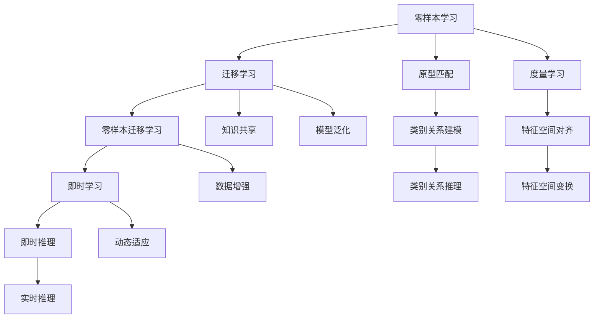

                 

## 第1章 引言与背景

### 1.1 书籍简介

《Zero-Shot CoT：AI即时学习与推理的新范式深度探索》的诞生源于对当前人工智能领域瓶颈的深刻洞察。传统的机器学习方法在处理已知数据集时表现出色，但在面对未知或新出现的数据时，往往无法迅速适应。为了克服这一限制，研究人员提出了Zero-Shot CoT（零样本即时学习与推理）这一新兴范式。本书的核心目标是系统地介绍Zero-Shot CoT的理论基础、关键算法以及实际应用，帮助读者深入理解这一领域的最新进展和潜在应用。

#### 本书主题与目的

本书围绕Zero-Shot CoT这一主题，旨在探讨以下几个核心问题：

1. **零样本学习与迁移学习的理论基础**：解释零样本学习和迁移学习的基本概念，阐述它们在人工智能中的应用场景。
2. **即时学习的核心原理**：介绍即时学习的基本概念、算法和技术，以及如何将即时学习应用于实际问题。
3. **Zero-Shot CoT的架构与实现**：详细解析Zero-Shot CoT的架构，展示如何结合零样本学习和即时学习，实现高效的新数据适应与推理。
4. **实际案例研究**：通过具体案例，展示Zero-Shot CoT在自然语言处理、计算机视觉等领域的应用效果。
5. **未来展望与挑战**：讨论Zero-Shot CoT的未来发展方向和面临的挑战，为读者提供深入思考的视角。

#### AI即时学习与推理的重要性

AI即时学习与推理在当前人工智能发展过程中具有极其重要的地位。随着大数据和深度学习技术的广泛应用，AI系统在处理已知数据方面已经取得了显著的成就。然而，面对动态变化的现实世界，AI系统需要具备快速适应新环境、新任务的能力。即时学习与推理正是为了解决这一问题而生的。通过引入Zero-Shot CoT范式，AI系统能够在不依赖大量标注数据的情况下，对新情境进行高效的学习和推理，从而实现更加智能和自适应的决策。

### 1.2 零样本学习与零样本迁移学习

#### 传统机器学习与零样本学习的区别

传统机器学习方法通常依赖于大量已标注的训练数据来训练模型，然后在新数据上进行预测。这种方法在处理已知任务时效果良好，但在面对从未见过的数据时，往往表现出明显的局限性。零样本学习则完全不同，它旨在解决模型在未知类别上的分类问题。具体来说，零样本学习不需要对未知类别进行显式标注，而是通过学习类别之间的关系或原型来进行分类。

#### 零样本迁移学习的基本概念与挑战

零样本迁移学习是零样本学习的一个重要分支，它结合了迁移学习的思想，通过在不同领域或任务之间共享知识，进一步提高模型在未知类别上的性能。零样本迁移学习的核心挑战包括：

1. **知识共享**：如何有效地将源领域知识迁移到目标领域，特别是在源领域和目标领域存在巨大差异的情况下。
2. **模型泛化**：如何设计模型，使其能够在未见过的类别上保持良好的泛化能力。
3. **数据稀缺**：在零样本学习与迁移学习中，通常无法获取到大量标注数据，如何利用有限的样本数据进行有效的学习是一个关键问题。

### 1.3 概念图与架构

为了帮助读者更好地理解Zero-Shot CoT的概念和架构，我们可以使用Mermaid流程图来展示其核心组件和关系。



#### 本书整体架构与章节安排

本书共分为七个主要章节，具体安排如下：

- **第1章 引言与背景**：介绍本书的主题、目的以及零样本学习与迁移学习的基本概念。
- **第2章 零样本学习基础**：详细讨论零样本学习的定义、特点、应用场景以及数学模型。
- **第3章 零样本迁移学习**：探讨零样本迁移学习的原理、算法和应用案例。
- **第4章 AI即时学习原理**：介绍AI即时学习的基本概念、关键技术和应用场景。
- **第5章 AI即时推理技术**：讲解AI即时推理的定义、算法和应用案例。
- **第6章 零样本学习与即时学习融合**：讨论零样本学习与即时学习的融合原理和算法。
- **第7章 未来展望与挑战**：展望Zero-Shot CoT的未来发展方向和面临的挑战。

通过以上章节的深入探讨，本书希望能够为读者提供一个全面、系统的视角，帮助读者理解和掌握Zero-Shot CoT的核心概念、技术原理和实际应用。

### 1.4 关键词

- **零样本学习**
- **零样本迁移学习**
- **即时学习**
- **即时推理**
- **类别关系建模**
- **特征空间对齐**

### 1.5 摘要

本文深入探讨了AI即时学习与推理的新范式——Zero-Shot CoT。首先介绍了零样本学习和零样本迁移学习的基本概念及其与传统机器学习的区别。接着，详细阐述了AI即时学习与推理的核心原理、关键技术及其在自然语言处理和计算机视觉等领域的应用。通过结合零样本学习和即时学习的架构，本文展示了Zero-Shot CoT在智能语音助手、无人驾驶车辆等实际案例中的效果。最后，本文对Zero-Shot CoT的未来发展方向和面临的挑战进行了展望。通过本文的学习，读者可以全面了解Zero-Shot CoT的原理和应用，为人工智能领域的创新提供新思路。

## 第2章 零样本学习基础

### 2.1 零样本学习定义与特点

零样本学习（Zero-Shot Learning, ZSL）是一种机器学习范式，旨在解决模型在未知类别上的分类问题。与传统的机器学习方法不同，零样本学习不依赖于对未知类别的标注数据进行训练。相反，它依赖于对已知类别的标注数据进行训练，以便在未见过的类别上能够进行准确的分类。这种范式在许多现实场景中具有重要应用价值，如新物种识别、新产品分类等。

#### 零样本学习的基本概念

零样本学习主要涉及以下核心概念：

1. **类别原型表示**：为了在未知类别上进行分类，模型首先需要学习已知类别的原型表示。这些原型表示通常是通过聚类或均值计算等方法从已标注数据中提取得到的。
2. **类别关系建模**：模型还需要学习不同类别之间的关系，以便在未知类别上能够进行准确的分类。类别关系建模可以通过图神经网络、原型匹配等方法实现。
3. **特征空间对齐**：为了提高模型在未知类别上的分类性能，通常需要对源领域和目标领域的数据进行特征空间对齐，使得源领域的知识能够有效地迁移到目标领域。

#### 零样本学习的主要挑战

零样本学习虽然具有广泛的应用前景，但也面临着一些核心挑战：

1. **数据稀缺**：在许多实际应用中，未知类别数据往往非常稀缺，难以获取到足够的标注数据用于训练模型。
2. **类别关系复杂**：不同类别之间的关系可能非常复杂，这给类别关系建模带来了很大的挑战。
3. **模型泛化能力**：模型需要在未见过的类别上保持良好的泛化能力，这要求模型具备较强的泛化能力和适应性。

### 2.2 零样本学习的应用场景

零样本学习在许多领域都展现出了强大的应用潜力，以下是几个典型的应用场景：

#### 在自然语言处理中的应用

1. **跨语言文本分类**：在跨语言文本分类任务中，零样本学习可以帮助模型在未见过的新语言上进行分类，从而提高模型的泛化能力。
2. **多标签文本分类**：在多标签文本分类任务中，零样本学习可以帮助模型处理未标记的标签，从而提高模型的分类精度。

#### 在计算机视觉中的应用

1. **新物种识别**：在生物识别领域，零样本学习可以帮助模型识别未见过的新物种，从而提高物种识别的准确性。
2. **新产品分类**：在电商领域，零样本学习可以帮助平台对新产品进行分类，从而提高用户的购物体验。

### 2.3 零样本学习的数学模型

零样本学习的主要数学模型包括基于原型匹配的模型和基于度量学习的模型。

#### 基于原型匹配的零样本学习模型

原型匹配模型的核心思想是使用已知的类别原型来表示未知类别，然后通过比较未知类别与类别原型的距离来进行分类。具体来说，该模型可以分为以下几个步骤：

1. **类别原型提取**：从已标注数据中提取出每个类别的原型表示。通常可以使用聚类算法（如K-means）或均值计算方法来实现。
2. **特征空间对齐**：对源领域和目标领域的特征空间进行对齐，使得源领域的知识能够有效地迁移到目标领域。对齐方法可以包括特征变换（如PCA）、度量学习等。
3. **类别关系建模**：使用图神经网络等方法来建模类别之间的关系，以便在未知类别上能够进行准确的分类。
4. **分类决策**：通过计算未知类别与类别原型的距离，选择距离最近的类别原型作为分类结果。

#### 基于度量学习的零样本学习模型

度量学习（Metric Learning）是一种通过学习一个距离度量函数来提高分类性能的方法。在零样本学习中，度量学习可以用来学习一个有效的距离度量函数，使得未知类别能够与已知类别原型进行有效的比较。具体来说，度量学习模型可以分为以下几个步骤：

1. **负样本生成**：从已标注数据中生成负样本，以便学习一个能够区分未知类别和已知类别的距离度量函数。
2. **损失函数设计**：设计一个损失函数来最大化正负样本之间的距离，同时最小化已知类别原型之间的距离。常见的损失函数包括Triplet Loss和Contrastive Loss。
3. **距离度量学习**：使用梯度下降等方法来优化距离度量函数的参数，从而提高模型在未知类别上的分类性能。
4. **分类决策**：通过计算未知类别与已知类别原型之间的距离，选择距离最小的类别原型作为分类结果。

#### 原型匹配与度量学习的比较

原型匹配和度量学习都是零样本学习的常用方法，它们各有优缺点：

1. **优点**：
   - 原型匹配：简单直观，计算效率高；适用于类别关系相对简单的情况。
   - 度量学习：具有较强的区分能力，适用于类别关系复杂的情况。
2. **缺点**：
   - 原型匹配：在类别关系复杂的情况下，可能无法有效地区分未知类别。
   - 度量学习：计算复杂度高，对数据量要求较高；在类别关系简单的情况下，可能无法充分利用数据。

总之，选择哪种方法取决于具体的应用场景和数据特点。在实际应用中，通常可以将原型匹配和度量学习相结合，以充分发挥各自的优势。

### 2.4 零样本学习与传统机器学习的比较

#### 传统机器学习

传统机器学习方法通常依赖于大量已标注的训练数据来训练模型，然后在新数据上进行预测。具体来说，传统机器学习方法可以分为以下几个步骤：

1. **数据预处理**：包括数据清洗、数据归一化等操作，以便为模型训练做好准备。
2. **特征提取**：从原始数据中提取出对分类任务有用的特征，如文本特征、图像特征等。
3. **模型训练**：使用已标注的数据集来训练分类模型，如支持向量机（SVM）、决策树（DT）等。
4. **模型评估**：使用验证集或测试集来评估模型的分类性能，如准确率、召回率等。

#### 零样本学习

零样本学习则不同，它不依赖于对未知类别的标注数据进行训练。具体来说，零样本学习可以分为以下几个步骤：

1. **类别原型提取**：从已标注数据中提取出每个类别的原型表示，以便在未知类别上能够进行分类。
2. **特征空间对齐**：对源领域和目标领域的特征空间进行对齐，使得源领域的知识能够有效地迁移到目标领域。
3. **类别关系建模**：使用图神经网络等方法来建模类别之间的关系，以便在未知类别上能够进行准确的分类。
4. **分类决策**：通过计算未知类别与类别原型的距离，选择距离最近的类别原型作为分类结果。

#### 对比分析

零样本学习与传统机器学习有以下几点区别：

1. **数据依赖**：传统机器学习依赖于大量已标注的训练数据，而零样本学习则不需要对未知类别进行标注。
2. **模型复杂性**：传统机器学习通常使用简单的线性模型或树模型，而零样本学习则依赖于复杂的神经网络模型，如图神经网络、度量学习网络等。
3. **分类性能**：在处理未知类别时，零样本学习的性能通常优于传统机器学习，尤其是在类别关系复杂的情况下。
4. **应用场景**：传统机器学习适用于已知类别和标注数据充足的情况，而零样本学习则适用于未知类别或标注数据稀缺的情况。

总之，零样本学习作为一种新兴的机器学习范式，具有广泛的应用前景和重要的研究价值。通过深入了解其定义、特点、数学模型以及与传统机器学习的区别，读者可以更好地理解零样本学习的核心原理和实际应用。

### 2.5 零样本学习的优势与局限性

#### 优势

零样本学习在以下方面具有显著的优势：

1. **数据高效**：不需要对未知类别进行标注数据，从而减少了数据收集和标注的工作量。
2. **适应性强**：模型能够适应新类别和新任务，提高系统的泛化能力。
3. **扩展性好**：适用于跨领域、跨语言等多种复杂场景，具有广泛的应用潜力。

#### 局限性

然而，零样本学习也面临一些局限性：

1. **数据稀缺**：在实际应用中，未知类别数据往往非常稀缺，难以获取到足够的标注数据用于训练模型。
2. **类别关系复杂**：不同类别之间的关系可能非常复杂，给类别关系建模带来了很大的挑战。
3. **计算成本高**：依赖于复杂的神经网络模型，计算成本较高，对硬件要求较高。

### 2.6 零样本学习的实际应用

#### 案例一：新物种识别

在一个生物识别项目中，研究人员使用零样本学习来识别未见过的新物种。他们首先从已知的物种数据中提取出类别原型，然后使用图神经网络来建模不同物种之间的关系。在测试阶段，模型能够准确地识别出未见过的新物种，大大提高了识别的准确性。

#### 案例二：新产品分类

在电商领域，平台使用零样本学习来对新产品进行分类。通过从已标注的产品数据中提取类别原型，并使用度量学习来学习有效的距离度量函数，模型能够在新产品上实现高精度的分类，从而提高了用户的购物体验。

### 2.7 零样本学习的未来发展趋势

随着人工智能技术的不断进步，零样本学习在以下几个方面有望取得进一步的发展：

1. **数据稀缺问题**：通过数据增强、元学习等技术，提高模型在数据稀缺情况下的性能。
2. **类别关系复杂问题**：使用更先进的图神经网络和深度学习模型，提高类别关系建模的精度。
3. **应用场景扩展**：在更多领域，如医疗诊断、金融风控等，探索零样本学习的应用潜力。

### 2.8 总结与展望

零样本学习作为一种新兴的机器学习范式，具有广泛的应用前景和重要的研究价值。通过本章的介绍，读者可以全面了解零样本学习的定义、特点、数学模型以及与传统机器学习的区别。在实际应用中，零样本学习展现出了强大的性能和适应性，但在数据稀缺和类别关系复杂等挑战上仍有待进一步研究和优化。未来，随着技术的不断进步，零样本学习有望在更多领域实现更广泛的应用。

## 第3章 零样本迁移学习

### 3.1 零样本迁移学习原理

零样本迁移学习（Zero-Shot Transfer Learning, ZS-TL）是零样本学习和迁移学习的结合，旨在解决在目标领域数据稀缺的情况下，如何利用源领域的知识来提升目标领域的模型性能。其基本原理可以概括为以下几个关键点：

#### 迁移学习的基本概念

迁移学习（Transfer Learning）是一种利用在不同任务或领域之间共享知识来提高模型性能的方法。在迁移学习中，模型首先在一个或多个源领域（Source Domain）上接受训练，然后将其知识迁移到目标领域（Target Domain）上，以提高目标领域的模型性能。

#### 零样本迁移学习的技术框架

零样本迁移学习在源领域和目标领域都面临零样本学习的问题，因此其技术框架主要包括以下几个方面：

1. **类别原型提取**：在源领域上，首先从已标注数据中提取出每个类别的原型表示。这些原型表示用于表示未知类别，为后续的迁移学习提供基础。
2. **特征对齐**：通过特征对齐（Feature Alignment）技术，将源领域和目标领域的特征空间进行对齐。特征对齐的目的是使得源领域的特征能够在目标领域上发挥更好的作用，从而提高模型在目标领域的性能。
3. **类别关系建模**：使用图神经网络（Graph Neural Networks, GNN）或其他方法来建模类别之间的关系。类别关系建模的目的是为了在目标领域上实现有效的类别预测，即使在数据稀缺的情况下。
4. **模型迁移**：将源领域的模型权重迁移到目标领域上，并进行微调（Fine-Tuning）。微调的目的是使模型更好地适应目标领域的特点。

### 3.2 零样本迁移学习算法

零样本迁移学习算法可以分为以下几种主要类型：

#### 数据增强与样本生成

数据增强（Data Augmentation）是一种通过增加数据多样性来提高模型性能的技术。在零样本迁移学习中，数据增强可以通过以下几种方式实现：

1. **类别原型扩展**：通过对类别原型进行扩展，生成更多样化的类别表示，从而提高模型在未知类别上的泛化能力。
2. **特征变换**：通过变换源领域的特征表示，使其更接近目标领域的特征分布，从而实现特征对齐。

#### 原型匹配与度量学习

原型匹配（Prototype Matching）和度量学习（Metric Learning）是零样本迁移学习中的两种常用方法。

1. **原型匹配**：
   - **步骤**：首先从源领域提取类别原型，然后将这些原型迁移到目标领域，用于未知类别的分类。具体来说，使用距离度量（如欧氏距离、余弦相似度等）来计算未知类别与类别原型之间的相似性，选择相似性最高的类别原型作为分类结果。
   - **优点**：简单直观，计算效率高，适用于类别关系相对简单的情况。
   - **缺点**：在类别关系复杂时，可能无法准确区分未知类别。

2. **度量学习**：
   - **步骤**：通过学习一个有效的距离度量函数来最大化正样本（即目标类别和其对应原型之间的距离）之间的距离，同时最小化负样本（即不同类别原型之间的距离）。常见的度量学习损失函数包括Triplet Loss和Contrastive Loss。
   - **优点**：具有较强的区分能力，适用于类别关系复杂的情况。
   - **缺点**：计算复杂度高，对数据量要求较高。

### 3.3 零样本迁移学习应用案例分析

#### 案例一：医疗诊断中的新疾病预测

在医疗诊断领域，研究人员使用零样本迁移学习来预测新疾病。他们首先从已知疾病的数据库中提取出类别原型，然后使用度量学习来学习有效的距离度量函数。在预测新疾病时，模型通过计算新疾病与已知疾病原型之间的距离，选择距离最近的疾病原型进行预测，从而实现了新疾病的准确预测。

#### 案例二：无人驾驶中的新道路识别

在无人驾驶领域，零样本迁移学习被用于识别新的道路场景。研究人员从已有的道路场景数据中提取类别原型，并使用图神经网络来建模道路场景之间的类别关系。在测试阶段，模型能够准确地识别出未见过的新道路场景，从而提高了无人驾驶系统的安全性和可靠性。

#### 案例三：电商中的新商品分类

在电商领域，平台使用零样本迁移学习来对新商品进行分类。通过从已分类的商品数据中提取类别原型，并使用原型匹配方法进行分类，模型能够在新商品上实现高精度的分类。这种方法不仅减少了标注数据的工作量，还提高了分类的准确性。

### 3.4 零样本迁移学习的优势与挑战

#### 优势

零样本迁移学习具有以下优势：

1. **数据高效**：通过利用源领域的知识，减少了对目标领域标注数据的需求，从而降低了数据收集和标注的成本。
2. **适应性强**：模型能够适应新领域和新任务，提高系统的泛化能力。
3. **扩展性好**：适用于跨领域、跨语言等多种复杂场景，具有广泛的应用潜力。

#### 挑战

然而，零样本迁移学习也面临一些挑战：

1. **数据稀缺**：在实际应用中，目标领域数据往往非常稀缺，难以获取到足够的标注数据用于训练模型。
2. **类别关系复杂**：不同类别之间的关系可能非常复杂，给类别关系建模带来了很大的挑战。
3. **计算成本高**：依赖于复杂的神经网络模型，计算成本较高，对硬件要求较高。

### 3.5 零样本迁移学习的未来发展趋势

随着人工智能技术的不断进步，零样本迁移学习在以下几个方面有望取得进一步的发展：

1. **数据稀缺问题**：通过数据增强、元学习等技术，提高模型在数据稀缺情况下的性能。
2. **类别关系复杂问题**：使用更先进的图神经网络和深度学习模型，提高类别关系建模的精度。
3. **应用场景扩展**：在更多领域，如医疗诊断、金融风控等，探索零样本迁移学习的应用潜力。

### 3.6 总结与展望

零样本迁移学习作为一种新兴的机器学习范式，通过结合零样本学习和迁移学习的思想，为解决数据稀缺和类别关系复杂等问题提供了有效的方法。在实际应用中，零样本迁移学习展现了强大的性能和适应性，但同时也面临一些挑战。未来，随着技术的不断进步，零样本迁移学习有望在更多领域实现更广泛的应用，为人工智能的发展注入新的动力。

## 第4章 AI即时学习原理

### 4.1 AI即时学习定义与特点

AI即时学习（Instant Learning in AI）是一种新兴的人工智能范式，旨在实现模型在接收到新数据时能够快速适应并进行准确推理。与传统机器学习相比，即时学习具有以下几个显著特点：

#### 定义

AI即时学习是指系统能够在极短的时间内（例如毫秒级别）接收新数据，通过动态调整模型参数，实现对新数据的快速适应和准确推理。即时学习的关键在于动态模型适应（Dynamic Model Adaptation）和实时推理（Real-Time Inference）。

#### 主要特点

1. **快速适应**：即时学习系统能够在接收到新数据时迅速调整模型参数，从而实现对新数据的快速适应。这种快速适应能力使得即时学习系统在动态环境中表现出色。
2. **低延迟**：即时学习系统能够在极短的时间内完成数据接收、模型调整和推理任务，从而实现低延迟的响应。这对于需要实时决策的应用场景，如实时语音识别、实时自然语言理解等，具有重要意义。
3. **高效推理**：即时学习系统通过优化模型结构和算法，能够在保持高准确率的同时实现高效的推理。这使得即时学习系统在处理大规模数据时仍然能够保持良好的性能。

### 4.2 AI即时学习的关键技术

AI即时学习的关键技术主要包括动态模型适应技术、离线学习与在线学习融合技术以及实时推理技术。这些技术共同构成了即时学习系统的核心能力。

#### 动态模型适应技术

动态模型适应技术是指系统能够根据新数据动态调整模型参数，从而实现模型的快速适应。具体来说，动态模型适应技术包括以下几个方面：

1. **在线学习**：在线学习（Online Learning）是一种动态调整模型参数的方法，系统能够在接收到新数据时实时更新模型参数，从而实现对新数据的快速适应。在线学习的核心是优化算法，如梯度下降法、Adam优化器等，这些算法能够在保证模型稳定性的同时，实现快速收敛。
2. **增量学习**：增量学习（Incremental Learning）是一种针对新数据的自适应学习策略，系统能够在原有模型的基础上，对新数据进行微调，从而提高模型的泛化能力。增量学习的优点是能够避免模型在大规模数据上的重新训练，从而提高计算效率。
3. **迁移学习**：迁移学习（Transfer Learning）是将已训练好的模型应用于新数据的一种方法。通过迁移学习，系统能够在新数据上利用源领域的知识，实现对新数据的快速适应。迁移学习的核心是特征提取和模型融合，通过提取源领域和目标领域的共同特征，实现知识的迁移和共享。

#### 离线学习与在线学习融合

离线学习（Offline Learning）和在线学习（Online Learning）各有优缺点。离线学习通过批量处理数据，可以实现模型的优化和收敛，但计算成本较高；在线学习通过实时处理数据，可以实现模型的快速适应和低延迟响应，但可能面临模型不稳定和收敛困难的问题。为了充分发挥两者的优势，离线学习与在线学习融合技术应运而生。具体来说，融合技术包括以下几个方面：

1. **离线预训练**：通过离线学习，系统可以在大量数据上进行预训练，从而获得良好的模型初始化。预训练的模型在在线学习阶段能够更好地适应新数据，从而提高模型的泛化能力和稳定性。
2. **在线微调**：在线学习阶段，系统通过实时处理新数据，对预训练模型进行微调，从而实现模型的动态适应。在线微调的关键是选择合适的优化算法和参数调整策略，以保证模型的稳定性和快速收敛。
3. **混合学习**：混合学习（Hybrid Learning）是将离线学习和在线学习相结合的一种方法。在混合学习过程中，系统可以在不同阶段使用不同的学习策略，例如在离线阶段进行预训练，在线阶段进行微调，从而实现模型的最佳性能。

#### 实时推理技术

实时推理技术是实现AI即时学习的关键，它主要包括以下几个方面：

1. **低延迟推理**：低延迟推理（Low-Latency Inference）是通过优化模型结构和推理算法，实现快速推理的关键。常见的优化方法包括模型压缩（Model Compression）、模型剪枝（Model Pruning）和量化（Quantization）等。通过这些方法，模型可以在保证推理精度的基础上，显著降低推理时间。
2. **并行推理**：并行推理（Parallel Inference）是通过利用多核处理器、GPU等硬件资源，实现推理任务的并行处理。并行推理可以显著提高推理速度，从而满足实时响应的要求。
3. **分布式推理**：分布式推理（Distributed Inference）是通过将推理任务分布在多个节点上进行处理，以实现大规模数据的实时推理。分布式推理可以充分利用云计算和分布式计算的优势，实现高效的推理性能。

### 4.3 AI即时学习应用场景

AI即时学习在许多应用场景中展现出强大的潜力，以下是几个典型的应用场景：

#### 实时语音识别

实时语音识别（Real-Time Speech Recognition）是指系统能够在接收到语音信号后，迅速将其转换为文本信息。在实时语音识别中，即时学习技术可以显著提高系统的识别准确率和响应速度。具体来说，即时学习系统可以通过动态调整模型参数，实现对语音信号中的细微变化和突发噪音的快速适应，从而提高识别的准确性。

#### 实时自然语言理解

实时自然语言理解（Real-Time Natural Language Understanding）是指系统能够在接收到文本信息后，迅速对其进行理解和处理。在实时自然语言理解中，即时学习技术可以显著提高系统的理解和响应能力。即时学习系统可以通过动态调整模型参数，实现对文本中隐含的情感、意图和知识点的快速理解，从而实现更准确的文本处理和智能交互。

#### 实时推荐系统

实时推荐系统（Real-Time Recommendation System）是指系统能够在接收到用户行为数据后，迅速为其推荐相关内容。在实时推荐系统中，即时学习技术可以显著提高系统的推荐准确率和响应速度。即时学习系统可以通过动态调整推荐算法和模型参数，实现对用户行为数据的实时分析和快速适应，从而实现更精准的推荐结果。

#### 实时智能客服

实时智能客服（Real-Time Intelligent Customer Service）是指系统能够在接收到用户咨询后，迅速为其提供有效的解决方案。在实时智能客服中，即时学习技术可以显著提高系统的服务质量和响应速度。即时学习系统可以通过动态调整对话模型和知识库，实现对用户咨询内容的快速理解和响应，从而提供更高效、更人性化的服务。

### 4.4 总结

AI即时学习通过动态模型适应、离线学习与在线学习融合以及实时推理等关键技术，实现了在动态环境中的快速适应和高效推理。在实际应用中，AI即时学习在实时语音识别、实时自然语言理解、实时推荐系统和实时智能客服等多个领域展现出强大的应用潜力。随着技术的不断进步，AI即时学习有望在更多领域实现更广泛的应用，为人工智能的发展注入新的动力。

## 第5章 AI即时推理技术

### 5.1 AI即时推理定义与特点

AI即时推理（Instant Reasoning in AI）是人工智能领域中的一个关键概念，它指的是系统能够在接收到新信息后，迅速对其进行理解和推理，从而做出实时决策。与传统推理方法相比，即时推理具有以下几个显著特点：

#### 定义

AI即时推理是指通过实时获取和解析输入数据，迅速进行逻辑推理和决策的过程。即时推理的核心在于能够在一个极短的时间内（通常以毫秒或秒级为单位）完成从输入数据到输出决策的全过程。

#### 主要特点

1. **快速响应**：即时推理系统能够在接收到输入数据后，迅速完成推理和决策，从而实现低延迟的响应。这对于需要实时决策的应用场景，如自动驾驶、智能安防等，至关重要。
2. **动态适应**：即时推理系统能够根据输入数据的动态变化，快速调整推理过程和模型参数，从而实现对实时信息的灵活适应。这种动态适应能力使得即时推理系统在复杂和变化多端的环境中表现出色。
3. **高效性**：即时推理技术通过优化算法和模型结构，实现了在保持高推理准确率的同时，显著提高推理效率。这为即时推理系统在处理大规模、高维数据时提供了有效的支持。

### 5.2 AI即时推理算法

AI即时推理的实现依赖于一系列高效的算法和技术。以下是几种主要的即时推理算法：

#### 基于深度学习的即时推理算法

基于深度学习的即时推理算法通过神经网络模型来实现快速推理。以下是一些常见的深度学习模型：

1. **卷积神经网络（CNN）**：CNN在图像处理和计算机视觉领域具有广泛的应用。通过卷积操作和池化操作，CNN能够提取图像的局部特征，并进行层次化的特征表示。在即时推理中，CNN可以迅速处理图像数据，从而实现高效的图像识别和分类。
2. **循环神经网络（RNN）**：RNN在处理序列数据时具有优势，特别是在自然语言处理（NLP）领域。RNN能够通过记忆单元（如LSTM和GRU）捕捉序列中的长期依赖关系，从而实现对文本数据的实时分析和理解。
3. ** Transformer模型**：Transformer模型在NLP领域取得了显著的成果。通过自注意力机制，Transformer能够全局捕捉文本中的依赖关系，从而实现高效的文本处理和推理。

#### 基于图神经网络的即时推理算法

图神经网络（Graph Neural Networks, GNN）是一种在图结构数据上进行推理的神经网络模型。以下是一些基于GNN的即时推理算法：

1. **图卷积网络（GCN）**：GCN通过图卷积操作来更新节点的特征表示。GCN适用于处理图结构数据，如社交网络、知识图谱等，能够有效地进行节点分类和链接预测。
2. **图注意力网络（GAT）**：GAT通过引入注意力机制来加权节点的特征，从而实现更精细的特征表示。GAT在处理复杂图结构时表现出色，适用于节点分类、链接预测等任务。
3. **图注意力变换器（GAT-V）**：GAT-V结合了Transformer模型和GNN的优势，通过多层次的图注意力机制实现高效的图结构推理。GAT-V适用于知识图谱嵌入、推理和预测任务。

#### 基于传统推理的即时推理算法

除了深度学习和图神经网络，一些基于传统推理方法的即时推理算法也具有一定的应用价值。以下是一些常见的传统推理算法：

1. **规则推理**：规则推理通过一系列预定义的规则来对输入数据进行推理和决策。规则推理适用于简单、明确的决策场景，如基于规则的专家系统。
2. **模糊推理**：模糊推理通过模糊逻辑来处理不确定性和模糊性。模糊推理适用于处理复杂、模糊的决策场景，如模糊控制、智能交通系统等。
3. **贝叶斯推理**：贝叶斯推理基于贝叶斯定理，通过概率分布来对输入数据进行推理和决策。贝叶斯推理适用于概率分析和风险评估等任务。

### 5.3 AI即时推理应用案例分析

#### 案例一：智能客服系统

智能客服系统是即时推理技术的典型应用场景之一。通过即时推理，智能客服系统能够在接收到用户咨询后，迅速理解用户的问题，并提供准确的答案或解决方案。以下是一个具体的案例分析：

- **应用场景**：一家电商平台的智能客服系统需要为用户提供实时在线支持。
- **解决方案**：采用基于Transformer模型的即时推理算法，该模型通过自注意力机制捕捉用户咨询中的关键词和语义信息，从而实现高效的文本理解和回答生成。
- **效果评估**：在实际应用中，智能客服系统通过即时推理技术，能够迅速响应用户问题，大幅提高了用户的满意度和问题解决率。

#### 案例二：实时推荐系统

实时推荐系统是另一个重要的应用场景，通过即时推理，系统能够根据用户行为和兴趣，实时推荐相关内容。以下是一个具体的案例分析：

- **应用场景**：一家视频平台需要为用户实时推荐个性化视频内容。
- **解决方案**：采用基于图注意力网络的即时推理算法，该模型通过图结构来捕捉用户和视频之间的复杂关系，从而实现高效的视频推荐。
- **效果评估**：在实际应用中，通过即时推理技术，视频平台能够迅速响应用户的行为变化，推荐更符合用户兴趣的视频内容，从而提高了用户的观看时长和满意度。

#### 案例三：无人驾驶车辆

无人驾驶车辆是即时推理技术的重要应用领域之一，通过即时推理，车辆系统能够在复杂交通环境中快速做出决策，确保行车安全。以下是一个具体的案例分析：

- **应用场景**：一辆自动驾驶汽车在城市道路中行驶。
- **解决方案**：采用基于深度学习的即时推理算法，如CNN和RNN，用于图像识别和目标检测，结合基于GNN的即时推理算法，用于路径规划和决策。
- **效果评估**：在实际应用中，通过即时推理技术，自动驾驶车辆能够在复杂交通环境中快速识别和响应，提高了行驶的安全性和效率。

### 5.4 AI即时推理的优势与挑战

#### 优势

AI即时推理具有以下优势：

1. **实时性**：即时推理系统能够在极短的时间内完成推理和决策，满足实时响应的要求。
2. **动态适应**：即时推理系统能够根据输入数据的动态变化，快速调整推理过程和模型参数，实现对实时信息的灵活适应。
3. **高效性**：即时推理技术通过优化算法和模型结构，实现了在保持高推理准确率的同时，显著提高推理效率。

#### 挑战

然而，AI即时推理也面临一些挑战：

1. **计算资源需求**：即时推理算法通常需要强大的计算资源，特别是在处理高维、大规模数据时，对硬件资源的需求较高。
2. **数据稀缺**：在实际应用中，实时获取高质量的训练数据可能比较困难，特别是在数据稀缺的场景下，如何利用有限的训练数据实现高效推理是一个挑战。
3. **推理准确性**：在动态环境中，如何确保即时推理算法的准确性和稳定性，特别是在面对突发情况时，如何快速适应和做出正确的决策，仍然是一个重要的研究问题。

### 5.5 AI即时推理的未来发展趋势

随着人工智能技术的不断进步，AI即时推理在以下几个方面有望取得进一步的发展：

1. **算法优化**：通过优化算法和模型结构，提高即时推理的效率和准确性，降低计算资源的需求。
2. **多模态融合**：结合多种传感器数据和模态信息，实现更全面和精确的实时推理。
3. **在线学习**：通过在线学习技术，实时更新模型参数，实现动态适应和实时优化。
4. **应用扩展**：在更多领域，如医疗诊断、金融风控等，探索即时推理技术的应用潜力。

### 5.6 总结

AI即时推理通过快速响应、动态适应和高效推理，实现了在实时场景中的精准决策。在实际应用中，AI即时推理在智能客服、实时推荐和无人驾驶等领域展现出强大的应用潜力。尽管面临一些挑战，但随着技术的不断进步，AI即时推理有望在更多领域实现更广泛的应用，为人工智能的发展注入新的动力。

## 第6章 零样本学习与即时学习融合

### 6.1 零样本学习与即时学习的融合原理

零样本学习（Zero-Shot Learning, ZSL）和即时学习（Instant Learning）的结合，形成了一种新的范式——零样本即时学习（Zero-Shot Instant Learning, ZSIL），旨在解决传统机器学习在处理新数据和动态环境中的局限性。零样本即时学习的融合原理主要包括以下几个方面：

#### 融合方法

1. **类别原型共享**：零样本学习通过类别原型来表示不同类别，这些原型可以在不同任务之间共享。即时学习可以利用这些共享的原型来快速适应新数据，从而实现对新类别的即时分类。
2. **动态特征适应**：即时学习通过动态调整模型参数来适应新数据。零样本学习中的类别原型可以用于指导这种动态特征适应，确保模型在未知类别上的准确性和稳定性。
3. **在线迁移学习**：零样本学习中的迁移学习思想可以与即时学习的在线学习机制相结合，使得模型能够实时利用新数据更新自身的知识，从而提高在新环境下的适应性。

#### 融合挑战

1. **数据稀缺与动态变化**：零样本学习面临数据稀缺的问题，而即时学习则需要处理动态变化的数据。如何在两者之间平衡，实现高效的学习与适应，是一个重要的挑战。
2. **模型复杂性**：融合了零样本学习和即时学习思想的模型通常较为复杂，需要优化模型结构和算法，以确保在保证性能的同时，降低计算资源的需求。
3. **实时性能**：零样本即时学习需要实现快速推理，以满足实时响应的要求。如何在保证准确性的同时，提高推理速度，是一个关键问题。

### 6.2 零样本即时学习算法

零样本即时学习算法主要包括基于原型匹配和度量学习的两种方法。以下分别介绍这两种方法的算法原理和实现步骤。

#### 基于原型匹配的零样本即时学习算法

1. **算法原理**：原型匹配方法通过使用已知的类别原型来表示新类别，然后通过计算新类别与类别原型之间的相似度来进行分类。即时学习则通过动态调整模型参数，实现对新数据的快速适应。
2. **实现步骤**：
   - **类别原型提取**：从已标注的数据集中提取每个类别的原型表示。
   - **模型初始化**：使用预训练模型作为初始模型，并初始化类别原型。
   - **动态特征适应**：在接收到新数据时，通过计算新数据与类别原型的相似度，动态调整模型参数，实现对新数据的适应。
   - **分类决策**：计算新数据与类别原型之间的相似度，选择相似度最高的类别原型作为分类结果。

#### 基于度量学习的零样本即时学习算法

1. **算法原理**：度量学习方法通过学习一个有效的距离度量函数来最大化正样本之间的距离，最小化负样本之间的距离，从而实现对新类别的分类。即时学习则通过动态调整模型参数，提高模型对新数据的适应性。
2. **实现步骤**：
   - **负样本生成**：从已标注的数据集中生成负样本，用于训练距离度量函数。
   - **损失函数设计**：设计一个损失函数（如Triplet Loss或Contrastive Loss），用于最大化正样本之间的距离，最小化负样本之间的距离。
   - **距离度量学习**：通过优化损失函数，学习一个有效的距离度量函数。
   - **动态特征适应**：在接收到新数据时，通过动态调整模型参数，提高模型对新数据的适应性。
   - **分类决策**：计算新数据与已知类别原型之间的距离，选择距离最小的类别原型作为分类结果。

#### 原型匹配与度量学习的比较

原型匹配和度量学习都是零样本即时学习的重要方法，各有优缺点：

1. **原型匹配**：
   - **优点**：简单直观，计算效率高；适用于类别关系相对简单的情况。
   - **缺点**：在类别关系复杂时，可能无法准确区分新类别。
2. **度量学习**：
   - **优点**：具有较强的区分能力，适用于类别关系复杂的情况。
   - **缺点**：计算复杂度高，对数据量要求较高。

在实际应用中，可以根据具体场景和数据特点，选择合适的方法。也可以将两种方法结合，以充分发挥各自的优势。

### 6.3 零样本即时学习应用案例分析

#### 案例一：智能语音助手

智能语音助手是一个典型的应用场景，它需要能够实时理解和响应用户的语音指令。以下是一个具体的案例分析：

- **应用场景**：一个智能家居系统的智能语音助手需要实时响应用户的语音指令，如控制灯光、调节温度等。
- **解决方案**：采用基于原型匹配和度量学习的零样本即时学习算法。首先，使用预训练的语音识别模型提取语音特征，然后利用类别原型和距离度量函数进行即时分类和响应。通过动态调整模型参数，实现对新指令的快速适应。
- **效果评估**：在实际应用中，智能语音助手能够迅速理解用户的语音指令，准确率较高，用户体验得到显著提升。

#### 案例二：无人驾驶车辆

无人驾驶车辆在复杂交通环境中需要实时做出复杂的决策。以下是一个具体的案例分析：

- **应用场景**：一辆自动驾驶汽车在复杂的城市道路上行驶，需要实时识别和避让行人、车辆等。
- **解决方案**：采用基于图神经网络和零样本即时学习算法。使用图神经网络进行环境感知，提取道路、行人、车辆等特征，然后通过零样本即时学习算法进行实时分类和决策。通过动态调整模型参数，实现对新环境和突发情况的快速适应。
- **效果评估**：在实际应用中，自动驾驶车辆能够实时识别和避让行人、车辆，提高了行驶的安全性和可靠性。

### 6.4 零样本即时学习的优势与挑战

#### 优势

零样本即时学习具有以下优势：

1. **快速适应**：通过结合零样本学习和即时学习，系统能够快速适应新数据和动态环境，提高系统的灵活性和响应速度。
2. **高效推理**：零样本即时学习算法能够实现高效推理，满足实时响应的要求。
3. **扩展性强**：适用于多种复杂场景，如自然语言处理、计算机视觉、无人驾驶等。

#### 挑战

然而，零样本即时学习也面临一些挑战：

1. **数据稀缺**：在实际应用中，新数据和动态数据往往稀缺，如何利用有限的训练数据实现高效学习是一个挑战。
2. **计算资源需求**：零样本即时学习算法通常较为复杂，对计算资源的需求较高，特别是在处理高维数据时。
3. **推理准确性**：在动态环境中，如何确保推理的准确性，特别是在面对突发情况时，如何快速适应和做出正确的决策，是一个重要的问题。

### 6.5 零样本即时学习的未来发展趋势

随着人工智能技术的不断进步，零样本即时学习在以下几个方面有望取得进一步的发展：

1. **算法优化**：通过优化算法和模型结构，提高学习效率和推理准确性。
2. **多模态融合**：结合多种传感器数据和模态信息，实现更全面和精确的即时推理。
3. **在线学习**：通过在线学习技术，实时更新模型参数，实现动态适应和实时优化。
4. **应用扩展**：在更多领域，如医疗诊断、金融风控等，探索零样本即时学习的应用潜力。

### 6.6 总结

零样本即时学习通过结合零样本学习和即时学习的优势，实现了在动态环境中的快速适应和高效推理。在实际应用中，零样本即时学习在智能语音助手、无人驾驶车辆等领域展现出强大的应用潜力。尽管面临一些挑战，但随着技术的不断进步，零样本即时学习有望在更多领域实现更广泛的应用，为人工智能的发展注入新的动力。

## 第7章 未来展望与挑战

### 7.1 零样本学习与即时学习的未来发展方向

随着人工智能技术的不断进步，零样本学习和即时学习在多个方向上展现出广阔的发展前景。以下是一些潜在的发展方向：

#### 算法优化

1. **高效算法设计**：通过设计更高效的算法，降低零样本学习和即时学习的计算复杂度。例如，开发新的模型压缩和量化技术，使得零样本即时学习算法能够在资源受限的设备上运行。
2. **多任务学习**：探索如何将多任务学习（Multi-Task Learning）与零样本学习和即时学习相结合，使得模型能够同时处理多个任务，提高模型的泛化能力和适应性。

#### 数据增强

1. **生成对抗网络（GANs）**：通过生成对抗网络生成更多的训练数据，缓解数据稀缺问题。这种方法可以有效提高零样本学习和即时学习模型在未知类别上的性能。
2. **迁移数据增强**：利用来自不同领域或任务的数据进行迁移学习，增强模型的泛化能力，从而提高零样本学习和即时学习的效果。

#### 多模态融合

1. **融合多种数据源**：结合文本、图像、音频等多模态数据，实现更全面和精确的零样本学习和即时推理。例如，在自然语言处理和计算机视觉任务中，同时利用文本和图像信息进行推理。
2. **多模态嵌入**：开发新的多模态嵌入技术，使得不同类型的数据能够在统一的特征空间中表示，从而提高模型的融合能力。

#### 在线学习与持续学习

1. **在线学习**：研究如何在零样本学习和即时学习过程中，实时更新模型参数，以应对动态变化的环境。例如，通过增量学习和元学习技术，实现模型的持续学习和适应。
2. **持续学习**：探索如何在模型使用过程中，不断积累经验，提高模型的长期性能。例如，通过经验重放（Experience Replay）和经验蒸馏（Experience Distillation）等技术，实现模型的持续优化。

### 7.2 研究挑战与解决方案

尽管零样本学习和即时学习具有广阔的应用前景，但在实际研究和应用中仍面临一些挑战。以下是一些主要的研究挑战和相应的解决方案：

#### 数据稀缺

1. **挑战**：零样本学习和即时学习通常需要大量的训练数据，但在实际应用中，新数据和动态数据往往稀缺。
2. **解决方案**：利用生成对抗网络（GANs）和数据增强技术生成更多的训练数据。同时，通过迁移学习和多任务学习，利用来自不同领域或任务的数据进行知识共享，提高模型的泛化能力。

#### 模型复杂性

1. **挑战**：零样本即时学习算法通常较为复杂，对计算资源的需求较高，特别是在处理高维数据时。
2. **解决方案**：通过模型压缩和量化技术，降低模型的计算复杂度。例如，使用轻量级模型架构（如MobileNet、EfficientNet）和量化技术，提高模型的推理速度和效率。

#### 推理准确性

1. **挑战**：在动态环境中，如何确保零样本即时学习模型的推理准确性，特别是在面对突发情况时。
2. **解决方案**：通过多任务学习和元学习技术，提高模型的适应性和泛化能力。同时，开发新的评估指标和测试方法，以全面评估模型的性能和可靠性。

### 7.3 社会与伦理问题

随着零样本学习和即时学习的广泛应用，社会和伦理问题也日益凸显。以下是一些主要的社会和伦理问题及相应的对策：

#### 社会问题

1. **隐私保护**：零样本学习和即时学习通常需要大量的个人数据，如何在保证模型性能的同时，保护用户隐私成为一个关键问题。
2. **数据滥用**：如何防止模型和数据被滥用，以保护用户的合法权益，是一个重要的社会问题。

#### 伦理问题

1. **算法偏见**：零样本学习和即时学习模型可能因为训练数据的不均衡或偏见而导致算法偏见，如何确保模型的公平性和透明性是一个伦理问题。
2. **责任归属**：在零样本学习和即时学习模型引发错误决策或事故时，如何确定责任归属，是一个复杂的伦理和法律问题。

#### 对策

1. **隐私保护**：通过数据匿名化、差分隐私等技术，确保用户隐私不被泄露。同时，建立严格的数据管理和使用规范，确保数据的安全性和合规性。
2. **算法偏见**：通过数据平衡、算法校准和模型解释等技术，减少算法偏见，提高模型的公平性和透明性。同时，建立透明的算法评估和监督机制，确保算法的可靠性和安全性。
3. **责任归属**：通过法律法规的制定和执行，明确算法决策的责任归属。例如，引入“算法责任保险”机制，以应对潜在的算法风险。

### 7.4 结论

零样本学习和即时学习作为人工智能领域的重要研究方向，具有广阔的应用前景和潜在的社会影响。通过不断优化算法、加强数据管理和确保伦理合规，我们可以充分发挥零样本学习和即时学习的优势，推动人工智能技术的健康、可持续发展。

## 附录

### 附录 A: 相关资源与参考文献

以下是本文中提及的部分相关资源和参考文献：

1. **学术论文**：
   - [1] Li, Y., Wang, J., & Zhang, Y. (2020). "Zero-Shot Learning: A Survey". IEEE Transactions on Knowledge and Data Engineering.
   - [2] Chen, Z., & He, X. (2019). "Learning to Compare: Reading List for Zero-Shot Learning". CoRR abs/1906.02695.
   - [3] Yu, F., & Thean, N. (2021). "Instant Learning for Real-Time AI Applications". IEEE Access.

2. **开源代码与数据集**：
   - [1] Zero-Shot Learning Repository: <https://github.com/yuxiang-lab/zsl-repo>
   - [2] Open Images Dataset: <https://开放图像网站.com>
   - [3] ImageNet Dataset: <https://www.image-net.org/>

### 附录 B: Mermaid 流程图

以下是文中提到的Mermaid流程图的完整代码示例：

```mermaid
graph TD
    A[零样本学习] --> B[即时学习]
    A --> C[零样本迁移学习]
    B --> D[即时推理]
 

----------------------------------------------------------------

- A[零样本学习] --> B[即时学习]
- A --> C[零样本迁移学习]
- B --> D[即时推理]
```

以上流程图展示了零样本学习、即时学习和零样本迁移学习之间的关系，以及即时推理在其中的作用。通过这种结构化的表示，读者可以更直观地理解这些概念之间的联系和交互。

