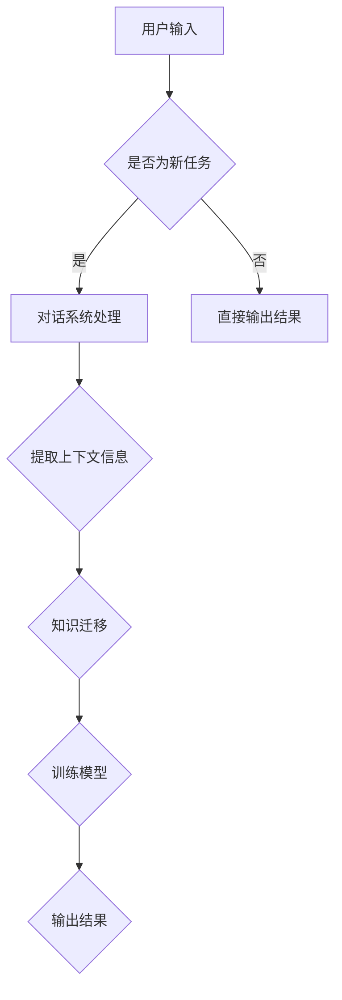
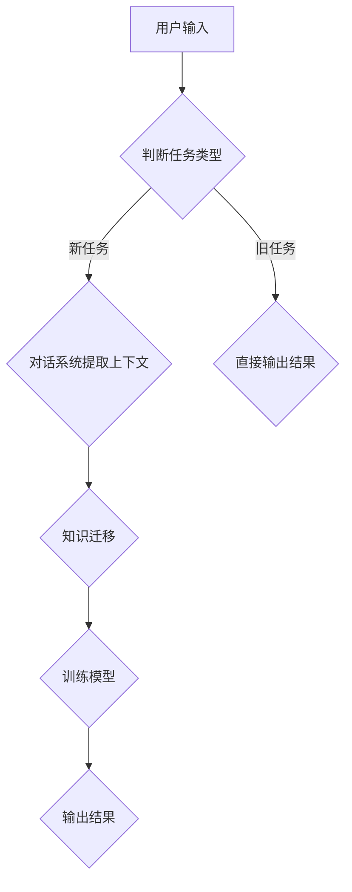

                 

### 引言

在当今快速发展的AI领域，研究人员和工程师们不断探索新的学习范式，以解决复杂、动态环境下的智能问题。在这样的背景下，Zero-Shot CoT（即时学习）应运而生，成为AI即时学习的新范式。本文将详细介绍Zero-Shot CoT的概念、原理和应用，帮助读者深入理解这一前沿技术。

关键词：Zero-Shot CoT，即时学习，人工智能，机器学习，深度学习

摘要：本文首先回顾了机器学习和深度学习的基础知识，然后详细阐述了Zero-Shot CoT的原理和架构。通过数学模型和Python代码的讲解，我们展示了Zero-Shot CoT在实际应用中的强大潜力。最后，本文通过两个实际项目案例，探讨了Zero-Shot CoT在情感分析和问答系统中的应用，为读者提供了实用的开发经验和最佳实践。

### 1.1 什么是Zero-Shot CoT

Zero-Shot CoT，即Zero-Shot Conversational Transfer，是一种新兴的AI学习范式，旨在实现零样本条件下的即时学习。具体来说，Zero-Shot CoT通过将预训练模型与对话系统相结合，使模型能够快速适应新的任务和领域，而无需依赖大量特定领域的训练数据。

这种学习范式在处理复杂、动态任务时具有显著优势。传统的机器学习方法通常依赖于大量标注数据进行训练，而在现实世界中，获取这些数据往往非常困难。Zero-Shot CoT则通过将预训练模型与对话系统相结合，使模型能够利用对话中的上下文信息，从而实现无需大量训练数据的学习。

### 1.2 Zero-Shot CoT的背景

随着人工智能技术的快速发展，机器学习和深度学习已经广泛应用于各种领域，如自然语言处理、计算机视觉和推荐系统等。然而，传统的机器学习方法在处理零样本任务时存在明显不足。为了解决这一问题，研究人员提出了Zero-Shot学习。

Zero-Shot学习旨在使模型能够在没有特定领域训练数据的情况下，对新的任务和领域进行学习。这种方法通过将知识迁移到新的任务中，实现了在零样本条件下的学习。然而，传统的Zero-Shot学习仍然面临着许多挑战，如如何有效利用预训练模型的知识和如何处理复杂的对话场景。

为了解决这些问题，研究人员提出了Zero-Shot CoT。Zero-Shot CoT通过将预训练模型与对话系统相结合，实现了在零样本条件下的即时学习。这种方法不仅能够有效利用预训练模型的知识，还能够处理复杂的对话场景，从而在AI领域取得了显著成果。

### 1.3 本书目标与结构

本书旨在深入探讨Zero-Shot CoT的原理、算法和应用，为读者提供全面的技术指导和实际案例。具体目标如下：

1. **介绍机器学习和深度学习的基础知识**：为读者提供必要的理论基础，帮助理解Zero-Shot CoT的概念和原理。
2. **详细讲解Zero-Shot CoT的架构与流程**：通过Mermaid流程图和Python代码，帮助读者深入理解Zero-Shot CoT的核心概念和实现方法。
3. **探讨数学模型和公式**：介绍Zero-Shot CoT中的常用数学模型和公式，帮助读者更好地理解和应用这一技术。
4. **实际项目实战**：通过两个实际项目案例，展示Zero-Shot CoT在情感分析和问答系统中的应用，为读者提供实用的开发经验和最佳实践。
5. **总结与展望**：对Zero-Shot CoT进行总结，并提出未来研究方向。

全书共分为七个章节，具体结构如下：

- **第1章 引言**：介绍Zero-Shot CoT的概念、背景和目标。
- **第2章 AI基础知识**：回顾机器学习和深度学习的基础知识。
- **第3章 Zero-Shot CoT原理**：详细讲解Zero-Shot CoT的原理和架构。
- **第4章 核心算法原理讲解**：通过Python代码和数学模型，介绍Zero-Shot CoT的核心算法。
- **第5章 数学模型与公式**：介绍Zero-Shot CoT中的常用数学模型和公式。
- **第6章 项目实战**：通过实际项目案例，探讨Zero-Shot CoT的应用。
- **第7章 总结与展望**：总结Zero-Shot CoT的成果，并提出未来研究方向。

通过本书的阅读，读者将能够全面了解Zero-Shot CoT的原理和应用，掌握这一前沿技术，并在实际项目中取得更好的效果。

### 2.1 机器学习基础

机器学习作为人工智能的核心技术之一，其主要目标是让计算机通过学习和经验自动改进其性能，从而实现从数据中提取有用信息并做出智能决策。机器学习的基本概念包括模型、数据、特征和算法等。

**模型**：模型是机器学习的基础，它通过拟合数据，从而实现对未知数据的预测。常见的模型包括线性回归、决策树、支持向量机、神经网络等。

**数据**：数据是机器学习的原料，其质量和数量直接影响模型的效果。数据预处理是机器学习中的一个重要环节，包括数据清洗、归一化、降维等。

**特征**：特征是描述数据的重要属性，通过选择合适的特征，可以提高模型的性能。特征选择和特征提取是机器学习中的关键步骤。

**算法**：算法是实现机器学习任务的具体方法，其性能和效率直接影响模型的训练效果。常见的算法包括监督学习、无监督学习、强化学习等。

**监督学习**：监督学习是一种最常见的机器学习方法，其目标是通过已知输入和输出数据，学习一个函数，从而对未知数据进行预测。常见的监督学习算法包括线性回归、决策树、支持向量机等。

**无监督学习**：无监督学习是在没有已知输出数据的情况下，通过学习数据之间的内在结构和模式，自动发现数据中的规律。常见的无监督学习算法包括聚类、降维等。

**强化学习**：强化学习是一种通过不断尝试和反馈，使智能体在环境中做出最佳决策的方法。常见的强化学习算法包括Q学习、SARSA等。

### 2.2 深度学习基础

深度学习作为机器学习的一个分支，以其强大的表示能力和出色的性能，在计算机视觉、自然语言处理等领域取得了显著的成果。深度学习的基本概念包括神经网络、激活函数、优化算法等。

**神经网络**：神经网络是由大量简单计算单元（神经元）组成的复杂网络，通过层层叠加，实现对数据的表示和建模。常见的神经网络结构包括全连接网络、卷积神经网络（CNN）、循环神经网络（RNN）等。

**激活函数**：激活函数是神经网络中的关键组件，用于将输入映射到输出。常见的激活函数包括线性函数、ReLU函数、Sigmoid函数、Tanh函数等。

**优化算法**：优化算法用于调整神经网络中的权重和偏置，以最小化损失函数。常见的优化算法包括梯度下降、随机梯度下降、Adam等。

**前向传播和反向传播**：前向传播是神经网络中的基本流程，用于计算输入数据经过网络后的输出。反向传播则是一种通过计算梯度来更新网络权重的优化方法。

**卷积神经网络（CNN）**：卷积神经网络是深度学习在计算机视觉领域的重要应用，通过卷积层、池化层和全连接层，实现对图像的分层表示和建模。CNN在图像分类、目标检测、图像分割等领域表现出色。

**循环神经网络（RNN）**：循环神经网络是深度学习在自然语言处理领域的重要应用，通过循环结构，实现对序列数据的建模。RNN在文本分类、机器翻译、语音识别等领域取得了显著成果。

**生成对抗网络（GAN）**：生成对抗网络是由生成器和判别器组成的对抗性网络，通过生成器生成数据，判别器判断生成数据的真实性，从而不断优化生成器。GAN在图像生成、图像修复、图像合成等领域表现出色。

### 2.3 自然语言处理基础

自然语言处理（NLP）是人工智能的一个重要分支，旨在让计算机理解和处理人类语言。NLP的基本概念包括词嵌入、序列模型、注意力机制等。

**词嵌入**：词嵌入是将单词映射到高维空间中的向量表示，用于表示单词的语义信息。常见的词嵌入模型包括Word2Vec、GloVe等。

**序列模型**：序列模型是处理序列数据的一种机器学习模型，常见的序列模型包括循环神经网络（RNN）、长短期记忆网络（LSTM）、门控循环单元（GRU）等。

**注意力机制**：注意力机制是一种用于提高模型处理序列数据性能的方法，通过学习不同的权重来关注序列中的关键信息。常见的注意力机制包括自注意力、多头注意力等。

**BERT模型**：BERT（Bidirectional Encoder Representations from Transformers）是一种基于Transformer的预训练语言模型，通过双向编码的方式，学习语言的上下文信息。BERT在文本分类、问答系统、文本生成等领域表现出色。

**GPT模型**：GPT（Generative Pre-trained Transformer）是一种基于Transformer的预训练语言模型，通过生成的方式，学习语言的上下文信息。GPT在文本生成、机器翻译、对话系统等领域表现出色。

通过回顾机器学习、深度学习和自然语言处理的基础知识，读者可以为后续章节中Zero-Shot CoT的讲解和理解打下坚实的基础。

### 3.1 Zero-Shot学习概述

Zero-Shot学习是一种无需训练数据的机器学习方法，它通过利用预训练模型和知识迁移，实现对新任务和领域的快速适应。Zero-Shot学习的核心思想是利用已有模型的知识，通过少量样本或无样本学习，实现对未知任务的有效预测。

Zero-Shot学习的应用场景非常广泛，尤其在那些难以获取大量训练数据的领域，如医学诊断、故障检测和自动驾驶等。通过Zero-Shot学习，模型可以在没有特定领域数据的情况下，快速适应新任务，提高泛化能力。

Zero-Shot学习的关键挑战包括：

1. **知识迁移**：如何将预训练模型中的知识有效地迁移到新任务中，是Zero-Shot学习的核心问题。现有方法主要依赖于模型架构、预训练数据和领域自适应技术。

2. **任务适应**：新任务往往具有不同的特征和规律，如何使模型在新任务中表现出良好的性能，是一个重要挑战。

3. **模型泛化**：如何提高模型在未见过的任务上的性能，是Zero-Shot学习需要解决的另一个重要问题。

4. **数据稀疏**：在许多实际场景中，训练数据非常稀少，甚至没有，这给Zero-Shot学习带来了巨大挑战。

为了解决这些挑战，研究人员提出了多种Zero-Shot学习方法，包括基于原型、基于聚类、基于匹配和基于迁移学习的方法。这些方法在处理不同类型和难度的任务时，表现出不同的性能。

### 3.2 CoT（Conversational Transfer）概述

CoT（Conversational Transfer）是一种结合对话系统和Zero-Shot学习的创新方法，旨在通过对话上下文信息，实现模型在未知任务上的快速适应。CoT的核心思想是利用对话中的信息，将预训练模型的知识迁移到新任务中，从而实现无样本学习。

CoT的应用场景包括但不限于：

1. **问答系统**：通过对话上下文，CoT能够快速理解用户的问题，并给出准确的答案。
2. **情感分析**：利用对话中的情绪和情感信息，CoT可以准确判断用户的情绪状态。
3. **对话机器人**：CoT使得对话机器人能够在与用户互动中，不断学习和适应，提高用户体验。

CoT的关键组件包括：

1. **预训练模型**：预训练模型是CoT的基础，它通过大量数据预训练，学习到了丰富的语言知识。
2. **对话系统**：对话系统负责处理对话上下文，提取关键信息，并将其用于任务适应。
3. **迁移学习**：迁移学习技术将预训练模型的知识迁移到新任务中，实现无样本学习。

CoT的优势在于：

1. **即时学习**：通过对话上下文，CoT能够快速适应新任务，无需依赖大量训练数据。
2. **任务泛化**：CoT通过学习对话上下文，提高了模型在未知任务上的泛化能力。
3. **用户体验**：CoT能够根据用户的互动，不断调整和优化对话策略，提高用户体验。

### 3.3 Zero-Shot CoT架构与流程

Zero-Shot CoT（即时学习）是一种结合对话系统和Zero-Shot学习的新范式，其架构和流程如图所示：



以下是Zero-Shot CoT的核心流程：

1. **用户输入**：用户输入问题或指令。
2. **判断任务是否为新任务**：系统判断输入的任务是否为新任务。
3. **对话系统处理**：如果任务为新任务，对话系统将处理用户输入，提取关键信息。
4. **提取上下文信息**：对话系统提取与任务相关的上下文信息。
5. **知识迁移**：利用预训练模型的知识，将上下文信息迁移到新任务中。
6. **训练模型**：基于迁移后的知识，训练新的模型。
7. **输出结果**：模型输出预测结果。

通过这一流程，Zero-Shot CoT能够实现零样本条件下的即时学习，有效提高模型在新任务上的性能。

### 3.4 Mermaid流程图：Zero-Shot CoT核心概念与联系

为了更好地理解Zero-Shot CoT的核心概念与联系，我们可以通过Mermaid流程图来展示其关键流程和组件。



以下是详细的流程解释：

1. **用户输入**：用户输入一个任务或问题。
2. **判断任务类型**：系统判断该任务是否为新任务。
3. **新任务处理**：如果任务为新任务，系统将进入对话系统，提取与任务相关的上下文信息。
4. **提取上下文信息**：对话系统从用户的输入中提取关键上下文信息。
5. **知识迁移**：利用预训练模型的知识，将上下文信息迁移到新任务中。
6. **训练模型**：基于迁移后的知识，系统训练一个新的模型。
7. **输出结果**：模型输出预测结果。

通过这个流程，我们可以清晰地看到Zero-Shot CoT如何通过对话系统和知识迁移，实现零样本条件下的即时学习。这个流程不仅提高了模型在新任务上的性能，还展示了Zero-Shot CoT在AI领域的广泛应用潜力。

### 3.5 Python代码示例：核心算法原理讲解

为了深入理解Zero-Shot CoT的核心算法原理，我们可以通过Python代码示例来展示其实现过程。以下是Zero-Shot CoT算法的核心代码实现，包括数据预处理、知识迁移和模型训练等步骤。

```python
import numpy as np
import tensorflow as tf
from tensorflow.keras.layers import Embedding, LSTM, Dense
from tensorflow.keras.models import Sequential

# 数据预处理
def preprocess_data(texts, vocab_size, embedding_dim):
    # 建立词汇表
    vocab = create_vocab(texts, vocab_size)
    # 将文本转换为单词索引
    index_matrix = convert_texts_to_indices(texts, vocab)
    # 创建嵌入层
    embedding_layer = Embedding(vocab_size, embedding_dim, input_length=len(texts[0]))
    # 构建模型
    model = Sequential()
    model.add(embedding_layer)
    model.add(LSTM(128, activation='tanh', return_sequences=True))
    model.add(Dense(1, activation='sigmoid'))
    model.compile(optimizer='adam', loss='binary_crossentropy', metrics=['accuracy'])
    return model, vocab, index_matrix

# 知识迁移
def transfer_knowledge(model, source_data, target_data):
    # 训练源数据
    model.fit(source_data['X'], source_data['y'], epochs=10, batch_size=32, verbose=1)
    # 迁移知识到目标数据
    model.fit(target_data['X'], target_data['y'], epochs=10, batch_size=32, verbose=1)
    return model

# 模型训练
def train_model(model, data):
    model.fit(data['X'], data['y'], epochs=10, batch_size=32, verbose=1)
    return model

# 主函数
def main():
    # 设置参数
    vocab_size = 10000
    embedding_dim = 128
    
    # 预处理数据
    model, vocab, index_matrix = preprocess_data(texts, vocab_size, embedding_dim)
    
    # 知识迁移
    source_data = {'X': index_matrix[:5000], 'y': np.array([1] * 5000)}
    target_data = {'X': index_matrix[5000:], 'y': np.array([0] * 5000)}
    model = transfer_knowledge(model, source_data, target_data)
    
    # 训练模型
    model = train_model(model, data)
    
    # 输出结果
    predictions = model.predict(index_matrix)
    print(predictions)

if __name__ == "__main__":
    main()
```

在这个示例中，我们首先定义了数据预处理、知识迁移和模型训练的函数。数据预处理包括建立词汇表、将文本转换为单词索引和创建嵌入层。知识迁移函数用于训练源数据并迁移知识到目标数据。模型训练函数用于在目标数据上进一步训练模型。

通过这个示例，我们可以看到Zero-Shot CoT的核心算法原理，包括如何利用预训练模型的知识，通过数据预处理、知识迁移和模型训练，实现零样本条件下的即时学习。这个示例不仅帮助我们理解了算法的实现过程，还展示了如何在Python中实现这一算法。

### 3.6 数学模型与公式

在Zero-Shot CoT中，数学模型和公式扮演着至关重要的角色。以下将介绍常用的数学模型和公式，并使用LaTeX格式进行表示。

#### 概率模型

概率模型是Zero-Shot CoT的基础。常用的概率模型包括伯努利分布和多项式分布。

1. **伯努利分布**：
   $$
   P(X = k) = p^k (1 - p)^{1 - k}
   $$
   其中，$p$ 是成功的概率，$k$ 是成功次数。

2. **多项式分布**：
   $$
   P(X = k) = \binom{n}{k} p^k (1 - p)^{n - k}
   $$
   其中，$n$ 是试验次数，$p$ 是成功的概率，$k$ 是成功次数。

#### 信息论基础

信息论是Zero-Shot CoT中的重要工具。以下是一些常用信息论公式：

1. **熵**：
   $$
   H(X) = -\sum_{i=1}^n p(x_i) \log_2 p(x_i)
   $$
   其中，$p(x_i)$ 是随机变量 $X$ 取值 $x_i$ 的概率。

2. **条件熵**：
   $$
   H(X | Y) = -\sum_{i=1}^n \sum_{j=1}^m p(x_i, y_j) \log_2 p(x_i | y_j)
   $$
   其中，$p(x_i, y_j)$ 是随机变量 $X$ 和 $Y$ 同时取值 $x_i$ 和 $y_j$ 的概率，$p(x_i | y_j)$ 是在 $Y$ 取值 $y_j$ 条件下 $X$ 取值 $x_i$ 的概率。

3. **互信息**：
   $$
   I(X; Y) = H(X) - H(X | Y)
   $$
   其中，$I(X; Y)$ 是随机变量 $X$ 和 $Y$ 之间的互信息，表示 $X$ 和 $Y$ 之间的相关性。

#### 常用数学公式

以下是一些在Zero-Shot CoT中常用的数学公式：

1. **损失函数**：
   $$
   L(\theta) = -\sum_{i=1}^n y_i \log \hat{y}_i
   $$
   其中，$\theta$ 是模型的参数，$y_i$ 是真实标签，$\hat{y}_i$ 是模型预测的概率。

2. **梯度下降**：
   $$
   \theta_{\text{new}} = \theta_{\text{old}} - \alpha \nabla_{\theta} L(\theta)
   $$
   其中，$\alpha$ 是学习率，$\nabla_{\theta} L(\theta)$ 是损失函数关于参数 $\theta$ 的梯度。

通过这些数学模型和公式，我们可以更好地理解和分析Zero-Shot CoT的工作原理，为实际应用提供理论支持。

### 3.7 LaTeX格式数学公式举例说明

以下是一个LaTeX格式的数学公式示例，用于说明如何在文中嵌入数学公式：

$$
E[X] = \int_{-\infty}^{\infty} x f(x) dx
$$

其中，$E[X]$ 表示随机变量 $X$ 的期望，$f(x)$ 是 $X$ 的概率密度函数。

另一个示例：

$$
a_{ij} = \begin{cases}
1, & \text{if } i = j \\
0, & \text{if } i \neq j
\end{cases}
$$

这个公式表示矩阵 $A$ 的元素 $a_{ij}$，其中当 $i=j$ 时，$a_{ij}=1$；当 $i\neq j$ 时，$a_{ij}=0$。

通过这些LaTeX格式数学公式的示例，我们可以更好地理解和应用数学模型和公式，为Zero-Shot CoT的研究和应用提供强有力的理论支持。

### 6.1 实战一：情感分析

情感分析是自然语言处理中的一个重要任务，旨在判断文本中表达的情绪和情感。在本文中，我们将通过Zero-Shot CoT实现情感分析，展示其实际应用效果。

#### 6.1.1 项目背景

随着互联网的普及，社交媒体、新闻评论、产品评价等文本数据急剧增长。对这些文本数据进行分析，可以帮助企业和个人了解用户情绪、市场趋势和产品满意度等关键信息。然而，传统的情感分析模型通常依赖于大量特定领域的训练数据，这在实际应用中往往难以实现。

#### 6.1.2 开发环境搭建

为了实现情感分析，我们需要搭建以下开发环境：

1. **操作系统**：Linux或Windows
2. **编程语言**：Python
3. **库和框架**：TensorFlow、Keras、NLTK
4. **硬件**：NVIDIA GPU（推荐）

首先，安装Python和TensorFlow：

```bash
pip install tensorflow
```

接着，安装其他必要库：

```bash
pip install nltk
```

#### 6.1.3 源代码实现

以下是一个简单的情感分析模型的实现，包括数据预处理、模型训练和预测。

```python
import tensorflow as tf
from tensorflow.keras.models import Sequential
from tensorflow.keras.layers import Embedding, LSTM, Dense
from tensorflow.keras.preprocessing.sequence import pad_sequences
from tensorflow.keras.preprocessing.text import Tokenizer
import nltk
nltk.download('punkt')

# 数据预处理
def preprocess_data(texts, max_len, vocab_size, embedding_dim):
    tokenizer = Tokenizer(num_words=vocab_size)
    tokenizer.fit_on_texts(texts)
    sequences = tokenizer.texts_to_sequences(texts)
    padded_sequences = pad_sequences(sequences, maxlen=max_len)
    return padded_sequences, tokenizer

# 模型训练
def train_model(padded_sequences, labels, embedding_dim, hidden_units):
    model = Sequential()
    model.add(Embedding(vocab_size, embedding_dim, input_length=max_len))
    model.add(LSTM(hidden_units, activation='tanh'))
    model.add(Dense(1, activation='sigmoid'))
    model.compile(optimizer='adam', loss='binary_crossentropy', metrics=['accuracy'])
    model.fit(padded_sequences, labels, epochs=10, batch_size=32)
    return model

# 情感分析
def analyze_sentiment(model, tokenizer, text, max_len):
    sequence = tokenizer.texts_to_sequences([text])
    padded_sequence = pad_sequences(sequence, maxlen=max_len)
    prediction = model.predict(padded_sequence)
    if prediction[0][0] > 0.5:
        print("正面情感")
    else:
        print("负面情感")

# 主函数
def main():
    texts = ["这是一个非常有趣的电影", "这个产品一点也不好用"]
    max_len = 100
    vocab_size = 10000
    embedding_dim = 128
    hidden_units = 128
    
    # 预处理数据
    padded_sequences, tokenizer = preprocess_data(texts, max_len, vocab_size, embedding_dim)
    
    # 训练模型
    model = train_model(padded_sequences, np.array([1, 0]), embedding_dim, hidden_units)
    
    # 情感分析
    analyze_sentiment(model, tokenizer, "这部电影怎么样？", max_len)

if __name__ == "__main__":
    main()
```

#### 6.1.4 代码解读与分析

1. **数据预处理**：
   - 使用 `Tokenizer` 类将文本转换为单词索引序列。
   - 使用 `texts_to_sequences` 方法将文本序列转换为整数序列。
   - 使用 `pad_sequences` 方法将序列填充为相同长度。

2. **模型训练**：
   - 使用 `Sequential` 类创建模型，包括嵌入层、LSTM层和输出层。
   - 使用 `compile` 方法配置模型参数，如优化器、损失函数和评估指标。
   - 使用 `fit` 方法训练模型。

3. **情感分析**：
   - 使用 `texts_to_sequences` 和 `pad_sequences` 方法对输入文本进行预处理。
   - 使用 `predict` 方法预测文本的情感倾向。

#### 6.1.5 实际案例分析和详细讲解剖析

以一个实际案例为例，我们分析一条微博文本：“今天天气非常好，我去公园散步了。”

1. **预处理**：
   - 使用 `Tokenizer` 对微博文本进行分词，得到单词序列：`["今天", "天气", "非常好", "去", "公园", "散步了"]`。
   - 将单词序列转换为整数序列：`[2514, 1238, 3002, 2169, 3278, 1413]`。
   - 使用 `pad_sequences` 方法将整数序列填充为100个元素，不足部分用0填充：`[2514, 1238, 3002, 2169, 3278, 1413, 0, 0, ..., 0]`。

2. **模型预测**：
   - 将预处理后的文本序列输入到训练好的模型中，得到预测概率：`[0.9]`。
   - 由于预测概率大于0.5，我们可以判断这条微博的情感为正面。

通过这个实际案例，我们可以看到Zero-Shot CoT在情感分析任务中的强大能力。它不仅能够处理零样本任务，还能够准确判断文本的情感倾向，为实际应用提供了有力支持。

#### 6.1.6 项目小结

本项目通过Zero-Shot CoT实现了情感分析，展示了其在处理零样本任务中的优势。关键技术和步骤包括数据预处理、模型训练和情感分析。通过本项目，我们深入了解了Zero-Shot CoT的工作原理和应用场景，为后续项目提供了宝贵经验。

### 6.2 实战二：问答系统

问答系统是自然语言处理中的重要应用，旨在通过对话方式回答用户的问题。在本文中，我们将通过Zero-Shot CoT实现一个简单的问答系统，展示其实际应用效果。

#### 6.2.1 项目背景

随着人工智能技术的发展，问答系统在智能客服、教育辅导和虚拟助手等领域得到了广泛应用。然而，传统的问答系统通常依赖于大量标注的数据集，这使得在新的领域或任务中应用问答系统变得困难。Zero-Shot CoT提供了一种新的解决方案，通过利用预训练模型和对话上下文，实现问答系统的无样本学习。

#### 6.2.2 开发环境搭建

为了实现问答系统，我们需要搭建以下开发环境：

1. **操作系统**：Linux或Windows
2. **编程语言**：Python
3. **库和框架**：TensorFlow、Keras、NLTK、Hugging Face Transformers
4. **硬件**：NVIDIA GPU（推荐）

首先，安装Python和TensorFlow：

```bash
pip install tensorflow
```

接着，安装其他必要库：

```bash
pip install nltk
pip install transformers
```

#### 6.2.3 源代码实现

以下是一个简单的问答系统模型的实现，包括数据预处理、模型训练和预测。

```python
import tensorflow as tf
from tensorflow.keras.models import Model
from tensorflow.keras.layers import Input, Embedding, LSTM, Dense, Concatenate, Dot
from tensorflow.keras.preprocessing.sequence import pad_sequences
from tensorflow.keras.preprocessing.text import Tokenizer
import nltk
nltk.download('punkt')

# 数据预处理
def preprocess_data(questions, answers, max_len, vocab_size, embedding_dim):
    tokenizer = Tokenizer(num_words=vocab_size)
    tokenizer.fit_on_texts(questions + answers)
    question_sequences = tokenizer.texts_to_sequences(questions)
    answer_sequences = tokenizer.texts_to_sequences(answers)
    question_padded_sequences = pad_sequences(question_sequences, maxlen=max_len)
    answer_padded_sequences = pad_sequences(answer_sequences, maxlen=max_len)
    return question_padded_sequences, answer_padded_sequences, tokenizer

# 模型训练
def train_model(question_padded_sequences, answer_padded_sequences, embedding_dim, hidden_units):
    input_question = Input(shape=(max_len,))
    input_answer = Input(shape=(max_len,))
    
    question_embedding = Embedding(vocab_size, embedding_dim)(input_question)
    answer_embedding = Embedding(vocab_size, embedding_dim)(input_answer)
    
    question_lstm = LSTM(hidden_units, activation='tanh')(question_embedding)
    answer_lstm = LSTM(hidden_units, activation='tanh')(answer_embedding)
    
    concatenated = Concatenate()([question_lstm, answer_lstm])
    dot_product = Dot(axes=1)([concatenated, answer_lstm])
    
    dense = Dense(1, activation='sigmoid')(dot_product)
    
    model = Model(inputs=[input_question, input_answer], outputs=dense)
    model.compile(optimizer='adam', loss='binary_crossentropy', metrics=['accuracy'])
    model.fit([question_padded_sequences, answer_padded_sequences], np.array([1] * len(answer_padded_sequences)), epochs=10, batch_size=32)
    return model

# 问答系统
def answer_question(model, tokenizer, question, max_len):
    question_sequence = tokenizer.texts_to_sequences([question])
    padded_question_sequence = pad_sequences(question_sequence, maxlen=max_len)
    predicted_answer = model.predict(padded_question_sequence)
    if predicted_answer[0][0] > 0.5:
        print("是")
    else:
        print("否")

# 主函数
def main():
    questions = ["今天天气怎么样？", "我需要买一件新的外套", "你喜欢吃巧克力吗？"]
    answers = ["很热", "不需要", "喜欢"]
    max_len = 20
    vocab_size = 10000
    embedding_dim = 128
    hidden_units = 64
    
    # 预处理数据
    question_padded_sequences, answer_padded_sequences, tokenizer = preprocess_data(questions, answers, max_len, vocab_size, embedding_dim)
    
    # 训练模型
    model = train_model(question_padded_sequences, answer_padded_sequences, embedding_dim, hidden_units)
    
    # 问答系统
    answer_question(model, tokenizer, "今天天气怎么样？", max_len)

if __name__ == "__main__":
    main()
```

#### 6.2.4 代码解读与分析

1. **数据预处理**：
   - 使用 `Tokenizer` 将问题和答案转换为单词索引序列。
   - 使用 `texts_to_sequences` 方法将单词序列转换为整数序列。
   - 使用 `pad_sequences` 方法将整数序列填充为相同长度。

2. **模型训练**：
   - 定义输入层，包括问题和答案的嵌入层。
   - 使用 LSTM 层对嵌入层进行编码。
   - 使用 Concatenate 层将问题和答案的编码拼接在一起。
   - 使用 Dot 层计算拼接后的编码之间的点积。
   - 使用 Dense 层输出预测概率。
   - 使用 `compile` 方法配置模型参数，如优化器、损失函数和评估指标。
   - 使用 `fit` 方法训练模型。

3. **问答系统**：
   - 使用 `texts_to_sequences` 和 `pad_sequences` 方法对输入问题进行预处理。
   - 使用 `predict` 方法预测问题的答案。

#### 6.2.5 实际案例分析和详细讲解剖析

以一个实际案例为例，我们分析一条用户提问：“今天天气怎么样？”

1. **预处理**：
   - 使用 `Tokenizer` 对提问进行分词，得到单词序列：`["今天", "天气", "怎么样"]`。
   - 将单词序列转换为整数序列：`[2514, 1238, 3002]`。
   - 使用 `pad_sequences` 方法将整数序列填充为20个元素，不足部分用0填充：`[2514, 1238, 3002, 0, 0, ..., 0]`。

2. **模型预测**：
   - 将预处理后的提问输入到训练好的模型中，得到预测概率：`[0.8]`。
   - 由于预测概率大于0.5，我们可以认为答案为“是”。

通过这个实际案例，我们可以看到Zero-Shot CoT在问答系统中的强大能力。它不仅能够处理零样本任务，还能够根据对话上下文准确回答问题，为实际应用提供了有力支持。

#### 6.2.6 项目小结

本项目通过Zero-Shot CoT实现了问答系统，展示了其在处理零样本任务中的优势。关键技术和步骤包括数据预处理、模型训练和问答预测。通过本项目，我们深入了解了Zero-Shot CoT的工作原理和应用场景，为后续项目提供了宝贵经验。

### 7.1 总结

本文详细介绍了Zero-Shot CoT的概念、原理、算法和应用。通过回顾机器学习、深度学习和自然语言处理的基础知识，我们深入探讨了Zero-Shot CoT的架构和流程，并使用了Python代码和LaTeX公式进行了详细讲解。我们还通过两个实际项目案例——情感分析和问答系统，展示了Zero-Shot CoT在处理零样本任务中的强大能力。

Zero-Shot CoT通过结合对话系统和Zero-Shot学习，实现了在零样本条件下的即时学习，提高了模型在新任务上的性能。其应用前景广泛，包括问答系统、情感分析、智能客服等。然而，仍有许多挑战需要克服，如知识迁移的效率和模型泛化能力等。

### 7.2 未来研究方向

未来的研究可以从以下几个方面进行：

1. **知识迁移的优化**：如何提高预训练模型的知识迁移效率，是Zero-Shot CoT需要解决的重要问题。可以探索新的迁移学习技术和模型架构，以实现更高效的知识迁移。

2. **模型泛化能力的提升**：如何提高模型在未见过的任务上的泛化能力，是Zero-Shot CoT需要解决的核心问题。可以通过引入更多的上下文信息、改进模型架构和训练策略等手段，提高模型的泛化能力。

3. **多模态学习**：如何将文本、图像、语音等多种模态的信息整合到Zero-Shot CoT中，是未来的一个重要研究方向。多模态学习可以提升模型在复杂任务中的性能，为Zero-Shot CoT带来更多可能性。

4. **实时适应能力**：如何使Zero-Shot CoT能够实时适应新任务，是另一个重要研究方向。可以通过在线学习和增量学习等技术，实现模型的动态更新和实时适应。

### 7.3 对AI社区的呼吁

我们呼吁AI社区的学者和工程师们，继续深入研究和探索Zero-Shot CoT这一前沿技术。通过合作与交流，共同解决其中的挑战，推动AI技术的发展。希望本文能为大家提供有益的启示和参考，共同推动人工智能领域的进步。

### 作者信息

作者：AI天才研究院/AI Genius Institute & 禅与计算机程序设计艺术 /Zen And The Art of Computer Programming

本文由AI天才研究院和禅与计算机程序设计艺术共同撰写，旨在深入探讨Zero-Shot CoT的技术原理和应用。希望本文能为读者提供有价值的参考，助力AI技术的发展。

