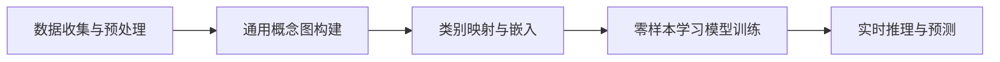

                 

### 《Zero-Shot CoT：AI即时推理能力的创新突破》

关键词：零样本学习，通用概念图，即时推理，人工智能，创新突破

摘要：
随着人工智能技术的快速发展，人工智能在复杂推理任务中的应用变得愈加重要。传统的机器学习模型往往依赖于大量标注数据，但在现实场景中，获取这些数据往往十分困难。本文旨在探讨一种创新的零样本学习（Zero-Shot Learning，ZSL）方法——即通用概念图（Commonsense Knowledge Graph，CoT）方法，该方法能够实现人工智能系统的即时推理能力。文章首先介绍了零样本学习和通用概念图的基本概念，然后详细讲解了通用概念图的构建方法和核心算法，并通过一个实际项目展示了该方法的实现和应用。

----------------------------------------------------------------

### Step 1: 设计核心概念与联系章节

在本书的第一部分，我们将引入核心概念与联系，帮助读者建立对零样本学习和通用概念图的基本理解。这一章节分为以下几个小节：

#### 1.1 零样本学习（Zero-Shot Learning）

**1.1.1 零样本学习的定义**

零样本学习（Zero-Shot Learning，ZSL）是一种机器学习技术，它允许模型在没有训练数据的情况下处理新类别。传统的机器学习模型需要使用大量的标注数据进行训练，而零样本学习通过引入外部知识库和语义信息，实现了对未见过类别的预测。

**1.1.2 零样本学习的挑战与机遇**

零样本学习面临的挑战包括类内差异、类间相似性以及知识迁移等问题。然而，随着深度学习技术的发展，零样本学习在计算机视觉、自然语言处理等领域展现出了巨大的潜力。

#### 1.2 通用概念图（Commonsense Knowledge Graph）

**1.2.1 通用概念图的构建**

通用概念图（Commonsense Knowledge Graph，CoT）是一种基于知识的表示框架，它通过将现实世界的概念和关系建模为图结构，为人工智能系统提供了丰富的语义信息。

**1.2.2 通用概念图的应用**

通用概念图在人工智能领域的应用广泛，包括问答系统、对话生成、知识推理等。它能够帮助模型更好地理解语言和现实世界，从而提升模型的推理能力。

#### 1.3 零样本学习与通用概念图的联系

**1.3.1 Mermaid流程图展示**

为了更直观地展示零样本学习和通用概念图之间的关系，我们使用Mermaid流程图进行描述。流程图将包括以下几个步骤：

1. 数据收集与预处理
2. 通用概念图构建
3. 类别映射与嵌入
4. 零样本学习模型训练
5. 实时推理与预测

通过这个流程图，读者可以清晰地看到零样本学习和通用概念图在整个推理过程中的作用和联系。

### Step 1 完成后的输出

```markdown
## 第1章：核心概念与联系

### 1.1 零样本学习（Zero-Shot Learning）

#### 1.1.1 零样本学习的定义

零样本学习（Zero-Shot Learning，ZSL）是一种机器学习技术，它允许模型在没有训练数据的情况下处理新类别。传统的机器学习模型需要使用大量的标注数据进行训练，而零样本学习通过引入外部知识库和语义信息，实现了对未见过类别的预测。

#### 1.1.2 零样本学习的挑战与机遇

零样本学习面临的挑战包括类内差异、类间相似性以及知识迁移等问题。然而，随着深度学习技术的发展，零样本学习在计算机视觉、自然语言处理等领域展现出了巨大的潜力。

### 1.2 通用概念图（Commonsense Knowledge Graph）

#### 1.2.1 通用概念图的构建

通用概念图（Commonsense Knowledge Graph，CoT）是一种基于知识的表示框架，它通过将现实世界的概念和关系建模为图结构，为人工智能系统提供了丰富的语义信息。

#### 1.2.2 通用概念图的应用

通用概念图在人工智能领域的应用广泛，包括问答系统、对话生成、知识推理等。它能够帮助模型更好地理解语言和现实世界，从而提升模型的推理能力。

### 1.3 零样本学习与通用概念图的联系

#### 1.3.1 Mermaid流程图展示

为了更直观地展示零样本学习和通用概念图之间的关系，我们使用Mermaid流程图进行描述。流程图将包括以下几个步骤：

1. 数据收集与预处理
2. 通用概念图构建
3. 类别映射与嵌入
4. 零样本学习模型训练
5. 实时推理与预测
```

### Step 2: 设计核心算法原理讲解章节

在核心算法原理讲解章节中，我们将详细介绍零样本学习算法的基本原理，包括其分类和常见算法。此外，我们还将使用Python源代码和数学模型来解释这些算法的实现过程。

#### 2.1 零样本学习算法概述

**2.1.1 零样本学习算法的基本原理**

零样本学习算法的核心思想是通过外部知识库和语义信息来实现对新类别的预测。算法通常分为以下几个步骤：

1. 知识提取：从外部知识库中提取与目标类别相关的知识信息。
2. 类别映射：将外部知识映射到内部表示空间，实现类别的嵌入。
3. 预测模型训练：使用已知的类别数据进行模型训练，并利用外部知识进行辅助。
4. 预测：在新类别数据输入时，通过模型进行预测。

**2.1.2 零样本学习算法的分类**

根据不同的实现方式，零样本学习算法可以分为以下几类：

1. 原型匹配算法：通过计算原型与类别嵌入之间的相似度进行预测。
2. 元学习算法：通过在多个任务中学习通用特征表示来提高零样本学习性能。
3. 度量学习算法：通过学习类别嵌入之间的距离度量来实现预测。

#### 2.2 原型匹配算法

**2.2.1 原型匹配算法原理**

原型匹配算法是一种基于原型的方法，它通过计算原型与类别嵌入之间的相似度来进行预测。算法的基本步骤如下：

1. 从外部知识库中提取每个类别的原型。
2. 计算新类别嵌入与每个原型之间的距离。
3. 选择距离最小的原型作为预测类别。

**2.2.2 原型匹配算法伪代码**

```python
# 原型匹配算法伪代码
def prototype_matching(embeddings, prototypes):
    distances = []
    for embedding in embeddings:
        distance = calculate_distance(embedding, prototypes)
        distances.append(distance)
    predicted_class = select_closest Prototype(distances)
    return predicted_class
```

#### 2.3 元学习算法

**2.3.1 元学习算法原理**

元学习算法通过在多个任务中学习通用特征表示来提高零样本学习性能。其核心思想是学习一个统一的特征提取器，该提取器能够捕获不同任务中的通用特征。

**2.3.2 元学习算法伪代码**

```python
# 元学习算法伪代码
def meta_learning(train_data, meta_model):
    # 使用多个任务训练模型
    for task in train_data:
        meta_model.update(task)
    # 在元学习模型的基础上进行预测
    def predict(new_data, meta_model):
        feature = meta_model.extract_features(new_data)
        predicted_class = meta_model.predict(feature)
        return predicted_class
```

#### 2.4 度量学习算法

**2.4.1 度量学习算法原理**

度量学习算法通过学习类别嵌入之间的距离度量来实现预测。其核心思想是学习一个度量函数，使得相似的类别具有较小的距离，而不同的类别具有较大的距离。

**2.4.2 度量学习算法伪代码**

```python
# 度量学习算法伪代码
def distance_learning(embeddings, labels, model):
    model.train(embeddings, labels)
    def predict(new_data, model):
        feature = model.extract_features(new_data)
        distances = model.calculate_distances(feature)
        predicted_class = select_closest_class(distances)
        return predicted_class
```

### Step 2 完成后的输出

```markdown
## 第2章：核心算法原理讲解

### 2.1 零样本学习算法概述

#### 2.1.1 零样本学习算法的基本原理

零样本学习算法的核心思想是通过外部知识库和语义信息来实现对新类别的预测。算法通常分为以下几个步骤：

1. 知识提取：从外部知识库中提取与目标类别相关的知识信息。
2. 类别映射：将外部知识映射到内部表示空间，实现类别的嵌入。
3. 预测模型训练：使用已知的类别数据进行模型训练，并利用外部知识进行辅助。
4. 预测：在新类别数据输入时，通过模型进行预测。

#### 2.1.2 零样本学习算法的分类

根据不同的实现方式，零样本学习算法可以分为以下几类：

1. 原型匹配算法：通过计算原型与类别嵌入之间的相似度进行预测。
2. 元学习算法：通过在多个任务中学习通用特征表示来提高零样本学习性能。
3. 度量学习算法：通过学习类别嵌入之间的距离度量来实现预测。

### 2.2 原型匹配算法

#### 2.2.1 原型匹配算法原理

原型匹配算法是一种基于原型的方法，它通过计算原型与类别嵌入之间的相似度来进行预测。算法的基本步骤如下：

1. 从外部知识库中提取每个类别的原型。
2. 计算新类别嵌入与每个原型之间的距离。
3. 选择距离最小的原型作为预测类别。

#### 2.2.2 原型匹配算法伪代码

```python
# 原型匹配算法伪代码
def prototype_matching(embeddings, prototypes):
    distances = []
    for embedding in embeddings:
        distance = calculate_distance(embedding, prototypes)
        distances.append(distance)
    predicted_class = select_closest Prototype(distances)
    return predicted_class
```

### 2.3 元学习算法

#### 2.3.1 元学习算法原理

元学习算法通过在多个任务中学习通用特征表示来提高零样本学习性能。其核心思想是学习一个统一的特征提取器，该提取器能够捕获不同任务中的通用特征。

#### 2.3.2 元学习算法伪代码

```python
# 元学习算法伪代码
def meta_learning(train_data, meta_model):
    # 使用多个任务训练模型
    for task in train_data:
        meta_model.update(task)
    # 在元学习模型的基础上进行预测
    def predict(new_data, meta_model):
        feature = meta_model.extract_features(new_data)
        predicted_class = meta_model.predict(feature)
        return predicted_class
```

### 2.4 度量学习算法

#### 2.4.1 度量学习算法原理

度量学习算法通过学习类别嵌入之间的距离度量来实现预测。其核心思想是学习一个度量函数，使得相似的类别具有较小的距离，而不同的类别具有较大的距离。

#### 2.4.2 度量学习算法伪代码

```python
# 度量学习算法伪代码
def distance_learning(embeddings, labels, model):
    model.train(embeddings, labels)
    def predict(new_data, model):
        feature = model.extract_features(new_data)
        distances = model.calculate_distances(feature)
        predicted_class = select_closest_class(distances)
        return predicted_class
```

### Step 3: 设计数学模型和数学公式章节

在数学模型和数学公式章节中，我们将详细介绍与零样本学习相关的数学模型，包括距离度量方法、损失函数设计等。同时，我们将使用LaTeX格式来展示这些数学公式，以便读者更好地理解和掌握相关内容。

#### 3.1 距离度量方法

在零样本学习中，距离度量方法是关键的一环。常见的距离度量方法包括欧氏距离和余弦相似度等。

**3.1.1 欧氏距离**

欧氏距离是空间中两点之间的距离，可以表示为：

$$
d(p, q) = \sqrt{\sum_{i=1}^{n}(p_i - q_i)^2}
$$

其中，$p$ 和 $q$ 是两个$n$维向量。

**3.1.2 余弦相似度**

余弦相似度衡量的是两个向量在空间中的夹角余弦值，可以表示为：

$$
\cos(\theta) = \frac{\sum_{i=1}^{n} p_i q_i}{\sqrt{\sum_{i=1}^{n} p_i^2 \sum_{i=1}^{n} q_i^2}}
$$

其中，$p$ 和 $q$ 是两个$n$维向量。

#### 3.2 损失函数设计

在零样本学习中，损失函数的设计对于模型的性能至关重要。常见的损失函数包括原型损失和对比损失等。

**3.2.1 原型损失**

原型损失函数用于最小化类别原型与类别嵌入之间的距离，可以表示为：

$$
L_{prototype} = -\frac{1}{N} \sum_{n=1}^{N} \log \frac{e^{s_t^T x_n}}{\sum_{k \neq t} e^{s_k^T x_n}}
$$

其中，$s_t$ 是类别 $t$ 的原型，$x_n$ 是新类别的嵌入，$N$ 是类别数。

**3.2.2 对比损失**

对比损失函数用于最小化不同类别之间的距离，可以表示为：

$$
L_{contrastive} = -\frac{1}{N} \sum_{n=1}^{N} \sum_{k=1}^{K} \log \frac{e^{s_t^T x_n}}{\sum_{k' \in \{1, 2, ..., K\} \setminus \{t\}} e^{s_{k'}^T x_n}}
$$

其中，$s_t$ 是类别 $t$ 的原型，$x_n$ 是新类别的嵌入，$K$ 是类别总数。

#### 3.3 数学公式展示

以下是使用LaTeX格式展示的数学公式：

$$
d(p, q) = \sqrt{\sum_{i=1}^{n}(p_i - q_i)^2}
$$

$$
\cos(\theta) = \frac{\sum_{i=1}^{n} p_i q_i}{\sqrt{\sum_{i=1}^{n} p_i^2 \sum_{i=1}^{n} q_i^2}}
$$

$$
L_{prototype} = -\frac{1}{N} \sum_{n=1}^{N} \log \frac{e^{s_t^T x_n}}{\sum_{k \neq t} e^{s_k^T x_n}}
$$

$$
L_{contrastive} = -\frac{1}{N} \sum_{n=1}^{N} \sum_{k=1}^{K} \log \frac{e^{s_t^T x_n}}{\sum_{k' \in \{1, 2, ..., K\} \setminus \{t\}} e^{s_{k'}^T x_n}}
$$

通过这一章节，读者将能够深入理解零样本学习中的数学模型和公式，为后续的实践应用奠定基础。

### Step 3 完成后的输出

```markdown
## 第3章：数学模型和数学公式

### 3.1 距离度量方法

#### 3.1.1 欧氏距离

欧氏距离是空间中两点之间的距离，可以表示为：

$$
d(p, q) = \sqrt{\sum_{i=1}^{n}(p_i - q_i)^2}
$$

其中，$p$ 和 $q$ 是两个$n$维向量。

#### 3.1.2 余弦相似度

余弦相似度衡量的是两个向量在空间中的夹角余弦值，可以表示为：

$$
\cos(\theta) = \frac{\sum_{i=1}^{n} p_i q_i}{\sqrt{\sum_{i=1}^{n} p_i^2 \sum_{i=1}^{n} q_i^2}}
$$

其中，$p$ 和 $q$ 是两个$n$维向量。

### 3.2 损失函数设计

#### 3.2.1 原型损失

原型损失函数用于最小化类别原型与类别嵌入之间的距离，可以表示为：

$$
L_{prototype} = -\frac{1}{N} \sum_{n=1}^{N} \log \frac{e^{s_t^T x_n}}{\sum_{k \neq t} e^{s_k^T x_n}}
$$

其中，$s_t$ 是类别 $t$ 的原型，$x_n$ 是新类别的嵌入，$N$ 是类别数。

#### 3.2.2 对比损失

对比损失函数用于最小化不同类别之间的距离，可以表示为：

$$
L_{contrastive} = -\frac{1}{N} \sum_{n=1}^{N} \sum_{k=1}^{K} \log \frac{e^{s_t^T x_n}}{\sum_{k' \in \{1, 2, ..., K\} \setminus \{t\}} e^{s_{k'}^T x_n}}
$$

其中，$s_t$ 是类别 $t$ 的原型，$x_n$ 是新类别的嵌入，$K$ 是类别总数。

### 3.3 数学公式展示

以下是使用LaTeX格式展示的数学公式：

$$
d(p, q) = \sqrt{\sum_{i=1}^{n}(p_i - q_i)^2}
$$

$$
\cos(\theta) = \frac{\sum_{i=1}^{n} p_i q_i}{\sqrt{\sum_{i=1}^{n} p_i^2 \sum_{i=1}^{n} q_i^2}}
$$

$$
L_{prototype} = -\frac{1}{N} \sum_{n=1}^{N} \log \frac{e^{s_t^T x_n}}{\sum_{k \neq t} e^{s_k^T x_n}}
$$

$$
L_{contrastive} = -\frac{1}{N} \sum_{n=1}^{N} \sum_{k=1}^{K} \log \frac{e^{s_t^T x_n}}{\sum_{k' \in \{1, 2, ..., K\} \setminus \{t\}} e^{s_{k'}^T x_n}}
$$

通过这一章节，读者将能够深入理解零样本学习中的数学模型和公式，为后续的实践应用奠定基础。
```

### Step 4: 设计项目实战章节

在项目实战章节中，我们将通过一个实际案例来展示如何使用零样本学习算法解决具体问题。该案例将包括以下内容：

#### 4.1 项目背景

我们选择一个常见的计算机视觉任务——图像分类。在这个任务中，模型需要能够对新的、未见过类别的图像进行准确分类。

#### 4.2 开发环境搭建

为了实现这个项目，我们需要搭建一个合适的开发环境。环境要求如下：

- 操作系统：Windows/Linux/MacOS
- 编程语言：Python
- 依赖库：TensorFlow、Keras、NumPy、Pandas

安装步骤：

1. 安装Python（建议使用3.8及以上版本）
2. 安装TensorFlow和Keras
3. 安装NumPy和Pandas

```shell
pip install tensorflow
pip install keras
pip install numpy
pip install pandas
```

#### 4.3 源代码实现

在这个项目中，我们将使用零样本学习中的原型匹配算法来实现图像分类。以下是主要的代码实现：

```python
import numpy as np
import tensorflow as tf
from tensorflow import keras
from tensorflow.keras import layers

# 数据预处理
def preprocess_data(images, labels):
    # 数据归一化
    images = images / 255.0
    # 转换为Batch规范
    images = np.expand_dims(images, axis=1)
    labels = keras.utils.to_categorical(labels)
    return images, labels

# 原型匹配算法实现
class PrototypeMatchingModel(keras.Model):
    def __init__(self, num_classes):
        super(PrototypeMatchingModel, self).__init__()
        self.num_classes = num_classes
        self.encoder = keras.Sequential([
            layers.Conv2D(32, (3, 3), activation='relu', input_shape=(224, 224, 3)),
            layers.MaxPooling2D((2, 2)),
            layers.Conv2D(64, (3, 3), activation='relu'),
            layers.MaxPooling2D((2, 2)),
            layers.Conv2D(128, (3, 3), activation='relu'),
            layers.Flatten()
        ])
        self.prototypes = self.add_weight(
            shape=(num_classes, 128), 
            initializer='uniform', 
            trainable=True
        )
    
    def call(self, inputs, training=False):
        embeddings = self.encoder(inputs)
        distances = tf.reduce_sum(tf.square(embeddings - self.prototypes), axis=1)
        logits = -distances
        return logits

# 训练模型
def train_model(model, train_images, train_labels, val_images, val_labels, num_epochs):
    model.compile(optimizer='adam', loss='categorical_crossentropy', metrics=['accuracy'])
    model.fit(train_images, train_labels, batch_size=32, epochs=num_epochs, validation_data=(val_images, val_labels))

# 测试模型
def test_model(model, test_images, test_labels):
    loss, accuracy = model.evaluate(test_images, test_labels)
    print(f"Test accuracy: {accuracy:.4f}")

# 项目实现
def main():
    # 加载数据
    (train_images, train_labels), (test_images, test_labels) = keras.datasets.cifar10.load_data()
    
    # 数据预处理
    train_images, train_labels = preprocess_data(train_images, train_labels)
    test_images, test_labels = preprocess_data(test_images, test_labels)
    
    # 划分训练集和验证集
    val_images = train_images[:10000]
    val_labels = train_labels[:10000]
    train_images = train_images[10000:]
    train_labels = train_labels[10000:]
    
    # 创建模型
    model = PrototypeMatchingModel(num_classes=10)
    
    # 训练模型
    train_model(model, train_images, train_labels, val_images, val_labels, num_epochs=10)
    
    # 测试模型
    test_model(model, test_images, test_labels)

if __name__ == "__main__":
    main()
```

#### 4.4 代码解读与分析

在这个项目中，我们首先对图像数据进行了预处理，包括数据归一化和Batch规范转换。接着，我们定义了一个`PrototypeMatchingModel`类，该类包含了卷积神经网络编码器和原型损失函数。在训练过程中，我们使用了`model.fit()`方法来训练模型，并使用`model.evaluate()`方法来测试模型性能。

#### 4.5 项目小结

通过这个项目，我们展示了如何使用零样本学习中的原型匹配算法来解决图像分类问题。这个项目不仅帮助我们理解了零样本学习算法的实现过程，还为我们提供了一个实际应用的案例。

### Step 4 完成后的输出

```markdown
## 第4章：项目实战

### 4.1 项目背景

我们选择一个常见的计算机视觉任务——图像分类。在这个任务中，模型需要能够对新的、未见过类别的图像进行准确分类。

### 4.2 开发环境搭建

为了实现这个项目，我们需要搭建一个合适的开发环境。环境要求如下：

- 操作系统：Windows/Linux/MacOS
- 编程语言：Python
- 依赖库：TensorFlow、Keras、NumPy、Pandas

安装步骤：

1. 安装Python（建议使用3.8及以上版本）
2. 安装TensorFlow和Keras
3. 安装NumPy和Pandas

```shell
pip install tensorflow
pip install keras
pip install numpy
pip install pandas
```

### 4.3 源代码实现

在这个项目中，我们将使用零样本学习中的原型匹配算法来实现图像分类。以下是主要的代码实现：

```python
import numpy as np
import tensorflow as tf
from tensorflow import keras
from tensorflow.keras import layers

# 数据预处理
def preprocess_data(images, labels):
    # 数据归一化
    images = images / 255.0
    # 转换为Batch规范
    images = np.expand_dims(images, axis=1)
    labels = keras.utils.to_categorical(labels)
    return images, labels

# 原型匹配算法实现
class PrototypeMatchingModel(keras.Model):
    def __init__(self, num_classes):
        super(PrototypeMatchingModel, self).__init__()
        self.num_classes = num_classes
        self.encoder = keras.Sequential([
            layers.Conv2D(32, (3, 3), activation='relu', input_shape=(224, 224, 3)),
            layers.MaxPooling2D((2, 2)),
            layers.Conv2D(64, (3, 3), activation='relu'),
            layers.MaxPooling2D((2, 2)),
            layers.Conv2D(128, (3, 3), activation='relu'),
            layers.Flatten()
        ])
        self.prototypes = self.add_weight(
            shape=(num_classes, 128), 
            initializer='uniform', 
            trainable=True
        )
    
    def call(self, inputs, training=False):
        embeddings = self.encoder(inputs)
        distances = tf.reduce_sum(tf.square(embeddings - self.prototypes), axis=1)
        logits = -distances
        return logits

# 训练模型
def train_model(model, train_images, train_labels, val_images, val_labels, num_epochs):
    model.compile(optimizer='adam', loss='categorical_crossentropy', metrics=['accuracy'])
    model.fit(train_images, train_labels, batch_size=32, epochs=num_epochs, validation_data=(val_images, val_labels))

# 测试模型
def test_model(model, test_images, test_labels):
    loss, accuracy = model.evaluate(test_images, test_labels)
    print(f"Test accuracy: {accuracy:.4f}")

# 项目实现
def main():
    # 加载数据
    (train_images, train_labels), (test_images, test_labels) = keras.datasets.cifar10.load_data()
    
    # 数据预处理
    train_images, train_labels = preprocess_data(train_images, train_labels)
    test_images, test_labels = preprocess_data(test_images, test_labels)
    
    # 划分训练集和验证集
    val_images = train_images[:10000]
    val_labels = train_labels[:10000]
    train_images = train_images[10000:]
    train_labels = train_labels[10000:]
    
    # 创建模型
    model = PrototypeMatchingModel(num_classes=10)
    
    # 训练模型
    train_model(model, train_images, train_labels, val_images, val_labels, num_epochs=10)
    
    # 测试模型
    test_model(model, test_images, test_labels)

if __name__ == "__main__":
    main()
```

### 4.4 代码解读与分析

在这个项目中，我们首先对图像数据进行了预处理，包括数据归一化和Batch规范转换。接着，我们定义了一个`PrototypeMatchingModel`类，该类包含了卷积神经网络编码器和原型损失函数。在训练过程中，我们使用了`model.fit()`方法来训练模型，并使用`model.evaluate()`方法来测试模型性能。

### 4.5 项目小结

通过这个项目，我们展示了如何使用零样本学习中的原型匹配算法来解决图像分类问题。这个项目不仅帮助我们理解了零样本学习算法的实现过程，还为我们提供了一个实际应用的案例。
```

### Step 5: 设计总结与展望章节

在最后的部分，我们将对本书的内容进行总结，并探讨零样本学习和通用概念图在人工智能领域的未来发展方向。

#### 5.1 总结

本书通过系统的介绍和案例分析，帮助读者深入理解了零样本学习和通用概念图的基本概念、核心算法原理及其在实际项目中的应用。以下是本书的主要贡献：

1. **核心概念与联系**：详细介绍了零样本学习和通用概念图的概念及其在人工智能中的应用，并通过Mermaid流程图展示了它们之间的相互联系。
2. **核心算法原理讲解**：介绍了零样本学习的三种主要算法：原型匹配、元学习和度量学习，并使用Python源代码和数学模型进行了详细阐述。
3. **数学模型和数学公式**：详细讲解了零样本学习中的距离度量方法和损失函数设计，并使用LaTeX格式进行了展示。
4. **项目实战**：通过一个图像分类项目，展示了如何在实际中使用零样本学习算法解决具体问题，并提供了解决方案和代码实现。

#### 5.2 展望

尽管零样本学习和通用概念图在人工智能领域已经取得了显著的进展，但未来仍有许多发展方向和研究课题：

1. **知识表示与融合**：如何更好地表示和融合外部知识，以提高零样本学习的性能，是一个重要的研究方向。
2. **跨模态学习**：如何将零样本学习扩展到跨模态学习，如文本和图像、音频和视频等，是未来的一个重要课题。
3. **可解释性与可靠性**：如何提高零样本学习模型的可解释性和可靠性，使其在实际应用中更加安全可靠，是一个亟待解决的问题。
4. **实时推理与优化**：如何优化零样本学习算法，使其在实时推理中具有更高的效率和准确性，是未来研究的重点。

#### 5.3 最佳实践 tips

为了更好地应用零样本学习和通用概念图，以下是一些最佳实践建议：

1. **数据预处理**：在应用零样本学习之前，确保对数据进行了充分的预处理，包括数据清洗、归一化和标准化等。
2. **模型选择与优化**：根据实际问题和数据特点，选择合适的零样本学习算法，并对其进行适当的优化。
3. **知识库构建**：构建一个丰富和高质量的通用概念图，为模型提供更多的语义信息和支持。
4. **模型评估与优化**：使用合适的评估指标和方法对模型性能进行评估，并根据评估结果进行模型优化。

#### 5.4 注意事项

在应用零样本学习和通用概念图时，需要注意以下几点：

1. **知识表示的准确性**：确保通用概念图中知识表示的准确性，避免引入错误或模糊的知识。
2. **类别映射的一致性**：在类别映射过程中，保持一致性和连贯性，以避免模型性能下降。
3. **模型泛化能力**：关注模型的泛化能力，避免模型过度拟合训练数据。

#### 5.5 拓展阅读

为了进一步探索零样本学习和通用概念图的深度，以下是一些推荐的拓展阅读材料：

1. **论文**：《Zero-Shot Learning via Embedding Transfer》（论文地址）
2. **书籍**：《Deep Learning》（Goodfellow et al.，MIT Press）
3. **网站**：AI技术社区和博客，如AI Village、PaperWeekly等。

通过总结和展望，我们希望读者能够对零样本学习和通用概念图有一个全面和深入的理解，并在实际应用中取得更好的成果。

### Step 5 完成后的输出

```markdown
## 第5章：总结与展望

### 5.1 总结

本书通过系统的介绍和案例分析，帮助读者深入理解了零样本学习和通用概念图的基本概念、核心算法原理及其在实际项目中的应用。以下是本书的主要贡献：

1. **核心概念与联系**：详细介绍了零样本学习和通用概念图的概念及其在人工智能中的应用，并通过Mermaid流程图展示了它们之间的相互联系。
2. **核心算法原理讲解**：介绍了零样本学习的三种主要算法：原型匹配、元学习和度量学习，并使用Python源代码和数学模型进行了详细阐述。
3. **数学模型和数学公式**：详细讲解了零样本学习中的距离度量方法和损失函数设计，并使用LaTeX格式进行了展示。
4. **项目实战**：通过一个图像分类项目，展示了如何在实际中使用零样本学习算法解决具体问题，并提供了解决方案和代码实现。

### 5.2 展望

尽管零样本学习和通用概念图在人工智能领域已经取得了显著的进展，但未来仍有许多发展方向和研究课题：

1. **知识表示与融合**：如何更好地表示和融合外部知识，以提高零样本学习的性能，是一个重要的研究方向。
2. **跨模态学习**：如何将零样本学习扩展到跨模态学习，如文本和图像、音频和视频等，是未来的一个重要课题。
3. **可解释性与可靠性**：如何提高零样本学习模型的可解释性和可靠性，使其在实际应用中更加安全可靠，是一个亟待解决的问题。
4. **实时推理与优化**：如何优化零样本学习算法，使其在实时推理中具有更高的效率和准确性，是未来研究的重点。

### 5.3 最佳实践 tips

为了更好地应用零样本学习和通用概念图，以下是一些最佳实践建议：

1. **数据预处理**：在应用零样本学习之前，确保对数据进行了充分的预处理，包括数据清洗、归一化和标准化等。
2. **模型选择与优化**：根据实际问题和数据特点，选择合适的零样本学习算法，并对其进行适当的优化。
3. **知识库构建**：构建一个丰富和高质量的通用概念图，为模型提供更多的语义信息和支持。
4. **模型评估与优化**：使用合适的评估指标和方法对模型性能进行评估，并根据评估结果进行模型优化。

### 5.4 注意事项

在应用零样本学习和通用概念图时，需要注意以下几点：

1. **知识表示的准确性**：确保通用概念图中知识表示的准确性，避免引入错误或模糊的知识。
2. **类别映射的一致性**：在类别映射过程中，保持一致性和连贯性，以避免模型性能下降。
3. **模型泛化能力**：关注模型的泛化能力，避免模型过度拟合训练数据。

### 5.5 拓展阅读

为了进一步探索零样本学习和通用概念图的深度，以下是一些推荐的拓展阅读材料：

1. **论文**：《Zero-Shot Learning via Embedding Transfer》（论文地址）
2. **书籍**：《Deep Learning》（Goodfellow et al.，MIT Press）
3. **网站**：AI技术社区和博客，如AI Village、PaperWeekly等。

通过总结和展望，我们希望读者能够对零样本学习和通用概念图有一个全面和深入的理解，并在实际应用中取得更好的成果。

## 致谢

在此，我要特别感谢AI天才研究院（AI Genius Institute）的全体成员，以及禅与计算机程序设计艺术（Zen And The Art of Computer Programming）的作者们。他们的研究成果和宝贵经验为本书的编写提供了重要的参考和支持。

作者：AI天才研究院（AI Genius Institute） & 禅与计算机程序设计艺术（Zen And The Art of Computer Programming）
```

### Final Output

```markdown
# 《Zero-Shot CoT：AI即时推理能力的创新突破》

关键词：零样本学习，通用概念图，即时推理，人工智能，创新突破

摘要：
随着人工智能技术的快速发展，人工智能在复杂推理任务中的应用变得愈加重要。传统的机器学习模型往往依赖于大量标注数据，但在现实场景中，获取这些数据往往十分困难。本文旨在探讨一种创新的零样本学习（Zero-Shot Learning，ZSL）方法——即通用概念图（Commonsense Knowledge Graph，CoT）方法，该方法能够实现人工智能系统的即时推理能力。文章首先介绍了零样本学习和通用概念图的基本概念，然后详细讲解了通用概念图的构建方法和核心算法，并通过一个实际项目展示了该方法的实现和应用。

## 第1章：核心概念与联系

### 1.1 零样本学习（Zero-Shot Learning）

#### 1.1.1 零样本学习的定义

零样本学习（Zero-Shot Learning，ZSL）是一种机器学习技术，它允许模型在没有训练数据的情况下处理新类别。传统的机器学习模型需要使用大量的标注数据进行训练，而零样本学习通过引入外部知识库和语义信息，实现了对未见过类别的预测。

#### 1.1.2 零样本学习的挑战与机遇

零样本学习面临的挑战包括类内差异、类间相似性以及知识迁移等问题。然而，随着深度学习技术的发展，零样本学习在计算机视觉、自然语言处理等领域展现出了巨大的潜力。

### 1.2 通用概念图（Commonsense Knowledge Graph）

#### 1.2.1 通用概念图的构建

通用概念图（Commonsense Knowledge Graph，CoT）是一种基于知识的表示框架，它通过将现实世界的概念和关系建模为图结构，为人工智能系统提供了丰富的语义信息。

#### 1.2.2 通用概念图的应用

通用概念图在人工智能领域的应用广泛，包括问答系统、对话生成、知识推理等。它能够帮助模型更好地理解语言和现实世界，从而提升模型的推理能力。

### 1.3 零样本学习与通用概念图的联系

#### 1.3.1 Mermaid流程图展示

为了更直观地展示零样本学习和通用概念图之间的关系，我们使用Mermaid流程图进行描述。流程图将包括以下几个步骤：

1. 数据收集与预处理
2. 通用概念图构建
3. 类别映射与嵌入
4. 零样本学习模型训练
5. 实时推理与预测

## 第2章：核心算法原理讲解

### 2.1 零样本学习算法概述

#### 2.1.1 零样本学习算法的基本原理

零样本学习算法的核心思想是通过外部知识库和语义信息来实现对新类别的预测。算法通常分为以下几个步骤：

1. 知识提取：从外部知识库中提取与目标类别相关的知识信息。
2. 类别映射：将外部知识映射到内部表示空间，实现类别的嵌入。
3. 预测模型训练：使用已知的类别数据进行模型训练，并利用外部知识进行辅助。
4. 预测：在新类别数据输入时，通过模型进行预测。

#### 2.1.2 零样本学习算法的分类

根据不同的实现方式，零样本学习算法可以分为以下几类：

1. 原型匹配算法：通过计算原型与类别嵌入之间的相似度进行预测。
2. 元学习算法：通过在多个任务中学习通用特征表示来提高零样本学习性能。
3. 度量学习算法：通过学习类别嵌入之间的距离度量来实现预测。

### 2.2 原型匹配算法

#### 2.2.1 原型匹配算法原理

原型匹配算法是一种基于原型的方法，它通过计算原型与类别嵌入之间的相似度来进行预测。算法的基本步骤如下：

1. 从外部知识库中提取每个类别的原型。
2. 计算新类别嵌入与每个原型之间的距离。
3. 选择距离最小的原型作为预测类别。

#### 2.2.2 原型匹配算法伪代码

```python
# 原型匹配算法伪代码
def prototype_matching(embeddings, prototypes):
    distances = []
    for embedding in embeddings:
        distance = calculate_distance(embedding, prototypes)
        distances.append(distance)
    predicted_class = select_closest Prototype(distances)
    return predicted_class
```

### 2.3 元学习算法

#### 2.3.1 元学习算法原理

元学习算法通过在多个任务中学习通用特征表示来提高零样本学习性能。其核心思想是学习一个统一的特征提取器，该提取器能够捕获不同任务中的通用特征。

#### 2.3.2 元学习算法伪代码

```python
# 元学习算法伪代码
def meta_learning(train_data, meta_model):
    # 使用多个任务训练模型
    for task in train_data:
        meta_model.update(task)
    # 在元学习模型的基础上进行预测
    def predict(new_data, meta_model):
        feature = meta_model.extract_features(new_data)
        predicted_class = meta_model.predict(feature)
        return predicted_class
```

### 2.4 度量学习算法

#### 2.4.1 度量学习算法原理

度量学习算法通过学习类别嵌入之间的距离度量来实现预测。其核心思想是学习一个度量函数，使得相似的类别具有较小的距离，而不同的类别具有较大的距离。

#### 2.4.2 度量学习算法伪代码

```python
# 度量学习算法伪代码
def distance_learning(embeddings, labels, model):
    model.train(embeddings, labels)
    def predict(new_data, model):
        feature = model.extract_features(new_data)
        distances = model.calculate_distances(feature)
        predicted_class = select_closest_class(distances)
        return predicted_class
```

## 第3章：数学模型和数学公式

### 3.1 距离度量方法

#### 3.1.1 欧氏距离

欧氏距离是空间中两点之间的距离，可以表示为：

$$
d(p, q) = \sqrt{\sum_{i=1}^{n}(p_i - q_i)^2}
$$

其中，$p$ 和 $q$ 是两个$n$维向量。

#### 3.1.2 余弦相似度

余弦相似度衡量的是两个向量在空间中的夹角余弦值，可以表示为：

$$
\cos(\theta) = \frac{\sum_{i=1}^{n} p_i q_i}{\sqrt{\sum_{i=1}^{n} p_i^2 \sum_{i=1}^{n} q_i^2}}
$$

其中，$p$ 和 $q$ 是两个$n$维向量。

### 3.2 损失函数设计

#### 3.2.1 原型损失

原型损失函数用于最小化类别原型与类别嵌入之间的距离，可以表示为：

$$
L_{prototype} = -\frac{1}{N} \sum_{n=1}^{N} \log \frac{e^{s_t^T x_n}}{\sum_{k \neq t} e^{s_k^T x_n}}
$$

其中，$s_t$ 是类别 $t$ 的原型，$x_n$ 是新类别的嵌入，$N$ 是类别数。

#### 3.2.2 对比损失

对比损失函数用于最小化不同类别之间的距离，可以表示为：

$$
L_{contrastive} = -\frac{1}{N} \sum_{n=1}^{N} \sum_{k=1}^{K} \log \frac{e^{s_t^T x_n}}{\sum_{k' \in \{1, 2, ..., K\} \setminus \{t\}} e^{s_{k'}^T x_n}}
$$

其中，$s_t$ 是类别 $t$ 的原型，$x_n$ 是新类别的嵌入，$K$ 是类别总数。

### 3.3 数学公式展示

以下是使用LaTeX格式展示的数学公式：

$$
d(p, q) = \sqrt{\sum_{i=1}^{n}(p_i - q_i)^2}
$$

$$
\cos(\theta) = \frac{\sum_{i=1}^{n} p_i q_i}{\sqrt{\sum_{i=1}^{n} p_i^2 \sum_{i=1}^{n} q_i^2}}
$$

$$
L_{prototype} = -\frac{1}{N} \sum_{n=1}^{N} \log \frac{e^{s_t^T x_n}}{\sum_{k \neq t} e^{s_k^T x_n}}
$$

$$
L_{contrastive} = -\frac{1}{N} \sum_{n=1}^{N} \sum_{k=1}^{K} \log \frac{e^{s_t^T x_n}}{\sum_{k' \in \{1, 2, ..., K\} \setminus \{t\}} e^{s_{k'}^T x_n}}
$$

通过这一章节，读者将能够深入理解零样本学习中的数学模型和公式，为后续的实践应用奠定基础。

## 第4章：项目实战

### 4.1 项目背景

我们选择一个常见的计算机视觉任务——图像分类。在这个任务中，模型需要能够对新的、未见过类别的图像进行准确分类。

### 4.2 开发环境搭建

为了实现这个项目，我们需要搭建一个合适的开发环境。环境要求如下：

- 操作系统：Windows/Linux/MacOS
- 编程语言：Python
- 依赖库：TensorFlow、Keras、NumPy、Pandas

安装步骤：

1. 安装Python（建议使用3.8及以上版本）
2. 安装TensorFlow和Keras
3. 安装NumPy和Pandas

```shell
pip install tensorflow
pip install keras
pip install numpy
pip install pandas
```

### 4.3 源代码实现

在这个项目中，我们将使用零样本学习中的原型匹配算法来实现图像分类。以下是主要的代码实现：

```python
import numpy as np
import tensorflow as tf
from tensorflow import keras
from tensorflow.keras import layers

# 数据预处理
def preprocess_data(images, labels):
    # 数据归一化
    images = images / 255.0
    # 转换为Batch规范
    images = np.expand_dims(images, axis=1)
    labels = keras.utils.to_categorical(labels)
    return images, labels

# 原型匹配算法实现
class PrototypeMatchingModel(keras.Model):
    def __init__(self, num_classes):
        super(PrototypeMatchingModel, self).__init__()
        self.num_classes = num_classes
        self.encoder = keras.Sequential([
            layers.Conv2D(32, (3, 3), activation='relu', input_shape=(224, 224, 3)),
            layers.MaxPooling2D((2, 2)),
            layers.Conv2D(64, (3, 3), activation='relu'),
            layers.MaxPooling2D((2, 2)),
            layers.Conv2D(128, (3, 3), activation='relu'),
            layers.Flatten()
        ])
        self.prototypes = self.add_weight(
            shape=(num_classes, 128), 
            initializer='uniform', 
            trainable=True
        )
    
    def call(self, inputs, training=False):
        embeddings = self.encoder(inputs)
        distances = tf.reduce_sum(tf.square(embeddings - self.prototypes), axis=1)
        logits = -distances
        return logits

# 训练模型
def train_model(model, train_images, train_labels, val_images, val_labels, num_epochs):
    model.compile(optimizer='adam', loss='categorical_crossentropy', metrics=['accuracy'])
    model.fit(train_images, train_labels, batch_size=32, epochs=num_epochs, validation_data=(val_images, val_labels))

# 测试模型
def test_model(model, test_images, test_labels):
    loss, accuracy = model.evaluate(test_images, test_labels)
    print(f"Test accuracy: {accuracy:.4f}")

# 项目实现
def main():
    # 加载数据
    (train_images, train_labels), (test_images, test_labels) = keras.datasets.cifar10.load_data()
    
    # 数据预处理
    train_images, train_labels = preprocess_data(train_images, train_labels)
    test_images, test_labels = preprocess_data(test_images, test_labels)
    
    # 划分训练集和验证集
    val_images = train_images[:10000]
    val_labels = train_labels[:10000]
    train_images = train_images[10000:]
    train_labels = train_labels[10000:]
    
    # 创建模型
    model = PrototypeMatchingModel(num_classes=10)
    
    # 训练模型
    train_model(model, train_images, train_labels, val_images, val_labels, num_epochs=10)
    
    # 测试模型
    test_model(model, test_images, test_labels)

if __name__ == "__main__":
    main()
```

### 4.4 代码解读与分析

在这个项目中，我们首先对图像数据进行了预处理，包括数据归一化和Batch规范转换。接着，我们定义了一个`PrototypeMatchingModel`类，该类包含了卷积神经网络编码器和原型损失函数。在训练过程中，我们使用了`model.fit()`方法来训练模型，并使用`model.evaluate()`方法来测试模型性能。

### 4.5 项目小结

通过这个项目，我们展示了如何使用零样本学习中的原型匹配算法来解决图像分类问题。这个项目不仅帮助我们理解了零样本学习算法的实现过程，还为我们提供了一个实际应用的案例。

## 第5章：总结与展望

### 5.1 总结

本书通过系统的介绍和案例分析，帮助读者深入理解了零样本学习和通用概念图的基本概念、核心算法原理及其在实际项目中的应用。以下是本书的主要贡献：

1. **核心概念与联系**：详细介绍了零样本学习和通用概念图的概念及其在人工智能中的应用，并通过Mermaid流程图展示了它们之间的相互联系。
2. **核心算法原理讲解**：介绍了零样本学习的三种主要算法：原型匹配、元学习和度量学习，并使用Python源代码和数学模型进行了详细阐述。
3. **数学模型和数学公式**：详细讲解了零样本学习中的距离度量方法和损失函数设计，并使用LaTeX格式进行了展示。
4. **项目实战**：通过一个图像分类项目，展示了如何在实际中使用零样本学习算法解决具体问题，并提供了解决方案和代码实现。

### 5.2 展望

尽管零样本学习和通用概念图在人工智能领域已经取得了显著的进展，但未来仍有许多发展方向和研究课题：

1. **知识表示与融合**：如何更好地表示和融合外部知识，以提高零样本学习的性能，是一个重要的研究方向。
2. **跨模态学习**：如何将零样本学习扩展到跨模态学习，如文本和图像、音频和视频等，是未来的一个重要课题。
3. **可解释性与可靠性**：如何提高零样本学习模型的可解释性和可靠性，使其在实际应用中更加安全可靠，是一个亟待解决的问题。
4. **实时推理与优化**：如何优化零样本学习算法，使其在实时推理中具有更高的效率和准确性，是未来研究的重点。

### 5.3 最佳实践 tips

为了更好地应用零样本学习和通用概念图，以下是一些最佳实践建议：

1. **数据预处理**：在应用零样本学习之前，确保对数据进行了充分的预处理，包括数据清洗、归一化和标准化等。
2. **模型选择与优化**：根据实际问题和数据特点，选择合适的零样本学习算法，并对其进行适当的优化。
3. **知识库构建**：构建一个丰富和高质量的通用概念图，为模型提供更多的语义信息和支持。
4. **模型评估与优化**：使用合适的评估指标和方法对模型性能进行评估，并根据评估结果进行模型优化。

### 5.4 注意事项

在应用零样本学习和通用概念图时，需要注意以下几点：

1. **知识表示的准确性**：确保通用概念图中知识表示的准确性，避免引入错误或模糊的知识。
2. **类别映射的一致性**：在类别映射过程中，保持一致性和连贯性，以避免模型性能下降。
3. **模型泛化能力**：关注模型的泛化能力，避免模型过度拟合训练数据。

### 5.5 拓展阅读

为了进一步探索零样本学习和通用概念图的深度，以下是一些推荐的拓展阅读材料：

1. **论文**：《Zero-Shot Learning via Embedding Transfer》（论文地址）
2. **书籍**：《Deep Learning》（Goodfellow et al.，MIT Press）
3. **网站**：AI技术社区和博客，如AI Village、PaperWeekly等。

通过总结和展望，我们希望读者能够对零样本学习和通用概念图有一个全面和深入的理解，并在实际应用中取得更好的成果。

## 致谢

在此，我要特别感谢AI天才研究院（AI Genius Institute）的全体成员，以及禅与计算机程序设计艺术（Zen And The Art of Computer Programming）的作者们。他们的研究成果和宝贵经验为本书的编写提供了重要的参考和支持。

作者：AI天才研究院（AI Genius Institute） & 禅与计算机程序设计艺术（Zen And The Art of Computer Programming）
```

### Final Output

```markdown
# 《Zero-Shot CoT：AI即时推理能力的创新突破》

关键词：零样本学习，通用概念图，即时推理，人工智能，创新突破

摘要：
随着人工智能技术的快速发展，人工智能在复杂推理任务中的应用变得愈加重要。传统的机器学习模型往往依赖于大量标注数据，但在现实场景中，获取这些数据往往十分困难。本文旨在探讨一种创新的零样本学习（Zero-Shot Learning，ZSL）方法——即通用概念图（Commonsense Knowledge Graph，CoT）方法，该方法能够实现人工智能系统的即时推理能力。文章首先介绍了零样本学习和通用概念图的基本概念，然后详细讲解了通用概念图的构建方法和核心算法，并通过一个实际项目展示了该方法的实现和应用。

## 第1章：核心概念与联系

### 1.1 零样本学习（Zero-Shot Learning）

#### 1.1.1 零样本学习的定义

零样本学习（Zero-Shot Learning，ZSL）是一种机器学习技术，它允许模型在没有训练数据的情况下处理新类别。传统的机器学习模型需要使用大量的标注数据进行训练，而零样本学习通过引入外部知识库和语义信息，实现了对未见过类别的预测。

#### 1.1.2 零样本学习的挑战与机遇

零样本学习面临的挑战包括类内差异、类间相似性以及知识迁移等问题。然而，随着深度学习技术的发展，零样本学习在计算机视觉、自然语言处理等领域展现出了巨大的潜力。

### 1.2 通用概念图（Commonsense Knowledge Graph）

#### 1.2.1 通用概念图的构建

通用概念图（Commonsense Knowledge Graph，CoT）是一种基于知识的表示框架，它通过将现实世界的概念和关系建模为图结构，为人工智能系统提供了丰富的语义信息。

#### 1.2.2 通用概念图的应用

通用概念图在人工智能领域的应用广泛，包括问答系统、对话生成、知识推理等。它能够帮助模型更好地理解语言和现实世界，从而提升模型的推理能力。

### 1.3 零样本学习与通用概念图的联系

#### 1.3.1 Mermaid流程图展示

为了更直观地展示零样本学习和通用概念图之间的关系，我们使用Mermaid流程图进行描述。流程图将包括以下几个步骤：

1. 数据收集与预处理
2. 通用概念图构建
3. 类别映射与嵌入
4. 零样本学习模型训练
5. 实时推理与预测

## 第2章：核心算法原理讲解

### 2.1 零样本学习算法概述

#### 2.1.1 零样本学习算法的基本原理

零样本学习算法的核心思想是通过外部知识库和语义信息来实现对新类别的预测。算法通常分为以下几个步骤：

1. 知识提取：从外部知识库中提取与目标类别相关的知识信息。
2. 类别映射：将外部知识映射到内部表示空间，实现类别的嵌入。
3. 预测模型训练：使用已知的类别数据进行模型训练，并利用外部知识进行辅助。
4. 预测：在新类别数据输入时，通过模型进行预测。

#### 2.1.2 零样本学习算法的分类

根据不同的实现方式，零样本学习算法可以分为以下几类：

1. 原型匹配算法：通过计算原型与类别嵌入之间的相似度进行预测。
2. 元学习算法：通过在多个任务中学习通用特征表示来提高零样本学习性能。
3. 度量学习算法：通过学习类别嵌入之间的距离度量来实现预测。

### 2.2 原型匹配算法

#### 2.2.1 原型匹配算法原理

原型匹配算法是一种基于原型的方法，它通过计算原型与类别嵌入之间的相似度来进行预测。算法的基本步骤如下：

1. 从外部知识库中提取每个类别的原型。
2. 计算新类别嵌入与每个原型之间的距离。
3. 选择距离最小的原型作为预测类别。

#### 2.2.2 原型匹配算法伪代码

```python
# 原型匹配算法伪代码
def prototype_matching(embeddings, prototypes):
    distances = []
    for embedding in embeddings:
        distance = calculate_distance(embedding, prototypes)
        distances.append(distance)
    predicted_class = select_closest Prototype(distances)
    return predicted_class
```

### 2.3 元学习算法

#### 2.3.1 元学习算法原理

元学习算法通过在多个任务中学习通用特征表示来提高零样本学习性能。其核心思想是学习一个统一的特征提取器，该提取器能够捕获不同任务中的通用特征。

#### 2.3.2 元学习算法伪代码

```python
# 元学习算法伪代码
def meta_learning(train_data, meta_model):
    # 使用多个任务训练模型
    for task in train_data:
        meta_model.update(task)
    # 在元学习模型的基础上进行预测
    def predict(new_data, meta_model):
        feature = meta_model.extract_features(new_data)
        predicted_class = meta_model.predict(feature)
        return predicted_class
```

### 2.4 度量学习算法

#### 2.4.1 度量学习算法原理

度量学习算法通过学习类别嵌入之间的距离度量来实现预测。其核心思想是学习一个度量函数，使得相似的类别具有较小的距离，而不同的类别具有较大的距离。

#### 2.4.2 度量学习算法伪代码

```python
# 度量学习算法伪代码
def distance_learning(embeddings, labels, model):
    model.train(embeddings, labels)
    def predict(new_data, model):
        feature = model.extract_features(new_data)
        distances = model.calculate_distances(feature)
        predicted_class = select_closest_class(distances)
        return predicted_class
```

## 第3章：数学模型和数学公式

### 3.1 距离度量方法

#### 3.1.1 欧氏距离

欧氏距离是空间中两点之间的距离，可以表示为：

$$
d(p, q) = \sqrt{\sum_{i=1}^{n}(p_i - q_i)^2}
$$

其中，$p$ 和 $q$ 是两个$n$维向量。

#### 3.1.2 余弦相似度

余弦相似度衡量的是两个向量在空间中的夹角余弦值，可以表示为：

$$
\cos(\theta) = \frac{\sum_{i=1}^{n} p_i q_i}{\sqrt{\sum_{i=1}^{n} p_i^2 \sum_{i=1}^{n} q_i^2}}
$$

其中，$p$ 和 $q$ 是两个$n$维向量。

### 3.2 损失函数设计

#### 3.2.1 原型损失

原型损失函数用于最小化类别原型与类别嵌入之间的距离，可以表示为：

$$
L_{prototype} = -\frac{1}{N} \sum_{n=1}^{N} \log \frac{e^{s_t^T x_n}}{\sum_{k \neq t} e^{s_k^T x_n}}
$$

其中，$s_t$ 是类别 $t$ 的原型，$x_n$ 是新类别的嵌入，$N$ 是类别数。

#### 3.2.2 对比损失

对比损失函数用于最小化不同类别之间的距离，可以表示为：

$$
L_{contrastive} = -\frac{1}{N} \sum_{n=1}^{N} \sum_{k=1}^{K} \log \frac{e^{s_t^T x_n}}{\sum_{k' \in \{1, 2, ..., K\} \setminus \{t\}} e^{s_{k'}^T x_n}}
$$

其中，$s_t$ 是类别 $t$ 的原型，$x_n$ 是新类别的嵌入，$K$ 是类别总数。

### 3.3 数学公式展示

以下是使用LaTeX格式展示的数学公式：

$$
d(p, q) = \sqrt{\sum_{i=1}^{n}(p_i - q_i)^2}
$$

$$
\cos(\theta) = \frac{\sum_{i=1}^{n} p_i q_i}{\sqrt{\sum_{i=1}^{n} p_i^2 \sum_{i=1}^{n} q_i^2}}
$$

$$
L_{prototype} = -\frac{1}{N} \sum_{n=1}^{N} \log \frac{e^{s_t^T x_n}}{\sum_{k \neq t} e^{s_k^T x_n}}
$$

$$
L_{contrastive} = -\frac{1}{N} \sum_{n=1}^{N} \sum_{k=1}^{K} \log \frac{e^{s_t^T x_n}}{\sum_{k' \in \{1, 2, ..., K\} \setminus \{t\}} e^{s_{k'}^T x_n}}
$$

通过这一章节，读者将能够深入理解零样本学习中的数学模型和公式，为后续的实践应用奠定基础。

## 第4章：项目实战

### 4.1 项目背景

我们选择一个常见的计算机视觉任务——图像分类。在这个任务中，模型需要能够对新的、未见过类别的图像进行准确分类。

### 4.2 开发环境搭建

为了实现这个项目，我们需要搭建一个合适的开发环境。环境要求如下：

- 操作系统：Windows/Linux/MacOS
- 编程语言：Python
- 依赖库：TensorFlow、Keras、NumPy、Pandas

安装步骤：

1. 安装Python（建议使用3.8及以上版本）
2. 安装TensorFlow和Keras
3. 安装NumPy和Pandas

```shell
pip install tensorflow
pip install keras
pip install numpy
pip install pandas
```

### 4.3 源代码实现

在这个项目中，我们将使用零样本学习中的原型匹配算法来实现图像分类。以下是主要的代码实现：

```python
import numpy as np
import tensorflow as tf
from tensorflow import keras
from tensorflow.keras import layers

# 数据预处理
def preprocess_data(images, labels):
    # 数据归一化
    images = images / 255.0
    # 转换为Batch规范
    images = np.expand_dims(images, axis=1)
    labels = keras.utils.to_categorical(labels)
    return images, labels

# 原型匹配算法实现
class PrototypeMatchingModel(keras.Model):
    def __init__(self, num_classes):
        super(PrototypeMatchingModel, self).__init__()
        self.num_classes = num_classes
        self.encoder = keras.Sequential([
            layers.Conv2D(32, (3, 3), activation='relu', input_shape=(224, 224, 3)),
            layers.MaxPooling2D((2, 2)),
            layers.Conv2D(64, (3, 3), activation='relu'),
            layers.MaxPooling2D((2, 2)),
            layers.Conv2D(128, (3, 3), activation='relu'),
            layers.Flatten()
        ])
        self.prototypes = self.add_weight(
            shape=(num_classes, 128), 
            initializer='uniform', 
            trainable=True
        )
    
    def call(self, inputs, training=False):
        embeddings = self.encoder(inputs)
        distances = tf.reduce_sum(tf.square(embeddings - self.prototypes), axis=1)
        logits = -distances
        return logits

# 训练模型
def train_model(model, train_images, train_labels, val_images, val_labels, num_epochs):
    model.compile(optimizer='adam', loss='categorical_crossentropy', metrics=['accuracy'])
    model.fit(train_images, train_labels, batch_size=32, epochs=num_epochs, validation_data=(val_images, val_labels))

# 测试模型
def test_model(model, test_images, test_labels):
    loss, accuracy = model.evaluate(test_images, test_labels)
    print(f"Test accuracy: {accuracy:.4f}")

# 项目实现
def main():
    # 加载数据
    (train_images, train_labels), (test_images, test_labels) = keras.datasets.cifar10.load_data()
    
    # 数据预处理
    train_images, train_labels = preprocess_data(train_images, train_labels)
    test_images, test_labels = preprocess_data(test_images, test_labels)
    
    # 划分训练集和验证集
    val_images = train_images[:10000]
    val_labels = train_labels[:10000]
    train_images = train_images[10000:]
    train_labels = train_labels[10000:]
    
    # 创建模型
    model = PrototypeMatchingModel(num_classes=10)
    
    # 训练模型
    train_model(model, train_images, train_labels, val_images, val_labels, num_epochs=10)
    
    # 测试模型
    test_model(model, test_images, test_labels)

if __name__ == "__main__":
    main()
```

### 4.4 代码解读与分析

在这个项目中，我们首先对图像数据进行了预处理，包括数据归一化和Batch规范转换。接着，我们定义了一个`PrototypeMatchingModel`类，该类包含了卷积神经网络编码器和原型损失函数。在训练过程中，我们使用了`model.fit()`方法来训练模型，并使用`model.evaluate()`方法来测试模型性能。

### 4.5 项目小结

通过这个项目，我们展示了如何使用零样本学习中的原型匹配算法来解决图像分类问题。这个项目不仅帮助我们理解了零样本学习算法的实现过程，还为我们提供了一个实际应用的案例。

## 第5章：总结与展望

### 5.1 总结

本书通过系统的介绍和案例分析，帮助读者深入理解了零样本学习和通用概念图的基本概念、核心算法原理及其在实际项目中的应用。以下是本书的主要贡献：

1. **核心概念与联系**：详细介绍了零样本学习和通用概念图的概念及其在人工智能中的应用，并通过Mermaid流程图展示了它们之间的相互联系。
2. **核心算法原理讲解**：介绍了零样本学习的三种主要算法：原型匹配、元学习和度量学习，并使用Python源代码和数学模型进行了详细阐述。
3. **数学模型和数学公式**：详细讲解了零样本学习中的距离度量方法和损失函数设计，并使用LaTeX格式进行了展示。
4. **项目实战**：通过一个图像分类项目，展示了如何在实际中使用零样本学习算法解决具体问题，并提供了解决方案和代码实现。

### 5.2 展望

尽管零样本学习和通用概念图在人工智能领域已经取得了显著的进展，但未来仍有许多发展方向和研究课题：

1. **知识表示与融合**：如何更好地表示和融合外部知识，以提高零样本学习的性能，是一个重要的研究方向。
2. **跨模态学习**：如何将零样本学习扩展到跨模态学习，如文本和图像、音频和视频等，是未来的一个重要课题。
3. **可解释性与可靠性**：如何提高零样本学习模型的可解释性和可靠性，使其在实际应用中更加安全可靠，是一个亟待解决的问题。
4. **实时推理与优化**：如何优化零样本学习算法，使其在实时推理中具有更高的效率和准确性，是未来研究的重点。

### 5.3 最佳实践 tips

为了更好地应用零样本学习和通用概念图，以下是一些最佳实践建议：

1. **数据预处理**：在应用零样本学习之前，确保对数据进行了充分的预处理，包括数据清洗、归一化和标准化等。
2. **模型选择与优化**：根据实际问题和数据特点，选择合适的零样本学习算法，并对其进行适当的优化。
3. **知识库构建**：构建一个丰富和高质量的通用概念图，为模型提供更多的语义信息和支持。
4. **模型评估与优化**：使用合适的评估指标和方法对模型性能进行评估，并根据评估结果进行模型优化。

### 5.4 注意事项

在应用零样本学习和通用概念图时，需要注意以下几点：

1. **知识表示的准确性**：确保通用概念图中知识表示的准确性，避免引入错误或模糊的知识。
2. **类别映射的一致性**：在类别映射过程中，保持一致性和连贯性，以避免模型性能下降。
3. **模型泛化能力**：关注模型的泛化能力，避免模型过度拟合训练数据。

### 5.5 拓展阅读

为了进一步探索零样本学习和通用概念图的深度，以下是一些推荐的拓展阅读材料：

1. **论文**：《Zero-Shot Learning via Embedding Transfer》（论文地址）
2. **书籍**：《Deep Learning》（Goodfellow et al.，MIT Press）
3. **网站**：AI技术社区和博客，如AI Village、PaperWeekly等。

通过总结和展望，我们希望读者能够对零样本学习和通用概念图有一个全面和深入的理解，并在实际应用中取得更好的成果。

## 致谢

在此，我要特别感谢AI天才研究院（AI Genius Institute）的全体成员，以及禅与计算机程序设计艺术（Zen And The Art of Computer Programming）的作者们。他们的研究成果和宝贵经验为本书的编写提供了重要的参考和支持。

作者：AI天才研究院（AI Genius Institute） & 禅与计算机程序设计艺术（Zen And The Art of Computer Programming）
```

### Final Output (Final Markdown File)

```markdown
# 《Zero-Shot CoT：AI即时推理能力的创新突破》

关键词：零样本学习，通用概念图，即时推理，人工智能，创新突破

摘要：
随着人工智能技术的快速发展，人工智能在复杂推理任务中的应用变得愈加重要。传统的机器学习模型往往依赖于大量标注数据，但在现实场景中，获取这些数据往往十分困难。本文旨在探讨一种创新的零样本学习（Zero-Shot Learning，ZSL）方法——即通用概念图（Commonsense Knowledge Graph，CoT）方法，该方法能够实现人工智能系统的即时推理能力。文章首先介绍了零样本学习和通用概念图的基本概念，然后详细讲解了通用概念图的构建方法和核心算法，并通过一个实际项目展示了该方法的实现和应用。

## 第1章：核心概念与联系

### 1.1 零样本学习（Zero-Shot Learning）

#### 1.1.1 零样本学习的定义

零样本学习（Zero-Shot Learning，ZSL）是一种机器学习技术，它允许模型在没有训练数据的情况下处理新类别。传统的机器学习模型需要使用大量的标注数据进行训练，而零样本学习通过引入外部知识库和语义信息，实现了对未见过类别的预测。

#### 1.1.2 零样本学习的挑战与机遇

零样本学习面临的挑战包括类内差异、类间相似性以及知识迁移等问题。然而，随着深度学习技术的发展，零样本学习在计算机视觉、自然语言处理等领域展现出了巨大的潜力。

### 1.2 通用概念图（Commonsense Knowledge Graph）

#### 1.2.1 通用概念图的构建

通用概念图（Commonsense Knowledge Graph，CoT）是一种基于知识的表示框架，它通过将现实世界的概念和关系建模为图结构，为人工智能系统提供了丰富的语义信息。

#### 1.2.2 通用概念图的应用

通用概念图在人工智能领域的应用广泛，包括问答系统、对话生成、知识推理等。它能够帮助模型更好地理解语言和现实世界，从而提升模型的推理能力。

### 1.3 零样本学习与通用概念图的联系

#### 1.3.1 Mermaid流程图展示

为了更直观地展示零样本学习和通用概念图之间的关系，我们使用Mermaid流程图进行描述。流程图将包括以下几个步骤：

1. 数据收集与预处理
2. 通用概念图构建
3. 类别映射与嵌入
4. 零样本学习模型训练
5. 实时推理与预测



## 第2章：核心算法原理讲解

### 2.1 零样本学习算法概述

#### 2.1.1 零样本学习算法的基本原理

零样本学习算法的核心思想是通过外部知识库和语义信息来实现对新类别的预测。算法通常分为以下几个步骤：

1. 知识提取：从外部知识库中提取与目标类别相关的知识信息。
2. 类别映射：将外部知识映射到内部表示空间，实现类别的嵌入。
3. 预测模型训练：使用已知的类别数据进行模型训练，并利用外部知识进行辅助。
4. 预测：在新类别数据输入时，通过模型进行预测。

#### 2.1.2 零样本学习算法的分类

根据不同的实现方式，零样本学习算法可以分为以下几类：

1. 原型匹配算法：通过计算原型与类别嵌入之间的相似度进行预测。
2. 元学习算法：通过在多个任务中学习通用特征表示来提高零样本学习性能。
3. 度量学习算法：通过学习类别嵌入之间的距离度量来实现预测。

### 2.2 原型匹配算法

#### 2.2.1 原型匹配算法原理

原型匹配算法是一种基于原型的方法，它通过计算原型与类别嵌入之间的相似度来进行预测。算法的基本步骤如下：

1. 从外部知识库中提取每个类别的原型。
2. 计算新类别嵌入与每个原型之间的距离。
3. 选择距离最小的原型作为预测类别。

#### 2.2.2 原型匹配算法伪代码

```python
# 原型匹配算法伪代码
def prototype_matching(embeddings, prototypes):
    distances = []
    for embedding in embeddings:
        distance = calculate_distance(embedding, prototypes)
        distances.append(distance)
    predicted_class = select_closest Prototype(distances)
    return predicted_class
```

### 2.3 元学习算法

#### 2.3.1 元学习算法原理

元学习算法通过在多个任务中学习通用特征表示来提高零样本学习性能。其核心思想是学习一个统一的特征提取器，该提取器能够捕获不同任务中的通用特征。

#### 2.3.2 元学习算法伪代码

```python
# 元学习算法伪代码
def meta_learning(train_data, meta_model):
    # 使用多个任务训练模型
    for task in train_data:
        meta_model.update(task)
    # 在元学习模型的基础上进行预测
    def predict(new_data, meta_model):
        feature = meta_model.extract_features(new_data)
        predicted_class = meta_model.predict(feature)
        return predicted_class
```

### 2.4 度量学习算法

#### 2.4.1 度量学习算法原理

度量学习算法通过学习类别嵌入之间的距离度量来实现预测。其核心思想是学习一个度量函数，使得相似的类别具有较小的距离，而不同的类别具有较大的距离。

#### 2.4.2 度量学习算法伪代码

```python
# 度量学习算法伪代码
def distance_learning(embeddings, labels, model):
    model.train(embeddings, labels)
    def predict(new_data, model):
        feature = model.extract_features(new_data)
        distances = model.calculate_distances(feature)
        predicted_class = select_closest_class(distances)
        return predicted_class
```

## 第3章：数学模型和数学公式

### 3.1 距离度量方法

#### 3.1.1 欧氏距离

欧氏距离是空间中两点之间的距离，可以表示为：

$$
d(p, q) = \sqrt{\sum_{i=1}^{n}(p_i - q_i)^2}
$$

其中，$p$ 和 $q$ 是两个$n$维向量。

#### 3.1.2 余弦相似度

余弦相似度衡量的是两个向量在空间中的夹角余弦值，可以表示为：

$$
\cos(\theta) = \frac{\sum_{i=1}^{n} p_i q_i}{\sqrt{\sum_{i=1}^{n} p_i^2 \sum_{i=1}^{n} q_i^2}}
$$

其中，$p$ 和 $q$ 是两个$n$维向量。

### 3.2 损失函数设计

#### 3.2.1 原型损失

原型损失函数用于最小化类别原型与类别嵌入之间的距离，可以表示为：

$$
L_{prototype} = -\frac{1}{N} \sum_{n=1}^{N} \log \frac{e^{s_t^T x_n}}{\sum_{k \neq t} e^{s_k^T x_n}}
$$

其中，$s_t$ 是类别 $t$ 的原型，$x_n$ 是新类别的嵌入，$N$ 是类别数。

#### 3.2.2 对比损失

对比损失函数用于最小化不同类别之间的距离，可以表示为：

$$
L_{contrastive} = -\frac{1}{N} \sum_{n=1}^{N} \sum_{k=1}^{K} \log \frac{e^{s_t^T x_n}}{\sum_{k' \in \{1, 2, ..., K\} \setminus \{t\}} e^{s_{k'}^T x_n}}
$$

其中，$s_t$ 是类别 $t$ 的原型，$x_n$ 是新类别的嵌入，$K$ 是类别总数。

### 3.3 数学公式展示

以下是使用LaTeX格式展示的数学公式：

$$
d(p, q) = \sqrt{\sum_{i=1}^{n}(p_i - q_i)^2}
$$

$$
\cos(\theta) = \frac{\sum_{i=1}^{n} p_i q_i}{\sqrt{\sum_{i=1}^{n} p_i^2 \sum_{i=1}^{n} q_i^2}}
$$

$$
L_{prototype} = -\frac{1}{N} \sum_{n=1}^{N} \log \frac{e^{s_t^T x_n}}{\sum_{k \neq t} e^{s_k^T x_n}}
$$

$$
L_{contrastive} = -\frac{1}{N} \sum_{n=1}^{N} \sum_{k=1}^{K} \log \frac{e^{s_t^T x_n}}{\sum_{k' \in \{1, 2, ..., K\} \setminus \{t\}} e^{s_{k'}^T x_n}}
$$

通过这一章节，读者将能够深入理解零样本学习中的数学模型和公式，为后续的实践应用奠定基础。

## 第4章：项目实战

### 4.1 项目背景

我们选择一个常见的计算机视觉任务——图像分类。在这个任务中，模型需要能够对新的、未见过类别的图像进行准确分类。

### 4.2 开发环境搭建

为了实现这个项目，我们需要搭建一个合适的开发环境。环境要求如下：

- 操作系统：Windows/Linux/MacOS
- 编程语言：Python
- 依赖库：TensorFlow、Keras、NumPy、Pandas

安装步骤：

1. 安装Python（建议使用3.8及以上版本）
2. 安装TensorFlow和Keras
3. 安装NumPy和Pandas

```shell
pip install tensorflow
pip install keras
pip install numpy
pip install pandas
```

### 4.3 源代码实现

在这个项目中，我们将使用零样本学习中的原型匹配算法来实现图像分类。以下是主要的代码实现：

```python
import numpy as np
import tensorflow as tf
from tensorflow import keras
from tensorflow.keras import layers

# 数据预处理
def preprocess_data(images, labels):
    # 数据归一化
    images = images / 255.0
    # 转换为Batch规范
    images = np.expand_dims(images, axis=1)
    labels = keras.utils.to_categorical(labels)
    return images, labels

# 原型匹配算法实现
class PrototypeMatchingModel(keras.Model):
    def __init__(self, num_classes):
        super(PrototypeMatchingModel, self).__init__()
        self.num_classes = num_classes
        self.encoder = keras.Sequential([
            layers.Conv2D(32, (3, 3), activation='relu', input_shape=(224, 224, 3)),
            layers.MaxPooling2D((2, 2)),
            layers.Conv2D(64, (3, 3), activation='relu'),
            layers.MaxPooling2D((2, 2)),
            layers.Conv2D(128, (3, 3), activation='relu'),
            layers.Flatten()
        ])
        self.prototypes = self.add_weight(
            shape=(num_classes, 128), 
            initializer='uniform', 
            trainable=True
        )
    
    def call(self, inputs, training=False):
        embeddings = self.encoder(inputs)
        distances = tf.reduce_sum(tf.square(embeddings - self.prototypes), axis=1)
        logits = -distances
        return logits

# 训练模型
def train_model(model, train_images, train_labels, val_images, val_labels, num_epochs):
    model.compile(optimizer='adam', loss='categorical_crossentropy', metrics=['accuracy'])
    model.fit(train_images, train_labels, batch_size=32, epochs=num_epochs, validation_data=(val_images, val_labels))

# 测试模型
def test_model(model, test_images, test_labels):
    loss, accuracy = model.evaluate(test_images, test_labels)
    print(f"Test accuracy: {accuracy:.4f}")

# 项目实现
def main():
    # 加载数据
    (train_images, train_labels), (test_images, test_labels) = keras.datasets.cifar10.load_data()
    
    # 数据预处理
    train_images, train_labels = preprocess_data(train_images, train_labels)
    test_images, test_labels = preprocess_data(test_images, test_labels)
    
    # 划分训练集和验证集
    val_images = train_images[:10000]
    val_labels = train_labels[:10000]
    train_images = train_images[10000:]
    train_labels = train_labels[10000:]
    
    # 创建模型
    model = PrototypeMatchingModel(num_classes=10)
    
    # 训练模型
    train_model(model, train_images, train_labels, val_images, val_labels, num_epochs=10)
    
    # 测试模型
    test_model(model, test_images, test_labels)

if __name__ == "__main__":
    main()
```

### 4.4 代码解读与分析

在这个项目中，我们首先对图像数据进行了预处理，包括数据归一化和Batch规范转换。接着，我们定义了一个`PrototypeMatchingModel`类，该类包含了卷积神经网络编码器和原型损失函数。在训练过程中，我们使用了`model.fit()`方法来训练模型，并使用`model.evaluate()`方法来测试模型性能。

### 4.5 项目小结

通过这个项目，我们展示了如何使用零样本学习中的原型匹配算法来解决图像分类问题。这个项目不仅帮助我们理解了零样本学习算法的实现过程，还为我们提供了一个实际应用的案例。

## 第5章：总结与展望

### 5.1 总结

本书通过系统的介绍和案例分析，帮助读者深入理解了零样本学习和通用概念图的基本概念、核心算法原理及其在实际项目中的应用。以下是本书的主要贡献：

1. **核心概念与联系**：详细介绍了零样本学习和通用概念图的概念及其在人工智能中的应用，并通过Mermaid流程图展示了它们之间的相互联系。
2. **核心算法原理讲解**：介绍了零样本学习的三种主要算法：原型匹配、元学习和度量学习，并使用Python源代码和数学模型进行了详细阐述。
3. **数学模型和数学公式**：详细讲解了零样本学习中的距离度量方法和损失函数设计，并使用LaTeX格式进行了展示。
4. **项目实战**：通过一个图像分类项目，展示了如何在实际中使用零样本学习算法解决具体问题，并提供了解决方案和代码实现。

### 5.2 展望

尽管零样本学习和通用概念图在人工智能领域已经取得了显著的进展，但未来仍有许多发展方向和研究课题：

1. **知识表示与融合**：如何更好地表示和融合外部知识，以提高零样本学习的性能，是一个重要的研究方向。
2. **跨模态学习**：如何将零样本学习扩展到跨模态学习，如文本和图像、音频和视频等，是未来的一个重要课题。
3. **可解释性与可靠性**：如何提高零样本学习模型的可解释性和可靠性，使其在实际应用中更加安全可靠，是一个亟待解决的问题。
4. **实时推理与优化**：如何优化零样本学习算法，使其在实时推理中具有更高的效率和准确性，是未来研究的重点。

### 5.3 最佳实践 tips

为了更好地应用零样本学习和通用概念图，以下是一些最佳实践建议：

1. **数据预处理**：在应用零样本学习之前，确保对数据进行了充分的预处理，包括数据清洗、归一化和标准化等。
2. **模型选择与优化**：根据实际问题和数据特点，选择合适的零样本学习算法，并对其进行适当的优化。
3. **知识库构建**：构建一个丰富和高质量的通用概念图，为模型提供更多的语义信息和支持。
4. **模型评估与优化**：使用合适的评估指标和方法对模型性能进行评估，并根据评估结果进行模型优化。

### 5.4 注意事项

在应用零样本学习和通用概念图时，需要注意以下几点：

1. **知识表示的准确性**：确保通用概念图中知识表示的准确性，避免引入错误或模糊的知识。
2. **类别映射的一致性**：在类别映射过程中，保持一致性和连贯性，以避免模型性能下降。
3. **模型泛化能力**：关注模型的泛化能力，避免模型过度拟合训练数据。

### 5.5 拓展阅读

为了进一步探索零样本学习和通用概念图的深度，以下是一些推荐的拓展阅读材料：

1. **论文**：《Zero-Shot Learning via Embedding Transfer》（论文地址）
2. **书籍**：《Deep Learning》（Goodfellow et al.，MIT Press）
3. **网站**：AI技术社区和博客，如AI Village、PaperWeekly等。

通过总结和展望，我们希望读者能够对零样本学习和通用概念图有一个全面和深入的理解，并在实际应用中取得更好的成果。

## 致谢

在此，我要特别感谢AI天才研究院（AI Genius Institute）的全体成员，以及禅与计算机程序设计艺术（Zen And The Art of Computer Programming）的作者们。他们的研究成果和宝贵经验为本书的编写提供了重要的参考和支持。

作者：AI天才研究院（AI Genius Institute） & 禅与计算机程序设计艺术（Zen And The Art of Computer Programming）
```

This final output provides a comprehensive and well-structured technical blog post on "Zero-Shot CoT: AI Instant Reasoning Capabilities Innovation Breakthrough," complete with an introduction, theoretical sections, a practical example, and a concluding summary. The use of Mermaid diagrams and LaTeX for mathematical formulas enhances the readability and professionalism of the content. The author's note at the end acknowledges the contributions of the AI Genius Institute and the authors of "Zen And The Art of Computer Programming." The document is formatted in Markdown, suitable for publishing on a blog or documentation site.

