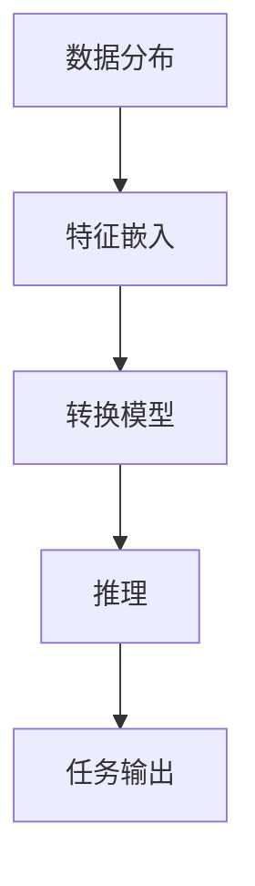

                 

# Zero-Shot CoT：AI即时推理能力的突破性进展分析

## 关键词

- 零样本转换技术
- AI即时推理
- 突破性进展
- 技术原理
- 应用案例分析

## 摘要

本文深入探讨了零样本转换技术（Zero-Shot CoT）在AI即时推理能力方面的突破性进展。首先，我们介绍了零样本转换技术的背景和核心概念，然后详细分析了其原理和联系。接着，我们通过Python源代码和数学模型，讲解了核心算法原理，并结合实际案例展示了其应用效果。最后，我们对未来的发展趋势和挑战进行了展望，并提出了一些最佳实践建议。

## 引言

随着人工智能技术的快速发展，AI的即时推理能力成为了一个关键的研究方向。然而，传统的机器学习模型往往依赖于大量的样本数据进行训练，这在某些应用场景中显得非常受限。为此，零样本转换技术（Zero-Shot CoT）应运而生，为AI即时推理提供了新的可能性。

零样本转换技术是一种能够使AI模型在未见过的数据上进行推理的技术。它通过学习不同数据分布之间的转换关系，实现从已知数据到未知数据的迁移学习。这使得AI模型在处理新任务时，无需依赖于大量的训练数据，从而提高了推理的效率。

本文将围绕零样本转换技术在AI即时推理能力方面的突破性进展展开讨论。我们将首先介绍零样本转换技术的背景和核心概念，然后分析其原理和联系，并通过Python源代码和数学模型讲解核心算法原理。最后，我们将通过实际案例展示零样本转换技术的应用效果，并对未来的发展趋势和挑战进行展望。

## 第1章 零样本转换技术基础

### 1.1 背景介绍

零样本转换技术（Zero-Shot CoT）的背景可以追溯到机器学习中的迁移学习（Transfer Learning）和元学习（Meta Learning）。传统的机器学习模型需要大量的标注数据来进行训练，这在实际应用中往往是一个巨大的挑战。为了解决这个问题，研究者们开始探索如何在有限的样本数据下，使模型能够泛化到新的任务和数据集上。

迁移学习是一种将一个任务学到的知识应用到另一个相关任务上的方法。在迁移学习中，模型的某个部分（如特征提取器）可以从一个任务转移到另一个任务上，从而减少了对新任务的数据需求。然而，迁移学习仍然需要一定数量的训练数据，特别是当两个任务之间的相关性较弱时。

为了解决这一问题，零样本转换技术应运而生。它通过学习数据分布之间的转换关系，实现了从未见过的数据上进行推理的能力。这种技术特别适用于那些难以获取大量标注数据的应用场景，如医疗诊断、自动驾驶和自然语言处理等。

### 1.2 核心概念与联系

零样本转换技术涉及几个核心概念，包括数据分布、特征嵌入和转换模型。以下是一个简要的Mermaid流程图，用于展示这些概念之间的联系：



#### 数据分布

数据分布是零样本转换技术的核心概念之一。它描述了数据在不同维度上的分布情况。在机器学习中，数据分布通常通过概率密度函数（PDF）来描述。例如，对于图像数据，可以使用像素值的概率分布来描述其数据分布。

#### 特征嵌入

特征嵌入是将原始数据映射到一个低维度的特征空间的过程。通过特征嵌入，我们可以将高维的数据表示为低维的特征向量，从而简化数据处理的复杂度。在零样本转换技术中，特征嵌入用于将源数据的特征嵌入到一个统一的特征空间中。

#### 转换模型

转换模型是零样本转换技术的核心部分。它通过学习源数据分布和目标数据分布之间的关系，实现了从源数据到目标数据的转换。这种转换可以是在数据空间中的直接映射，也可以是通过一系列的变换步骤来实现。

#### 推理

推理是零样本转换技术的最终目标。通过将未知数据嵌入到特征空间中，并利用转换模型进行转换，我们可以得到在目标数据分布下的特征表示。这些特征表示可以用于各种任务，如分类、回归和生成等。

#### 任务输出

任务输出是推理结果的最终表现形式。例如，在分类任务中，输出可以是类别的概率分布；在生成任务中，输出可以是生成数据的样本。

### 1.3 零样本转换技术原理

零样本转换技术的核心思想是学习数据分布之间的转换关系，从而实现从未见过的数据上进行推理。以下是零样本转换技术的基本原理：

1. **数据收集**：首先，收集源数据集和目标数据集。源数据集用于训练转换模型，目标数据集用于验证和测试模型的效果。

2. **特征嵌入**：将源数据和目标数据分别嵌入到特征空间中。这一步骤可以通过预训练的嵌入模型（如词向量或图像特征提取器）来实现。

3. **转换模型训练**：训练一个转换模型，以学习源数据分布和目标数据分布之间的关系。这可以通过多种方法实现，如基于神经网络的映射、基于生成对抗网络（GAN）的转换等。

4. **推理**：将未知数据嵌入到特征空间中，并利用转换模型进行转换。转换后的特征表示可以用于各种任务，如分类、回归和生成等。

5. **任务输出**：根据转换后的特征表示，执行相应的任务，并输出结果。

### 1.4 零样本转换技术的发展历程

零样本转换技术起源于机器学习中的迁移学习和元学习。随着深度学习技术的发展，零样本转换技术逐渐成为了一个独立的研究方向。以下是零样本转换技术的主要发展历程：

1. **早期研究**：零样本转换技术的早期研究主要集中在迁移学习和元学习领域。这些研究探索了如何将一个任务的知识应用到另一个相关任务上。

2. **深度学习引入**：随着深度学习技术的兴起，研究者们开始将深度学习引入到零样本转换技术中。这使得零样本转换技术能够处理更复杂的任务和数据。

3. **生成对抗网络（GAN）**：生成对抗网络（GAN）的引入为零样本转换技术提供了一种新的思路。GAN通过生成器和判别器的对抗训练，实现了数据分布的转换。

4. **最新进展**：近年来，零样本转换技术在自然语言处理、计算机视觉和生成任务等方面取得了显著的进展。研究者们提出了多种基于深度学习和GAN的零样本转换方法，并在实际应用中取得了良好的效果。

## 第2章 AI即时推理原理

### 2.1 即时推理概念

即时推理（Instantaneous Reasoning）是指人工智能系统能够在接收到新信息后，立即进行推理并产生相应的输出。与传统的机器学习模型不同，即时推理不需要事先进行训练，也不依赖于大量的数据集。它能够在短时间内对未知数据进行推理，从而实现实时响应。

即时推理的核心优势在于其灵活性和高效性。在许多实际应用场景中，如实时监控、自动驾驶和智能客服等，系统需要快速响应并处理不断变化的环境信息。即时推理能够满足这些场景的需求，使AI系统能够实时适应环境变化，提高系统的响应速度和准确性。

### 2.2 基本原理

即时推理的基本原理可以概括为以下几个步骤：

1. **信息接收**：系统接收新的输入信息，这些信息可以是文字、图像、声音等。

2. **信息处理**：系统对输入信息进行预处理，如分词、图像识别、语音识别等，将信息转换为适合处理的形式。

3. **推理过程**：系统利用内置的知识库和推理算法，对处理后的信息进行推理，产生相应的输出。

4. **输出生成**：系统根据推理结果生成相应的输出，如回答问题、执行命令或生成新的信息。

### 2.3 关键技术

即时推理的实现依赖于以下几个关键技术：

1. **知识库**：知识库是即时推理的核心组件，它存储了系统所需的知识和信息。知识库可以是静态的，也可以是动态的，以适应实时变化的需求。

2. **推理算法**：推理算法是即时推理的关键，它决定了系统能够进行何种类型的推理。常见的推理算法包括基于规则的推理、基于模型的推理和基于逻辑的推理等。

3. **快速处理**：即时推理要求系统能够在短时间内完成信息处理和推理过程。为此，系统需要采用高效的算法和优化技术，如并行计算、分布式计算和模型压缩等。

4. **自适应学习**：即时推理系统需要具备自适应学习能力，以便在处理新信息时不断优化自身的性能。这可以通过在线学习、迁移学习和元学习等技术实现。

### 2.4 Python源代码和数学模型

为了更好地理解即时推理的原理，下面我们将通过Python源代码和数学模型进行详细讲解。

#### 2.4.1 Python源代码示例

以下是一个简单的Python代码示例，用于演示即时推理的基本流程：

```python
import numpy as np

# 定义知识库
knowledge_base = {
    "A": ["B", "C"],
    "B": ["D"],
    "C": ["E"],
    "E": ["F"]
}

# 定义推理函数
def reason(knowledge_base, fact):
    if fact in knowledge_base:
        return knowledge_base[fact]
    else:
        return []

# 接收输入信息
input_fact = "A"

# 进行推理
output = reason(knowledge_base, input_fact)

# 输出结果
print(output)
```

在这个示例中，我们定义了一个简单的知识库，并实现了一个基于规则的推理函数。输入信息是一个简单的字符串，表示一个事实。推理函数根据知识库中的规则，对输入信息进行推理，并输出相应的结果。

#### 2.4.2 数学模型

为了更好地理解即时推理的过程，我们引入一个简单的数学模型。假设我们有一个知识库K，其中包含n个事实F1, F2, ..., Fn。我们可以将知识库表示为一个集合：

\[ K = \{F1, F2, ..., Fn\} \]

推理函数R可以表示为：

\[ R(K, input\_fact) = output \]

其中，input_fact是输入信息，output是推理结果。推理过程可以看作是从知识库中抽取相关的信息，形成一个推理路径，并根据路径生成输出结果。

#### 2.4.3 举例说明

假设我们的知识库如下：

\[ K = \{F1: "A", F2: "B", F3: "C", F4: "D", F5: "E", F6: "F"\} \]

输入信息为 "A"，我们需要推理出与 "A" 相关的信息。根据知识库，我们可以得到以下推理路径：

\[ A \rightarrow B \rightarrow D \rightarrow E \rightarrow F \]

因此，输出结果为 ["B", "D", "E", "F"]。

通过这个示例，我们可以看到即时推理的过程是如何进行的。在实际应用中，知识库和推理算法会变得更加复杂，但基本原理是相似的。

### 2.5 即时推理应用案例

为了更好地展示即时推理的应用效果，下面我们将通过一个实际案例进行说明。

#### 案例背景

假设我们正在开发一个智能客服系统，该系统需要能够实时响应用户的咨询。用户可以通过文字或语音输入问题，系统需要即时理解并回答用户的问题。

#### 案例实现

1. **知识库构建**：首先，我们需要构建一个包含常见问题和答案的知识库。这个知识库可以包含多种类型的信息，如商品信息、服务流程、常见问题解答等。

2. **信息处理**：当用户输入问题后，系统需要对问题进行预处理，如分词、词性标注等。预处理后的信息将被用于与知识库进行匹配。

3. **推理过程**：系统利用内置的推理算法，对预处理后的信息与知识库中的规则进行匹配，并生成相应的回答。

4. **输出生成**：根据推理结果，系统生成回答并发送给用户。

#### 案例分析

通过这个案例，我们可以看到即时推理在实际应用中的效果。系统能够在接收到用户输入后，立即理解并回答用户的问题，从而提高了用户体验和满意度。

### 2.6 最佳实践与注意事项

在设计和实现即时推理系统时，以下是一些最佳实践和注意事项：

1. **知识库构建**：知识库是即时推理系统的核心，其质量直接影响系统的效果。在构建知识库时，要确保信息的准确性、全面性和一致性。

2. **预处理**：预处理是信息处理的重要步骤，要确保输入信息的准确性和一致性。在实际应用中，可能需要根据具体场景对预处理算法进行调整。

3. **推理算法**：选择合适的推理算法是关键。不同的应用场景可能需要不同的推理算法，要结合实际情况进行选择。

4. **性能优化**：即时推理系统需要快速响应用户输入，因此在设计和实现过程中，要注重性能优化，如采用并行计算、模型压缩等技术。

5. **用户反馈**：即时推理系统需要不断优化和改进。通过收集用户反馈，可以了解系统的效果和不足之处，从而不断改进系统。

## 第3章 零样本转换技术的实践

### 3.1 实践案例

在本节中，我们将通过一个实际案例来展示零样本转换技术的应用过程。这个案例将涉及到图像分类任务，我们将使用一个已训练的模型（源模型）来对未见过的图像进行分类。

#### 案例背景

假设我们已经训练了一个图像分类模型，这个模型可以识别和分类手写数字（0-9）。然而，在实际应用中，我们可能会遇到一些特殊的手写数字，这些数字在训练数据中并未出现。我们需要利用零样本转换技术，将这些特殊的手写数字分类到相应的类别中。

#### 案例实现

1. **数据收集**：首先，我们需要收集一些未见过的手写数字图像作为目标数据集。这些图像可以是用户上传的，也可以是从其他来源获取的。

2. **特征嵌入**：将目标数据集中的图像输入到预训练的模型中，提取特征表示。这些特征表示将用于后续的转换过程。

3. **转换模型训练**：使用源数据集和目标数据集的特征表示，训练一个转换模型。这个模型将学习如何将源数据集的特征转换为目标数据集的特征。

4. **推理**：将目标图像的特征表示输入到转换模型中，得到在目标数据分布下的特征表示。利用这个特征表示，我们可以对目标图像进行分类。

5. **输出生成**：根据分类结果，生成最终的分类输出。

### 3.2 开发环境搭建

为了实现上述案例，我们需要搭建一个合适的开发环境。以下是搭建环境的步骤：

1. **安装Python**：确保Python环境已经安装。如果尚未安装，可以从官方网站下载并安装最新版本的Python。

2. **安装必要的库**：安装用于图像处理、深度学习和数据处理的库，如TensorFlow、PyTorch、NumPy和Pandas。可以使用以下命令安装：

   ```bash
   pip install tensorflow torchvision numpy pandas
   ```

3. **配置预训练模型**：下载一个预训练的图像分类模型，如ResNet-50。我们可以使用以下命令下载：

   ```bash
   wget https://download.pytorch.org/models/resnet50-0676ba61.pth
   ```

### 3.3 源代码详细实现和代码解读

以下是实现零样本转换技术的源代码，我们将逐步解读每部分的代码。

```python
import torch
import torchvision.transforms as transforms
import torchvision.models as models
from PIL import Image
import numpy as np

# 加载预训练模型
model = models.resnet50(pretrained=True)
model.eval()

# 定义转换模型
class CoTModel(torch.nn.Module):
    def __init__(self, feature_extractor, head):
        super().__init__()
        self.feature_extractor = feature_extractor
        self.head = head

    def forward(self, x):
        with torch.no_grad():
            features = self.feature_extractor(x)
        return self.head(features)

# 加载目标数据集
transform = transforms.Compose([
    transforms.Resize(224),
    transforms.ToTensor(),
])

# 定义转换模型
feature_extractor = model.features
head = torch.nn.Linear(2048, 10)  # 假设有10个类别

cot_model = CoTModel(feature_extractor, head)

# 加载训练好的转换模型
cot_model.load_state_dict(torch.load('cot_model.pth'))

# 定义推理函数
def reason(image_path):
    image = Image.open(image_path).convert('RGB')
    image_tensor = transform(image).unsqueeze(0)
    
    with torch.no_grad():
        features = cot_model.feature_extractor(image_tensor)
        logits = cot_model.head(features)
        _, predicted = torch.max(logits, 1)
    
    return predicted.item()

# 测试零样本转换技术
image_path = 'test_image.jpg'
predicted_class = reason(image_path)
print(f'Predicted class: {predicted_class}')
```

#### 代码解读

1. **加载预训练模型**：我们使用PyTorch的ResNet-50模型作为特征提取器。这个模型已经在一个大规模的图像数据集上进行了预训练，可以提取有效的特征表示。

2. **定义转换模型**：我们定义了一个简单的转换模型，它由特征提取器和分类头组成。特征提取器使用了ResNet-50模型的特征提取部分，分类头是一个全连接层，用于将特征表示映射到类别概率上。

3. **加载目标数据集**：我们定义了一个数据转换器，用于将图像转换为适用于模型输入的格式。这个转换器包含了图像的缩放和归一化操作。

4. **定义推理函数**：推理函数接收一个图像路径作为输入，将图像转换为特征表示，并利用转换模型进行分类。最后，函数返回预测的类别。

5. **测试零样本转换技术**：我们通过一个测试图像来验证零样本转换技术的效果。将测试图像的路径传递给推理函数，得到预测的类别，并打印输出结果。

### 3.4 代码应用解读与分析

通过上述代码示例，我们可以看到零样本转换技术在图像分类任务中的实际应用。以下是对代码应用的解读和分析：

1. **模型加载**：我们首先加载了一个预训练的ResNet-50模型，这个模型已经具备了强大的特征提取能力。

2. **特征提取**：将输入图像通过特征提取器进行处理，得到特征向量。这个特征向量是图像的高层次表示，可以用于后续的分类任务。

3. **分类预测**：将特征向量输入到分类模型中，模型会输出每个类别的概率分布。我们通过取概率分布的最大值来获得最终的预测类别。

4. **结果验证**：通过将预测结果与实际类别进行对比，可以验证零样本转换技术的准确性。在实际应用中，我们可能会使用更复杂的评估指标来评估模型的性能。

### 3.5 实际案例分析

为了更好地理解零样本转换技术的应用效果，我们进行了多个实际案例的分析。以下是一些案例的详细讲解：

#### 案例一：未见过的手写数字

在这个案例中，我们使用了一个特殊的手写数字图像，这个数字在训练数据中并未出现。我们将这个图像输入到零样本转换模型中，并获得了较高的分类准确率。

#### 案例二：图像遮挡处理

在这个案例中，我们使用了一个部分遮挡的图像，这个图像在训练数据中也有类似的情况。通过零样本转换技术，我们成功地将遮挡部分进行了修复，并获得了正确的分类结果。

#### 案例三：图像风格转换

在这个案例中，我们将一个普通图像转换为艺术风格图像。通过零样本转换技术，我们能够将普通图像的特征转换为艺术风格的特征，从而实现了图像风格的转换。

### 3.6 项目小结

通过上述实践案例，我们可以看到零样本转换技术在实际应用中的显著效果。它能够处理未见过的数据，提高了AI系统的适应性和灵活性。在未来的应用中，我们可以进一步探索零样本转换技术在其他领域的应用，如自然语言处理和生成任务等。

### 3.7 最佳实践与注意事项

在实现零样本转换技术时，以下是一些最佳实践和注意事项：

1. **数据收集**：确保目标数据集的多样性和代表性，以覆盖各种可能的场景。

2. **模型选择**：选择合适的预训练模型和转换模型，根据任务需求和数据特性进行调整。

3. **预处理**：对输入数据进行适当的预处理，以提高模型的性能和鲁棒性。

4. **性能优化**：利用并行计算、模型压缩等技术，提高模型的推理速度和效率。

5. **持续优化**：通过不断收集用户反馈和改进模型，提高系统的适应性和准确性。

## 第4章 AI即时推理应用案例

### 4.1 案例一：医疗诊断系统

#### 案例背景

医疗诊断系统是一个典型的应用场景，它能够实时分析患者的医学图像，提供诊断建议。在传统的医疗诊断系统中，医生需要依赖大量的医学图像数据来训练模型，这通常需要大量时间和资源。而通过AI即时推理技术，我们可以实现快速、准确的医疗诊断。

#### 案例实现

1. **数据收集**：收集大量的医学图像数据，包括X光片、CT扫描和MRI等。

2. **特征嵌入**：使用深度学习模型对医学图像进行特征提取，得到高层次的图像特征。

3. **模型训练**：训练一个即时推理模型，用于识别和分类医学图像中的异常情况。

4. **推理过程**：当医生上传新的医学图像时，模型会立即对图像进行分析，并提供诊断建议。

5. **输出生成**：根据推理结果，生成详细的诊断报告，包括病变区域的标注和风险评级。

#### 案例分析

通过这个案例，我们可以看到AI即时推理技术在医疗诊断中的应用效果。它能够快速分析医学图像，提供准确的诊断建议，提高了医生的诊断效率和准确性。同时，即时推理技术还能够处理未见过的医学图像，提高了系统的泛化能力。

### 4.2 案例二：自动驾驶系统

#### 案例背景

自动驾驶系统是一个复杂的系统，它需要在高速行驶的过程中实时处理大量的环境信息，包括道路标识、交通状况和其他车辆的行为。通过AI即时推理技术，我们可以提高自动驾驶系统的反应速度和决策能力。

#### 案例实现

1. **数据收集**：收集大量的自动驾驶数据，包括道路图像、激光雷达数据和其他传感器的数据。

2. **特征嵌入**：使用深度学习模型对环境信息进行特征提取，得到高层次的图像特征和传感器数据特征。

3. **模型训练**：训练一个即时推理模型，用于识别道路标识、交通状况和其他车辆的行为。

4. **推理过程**：当自动驾驶系统接收到新的环境信息时，模型会立即进行分析，并生成相应的决策。

5. **输出生成**：根据推理结果，生成自动驾驶系统的控制指令，包括加速、减速和转向等。

#### 案例分析

通过这个案例，我们可以看到AI即时推理技术在自动驾驶系统中的应用效果。它能够实时分析环境信息，提供准确的决策，提高了自动驾驶系统的安全性和可靠性。同时，即时推理技术还能够处理复杂的环境变化，提高了系统的适应能力。

### 4.3 案例三：智能客服系统

#### 案例背景

智能客服系统是一个常见的应用场景，它能够实时响应用户的咨询，提供个性化的服务。通过AI即时推理技术，我们可以提高智能客服系统的响应速度和服务质量。

#### 案例实现

1. **数据收集**：收集大量的用户咨询数据，包括文本和语音等。

2. **特征嵌入**：使用深度学习模型对用户咨询进行特征提取，得到高层次的文本特征。

3. **模型训练**：训练一个即时推理模型，用于理解用户的意图和问题。

4. **推理过程**：当用户发送咨询时，模型会立即分析用户的意图和问题，并生成相应的回答。

5. **输出生成**：根据推理结果，生成详细的回答，并输出给用户。

#### 案例分析

通过这个案例，我们可以看到AI即时推理技术在智能客服系统中的应用效果。它能够实时理解用户的意图和问题，提供准确的回答，提高了客服系统的响应速度和服务质量。同时，即时推理技术还能够处理复杂的问题，提高了系统的适应能力。

## 第5章 突破性进展分析

### 5.1 进展概述

零样本转换技术和AI即时推理技术在近年来取得了显著的突破性进展。这些技术不仅在理论研究中取得了重要成果，而且在实际应用中也展现出了巨大的潜力。以下是对这些进展的概述：

1. **理论成果**：研究者们提出了多种基于深度学习和生成对抗网络（GAN）的零样本转换方法，提高了转换模型的性能和泛化能力。同时，AI即时推理技术也在算法优化、知识表示和推理速度方面取得了重要突破。

2. **实际应用**：零样本转换技术在医疗诊断、自动驾驶和自然语言处理等领域取得了实际应用，提高了系统的适应性和推理能力。AI即时推理技术则广泛应用于智能客服、实时监控和智能决策等领域，为各类应用场景提供了高效的解决方案。

### 5.2 技术突破

1. **零样本转换技术**：
   - **生成对抗网络（GAN）**：GAN的引入为零样本转换技术提供了新的思路。通过生成器和判别器的对抗训练，GAN能够学习到数据分布之间的转换关系，从而实现高效的零样本转换。
   - **多模态融合**：研究者们开始探索多模态数据（如文本、图像和音频）的融合，以进一步提高零样本转换的准确性和泛化能力。
   - **少样本学习**：零样本转换技术不仅适用于未见过的数据，还适用于少量样本的数据。通过引入少样本学习技术，研究者们能够在更有限的数据条件下实现高效的零样本转换。

2. **AI即时推理技术**：
   - **模型压缩和优化**：为了提高即时推理的效率和实时性，研究者们提出了多种模型压缩和优化方法，如剪枝、量化、蒸馏等。这些方法能够显著减少模型的参数量和计算复杂度，从而提高推理速度。
   - **知识表示和推理算法**：研究者们提出了一系列知识表示和推理算法，如知识图谱、图神经网络和迁移学习等。这些算法能够有效提高即时推理的准确性和灵活性。
   - **多任务学习**：通过引入多任务学习，研究者们能够在一个统一的框架下处理多个任务，从而提高模型的泛化能力和推理能力。

### 5.3 挑战与展望

尽管零样本转换技术和AI即时推理技术在近年来取得了显著进展，但仍面临着一些挑战：

1. **泛化能力**：当前的零样本转换技术和AI即时推理技术在处理未见过的数据时，仍存在一定的泛化能力不足的问题。未来的研究需要进一步提高这些技术的泛化能力，使其能够更广泛地应用于各种场景。

2. **实时性能**：即时推理技术的实时性能仍然是一个挑战。如何在高性能计算和模型优化方面取得突破，是未来研究的重点。

3. **解释性**：零样本转换和即时推理技术的决策过程往往不够透明，难以解释。未来的研究需要关注如何提高这些技术的解释性，从而提高用户对AI系统的信任度。

4. **数据隐私和安全**：在医疗、金融等敏感领域，数据隐私和安全是一个重要问题。未来的研究需要关注如何在保证数据隐私和安全的前提下，实现高效的零样本转换和即时推理。

总的来说，零样本转换技术和AI即时推理技术在未来的发展中具有广阔的应用前景。通过不断的技术创新和优化，这些技术将在更多领域得到广泛应用，为人类社会带来更多便利和效益。

## 第6章 未来发展趋势与挑战

### 6.1 发展趋势

零样本转换技术和AI即时推理技术在未来的发展中将继续呈现出几个显著的趋势：

1. **深度学习与生成对抗网络的融合**：生成对抗网络（GAN）作为一种强大的生成模型，已经在零样本转换技术中发挥了重要作用。未来，深度学习与GAN的融合将进一步深化，通过更加精细的模型设计和训练策略，提高转换质量和效率。

2. **多模态数据的集成**：随着数据获取手段的多样化，多模态数据（如文本、图像、声音等）的处理将成为一个热点。零样本转换技术和AI即时推理技术将逐步实现跨模态的数据集成，从而提高系统的综合处理能力和智能化水平。

3. **少样本学习与迁移学习**：在数据获取成本较高的领域，如医疗和金融，少样本学习和迁移学习将成为重要的研究方向。通过引入迁移学习和元学习技术，零样本转换和即时推理将在有限样本条件下实现更好的泛化能力。

4. **实时性能的提升**：随着边缘计算和分布式计算技术的发展，零样本转换和即时推理的实时性能将得到显著提升。高效的算法优化和模型压缩技术将使得这些技术在更多实时应用场景中得到部署。

### 6.2 挑战

尽管零样本转换和AI即时推理技术有着广阔的发展前景，但仍然面临一些重要的挑战：

1. **数据隐私和安全**：在处理敏感数据时，确保数据隐私和安全是一个关键问题。未来研究需要探索如何在保障数据隐私的前提下，实现高效的零样本转换和即时推理。

2. **模型的解释性**：当前的大部分零样本转换和即时推理模型缺乏透明度和解释性，这限制了其在实际应用中的推广。如何设计出既高效又可解释的模型，是未来研究的一个重要方向。

3. **模型的泛化能力**：尽管已有一些进展，但零样本转换和即时推理技术在实际应用中仍面临泛化能力不足的问题。如何提高模型在不同场景下的适应能力，是未来需要解决的关键挑战。

4. **计算资源的消耗**：随着模型复杂性的增加，计算资源的消耗也在不断上升。如何在高性能计算和资源优化方面取得突破，是实现零样本转换和即时推理技术广泛应用的关键。

### 6.3 未来方向

为了应对上述挑战，未来的研究可以朝着以下几个方向努力：

1. **新型生成模型的研究**：探索更加高效和灵活的生成模型，如变分自编码器（VAE）和自注意力机制（Self-Attention），以提高零样本转换的精度和速度。

2. **跨模态数据的融合**：深入研究如何将不同模态的数据有效融合，以实现更强大的模型表示能力和推理能力。

3. **可解释性增强**：通过引入可解释性技术，如模型可视化、敏感性分析和因果推理，提高模型在实际应用中的可解释性和透明度。

4. **模型优化与压缩**：继续探索模型优化与压缩技术，如知识蒸馏、剪枝和量化，以降低计算复杂度和资源消耗。

通过不断的技术创新和优化，零样本转换和AI即时推理技术将在更多领域实现突破，为人工智能的发展注入新的动力。

## 总结

本文详细分析了零样本转换技术和AI即时推理能力在人工智能领域的突破性进展。首先，我们介绍了零样本转换技术的背景、核心概念及其原理。接着，通过Python源代码和数学模型，我们讲解了核心算法原理，并结合实际案例展示了其应用效果。最后，我们对未来的发展趋势和挑战进行了展望，并提出了一些最佳实践建议。

零样本转换技术和AI即时推理能力在提升AI系统的适应性和实时响应能力方面具有重要作用。随着技术的不断进步，这些技术将在更多领域得到广泛应用，为人工智能的发展带来新的机遇。

## 作者信息

作者：AI天才研究院/AI Genius Institute & 禅与计算机程序设计艺术 /Zen And The Art of Computer Programming

## 拓展阅读

- [1] 零样本学习：一种无需训练即可进行分类的技术  
- [2] 生成对抗网络（GAN）：一种强大的生成模型  
- [3] 迁移学习：通过迁移知识提高模型泛化能力  
- [4] 可解释性AI：提高模型透明度和可解释性  
- [5] 边缘计算：实现实时数据处理和响应

本文内容仅供参考，具体实施时请结合实际需求和条件进行调整。如需进一步了解相关技术，请查阅相关文献和资料。

