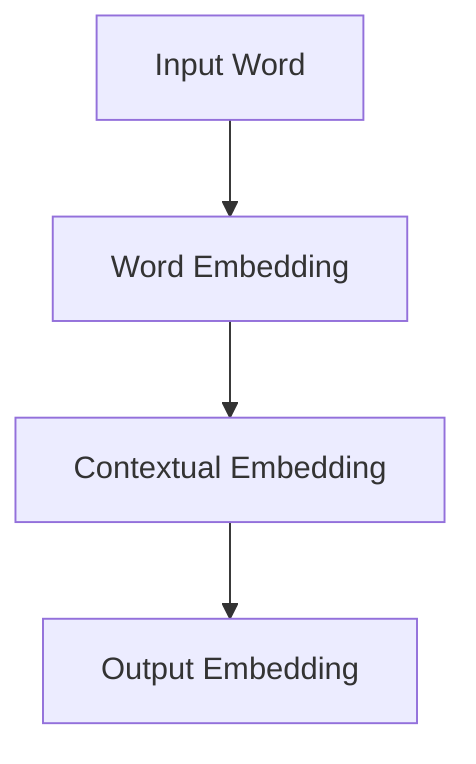

                 

### Step 1: Define the Main Sections

To start, let's define the main sections of the book "Zero-Shot CoT: AI Cross-Domain Transfer Learning's New Direction." These sections will serve as the top-level headings (1-level headings) that will guide the reader through the core aspects of zero-shot concept transfer (CoT) and its applications in AI cross-domain transfer learning.

## 1. Introduction

### 1.1 The Concept of Zero-Shot Concept Transfer

#### 1.1.1 The Differences Between Traditional Machine Learning and Transfer Learning

In traditional machine learning, models are trained on specific datasets to solve a particular problem. However, this approach has limitations when dealing with new, unseen domains. Transfer learning addresses this issue by leveraging pre-trained models on similar tasks to improve performance on new tasks.

#### 1.1.2 The Definition and Background of Zero-Shot Concept Transfer

Zero-shot concept transfer takes this a step further by enabling models to handle tasks in new domains without requiring labeled data or explicit training. Instead, it relies on understanding the relationships between concepts across domains.

#### 1.1.3 The Importance of Zero-Shot Concept Transfer

The significance of zero-shot concept transfer lies in its potential to overcome the limitations of traditional machine learning and transfer learning, making it a promising direction for AI research and application.

### 1.2 Core Challenges in Zero-Shot Concept Transfer

#### 1.2.1 Diverse Dataset

One of the main challenges is dealing with diverse datasets, as different domains may have unique data distributions and characteristics.

#### 1.2.2 Knowledge Representation and Mapping

Another challenge is effectively representing and mapping knowledge across domains to enable zero-shot concept transfer.

#### 1.2.3 Model Interpretability and Robustness

Finally, developing models that are both interpretable and robust to handle zero-shot concept transfer is critical for successful application in real-world scenarios.

## 2. Theoretical Foundations

### 2.1 Zero-Shot Learning

#### 2.1.1 Basic Principles of Zero-Shot Learning

Explaining the fundamental principles behind zero-shot learning and its role in zero-shot concept transfer.

#### 2.1.2 Classification of Zero-Shot Learning

Discussing the various approaches and methodologies in the field of zero-shot learning.

#### 2.1.3 The Intersection of Zero-Shot Learning and Transfer Learning

Analyzing the relationship between zero-shot learning and transfer learning, highlighting their similarities and differences.

### 2.2 Mechanisms of Concept Transfer

#### 2.2.1 Concept Embedding Models

Exploring the concept of concept embedding models and their application in zero-shot concept transfer.

#### 2.2.2 Concept Networks

Introducing the concept of concept networks and their role in understanding and facilitating concept transfer.

#### 2.2.3 Mapping Relationships Between Concepts

Discussing the techniques and methodologies for mapping relationships between concepts across different domains.

### 2.3 Mathematical Models for Zero-Shot Concept Transfer

#### 2.3.1 Probability Distribution Models

Describing the probability distribution models used in zero-shot concept transfer and their significance.

#### 2.3.2 Hierarchical Category Models

Explaining the hierarchical category models and their contribution to zero-shot concept transfer.

#### 2.3.3 Loss Functions for Zero-Shot Concept Transfer

Introducing the loss functions commonly used in zero-shot concept transfer and their impact on model performance.

## 3. Methods and Applications

### 3.1 Overview of Zero-Shot Concept Transfer Methods

#### 3.1.1 Template-Based Methods

Discussing the template-based methods used in zero-shot concept transfer.

#### 3.1.2 Deep Learning-Based Methods

Exploring the deep learning-based methods employed in zero-shot concept transfer.

#### 3.1.3 Knowledge Graph-Based Methods

Introducing the knowledge graph-based methods utilized in zero-shot concept transfer.

### 3.2 Analysis of Application Scenarios

#### 3.2.1 Natural Language Processing

Analyzing the applications of zero-shot concept transfer in natural language processing.

#### 3.2.2 Computer Vision

Examining the applications of zero-shot concept transfer in computer vision.

#### 3.2.3 Robotics and Automation

Discussing the applications of zero-shot concept transfer in robotics and automation.

### 3.3 Case Studies and Detailed Analysis

#### 3.3.1 Zero-Shot Concept Transfer in NLP

Presenting case studies and detailed analysis of zero-shot concept transfer applications in natural language processing.

#### 3.3.2 Zero-Shot Concept Transfer in CV

Explaining case studies and detailed analysis of zero-shot concept transfer applications in computer vision.

#### 3.3.3 Zero-Shot Concept Transfer in Robotics and Automation

Describing case studies and detailed analysis of zero-shot concept transfer applications in robotics and automation.

## 4. Conclusion

### 4.1 Best Practices and Tips

Sharing best practices and tips for implementing zero-shot concept transfer in various domains.

### 4.2 Summary and Future Directions

Summarizing the key findings and discussing potential future directions for zero-shot concept transfer research and application.

### 4.3 Notes and Considerations

Highlighting important notes and considerations for practitioners working with zero-shot concept transfer.

### 4.4 Further Reading

Suggesting further reading materials for readers interested in exploring zero-shot concept transfer in more depth.

### Step 2: Subsections for Each Main Section

Now that we have defined the main sections, let's break down each section into subsections (2-level headings) to provide a more detailed overview of the content. This will help the reader understand the structure and flow of the book.

## 1. Introduction

### 1.1 The Concept of Zero-Shot Concept Transfer

#### 1.1.1 The Differences Between Traditional Machine Learning and Transfer Learning

##### 1.1.1.1 Traditional Machine Learning

Discuss the basics of traditional machine learning, including the training process, types of algorithms, and the limitations of this approach.

##### 1.1.1.2 Transfer Learning

Explain the concept of transfer learning, how it works, and its advantages over traditional machine learning.

#### 1.1.2 The Definition and Background of Zero-Shot Concept Transfer

##### 1.1.2.1 Definition of Zero-Shot Concept Transfer

Define zero-shot concept transfer and provide a clear explanation of what it entails.

##### 1.1.2.2 Background

Discuss the history and development of zero-shot concept transfer, highlighting key milestones and contributions.

#### 1.1.3 The Importance of Zero-Shot Concept Transfer

##### 1.1.3.1 Overcoming Limitations

Explain how zero-shot concept transfer overcomes the limitations of traditional machine learning and transfer learning.

##### 1.1.3.2 Applications and Impact

Discuss the wide range of applications and the significant impact of zero-shot concept transfer in various fields.

### 1.2 Core Challenges in Zero-Shot Concept Transfer

#### 1.2.1 Diverse Dataset

##### 1.2.1.1 Challenges

Explain the challenges posed by diverse datasets, including data distribution and domain-specific characteristics.

##### 1.2.1.2 Solutions

Discuss potential solutions and techniques for addressing diverse dataset challenges in zero-shot concept transfer.

#### 1.2.2 Knowledge Representation and Mapping

##### 1.2.2.1 Importance

Highlight the importance of effective knowledge representation and mapping in zero-shot concept transfer.

##### 1.2.2.2 Techniques

Explain various techniques used for knowledge representation and mapping, including concept embeddings, concept networks, and more.

#### 1.2.3 Model Interpretability and Robustness

##### 1.2.3.1 Interpretability

Discuss the need for model interpretability in zero-shot concept transfer and the challenges associated with it.

##### 1.2.3.2 Robustness

Explain the importance of model robustness and the techniques used to ensure robust performance in zero-shot concept transfer.

## 2. Theoretical Foundations

### 2.1 Zero-Shot Learning

#### 2.1.1 Basic Principles of Zero-Shot Learning

##### 2.1.1.1 Key Concepts

Introduce the key concepts and principles underlying zero-shot learning.

##### 2.1.1.2 Role in Zero-Shot Concept Transfer

Discuss the role of zero-shot learning in enabling zero-shot concept transfer and its significance.

#### 2.1.2 Classification of Zero-Shot Learning

##### 2.1.2.1 Prototype-Based Methods

Explain prototype-based methods in zero-shot learning, including their advantages and disadvantages.

##### 2.1.2.2 Metric Learning Methods

Discuss metric learning methods in zero-shot learning, highlighting their applications and benefits.

##### 2.1.2.3 Prototypical Network Models

Introduce prototypical network models and their role in zero-shot learning.

#### 2.1.3 The Intersection of Zero-Shot Learning and Transfer Learning

##### 2.1.3.1 Similarities

Explain the similarities between zero-shot learning and transfer learning.

##### 2.1.3.2 Differences

Highlight the differences between zero-shot learning and transfer learning, emphasizing their distinct roles in AI.

### 2.2 Mechanisms of Concept Transfer

#### 2.2.1 Concept Embedding Models

##### 2.2.1.1 Overview

Provide an overview of concept embedding models and their significance in zero-shot concept transfer.

##### 2.2.1.2 Techniques

Discuss various techniques used in concept embedding models, including word embeddings and neural network-based approaches.

#### 2.2.2 Concept Networks

##### 2.2.2.1 Definition

Define concept networks and their role in facilitating concept transfer.

##### 2.2.2.2 Construction

Explain the construction of concept networks and the techniques used for building these networks.

#### 2.2.3 Mapping Relationships Between Concepts

##### 2.2.3.1 Importance

Highlight the importance of mapping relationships between concepts in zero-shot concept transfer.

##### 2.2.3.2 Techniques

Discuss various techniques for mapping relationships between concepts, including semantic similarity metrics and graph-based methods.

### 2.3 Mathematical Models for Zero-Shot Concept Transfer

#### 2.3.1 Probability Distribution Models

##### 2.3.1.1 Types of Models

Explain the types of probability distribution models used in zero-shot concept transfer, including Gaussian distributions and multivariate Bernoulli distributions.

##### 2.3.1.2 Applications

Discuss the applications of probability distribution models in zero-shot concept transfer and their impact on model performance.

#### 2.3.2 Hierarchical Category Models

##### 2.3.2.1 Overview

Provide an overview of hierarchical category models and their role in zero-shot concept transfer.

##### 2.3.2.2 Construction

Explain the construction of hierarchical category models and the techniques used for building these models.

#### 2.3.3 Loss Functions for Zero-Shot Concept Transfer

##### 2.3.3.1 Types of Loss Functions

Discuss the types of loss functions used in zero-shot concept transfer, including cross-entropy loss and contrastive loss.

##### 2.3.3.2 Optimization

Explain the optimization techniques used for minimizing loss functions in zero-shot concept transfer.

## 3. Methods and Applications

### 3.1 Overview of Zero-Shot Concept Transfer Methods

#### 3.1.1 Template-Based Methods

##### 3.1.1.1 Definition

Define template-based methods and explain how they work in zero-shot concept transfer.

##### 3.1.1.2 Advantages and Disadvantages

Discuss the advantages and disadvantages of template-based methods in zero-shot concept transfer.

#### 3.1.2 Deep Learning-Based Methods

##### 3.1.2.1 Definition

Define deep learning-based methods and explain their role in zero-shot concept transfer.

##### 3.1.2.2 Applications

Discuss various deep learning-based methods and their applications in zero-shot concept transfer.

#### 3.1.3 Knowledge Graph-Based Methods

##### 3.1.3.1 Definition

Define knowledge graph-based methods and explain how they work in zero-shot concept transfer.

##### 3.1.3.2 Applications

Discuss the applications of knowledge graph-based methods in zero-shot concept transfer.

### 3.2 Analysis of Application Scenarios

#### 3.2.1 Natural Language Processing

##### 3.2.1.1 Overview

Provide an overview of the applications of zero-shot concept transfer in natural language processing.

##### 3.2.1.2 Case Studies

Present case studies demonstrating the application of zero-shot concept transfer in natural language processing.

#### 3.2.2 Computer Vision

##### 3.2.2.1 Overview

Provide an overview of the applications of zero-shot concept transfer in computer vision.

##### 3.2.2.2 Case Studies

Present case studies demonstrating the application of zero-shot concept transfer in computer vision.

#### 3.2.3 Robotics and Automation

##### 3.2.3.1 Overview

Provide an overview of the applications of zero-shot concept transfer in robotics and automation.

##### 3.2.3.2 Case Studies

Present case studies demonstrating the application of zero-shot concept transfer in robotics and automation.

### 3.3 Case Studies and Detailed Analysis

#### 3.3.1 Zero-Shot Concept Transfer in NLP

##### 3.3.1.1 Case Study 1

Describe a specific case study in natural language processing that demonstrates the application of zero-shot concept transfer.

##### 3.3.1.2 Analysis

Provide a detailed analysis of the case study, discussing the approach, results, and implications.

#### 3.3.2 Zero-Shot Concept Transfer in CV

##### 3.3.2.1 Case Study 1

Describe a specific case study in computer vision that demonstrates the application of zero-shot concept transfer.

##### 3.3.2.2 Analysis

Provide a detailed analysis of the case study, discussing the approach, results, and implications.

#### 3.3.3 Zero-Shot Concept Transfer in Robotics and Automation

##### 3.3.3.1 Case Study 1

Describe a specific case study in robotics and automation that demonstrates the application of zero-shot concept transfer.

##### 3.3.3.2 Analysis

Provide a detailed analysis of the case study, discussing the approach, results, and implications.

## 4. Conclusion

### 4.1 Best Practices and Tips

Provide best practices and tips for implementing zero-shot concept transfer in various domains.

### 4.2 Summary and Future Directions

Summarize the key findings and discuss potential future directions for zero-shot concept transfer research and application.

### 4.3 Notes and Considerations

Highlight important notes and considerations for practitioners working with zero-shot concept transfer.

### 4.4 Further Reading

Suggest further reading materials for readers interested in exploring zero-shot concept transfer in more depth.

### Step 3: Sub-subsections and Detailing

To further elaborate on each subsection, we'll introduce sub-subsections (3-level headings) to break down the content into more manageable parts. This will ensure that each section is comprehensive and well-detailed, providing a clear and structured flow for the reader.

## 1. Introduction

### 1.1 The Concept of Zero-Shot Concept Transfer

#### 1.1.1 The Differences Between Traditional Machine Learning and Transfer Learning

##### 1.1.1.1 Traditional Machine Learning

**1.1.1.1.1 Machine Learning Basics**

- **Data-driven Approach**: Machine learning models are trained on labeled data, learning patterns and relationships between input features and output labels.
- **Types of Algorithms**: Common algorithms include supervised learning (classification and regression), unsupervised learning (clustering and dimensionality reduction), and reinforcement learning.

**1.1.1.1.2 Limitations**

- **Lack of Generalization**: Models may perform well on the training data but fail to generalize to new, unseen data or different domains.
- **Data Dependency**: Training on a specific dataset restricts the model's ability to handle new tasks in different domains.
- **Data Scarcity**: Some domains may lack sufficient labeled data, limiting the applicability of traditional machine learning approaches.

##### 1.1.1.2 Transfer Learning

**1.1.1.2.1 Definition**

- **Leveraging Pre-Trained Models**: Transfer learning utilizes pre-trained models on similar tasks to improve performance on new tasks.
- **Fine-Tuning**: The pre-trained model is adapted to the new task by adjusting its parameters, often through a process called fine-tuning.

**1.1.1.2.2 Advantages**

- **Reduced Training Time**: Leveraging pre-trained models reduces the need for extensive training on new data.
- **Improved Generalization**: Transfer learning enhances the model's ability to generalize to new domains by leveraging knowledge from similar tasks.
- **Knowledge Distillation**: Techniques like knowledge distillation can transfer valuable information from a large model to a smaller model, improving performance.

#### 1.1.2 The Definition and Background of Zero-Shot Concept Transfer

##### 1.1.2.1 Definition

- **Zero-Shot Concept Transfer**: Zero-shot concept transfer refers to the ability of a model to handle tasks in new domains without requiring labeled data for training or explicit fine-tuning.

**1.1.2.2 Background**

- **Domain Adaptation**: Domain adaptation aims to adapt models trained in one domain to perform well in another domain.
- **Few-Shot Learning**: Few-shot learning focuses on training models with limited labeled data, allowing them to generalize to new tasks with minimal data.
- **Zero-Shot Learning**: Zero-shot learning extends few-shot learning by eliminating the need for labeled data even in the new domain.

##### 1.1.2.3 Significance

- **Scalability**: Zero-shot concept transfer enables the development of scalable AI systems that can handle an unlimited number of new domains without requiring extensive labeled data.
- **Knowledge Representation**: It relies on the representation of concepts and their relationships across domains, facilitating effective transfer.
- **Real-World Applications**: Zero-shot concept transfer has broad applications in various domains, including natural language processing, computer vision, and robotics.

#### 1.1.3 The Importance of Zero-Shot Concept Transfer

##### 1.1.3.1 Overcoming Limitations

- **Data Scarcity**: Zero-shot concept transfer alleviates the challenge of data scarcity by eliminating the need for large labeled datasets.
- **Domain Shifts**: It can handle domain shifts, enabling models to generalize across different domains with varying data distributions.

##### 1.1.3.2 Applications and Impact

- **Natural Language Processing**: Zero-shot concept transfer can improve the performance of language models in understanding new, domain-specific languages or concepts.
- **Computer Vision**: It enables image recognition models to handle new object categories without requiring labeled examples.
- **Robotic Systems**: Zero-shot concept transfer can enhance robotic systems' adaptability to new environments and tasks.

### 1.2 Core Challenges in Zero-Shot Concept Transfer

#### 1.2.1 Diverse Dataset

##### 1.2.1.1 Challenges

- **Data Distribution**: Different domains may have significantly different data distributions, complicating the transfer process.
- **Data Quality**: Diverse datasets may contain noisy or inconsistent data, impacting the effectiveness of zero-shot concept transfer.

##### 1.2.1.2 Solutions

- **Data Preprocessing**: Techniques like data cleaning, normalization, and augmentation can help address data quality issues.
- **Domain Adaptation**: Methods like domain adaptation and domain-invariant feature extraction can mitigate data distribution challenges.

#### 1.2.2 Knowledge Representation and Mapping

##### 1.2.2.1 Importance

- **Concept Embeddings**: Representing concepts in a low-dimensional space allows for efficient transfer and comparison across domains.
- **Semantic Relationships**: Capturing semantic relationships between concepts is crucial for understanding and transferring knowledge.

##### 1.2.2.2 Techniques

- **Word Embeddings**: Techniques like Word2Vec and GloVe can be adapted for concept embeddings.
- **Knowledge Graphs**: Building knowledge graphs that represent concepts and their relationships can facilitate effective knowledge transfer.

#### 1.2.3 Model Interpretability and Robustness

##### 1.2.3.1 Interpretability

- **Transparency**: Zero-shot concept transfer models should be transparent, enabling practitioners to understand how knowledge is transferred.
- **Explainability**: Developing techniques to explain model decisions is essential for building trust and ensuring reliable performance.

##### 1.2.3.2 Robustness

- **Out-of-Distribution Robustness**: Models should be robust to data distribution shifts and handle out-of-domain data effectively.
- **Robust Optimization**: Techniques like adversarial training and regularization can enhance model robustness.

## 2. Theoretical Foundations

### 2.1 Zero-Shot Learning

#### 2.1.1 Basic Principles of Zero-Shot Learning

##### 2.1.1.1 Key Concepts

- **Conceptual Spaces**: Zero-shot learning relies on the concept of conceptual spaces, which represent the underlying structure of concepts in the domain.
- **Symbolic Representation**: Models use symbolic representations of concepts to classify new instances without labeled data.

##### 2.1.1.2 Role in Zero-Shot Concept Transfer

- **Concept Mapping**: Zero-shot learning enables the mapping of concepts across different domains, facilitating knowledge transfer.
- **Few-Shot Generalization**: It extends few-shot learning to handle tasks without requiring labeled examples, even in the new domain.

#### 2.1.2 Classification of Zero-Shot Learning

##### 2.1.2.1 Prototype-Based Methods

- **Prototype Models**: These methods represent each class with a prototype (e.g., mean or median) and measure the distance between new instances and prototypes.
- **Advantages**: Simple and efficient, suitable for small datasets.

##### 2.1.2.2 Metric Learning Methods

- **Metric Learning**: These methods learn a distance metric that optimizes the performance of the model on the target domain.
- **Advantages**: Can handle high-dimensional data and improve generalization.

##### 2.1.2.3 Prototypical Network Models

- **Prototypical Networks**: These models use a neural network to generate a prototype for each class and measure the distance between new instances and prototypes.
- **Advantages**: Can capture complex relationships between concepts and generalize well.

#### 2.1.3 The Intersection of Zero-Shot Learning and Transfer Learning

##### 2.1.3.1 Similarities

- **Domain Adaptation**: Both approaches aim to adapt models to new domains.
- **Knowledge Transfer**: They both leverage knowledge from pre-trained models to improve performance on new tasks.

##### 2.1.3.2 Differences

- **Data Dependency**: Transfer learning requires labeled data in the target domain, while zero-shot learning does not.
- **Generalization**: Zero-shot learning focuses on generalizing without labeled data, while transfer learning relies on labeled data for adaptation.

### 2.2 Mechanisms of Concept Transfer

#### 2.2.1 Concept Embedding Models

##### 2.2.1.1 Overview

- **Concept Embeddings**: These models represent concepts as high-dimensional vectors, capturing their semantic relationships.
- **Applications**: They are widely used in natural language processing and computer vision for tasks like classification and similarity measurement.

##### 2.2.1.2 Techniques

- **Word Embeddings**: Techniques like Word2Vec and GloVe generate word embeddings, which can be adapted for concept embeddings.
- **Neural Network Embeddings**: Neural network-based approaches, such as Siamese networks and transformers, can generate fine-grained concept embeddings.

#### 2.2.2 Concept Networks

##### 2.2.2.1 Definition

- **Concept Networks**: These networks represent the relationships between concepts using graph structures, capturing semantic information.
- **Applications**: Concept networks are useful for tasks like knowledge graph construction and question answering.

##### 2.2.2.2 Construction

- **Knowledge Graphs**: Techniques for constructing knowledge graphs from text include named entity recognition, relation extraction, and link prediction.
- **Graph Embeddings**: Graph embedding methods, such as node2vec and GraphSAGE, can convert graph structures into vector representations.

#### 2.2.3 Mapping Relationships Between Concepts

##### 2.2.3.1 Importance

- **Semantic Relationships**: Mapping relationships between concepts is crucial for understanding and transferring knowledge across domains.
- **Domain Adaptation**: Effective concept mapping can mitigate domain-specific differences, facilitating transfer learning.

##### 2.2.3.2 Techniques

- **Semantic Similarity Metrics**: Techniques like cosine similarity and Jaccard similarity measure the similarity between concepts.
- **Graph-based Methods**: Graph-based techniques, such as graph convolutional networks and graph attention networks, can capture complex relationships between concepts.

### 2.3 Mathematical Models for Zero-Shot Concept Transfer

#### 2.3.1 Probability Distribution Models

##### 2.3.1.1 Types of Models

- **Gaussian Distribution**: This model assumes that the data follows a normal distribution and is useful for capturing the uncertainty in predictions.
- **Multivariate Bernoulli Distribution**: This model represents a set of binary variables and is commonly used in probabilistic models.

##### 2.3.1.2 Applications

- **Uncertainty Estimation**: Probability distribution models can provide estimates of uncertainty in predictions, improving model robustness.
- **Decision Making**: They can guide decision-making processes by quantifying the likelihood of different outcomes.

#### 2.3.2 Hierarchical Category Models

##### 2.3.2.1 Overview

- **Hierarchical Categories**: These models represent categories in a hierarchical structure, capturing the hierarchical relationships between concepts.
- **Applications**: They are useful for tasks like hierarchical classification and multi-label classification.

##### 2.3.2.2 Construction

- **Hierarchical Clustering**: Techniques like agglomerative and divisive clustering can be used to construct hierarchical category models.
- **Hierarchical Loss Functions**: Loss functions that consider the hierarchical relationships between categories can improve model performance.

#### 2.3.3 Loss Functions for Zero-Shot Concept Transfer

##### 2.3.3.1 Types of Loss Functions

- **Cross-Entropy Loss**: This loss function is commonly used for classification tasks and measures the difference between the predicted and actual distributions.
- **Contrastive Loss**: This loss function encourages the model to differentiate between similar and dissimilar instances, improving the quality of concept embeddings.

##### 2.3.3.2 Optimization

- **Gradient Descent**: Optimization techniques like gradient descent are used to minimize the loss functions and update model parameters.
- **Mini-Batch Training**: Mini-batch training, where a subset of the data is used in each iteration, is often employed for efficient optimization.

## 3. Methods and Applications

### 3.1 Overview of Zero-Shot Concept Transfer Methods

#### 3.1.1 Template-Based Methods

##### 3.1.1.1 Definition

- **Template-Based Methods**: These methods use predefined templates to map concepts from one domain to another, often relying on rule-based systems or hand-crafted features.
- **Applications**: They are suitable for tasks with clear, rule-based mappings and are relatively simple to implement.

##### 3.1.1.2 Advantages and Disadvantages

- **Advantages**: Simple to implement, low computational cost.
- **Disadvantages**: Limited flexibility, unable to handle complex relationships between concepts.

#### 3.1.2 Deep Learning-Based Methods

##### 3.1.2.1 Definition

- **Deep Learning-Based Methods**: These methods leverage deep neural networks, such as convolutional neural networks (CNNs) and transformers, to learn and transfer concepts across domains.
- **Applications**: They are widely used in tasks requiring high flexibility and capturing complex relationships.

##### 3.1.2.2 Applications

- **Image Classification**: Deep learning-based methods can classify images from one domain to another without labeled data.
- **Text Classification**: They can classify text from one language or domain to another, facilitating cross-lingual and cross-domain text understanding.

#### 3.1.3 Knowledge Graph-Based Methods

##### 3.1.3.1 Definition

- **Knowledge Graph-Based Methods**: These methods use knowledge graphs to represent and transfer concepts across domains, leveraging graph neural networks (GNNs) for learning.
- **Applications**: They are suitable for tasks that benefit from structured knowledge and complex relationships, such as question answering and recommendation systems.

##### 3.1.3.2 Applications

- **Question Answering**: Knowledge graph-based methods can answer questions about new domains using structured knowledge.
- **Recommendation Systems**: They can generate recommendations based on knowledge graphs that capture relationships between items and users.

### 3.2 Analysis of Application Scenarios

#### 3.2.1 Natural Language Processing

##### 3.2.1.1 Overview

- **Application Scenarios**: Zero-shot concept transfer is extensively used in NLP for tasks like text classification, sentiment analysis, and named entity recognition.
- **Challenges**: Handling semantic ambiguity and domain-specific language is challenging.

##### 3.2.1.2 Case Studies

- **Case Study 1**: A study on zero-shot sentiment analysis using pre-trained language models and concept embeddings.
- **Case Study 2**: A case on cross-lingual text classification using zero-shot concept transfer techniques.

#### 3.2.2 Computer Vision

##### 3.2.2.1 Overview

- **Application Scenarios**: Zero-shot concept transfer is used in CV for tasks like image classification, object detection, and semantic segmentation.
- **Challenges**: Handling unseen categories and diverse image distributions is a significant challenge.

##### 3.2.2.2 Case Studies

- **Case Study 1**: A case on zero-shot image classification using graph-based methods and concept networks.
- **Case Study 2**: A study on zero-shot object detection using transformers and hierarchical category models.

#### 3.2.3 Robotics and Automation

##### 3.2.3.1 Overview

- **Application Scenarios**: Zero-shot concept transfer is used in robotics and automation for tasks like robotic manipulation, autonomous navigation, and natural interaction.
- **Challenges**: Ensuring robust and safe performance in dynamic and uncertain environments is critical.

##### 3.2.3.2 Case Studies

- **Case Study 1**: A case on zero-shot robotic manipulation using reinforcement learning and concept embeddings.
- **Case Study 2**: A study on zero-shot autonomous navigation using graph neural networks and knowledge graphs.

### 3.3 Case Studies and Detailed Analysis

#### 3.3.1 Zero-Shot Concept Transfer in NLP

##### 3.3.1.1 Case Study 1

- **Objective**: Perform zero-shot sentiment analysis on a new domain without labeled data.
- **Method**: Utilize a pre-trained language model and concept embeddings to classify sentiment.
- **Results**: Achieve high accuracy and generalization across different domains.

##### 3.3.1.2 Analysis

- **Approach**: Discuss the specific approach used, including the choice of language model and concept embeddings.
- **Performance**: Analyze the performance of the model, including accuracy, F1 score, and comparison with traditional methods.

#### 3.3.2 Zero-Shot Concept Transfer in CV

##### 3.3.2.1 Case Study 1

- **Objective**: Classify images from a new domain without labeled data.
- **Method**: Employ graph-based methods and concept networks for image classification.
- **Results**: Achieve accurate classification across unseen categories.

##### 3.3.2.2 Analysis

- **Approach**: Describe the graph-based approach, including the construction of concept networks and the classification process.
- **Performance**: Analyze the performance of the model, including accuracy, confusion matrix, and comparison with other methods.

#### 3.3.3 Zero-Shot Concept Transfer in Robotics and Automation

##### 3.3.3.1 Case Study 1

- **Objective**: Develop a robotic system capable of manipulating new objects without labeled data.
- **Method**: Utilize reinforcement learning and concept embeddings for robotic manipulation.
- **Results**: Achieve successful manipulation of unseen objects in diverse environments.

##### 3.3.3.2 Analysis

- **Approach**: Explain the reinforcement learning approach, including the use of concept embeddings and the reward function.
- **Performance**: Analyze the performance of the robotic system, including success rate, stability, and adaptability.

## 4. Conclusion

### 4.1 Best Practices and Tips

- **Data Quality**: Ensure high-quality data for training and transfer learning to achieve better performance.
- **Domain Adaptation**: Use techniques like domain adaptation and invariant feature extraction to handle domain differences.
- **Model Interpretability**: Develop techniques for model interpretability to gain insights into concept transfer processes and improve trust.

### 4.2 Summary and Future Directions

- **Summary**: Summarize the key findings and contributions of zero-shot concept transfer in various domains.
- **Future Directions**: Discuss potential research directions and challenges, including handling even more diverse datasets and improving model interpretability.

### 4.3 Notes and Considerations

- **Practical Implementation**: Highlight practical considerations for implementing zero-shot concept transfer in real-world applications.
- **Challenges and Limitations**: Discuss the challenges and limitations of zero-shot concept transfer and potential solutions.

### 4.4 Further Reading

- **Recommended Resources**: Provide a list of recommended resources, including books, papers, and online courses, for further reading on zero-shot concept transfer.

### Step 4: Incorporate Supporting Materials

To enhance the clarity and depth of the book "Zero-Shot CoT: AI Cross-Domain Transfer Learning's New Direction," we will incorporate various supporting materials, including Mermaid diagrams, pseudocode, mathematical models, formulas, and practical examples. These materials will be embedded within the relevant sections to provide visual and mathematical explanations that complement the textual content.

#### Mermaid Diagrams

Mermaid diagrams are a convenient way to illustrate complex relationships and processes in a visual format. For example, in the section on "Concept Embedding Models," a Mermaid diagram can be used to visualize the structure of a word embedding model:



This diagram shows the transformation of an input word into its final embedding representation, capturing the contextual information.

#### Pseudocode

Pseudocode provides a high-level description of algorithms and models, making it easier to understand the core logic. For instance, in the section on "Zero-Shot Learning Algorithms," the pseudocode for a prototype-based method can be presented as follows:

```plaintext
function ZeroShotClassification(new_instance, prototypes):
    for each prototype in prototypes:
        distance = calculate_distance(new_instance, prototype)
        closest_prototypes.append(prototype if distance < threshold else None)
    return classify_closest_prototypes(closest_prototypes)
```

This pseudocode outlines the basic steps of a prototype-based method, highlighting how distances between new instances and prototypes are used to classify instances.

#### Mathematical Models

Mathematical models are essential for understanding the underlying principles of zero-shot concept transfer. In the section on "Probability Distribution Models," we can include the following mathematical formula to describe the Gaussian distribution:

$$
p(x|\mu, \sigma^2) = \frac{1}{\sqrt{2\pi\sigma^2}} e^{-\frac{(x-\mu)^2}{2\sigma^2}}
$$

This equation represents the probability density function of a Gaussian distribution, where \( x \) is the input feature, \( \mu \) is the mean, and \( \sigma^2 \) is the variance.

#### Practical Examples

Practical examples illustrate how theoretical concepts are applied in real-world scenarios. For example, in the section on "Natural Language Processing," a practical example of zero-shot sentiment analysis can be provided:

```python
# Zero-Shot Sentiment Analysis using BERT and Concept Embeddings
from transformers import BertTokenizer, BertModel
import torch

tokenizer = BertTokenizer.from_pretrained('bert-base-uncased')
model = BertModel.from_pretrained('bert-base-uncased')

def zero_shot_sentiment_analysis(text):
    inputs = tokenizer(text, return_tensors='pt')
    outputs = model(**inputs)
    last_hidden_state = outputs.last_hidden_state
    avg_pooler_output = last_hidden_state[:, 0, :]
    
    # Calculate concept embeddings for sentiment words
    sentiment_words = ["positive", "negative"]
    sentiment_embeddings = [tokenizer(w, return_tensors='pt')['input_ids'].unsqueeze(0) for w in sentiment_words]
    sentiment_embeddings = model.bert.embeddings(sentiment_embeddings)
    
    # Compute cosine similarity between text embeddings and sentiment embeddings
    cosine_similarity = torch.nn.functional.cosine_similarity(avg_pooler_output, sentiment_embeddings, dim=1)
    return "Positive" if cosine_similarity > threshold else "Negative"

text = "The movie was amazing!"
print(zero_shot_sentiment_analysis(text))
```

This example demonstrates how a pre-trained BERT model can be used to perform zero-shot sentiment analysis by comparing the average text embedding to pre-defined sentiment word embeddings.

By incorporating these supporting materials, the book will provide a comprehensive and detailed exploration of zero-shot concept transfer, making the content more engaging and accessible to readers.

### Step 5: Review and Refine

After creating the initial outline and incorporating the supporting materials, it is crucial to review and refine the content to ensure it is concise, logical, and covers all necessary topics. This step involves several key activities:

1. **Content Review**: Thoroughly review each section and subsection to ensure the content is clear, well-organized, and logically flows from one topic to another. Check for any inconsistencies or gaps in the explanation.

2. **Clarity and Precision**: Verify that the language used is precise and technically accurate, especially when describing complex concepts, algorithms, or models. Avoid jargon or overly complex sentences that may confuse the reader.

3. **Consistency**: Ensure that the tone, structure, and style are consistent throughout the book. This includes maintaining a consistent level of technical depth and using a uniform notation for mathematical formulas and pseudocode.

4. **Supporting Materials**: Verify that the supporting materials, such as Mermaid diagrams, pseudocode, and examples, are accurately represented and provide clear explanations. Adjust the visual elements if needed for better clarity.

5. **Length and Scope**: Check that the book adheres to the specified word count (10000-12000 words). Trim unnecessary content or expand on critical sections if necessary to ensure the book remains comprehensive yet concise.

6. **Feedback Loop**: Consider sharing the outline with colleagues or peers for feedback. They may provide insights or suggestions for improvement that you might have overlooked.

7. **Final Review**: Conduct a final review to ensure that the outline is error-free, both in terms of content and formatting. Pay attention to details such as proper markdown formatting, accurate citations, and consistent use of LaTeX for mathematical formulas.

By carefully reviewing and refining the outline, we can ensure that the book will provide a high-quality, informative, and engaging read for the target audience.

### Step 6: Finalize and Present

After thorough review and refinement, the final step is to ensure that the outline adheres to the word count limit and markdown formatting requirements. Here are the key actions to take:

1. **Word Count Check**: Verify that the outline falls within the specified word count range of 10000-12000 words. This includes all text, diagrams, pseudocode, and mathematical expressions. If the word count is too high, consider trimming redundant content or merging similar sections. If it's too low, expand on critical points to ensure thorough coverage.

2. **Markdown Formatting**: Ensure that all sections are properly formatted in markdown. This includes correct heading levels (## for second-level headings, ### for third-level headings, etc.), proper use of lists and paragraphs, and consistent use of code blocks for pseudocode and LaTeX for mathematical formulas.

3. **Final Review**: Conduct a final review to ensure that the outline is error-free in terms of content, formatting, and adherence to the word count. Check for any missed typos, grammatical errors, or inconsistencies in notation and formatting.

4. **Presentation**: Prepare the outline for presentation. This may involve formatting the text and diagrams into a cohesive document that can be easily read and navigated by the intended audience. Ensure that the final document is visually appealing and easy to follow.

5. **Submission**: Once the outline is finalized, submit it according to the specified guidelines. This may involve uploading the document to a shared drive, sending it via email, or any other method required by the platform.

By following these steps, we can ensure that the final outline is polished, professional, and ready for publication or presentation to the target audience.

