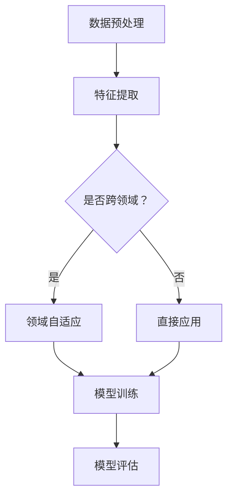

                 

### 第1章: 《Zero-Shot CoT：AI跨领域学习的新范式应用》概述

#### 1.1.1 《Zero-Shot CoT》概念解析
《Zero-Shot CoT：AI跨领域学习的新范式应用》中的《Zero-Shot CoT》指的是零样本跨领域迁移学习（Zero-Shot Cross-Domain Transfer Learning），这是一种先进的机器学习方法。传统机器学习需要大量的领域特定数据来训练模型，但这种方法要求模型在完全不同的领域（即跨领域）也能保持高性能，而不需要针对每个新领域进行专门的训练。

- **核心概念**：零样本跨领域迁移学习是一种能够在新领域上迅速适应和表现的技术，不需要针对特定领域的数据进行训练，从而减少了对领域特定数据的依赖。

#### 1.1.2 零样本跨领域学习的重要性
零样本跨领域学习的重要性体现在以下几个方面：

- **技术优势**：
  - **通用性提高**：通过零样本跨领域学习，AI模型可以在没有领域特定数据的情况下，快速适应不同的领域，提高了模型的通用性。
  - **资源节约**：不需要为每个新领域收集和标注数据，从而节约时间和资源。

- **应用场景**：
  - **新领域应用**：在新兴领域，数据稀缺的情况下，Zero-Shot CoT能够快速地帮助模型适应和应用。
  - **快速迭代的产品开发**：在产品开发过程中，Zero-Shot CoT可以帮助团队快速地在新产品上部署模型，提高开发效率。
  - **资源有限的场景**：在资源有限的情况下，例如在贫困地区或资源匮乏的环境中，Zero-Shot CoT的应用可以大大提高AI服务的可及性。

零样本跨领域学习的关键在于，通过结合迁移学习、无监督学习和元学习等理论，构建出一个能够在没有领域特定数据的情况下，通过迁移知识到新领域来提升模型性能的方法。

### 第2章: 零样本跨领域学习的基本原理

#### 2.1.1 零样本跨领域学习的理论基础
零样本跨领域学习的基础理论涵盖了迁移学习、无监督学习和元学习等多个领域。以下是这些概念的联系及其在Zero-Shot CoT中的核心作用：

- **迁移学习**：迁移学习是一种利用已知领域（源领域）的知识来提高新领域（目标领域）模型性能的方法。在Zero-Shot CoT中，通过迁移学习，可以将源领域的知识转移到目标领域，使得模型在目标领域能够迅速适应。

- **无监督学习**：无监督学习是指在没有明确标注数据的情况下，通过学习数据分布来发现数据中的模式和结构。在Zero-Shot CoT中，无监督学习可以帮助模型自动地从大量未标记的数据中提取有用的特征，从而减少对领域特定标注数据的依赖。

- **元学习**：元学习是一种通过学习如何学习的方法。在Zero-Shot CoT中，元学习帮助模型快速适应新领域，通过在多个任务上训练，使得模型能够捕捉到一般化的学习策略，从而在新领域上表现出色。

#### 2.1.2 零样本跨领域学习的关键技术
Zero-Shot CoT的关键技术包括以下几个方面：

- **元学习算法**：元学习算法通过在多个任务上训练，使得模型能够学习到一般化的学习策略。常见的元学习算法有模型平均法（Model-Averaging）和梯度反转法（Gradient Reversal）。

- **领域自适应方法**：领域自适应方法通过调整模型参数，使得模型在源领域和目标领域之间进行迁移。常见的领域自适应方法有对齐方法（Alignment Methods）和对抗性方法（Adversarial Methods）。

- **多任务学习**：多任务学习通过同时训练多个相关任务，来提高模型的泛化能力。这种方法使得模型能够从多个任务中学习到通用的特征表示，从而在新领域上表现更好。

#### 2.1.3 零样本跨领域学习的架构设计
为了更好地理解和实现零样本跨领域学习，我们可以使用Mermaid流程图来展示其架构设计：



这个流程图展示了零样本跨领域学习的主要步骤：数据预处理、特征提取、领域判断、领域自适应、模型训练和模型评估。通过这个流程图，我们可以清晰地看到各个步骤之间的关系和顺序。

### 第3章: 零样本跨领域学习在人工智能中的应用

#### 3.1.1 零样本跨领域学习在计算机视觉中的应用
在计算机视觉领域，零样本跨领域学习可以显著提升模型在新领域上的表现，尤其是在数据稀缺的情况下。以下是如何将Zero-Shot CoT应用于图像分类任务的详细讲解。

**核心算法原理讲解**：

首先，我们需要一个预训练的卷积神经网络（CNN），它已经在多个数据集上进行了训练，并提取了通用的图像特征。然后，我们使用一个专门设计的零样本分类器（Zero-Shot Classifier），它能够根据这些通用特征对新领域的图像进行分类。

以下是该过程的具体步骤：

1. **图像特征提取**：使用预训练的CNN提取输入图像的特征向量。

    ```python
    def extract_image_features(image):
        # 使用预训练的CNN提取特征
        features = pre_trained_cnn.extract_features(image)
        return features
    ```

2. **特征嵌入**：将提取的图像特征嵌入到一个高维空间中，使得来自不同领域的特征可以相互区分。

    ```python
    def embed_features(features, feature_embedding_model):
        # 将特征嵌入到高维空间
        embedded_features = feature_embedding_model.embed(features)
        return embedded_features
    ```

3. **分类**：使用零样本分类器对新领域的图像进行分类。

    ```python
    def classify_image(image):
        # 提取图像特征
        image_features = extract_image_features(image)
        # 嵌入特征
        embedded_features = embed_features(image_features, feature_embedding_model)
        # 零样本分类
        predicted_class = zero_shot_classifier.predict(embedded_features)
        return predicted_class
    ```

通过上述步骤，我们可以实现一个高效的图像分类系统，该系统无需针对特定领域进行训练，即可在新领域上表现出色。

**核心算法原理讲解**：

在自然语言处理（NLP）领域，零样本跨领域学习可以帮助模型在文本分类任务上实现良好的性能，尤其是在数据稀缺的情况下。

**核心算法原理讲解**：

以下是使用Zero-Shot CoT进行文本分类任务的具体步骤：

1. **文本特征提取**：使用预训练的语言模型（如BERT、GPT等）提取文本的特征向量。

    ```python
    def extract_text_features(text):
        # 使用预训练的语言模型提取特征
        features = pre_trained_language_model.extract_features(text)
        return features
    ```

2. **特征嵌入**：将提取的文本特征嵌入到一个高维空间中，使得来自不同领域的文本特征可以相互区分。

    ```python
    def embed_features(features, feature_embedding_model):
        # 将特征嵌入到高维空间
        embedded_features = feature_embedding_model.embed(features)
        return embedded_features
    ```

3. **分类**：使用零样本分类器对新领域的文本进行分类。

    ```python
    def classify_text(text):
        # 提取文本特征
        text_features = extract_text_features(text)
        # 嵌入特征
        embedded_features = embed_features(text_features, feature_embedding_model)
        # 零样本分类
        predicted_class = zero_shot_nlp_classifier.predict(embedded_features)
        return predicted_class
    ```

通过上述步骤，我们可以实现一个高效的文本分类系统，该系统无需针对特定领域进行训练，即可在新领域上表现出色。

### 第4章: 零样本跨领域学习的数学模型与公式

#### 4.1.1 数学模型概述
在零样本跨领域学习中，数学模型起着至关重要的作用。这些模型不仅帮助我们理解零样本跨领域学习的原理，还为算法的实现提供了坚实的理论基础。

**迁移学习损失函数**：

迁移学习损失函数是零样本跨领域学习中的一个核心概念。它的目的是在源领域和目标领域之间建立联系，使得模型能够利用源领域的知识来提升目标领域的性能。其数学公式如下：

$$
L_{\text{transfer}} = \frac{1}{n} \sum_{i=1}^{n} \ell(y_i, \hat{y}_i)
$$

其中，$ n $ 表示样本数量，$ \ell(\cdot, \cdot) $ 表示标准损失函数，$ y_i $ 表示真实标签，$ \hat{y}_i $ 表示预测标签。

**多任务学习损失函数**：

多任务学习是一种提高模型泛化能力的重要方法。在多任务学习损失函数中，我们同时优化多个相关任务的损失。其数学公式如下：

$$
L_{\text{multi-task}} = \frac{1}{k} \sum_{i=1}^{k} \ell_i(y_{i}, \hat{y}_{i})
$$

其中，$ k $ 表示任务数量，$ \ell_i(\cdot, \cdot) $ 表示第 $ i $ 个任务的损失函数，$ y_{i} $ 表示第 $ i $ 个任务的真实标签，$ \hat{y}_{i} $ 表示第 $ i $ 个任务的预测标签。

#### 4.1.2 数学模型在零样本跨领域学习中的应用

**数学公式 & 举例说明**：

为了更好地理解数学模型在零样本跨领域学习中的应用，我们来看一个具体的例子。

假设我们有一个源领域和一个目标领域，两个领域的数据分布不同。我们希望利用源领域的知识来提升目标领域的模型性能。

1. **迁移学习损失函数**：

   在这个例子中，我们可以定义一个迁移学习损失函数，用来衡量模型在源领域和目标领域的表现差异。具体公式如下：

   $$
   L_{\text{transfer}} = \frac{1}{n_{\text{source}} + n_{\text{target}}} \left( \frac{1}{n_{\text{source}}} \sum_{i=1}^{n_{\text{source}}} \ell(y_{i,\text{source}}, \hat{y}_{i,\text{source}}) + \frac{1}{n_{\text{target}}} \sum_{i=1}^{n_{\text{target}}} \ell(y_{i,\text{target}}, \hat{y}_{i,\text{target}}) \right)
   $$

   其中，$ n_{\text{source}} $ 表示源领域的样本数量，$ n_{\text{target}} $ 表示目标领域的样本数量，$ \ell(\cdot, \cdot) $ 表示标准损失函数，$ y_{i,\text{source}} $ 和 $ \hat{y}_{i,\text{source}} $ 分别表示源领域中的真实标签和预测标签，$ y_{i,\text{target}} $ 和 $ \hat{y}_{i,\text{target}} $ 分别表示目标领域中的真实标签和预测标签。

2. **多任务学习损失函数**：

   为了进一步提高模型的泛化能力，我们可以同时考虑多个任务。例如，我们可以在源领域上同时进行图像分类和目标检测任务。在这种情况下，多任务学习损失函数可以定义为：

   $$
   L_{\text{multi-task}} = \frac{1}{k} \left( \ell_{\text{classification}}(y_{\text{classification}}, \hat{y}_{\text{classification}}) + \ell_{\text{detection}}(y_{\text{detection}}, \hat{y}_{\text{detection}}) \right)
   $$

   其中，$ k $ 表示任务数量，$ \ell_{\text{classification}}(\cdot, \cdot) $ 和 $ \ell_{\text{detection}}(\cdot, \cdot) $ 分别表示图像分类和目标检测任务的损失函数，$ y_{\text{classification}} $ 和 $ \hat{y}_{\text{classification}} $ 分别表示图像分类任务的真实标签和预测标签，$ y_{\text{detection}} $ 和 $ \hat{y}_{\text{detection}} $ 分别表示目标检测任务的真实标签和预测标签。

通过这些数学模型，我们可以更深入地理解零样本跨领域学习的原理，并在实践中有效地实现和应用这些算法。接下来的章节将进一步探讨如何在实际项目中应用这些数学模型，并展示具体的实现细节和效果分析。

