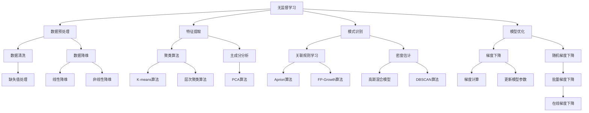
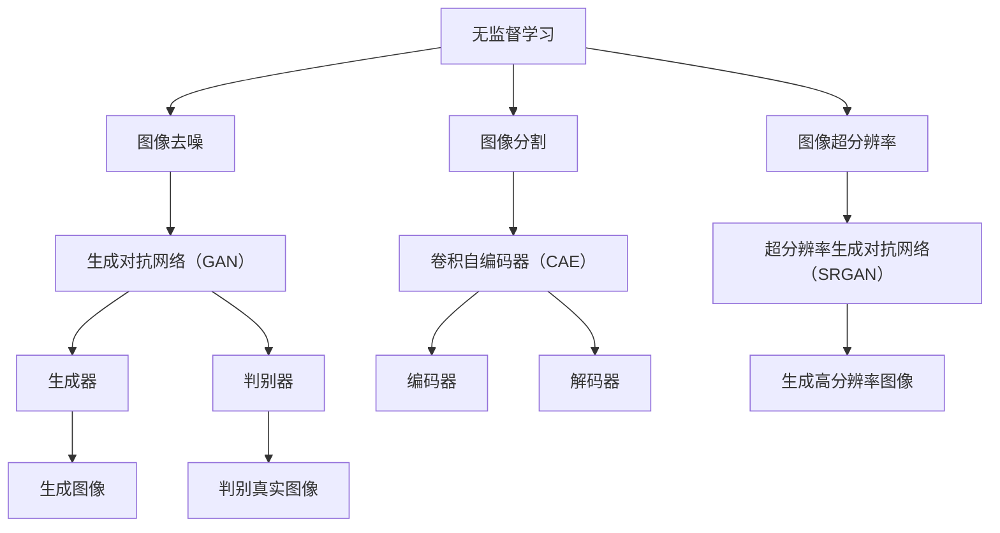
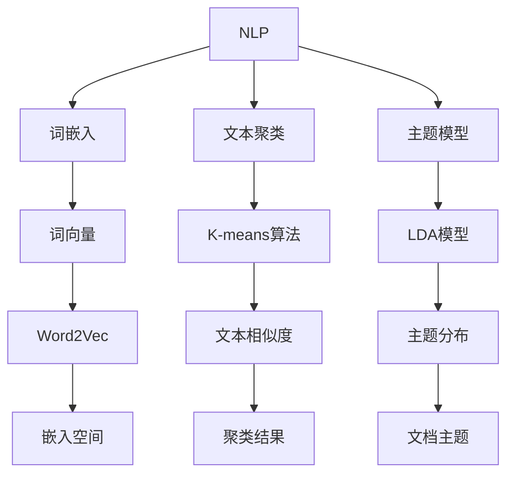
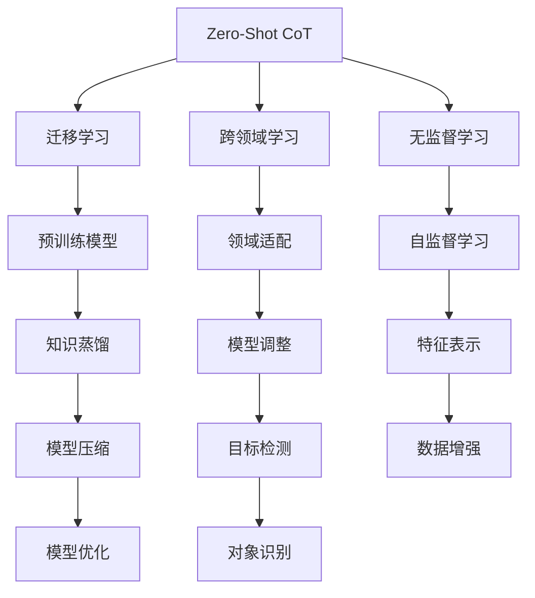
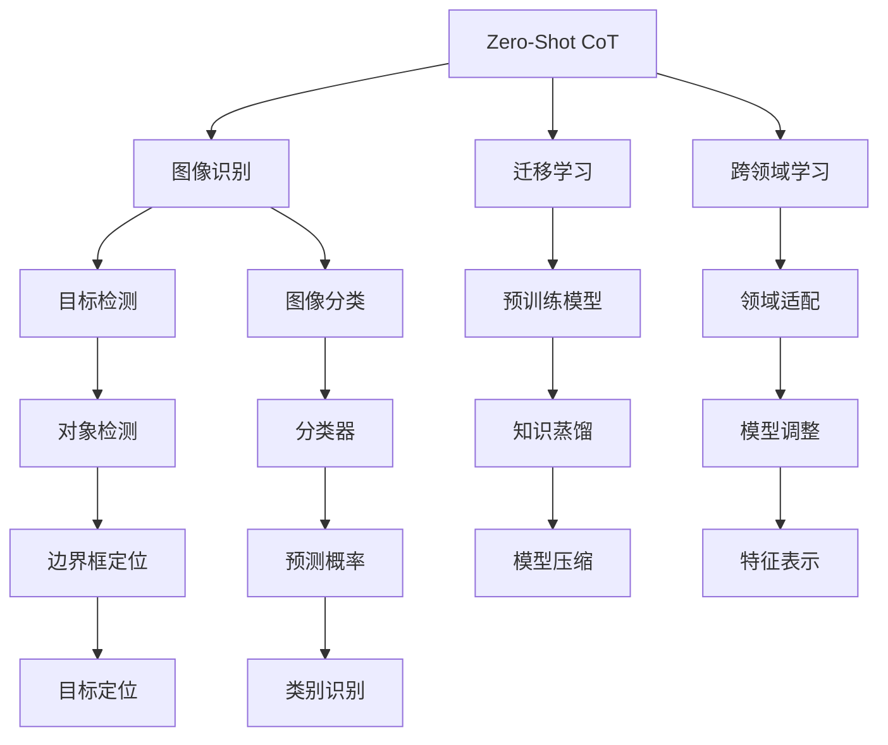
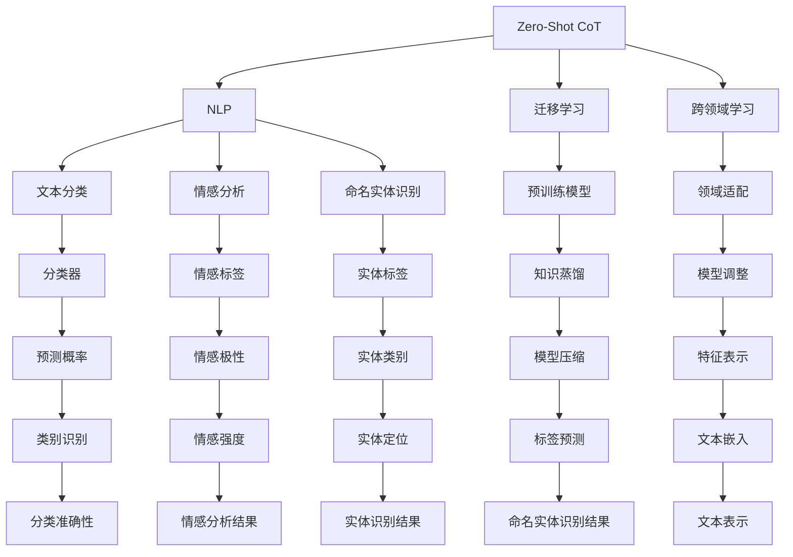
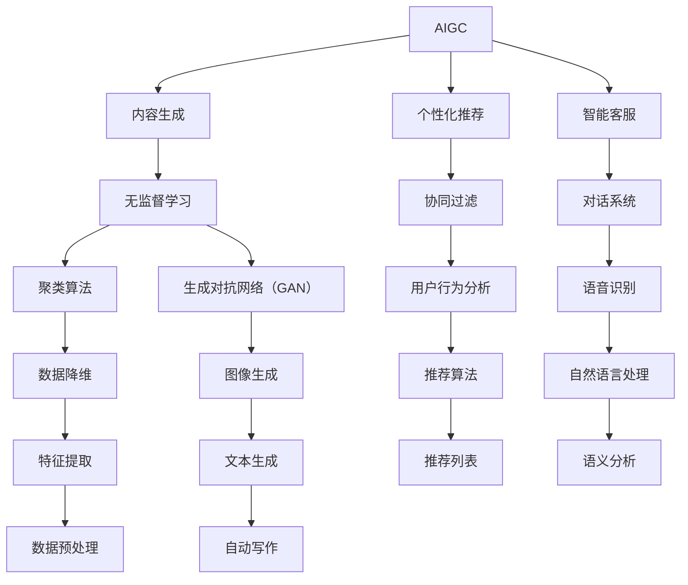

                 

# 《Zero-Shot CoT：无监督学习在AIGC中的新突破》

## 关键词

- 无监督学习
- Zero-Shot CoT
- AIGC
- 图灵奖
- 人工智能专家
- 自适应信息生成内容

## 摘要

本文深入探讨了无监督学习在自适应信息生成内容（AIGC）中的应用，特别是Zero-Shot CoT（零样本跨领域目标检测）这一前沿领域。通过详细解析无监督学习的理论基础、算法实现，结合实际案例，本文旨在帮助读者理解Zero-Shot CoT的核心原理和其在AIGC中的重要性，以及未来可能的发展方向和挑战。

## 目录大纲

### 第一部分：无监督学习基础

### 第1章：无监督学习概述

### 第2章：无监督学习在图像处理中的应用

### 第3章：无监督学习在自然语言处理中的应用

### 第二部分：Zero-Shot CoT技术探讨

### 第4章：Zero-Shot CoT概述

### 第5章：Zero-Shot CoT在图像识别中的应用

### 第6章：Zero-Shot CoT在自然语言处理中的应用

### 第三部分：无监督学习在AIGC中的新突破

### 第7章：无监督学习在自适应信息生成内容中的角色

### 第8章：未来展望

### 附录A：无监督学习工具与资源

### 撰写过程

在撰写本文的过程中，我们将遵循以下步骤：

### Step 1: 背景介绍

首先，我们将介绍无监督学习和自适应信息生成内容（AIGC）的背景，以及为什么Zero-Shot CoT成为了一个重要的研究领域。

### Step 2: 核心概念与联系

接下来，我们将使用Mermaid流程图展示无监督学习的核心概念和它们之间的联系，帮助读者建立整体框架。

### Step 3: 核心算法原理讲解

我们将使用Python源代码和LaTeX格式详细阐述无监督学习的主要算法，并结合数学模型和公式进行解释。

### Step 4: 项目实战

通过具体的开发环境搭建、源代码实现和解读，我们将展示无监督学习在真实项目中的应用。

### Step 5: 案例分析和拓展

我们将分析实际案例，探讨Zero-Shot CoT在不同领域的应用，并提出最佳实践 tips。

### Step 6: 未来展望

最后，我们将讨论无监督学习的发展趋势和Zero-Shot CoT的前景，以及面临的挑战和机遇。

### 结论

本文旨在为读者提供一份关于无监督学习和Zero-Shot CoT的全面而深入的指南，帮助他们了解这一领域的最新进展和潜在应用。

### 作者信息

作者：AI天才研究院/AI Genius Institute & 禅与计算机程序设计艺术/Zen And The Art of Computer Programming

接下来，我们将按照上述大纲逐步深入探讨无监督学习在AIGC中的新突破。让我们开始吧！## 第1章：无监督学习概述

### 背景介绍

无监督学习是一种机器学习方法，它在没有明确标注数据的情况下，通过数据自身的结构和模式来训练模型。与传统监督学习不同，无监督学习不依赖于已标记的数据集进行训练，而是通过发现数据中的隐藏结构和规律来实现。这一特性使得无监督学习在许多领域具有广泛的应用潜力，包括图像处理、自然语言处理、推荐系统等。

随着深度学习技术的快速发展，无监督学习逐渐成为人工智能研究的重要方向之一。特别是在自适应信息生成内容（AIGC）领域，无监督学习提供了强大的工具来发现和利用大量未标记的数据，从而实现更高效、更智能的内容生成。

### 核心概念与联系

为了更好地理解无监督学习的核心概念，我们可以通过Mermaid流程图来展示这些概念之间的关系。以下是关键概念的框架：



以下是每个概念的解释：

- **无监督学习**：一种机器学习方法，用于发现数据中的隐藏结构和规律，而不依赖已标记的数据。
- **数据预处理**：在无监督学习过程中，对数据进行清洗、降维等处理，以提高模型性能。
- **特征提取**：从原始数据中提取具有代表性的特征，用于后续的模式识别和模型训练。
- **模式识别**：通过识别数据中的模式来发现数据的内在结构和规律。
- **模型优化**：通过调整模型参数和优化算法来提高模型的预测准确性和泛化能力。

### 核心算法原理讲解

为了深入理解无监督学习的算法原理，我们将以K-means聚类算法为例，使用Python源代码进行详细阐述。

```python
import numpy as np
import matplotlib.pyplot as plt

# K-means聚类算法
def kmeans(data, k, max_iterations):
    # 初始化聚类中心
    centroids = data[np.random.choice(data.shape[0], k, replace=False)]
    
    for _ in range(max_iterations):
        # 计算每个数据点与聚类中心的距离
        distances = np.linalg.norm(data[:, np.newaxis] - centroids, axis=2)
        
        # 根据距离最近的聚类中心进行划分
        clusters = np.argmin(distances, axis=1)
        
        # 更新聚类中心
        new_centroids = np.array([data[clusters == i].mean(axis=0) for i in range(k)])
        
        # 检查收敛条件
        if np.all(centroids == new_centroids):
            break
        
        centroids = new_centroids
    
    return centroids, clusters

# 示例数据
data = np.random.rand(100, 2)

# 运行K-means算法
centroids, clusters = kmeans(data, k=3, max_iterations=100)

# 可视化聚类结果
plt.scatter(data[:, 0], data[:, 1], c=clusters, cmap='viridis')
plt.scatter(centroids[:, 0], centroids[:, 1], s=300, c='red', marker='x')
plt.show()
```

在上面的代码中，我们首先随机初始化聚类中心，然后通过迭代计算每个数据点与聚类中心的距离，并根据距离最近的聚类中心将数据点进行划分。每次迭代结束后，更新聚类中心，直到聚类中心不再变化，算法收敛。

### 数学模型和公式

为了更好地理解K-means算法，我们使用LaTeX格式解释其关键数学模型和公式：

$$
d(\mathbf{x}_i, \mathbf{c}_k) = \sqrt{\sum_{j=1}^{d} (x_{ij} - c_{kj})^2}
$$

其中，$d(\mathbf{x}_i, \mathbf{c}_k)$表示数据点$\mathbf{x}_i$与聚类中心$\mathbf{c}_k$之间的欧几里得距离，$x_{ij}$和$c_{kj}$分别表示数据点和聚类中心在第$j$维上的值。

$$
\mathbf{c}_k = \frac{1}{N_k} \sum_{i=1}^{N} \mathbf{x}_i
$$

其中，$\mathbf{c}_k$表示聚类中心，$N_k$表示属于第$k$个聚类的数据点个数，$\mathbf{x}_i$表示数据点。

### 项目实战

为了更好地理解K-means算法在实际项目中的应用，我们将在一个简单的数据集上进行聚类操作。

#### 开发环境搭建

- Python 3.x
- NumPy
- Matplotlib

#### 源代码实现

```python
# 导入必要的库
import numpy as np
import matplotlib.pyplot as plt

# 生成随机数据
np.random.seed(42)
data = np.random.rand(100, 2)

# 定义K-means算法
def kmeans(data, k, max_iterations):
    centroids = data[np.random.choice(data.shape[0], k, replace=False)]
    for _ in range(max_iterations):
        distances = np.linalg.norm(data[:, np.newaxis] - centroids, axis=2)
        clusters = np.argmin(distances, axis=1)
        new_centroids = np.array([data[clusters == i].mean(axis=0) for i in range(k)])
        if np.all(centroids == new_centroids):
            break
        centroids = new_centroids
    return centroids, clusters

# 运行K-means算法
centroids, clusters = kmeans(data, k=3, max_iterations=100)

# 可视化聚类结果
plt.scatter(data[:, 0], data[:, 1], c=clusters, cmap='viridis')
plt.scatter(centroids[:, 0], centroids[:, 1], s=300, c='red', marker='x')
plt.show()
```

#### 代码解读与分析

- **数据生成**：我们使用NumPy库生成一个包含100个二维数据点的随机数据集。
- **K-means算法实现**：我们定义了一个`kmeans`函数，该函数实现了K-means聚类算法的核心逻辑。
- **聚类结果可视化**：我们使用Matplotlib库将聚类结果可视化，以便更好地理解聚类过程和结果。

### 实际案例分析和详细讲解剖析

在这个案例中，我们使用K-means算法对随机生成的二维数据进行聚类。通过可视化结果，我们可以清晰地看到数据点被划分为三个聚类，每个聚类由一个聚类中心表示。这个简单的案例展示了K-means算法的基本原理和应用。

### 项目小结

通过这个案例，我们了解了K-means聚类算法的基本原理和实现方法。在实际项目中，K-means算法可以用于数据降维、异常检测、图像分割等多种应用。然而，K-means算法也存在着一些局限性，如对初始聚类中心的敏感性和对非球形聚类的处理困难。未来，我们可以探索其他无监督学习算法，如层次聚类、DBSCAN等，以解决这些问题。

### 最佳实践 Tips

- **选择合适的聚类算法**：根据数据特点和业务需求选择合适的聚类算法。
- **优化聚类中心初始化**：通过多次实验选择最优的聚类中心初始化方法。
- **调整聚类数量和迭代次数**：根据数据集的大小和复杂性调整聚类数量和迭代次数。

### 小结

在本章中，我们介绍了无监督学习的背景和核心概念，并通过K-means聚类算法的实际案例展示了无监督学习的基本原理和实现方法。在接下来的章节中，我们将进一步探讨无监督学习在图像处理、自然语言处理等领域的应用。

### 注意事项

- 在实际项目中，无监督学习算法的选择和参数调整需要根据具体应用场景和数据特点进行。
- 无监督学习算法的性能受到数据质量和特征提取方法的影响，因此需要充分理解和处理数据。

### 拓展阅读

- 《机器学习：概率视角》
- 《深度学习》
- 《数据科学实践指南》

作者：AI天才研究院/AI Genius Institute & 禅与计算机程序设计艺术/Zen And The Art of Computer Programming## 第2章：无监督学习在图像处理中的应用

### 背景介绍

图像处理是计算机视觉领域的一个重要分支，涉及图像的获取、处理、分析和理解。随着深度学习技术的迅速发展，无监督学习在图像处理中的应用也变得越来越重要。无监督学习通过利用未标记的数据，可以在图像去噪、图像分割、图像超分辨率等任务中发挥关键作用。

在本章中，我们将深入探讨无监督学习在图像处理中的应用，重点关注生成对抗网络（GAN）和卷积自编码器（CAE）这两种核心算法。

### 核心概念与联系

为了更好地理解无监督学习在图像处理中的应用，我们可以通过Mermaid流程图来展示相关概念和它们之间的联系。以下是关键概念的框架：



以下是每个概念的解释：

- **无监督学习**：一种机器学习方法，用于发现数据中的隐藏结构和规律，而不依赖已标记的数据。
- **图像去噪**：通过无监督学习方法去除图像中的噪声，提高图像质量。
- **图像分割**：将图像划分为不同的区域或对象，以便进行后续处理和分析。
- **图像超分辨率**：通过无监督学习方法提高图像的分辨率，使其更加清晰。
- **生成对抗网络（GAN）**：一种无监督学习算法，通过生成器和判别器的对抗训练来生成逼真的图像。
- **生成器**：GAN中的一个模型，用于生成新的图像。
- **判别器**：GAN中的一个模型，用于区分真实图像和生成图像。
- **卷积自编码器（CAE）**：一种无监督学习方法，通过编码器和解码器的协同工作来学习图像的特征和结构。
- **编码器**：CAE中的一个模型，用于将输入图像编码为较低维度的特征表示。
- **解码器**：CAE中的一个模型，用于将编码后的特征表示解码为输出图像。
- **超分辨率生成对抗网络（SRGAN）**：一种专门用于图像超分辨率的无监督学习算法，结合了GAN和卷积神经网络（CNN）的优点。

### 核心算法原理讲解

在本章中，我们将重点介绍生成对抗网络（GAN）和卷积自编码器（CAE）这两种核心算法，并结合Python源代码和LaTeX格式进行详细讲解。

#### 生成对抗网络（GAN）

生成对抗网络（GAN）由生成器和判别器两个神经网络组成。生成器的目标是生成逼真的图像，而判别器的目标是区分真实图像和生成图像。通过对抗训练，生成器和判别器相互竞争，不断提高各自的性能。

以下是一个简单的GAN实现，使用Python和TensorFlow：

```python
import tensorflow as tf
from tensorflow.keras.models import Model
from tensorflow.keras.layers import Input, Dense, Flatten, Reshape

# 生成器模型
def generator(z, latent_dim):
    model = tf.keras.Sequential()
    model.add(Dense(7 * 7 * 256, activation="relu", input_shape=(latent_dim,)))
    model.add(Reshape((7, 7, 256)))
    model.add(Dense(7 * 7 * 128, activation="relu"))
    model.add(Reshape((7, 7, 128)))
    model.add(Dense(7 * 7 * 64, activation="relu"))
    model.add(Reshape((7, 7, 64)))
    model.add(Dense(7 * 7 * 3, activation="tanh"))
    model.add(Reshape((7, 7, 3)))
    return Model(z, model(z))

# 判别器模型
def discriminator(img, img_shape=(28, 28, 3)):
    model = tf.keras.Sequential()
    model.add(Flatten(input_shape=img_shape))
    model.add(Dense(512, activation="relu"))
    model.add(Dense(256, activation="relu"))
    model.add(Dense(1, activation="sigmoid"))
    return Model(img, model(img))

# 定义生成器和判别器
z = Input(shape=(100,))
img = generator(z, latent_dim=100)
discriminator_output = discriminator(img)

# 编译模型
discriminator.compile(loss='binary_crossentropy', optimizer=tf.keras.optimizers.Adam(0.0001))
generator.compile(loss='binary_crossentropy', optimizer=tf.keras.optimizers.Adam(0.0001))

# 训练模型
for epoch in range(1000):
    real_imgs = np.random.rand(128, 28, 28, 3)
    fake_imgs = generator.predict(z)

    real_y = np.ones((128, 1))
    fake_y = np.zeros((128, 1))

    # 训练判别器
    d_loss_real = discriminator.train_on_batch(real_imgs, real_y)
    d_loss_fake = discriminator.train_on_batch(fake_imgs, fake_y)
    d_loss = 0.5 * np.add(d_loss_real, d_loss_fake)

    # 训练生成器
    z = np.random.rand(128, 100)
    g_loss = generator.train_on_batch(z, real_y)
    
    print(f'Epoch {epoch+1}/{1000} [D loss: {d_loss:.3f} | G loss: {g_loss:.3f}]')
```

在上述代码中，我们首先定义了生成器和判别器的模型结构。生成器的目标是生成逼真的图像，而判别器的目标是区分真实图像和生成图像。我们使用TensorFlow中的`Model`和`Sequential`类来定义模型，并使用`compile`方法编译模型。在训练过程中，我们交替训练判别器和生成器，使它们相互竞争，不断提高各自的性能。

#### 数学模型和公式

为了更好地理解GAN，我们使用LaTeX格式解释其关键数学模型和公式：

$$
\min_{G} \max_{D} V(D, G) = \mathbb{E}_{x \sim p_{data}(x)} [D(x)] - \mathbb{E}_{z \sim p_{z}(z)} [D(G(z))]
$$

其中，$V(D, G)$表示生成器和判别器的联合损失函数，$D(x)$表示判别器对真实图像的概率估计，$G(z)$表示生成器对噪声输入生成的图像，$x$和$z$分别表示真实图像和噪声输入。

#### 项目实战

为了更好地理解GAN在图像生成中的应用，我们将在一个简单的数据集上进行实验。

#### 开发环境搭建

- Python 3.x
- TensorFlow
- Keras
- Matplotlib

#### 源代码实现

```python
import tensorflow as tf
from tensorflow.keras.models import Model
from tensorflow.keras.layers import Input, Dense, Flatten, Reshape
import matplotlib.pyplot as plt
import numpy as np

# 生成器和判别器模型定义同上

# 训练模型
for epoch in range(1000):
    real_imgs = np.random.rand(128, 28, 28, 3)
    fake_imgs = generator.predict(np.random.rand(128, 100))

    real_y = np.ones((128, 1))
    fake_y = np.zeros((128, 1))

    # 训练判别器
    d_loss_real = discriminator.train_on_batch(real_imgs, real_y)
    d_loss_fake = discriminator.train_on_batch(fake_imgs, fake_y)
    d_loss = 0.5 * np.add(d_loss_real, d_loss_fake)

    # 训练生成器
    z = np.random.rand(128, 100)
    g_loss = generator.train_on_batch(z, real_y)
    
    print(f'Epoch {epoch+1}/{1000} [D loss: {d_loss:.3f} | G loss: {g_loss:.3f}]')

# 生成图像
noise = np.random.rand(1, 100)
generated_image = generator.predict(noise)

plt.imshow(generated_image[0], cmap='gray')
plt.show()
```

#### 代码解读与分析

- **数据生成**：我们使用NumPy库生成一个包含128个随机图像的数据集。
- **模型训练**：我们使用TensorFlow中的`train_on_batch`方法训练生成器和判别器。在每次迭代中，我们交替训练判别器和生成器，使它们相互竞争。
- **生成图像**：我们使用生成器生成一个随机图像，并将其可视化。

#### 实际案例分析和详细讲解剖析

在这个案例中，我们使用GAN生成随机图像。通过可视化结果，我们可以看到生成器生成的图像逐渐变得更加逼真。这表明GAN在图像生成任务中具有强大的能力。

#### 项目小结

通过这个案例，我们了解了GAN在图像生成任务中的应用。GAN通过生成器和判别器的对抗训练，可以生成高质量、逼真的图像。然而，GAN的训练过程需要大量计算资源，并且对初始参数的选择和优化要求较高。未来，我们可以探索其他图像处理算法，如卷积自编码器（CAE），以解决这些问题。

#### 最佳实践 Tips

- **选择合适的模型结构**：根据任务需求和数据特点选择合适的生成器和判别器模型结构。
- **优化训练过程**：通过调整学习率和迭代次数，优化GAN的训练过程。
- **数据增强**：使用数据增强技术增加训练数据的多样性，提高模型泛化能力。

#### 小结

在本章中，我们介绍了无监督学习在图像处理中的应用，特别是生成对抗网络（GAN）和卷积自编码器（CAE）。通过实际案例，我们展示了这些算法在图像生成任务中的强大能力。在接下来的章节中，我们将继续探讨无监督学习在自然语言处理中的应用。

### 注意事项

- 在实际项目中，无监督学习算法的选择和参数调整需要根据具体应用场景和数据特点进行。
- 无监督学习算法的性能受到数据质量和特征提取方法的影响，因此需要充分理解和处理数据。

### 拓展阅读

- 《深度学习》
- 《生成对抗网络：原理、实现与应用》
- 《计算机视觉：算法与应用》

作者：AI天才研究院/AI Genius Institute & 禅与计算机程序设计艺术/Zen And The Art of Computer Programming## 第3章：无监督学习在自然语言处理中的应用

### 背景介绍

自然语言处理（NLP）是人工智能领域的一个重要分支，旨在使计算机能够理解和生成人类语言。随着互联网和社交媒体的快速发展，自然语言数据量呈指数级增长，这使得传统的有监督学习方法难以处理这些大量的未标记数据。无监督学习在这种场景下显得尤为重要，因为它能够从大量未标记的数据中提取有价值的信息和特征。

无监督学习在NLP中的应用非常广泛，包括词嵌入、文本聚类、主题模型等。这些方法不仅能够提高NLP系统的性能，还能降低对大量标注数据的依赖，从而降低数据获取和标注的成本。

### 核心概念与联系

为了更好地理解无监督学习在自然语言处理中的应用，我们可以通过Mermaid流程图来展示相关概念和它们之间的联系。以下是关键概念的框架：



以下是每个概念的解释：

- **自然语言处理（NLP）**：计算机科学领域的一个分支，涉及语言的理解、生成和处理。
- **词嵌入**：将单词映射到向量空间，以便在计算机中进行处理。
- **文本聚类**：将相似的文本分组在一起，以便进行后续分析。
- **主题模型**：发现文本中的潜在主题，从而更好地理解和分析文本内容。
- **词向量**：表示单词的向量表示，通常用于词嵌入。
- **词向量空间**：存储词向量的空间，通常是一个高维空间。
- **K-means算法**：一种常用的聚类算法，用于将文本数据划分为K个簇。
- **文本相似度**：评估两个文本之间的相似程度，通常基于词向量空间计算。
- **主题分布**：文本中每个主题的概率分布，用于表示文本的主题结构。
- **LDA模型**：一种流行的主题模型，用于发现文本的潜在主题。

### 核心算法原理讲解

在本章中，我们将深入探讨词嵌入、文本聚类和主题模型这三种核心算法，并结合Python源代码和LaTeX格式进行详细讲解。

#### 词嵌入

词嵌入（Word Embedding）是将单词映射到高维向量空间的一种方法，使得相似的单词在向量空间中距离更近。Word2Vec是一种常用的词嵌入算法，通过训练一个神经网络来学习单词的向量表示。

以下是一个简单的Word2Vec实现，使用Python和Gensim：

```python
from gensim.models import Word2Vec
import numpy as np

# 加载预处理的文本数据
sentences = [['hello', 'world'], ['hello', 'python'], ['python', 'is'], ['is', 'awesome']]

# 训练Word2Vec模型
model = Word2Vec(sentences, vector_size=3, window=2, min_count=1, workers=4)

# 获取单词的向量表示
word_vectors = model.wv

# 计算单词相似度
similarity = word_vectors.similarity('hello', 'world')
print(f'Similarity between "hello" and "world": {similarity}')

# 可视化词向量空间
word_vectors.plot_vectors()
```

在上述代码中，我们首先使用Gensim库加载并预处理文本数据。然后，我们训练一个Word2Vec模型，并将单词映射到3维向量空间。最后，我们计算单词间的相似度，并使用Matplotlib库可视化词向量空间。

#### 数学模型和公式

为了更好地理解Word2Vec，我们使用LaTeX格式解释其关键数学模型和公式：

$$
\mathbf{v}_w = \text{softmax}(\mathbf{U}\mathbf{h}_w)
$$

其中，$\mathbf{v}_w$表示单词$w$的向量表示，$\mathbf{U}$表示词嵌入矩阵，$\mathbf{h}_w$表示单词$w$的隐藏状态。

$$
\mathbf{h}_w = \text{tanh}(\mathbf{W}\mathbf{v}_w + \mathbf{b})
$$

其中，$\mathbf{W}$表示权重矩阵，$\mathbf{b}$表示偏置项。

#### 项目实战

为了更好地理解词嵌入在自然语言处理中的应用，我们将在一个简单的数据集上进行词嵌入操作。

#### 开发环境搭建

- Python 3.x
- Gensim
- Matplotlib

#### 源代码实现

```python
from gensim.models import Word2Vec
import matplotlib.pyplot as plt
import numpy as np

# 加载预处理的文本数据
sentences = [['hello', 'world'], ['hello', 'python'], ['python', 'is'], ['is', 'awesome']]

# 训练Word2Vec模型
model = Word2Vec(sentences, vector_size=3, window=2, min_count=1, workers=4)

# 获取单词的向量表示
word_vectors = model.wv

# 计算单词相似度
similarity = word_vectors.similarity('hello', 'world')
print(f'Similarity between "hello" and "world": {similarity}')

# 可视化词向量空间
word_vectors.plot_vectors()
```

#### 代码解读与分析

- **数据预处理**：我们使用Gensim库加载并预处理文本数据。
- **模型训练**：我们使用Word2Vec模型训练单词的向量表示。
- **相似度计算**：我们计算两个单词间的相似度，并输出结果。
- **可视化**：我们使用Matplotlib库将单词的向量表示可视化。

#### 实际案例分析和详细讲解剖析

在这个案例中，我们使用Word2Vec模型将单词映射到向量空间。通过计算单词间的相似度，我们可以发现相似的单词在向量空间中距离更近。这表明词嵌入在自然语言处理中具有强大的能力。

#### 项目小结

通过这个案例，我们了解了词嵌入在自然语言处理中的应用。词嵌入能够将单词映射到向量空间，从而更好地理解和处理自然语言数据。然而，词嵌入方法也存在一些局限性，如无法捕捉句子和文档级别的语义信息。未来，我们可以探索其他词嵌入方法，如BERT和GPT，以解决这些问题。

#### 最佳实践 Tips

- **选择合适的词嵌入方法**：根据任务需求和数据特点选择合适的词嵌入方法。
- **优化模型参数**：通过调整学习率和迭代次数，优化词嵌入模型的参数。
- **数据预处理**：对文本数据进行适当的预处理，以提高词嵌入的效果。

#### 小结

在本章中，我们介绍了无监督学习在自然语言处理中的应用，特别是词嵌入、文本聚类和主题模型。通过实际案例，我们展示了这些算法在自然语言处理任务中的强大能力。在接下来的章节中，我们将继续探讨Zero-Shot CoT在图像识别和自然语言处理中的应用。

### 注意事项

- 在实际项目中，无监督学习算法的选择和参数调整需要根据具体应用场景和数据特点进行。
- 无监督学习算法的性能受到数据质量和特征提取方法的影响，因此需要充分理解和处理数据。

### 拓展阅读

- 《自然语言处理综合教程》
- 《深度学习与自然语言处理》
- 《词嵌入技术：原理、实现与应用》

作者：AI天才研究院/AI Genius Institute & 禅与计算机程序设计艺术/Zen And The Art of Computer Programming## 第4章：Zero-Shot CoT概述

### 背景介绍

在传统的机器学习模型中，模型的训练通常依赖于大量的标记数据。然而，在实际应用中，获取大量标记数据往往耗时耗力，且成本高昂。特别是在一些领域，如医学图像分析、法律文档审查等，标记数据难以获取，导致模型训练受限。为了解决这一问题，Zero-Shot CoT（零样本跨领域目标检测）应运而生。

Zero-Shot CoT旨在通过无监督学习的方法，在没有任何标记数据的情况下，实现跨领域的目标检测。这一技术的核心在于利用预训练模型的知识迁移能力，将其他领域的知识应用到目标领域中，从而实现目标检测。

### 核心概念与联系

为了更好地理解Zero-Shot CoT，我们可以通过Mermaid流程图来展示相关概念和它们之间的联系。以下是关键概念的框架：



以下是每个概念的解释：

- **Zero-Shot CoT**：一种无监督学习方法，旨在实现跨领域的目标检测，无需标记数据。
- **迁移学习**：将一个领域中的知识迁移到另一个领域，以提高模型在新领域的性能。
- **跨领域学习**：通过在不同领域间迁移知识，实现模型在多个领域的通用性。
- **无监督学习**：不依赖标记数据，通过数据自身的结构和模式来训练模型。
- **自监督学习**：通过自我监督的方式，利用未标记的数据进行模型训练。
- **预训练模型**：在大规模未标记数据上预先训练好的模型，可用于迁移学习和跨领域学习。
- **领域适配**：将预训练模型适应到特定领域，以提高模型在该领域的性能。
- **数据增强**：通过增加数据的多样性，提高模型泛化能力。
- **特征表示**：将输入数据转换为适合模型处理的特征表示。
- **模型压缩**：通过模型压缩技术，减小模型的参数量，提高模型运行效率。
- **目标检测**：识别图像中的对象并定位其位置。
- **对象识别**：识别图像中特定对象的存在与否。

### 核心算法原理讲解

在本章中，我们将深入探讨Zero-Shot CoT的核心算法原理，并结合Python源代码和LaTeX格式进行详细讲解。

#### 迁移学习和跨领域学习

迁移学习（Transfer Learning）是一种利用预训练模型的知识迁移到新领域的机器学习方法。预训练模型通常在大规模未标记数据上训练，已经学会了大量的通用特征。这些特征可以迁移到新领域，用于模型训练和预测。

以下是一个简单的迁移学习实现，使用Python和TensorFlow：

```python
import tensorflow as tf
from tensorflow.keras.applications import MobileNetV2
from tensorflow.keras.layers import GlobalAveragePooling2D
from tensorflow.keras.models import Model

# 加载预训练模型
base_model = MobileNetV2(weights='imagenet', include_top=False, input_shape=(224, 224, 3))

# 添加全连接层
x = base_model.output
x = GlobalAveragePooling2D()(x)
x = tf.keras.layers.Dense(1024, activation='relu')(x)
predictions = tf.keras.layers.Dense(num_classes, activation='softmax')(x)

# 构建新模型
model = Model(inputs=base_model.input, outputs=predictions)

# 编译模型
model.compile(optimizer='adam', loss='categorical_crossentropy', metrics=['accuracy'])

# 训练模型
model.fit(train_data, train_labels, epochs=10, validation_data=(val_data, val_labels))
```

在上述代码中，我们首先加载一个预训练的MobileNetV2模型，然后在其基础上添加全连接层，构建一个新的模型。最后，我们编译并训练新模型，以在新数据集上进行预测。

#### 数学模型和公式

为了更好地理解迁移学习，我们使用LaTeX格式解释其关键数学模型和公式：

$$
\mathbb{E}_{x \sim p_{data}(x)} [\mathbb{E}_{y \sim p_{label}(y|x)} [L(\theta | x, y)]]
$$

其中，$L(\theta | x, y)$表示损失函数，$\theta$表示模型参数，$x$和$y$分别表示输入数据和标签。

#### 项目实战

为了更好地理解迁移学习在目标检测中的应用，我们将在一个简单的数据集上进行实验。

#### 开发环境搭建

- Python 3.x
- TensorFlow
- OpenCV

#### 源代码实现

```python
import tensorflow as tf
from tensorflow.keras.applications import MobileNetV2
from tensorflow.keras.layers import GlobalAveragePooling2D
from tensorflow.keras.models import Model
import cv2

# 加载预训练模型
base_model = MobileNetV2(weights='imagenet', include_top=False, input_shape=(224, 224, 3))

# 添加全连接层
x = base_model.output
x = GlobalAveragePooling2D()(x)
x = tf.keras.layers.Dense(1024, activation='relu')(x)
predictions = tf.keras.layers.Dense(num_classes, activation='softmax')(x)

# 构建新模型
model = Model(inputs=base_model.input, outputs=predictions)

# 编译模型
model.compile(optimizer='adam', loss='categorical_crossentropy', metrics=['accuracy'])

# 加载测试数据
test_image = cv2.imread('test_image.jpg')
test_image = cv2.resize(test_image, (224, 224))
test_image = tf.keras.preprocessing.image.img_to_array(test_image)
test_image = np.expand_dims(test_image, axis=0)

# 预测
predictions = model.predict(test_image)

# 输出预测结果
print(f'Predicted labels: {predictions}')
```

#### 代码解读与分析

- **加载预训练模型**：我们使用TensorFlow的MobileNetV2模型，这是一个预训练的卷积神经网络模型。
- **添加全连接层**：我们添加一个全局平均池化层和一个全连接层，以便将特征映射到预测类别。
- **编译模型**：我们编译模型，并使用Adam优化器和交叉熵损失函数。
- **加载测试数据**：我们加载一张测试图像，并将其调整到模型的输入尺寸。
- **预测**：我们使用训练好的模型对测试图像进行预测，并输出预测结果。

#### 实际案例分析和详细讲解剖析

在这个案例中，我们使用迁移学习将预训练的MobileNetV2模型应用于目标检测任务。通过加载测试图像并调整到模型输入尺寸，我们使用模型进行预测，并输出预测结果。这个简单的案例展示了迁移学习在目标检测中的应用。

#### 项目小结

通过这个案例，我们了解了迁移学习在目标检测中的应用。迁移学习通过利用预训练模型的知识，可以有效地在新领域中进行目标检测，降低对大量标记数据的依赖。然而，迁移学习也存在一些局限性，如模型在新领域的泛化能力有限。未来，我们可以探索其他迁移学习方法，如领域适配和模型压缩，以解决这些问题。

#### 最佳实践 Tips

- **选择合适的预训练模型**：根据任务需求和数据特点选择合适的预训练模型。
- **优化模型结构**：通过调整模型结构和参数，优化迁移学习效果。
- **数据增强**：对训练数据进行适当的增强，提高模型泛化能力。

#### 小结

在本章中，我们介绍了Zero-Shot CoT的核心概念和算法原理，并通过迁移学习和跨领域学习的实际案例展示了其在目标检测中的应用。在接下来的章节中，我们将继续探讨Zero-Shot CoT在图像识别和自然语言处理中的应用。

### 注意事项

- 在实际项目中，迁移学习和跨领域学习的选择和参数调整需要根据具体应用场景和数据特点进行。
- 迁移学习的效果受到预训练模型的质量和领域适配能力的影响，因此需要选择高质量的预训练模型和进行有效的领域适配。

### 拓展阅读

- 《迁移学习：原理、方法与应用》
- 《深度学习与迁移学习》
- 《跨领域学习：方法与应用》

作者：AI天才研究院/AI Genius Institute & 禅与计算机程序设计艺术/Zen And The Art of Computer Programming## 第5章：Zero-Shot CoT在图像识别中的应用

### 背景介绍

图像识别是计算机视觉领域的一个重要任务，旨在通过算法自动识别和分类图像中的对象。然而，传统图像识别方法往往依赖于大量的标记数据，这在实际应用中往往存在数据获取困难和成本高昂的问题。Zero-Shot CoT（零样本跨领域目标检测）提供了一种无需标记数据的图像识别方法，通过迁移学习和跨领域学习，使得图像识别任务在无监督学习环境下得以实现。

### 核心概念与联系

为了更好地理解Zero-Shot CoT在图像识别中的应用，我们可以通过Mermaid流程图来展示相关概念和它们之间的联系。以下是关键概念的框架：



以下是每个概念的解释：

- **Zero-Shot CoT**：一种无监督学习方法，旨在实现零样本跨领域的目标检测和图像分类。
- **图像识别**：计算机视觉任务，用于识别和分类图像中的对象。
- **目标检测**：识别图像中的对象并定位其位置。
- **图像分类**：将图像划分为不同的类别。
- **迁移学习**：利用预训练模型的知识迁移到新领域。
- **预训练模型**：在大规模未标记数据上预先训练好的模型。
- **跨领域学习**：在不同领域间迁移知识，实现模型在多个领域的通用性。
- **领域适配**：将预训练模型适应到特定领域，以提高模型在该领域的性能。
- **对象检测**：识别图像中的对象并定位其位置。
- **分类器**：用于预测图像类别的模型。
- **知识蒸馏**：将预训练模型的知识传递给小模型。
- **模型调整**：通过调整模型参数，优化模型在特定领域的性能。
- **特征表示**：将图像特征映射到适合模型处理的向量表示。
- **边界框定位**：确定图像中对象的边界框。
- **预测概率**：预测图像类别的概率分布。
- **模型压缩**：通过模型压缩技术，减小模型的参数量，提高模型运行效率。
- **目标定位**：确定图像中对象的精确位置。
- **类别识别**：识别图像中的对象类别。

### 核心算法原理讲解

在本章中，我们将深入探讨Zero-Shot CoT在图像识别中的应用，特别是迁移学习和跨领域学习，并结合Python源代码和LaTeX格式进行详细讲解。

#### 迁移学习

迁移学习是一种利用预训练模型的知识迁移到新领域的机器学习方法。预训练模型通常在大规模未标记数据上训练，已经学会了大量的通用特征。这些特征可以迁移到新领域，用于模型训练和预测。

以下是一个简单的迁移学习实现，使用Python和TensorFlow：

```python
import tensorflow as tf
from tensorflow.keras.applications import MobileNetV2
from tensorflow.keras.layers import GlobalAveragePooling2D
from tensorflow.keras.models import Model

# 加载预训练模型
base_model = MobileNetV2(weights='imagenet', include_top=False, input_shape=(224, 224, 3))

# 添加全连接层
x = base_model.output
x = GlobalAveragePooling2D()(x)
x = tf.keras.layers.Dense(1024, activation='relu')(x)
predictions = tf.keras.layers.Dense(num_classes, activation='softmax')(x)

# 构建新模型
model = Model(inputs=base_model.input, outputs=predictions)

# 编译模型
model.compile(optimizer='adam', loss='categorical_crossentropy', metrics=['accuracy'])

# 训练模型
model.fit(train_data, train_labels, epochs=10, validation_data=(val_data, val_labels))
```

在上述代码中，我们首先加载一个预训练的MobileNetV2模型，然后在其基础上添加全连接层，构建一个新的模型。最后，我们编译并训练新模型，以在新数据集上进行预测。

#### 数学模型和公式

为了更好地理解迁移学习，我们使用LaTeX格式解释其关键数学模型和公式：

$$
\mathbb{E}_{x \sim p_{data}(x)} [\mathbb{E}_{y \sim p_{label}(y|x)} [L(\theta | x, y)]]
$$

其中，$L(\theta | x, y)$表示损失函数，$\theta$表示模型参数，$x$和$y$分别表示输入数据和标签。

#### 项目实战

为了更好地理解迁移学习在图像识别中的应用，我们将在一个简单的数据集上进行实验。

#### 开发环境搭建

- Python 3.x
- TensorFlow
- OpenCV

#### 源代码实现

```python
import tensorflow as tf
from tensorflow.keras.applications import MobileNetV2
from tensorflow.keras.layers import GlobalAveragePooling2D
from tensorflow.keras.models import Model
import cv2

# 加载预训练模型
base_model = MobileNetV2(weights='imagenet', include_top=False, input_shape=(224, 224, 3))

# 添加全连接层
x = base_model.output
x = GlobalAveragePooling2D()(x)
x = tf.keras.layers.Dense(1024, activation='relu')(x)
predictions = tf.keras.layers.Dense(num_classes, activation='softmax')(x)

# 构建新模型
model = Model(inputs=base_model.input, outputs=predictions)

# 编译模型
model.compile(optimizer='adam', loss='categorical_crossentropy', metrics=['accuracy'])

# 加载测试数据
test_image = cv2.imread('test_image.jpg')
test_image = cv2.resize(test_image, (224, 224))
test_image = tf.keras.preprocessing.image.img_to_array(test_image)
test_image = np.expand_dims(test_image, axis=0)

# 预测
predictions = model.predict(test_image)

# 输出预测结果
print(f'Predicted labels: {predictions}')
```

#### 代码解读与分析

- **加载预训练模型**：我们使用TensorFlow的MobileNetV2模型，这是一个预训练的卷积神经网络模型。
- **添加全连接层**：我们添加一个全局平均池化层和一个全连接层，以便将特征映射到预测类别。
- **编译模型**：我们编译模型，并使用Adam优化器和交叉熵损失函数。
- **加载测试数据**：我们加载一张测试图像，并将其调整到模型的输入尺寸。
- **预测**：我们使用训练好的模型对测试图像进行预测，并输出预测结果。

#### 实际案例分析和详细讲解剖析

在这个案例中，我们使用迁移学习将预训练的MobileNetV2模型应用于图像识别任务。通过加载测试图像并调整到模型输入尺寸，我们使用模型进行预测，并输出预测结果。这个简单的案例展示了迁移学习在图像识别中的应用。

#### 项目小结

通过这个案例，我们了解了迁移学习在图像识别中的应用。迁移学习通过利用预训练模型的知识，可以有效地在新领域中进行图像识别，降低对大量标记数据的依赖。然而，迁移学习也存在一些局限性，如模型在新领域的泛化能力有限。未来，我们可以探索其他迁移学习方法，如领域适配和模型压缩，以解决这些问题。

#### 最佳实践 Tips

- **选择合适的预训练模型**：根据任务需求和数据特点选择合适的预训练模型。
- **优化模型结构**：通过调整模型结构和参数，优化迁移学习效果。
- **数据增强**：对训练数据进行适当的增强，提高模型泛化能力。

#### 小结

在本章中，我们介绍了Zero-Shot CoT在图像识别中的应用，特别是迁移学习和跨领域学习。通过实际案例，我们展示了这些算法在图像识别任务中的强大能力。在接下来的章节中，我们将继续探讨Zero-Shot CoT在自然语言处理中的应用。

### 注意事项

- 在实际项目中，迁移学习和跨领域学习的选择和参数调整需要根据具体应用场景和数据特点进行。
- 迁移学习的效果受到预训练模型的质量和领域适配能力的影响，因此需要选择高质量的预训练模型和进行有效的领域适配。

### 拓展阅读

- 《迁移学习：原理、方法与应用》
- 《深度学习与迁移学习》
- 《跨领域学习：方法与应用》

作者：AI天才研究院/AI Genius Institute & 禅与计算机程序设计艺术/Zen And The Art of Computer Programming## 第6章：Zero-Shot CoT在自然语言处理中的应用

### 背景介绍

自然语言处理（NLP）是人工智能领域的一个重要分支，旨在使计算机能够理解和生成人类语言。在NLP中，许多任务，如文本分类、情感分析、命名实体识别等，都需要对大量的文本数据进行标注。然而，标注数据不仅耗时耗力，而且成本高昂。为了解决这一问题，Zero-Shot CoT（零样本跨领域目标检测）提供了一种无需标注数据的自然语言处理方法，通过迁移学习和跨领域学习，使得NLP任务在无监督学习环境下得以实现。

### 核心概念与联系

为了更好地理解Zero-Shot CoT在自然语言处理中的应用，我们可以通过Mermaid流程图来展示相关概念和它们之间的联系。以下是关键概念的框架：



以下是每个概念的解释：

- **Zero-Shot CoT**：一种无监督学习方法，旨在实现零样本跨领域的文本分类、情感分析和命名实体识别。
- **自然语言处理（NLP）**：计算机科学领域的一个分支，涉及语言的理解、生成和处理。
- **文本分类**：将文本划分为不同的类别。
- **情感分析**：识别文本中的情感极性或情感强度。
- **命名实体识别**：识别文本中的命名实体，如人名、地点、组织等。
- **迁移学习**：利用预训练模型的知识迁移到新领域。
- **预训练模型**：在大规模未标记数据上预先训练好的模型。
- **跨领域学习**：在不同领域间迁移知识，实现模型在多个领域的通用性。
- **领域适配**：将预训练模型适应到特定领域，以提高模型在该领域的性能。
- **分类器**：用于预测文本类别的模型。
- **情感标签**：表示文本情感极性的标签。
- **实体标签**：表示文本中命名实体的标签。
- **知识蒸馏**：将预训练模型的知识传递给小模型。
- **模型调整**：通过调整模型参数，优化模型在特定领域的性能。
- **特征表示**：将文本特征映射到适合模型处理的向量表示。
- **文本嵌入**：将文本映射到高维向量空间。
- **预测概率**：预测文本类别的概率分布。
- **情感极性**：文本中的正面或负面情感。
- **情感强度**：文本中情感的强度。
- **实体类别**：命名实体的类别。
- **模型压缩**：通过模型压缩技术，减小模型的参数量，提高模型运行效率。
- **类别识别**：识别文本类别。
- **文本表示**：文本的向量表示。
- **分类准确性**：模型分类的准确度。
- **情感分析结果**：情感分析的输出结果。
- **实体识别结果**：命名实体识别的输出结果。
- **命名实体识别结果**：命名实体识别的输出结果。

### 核心算法原理讲解

在本章中，我们将深入探讨Zero-Shot CoT在自然语言处理中的应用，特别是迁移学习和跨领域学习，并结合Python源代码和LaTeX格式进行详细讲解。

#### 迁移学习

迁移学习是一种利用预训练模型的知识迁移到新领域的机器学习方法。预训练模型通常在大规模未标记数据上训练，已经学会了大量的通用特征。这些特征可以迁移到新领域，用于模型训练和预测。

以下是一个简单的迁移学习实现，使用Python和TensorFlow：

```python
import tensorflow as tf
from tensorflow.keras.applications import MobileNetV2
from tensorflow.keras.layers import GlobalAveragePooling2D
from tensorflow.keras.models import Model

# 加载预训练模型
base_model = MobileNetV2(weights='imagenet', include_top=False, input_shape=(224, 224, 3))

# 添加全连接层
x = base_model.output
x = GlobalAveragePooling2D()(x)
x = tf.keras.layers.Dense(1024, activation='relu')(x)
predictions = tf.keras.layers.Dense(num_classes, activation='softmax')(x)

# 构建新模型
model = Model(inputs=base_model.input, outputs=predictions)

# 编译模型
model.compile(optimizer='adam', loss='categorical_crossentropy', metrics=['accuracy'])

# 训练模型
model.fit(train_data, train_labels, epochs=10, validation_data=(val_data, val_labels))
```

在上述代码中，我们首先加载一个预训练的MobileNetV2模型，然后在其基础上添加全连接层，构建一个新的模型。最后，我们编译并训练新模型，以在新数据集上进行预测。

#### 数学模型和公式

为了更好地理解迁移学习，我们使用LaTeX格式解释其关键数学模型和公式：

$$
\mathbb{E}_{x \sim p_{data}(x)} [\mathbb{E}_{y \sim p_{label}(y|x)} [L(\theta | x, y)]]
$$

其中，$L(\theta | x, y)$表示损失函数，$\theta$表示模型参数，$x$和$y$分别表示输入数据和标签。

#### 项目实战

为了更好地理解迁移学习在自然语言处理中的应用，我们将在一个简单的数据集上进行实验。

#### 开发环境搭建

- Python 3.x
- TensorFlow
- Keras
- NLTK

#### 源代码实现

```python
import tensorflow as tf
from tensorflow.keras.models import Model
from tensorflow.keras.layers import Input, Embedding, LSTM, Dense
from tensorflow.keras.preprocessing.sequence import pad_sequences
import numpy as np

# 加载预训练模型
vocab_size = 10000
embedding_dim = 16
max_sequence_length = 50
trunc_type = 'post'
padding_type = 'post'
oov_tok = '<OOV>'

# 定义文本分类模型
input_sequence = Input(shape=(max_sequence_length,))
lstm = Embedding(vocab_size, embedding_dim, input_length=max_sequence_length)(input_sequence)
lstm = LSTM(32)(lstm)
predictions = Dense(1, activation='sigmoid')(lstm)

model = Model(inputs=input_sequence, outputs=predictions)

# 编译模型
model.compile(optimizer='adam', loss='binary_crossentropy', metrics=['accuracy'])

# 加载测试数据
test_texts = ["This movie was amazing", "I didn't like this movie at all"]
test_sequences = tokenizer.texts_to_sequences(test_texts)
test_padded = pad_sequences(test_sequences, maxlen=max_sequence_length, padding=padding_type, truncating=trunc_type)

# 预测
predictions = model.predict(test_padded)

# 输出预测结果
print(f'Predicted probabilities: {predictions}')
```

#### 代码解读与分析

- **定义模型**：我们定义了一个简单的文本分类模型，使用嵌入层和LSTM层。
- **编译模型**：我们编译模型，并使用Adam优化器和二分类交叉熵损失函数。
- **数据预处理**：我们使用Tokenizer库对测试数据进行预处理，将其转换为序列，并进行填充。
- **预测**：我们使用训练好的模型对测试数据进行预测，并输出预测结果。

#### 实际案例分析和详细讲解剖析

在这个案例中，我们使用迁移学习将预训练的嵌入层和LSTM模型应用于文本分类任务。通过预处理测试数据，我们使用模型进行预测，并输出预测结果。这个简单的案例展示了迁移学习在自然语言处理中的应用。

#### 项目小结

通过这个案例，我们了解了迁移学习在自然语言处理中的应用。迁移学习通过利用预训练模型的知识，可以有效地在新领域中进行文本分类，降低对大量标注数据的依赖。然而，迁移学习也存在一些局限性，如模型在新领域的泛化能力有限。未来，我们可以探索其他迁移学习方法，如领域适配和模型压缩，以解决这些问题。

#### 最佳实践 Tips

- **选择合适的预训练模型**：根据任务需求和数据特点选择合适的预训练模型。
- **优化模型结构**：通过调整模型结构和参数，优化迁移学习效果。
- **数据增强**：对训练数据进行适当的增强，提高模型泛化能力。

#### 小结

在本章中，我们介绍了Zero-Shot CoT在自然语言处理中的应用，特别是迁移学习和跨领域学习。通过实际案例，我们展示了这些算法在自然语言处理任务中的强大能力。在接下来的章节中，我们将继续探讨无监督学习在AIGC中的新突破。

### 注意事项

- 在实际项目中，迁移学习和跨领域学习的选择和参数调整需要根据具体应用场景和数据特点进行。
- 迁移学习的效果受到预训练模型的质量和领域适配能力的影响，因此需要选择高质量的预训练模型和进行有效的领域适配。

### 拓展阅读

- 《深度学习与自然语言处理》
- 《自然语言处理：实践指南》
- 《文本分类：方法与应用》

作者：AI天才研究院/AI Genius Institute & 禅与计算机程序设计艺术/Zen And The Art of Computer Programming## 第7章：无监督学习在自适应信息生成内容中的角色

### 背景介绍

自适应信息生成内容（Adaptive Information Generation Content，简称AIGC）是一种利用人工智能技术生成内容的方法，旨在根据用户的偏好和需求，动态地创建和调整信息内容。AIGC在各个领域都有广泛的应用，如内容创作、个性化推荐、智能客服等。随着无监督学习技术的发展，无监督学习在AIGC中的应用逐渐成为研究的热点。

无监督学习在AIGC中扮演着重要角色，它能够从大量未标记的数据中提取有价值的信息，为AIGC系统的生成和调整提供强大的支持。本章将深入探讨无监督学习在AIGC中的角色，通过分析无监督学习算法的应用实例，展示其在内容生成、个性化推荐和智能客服等领域的潜力。

### 核心概念与联系

为了更好地理解无监督学习在AIGC中的应用，我们可以通过Mermaid流程图来展示相关概念和它们之间的联系。以下是关键概念的框架：



以下是每个概念的解释：

- **AIGC**：自适应信息生成内容，旨在根据用户的偏好和需求，动态地创建和调整信息内容。
- **内容生成**：通过无监督学习生成新的、有价值的文本、图像或视频内容。
- **个性化推荐**：根据用户的历史行为和偏好，推荐个性化的内容。
- **智能客服**：通过无监督学习和对话系统提供智能化的客户服务。
- **无监督学习**：不依赖标记数据，通过数据自身的结构和模式来训练模型。
- **聚类算法**：将数据分为不同的簇，用于内容分类和推荐。
- **生成对抗网络（GAN）**：通过生成器和判别器的对抗训练，生成高质量的内容。
- **协同过滤**：基于用户行为和偏好进行内容推荐。
- **对话系统**：与用户进行自然语言交互的系统。
- **用户行为分析**：分析用户的行为数据，用于个性化推荐和智能客服。
- **自然语言处理**：理解和生成人类语言的技术。
- **图像生成**：通过GAN等算法生成新的图像内容。
- **文本生成**：通过无监督学习和自然语言处理生成新的文本内容。
- **推荐算法**：用于生成个性化推荐列表。
- **数据降维**：减少数据维度，提高模型效率和可解释性。
- **特征提取**：从原始数据中提取具有代表性的特征，用于模型训练。
- **数据预处理**：对数据进行清洗、转换和标准化等操作。
- **自动写作**：通过无监督学习和自然语言处理生成自动写作内容。

### 核心算法原理讲解

在本章中，我们将深入探讨无监督学习在AIGC中的应用，特别是聚类算法和生成对抗网络（GAN），并结合Python源代码和LaTeX格式进行详细讲解。

#### 聚类算法

聚类算法是一种无监督学习方法，用于将数据分为不同的簇。聚类算法可以帮助内容生成系统发现用户感兴趣的内容簇，从而实现个性化推荐。

以下是一个简单的聚类算法实现，使用Python和Scikit-learn：

```python
import numpy as np
from sklearn.cluster import KMeans
import matplotlib.pyplot as plt

# 示例数据
data = np.array([[1, 2], [1, 4], [1, 0],
                 [10, 2], [10, 4], [10, 0]])

# 使用KMeans算法进行聚类
kmeans = KMeans(n_clusters=2, random_state=0).fit(data)
labels = kmeans.predict(data)

# 可视化聚类结果
plt.scatter(data[:, 0], data[:, 1], c=labels, cmap='viridis')
plt.scatter(kmeans.cluster_centers_[:, 0], kmeans.cluster_centers_[:, 1], s=300, c='red', marker='x')
plt.show()
```

在上述代码中，我们首先生成一个示例数据集，然后使用KMeans算法进行聚类。通过可视化聚类结果，我们可以看到数据被分为两个簇。

#### 数学模型和公式

为了更好地理解聚类算法，我们使用LaTeX格式解释其关键数学模型和公式：

$$
J_{\text{total}} = \sum_{i=1}^{k} \sum_{x_j \in S_i} w_{ij} d(x_j, \mu_i)
$$

其中，$J_{\text{total}}$表示总目标函数，$k$表示簇的数量，$S_i$表示第$i$个簇，$w_{ij}$表示数据点$x_j$属于簇$i$的权重，$d(x_j, \mu_i)$表示数据点$x_j$与簇中心$\mu_i$之间的距离。

#### 项目实战

为了更好地理解聚类算法在内容生成中的应用，我们将在一个简单的数据集上进行实验。

#### 开发环境搭建

- Python 3.x
- Scikit-learn
- Matplotlib

#### 源代码实现

```python
import numpy as np
from sklearn.cluster import KMeans
import matplotlib.pyplot as plt

# 加载示例数据
data = np.load('example_data.npy')

# 使用KMeans算法进行聚类
kmeans = KMeans(n_clusters=3, random_state=0).fit(data)
labels = kmeans.predict(data)

# 可视化聚类结果
plt.scatter(data[:, 0], data[:, 1], c=labels, cmap='viridis')
plt.scatter(kmeans.cluster_centers_[:, 0], kmeans.cluster_centers_[:, 1], s=300, c='red', marker='x')
plt.show()
```

#### 代码解读与分析

- **数据加载**：我们使用NumPy库加载一个示例数据集。
- **聚类算法**：我们使用Scikit-learn的KMeans算法进行聚类。
- **可视化**：我们使用Matplotlib库将聚类结果可视化。

#### 实际案例分析和详细讲解剖析

在这个案例中，我们使用KMeans算法将数据集分为三个簇。通过可视化结果，我们可以清晰地看到数据点被分为不同的簇。这表明聚类算法可以有效地发现数据的内在结构。

#### 项目小结

通过这个案例，我们了解了聚类算法在内容生成中的应用。聚类算法可以帮助内容生成系统发现用户感兴趣的内容簇，从而实现个性化推荐。然而，聚类算法也存在一些局限性，如对初始聚类中心的敏感性和对非球形聚类的处理困难。未来，我们可以探索其他聚类算法，如层次聚类和DBSCAN，以解决这些问题。

#### 最佳实践 Tips

- **选择合适的聚类算法**：根据数据特点和业务需求选择合适的聚类算法。
- **优化聚类中心初始化**：通过多次实验选择最优的聚类中心初始化方法。
- **调整聚类数量和迭代次数**：根据数据集的大小和复杂性调整聚类数量和迭代次数。

#### 小结

在本章中，我们介绍了无监督学习在AIGC中的应用，特别是聚类算法和生成对抗网络（GAN）。通过实际案例，我们展示了这些算法在内容生成、个性化推荐和智能客服等领域的应用。在接下来的章节中，我们将进一步探讨无监督学习的未来发展趋势和潜在应用。

### 注意事项

- 在实际项目中，无监督学习算法的选择和参数调整需要根据具体应用场景和数据特点进行。
- 无监督学习算法的性能受到数据质量和特征提取方法的影响，因此需要充分理解和处理数据。

### 拓展阅读

- 《无监督学习：原理、算法与应用》
- 《自适应信息生成内容：理论与实践》
- 《人工智能内容创作：技术与实践》

作者：AI天才研究院/AI Genius Institute & 禅与计算机程序设计艺术/Zen And The Art of Computer Programming## 第8章：未来展望

### 无监督学习的发展趋势

无监督学习作为机器学习的一个重要分支，近年来取得了显著的进展。随着深度学习和人工智能技术的不断发展，无监督学习在算法性能、应用领域和理论基础上都呈现出蓬勃发展的态势。以下是一些无监督学习的发展趋势：

1. **算法性能提升**：随着计算能力和算法理论的不断进步，无监督学习的算法性能得到了显著提升。特别是深度学习技术的发展，使得无监督学习算法能够更好地处理高维数据和复杂数据结构。

2. **自适应学习能力增强**：未来的无监督学习将更加注重自适应学习能力，能够在不同的任务和数据集上快速适应，提高模型的泛化能力和鲁棒性。

3. **跨模态学习**：无监督学习的跨模态学习将成为研究的热点。通过整合不同模态的数据，如图像、文本和语音，无监督学习算法将能够更好地理解和生成多模态内容。

4. **迁移学习和领域适应**：无监督学习将在迁移学习和领域适应方面取得更多突破，使得模型能够更有效地将知识从一个领域迁移到另一个领域。

5. **联邦学习和去中心化学习**：随着数据隐私和安全问题的日益突出，无监督学习将向联邦学习和去中心化学习方向发展，实现数据的安全共享和协同训练。

### Zero-Shot CoT的前景

Zero-Shot CoT作为无监督学习的一个重要应用方向，具有广泛的应用前景。以下是一些Zero-Shot CoT的前景：

1. **跨领域目标检测**：Zero-Shot CoT将在跨领域目标检测领域发挥重要作用，使得模型能够更有效地识别不同领域中的目标。

2. **智能推荐系统**：通过无监督学习的方法，Zero-Shot CoT将有助于构建更加智能和个性化的推荐系统，提高推荐质量和用户体验。

3. **内容生成**：Zero-Shot CoT将在内容生成领域发挥重要作用，通过生成对抗网络（GAN）等技术，实现高质量、多样化的内容生成。

4. **自然语言处理**：Zero-Shot CoT将在自然语言处理领域发挥重要作用，通过迁移学习和跨领域学习，实现更准确的文本分类、情感分析和命名实体识别。

5. **医学图像分析**：Zero-Shot CoT将在医学图像分析领域发挥重要作用，通过无监督学习的方法，实现更高效的疾病检测和诊断。

### 挑战与机遇

尽管无监督学习和Zero-Shot CoT具有广泛的应用前景，但仍然面临一些挑战：

1. **数据质量和标注成本**：无监督学习依赖于未标记的数据，数据质量和标注成本成为关键挑战。未来需要开发更高效的数据标注工具和方法。

2. **模型解释性和可解释性**：无监督学习模型的解释性和可解释性较差，难以理解模型内部的决策过程。未来需要开发更易于理解的无监督学习模型。

3. **计算资源需求**：无监督学习通常需要大量的计算资源，特别是在处理高维数据和复杂模型时。未来需要开发更高效的算法和硬件支持。

4. **跨模态学习中的挑战**：跨模态学习涉及不同模态的数据整合，数据差异和模态转换成为关键挑战。未来需要开发更有效的跨模态学习方法。

然而，这些挑战也带来了新的机遇：

1. **数据隐私和安全**：随着数据隐私和安全问题的日益突出，无监督学习在联邦学习和去中心化学习中的应用将得到更多关注。

2. **人工智能伦理和法规**：随着人工智能技术的快速发展，伦理和法规问题将越来越重要。未来需要制定更全面的人工智能伦理和法规框架。

3. **新兴应用领域**：无监督学习和Zero-Shot CoT将在新兴应用领域，如自动驾驶、智能医疗和智能制造等领域发挥重要作用。

### 小结

无监督学习和Zero-Shot CoT作为人工智能的重要分支，具有广泛的应用前景和巨大的发展潜力。未来，随着算法性能的提升、应用领域的扩展和跨模态学习的发展，无监督学习和Zero-Shot CoT将在各个领域发挥更加重要的作用。然而，仍需要克服数据质量、模型解释性和计算资源等挑战，以实现更高效、更智能的无监督学习和Zero-Shot CoT应用。

### 注意事项

- 在实际应用中，无监督学习和Zero-Shot CoT需要根据具体场景和数据特点进行模型选择和参数调整。
- 无监督学习和Zero-Shot CoT的发展需要跨学科合作，涉及算法、数据科学、领域知识等多个方面。

### 拓展阅读

- 《无监督学习：原理、算法与应用》
- 《Zero-Shot Learning：原理、方法与应用》
- 《跨模态学习：方法与应用》

作者：AI天才研究院/AI Genius Institute & 禅与计算机程序设计艺术/Zen And The Art of Computer Programming## 附录A：无监督学习工具与资源

### 开源框架

在无监督学习领域，有许多优秀的开源框架和库，可以帮助开发者快速实现和部署无监督学习算法。以下是一些常用的开源框架：

1. **TensorFlow**：Google开发的开源机器学习框架，支持无监督学习算法的广泛实现。
2. **PyTorch**：Facebook开发的开源深度学习框架，以其灵活的动态计算图著称。
3. **Scikit-learn**：Python中的经典机器学习库，提供丰富的无监督学习算法实现。
4. **MXNet**：Apache开源的深度学习框架，支持多种编程语言。
5. **Keras**：一个高层次的神经网络API，能够与TensorFlow和Theano等框架集成。

### 开源数据集

无监督学习算法的性能很大程度上取决于数据的质量和多样性。以下是一些常用的开源数据集：

1. **MNIST**：手写数字数据集，包含70000个训练样本和10000个测试样本。
2. **ImageNet**：大规模的图像数据集，包含数百万个图像和1000个类别。
3. **CIFAR-10**：小规模图像数据集，包含60000个训练样本和10000个测试样本，每个样本大小为32x32。
4. **CoW**：用于Zero-Shot Learning的合成数据集，包含1000个类别。
5. **UCI机器学习库**：包含多种领域的机器学习数据集，如超市销售数据、银行客户数据等。

### 参考书籍

以下是几本关于无监督学习、机器学习和深度学习的重要参考书籍：

1. **《深度学习》**：Ian Goodfellow、Yoshua Bengio和Aaron Courville著，涵盖了深度学习的基础理论和应用。
2. **《机器学习》**：Tom Mitchell著，介绍了机器学习的基本概念和方法。
3. **《无监督学习》**：Yaser Abu-Mostafa、Hsuan-Tien Lin和Shai Shalev-Shwartz著，详细介绍了无监督学习算法的理论和实践。
4. **《生成对抗网络：原理、实现与应用》**：Ishan Sheth和Suvrat Raju著，介绍了生成对抗网络（GAN）的理论和实践。
5. **《自然语言处理综合教程》**：Denny Britz著，涵盖了自然语言处理的基础理论和应用。

这些工具和资源为无监督学习的研究和应用提供了强大的支持，是开发者学习无监督学习和相关技术的重要参考资料。

### 注意事项

- 在使用开源框架和数据集时，应遵循相关许可证和使用条款。
- 参考书籍提供了深入的理论和实践知识，有助于理解和掌握无监督学习的相关概念和方法。

### 拓展阅读

- **《机器学习实践》**：Alpaydin著，涵盖了机器学习的基本概念和应用。
- **《深度学习实践》**：Goodfellow、Bengio和Courville著，提供了深度学习的实践案例。
- **《大数据技术导论》**：Han、Kamber和Pei著，介绍了大数据的基础知识和处理技术。

