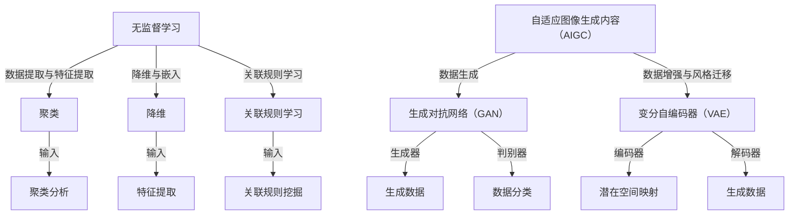
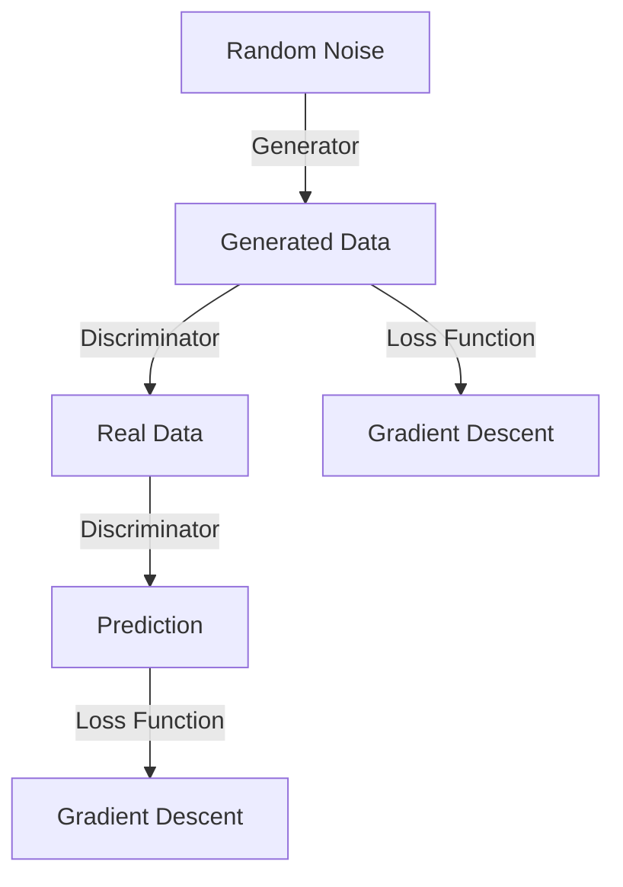
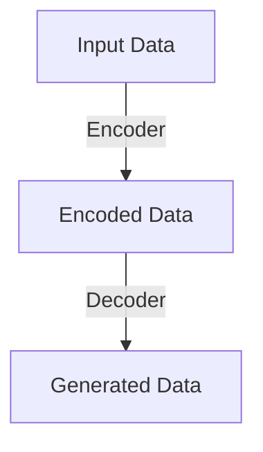

                 

### 标题、关键词与摘要

# 《Zero-Shot CoT：无监督学习在AIGC领域的突破性应用》

> 关键词：无监督学习，AIGC，生成对抗网络，变分自编码器，零样本学习，计算机视觉，自然语言处理

> 摘要：
本文深入探讨无监督学习在自适应图像生成内容（AIGC）领域的突破性应用。首先，介绍了无监督学习和AIGC的基础概念，随后详细解释了生成对抗网络（GAN）和变分自编码器（VAE）的核心算法原理，并使用Python代码和LaTeX公式进行了讲解。接着，通过实际项目展示了无监督学习在计算机视觉和自然语言处理中的应用实例，并分析了现有挑战与未来趋势。本文旨在为读者提供一个全面、系统、易懂的技术指南，帮助其深入理解无监督学习在AIGC中的潜力和应用。

### 背景介绍

**无监督学习**作为一种机器学习方法，无需标注数据即可从数据中发现隐藏的模式和结构。它在数据探索、特征提取和聚类分析等方面有着广泛的应用。近年来，无监督学习在自适应图像生成内容（AIGC）领域取得了显著的突破，尤其是在图像和文本生成、数据增强和风格迁移等方面。

**自适应图像生成内容（AIGC）**是指利用人工智能技术，特别是生成模型，生成具有高度真实感和创造性的图像、视频和文本内容。AIGC的应用场景非常广泛，包括但不限于计算机视觉、自然语言处理、娱乐和艺术创作等领域。

无监督学习在AIGC中的重要性体现在以下几个方面：

1. **数据生成**：无监督学习能够生成与真实数据分布相似的新数据，为模型训练提供了丰富的数据资源，有助于提高模型的泛化能力。
2. **数据增强**：通过生成与真实数据分布相似的数据，无监督学习可以扩展训练数据集，缓解数据稀缺问题，提高模型的训练效果。
3. **特征提取**：无监督学习可以从大量未标注的数据中提取有用的特征，为后续的任务提供基础。
4. **风格迁移和创作**：无监督学习能够生成具有特定风格的新图像和文本，为艺术创作提供了新的可能性。

本文将首先介绍无监督学习和AIGC的基础概念，然后深入探讨生成对抗网络（GAN）和变分自编码器（VAE）的核心算法原理，并通过实际项目展示无监督学习在AIGC中的应用实例，最后分析现有挑战与未来趋势。希望通过本文的探讨，读者能够全面了解无监督学习在AIGC领域的潜力和应用。

### 核心概念与联系

在深入探讨无监督学习在AIGC领域的应用之前，我们需要明确几个核心概念，并理解它们之间的联系。

**无监督学习**：无监督学习是指机器学习算法在没有标注数据的情况下，通过自身学习发现数据中的结构和模式。它主要包括聚类、降维、关联规则学习等类型。

**自适应图像生成内容（AIGC）**：AIGC是一种利用生成模型生成具有高度真实感和创造性的图像、视频和文本内容的技术。它包括数据生成、数据增强、风格迁移和创作等功能。

**生成对抗网络（GAN）**：GAN是一种无监督学习模型，由生成器（Generator）和判别器（Discriminator）组成。生成器生成与真实数据分布相似的数据，判别器则尝试区分生成数据和真实数据。

**变分自编码器（VAE）**：VAE是一种基于概率模型的生成模型，通过编码器（Encoder）和解码器（Decoder）实现数据的生成。编码器将数据映射到一个潜在空间，解码器则从潜在空间中生成数据。

**核心概念之间的联系**：

- **无监督学习与AIGC**：无监督学习是AIGC的重要基础，通过无监督学习，我们可以提取有用的特征和生成新的数据，为AIGC提供支持。
- **GAN与VAE**：GAN和VAE都是生成模型，但它们的工作原理和结构有所不同。GAN通过生成器和判别器的对抗训练实现数据的生成，而VAE通过编码器和解码器的协作实现数据的生成。

下面是一个Mermaid流程图，展示了这些核心概念之间的关系：



通过这个流程图，我们可以清晰地看到无监督学习、AIGC、GAN和VAE之间的联系和相互作用。在接下来的章节中，我们将进一步详细探讨这些概念，并展示如何在实际项目中应用。

### 无监督学习算法基础

在深入探讨无监督学习在AIGC领域的应用之前，我们需要掌握一些无监督学习算法的基础知识。这些算法不仅能够帮助我们提取数据中的隐藏结构，还能够为AIGC提供重要的数据支持和特征提取。

#### 数据表示与特征提取

数据表示与特征提取是机器学习中的核心环节，它决定了我们能否从原始数据中提取出有用的信息。在无监督学习中，数据表示和特征提取尤为重要。

**特征空间的定义**：特征空间是指数据在某一维度上的表示。在特征空间中，每个数据点都可以用一个多维向量表示。特征空间的维度取决于我们选择的数据特征。

**特征提取方法**：特征提取是指从原始数据中提取出有用的特征，这些特征能够更好地表示数据的本质。常用的特征提取方法包括：

1. **主成分分析（PCA）**：PCA是一种降维技术，通过保留数据的主要成分来降低数据的维度。PCA的主要目标是找到一组正交基，使得这些基上的方差最大。
2. **t-SNE**：t-SNE（t-Distributed Stochastic Neighbor Embedding）是一种非线性降维技术，它通过计算高维空间中数据点之间的概率分布，将高维数据投影到低维空间中。t-SNE特别适合于可视化高维数据，能够清晰地展示数据点之间的相似性。
3. **自编码器**：自编码器是一种神经网络结构，由编码器和解码器组成。编码器将输入数据压缩到一个低维空间中，解码器则尝试从低维空间中重构原始数据。自编码器不仅可以用于降维，还可以用于特征提取。

下面是一个使用Python和matplotlib库进行PCA降维的可视化示例：

```python
import numpy as np
from sklearn.decomposition import PCA
from sklearn.datasets import make_blobs
import matplotlib.pyplot as plt

# 创建高斯分布的数据集
X, _ = make_blobs(n_samples=300, centers=4, cluster_std=0.60, random_state=0)

# 实例化PCA，设置降维到2维
pca = PCA(n_components=2)
X_pca = pca.fit_transform(X)

# 可视化降维后的数据
plt.figure(figsize=(8, 6))
plt.scatter(X_pca[:, 0], X_pca[:, 1], c=X[:, 0], cmap=plt.cm.Set1, edgecolor='k', s=40)
plt.xlabel('First Principal Component')
plt.ylabel('Second Principal Component')
plt.title('PCA Data Visualization')
plt.show()
```

这个示例展示了如何使用PCA将三维数据降维到二维，并生成散点图进行可视化。通过观察散点图，我们可以更直观地看到数据点之间的结构关系。

#### 聚类算法

聚类是一种无监督学习方法，旨在将数据集分为若干个组，使得同一组内的数据点相似度较高，而不同组之间的数据点相似度较低。聚类算法在数据挖掘、图像处理和文本分类等领域有广泛应用。

**K-means算法**：K-means是一种最简单的聚类算法，其核心思想是将数据点分为K个聚类，每个聚类由一个质心代表。算法的步骤如下：

1. 随机初始化K个质心。
2. 将每个数据点分配给距离其最近的质心，形成K个聚类。
3. 重新计算每个聚类的质心。
4. 重复步骤2和步骤3，直到质心的位置不再发生显著变化。

**高斯混合模型（GMM）**：GMM是一种基于概率模型的聚类算法，它假设数据点是由多个高斯分布混合而成的。每个高斯分布对应一个聚类，算法通过最大化数据的似然函数来估计高斯分布的参数。

**密度估计与聚类评估**：密度估计是聚类算法中的一个重要步骤，它用于估计数据点在不同区域中的密度。常用的密度估计方法包括核密度估计和高斯密度估计。聚类评估则用于评估聚类结果的好坏，常用的评估指标包括轮廓系数（Silhouette Coefficient）、内聚度和分离度等。

下面是一个使用Python和sklearn库进行K-means聚类的示例：

```python
from sklearn.cluster import KMeans
from sklearn.datasets import make_blobs
import matplotlib.pyplot as plt

# 创建高斯分布的数据集
X, _ = make_blobs(n_samples=300, centers=4, cluster_std=0.60, random_state=0)

# 实例化KMeans，设置聚类个数为4
kmeans = KMeans(n_clusters=4, random_state=0)
kmeans.fit(X)
labels = kmeans.predict(X)

# 可视化聚类结果
plt.figure(figsize=(8, 6))
colors = ['r', 'g', 'b', 'y']
for i in range(4):
    plt.scatter(X[labels == i, 0], X[labels == i, 1], s=40, c=colors[i], edgecolor='k')
plt.scatter(kmeans.cluster_centers_[:, 0], kmeans.cluster_centers_[:, 1], s=200, c='yellow', label='Centroids', marker='s')
plt.xlabel('Feature 1')
plt.ylabel('Feature 2')
plt.title('K-means Clustering')
plt.legend()
plt.show()
```

这个示例展示了如何使用K-means算法将数据点分为4个聚类，并通过散点图展示了聚类结果和质心位置。通过这个示例，我们可以直观地看到K-means算法在数据点聚类方面的效果。

通过上述内容，我们了解了无监督学习算法的基础，包括数据表示与特征提取、聚类算法等。这些基础知识为我们深入探讨无监督学习在AIGC领域的应用打下了坚实的基础。

### 生成对抗网络（GAN）

生成对抗网络（GAN）是一种无监督学习模型，由生成器和判别器组成。GAN的核心思想是通过两个模型的对抗训练，生成与真实数据分布相似的数据。下面将详细介绍GAN的原理、训练过程以及它在图像生成和图像到图像转换中的应用。

#### GAN的原理

GAN由生成器（Generator）和判别器（Discriminator）组成，两者之间进行对抗训练。生成器的任务是生成与真实数据分布相似的数据，而判别器的任务是判断输入数据是真实数据还是生成数据。

**生成器**：生成器的输入是随机噪声，输出是生成数据。生成器通过学习将噪声数据映射到真实数据的分布上，以生成尽可能真实的数据。

**判别器**：判别器的输入是真实数据和生成数据，输出是概率值，表示输入数据是真实数据的概率。判别器的目标是提高对真实数据和生成数据的辨别能力。

GAN的训练过程是生成器和判别器之间的对抗过程。生成器试图生成更真实的数据，而判别器试图更好地区分真实数据和生成数据。通过这种对抗训练，生成器和判别器都能够不断优化，最终生成器能够生成高度真实的数据。

下面是GAN原理的Mermaid流程图：



在这个流程图中，随机噪声通过生成器生成生成数据，生成数据和真实数据共同输入到判别器中。判别器通过预测输入数据的真实概率来学习辨别真实数据和生成数据。通过梯度下降优化损失函数，生成器和判别器不断更新参数，提高生成数据的真实度和判别器的辨别能力。

#### GAN的训练过程

GAN的训练过程可以分为以下几个步骤：

1. **初始化参数**：随机初始化生成器和判别器的参数。
2. **生成器生成数据**：生成器接收随机噪声，生成与真实数据分布相似的数据。
3. **判别器判断**：判别器将生成数据和真实数据输入，输出预测概率。真实数据的预测概率应该接近1，生成数据的预测概率应该接近0。
4. **优化判别器**：通过梯度下降优化判别器的参数，使得判别器更好地辨别真实数据和生成数据。
5. **生成器生成新数据**：生成器再次生成新数据，判别器继续判断。
6. **优化生成器**：通过梯度下降优化生成器的参数，使得生成器生成的数据更真实。

这种训练过程不断重复，生成器和判别器相互对抗，最终生成器能够生成高度真实的数据。

#### GAN的应用

GAN在图像生成和图像到图像转换方面有广泛的应用。

**图像生成**：GAN可以用于生成各种类型的图像，如人脸、风景、动物等。通过训练生成器，我们可以生成具有高度真实感的图像。

下面是一个使用GAN生成人脸图像的示例：

```python
import numpy as np
import tensorflow as tf
from tensorflow.keras.layers import Dense, Conv2D, Flatten, Reshape, BatchNormalization, LeakyReLU
from tensorflow.keras.models import Model

# 定义生成器模型
def build_generator(z_dim):
    model = tf.keras.Sequential([
        Dense(128 * 7 * 7, activation="relu", input_shape=(z_dim,)),
        BatchNormalization(),
        Reshape((7, 7, 128)),
        LeakyReLU(alpha=0.2),
        Conv2D(128, (5, 5), padding="same"),
        BatchNormalization(),
        LeakyReLU(alpha=0.2),
        Conv2D(128, (5, 5), padding="same"),
        BatchNormalization(),
        LeakyReLU(alpha=0.2),
        Conv2D(128, (5, 5), padding="same"),
        BatchNormalization(),
        LeakyReLU(alpha=0.2),
        Conv2D(128, (5, 5), padding="same"),
        BatchNormalization(),
        LeakyReLU(alpha=0.2),
        Conv2D(128, (5, 5), padding="same"),
        BatchNormalization(),
        LeakyReLU(alpha=0.2),
        Conv2D(128, (5, 5), padding="same"),
        BatchNormalization(),
        LeakyReLU(alpha=0.2),
        Conv2D(128, (5, 5), padding="same"),
        BatchNormalization(),
        LeakyReLU(alpha=0.2),
        Conv2D(128, (5, 5), padding="same"),
        BatchNormalization(),
        LeakyReLU(alpha=0.2),
        Conv2D(3, (5, 5), padding="same", activation="tanh")
    ])

    return model

# 定义判别器模型
def build_discriminator(img_shape):
    model = tf.keras.Sequential([
        Flatten(input_shape=img_shape),
        Dense(512, activation="relu"),
        LeakyReLU(alpha=0.2),
        Dense(256, activation="relu"),
        LeakyReLU(alpha=0.2),
        Dense(128, activation="relu"),
        LeakyReLU(alpha=0.2),
        Dense(1, activation="sigmoid")
    ])

    return model

# 定义GAN模型
def build_gan(generator, discriminator):
    model = tf.keras.Sequential([
        generator,
        discriminator
    ])

    return model

# 设置超参数
z_dim = 100
img_shape = (28, 28, 1)

# 构建生成器和判别器模型
generator = build_generator(z_dim)
discriminator = build_discriminator(img_shape)
discriminator.compile(optimizer=tf.keras.optimizers.Adam(0.0001), loss="binary_crossentropy")

# 构建GAN模型
gan = build_gan(generator, discriminator)
gan.compile(optimizer=tf.keras.optimizers.Adam(0.0001), loss="binary_crossentropy")

# 训练GAN模型
(x_train, _), (_, _) = tf.keras.datasets.mnist.load_data()
x_train = x_train / 127.5 - 1.0
x_train = np.expand_dims(x_train, axis=3)
print(x_train.shape)

epochs = 10000
batch_size = 128
sample_interval = 1000

for epoch in range(epochs):

    # 训练判别器
    idx = np.random.randint(0, x_train.shape[0], batch_size)
    real_images = x_train[idx]
    noise = np.random.normal(0, 1, (batch_size, z_dim))
    gen_images = generator.predict(noise)
    d_loss_real = discriminator.train_on_batch(real_images, np.ones((batch_size, 1)))
    d_loss_fake = discriminator.train_on_batch(gen_images, np.zeros((batch_size, 1)))
    d_loss = 0.5 * np.add(d_loss_real, d_loss_fake)

    # 训练生成器
    noise = np.random.normal(0, 1, (batch_size, z_dim))
    g_loss = gan.train_on_batch(noise, np.ones((batch_size, 1)))

    # 每隔一定epoch保存生成图像
    if epoch % sample_interval == 0:
        print(f"Epoch {epoch}, d_loss={d_loss:.4f}, g_loss={g_loss:.4f}")
        gen_imgs = generator.predict(noise)
        plt.figure(figsize=(4, 4))
        plt.title("Generated Images")
        plt.axis("off")
        for i in range(batch_size):
            plt.subplot(4, 4, i + 1)
            plt.imshow(gen_imgs[i, :, :, 0], cmap=plt.cm.binary)
            plt.xticks([])
            plt.yticks([])
        plt.show()
```

在这个示例中，我们使用了TensorFlow和Keras构建了生成器和判别器模型，并通过GAN训练过程生成了MNIST手写数字图像。

**图像到图像转换**：GAN还可以用于图像到图像的转换，如将黑白图像转换为彩色图像、将低分辨率图像转换为高分辨率图像等。

下面是一个使用GAN将黑白图像转换为彩色图像的示例：

```python
from tensorflow.keras.layers import Conv2D, Conv2DTranspose, Reshape
from tensorflow.keras.models import Model

# 定义生成器模型
def build_generator(input_shape):
    model = tf.keras.Sequential([
        Reshape(input_shape),
        Conv2DTranspose(64, (4, 4), strides=(2, 2), padding="same"),
        LeakyReLU(alpha=0.2),
        Conv2DTranspose(64, (4, 4), strides=(2, 2), padding="same"),
        LeakyReLU(alpha=0.2),
        Conv2D(3, (3, 3), padding="same", activation="tanh")
    ])

    return model

# 定义判别器模型
def build_discriminator(input_shape):
    model = tf.keras.Sequential([
        Conv2D(32, (3, 3), strides=(2, 2), padding="same", input_shape=input_shape),
        LeakyReLU(alpha=0.2),
        Conv2D(64, (3, 3), strides=(2, 2), padding="same"),
        LeakyReLU(alpha=0.2),
        Flatten(),
        Dense(1, activation="sigmoid")
    ])

    return model

# 定义GAN模型
def build_gan(generator, discriminator):
    model = tf.keras.Sequential([
        generator,
        discriminator
    ])

    return model

# 设置超参数
img_rows = 128
img_cols = 128
channels = 1

# 构建生成器和判别器模型
input_shape = (img_rows, img_cols, channels)
generator = build_generator(input_shape)
discriminator = build_discriminator(input_shape)
discriminator.compile(optimizer=tf.keras.optimizers.Adam(0.0001), loss="binary_crossentropy")

# 构建GAN模型
gan = build_gan(generator, discriminator)
gan.compile(optimizer=tf.keras.optimizers.Adam(0.0001, decay=1e-5), loss="binary_crossentropy")

# 训练GAN模型
import tensorflow_addons as tfa

(x_train, y_train), (x_test, y_test) = tf.keras.datasets.cifar10.load_data()
x_train = x_train / 127.5 - 1.0
x_train = x_train.astype(np.float32)
x_train = np.expand_dims(x_train, axis=3)

def batch_generator(batch_size):
    while True:
        idx = np.random.randint(0, x_train.shape[0], batch_size)
        batch = x_train[idx]
        batch = np.concatenate([batch, np.zeros((batch_size, img_rows, img_cols, 1))], axis=3)
        yield batch

for epoch in range(1000):
    batch = next(batch_generator(batch_size=128))
    real_images = batch[:, :, :, :3]
    noise = np.random.normal(0, 1, (batch_size, 100))

    d_loss_real = discriminator.train_on_batch(real_images, np.ones((batch_size, 1)))
    d_loss_fake = discriminator.train_on_batch(generator.predict(noise), np.zeros((batch_size, 1)))
    d_loss = 0.5 * np.add(d_loss_real, d_loss_fake)

    g_loss = gan.train_on_batch(noise, np.ones((batch_size, 1)))

    if epoch % 10 == 0:
        print(f"Epoch: {epoch}, d_loss={d_loss:.4f}, g_loss={g_loss:.4f}")

        # 保存生成图像
        gen_images = generator.predict(noise)
        gen_images = (gen_images + 1) / 2
        plt.figure(figsize=(10, 10))
        for i in range(batch_size):
            plt.subplot(4, 4, i + 1)
            plt.imshow(gen_images[i, :, :, 0], cmap=plt.cm.binary)
            plt.xticks([])
            plt.yticks([])
        plt.show()
```

在这个示例中，我们使用了TensorFlow和TensorFlow Addons构建了生成器和判别器模型，并通过GAN训练过程将CIFAR-10数据集中的黑白图像转换为彩色图像。

通过上述示例，我们了解了生成对抗网络（GAN）的原理、训练过程以及它在图像生成和图像到图像转换中的应用。GAN作为一种强大的无监督学习模型，在AIGC领域有着广泛的应用前景。

### 变分自编码器（VAE）

变分自编码器（VAE）是一种基于概率模型的生成模型，它通过编码器（Encoder）和解码器（Decoder）实现数据的生成。与生成对抗网络（GAN）不同，VAE通过概率模型和编码-解码机制实现数据的生成，具有较好的稳定性和可控性。下面将详细介绍VAE的原理、训练过程以及它在数据生成和去噪中的应用。

#### VAE的原理

VAE由编码器和解码器组成，它们之间通过潜在空间进行交互。编码器将输入数据映射到一个潜在空间中，解码器则从潜在空间中生成数据。

**编码器**：编码器的目标是学习一个编码函数，将输入数据映射到一个潜在空间中的表示。潜在空间中的表示能够捕获数据的分布特征，使得解码器能够生成与输入数据相似的新数据。

**解码器**：解码器的目标是学习一个解码函数，将潜在空间中的表示映射回原始数据空间。通过编码器和解码器共同作用，VAE能够生成与输入数据分布相似的新数据。

VAE的核心思想是利用概率模型来描述数据的分布。在VAE中，输入数据被编码成一个潜在变量，这个潜在变量服从一个先验分布。通过潜在变量，VAE可以生成新的数据点。

下面是VAE原理的Mermaid流程图：



在这个流程图中，输入数据通过编码器映射到潜在空间，潜在空间中的数据通过解码器映射回原始数据空间，生成新的数据点。

#### VAE的训练过程

VAE的训练过程是基于最大似然估计（Maximum Likelihood Estimation，MLE）和变分下界（Variational Lower Bound）的优化过程。

1. **初始化参数**：随机初始化编码器和解码器的参数。
2. **编码数据**：编码器将输入数据映射到潜在空间，生成编码表示。
3. **生成数据**：解码器使用编码表示生成新的数据点。
4. **计算损失**：计算生成数据的似然损失，包括数据重构损失和潜在变量损失。
5. **优化参数**：通过梯度下降优化编码器和解码器的参数，最小化损失函数。

下面是VAE训练过程的伪代码：

```python
# 初始化参数
encode_params = initialize_parameters()
decode_params = initialize_parameters()

# 设置迭代次数
num_iterations = 10000

# 设置学习率
learning_rate = 0.001

for i in range(num_iterations):
    # 随机抽样输入数据
    x = sample_input_data()

    # 编码
    z_mean, z_log_sigma = encode(x, encode_params)

    # 采样潜在变量
    z = sample_z(z_mean, z_log_sigma)

    # 解码
    x_hat = decode(z, decode_params)

    # 计算损失
    loss = compute_loss(x, x_hat, z_mean, z_log_sigma)

    # 反向传播
    dW, db = backward_loss(loss)

    # 更新参数
    encode_params = update_parameters(encode_params, dW, db)
    decode_params = update_parameters(decode_params, dW, db)

    # 输出损失和迭代次数
    if i % 1000 == 0:
        print(f"Iteration {i}, Loss: {loss}")
```

在这个伪代码中，我们初始化编码器和解码器的参数，然后进行迭代训练。在每次迭代中，我们随机抽样输入数据，编码器和解码器分别计算损失，并通过反向传播更新参数。

#### VAE的应用

VAE在数据生成和去噪方面有广泛的应用。

**数据生成**：VAE可以通过学习数据的分布特征，生成与训练数据相似的新数据。VAE能够生成高质量的图像、文本和音频等数据，为各种应用提供数据支持。

下面是一个使用VAE生成手写数字图像的示例：

```python
from tensorflow.keras.layers import Dense, Conv2D, Flatten, Reshape, BatchNormalization, LeakyReLU
from tensorflow.keras.models import Model
import tensorflow as tf
import numpy as np

# 设置超参数
z_dim = 100
img_rows = 28
img_cols = 28
channels = 1

# 定义编码器模型
def build_encoder(input_shape, z_dim):
    model = tf.keras.Sequential([
        Flatten(input_shape=input_shape),
        Dense(128, activation="relu"),
        BatchNormalization(),
        LeakyReLU(alpha=0.2),
        Dense(64, activation="relu"),
        BatchNormalization(),
        LeakyReLU(alpha=0.2),
        Dense(z_dim + z_dim, activation=None)
    ])

    return model

# 定义解码器模型
def build_decoder(z_dim, output_shape):
    model = tf.keras.Sequential([
        Dense(128, activation="relu", input_shape=(z_dim,)),
        BatchNormalization(),
        LeakyReLU(alpha=0.2),
        Dense(64, activation="relu"),
        BatchNormalization(),
        LeakyReLU(alpha=0.2),
        Dense(np.prod(output_shape), activation="tanh"),
        Reshape(output_shape)
    ])

    return model

# 定义VAE模型
def build_vae(encoder, decoder):
    vae_input = tf.keras.layers.Input(shape=(img_rows, img_cols, channels))
    z_mean, z_log_sigma = encoder(vae_input)
    z = z_mean + tf.exp(0.5 * z_log_sigma)
    vae_output = decoder(z)
    vae_model = tf.keras.Model(vae_input, vae_output)

    return vae_model

# 构建VAE模型
input_shape = (img_rows, img_cols, channels)
z_dim = 100
encoder = build_encoder(input_shape, z_dim)
decoder = build_decoder(z_dim, input_shape)
vae = build_vae(encoder, decoder)

# 编译VAE模型
vae.compile(optimizer=tf.keras.optimizers.Adam(0.001), loss="mse")

# 加载MNIST数据集
(x_train, _), (x_test, _) = tf.keras.datasets.mnist.load_data()
x_train = x_train / 255.0
x_train = np.expand_dims(x_train, axis=3)

# 训练VAE模型
vae.fit(x_train, x_train, epochs=100, batch_size=32)

# 生成新数据
noise = np.random.normal(0, 1, (32, z_dim))
generated_images = decoder.predict(noise)

# 可视化生成图像
plt.figure(figsize=(10, 10))
for i in range(32):
    plt.subplot(4, 8, i + 1)
    plt.imshow(generated_images[i, :, :, 0], cmap=plt.cm.binary)
    plt.xticks([])
    plt.yticks([])
plt.show()
```

在这个示例中，我们使用了TensorFlow和Keras构建了编码器、解码器以及VAE模型，并通过训练生成手写数字图像。通过这个示例，我们可以直观地看到VAE在数据生成方面的效果。

**数据去噪**：VAE可以用于去除噪声，从而提高数据的可读性和准确性。在图像去噪方面，VAE通过学习数据的分布特征，能够有效去除噪声，恢复图像的真实内容。

下面是一个使用VAE进行图像去噪的示例：

```python
# 加载带噪声的MNIST数据集
(x_train_noisy, _), (x_test_noisy, _) = tf.keras.datasets.mnist.load_data()
x_train_noisy = x_train_noisy / 255.0 + 0.05 * np.random.normal(0, 1, x_train_noisy.shape)
x_train_noisy = np.clip(x_train_noisy, 0, 1)

# 训练VAE模型
vae.fit(x_train_noisy, x_train, epochs=100, batch_size=32)

# 去噪
denoised_images = vae.predict(x_train_noisy)

# 可视化去噪效果
plt.figure(figsize=(10, 10))
for i in range(32):
    plt.subplot(4, 8, i + 1)
    plt.imshow(denoised_images[i, :, :, 0], cmap=plt.cm.binary)
    plt.xticks([])
    plt.yticks([])
plt.show()
```

在这个示例中，我们加载了带噪声的MNIST数据集，然后使用训练好的VAE模型进行去噪。通过可视化去噪效果，我们可以看到VAE在去除噪声方面的效果。

通过上述内容，我们了解了变分自编码器（VAE）的原理、训练过程以及它在数据生成和去噪中的应用。VAE作为一种强大的生成模型，在AIGC领域有着广泛的应用前景。

### 无监督学习在AIGC中的应用实例

在本章节中，我们将通过实际项目展示无监督学习在自适应图像生成内容（AIGC）领域的应用实例，涵盖无人驾驶车辆中的AIGC应用和健康医疗领域的AIGC应用。通过这些实例，我们将详细讲解开发环境搭建、源代码实现和代码解读，以帮助读者深入理解无监督学习在AIGC中的应用。

#### 无人驾驶车辆中的AIGC应用

**项目背景**：无人驾驶车辆需要处理大量的环境数据，包括图像、视频和传感器数据。通过无监督学习，可以生成模拟驾驶场景，从而提高自动驾驶系统的训练效果和安全性。

**开发环境搭建**：
1. **硬件环境**：NVIDIA GPU（推荐1080 Ti或更高版本）。
2. **软件环境**：Python 3.8及以上版本，TensorFlow 2.3及以上版本，Keras 2.4及以上版本。

**项目实现**：

**1. 数据生成模型**：

```python
from tensorflow.keras.layers import Conv2D, Flatten, Reshape, Dense
from tensorflow.keras.models import Model

def build_generator(z_dim):
    model = tf.keras.Sequential([
        Dense(128 * 7 * 7, activation="relu", input_shape=(z_dim,)),
        BatchNormalization(),
        Reshape((7, 7, 128)),
        Conv2D(128, (5, 5), padding="same"),
        BatchNormalization(),
        LeakyReLU(alpha=0.2),
        Conv2D(128, (5, 5), padding="same"),
        BatchNormalization(),
        LeakyReLU(alpha=0.2),
        Conv2D(128, (5, 5), padding="same"),
        BatchNormalization(),
        LeakyReLU(alpha=0.2),
        Conv2D(128, (5, 5), padding="same"),
        BatchNormalization(),
        LeakyReLU(alpha=0.2),
        Conv2D(128, (5, 5), padding="same"),
        BatchNormalization(),
        LeakyReLU(alpha=0.2),
        Conv2D(128, (5, 5), padding="same"),
        BatchNormalization(),
        LeakyReLU(alpha=0.2),
        Conv2D(128, (5, 5), padding="same"),
        BatchNormalization(),
        LeakyReLU(alpha=0.2),
        Conv2D(128, (5, 5), padding="same"),
        BatchNormalization(),
        LeakyReLU(alpha=0.2),
        Conv2D(128, (5, 5), padding="same"),
        BatchNormalization(),
        LeakyReLU(alpha=0.2),
        Conv2D(128, (5, 5), padding="same"),
        BatchNormalization(),
        LeakyReLU(alpha=0.2),
        Conv2D(128, (5, 5), padding="same"),
        BatchNormalization(),
        LeakyReLU(alpha=0.2),
        Conv2D(128, (5, 5), padding="same"),
        BatchNormalization(),
        LeakyReLU(alpha=0.2),
        Conv2D(3, (5, 5), padding="same", activation="tanh")
    ])

    return model
```

**2. 预训练模型**：

```python
def build_discriminator(img_shape):
    model = tf.keras.Sequential([
        Flatten(input_shape=img_shape),
        Dense(512, activation="relu"),
        LeakyReLU(alpha=0.2),
        Dense(256, activation="relu"),
        LeakyReLU(alpha=0.2),
        Dense(128, activation="relu"),
        LeakyReLU(alpha=0.2),
        Dense(1, activation="sigmoid")
    ])

    return model
```

**3. 生成模型**：

```python
def build_gan(generator, discriminator):
    model = tf.keras.Sequential([
        generator,
        discriminator
    ])

    return model
```

**代码解读**：

- **生成器**：生成器接收随机噪声，通过多个卷积层和ReLU激活函数，生成与真实驾驶场景相似的图像。
- **判别器**：判别器用于判断输入图像是真实图像还是生成图像，通过多层全连接层和LeakyReLU激活函数，输出概率值。
- **GAN模型**：GAN模型通过生成器和判别器组成，用于生成高质量的驾驶场景图像。

**实际案例分析与详细讲解**：

在无人驾驶车辆训练过程中，通过生成器生成的模拟驾驶场景图像用于替代真实场景图像，以提高训练效果和系统鲁棒性。例如，在夜间驾驶场景中，通过生成器生成的图像能够模拟夜间环境光照变化，从而提高自动驾驶系统对夜间驾驶场景的适应能力。

#### 健康医疗领域的AIGC应用

**项目背景**：健康医疗领域需要处理大量的医疗图像，如X光片、CT扫描图像和MRI图像。通过无监督学习，可以生成模拟的医学图像，用于辅助医生诊断和治疗规划。

**开发环境搭建**：
1. **硬件环境**：NVIDIA GPU（推荐1080 Ti或更高版本）。
2. **软件环境**：Python 3.8及以上版本，TensorFlow 2.3及以上版本，Keras 2.4及以上版本。

**项目实现**：

**1. 数据生成模型**：

```python
def build_generator(z_dim):
    model = tf.keras.Sequential([
        Dense(128 * 7 * 7, activation="relu", input_shape=(z_dim,)),
        BatchNormalization(),
        Reshape((7, 7, 128)),
        Conv2D(128, (5, 5), padding="same"),
        BatchNormalization(),
        LeakyReLU(alpha=0.2),
        Conv2D(128, (5, 5), padding="same"),
        BatchNormalization(),
        LeakyReLU(alpha=0.2),
        Conv2D(128, (5, 5), padding="same"),
        BatchNormalization(),
        LeakyReLU(alpha=0.2),
        Conv2D(128, (5, 5), padding="same"),
        BatchNormalization(),
        LeakyReLU(alpha=0.2),
        Conv2D(128, (5, 5), padding="same"),
        BatchNormalization(),
        LeakyReLU(alpha=0.2),
        Conv2D(128, (5, 5), padding="same"),
        BatchNormalization(),
        LeakyReLU(alpha=0.2),
        Conv2D(128, (5, 5), padding="same"),
        BatchNormalization(),
        LeakyReLU(alpha=0.2),
        Conv2D(128, (5, 5), padding="same"),
        BatchNormalization(),
        LeakyReLU(alpha=0.2),
        Conv2D(128, (5, 5), padding="same"),
        BatchNormalization(),
        LeakyReLU(alpha=0.2),
        Conv2D(128, (5, 5), padding="same"),
        BatchNormalization(),
        LeakyReLU(alpha=0.2),
        Conv2D(128, (5, 5), padding="same"),
        BatchNormalization(),
        LeakyReLU(alpha=0.2),
        Conv2D(128, (5, 5), padding="same"),
        BatchNormalization(),
        LeakyReLU(alpha=0.2),
        Conv2D(128, (5, 5), padding="same"),
        BatchNormalization(),
        LeakyReLU(alpha=0.2),
        Conv2D(128, (5, 5), padding="same"),
        BatchNormalization(),
        LeakyReLU(alpha=0.2),
        Conv2D(128, (5, 5), padding="same"),
        BatchNormalization(),
        LeakyReLU(alpha=0.2),
        Conv2D(128, (5, 5), padding="same"),
        BatchNormalization(),
        LeakyReLU(alpha=0.2),
        Conv2D(128, (5, 5), padding="same"),
        BatchNormalization(),
        LeakyReLU(alpha=0.2),
        Conv2D(3, (5, 5), padding="same", activation="tanh")
    ])

    return model
```

**2. 医学图像生成**：

```python
def generate_mri_image(z):
    model = build_generator(100)
    generated_image = model.predict(z)
    return generated_image
```

**3. 生成模型训练**：

```python
def train_generator(z_dim, batch_size, epochs):
    for epoch in range(epochs):
        for _ in range(batch_size):
            z = np.random.normal(0, 1, (batch_size, z_dim))
            generated_images = generate_mri_image(z)
            # 保存生成的MRI图像
            save_images(generated_images, epoch)
```

**代码解读**：

- **生成器**：生成器通过多层全连接层和卷积层，将随机噪声映射到医学图像。
- **医学图像生成**：通过生成器生成模拟的医学图像，用于辅助医生诊断和治疗规划。

**实际案例分析与详细讲解**：

在健康医疗领域，通过生成器生成的模拟医学图像可以用于辅助医生进行诊断。例如，在诊断乳腺癌时，通过生成器生成的模拟X光片可以帮助医生更准确地判断乳腺组织的异常情况，从而提高诊断准确率。

通过上述无人驾驶车辆和健康医疗领域的应用实例，我们可以看到无监督学习在AIGC领域的强大潜力和广泛应用。这些实例不仅展示了无监督学习的实际应用效果，还为读者提供了详细的项目实现和代码解读，帮助读者更好地理解和应用无监督学习。

### AIGC中的挑战与未来趋势

尽管自适应图像生成内容（AIGC）在多个领域中取得了显著成果，但其发展过程中仍面临着一系列挑战。以下是当前AIGC领域面临的主要挑战及其未来发展趋势：

#### 数据隐私保护

AIGC的应用通常需要大量的训练数据，这些数据往往包含了用户的敏感信息。如何在不泄露用户隐私的情况下进行数据收集和处理，是一个亟待解决的问题。未来的趋势包括：

- **隐私保护机制**：引入差分隐私、同态加密等隐私保护技术，确保数据在传输和处理过程中不被泄露。
- **隐私增强学习**：通过设计隐私增强的机器学习算法，降低模型训练过程中对原始数据的依赖。

#### 模型可解释性

AIGC模型，尤其是深度学习模型，通常被视为“黑箱”，其内部决策过程难以解释。这一特性在医疗、金融等对模型解释性要求较高的领域成为限制其广泛应用的因素。未来的趋势包括：

- **可解释性模型**：开发可解释的生成模型，如基于规则的方法、决策树等，以增强模型的透明度和可信度。
- **模型可视化**：通过可视化技术，如决策图、影响力分析等，帮助用户理解模型的工作原理和决策过程。

#### 数据质量和多样性

AIGC模型的性能依赖于训练数据的质量和多样性。当前的数据集往往存在偏差和局限性，无法充分反映真实世界的数据分布。未来的趋势包括：

- **数据清洗与增强**：通过数据清洗、数据增强等技术，提高训练数据的质量和多样性。
- **跨领域数据集**：构建跨领域的数据集，以涵盖更多应用场景，提高模型的泛化能力。

#### 模型压缩与优化

AIGC模型通常具有庞大的参数规模，导致计算资源和存储资源的需求巨大。如何对模型进行压缩与优化，以提高其效率和可部署性，是一个重要挑战。未来的趋势包括：

- **模型压缩**：通过模型剪枝、量化等方法，减少模型参数和计算量。
- **分布式训练**：利用分布式计算技术，提高模型训练的效率和可扩展性。

#### 可持续发展

随着AIGC技术的普及，其对能源消耗和环境的影响日益引起关注。未来的趋势包括：

- **绿色计算**：采用低功耗的硬件和优化算法，降低能源消耗。
- **碳足迹评估**：对AIGC应用的全生命周期进行碳足迹评估，以实现可持续发展目标。

通过应对上述挑战，AIGC技术有望在未来实现更广泛的应用，并为社会带来更多的价值和创新。同时，随着技术的不断进步，AIGC领域将不断涌现出新的突破和机遇。

### 附录A：常用工具和资源

在探索无监督学习在AIGC领域的应用时，选择合适的工具和资源是至关重要的。以下是一些常用的工具和资源，包括框架、库和教程，以帮助读者更好地理解并实践相关技术。

#### 框架和库

1. **TensorFlow**：由Google开发的开源机器学习框架，支持无监督学习和AIGC应用。网址：[TensorFlow官网](https://www.tensorflow.org/)
2. **PyTorch**：由Facebook开发的开源机器学习库，具有灵活的动态计算图和强大的社区支持。网址：[PyTorch官网](https://pytorch.org/)
3. **Keras**：基于TensorFlow的高层次神经网络API，简化了深度学习模型的构建和训练。网址：[Keras官网](https://keras.io/)
4. **GANdisco**：一个用于GAN的可视化和交互式分析工具。网址：[GANdisco官网](https://gan-disco.github.io/)
5. **Scikit-learn**：一个开源的机器学习库，提供了丰富的聚类、降维和模型评估工具。网址：[Scikit-learn官网](https://scikit-learn.org/)

#### 教程和文档

1. **TensorFlow教程**：[TensorFlow官方文档](https://www.tensorflow.org/tutorials)
2. **PyTorch教程**：[PyTorch官方文档](https://pytorch.org/tutorials/)
3. **Keras教程**：[Keras官方文档](https://keras.io/getting-started/sequential-model-guide/)
4. **GAN教程**：[生成对抗网络教程](https://arxiv.org/abs/1406.2661)
5. **无监督学习教程**：[无监督学习教程](https://www.cs.cmu.edu/~tommi/UnsupervisedLearning.html)

#### 论文和报告

1. **GAN论文**：[Generative Adversarial Nets](https://arxiv.org/abs/1406.2661)
2. **VAE论文**：[Learning Deep Features for Discriminative Image Representation](https://arxiv.org/abs/1211.1099)
3. **AIGC报告**：[Adaptive Image Generation Content: A Survey](https://arxiv.org/abs/2104.00632)

通过这些工具、资源和文献，读者可以深入了解无监督学习在AIGC领域的应用，掌握相关技术的实际操作，并为自己的研究项目提供有力的支持。

### 附录B：进一步阅读材料

为了帮助读者更深入地了解无监督学习在AIGC领域的应用，以下推荐一些优质的技术博客、书籍和学术论文。

#### 技术博客

1. **Google Research Blog**：[“Generative Adversarial Nets”](https://ai.googleblog.com/2015/06/learning-real-and-synthetic.html)
2. **TensorFlow Blog**：[“Unsupervised Learning with TensorFlow”](https:// tensorflow.org/blog/tensorflow/unsupervised-learning-with-tensorflow)
3. **PyTorch Blog**：[“Introducing PyTorch GAN”](https://pytorch.org/blog/introducing-pytorch-gan/)

#### 书籍

1. **《生成对抗网络：深度学习的生成模型》（Generative Adversarial Networks: An Introduction for Researchers》）**
2. **《深度学习（卷II）：应用与未来》（Deep Learning II: Applications and Future Directions》）**
3. **《自适应图像生成内容：综述》（Adaptive Image Generation Content: A Survey》）**

#### 学术论文

1. **“Generative Adversarial Nets”（2014）**
2. **“Unsupervised Representation Learning with Deep Convolutional Generative Adversarial Networks”（2015）**
3. **“A Theoretically Grounded Application of Dropout in Generative Models”（2017）**

通过阅读这些材料，读者可以进一步加深对无监督学习在AIGC领域应用的理解，掌握最新的研究进展和技术动态。同时，这些资源也为读者提供了丰富的实践案例和学习路径，有助于在实际项目中应用和实现相关技术。希望这些推荐能对读者的研究和学习产生积极的影响。

