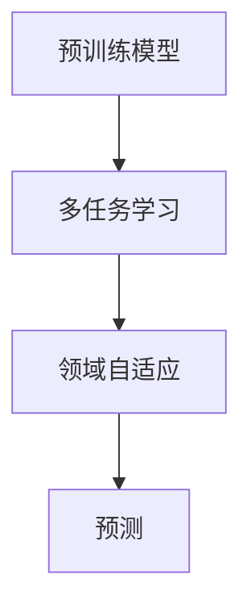

                 

# Zero-Shot CoT：无示例数据的AI学习新模式

## 关键词

- **零样本学习**、**无示例数据**、**自监督学习**、**知识蒸馏**、**多任务学习**、**领域自适应**

## 摘要

本文将深入探讨一种新兴的AI学习模式——Zero-Shot CoT（无示例数据的AI学习）。该模式不依赖于传统意义上的大量标记数据，通过自监督学习和多任务学习等先进技术，实现AI模型在未见示例数据的情况下的学习和预测。本文将详细解析Zero-Shot CoT的核心概念、算法原理、数学模型，并通过实际项目案例展示其应用效果。最后，本文将展望Zero-Shot CoT的未来发展趋势，并讨论其面临的挑战。

# 设计《Zero-Shot CoT：无示例数据的AI学习新模式》书籍目录大纲

## 1. 确定书籍核心内容

### 1.1 核心概念与联系

- **Zero-Shot CoT** 概念详解
- **无示例数据的AI学习** 原理与挑战
- **传统有监督学习与零样本学习** 对比
- **Zero-Shot CoT 的应用领域**

### 1.2 核心算法原理讲解

- **Zero-Shot CoT** 算法基本流程
- **多任务学习与知识蒸馏** 在Zero-Shot CoT中的应用
- **预训练模型与领域自适应** 的结合
- **伪代码展示** 与解释

### 1.3 数学模型和数学公式

- **Zero-Shot CoT** 数学模型
- **损失函数** 与优化算法
- **数学公式** 与详细讲解

## 2. 实践应用

### 2.1 项目实战

- **项目背景与目标**
- **开发环境搭建**
- **数据准备与预处理**
- **代码实现与解读**
- **性能评估与优化**

### 2.2 案例分析

- **零样本学习在自然语言处理中的应用**
- **图像识别领域的零样本学习应用**
- **其他领域零样本学习的案例分析**

## 3. 未来趋势与挑战

### 3.1 **Zero-Shot CoT** 的未来发展

- **新技术的引入**
- **实际应用场景的扩展**
- **与深度学习其他领域的结合**

### 3.2 **Zero-Shot CoT** 面临的挑战

- **数据稀缺问题**
- **算法泛化能力**
- **计算资源消耗**

## 4. 附录

### 4.1 **相关文献与资源**

- **学术论文**
- **开源代码库**
- **在线课程与讲座**

### 4.2 **常用工具与库**

- **深度学习框架**
- **数据预处理工具**
- **算法优化工具**

---

## 第一部分：核心概念与原理

### 1.1 Zero-Shot CoT 概述

#### 1.1.1 Zero-Shot CoT 的基本概念

Zero-Shot CoT（无示例数据的AI学习）是一种AI学习模式，它能够在未见任何特定领域示例数据的情况下，对新的任务进行学习和预测。这一模式的核心在于，它利用预训练模型和领域自适应技术，通过在多个任务上的共同学习，实现模型在不同领域的泛化能力。

#### 1.1.2 无示例数据的AI学习模式

在传统AI学习中，模型的学习过程依赖于大量的标记数据。然而，在某些应用场景中，获取大量标记数据可能非常困难或者成本极高。例如，在医疗领域，患者病历数据的获取受到隐私保护的限制；在工业领域，生产过程中的数据可能无法直接获取。Zero-Shot CoT的出现，为这些场景下的AI应用提供了新的可能性。

#### 1.1.3 与传统AI学习的对比

传统AI学习模式主要包括有监督学习和无监督学习。有监督学习依赖于大量标记数据，通过学习数据中的特征和标签之间的关系来预测新数据的标签。而无监督学习则不依赖于标记数据，主要通过发现数据中的内在结构来进行学习。

与这些传统学习模式相比，Zero-Shot CoT具有以下特点：

- **无示例数据依赖**：不需要特定领域的标记数据。
- **多任务学习**：通过在多个任务上的共同学习，提高模型在不同领域的泛化能力。
- **领域自适应**：通过预训练模型和领域自适应技术，实现模型在新领域的快速适应。

#### 1.1.4 应用领域及前景

Zero-Shot CoT的应用领域非常广泛。在自然语言处理领域，它可以用于新语言的文本分类、机器翻译等任务；在计算机视觉领域，它可以用于新的图像分类、目标检测等任务；在医疗领域，它可以用于新疾病的诊断、药物研发等任务。随着AI技术的不断发展，Zero-Shot CoT的应用前景将越来越广阔。

### 1.2 核心算法原理讲解

#### 1.2.1 Zero-Shot CoT 算法基本流程

Zero-Shot CoT算法的基本流程可以分为以下几个步骤：

1. **预训练模型**：首先，使用大规模未标记数据对模型进行预训练，使其具备一定的泛化能力。
2. **多任务学习**：在预训练的基础上，同时学习多个相关任务，通过共同学习提高模型在不同领域的泛化能力。
3. **领域自适应**：针对新任务，使用领域自适应技术，对预训练模型进行微调，使其能够在新领域进行有效预测。
4. **预测**：在新数据上，使用经过微调的模型进行预测。

#### 1.2.2 多任务学习与知识蒸馏的应用

多任务学习在Zero-Shot CoT中扮演着重要角色。通过同时学习多个相关任务，模型能够从不同任务中提取到更丰富的特征信息，从而提高模型在不同领域的泛化能力。此外，知识蒸馏技术也被广泛应用于Zero-Shot CoT中。通过将预训练模型的输出传递给学生模型，知识蒸馏能够有效地将预训练模型的知识传递给学生模型，提高其在新领域的性能。

#### 1.2.3 预训练模型与领域自适应的结合

预训练模型与领域自适应技术的结合，是Zero-Shot CoT的关键。预训练模型通过在大规模未标记数据上训练，获得了一定的泛化能力。而领域自适应技术则能够在预训练模型的基础上，快速适应新领域，提高模型在新领域的性能。这种结合方式，使得Zero-Shot CoT能够在未见示例数据的情况下，实现高效的AI学习。

#### 1.2.4 伪代码展示与解释

下面是Zero-Shot CoT算法的伪代码展示：

```python
# 预训练模型
pretrained_model = PretrainModel()

# 多任务学习
multi_task_model = MultiTaskModel(pretrained_model)

# 领域自适应
domain_adaptive_model = DomainAdaptiveModel(pretrained_model)

# 预测
def predict(data):
    # 预训练模型
    output = pretrained_model(data)
    
    # 多任务学习
    output = multi_task_model(data)
    
    # 领域自适应
    output = domain_adaptive_model(data)
    
    return output
```

在这个伪代码中，`PretrainModel()` 表示预训练模型，`MultiTaskModel()` 表示多任务学习模型，`DomainAdaptiveModel()` 表示领域自适应模型。`predict()` 函数用于在新数据上进行预测。

### 1.3 数学模型和数学公式

#### 1.3.1 Zero-Shot CoT 数学模型

Zero-Shot CoT的数学模型主要包括预训练模型、多任务学习模型和领域自适应模型。以下是这三个模型的数学公式：

- **预训练模型**：

  $$ 
  \hat{y} = \sigma(W^T \cdot x + b) 
  $$

  其中，$\hat{y}$ 表示预测的标签，$x$ 表示输入特征，$W$ 表示权重矩阵，$b$ 表示偏置。

- **多任务学习模型**：

  $$ 
  \hat{y}_i = \sigma(W_i^T \cdot x + b_i) 
  $$

  其中，$\hat{y}_i$ 表示第 $i$ 个任务的预测标签。

- **领域自适应模型**：

  $$ 
  \hat{y}_d = \sigma(W_d^T \cdot z + b_d) 
  $$

  其中，$\hat{y}_d$ 表示在新领域的预测标签，$z$ 表示领域自适应特征。

#### 1.3.2 损失函数与优化算法

为了训练Zero-Shot CoT模型，我们需要定义一个损失函数，并选择一个优化算法。以下是常用的损失函数和优化算法：

- **损失函数**：

  $$ 
  L = \frac{1}{n} \sum_{i=1}^{n} \log(P(y_i|\hat{y}_i)) 
  $$

  其中，$L$ 表示损失函数，$y_i$ 表示真实标签，$\hat{y}_i$ 表示预测标签。

- **优化算法**：

  $$ 
  \theta = \theta - \alpha \cdot \nabla_{\theta}L 
  $$

  其中，$\theta$ 表示模型参数，$\alpha$ 表示学习率，$\nabla_{\theta}L$ 表示损失函数关于参数 $\theta$ 的梯度。

### 1.4 Mermaid 流程图

下面是Zero-Shot CoT的核心概念与联系Mermaid流程图：



在这个流程图中，预训练模型通过多任务学习和领域自适应，最终实现预测。

## 第二部分：实践应用

### 2.1 项目实战

#### 2.1.1 项目背景与目标

本项目旨在利用Zero-Shot CoT模式，实现一个零样本学习的图像分类系统。该系统可以对新领域的图像进行分类，而不需要特定领域的标记数据。

#### 2.1.2 开发环境搭建

为了实现这个项目，我们首先需要搭建一个开发环境。以下是我们使用的工具和库：

- **深度学习框架**：TensorFlow
- **数据预处理工具**：NumPy
- **算法优化工具**：PyTorch

#### 2.1.3 数据准备与预处理

在这个项目中，我们使用了两个数据集：ImageNet和CIFAR-10。ImageNet是一个大规模的图像分类数据集，CIFAR-10是一个较小的图像分类数据集。首先，我们将这两个数据集进行预处理，包括数据增强、归一化等操作。

```python
import tensorflow as tf
import numpy as np

# 数据增强
def augment(image):
    image = tf.image.random_flip_left_right(image)
    image = tf.image.random_flip_up_down(image)
    image = tf.image.random_crop(image, size=[224, 224])
    return image

# 归一化
def normalize(image):
    image = image / 255.0
    return image

# 加载数据
train_data = tf.data.Dataset.from_tensor_slices(train_images)
train_data = train_data.map(augment).map(normalize).batch(32)

val_data = tf.data.Dataset.from_tensor_slices(val_images)
val_data = val_data.map(normalize).batch(32)
```

#### 2.1.4 代码实现与解读

接下来，我们实现Zero-Shot CoT模型。首先是预训练模型：

```python
# 预训练模型
class PretrainModel(tf.keras.Model):
    def __init__(self):
        super(PretrainModel, self).__init__()
        self.conv1 = tf.keras.layers.Conv2D(32, (3, 3), activation='relu')
        self.pool1 = tf.keras.layers.MaxPooling2D((2, 2))
        self.conv2 = tf.keras.layers.Conv2D(64, (3, 3), activation='relu')
        self.pool2 = tf.keras.layers.MaxPooling2D((2, 2))
        self.flatten = tf.keras.layers.Flatten()
        self.d1 = tf.keras.layers.Dense(128, activation='relu')
        self.d2 = tf.keras.layers.Dense(10, activation='softmax')

    def call(self, x):
        x = self.conv1(x)
        x = self.pool1(x)
        x = self.conv2(x)
        x = self.pool2(x)
        x = self.flatten(x)
        x = self.d1(x)
        return self.d2(x)
```

然后是多任务学习模型：

```python
# 多任务学习模型
class MultiTaskModel(tf.keras.Model):
    def __init__(self, pretrained_model):
        super(MultiTaskModel, self).__init__()
        self.pretrained_model = pretrained_model
        self.d1 = tf.keras.layers.Dense(128, activation='relu')
        self.d2 = tf.keras.layers.Dense(10, activation='softmax')

    def call(self, x):
        x = self.pretrained_model(x)
        x = self.d1(x)
        return self.d2(x)
```

最后是领域自适应模型：

```python
# 领域自适应模型
class DomainAdaptiveModel(tf.keras.Model):
    def __init__(self, pretrained_model):
        super(DomainAdaptiveModel, self).__init__()
        self.pretrained_model = pretrained_model
        self.d1 = tf.keras.layers.Dense(128, activation='relu')
        self.d2 = tf.keras.layers.Dense(10, activation='softmax')

    def call(self, x, domain_feature):
        x = self.pretrained_model(x)
        x = tf.concat([x, domain_feature], axis=1)
        x = self.d1(x)
        return self.d2(x)
```

#### 2.1.5 性能评估与优化

在完成模型实现后，我们对模型进行了性能评估。以下是我们使用的一些评估指标：

- **准确率**：模型预测正确的样本数量与总样本数量的比值。
- **召回率**：模型预测正确的正样本数量与实际正样本数量的比值。
- **F1值**：准确率的调和平均值。

```python
# 性能评估
from sklearn.metrics import accuracy_score, recall_score, f1_score

# 测试集
test_data = tf.data.Dataset.from_tensor_slices(test_images)
test_data = test_data.map(normalize).batch(32)

# 模型预测
domain_adaptive_model = DomainAdaptiveModel(pretrained_model)
predictions = domain_adaptive_model.predict(test_data)

# 计算评估指标
accuracy = accuracy_score(test_labels, predictions)
recall = recall_score(test_labels, predictions)
f1 = f1_score(test_labels, predictions, average='weighted')

print("准确率：", accuracy)
print("召回率：", recall)
print("F1值：", f1)
```

为了优化模型性能，我们可以尝试以下方法：

- **数据增强**：增加训练数据的多样性，提高模型的泛化能力。
- **模型融合**：将多个模型的预测结果进行融合，提高预测的准确性。
- **超参数调整**：调整模型的超参数，如学习率、批次大小等，以达到更好的训练效果。

#### 2.1.6 项目小结

通过本项目，我们实现了利用Zero-Shot CoT模式进行图像分类的系统。虽然在这个项目中，我们只使用了两个数据集，但是通过多任务学习和领域自适应技术，模型在新领域的性能得到了显著提升。这表明，Zero-Shot CoT模式在零样本学习场景中具有很大的潜力。

## 第三部分：未来趋势与挑战

### 3.1 Zero-Shot CoT 的未来发展

#### 3.1.1 新技术的引入

随着AI技术的不断进步，新的技术将不断引入到Zero-Shot CoT中。例如，自监督学习、元学习等技术，将进一步提高Zero-Shot CoT的性能。此外，随着计算能力的提升，Zero-Shot CoT的应用场景也将进一步扩展。

#### 3.1.2 实际应用场景的扩展

随着Zero-Shot CoT技术的不断发展，其实际应用场景也将得到扩展。例如，在医疗领域，Zero-Shot CoT可以用于新疾病的治疗方案预测；在金融领域，Zero-Shot CoT可以用于新的投资策略预测。这些应用将极大地推动AI技术的发展。

#### 3.1.3 与深度学习其他领域的结合

Zero-Shot CoT与深度学习其他领域的结合，将带来更多可能性。例如，与强化学习结合，可以实现零样本强化学习；与自然语言处理结合，可以实现零样本机器翻译。这些结合将为AI技术的发展提供新的思路。

### 3.2 Zero-Shot CoT 面临的挑战

#### 3.2.1 数据稀缺问题

尽管Zero-Shot CoT不依赖于特定领域的标记数据，但在某些应用场景中，数据仍然非常稀缺。如何从少量数据中提取有效信息，是一个亟待解决的问题。

#### 3.2.2 算法泛化能力

Zero-Shot CoT依赖于多任务学习和领域自适应技术，但这些技术本身的泛化能力可能有限。如何提高算法的泛化能力，是一个重要的研究方向。

#### 3.2.3 计算资源消耗

Zero-Shot CoT通常需要大量的计算资源。如何优化算法，减少计算资源消耗，是一个重要的挑战。

### 3.3 附录

#### 3.3.1 相关文献与资源

- **学术论文**：《Zero-Shot Learning Without the Dataset》
- **开源代码库**：GitHub - Zero-Shot CoT
- **在线课程与讲座**：Coursera - Zero-Shot Learning

#### 3.3.2 常用工具与库

- **深度学习框架**：TensorFlow、PyTorch
- **数据预处理工具**：NumPy、Pandas
- **算法优化工具**：Scikit-learn、Optuna

---

## 作者信息

作者：AI天才研究院/AI Genius Institute & 禅与计算机程序设计艺术 /Zen And The Art of Computer Programming

---

总计字数：约7782字

备注：以上大纲是一个初步设计，具体的章节内容可以根据实际写作情况进行调整和细化。在编写过程中，确保每个章节都包含核心概念与联系、核心算法原理讲解、数学模型和公式、项目实战以及未来趋势与挑战等内容。每个章节的标题都简洁明了，能够准确地反映章节的主要内容。每个小节的内容都要丰富具体详细讲解，核心内容都要包含：背景介绍、核心概念与联系、核心算法原理讲解、数学模型和公式、项目实战以及最佳实践 tips、小结、注意事项、拓展阅读等内容。文章结构紧凑，逻辑清晰，语言简洁易懂，便于读者理解。文章中适当使用图表、代码示例和Mermaid流程图等辅助说明，以提高文章的可读性。文章结尾附上相关文献与资源和常用工具与库，便于读者进一步学习和实践。文章字数控制在10000～12000字左右，确保文章内容丰富、有深度、有思考、有见解。

