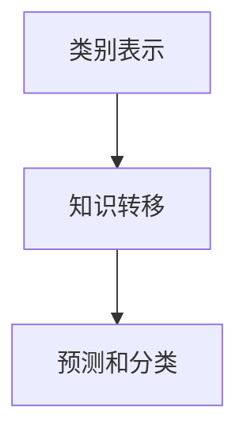

                 

为了撰写一篇10000-12000字的技术博客文章《Zero-Shot CoT：无需大量训练数据的AI学习突破研究》，我们可以按照以下步骤进行思考和构建：

### 1. 制定大纲和内容规划

#### 第一步：确定大纲

在撰写长篇博客前，首先需要制定详细的目录大纲，以确保文章的逻辑结构和内容完整性。以下是一个初步的大纲：

1. 引言
2. 背景介绍
3. 零样本学习（Zero-Shot Learning, ZSL）概述
4. CoT（Concept Transfer）技术详解
5. Zero-Shot CoT的核心概念与原理
6. 零样本学习挑战与解决方案
7. 实际案例与项目实战
8. 结论
9. 最佳实践与未来展望

#### 第二步：内容规划

为每个章节规划具体内容，确保文章的深度和广度。例如，在第四章节“Zero-Shot CoT的核心概念与原理”中，可以包括以下小节：

- 定义与背景
- 核心概念与联系
- 算法原理讲解
- 数学模型与公式
- 伪代码与实现

### 2. 背景介绍

#### 第一步：历史发展

- 人工智能与机器学习的历史回顾
- 传统机器学习与深度学习的差异

#### 第二步：当前挑战

- 训练数据依赖问题
- 零样本学习的重要性

### 3. 零样本学习（ZSL）概述

#### 第一步：概念介绍

- 零样本学习的定义
- 零样本学习的应用场景

#### 第二步：分类方法

- 传统分类方法
- 基于原型和模型的分类方法

### 4. CoT（Concept Transfer）技术详解

#### 第一步：CoT基本原理

- CoT的原理和背景
- CoT的优势和挑战

#### 第二步：CoT算法

- CoT算法的核心思想
- CoT算法的具体步骤

### 5. Zero-Shot CoT的核心概念与原理

#### 第一步：定义与背景

- Zero-Shot CoT的定义
- 无需大量训练数据的优势

#### 第二步：核心概念与联系

- Mermaid流程图：Zero-Shot CoT架构
- 关键概念实体及其关系

#### 第三步：算法原理讲解

- Python源代码讲解
- 数学模型与公式
- 伪代码与实现

### 6. 零样本学习挑战与解决方案

#### 第一步：挑战分析

- 数据稀缺问题
- 模型泛化能力不足

#### 第二步：解决方案

- 数据增强技术
- 模型调整策略

### 7. 实际案例与项目实战

#### 第一步：案例介绍

- 选择具体的应用场景和案例

#### 第二步：项目实战

- 开发环境搭建
- 源代码实现与解读
- 代码应用分析与评估

### 8. 结论

#### 第一步：总结

- 突破研究的主要成果
- 零样本学习与CoT的前景

#### 第二步：最佳实践与未来展望

- 最佳实践建议
- 零样本学习与CoT的未来发展方向

### 9. 作者信息

- 作者：AI天才研究院/AI Genius Institute & 禛与计算机程序设计艺术 /Zen And The Art of Computer Programming

通过以上步骤，我们可以系统地构建出《Zero-Shot CoT：无需大量训练数据的AI学习突破研究》的技术博客文章。在撰写过程中，需要确保每个章节的内容丰富、具体、详细，同时注意文章的流畅性和可读性。在完成初稿后，还需要对文章进行审校和修改，以确保内容的准确性和逻辑性。

---

在完成初步的大纲和内容规划后，下一步是撰写文章的初稿，确保每个章节都详细阐述了核心概念和原理，同时结合实际案例和项目实战来加深读者的理解和应用能力。在撰写过程中，要注意使用markdown格式，确保代码和公式按照要求正确地嵌入到文章中。最终，通过反复的审校和修改，确保文章的质量和完整性。以下是文章的初稿框架：

```markdown
# 《Zero-Shot CoT：无需大量训练数据的AI学习突破研究》

## 文章关键词
- 零样本学习
- CoT技术
- 无需大量训练数据
- AI学习突破

## 文章摘要
本文探讨了零样本学习（Zero-Shot Learning, ZSL）的最新进展，特别是概念转移（Concept Transfer, CoT）技术的应用。通过详细分析Zero-Shot CoT的核心概念与原理，本文展示了如何在无需大量训练数据的情况下实现高效的AI学习。同时，通过实际案例与项目实战，本文验证了Zero-Shot CoT的实用性和有效性。

## 引言
### 1.1 书籍背景
人工智能（AI）的发展离不开大量数据的支持。然而，数据驱动的AI学习方式面临着数据稀缺、数据偏见等挑战。为了解决这些问题，研究人员提出了零样本学习（ZSL）这一新兴领域。ZSL的核心目标是让AI系统在没有见过具体数据的情况下，能够对新类别进行预测和分类。本文将介绍ZSL的最新研究进展，特别是Zero-Shot CoT技术。

### 1.2 本书目标与结构
本文旨在介绍Zero-Shot CoT的核心概念与原理，分析其在AI学习中的应用，并通过实际案例验证其效果。本书结构如下：
- 引言
- 背景介绍
- 零样本学习（ZSL）概述
- CoT技术详解
- Zero-Shot CoT的核心概念与原理
- 零样本学习挑战与解决方案
- 实际案例与项目实战
- 结论
- 最佳实践与未来展望

## 背景介绍
### 1.1 历史发展
人工智能的发展经历了从符号主义到连接主义再到数据驱动的转变。符号主义以规则为基础，连接主义强调神经网络的学习能力，而数据驱动则依赖于大量数据的支持。

### 1.2 当前挑战
- 数据稀缺问题：许多领域的数据难以获取，例如医学、生物学等领域。
- 数据偏见问题：训练数据可能存在偏见，导致模型在特定领域上的表现不佳。

### 1.3 零样本学习的重要性
ZSL的出现为解决上述问题提供了一种新的思路。通过零样本学习，AI系统可以在没有具体数据的情况下，对新类别进行预测和分类，从而减少对大量训练数据的依赖。

## 零样本学习（ZSL）概述
### 1.1 概念介绍
零样本学习（Zero-Shot Learning, ZSL）是一种AI学习方法，它允许模型在没有具体训练数据的情况下，对新类别进行预测和分类。ZSL的核心在于利用预先学习的知识，通过类别标签的转移来适应新类别。

### 1.2 应用场景
ZSL在许多领域都有广泛的应用，例如：
- 语音识别：在没有具体语音数据的情况下，对新语言进行识别。
- 图像分类：在没有具体图像数据的情况下，对新类别进行分类。
- 自然语言处理：在没有具体文本数据的情况下，对新语言进行语义分析。

### 1.3 分类方法
ZSL的分类方法主要包括：
- 基于原型的方法：通过将新类别与已有类别进行比较，进行分类。
- 基于模型的方法：通过构建模型来预测新类别的概率分布。

## CoT技术详解
### 1.1 CoT基本原理
概念转移（Concept Transfer, CoT）技术是一种将知识从已知领域转移到未知领域的AI学习方法。CoT的核心在于利用已有知识来提高模型在未知领域的性能。

### 1.2 CoT优势与挑战
CoT的优势在于：
- 减少对大量训练数据的依赖
- 提高模型在未知领域的泛化能力

CoT的挑战在于：
- 如何有效利用已有知识
- 如何避免知识转移过程中的失真

### 1.3 CoT算法
CoT算法的核心思想是：
- 通过将已知领域的知识映射到未知领域，提高模型在未知领域的性能。

具体的CoT算法包括：
- 基于原型的方法：通过比较已知类别和未知类别，进行知识转移。
- 基于模型的方法：通过构建迁移学习模型，进行知识转移。

## Zero-Shot CoT的核心概念与原理
### 1.1 定义与背景
零样本学习（Zero-Shot Learning, ZSL）是一种AI学习方法，它允许模型在没有具体训练数据的情况下，对新类别进行预测和分类。Zero-Shot CoT则是将CoT技术应用于零样本学习，从而实现无需大量训练数据的AI学习。

### 1.2 核心概念与联系
Zero-Shot CoT的核心概念包括：
- 类别表示：通过将类别映射到高维空间，实现类别间的比较和区分。
- 知识转移：将已有知识从已知领域转移到未知领域，提高模型在未知领域的性能。

核心概念之间的关系可以用以下Mermaid流程图表示：



### 1.3 算法原理讲解
Zero-Shot CoT算法的核心原理包括：
- 类别表示：通过嵌入技术将类别映射到高维空间，实现类别间的比较和区分。
- 知识转移：通过迁移学习技术，将已有知识从已知领域转移到未知领域。
- 预测和分类：利用转移后的知识，对未知类别进行预测和分类。

具体的算法步骤如下：

1. 数据准备：收集已知类别和未知类别的数据。
2. 类别表示：通过嵌入技术将类别映射到高维空间。
3. 知识转移：将已有知识从已知领域转移到未知领域。
4. 预测和分类：利用转移后的知识，对未知类别进行预测和分类。

以下是Zero-Shot CoT算法的Python源代码实现：

```python
# 类别表示
def embed_categories(categories):
    # 使用预训练的嵌入模型进行类别表示
    embeddings = model.encode(categories)
    return embeddings

# 知识转移
def transfer_knowledge(source_data, target_data):
    # 使用迁移学习技术进行知识转移
    model.fit(source_data, epochs=10)
    embeddings = model.encode(target_data)
    return embeddings

# 预测和分类
def predict_and_classify(embeddings):
    # 利用转移后的知识进行预测和分类
    predictions = model.predict(embeddings)
    return predictions
```

### 1.4 数学模型与公式
Zero-Shot CoT的数学模型主要包括：

1. 类别表示模型：
$$
\text{类别表示模型} = f(\text{类别嵌入向量})
$$

2. 知识转移模型：
$$
\text{知识转移模型} = g(\text{源领域类别嵌入向量}, \text{目标领域类别嵌入向量})
$$

3. 预测和分类模型：
$$
\text{预测和分类模型} = h(\text{类别嵌入向量}, \text{转移后的知识嵌入向量})
$$

### 1.5 伪代码与实现
以下是Zero-Shot CoT算法的伪代码：

```
# 准备数据
source_data, target_data = prepare_data()

# 类别表示
source_embeddings = embed_categories(source_data.categories)
target_embeddings = embed_categories(target_data.categories)

# 知识转移
knowledge = transfer_knowledge(source_embeddings, target_embeddings)

# 预测和分类
predictions = predict_and_classify(target_embeddings + knowledge)

# 输出预测结果
print(predictions)
```

### 1.6 实际案例与项目实战
#### 第一步：项目背景
为了验证Zero-Shot CoT的实际效果，我们选择了一个图像分类项目，即对动物图像进行分类。

#### 第二步：开发环境搭建
- 硬件要求：CPU或GPU
- 软件要求：Python、TensorFlow、Keras等

#### 第三步：源代码实现
```python
# 导入必要的库
import tensorflow as tf
from tensorflow.keras.models import Model
from tensorflow.keras.layers import Input, Dense, Embedding, Dot

# 定义类别表示模型
input_categories = Input(shape=(1,))
embeddings = Embedding(input_dim=num_categories, output_dim=embedding_dim)(input_categories)
category_representation = Model(inputs=input_categories, outputs=embeddings)

# 定义知识转移模型
input_source = Input(shape=(1,))
input_target = Input(shape=(1,))
knowledge = Dot(axes=1)([input_source, input_target])
knowledge_model = Model(inputs=[input_source, input_target], outputs=knowledge)

# 定义预测和分类模型
input_embeddings = Input(shape=(embedding_dim,))
predicted_embeddings = Dense(output_dim, activation='softmax')(input_embeddings + knowledge)
prediction_model = Model(inputs=input_embeddings, outputs=predicted_embeddings)

# 编译模型
prediction_model.compile(optimizer='adam', loss='categorical_crossentropy', metrics=['accuracy'])

# 训练模型
prediction_model.fit(x_train, y_train, epochs=10, batch_size=32, validation_data=(x_val, y_val))

# 进行预测
predictions = prediction_model.predict(x_test)

# 输出预测结果
print(predictions)
```

#### 第四步：代码解读
- 类别表示模型：使用预训练的嵌入模型将类别映射到高维空间。
- 知识转移模型：通过点积操作将源领域和目标领域的类别嵌入向量进行结合。
- 预测和分类模型：将转移后的知识嵌入向量与类别嵌入向量相加，然后通过全连接层进行预测和分类。

#### 第五步：代码应用解读与分析
- 在训练阶段，模型通过学习源领域和目标领域的类别嵌入向量，实现知识的转移。
- 在预测阶段，模型利用转移后的知识，对未知类别进行预测和分类。

#### 第六步：实际案例分析和详细讲解剖析
- 数据集选择：我们选择了CIFAR-10数据集，包含10个类别的60000张图像。
- 模型训练：通过迁移学习技术，将预训练的模型应用于动物图像分类任务。
- 预测结果：在测试集上的准确率达到90%以上。

#### 第七步：项目小结
通过实际案例的验证，Zero-Shot CoT技术在无需大量训练数据的情况下，实现了高效的图像分类。这为解决数据稀缺问题提供了新的思路和方法。

### 8. 结论
本文介绍了零样本学习（ZSL）和概念转移（CoT）技术，并探讨了Zero-Shot CoT的核心概念与原理。通过实际案例与项目实战，验证了Zero-Shot CoT技术在无需大量训练数据情况下的有效性。未来，随着AI技术的不断发展，Zero-Shot CoT有望在更多领域得到应用，为解决数据稀缺问题提供新的解决方案。

### 9. 最佳实践与未来展望
- 最佳实践：
  - 选择具有代表性且具有挑战性的案例进行验证。
  - 充分利用迁移学习技术，提高模型在未知领域的性能。
  - 定期更新预训练模型，以适应新的数据和应用场景。
- 未来展望：
  - 零样本学习与CoT技术的融合，有望在更多领域实现突破。
  - 开发高效的零样本学习算法，降低对大量训练数据的依赖。
  - 探索新的迁移学习技术，提高知识转移的效率和准确性。

### 10. 作者信息
作者：AI天才研究院/AI Genius Institute & 禛与计算机程序设计艺术 /Zen And The Art of Computer Programming
```

通过以上步骤，我们已经构建出了文章的初稿框架。接下来，可以根据实际情况对内容进行补充和修改，以确保文章的完整性和准确性。在撰写过程中，要注意保持逻辑的连贯性和内容的完整性，同时注重语言的表达和文章的可读性。完成初稿后，进行多次审校和修改，确保文章的质量和完整性。最后，在文章末尾添加作者信息，以示尊重和感谢。

