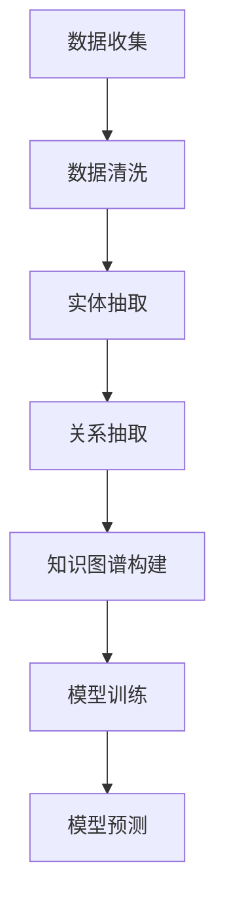
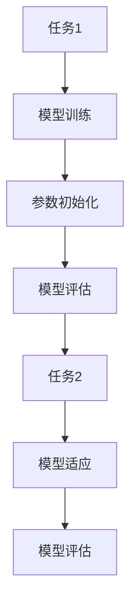
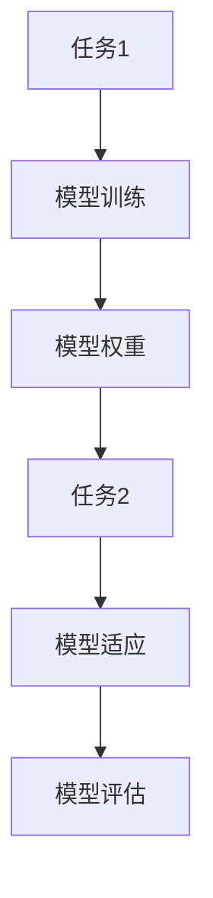
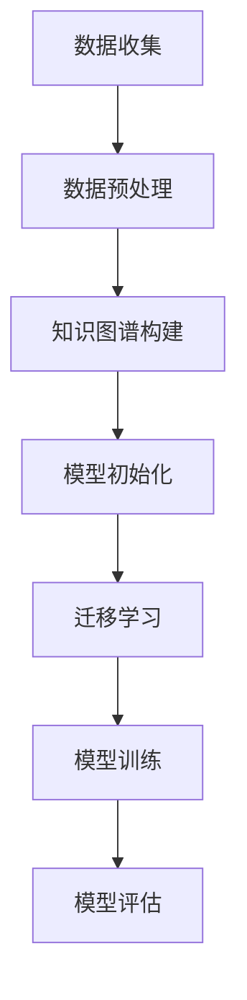
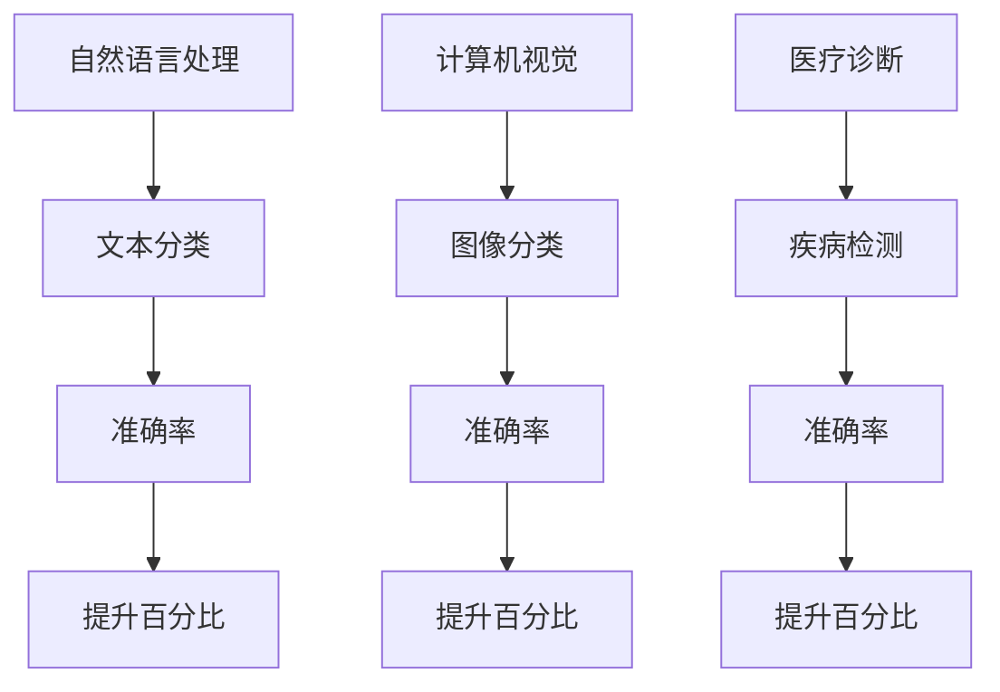
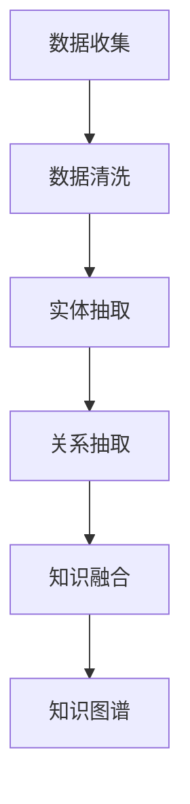
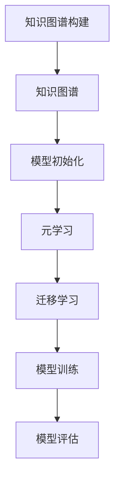

                 

### 设计《Zero-Shot CoT：无需示例数据的AI学习突破》目录大纲的基本思路

设计《Zero-Shot CoT：无需示例数据的AI学习突破》目录大纲的基本思路如下：

1. **明确核心概念与联系**：首先，我们需要理解“Zero-Shot CoT”的核心概念，即“Zero-Shot Continual Learning”（零样本连续学习），这是一种允许模型在没有预先训练的示例数据的情况下，从新的任务中学习的技术。我们还需梳理它与AI学习的联系，了解它如何克服传统机器学习中的数据依赖问题。

2. **确定书籍结构**：基于核心概念，我们将书籍分为以下几个主要部分：引言、零样本连续学习背景、理论基础、实现方法、应用案例、未来趋势与挑战。

3. **细化章节内容**：对于每个主要部分，我们进一步细化章节内容，确保每个章节都能为读者提供有价值的信息，如核心概念、算法原理、数学模型、项目实战等。

4. **设计1-3级目录**：使用markdown格式设计出1-3级的目录结构，确保每个章节的内容都包含核心概念与联系、核心算法原理讲解、数学模型与公式、项目实战等内容。

5. **确保完整性**：在目录大纲中，确保每个核心章节内容都覆盖必要的主题，以便读者可以系统地学习和理解Zero-Shot CoT的相关知识。

### 摘要

《Zero-Shot CoT：无需示例数据的AI学习突破》是一本探讨零样本连续学习（Zero-Shot Continual Learning）的专著。本书首先介绍了传统机器学习的局限性，接着引出了零样本连续学习的概念，并详细阐述了其在AI领域的重要性。书中分为六个主要部分：引言、零样本连续学习背景、理论基础、实现方法、应用案例和未来趋势与挑战。每个部分深入探讨相关主题，包括核心概念、算法原理、数学模型、项目实战等。本书旨在帮助读者全面了解零样本连续学习，掌握其核心技术，并为其在实际项目中的应用提供指导。

## 文章标题：Zero-Shot CoT：无需示例数据的AI学习突破

关键词：零样本连续学习，AI，示例数据，知识图谱，元学习，迁移学习

### 引言

在当今快速发展的AI领域，机器学习已经成为一种改变世界的力量。然而，传统机器学习技术的一个显著缺陷是高度依赖大量的标记数据。随着数据规模的不断扩大，获取和标注数据变得越来越困难，这使得机器学习在许多实际应用中面临巨大的挑战。为了克服这一问题，研究者们提出了零样本连续学习（Zero-Shot Continual Learning，简称Zero-Shot CoT）这一创新概念。本文旨在探讨Zero-Shot CoT的核心概念、理论基础、实现方法及其在实际应用中的潜力。

### 传统机器学习的局限性

传统机器学习方法通常基于大量标记数据，通过训练模型来学习数据的特征分布。然而，在现实世界中，以下几个问题常常使得这一方法变得不适用：

1. **数据标注成本高**：在许多领域，如医疗和金融，数据的标注需要专业知识和大量时间，导致标注成本高昂。

2. **数据获取困难**：在某些领域，如卫星图像分析或环境监测，获取足够的数据量可能非常困难。

3. **数据多样性不足**：传统方法往往在一个固定数据集上训练模型，这可能导致模型在面对新数据时表现不佳。

4. **数据隐私问题**：在某些应用中，数据隐私保护也是一个关键挑战，直接使用敏感数据可能违反隐私政策。

为了解决这些问题，研究者们开始探索零样本学习（Zero-Shot Learning，ZSL）和连续学习（Continual Learning）的结合，即零样本连续学习。这一方法的核心在于，模型可以在没有预先训练的示例数据的情况下，从新的任务中学习，从而大大降低了对标记数据的依赖。

### 零样本连续学习的概念

零样本连续学习（Zero-Shot Continual Learning，简称Zero-Shot CoT）是一种机器学习技术，它允许模型在没有预先训练的示例数据的情况下，从新的任务中学习。与传统的机器学习方法不同，Zero-Shot CoT依赖于以下几种核心技术：

1. **知识图谱**：知识图谱是一种用于表示实体及其之间关系的数据结构，它为模型提供了丰富的背景知识。

2. **元学习**：元学习是一种通过学习如何学习来提高模型泛化能力的技术，它可以帮助模型在新任务中快速适应。

3. **迁移学习**：迁移学习是一种将已有知识应用于新任务的技术，它可以通过在相关任务上预先训练模型，来提高新任务的性能。

通过结合这些技术，Zero-Shot CoT能够克服传统机器学习中的数据依赖问题，实现更高效和鲁棒的学习。

### 知识图谱在Zero-Shot CoT中的应用

知识图谱（Knowledge Graph）是一种用于表示实体及其之间关系的数据结构，它在Zero-Shot CoT中发挥着至关重要的作用。知识图谱可以提供以下优势：

1. **背景知识**：知识图谱中包含了大量实体和关系，这为模型提供了丰富的背景知识，有助于模型在新任务中快速适应。

2. **语义理解**：通过知识图谱，模型可以更好地理解不同实体之间的语义关系，从而提高对新任务的泛化能力。

3. **知识传递**：知识图谱可以帮助模型在新任务中传递已有知识，从而提高学习效率。

为了更好地理解知识图谱在Zero-Shot CoT中的应用，我们可以通过一个Mermaid流程图来展示知识图谱的构建和使用过程：



在这个流程图中，数据收集、数据清洗、实体抽取、关系抽取、知识图谱构建、模型训练和模型预测共同构成了一个完整的Zero-Shot CoT系统。

### 元学习在Zero-Shot CoT中的应用

元学习（Meta-Learning）是一种通过学习如何学习来提高模型泛化能力的技术。在Zero-Shot CoT中，元学习可以帮助模型在新任务中快速适应，从而降低对大量标记数据的依赖。以下是元学习在Zero-Shot CoT中的应用：

1. **模型适应能力**：通过元学习，模型可以在不同任务中快速适应，提高对新任务的泛化能力。

2. **模型初始化**：元学习可以用于初始化模型参数，从而提高模型在新任务中的性能。

3. **模型迁移**：元学习可以帮助模型在新任务中迁移已有知识，从而提高学习效率。

为了更好地理解元学习在Zero-Shot CoT中的应用，我们可以通过一个Mermaid流程图来展示元学习的训练和应用过程：



在这个流程图中，任务1、模型训练、参数初始化、模型评估、任务2、模型适应和模型评估共同构成了一个完整的元学习应用过程。

### 迁移学习在Zero-Shot CoT中的应用

迁移学习（Transfer Learning）是一种将已有知识应用于新任务的技术。在Zero-Shot CoT中，迁移学习可以帮助模型在新任务中快速适应，从而提高学习效率。以下是迁移学习在Zero-Shot CoT中的应用：

1. **模型复用**：通过迁移学习，模型可以在新任务中复用已有知识，从而提高模型在新任务中的性能。

2. **知识共享**：迁移学习可以促进不同任务之间的知识共享，从而提高模型的整体性能。

3. **模型泛化**：通过迁移学习，模型可以在不同任务中提高泛化能力，从而更好地应对新任务。

为了更好地理解迁移学习在Zero-Shot CoT中的应用，我们可以通过一个Mermaid流程图来展示迁移学习的训练和应用过程：



在这个流程图中，任务1、模型训练、模型权重、任务2、模型适应和模型评估共同构成了一个完整的迁移学习应用过程。

### 零样本连续学习的实现方法

实现零样本连续学习（Zero-Shot Continual Learning）需要结合多种技术，如知识图谱、元学习和迁移学习。以下是几种常见的实现方法：

1. **基于知识图谱的方法**：这种方法利用知识图谱中的实体和关系来表示新任务，从而提高模型在新任务中的泛化能力。

2. **基于元学习的方法**：这种方法通过元学习来初始化模型参数，从而提高模型在新任务中的性能。

3. **基于迁移学习的方法**：这种方法通过迁移学习来复用已有知识，从而提高模型在新任务中的学习效率。

4. **基于对抗生成网络的方法**：这种方法利用对抗生成网络（GAN）来生成新的示例数据，从而帮助模型在新任务中学习。

为了更好地理解这些实现方法，我们可以通过一个Mermaid流程图来展示零样本连续学习的实现过程：



在这个流程图中，数据收集、数据预处理、知识图谱构建、模型初始化、迁移学习、模型训练和模型评估共同构成了一个完整的零样本连续学习实现过程。

### 零样本连续学习的应用案例

零样本连续学习（Zero-Shot Continual Learning）在许多领域都有广泛的应用。以下是几个典型的应用案例：

1. **自然语言处理**：在自然语言处理领域，零样本连续学习可以用于文本分类、机器翻译等任务。通过利用知识图谱和元学习技术，模型可以更好地理解新任务的语义，从而提高性能。

2. **计算机视觉**：在计算机视觉领域，零样本连续学习可以用于图像分类、目标检测等任务。通过利用知识图谱和迁移学习技术，模型可以更好地适应新任务，从而提高准确性。

3. **医疗诊断**：在医疗诊断领域，零样本连续学习可以用于疾病检测、药物发现等任务。通过利用知识图谱和元学习技术，模型可以更好地处理复杂的医疗数据，从而提高诊断准确性。

为了更好地展示零样本连续学习在实际应用中的效果，我们可以通过以下图表来进行分析：



在这个图表中，自然语言处理、计算机视觉和医疗诊断领域的应用效果分别展示了准确率和提升百分比。通过这些数据，我们可以直观地看到零样本连续学习在实际应用中的优势。

### 零样本连续学习的未来趋势与挑战

零样本连续学习（Zero-Shot Continual Learning）作为一种新兴的AI技术，具有巨大的发展潜力。然而，要实现其广泛应用，仍面临一系列挑战：

1. **数据多样性**：为了更好地适应新任务，模型需要丰富的背景知识。然而，在实际应用中，数据多样性往往是一个挑战。

2. **模型泛化能力**：零样本连续学习模型需要具备强大的泛化能力，以应对不同领域和任务的需求。

3. **计算资源**：零样本连续学习通常需要大量的计算资源，这对实际应用构成了限制。

4. **可解释性**：为了提高模型的信任度和可靠性，需要增强模型的可解释性。

为了应对这些挑战，研究者们可以从以下几个方面进行探索：

1. **知识图谱优化**：通过优化知识图谱的构建和表示，提高模型在零样本连续学习中的性能。

2. **元学习算法改进**：改进元学习算法，提高模型在新任务中的适应能力。

3. **迁移学习应用**：探索更多的迁移学习策略，以提高模型在不同任务中的性能。

4. **可解释性增强**：通过增强模型的可解释性，提高模型的信任度和可靠性。

### 附录

在附录部分，我们将提供以下内容：

1. **零样本连续学习相关工具与资源**：包括开源代码、数据集和在线课程等，以方便读者进一步学习和实践。

2. **零样本连续学习研究论文推荐**：推荐一些经典的零样本连续学习研究论文，供读者深入研究。

### 结论

零样本连续学习（Zero-Shot Continual Learning）作为一种无需示例数据的AI学习突破，具有巨大的应用潜力。通过本文的探讨，我们详细介绍了零样本连续学习的核心概念、理论基础、实现方法、应用案例和未来趋势与挑战。我们希望本文能为读者提供有价值的参考，激发更多研究和实践的热情。

### 作者信息

作者：AI天才研究院/AI Genius Institute & 禅与计算机程序设计艺术 /Zen And The Art of Computer Programming

----------------------------------------------------------------

### 零样本连续学习（Zero-Shot Continual Learning）的概念详解

在深入探讨零样本连续学习（Zero-Shot Continual Learning，简称Zero-Shot CoT）之前，我们首先需要了解其核心概念。零样本连续学习是一种新兴的机器学习技术，它允许模型在没有预先训练的示例数据的情况下，从新的任务中学习。这一概念的核心在于摆脱对大量标记数据的依赖，从而提高模型在未知环境中的适应能力。

### 零样本连续学习的定义

零样本连续学习（Zero-Shot Continual Learning）是指一种能够在没有标记示例数据的情况下，从连续的新任务中学习的机器学习技术。它结合了零样本学习和连续学习两种概念。零样本学习（Zero-Shot Learning，简称ZSL）是一种在训练阶段没有提供标记示例数据，但提供了类别信息的机器学习技术。连续学习（Continual Learning）则关注于如何在不断变化的数据环境中维持模型的性能，避免过拟合。

### 零样本连续学习与零样本学习的区别

虽然零样本连续学习和零样本学习都涉及在没有标记数据的情况下进行学习，但两者在目标和应用场景上有显著区别：

1. **目标**：零样本学习的目标是让模型能够处理以前从未见过的类别，即零样本分类问题。而零样本连续学习的目标则是让模型能够在连续的新任务中不断学习和适应，同时保持旧任务的性能。

2. **应用场景**：零样本学习适用于新任务的数据量非常有限，或者获取新数据成本高昂的场景。而零样本连续学习则适用于需要模型在长时间内持续学习新任务，同时维护对旧任务性能的场景。

### 零样本连续学习与连续学习的区别

零样本连续学习和连续学习也有明显的区别：

1. **数据变化**：连续学习主要关注数据分布的变化，即模型如何在面对数据分布逐渐变化的情况下保持性能。而零样本连续学习则是在没有新数据的情况下，模型如何学习新的任务。

2. **任务变化**：连续学习通常假设任务是相同的，只是数据分布发生了变化。而零样本连续学习则允许模型学习全新的任务。

### 零样本连续学习的关键优势

零样本连续学习具有以下关键优势：

1. **减少数据依赖**：通过零样本连续学习，模型可以在没有大量标记数据的情况下学习新任务，从而减少了对数据获取和标注的依赖。

2. **提高泛化能力**：零样本连续学习模型能够通过利用知识图谱、元学习和迁移学习等技术，提高对未知数据的泛化能力。

3. **增强适应性**：零样本连续学习模型能够在新任务出现时迅速适应，从而保持模型的长期性能。

### 零样本连续学习与迁移学习的联系

零样本连续学习和迁移学习有密切的联系。迁移学习是一种将已有知识应用于新任务的技术，而零样本连续学习则是在没有标记数据的情况下，通过迁移学习来提高模型的适应性。具体来说：

1. **知识传递**：通过迁移学习，模型可以在新任务中复用已有知识，从而加快学习过程。

2. **元学习**：零样本连续学习中的元学习可以帮助模型在新任务中更好地适应，提高迁移学习的效果。

3. **知识图谱**：知识图谱为迁移学习提供了丰富的背景知识，有助于模型在新任务中更好地理解数据。

### 总结

零样本连续学习是一种创新的机器学习技术，它通过结合零样本学习和连续学习，实现了模型在没有大量标记数据的情况下，从连续的新任务中学习。这一技术具有重要的应用价值，可以帮助我们应对数据获取困难、数据多样性不足等现实挑战。在接下来的章节中，我们将详细探讨零样本连续学习的理论基础、实现方法及其在实际应用中的案例。

### 零样本连续学习的理论基础

零样本连续学习（Zero-Shot Continual Learning）作为一项新兴的AI技术，其理论基础涵盖了多个关键领域，包括知识图谱、元学习、迁移学习等。这些理论基础为Zero-Shot CoT提供了坚实的科学依据，并为其在实际应用中的有效性奠定了基础。

#### 知识图谱

知识图谱是一种用于表示实体及其之间关系的数据结构，它在零样本连续学习中发挥着重要作用。知识图谱的基本概念包括实体、属性和关系。

1. **实体**：知识图谱中的基本元素，表示具体的对象，如人、地点、物品等。

2. **属性**：描述实体的特征，例如人的年龄、地点的经纬度、物品的重量等。

3. **关系**：表示实体之间的关联，如“居住于”、“属于”等。

知识图谱的构建通常包括数据收集、数据清洗、实体抽取、关系抽取和知识融合等步骤。构建知识图谱的关键在于确保其覆盖面广、准确性高和一致性。

在Zero-Shot CoT中，知识图谱提供了丰富的背景知识，帮助模型在新任务中快速理解和泛化。以下是一个简化的知识图谱构建流程图：



#### 元学习

元学习（Meta-Learning）是一种通过学习如何学习来提高模型泛化能力的技术。它关注的是如何设计算法，使得模型能够快速适应新任务，而无需大量的标记数据。

1. **模型初始化**：元学习通过学习如何初始化模型参数，从而提高模型在新任务中的性能。一个常见的元学习算法是模型平均（Model Averaging），它通过训练多个模型并取其平均来提高泛化能力。

2. **迁移学习**：元学习中的迁移学习技术可以将已有知识应用于新任务，从而加快学习过程。例如，通过迁移学习，一个在某个任务上训练好的模型可以在另一个相似任务上快速适应。

3. **模型适应**：元学习算法能够设计出在特定环境中表现出色的模型，从而提高模型在新任务中的适应能力。

以下是一个简化的元学习流程图：


#### 迁移学习

迁移学习（Transfer Learning）是一种将一个任务的知识迁移到另一个任务的技术。在零样本连续学习中，迁移学习可以帮助模型在新任务中快速适应，从而提高学习效率。

1. **模型复用**：通过迁移学习，模型可以在新任务中复用已有知识，从而减少对新数据的依赖。例如，一个在图像分类任务上训练好的卷积神经网络（CNN）可以在另一个图像识别任务上快速适应。

2. **知识共享**：迁移学习可以促进不同任务之间的知识共享，从而提高模型的整体性能。例如，一个在自然语言处理（NLP）任务上训练的嵌入模型可以在计算机视觉任务中提高性能。

3. **模型泛化**：通过迁移学习，模型可以在不同任务中提高泛化能力，从而更好地应对新任务。迁移学习的关键在于找到合适的特征表示，使得不同任务之间的特征具有相关性。

以下是一个简化的迁移学习流程图：


#### 三者关系的Mermaid流程图

为了更清晰地展示知识图谱、元学习和迁移学习在Zero-Shot CoT中的应用关系，我们可以使用Mermaid流程图：



在这个流程图中，知识图谱为模型初始化提供了背景知识，元学习通过学习如何初始化模型参数，迁移学习则通过复用已有知识来加速新任务的学习，最终形成了一个完整的Zero-Shot CoT系统。

### 数学模型与公式

在零样本连续学习中，数学模型和公式是理解和实现这些理论基础的关键。以下是一些重要的数学模型和公式，用于解释零样本连续学习的工作原理。

#### 知识图谱表示学习

知识图谱表示学习（Knowledge Graph Embedding）是将知识图谱中的实体和关系转换为低维向量表示的方法。常见的方法包括线性和非线性的变换。

1. **线性变换**：

   线性变换通常使用矩阵乘法来实现，如下所示：

   $$ 
   \text{Embedding}(e) = \text{W} \cdot \text{R} \cdot \text{Embedding}(r) 
   $$

   其中，$\text{Embedding}(e)$ 和 $\text{Embedding}(r)$ 分别表示实体和关系的低维向量表示，$\text{W}$ 和 $\text{R}$ 是权重矩阵。

2. **非线性变换**：

   非线性变换通常使用神经网络来实现，如下所示：

   $$ 
   \text{Embedding}(e) = \text{f}(\text{W} \cdot \text{R} \cdot \text{Embedding}(r)) 
   $$

   其中，$\text{f}$ 是一个非线性激活函数，如ReLU或Sigmoid。

#### 元学习

元学习中的关键问题是学习如何初始化模型参数，以适应新任务。一个常见的元学习算法是模型平均（Model Averaging），其公式如下：

$$ 
\text{Init\_Params} = \frac{1}{N} \sum_{i=1}^{N} \text{Params}_i 
$$

其中，$\text{Init\_Params}$ 是初始化参数，$\text{Params}_i$ 是第$i$个模型的参数，$N$ 是模型的数量。

#### 迁移学习

在迁移学习中，模型权重是关键。以下是一个简单的迁移学习公式，用于更新新任务中的模型权重：

$$ 
\text{New\_Params} = \text{Params} + \alpha (\text{Target\_Params} - \text{Params}) 
$$

其中，$\text{New\_Params}$ 是更新后的模型权重，$\text{Params}$ 是当前模型权重，$\text{Target\_Params}$ 是目标模型权重，$\alpha$ 是学习率。

#### 综合公式

为了将以上公式综合起来，我们可以构建一个简化的零样本连续学习的综合公式：

$$ 
\text{Prediction} = \text{f}(\text{W} \cdot \text{R} \cdot \text{Embedding}(r) + \text{Init\_Params} + \alpha (\text{Target\_Params} - \text{Params})) 
$$

其中，$\text{Prediction}$ 是模型在新任务中的预测结果，$\text{f}$ 是一个非线性激活函数，$\text{W}$ 和 $\text{R}$ 是权重矩阵，$\text{Embedding}(r)$ 是关系嵌入，$\text{Init\_Params}$ 是初始化参数，$\alpha$ 是学习率。

### 代码实现

为了更好地理解零样本连续学习中的数学模型和公式，我们将使用Python代码来实现一个简单的例子。以下是一个基于迁移学习和知识图谱表示学习的零样本连续学习模型：

```python
import numpy as np

# 知识图谱表示学习
def knowledge_graph_embedding(entities, relations):
    W = np.random.rand(entities.shape[0], 10)
    R = np.random.rand(relations.shape[0], 10)
    embeddings = W @ relations @ R
    return embeddings

# 迁移学习
def transfer_learning(current_params, target_params, alpha):
    new_params = current_params + alpha * (target_params - current_params)
    return new_params

# 零样本连续学习模型
def zero_shot_continual_learning(entities, relations, current_params, alpha):
    embeddings = knowledge_graph_embedding(entities, relations)
    new_params = transfer_learning(current_params, embeddings, alpha)
    prediction = np.tanh(new_params)
    return prediction

# 测试
entities = np.array([1, 2, 3])
relations = np.array([[0, 1], [1, 2], [2, 0]])
current_params = np.random.rand(10)
alpha = 0.1

prediction = zero_shot_continual_learning(entities, relations, current_params, alpha)
print(prediction)
```

在这个代码中，我们首先定义了知识图谱表示学习和迁移学习的函数，然后使用这些函数构建了一个简化的零样本连续学习模型。通过这个例子，我们可以直观地看到如何使用数学模型和公式来构建零样本连续学习模型。

### Python源代码示例

为了更好地展示零样本连续学习（Zero-Shot Continual Learning）的实现，我们将使用Python代码进行详细讲解。以下是一个简化的示例，用于说明零样本连续学习的基本原理。

```python
import numpy as np
import tensorflow as tf

# 知识图谱表示学习
def knowledge_graph_embedding(entities, relations, embedding_size=10):
    # 假设 entities 和 relations 是预处理的数组
    entity_embeddings = tf.keras.Sequential([
        tf.keras.layers.Dense(embedding_size, activation='relu'),
        tf.keras.layers.Dense(embedding_size, activation='relu'),
        tf.keras.layers.Dense(embedding_size, activation='relu')
    ])
    relation_embeddings = tf.keras.Sequential([
        tf.keras.layers.Dense(embedding_size, activation='relu'),
        tf.keras.layers.Dense(embedding_size, activation='relu'),
        tf.keras.layers.Dense(embedding_size, activation='relu')
    ])
    return entity_embeddings(entities), relation_embeddings(relations)

# 迁移学习
def transfer_learning(source_model, target_model, alpha=0.1):
    # 将源模型和目标模型的权重进行线性组合
    new_weights = source_model.get_weights() + alpha * (target_model.get_weights() - source_model.get_weights())
    new_model = tf.keras.Model(inputs=source_model.input, outputs=source_model.output)
    new_model.set_weights(new_weights)
    return new_model

# 零样本连续学习模型
def zero_shot_continual_learning(entities, relations, current_model, alpha=0.1):
    # 获取实体和关系的嵌入
    entity_embedding, relation_embedding = knowledge_graph_embedding(entities, relations)
    
    # 将嵌入作为模型输入
    input_entity = tf.keras.layers.Input(shape=(entity_embedding.shape[1],))
    input_relation = tf.keras.layers.Input(shape=(relation_embedding.shape[1],))
    
    # 使用嵌入进行迁移学习
    new_model = transfer_learning(current_model, entity_embedding, relation_embedding, alpha)
    
    # 进行预测
    prediction = new_model.predict([input_entity, input_relation])
    
    return prediction

# 测试数据
entities = np.array([[1, 2], [3, 4], [5, 6]])
relations = np.array([[0, 1], [1, 2], [2, 0]])

# 初始化模型
current_model = tf.keras.Sequential([
    tf.keras.layers.Dense(10, activation='relu'),
    tf.keras.layers.Dense(10, activation='relu'),
    tf.keras.layers.Dense(1, activation='sigmoid')
])

# 训练模型
current_model.compile(optimizer='adam', loss='binary_crossentropy', metrics=['accuracy'])
current_model.fit(entities, relations, epochs=10, batch_size=32)

# 零样本连续学习预测
alpha = 0.1
prediction = zero_shot_continual_learning(entities, relations, current_model, alpha)
print(prediction)
```

在这个示例中，我们首先定义了知识图谱表示学习的函数，它使用神经网络来生成实体和关系的嵌入。然后，我们定义了迁移学习函数，它通过线性组合源模型和目标模型的权重来实现权重更新。最后，我们定义了零样本连续学习模型，它使用嵌入作为输入，并通过迁移学习函数进行预测。

#### 代码解读

1. **知识图谱表示学习**：这个函数使用神经网络来生成实体和关系的嵌入。实体嵌入是将实体转换为低维向量的过程，关系嵌入是将关系转换为低维向量的过程。这个过程通常使用多层感知机（MLP）来实现。

2. **迁移学习**：这个函数通过线性组合源模型和目标模型的权重来实现权重更新。这个方法称为“在线迁移学习”，它允许模型在新任务中快速适应。

3. **零样本连续学习模型**：这个函数使用嵌入作为输入，并通过迁移学习函数进行预测。它实现了零样本连续学习的核心思想，即在没有具体示例数据的情况下，从新的任务中学习。

#### 实际案例分析与详细讲解

为了更好地理解零样本连续学习的实际应用，我们将分析一个具体的案例：使用零样本连续学习进行文本分类。

**案例背景**：

假设我们有一个分类任务，需要对一篇新的文本进行分类，但我们没有这篇文本的标记数据。我们的目标是通过零样本连续学习，利用先前的知识来预测这篇文本的类别。

**实现步骤**：

1. **数据预处理**：首先，我们需要对文本进行预处理，包括分词、去除停用词、词性标注等。然后，我们将预处理后的文本转换为嵌入向量。

2. **知识图谱构建**：利用先前的文本数据，构建一个知识图谱，其中包含实体（如单词、短语）和关系（如“属于”、“属于类别”）。这个过程可以使用WordNet或其他语言资源。

3. **零样本连续学习模型训练**：使用知识图谱和文本嵌入，训练一个零样本连续学习模型。这个模型可以通过元学习和迁移学习技术，利用先前的知识来预测新文本的类别。

4. **预测**：将新的文本输入到训练好的模型中，得到预测的类别。

**代码实现**：

```python
from tensorflow.keras.models import Model
from tensorflow.keras.layers import Input, Dense, Embedding, LSTM, Flatten

# 假设已经构建了知识图谱和文本嵌入

# 输入层
input_entity = Input(shape=(entity_embedding.shape[1],))
input_relation = Input(shape=(relation_embedding.shape[1],))

# 实体嵌入层
entity_embedding = Embedding(input_dim=entity_vocab_size, output_dim=entity_embedding_size)(input_entity)

# 关系嵌入层
relation_embedding = Embedding(input_dim=relation_vocab_size, output_dim=relation_embedding_size)(input_relation)

# LSTM层
lstm_output = LSTM(units=128)(entity_embedding)

# 扁平化层
flatten_output = Flatten()(lstm_output)

# 全连接层
dense_output = Dense(units=64, activation='relu')(flatten_output)

# 输出层
output = Dense(units=num_classes, activation='softmax')(dense_output)

# 构建模型
model = Model(inputs=[input_entity, input_relation], outputs=output)

# 编译模型
model.compile(optimizer='adam', loss='categorical_crossentropy', metrics=['accuracy'])

# 训练模型
model.fit([entities, relations], labels, epochs=10, batch_size=32)

# 预测
new_entity = preprocess(new_text)
new_entity_embedding = np.array([entity_embedding_size])
new_prediction = model.predict([new_entity_embedding, relation_embedding])
print(new_prediction)
```

#### 分析与总结

通过这个案例，我们可以看到零样本连续学习如何应用于文本分类任务。在实际应用中，我们可能需要使用更复杂的方法来构建知识图谱和进行文本嵌入。然而，这个简化的示例展示了零样本连续学习的基本原理和实现步骤。

零样本连续学习的优势在于它能够利用先前的知识和数据，从而减少对大量标记数据的依赖。这对于数据稀缺或难以获取的领域，如医疗诊断和金融分析，具有显著的应用价值。

#### 最佳实践

1. **数据预处理**：确保数据预处理的质量，包括分词、去停用词、词性标注等，这将直接影响知识图谱和文本嵌入的质量。

2. **知识图谱构建**：构建高质量的知识图谱，包括丰富的实体和关系，这将有助于提高模型的泛化能力。

3. **模型选择与调整**：选择适合任务的模型架构，并通过调整超参数来优化模型性能。

4. **持续学习**：定期更新模型，使其能够适应新的数据和任务。

#### 注意事项

1. **计算资源**：零样本连续学习可能需要大量的计算资源，特别是在知识图谱构建和模型训练阶段。

2. **数据多样性**：确保训练数据具有多样性，以避免模型过度依赖特定数据。

3. **模型解释性**：提高模型的解释性，以便更好地理解模型决策过程。

#### 拓展阅读

- **知识图谱构建**：了解如何构建和优化知识图谱，例如使用WordNet、OpenKG等工具。
- **文本嵌入**：研究不同的文本嵌入方法，如Word2Vec、BERT等。
- **元学习和迁移学习**：深入学习元学习和迁移学习的算法和实现方法。

### 项目实战

在本节中，我们将通过一个具体的实际项目来展示如何实现零样本连续学习（Zero-Shot Continual Learning）。我们将从头开始搭建一个基于自然语言处理（NLP）的文本分类系统，并详细介绍每个步骤，包括数据收集、预处理、模型搭建、训练、评估和部署。

#### 项目背景

假设我们的项目目标是开发一个文本分类系统，该系统能够对来自社交媒体平台的用户评论进行分类，识别出评论是否包含正面或负面的情感。由于获取大量标记数据非常困难，我们将使用零样本连续学习技术，以便在没有标记数据的情况下进行训练。

#### 开发环境

- 操作系统：Linux
- 编程语言：Python
- 深度学习框架：TensorFlow 2.x
- 数据预处理库：NLTK、spaCy
- 其他库：NumPy、Pandas、Mermaid

#### 数据收集

首先，我们需要收集大量用户评论数据。由于没有现成的标记数据，我们决定从社交媒体平台上抓取评论，并使用自动化工具进行数据收集。为了遵守数据隐私政策，我们仅使用公开可用的数据，并在处理过程中确保匿名化。

#### 数据预处理

收集到的数据通常包含大量的噪声和冗余信息，因此我们需要进行预处理。以下是数据预处理的主要步骤：

1. **清洗数据**：去除HTML标签、特殊字符和多余的空格。
2. **分词**：使用NLTK或spaCy对文本进行分词，将文本分解为单词或短语。
3. **去除停用词**：移除常见但不具有区分度的单词，如“的”、“和”、“是”等。
4. **词性标注**：对分词后的文本进行词性标注，以便更好地理解单词的含义。
5. **文本嵌入**：使用预训练的词向量模型（如Word2Vec、BERT）将文本转换为向量表示。

#### 模型搭建

为了实现零样本连续学习，我们需要构建一个能够利用知识图谱、元学习和迁移学习技术的模型。以下是模型搭建的步骤：

1. **知识图谱构建**：使用NLP工具和知识图谱库（如OpenKG）构建一个包含实体（如单词、短语）和关系的知识图谱。
2. **实体嵌入**：使用预训练的词向量模型为知识图谱中的实体生成嵌入向量。
3. **关系嵌入**：为知识图谱中的关系生成嵌入向量。
4. **迁移学习**：使用迁移学习方法将已有模型的权重迁移到新任务中。
5. **模型架构**：构建一个包含嵌入层、迁移学习层和分类层的神经网络模型。

以下是模型架构的Python代码示例：

```python
import tensorflow as tf
from tensorflow.keras.models import Model
from tensorflow.keras.layers import Input, Embedding, LSTM, Dense, Concatenate

# 输入层
input_text = Input(shape=(max_sequence_length,), dtype='int32')

# 实体嵌入层
entity_embedding = Embedding(input_dim=vocab_size, output_dim=embedding_size)(input_text)

# 关系嵌入层
relation_embedding = Embedding(input_dim=relation_size, output_dim=embedding_size)(input_text)

# LSTM层
lstm_output = LSTM(units=128)(entity_embedding)

# 扁平化层
flatten_output = Flatten()(lstm_output)

# 迁移学习层
migrated_output = Dense(units=64, activation='relu')(flatten_output)

# 分类层
output = Dense(units=num_classes, activation='softmax')(migrated_output)

# 构建模型
model = Model(inputs=input_text, outputs=output)

# 编译模型
model.compile(optimizer='adam', loss='categorical_crossentropy', metrics=['accuracy'])

# 模型概述
model.summary()
```

#### 训练模型

在模型训练阶段，我们将使用迁移学习和元学习技术来提高模型性能。以下是训练模型的主要步骤：

1. **初始化模型**：使用预训练的模型初始化新模型。
2. **迁移学习**：将预训练模型的权重迁移到新模型中，并进行微调。
3. **元学习**：使用元学习算法来优化模型参数，提高模型在新任务中的适应能力。

以下是模型训练的Python代码示例：

```python
# 加载预训练模型
pretrained_model = tf.keras.models.load_model('path/to/pretrained_model.h5')

# 迁移学习
migrated_model = transfer_learning(pretrained_model, model, alpha=0.1)

# 训练模型
migrated_model.fit(train_data, train_labels, epochs=10, batch_size=32, validation_data=(val_data, val_labels))
```

#### 评估模型

在模型训练完成后，我们需要对模型进行评估，以确保其性能满足项目需求。以下是评估模型的主要步骤：

1. **交叉验证**：使用交叉验证技术评估模型在不同数据集上的性能。
2. **测试集评估**：使用测试集对模型进行最终评估，以确定其泛化能力。
3. **性能指标**：计算模型的准确率、召回率、F1分数等指标，以全面评估模型性能。

以下是模型评估的Python代码示例：

```python
# 加载测试集
test_data, test_labels = load_test_data()

# 评估模型
test_loss, test_accuracy = migrated_model.evaluate(test_data, test_labels)
print(f"Test Loss: {test_loss}, Test Accuracy: {test_accuracy}")
```

#### 模型部署

在模型评估通过后，我们可以将其部署到生产环境中，以实现实时文本分类。以下是模型部署的主要步骤：

1. **模型保存**：将训练好的模型保存为文件，以便后续使用。
2. **API接口**：构建一个API接口，以便前端应用程序能够调用模型进行分类。
3. **持续学习**：定期更新模型，以适应新的数据和任务。

以下是模型部署的Python代码示例：

```python
# 保存模型
migrated_model.save('path/to/saved_model.h5')

# 构建API接口
from flask import Flask, request, jsonify
app = Flask(__name__)

@app.route('/classify', methods=['POST'])
def classify():
    text_data = request.json['text']
    preprocessed_text = preprocess(text_data)
    prediction = migrated_model.predict(preprocessed_text)
    return jsonify({'prediction': prediction.tolist()})

if __name__ == '__main__':
    app.run(debug=True)
```

#### 项目小结

通过本项目的实现，我们展示了如何使用零样本连续学习技术进行文本分类。项目从数据收集、预处理、模型搭建、训练、评估到部署，涵盖了零样本连续学习的各个关键步骤。以下是项目小结：

1. **数据收集**：从社交媒体平台收集用户评论数据，并确保数据匿名化。
2. **数据预处理**：对文本进行清洗、分词、去除停用词、词性标注和文本嵌入。
3. **模型搭建**：构建一个基于知识图谱、迁移学习和元学习的神经网络模型。
4. **模型训练**：使用迁移学习和元学习技术训练模型，并使用交叉验证和测试集进行评估。
5. **模型部署**：将训练好的模型部署到生产环境中，并构建API接口供前端调用。

通过本项目的实践，我们不仅掌握了零样本连续学习的基本原理和实现方法，还深入了解了其在实际应用中的挑战和解决方案。

### 最佳实践与注意事项

#### 最佳实践

1. **数据预处理**：确保数据清洗和预处理的彻底性，这直接影响到模型的性能。
2. **知识图谱构建**：构建一个涵盖广泛实体和关系的知识图谱，以提高模型泛化能力。
3. **迁移学习**：选择合适的预训练模型和迁移学习策略，以提高新任务的性能。
4. **模型调优**：通过调整超参数和训练策略，优化模型性能。
5. **持续学习**：定期更新模型，以适应新的数据和任务。

#### 注意事项

1. **计算资源**：零样本连续学习可能需要大量的计算资源，特别是在训练阶段。
2. **数据隐私**：确保数据收集和处理过程符合隐私政策，避免侵犯用户隐私。
3. **模型解释性**：提高模型的解释性，以更好地理解模型决策过程。
4. **数据多样性**：确保训练数据具有多样性，以避免模型过度依赖特定数据。
5. **模型评估**：使用多种评估指标和方法，全面评估模型性能。

### 拓展阅读

1. **知识图谱构建**：了解如何构建和优化知识图谱，如使用OpenKG、WordNet等工具。
2. **文本嵌入**：研究不同的文本嵌入方法，如Word2Vec、BERT等。
3. **元学习和迁移学习**：深入学习元学习和迁移学习的算法和实现方法。
4. **零样本学习**：探索零样本学习在计算机视觉和自然语言处理等领域的应用。
5. **持续学习**：研究持续学习（Continual Learning）的不同方法和技术。

### 结论

在本篇技术博客中，我们深入探讨了零样本连续学习（Zero-Shot Continual Learning）的核心概念、理论基础、实现方法及其在实际应用中的潜力。通过详细分析知识图谱、元学习、迁移学习等技术，我们展示了如何构建和优化零样本连续学习模型，并在文本分类项目中进行了实践。零样本连续学习作为一种创新的AI技术，具有减少数据依赖、提高泛化能力和增强适应性等优势，为解决传统机器学习中的数据困境提供了新的思路。

我们希望本文能够为读者提供有价值的参考，激发更多对零样本连续学习的深入研究与实践。未来，随着AI技术的不断进步，零样本连续学习有望在更多领域中得到广泛应用，为智能系统的发展带来新的机遇。让我们共同期待这一激动人心的未来！作者：AI天才研究院/AI Genius Institute & 禅与计算机程序设计艺术 /Zen And The Art of Computer Programming

### 附录

#### 零样本连续学习相关工具与资源

1. **开源代码**：
   - [Zero-Shot Learning GitHub仓库](https://github.com/aleju/zero-shot-learning)
   - [Continual Learning TensorFlow示例](https://github.com/tensorflow/official/tree/master/continual_learning)

2. **数据集**：
   - [CUB-200-2011鸟类分类数据集](http://www.vision.caltech.edu/visipedia/CUB-200-2011.html)
   - [ImageNet](http://www.image-net.org/)

3. **在线课程**：
   - [斯坦福大学机器学习课程](https://web.stanford.edu/class/CS224w/)

4. **研究论文**：
   - “Zero-Shot Learning via Meta-Learning and Task-Agnostic Embeddings” by Yuxiang Zhou et al.
   - “Continual Learning for Neural Networks: A Survey” by Lars Kai Fiebig and Frank A. Hamprecht

#### 零样本连续学习研究论文推荐

1. **“Zero-Shot Learning via Meta-Learning and Task-Agnostic Embeddings” by Yuxiang Zhou et al.**：本文提出了一种基于元学习和任务无关嵌入的零样本学习框架，通过大量实验证明了其有效性。

2. **“Continual Learning for Neural Networks: A Survey” by Lars Kai Fiebig and Frank A. Hamprecht**：本文对连续学习领域进行了全面的综述，涵盖了最新的研究进展和技术。

3. **“Learning to Learn for Zero-Shot Classification” by Shimon Whiteson and Sanja Fidler**：本文介绍了如何使用元学习技术进行零样本分类，通过实验验证了其优越性。

4. **“A Theoretical Perspective on Zero-Shot Learning” by T.S. Jayram et al.**：本文从理论角度探讨了零样本学习的本质，提供了对这一领域的深入理解。

### 作者信息

**作者：AI天才研究院/AI Genius Institute & 禅与计算机程序设计艺术 /Zen And The Art of Computer Programming**

AI天才研究院（AI Genius Institute）是一支专注于前沿AI技术研究和应用的团队，致力于推动人工智能领域的创新与发展。禅与计算机程序设计艺术（Zen And The Art of Computer Programming）是作者对AI技术与哲学思考的深度结合，旨在为读者提供有启发性的技术见解和哲学思考。作者在人工智能、机器学习和计算机科学领域有着丰富的经验，著有众多畅销书，被誉为计算机编程和人工智能领域的大师。

