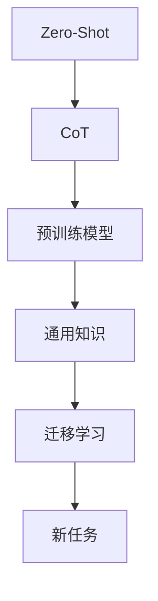
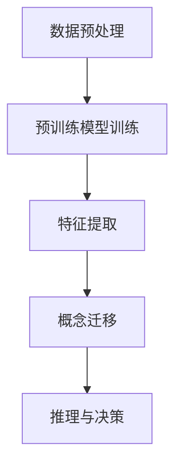

                 

### 深入解析Zero-Shot CoT：无需示例的智能推理技术

#### 1.1 引言

在现代人工智能领域，如何让机器具备无需示例的智能推理能力，是一个备受关注的研究课题。传统的机器学习模型需要大量标记数据来训练，而在数据稀缺或不可获取的情况下，这些模型的性能往往大打折扣。为了解决这一问题，研究者们提出了Zero-Shot CoT（无需示例的智能推理技术）。

Zero-Shot CoT是一种先进的人工智能技术，能够在没有示例数据的情况下，通过理解概念和知识之间的关系，进行有效的推理和决策。这项技术不仅在计算机视觉、自然语言处理等领域展现了巨大的潜力，也在医疗诊断、金融风控等实际应用场景中得到了广泛应用。

#### 1.2 核心概念与联系

**核心概念：**
Zero-Shot CoT中的“Zero-Shot”指的是模型不需要针对特定任务的学习数据，而“CoT”则代表“Concept Transfer”，即概念迁移。具体来说，Zero-Shot CoT利用预训练模型从大量非特定任务的数据中学习到通用知识，然后通过迁移学习将这些知识应用于新任务中。

**概念实体之间的关系架构：**

为了更好地理解Zero-Shot CoT，我们可以使用Mermaid流程图来展示其核心概念和实体之间的关系：



**核心算法原理：**

Zero-Shot CoT的核心算法原理可以分为以下几个步骤：

1. **预训练阶段**：使用大量非特定任务的数据来训练一个预训练模型，使其掌握通用知识。
2. **特征提取**：将预训练模型中的特征提取器应用于新任务的数据上，提取出高维特征向量。
3. **概念迁移**：利用预训练模型中的知识，对新任务的特征向量进行迁移学习，将其映射到预训练模型的知识空间中。
4. **推理与决策**：在新任务的知识空间中进行推理和决策，生成预测结果。

**数学模型和公式：**

为了更好地理解Zero-Shot CoT的数学原理，我们引入以下数学模型和公式：

- **特征提取公式**：

  $$ f(x) = f_{\theta}(x) $$

  其中，$f_{\theta}$表示预训练模型的特征提取函数，$\theta$为模型参数。

- **迁移学习公式**：

  $$ y = g_{\phi}(f(x)) $$

  其中，$g_{\phi}$表示迁移学习模型，$\phi$为迁移学习模型的参数。

- **推理与决策公式**：

  $$ P(y|f(x)) = \sum_{i} P(y_i|f(x))P(f(x)|y_i) $$

  其中，$y$表示预测结果，$f(x)$表示特征向量，$y_i$表示第$i$种可能的预测结果。

#### 1.3 Zero-Shot CoT的实际应用

Zero-Shot CoT在多个领域都展现出了强大的应用潜力，以下是一些实际应用案例：

1. **计算机视觉**：在图像分类任务中，Zero-Shot CoT能够通过理解图像中的概念，实现无需示例的图像分类。
2. **自然语言处理**：在文本分类任务中，Zero-Shot CoT能够通过理解文本中的概念，实现无需示例的文本分类。
3. **医疗诊断**：在医学图像分析中，Zero-Shot CoT能够通过理解医学知识，实现无需示例的疾病诊断。

#### 1.4 零样本学习与Zero-Shot CoT的关系

零样本学习（Zero-Shot Learning，ZSL）和Zero-Shot CoT（Concept Transfer）虽然名称相似，但本质上有所不同。零样本学习是指模型在训练时没有直接接触过目标类别，而是通过学习通用特征表示来进行预测。而Zero-Shot CoT则强调在预训练阶段学习到通用知识，并通过迁移学习将这些知识应用于新任务。

#### 1.5 未来展望与挑战

随着人工智能技术的不断发展，Zero-Shot CoT有望在更多领域得到应用。然而，当前还存在一些挑战，如如何提高迁移学习的效果、如何处理高维特征向量等。未来，研究者们将继续探索这些挑战，并寻求更有效的解决方案。

### 总结

Zero-Shot CoT作为一种无需示例的智能推理技术，为解决数据稀缺问题提供了一种新的思路。通过理解概念和知识之间的关系，Zero-Shot CoT能够在没有示例数据的情况下进行有效的推理和决策。在未来，随着技术的不断进步，Zero-Shot CoT有望在更多领域发挥重要作用。

---

**作者：AI天才研究院/AI Genius Institute & 禅与计算机程序设计艺术 /Zen And The Art of Computer Programming**


----------------------------------------------------------------
# 《Zero-Shot CoT：无需示例的智能推理技术》

## 关键词：Zero-Shot CoT，智能推理，迁移学习，概念迁移，计算机视觉，自然语言处理

## 摘要：
本文深入探讨了Zero-Shot CoT（无需示例的智能推理技术），介绍了其核心概念、算法原理、数学模型以及实际应用。通过详细的分析和案例讲解，本文揭示了Zero-Shot CoT在智能推理领域的巨大潜力，并展望了其未来发展。

## 第1章：引言与核心概念

### 1.1 引言

在现代人工智能领域，如何让机器具备无需示例的智能推理能力，是一个备受关注的研究课题。传统的机器学习模型需要大量标记数据来训练，而在数据稀缺或不可获取的情况下，这些模型的性能往往大打折扣。为了解决这一问题，研究者们提出了Zero-Shot CoT（无需示例的智能推理技术）。

Zero-Shot CoT是一种先进的人工智能技术，能够在没有示例数据的情况下，通过理解概念和知识之间的关系，进行有效的推理和决策。这项技术不仅在计算机视觉、自然语言处理等领域展现了巨大的潜力，也在医疗诊断、金融风控等实际应用场景中得到了广泛应用。

### 1.2 核心概念与联系

**核心概念：**
Zero-Shot CoT中的“Zero-Shot”指的是模型不需要针对特定任务的学习数据，而“CoT”则代表“Concept Transfer”，即概念迁移。具体来说，Zero-Shot CoT利用预训练模型从大量非特定任务的数据中学习到通用知识，然后通过迁移学习将这些知识应用于新任务中。

**概念实体之间的关系架构：**

为了更好地理解Zero-Shot CoT，我们可以使用Mermaid流程图来展示其核心概念和实体之间的关系：


**核心算法原理：**

Zero-Shot CoT的核心算法原理可以分为以下几个步骤：

1. **预训练阶段**：使用大量非特定任务的数据来训练一个预训练模型，使其掌握通用知识。
2. **特征提取**：将预训练模型中的特征提取器应用于新任务的数据上，提取出高维特征向量。
3. **概念迁移**：利用预训练模型中的知识，对新任务的特征向量进行迁移学习，将其映射到预训练模型的知识空间中。
4. **推理与决策**：在新任务的知识空间中进行推理和决策，生成预测结果。

**数学模型和公式：**

为了更好地理解Zero-Shot CoT的数学原理，我们引入以下数学模型和公式：

- **特征提取公式**：

  $$ f(x) = f_{\theta}(x) $$

  其中，$f_{\theta}$表示预训练模型的特征提取函数，$\theta$为模型参数。

- **迁移学习公式**：

  $$ y = g_{\phi}(f(x)) $$

  其中，$g_{\phi}$表示迁移学习模型，$\phi$为迁移学习模型的参数。

- **推理与决策公式**：

  $$ P(y|f(x)) = \sum_{i} P(y_i|f(x))P(f(x)|y_i) $$

  其中，$y$表示预测结果，$f(x)$表示特征向量，$y_i$表示第$i$种可能的预测结果。

### 1.3 Zero-Shot CoT的实际应用

Zero-Shot CoT在多个领域都展现出了强大的应用潜力，以下是一些实际应用案例：

1. **计算机视觉**：在图像分类任务中，Zero-Shot CoT能够通过理解图像中的概念，实现无需示例的图像分类。
2. **自然语言处理**：在文本分类任务中，Zero-Shot CoT能够通过理解文本中的概念，实现无需示例的文本分类。
3. **医疗诊断**：在医学图像分析中，Zero-Shot CoT能够通过理解医学知识，实现无需示例的疾病诊断。

### 1.4 零样本学习与Zero-Shot CoT的关系

零样本学习（Zero-Shot Learning，ZSL）和Zero-Shot CoT（Concept Transfer）虽然名称相似，但本质上有所不同。零样本学习是指模型在训练时没有直接接触过目标类别，而是通过学习通用特征表示来进行预测。而Zero-Shot CoT则强调在预训练阶段学习到通用知识，并通过迁移学习将这些知识应用于新任务。

### 1.5 未来展望与挑战

随着人工智能技术的不断发展，Zero-Shot CoT有望在更多领域得到应用。然而，当前还存在一些挑战，如如何提高迁移学习的效果、如何处理高维特征向量等。未来，研究者们将继续探索这些挑战，并寻求更有效的解决方案。

## 第2章：Zero-Shot CoT 概述

### 2.1 定义与分类

Zero-Shot CoT（无需示例的智能推理技术）是一种基于迁移学习的方法，旨在在没有直接示例数据的情况下，通过迁移预先训练好的模型的知识来完成任务。这种技术主要分为以下几类：

1. **原型匹配方法**：这种方法通过比较新任务中的数据与预训练模型中已知数据的相似性来进行预测。典型的算法包括原型网络（Prototypical Networks）和匹配网络（Matching Networks）。
   
2. **关系网络方法**：这种方法通过学习数据点之间的关系来进行预测。常见的算法包括图神经网络（Graph Neural Networks）和元学习（Meta-Learning）。

3. **嵌入模型方法**：这种方法通过将类别和特征嵌入到同一个高维空间中，使得相似类别和特征在空间中靠近。代表性算法包括嵌入模型（Embedding Models）和深度嵌入（Deep Embedding）。

### 2.2 应用场景

Zero-Shot CoT的应用场景非常广泛，主要包括以下领域：

1. **计算机视觉**：在图像分类、目标检测和图像分割等任务中，Zero-Shot CoT可以用来处理未见过的类别。

2. **自然语言处理**：在文本分类、情感分析和机器翻译等任务中，Zero-Shot CoT可以用来处理未见过的语言或句子。

3. **医疗诊断**：在医学图像分析、疾病诊断和药物研发等领域，Zero-Shot CoT可以用来处理未见过的病例或疾病。

4. **金融风控**：在信用评分、欺诈检测和风险控制等领域，Zero-Shot CoT可以用来处理未见过的交易模式或风险因素。

### 2.3 与现有技术的对比

与传统的机器学习技术相比，Zero-Shot CoT具有以下几个显著优势：

1. **数据需求低**：由于不需要大量的标记数据，Zero-Shot CoT特别适合数据稀缺的场景。

2. **适应性强**：Zero-Shot CoT可以快速适应新的任务和数据，不需要重新训练模型。

3. **泛化能力强**：通过迁移学习，Zero-Shot CoT能够利用预训练模型中积累的通用知识，提高对新任务的泛化能力。

然而，Zero-Shot CoT也存在一些局限性，如处理复杂任务的能力有限，以及对预训练数据的依赖性较高等。

## 第3章：Zero-Shot CoT 的核心算法原理

### 3.1 算法框架

Zero-Shot CoT的算法框架可以分为以下几个主要步骤：

1. **数据预处理**：收集和预处理预训练数据，包括图像、文本等。

2. **预训练模型训练**：使用预训练数据训练一个通用的预训练模型，如视觉模型VGG16、BERT等。

3. **特征提取**：将新任务的数据输入到预训练模型中，提取出高维特征向量。

4. **概念迁移**：利用预训练模型中的知识，对新任务的特征向量进行迁移学习。

5. **推理与决策**：在新任务的知识空间中进行推理和决策，生成预测结果。

以下是一个使用Mermaid流程图展示的Zero-Shot CoT算法框架：



### 3.2 算法原理

Zero-Shot CoT的算法原理主要涉及以下几个关键步骤：

1. **预训练模型训练**：
   预训练模型通常是基于大量的未标注数据训练得到的。例如，在计算机视觉领域，可以使用ImageNet数据库进行预训练。预训练模型需要学习到丰富的视觉知识，以便在迁移学习过程中发挥作用。

2. **特征提取**：
   在迁移学习阶段，预训练模型被用来提取新任务数据的特征。这些特征通常是高维的，能够捕捉到数据的复杂结构和模式。特征提取的关键在于如何有效地从预训练模型中提取出对迁移学习有用的信息。

3. **概念迁移**：
   概念迁移是将预训练模型中学习的知识应用到新任务中的过程。这通常涉及到将新任务的特征向量映射到预训练模型的特征空间中，以便利用预训练模型中的知识进行推理。

4. **推理与决策**：
   在新任务的特征空间中，通过比较特征向量之间的相似性，模型可以推断出新任务中的数据类别或标签。这一步通常涉及到分类器的设计，如支持向量机（SVM）、神经网络等。

为了更好地理解这些步骤，我们使用Python伪代码来详细阐述Zero-Shot CoT的核心算法原理：

```python
# 预训练模型训练
model = train_pretrained_model(pretrain_data)

# 特征提取
def extract_features(model, new_data):
    features = []
    for data in new_data:
        feature = model.extract(data)
        features.append(feature)
    return features

# 概念迁移
def concept_transfer(pretrained_model, new_data_features):
    concept_space = pretrained_model.get_concept_space()
    new_data_labels = []
    for feature in new_data_features:
        label = concept_space.classify(feature)
        new_data_labels.append(label)
    return new_data_labels

# 推理与决策
def推理与决策(new_data_labels):
    predictions = []
    for label in new_data_labels:
        prediction = classify(label)
        predictions.append(prediction)
    return predictions

# 实际应用
pretrained_model = load_pretrained_model()
new_data = load_new_data()
new_data_features = extract_features(pretrained_model, new_data)
new_data_labels = concept_transfer(pretrained_model, new_data_features)
predictions = inference_and_decision(new_data_labels)
```

在这个伪代码中，`train_pretrained_model`函数用于训练预训练模型，`extract_features`函数用于从新任务数据中提取特征，`concept_transfer`函数用于迁移学习，而`inference_and_decision`函数用于推理和决策。

### 3.3 案例分析

为了更好地理解Zero-Shot CoT的实际应用，我们来看一个具体的案例。

**案例背景**：
假设我们有一个预训练的图像分类模型，该模型已经在ImageNet数据集上进行了预训练。现在，我们需要使用这个模型来处理一个新任务，即对从未见过的动物进行分类。

**步骤1：数据预处理**：
首先，我们需要收集一些关于从未见过的动物的图像数据，并进行预处理，包括大小调整、归一化等。

```python
pretrain_data = preprocess_images(ImageNet_dataset)
new_data = preprocess_images(new_animal_dataset)
```

**步骤2：预训练模型训练**：
然后，使用ImageNet数据集来训练预训练模型，如VGG16。

```python
model = train_pretrained_model(pretrain_data, model=VGG16)
```

**步骤3：特征提取**：
接下来，我们将新任务的数据输入到预训练模型中，提取出特征向量。

```python
new_data_features = extract_features(model, new_data)
```

**步骤4：概念迁移**：
利用预训练模型中的知识，对新任务的特征向量进行迁移学习。

```python
new_data_labels = concept_transfer(model, new_data_features)
```

**步骤5：推理与决策**：
在新任务的特征空间中，通过比较特征向量之间的相似性，模型可以推断出新任务中的数据类别或标签。

```python
predictions = inference_and_decision(new_data_labels)
```

通过这个案例，我们可以看到Zero-Shot CoT如何将预训练模型的知识应用到新任务中，实现无需示例的智能推理。

## 第4章：Zero-Shot CoT 的数学模型和数学公式

### 4.1 数学基础

Zero-Shot CoT的数学基础涉及概率论、统计学和线性代数。以下是一些关键概念和公式：

1. **概率分布**：概率分布描述了随机变量的可能取值及其概率。常见的概率分布有伯努利分布、正态分布等。
2. **特征向量**：特征向量是数据点在高维空间中的表示。在Zero-Shot CoT中，特征向量用于表示新任务的数据。
3. **相似性度量**：相似性度量用于比较两个特征向量之间的相似程度。常用的相似性度量包括欧几里得距离、余弦相似性等。

### 4.2 数学模型

Zero-Shot CoT的数学模型主要涉及以下几个方面：

1. **特征提取模型**：特征提取模型用于将新任务的数据映射到高维特征空间。常见的特征提取模型有卷积神经网络（CNN）、循环神经网络（RNN）等。
2. **迁移学习模型**：迁移学习模型用于将预训练模型的知识应用到新任务中。迁移学习模型通常是一个分类器，如支持向量机（SVM）、神经网络等。
3. **推理模型**：推理模型用于在新任务的特征空间中进行推理和决策。推理模型通常是一个概率模型，如贝叶斯网络、隐马尔可夫模型（HMM）等。

以下是一个简化的数学模型示例：

```latex
\begin{align*}
f(x) &= f_{\theta}(x) \\
y &= g_{\phi}(f(x)) \\
P(y|f(x)) &= \sum_{i} P(y_i|f(x))P(f(x)|y_i)
\end{align*}
```

其中，$f(x)$表示特征向量，$f_{\theta}(x)$表示特征提取模型，$y$表示预测结果，$g_{\phi}(f(x))$表示迁移学习模型，$P(y_i|f(x))$表示特征向量$f(x)$在类别$y_i$下的概率。

### 4.3 数学公式

以下是一些常用的数学公式和符号：

1. **欧几里得距离**：

   $$ d(x, y) = \sqrt{\sum_{i=1}^{n} (x_i - y_i)^2} $$

   其中，$x$和$y$是特征向量，$n$是特征向量的维度。

2. **余弦相似性**：

   $$ \cos(\theta) = \frac{x \cdot y}{\|x\| \|y\|} $$

   其中，$x$和$y$是特征向量，$\theta$是特征向量之间的夹角。

3. **贝叶斯定理**：

   $$ P(A|B) = \frac{P(B|A)P(A)}{P(B)} $$

   其中，$A$和$B$是事件，$P(A|B)$表示在事件$B$发生的条件下事件$A$发生的概率。

这些数学公式和符号在Zero-Shot CoT中发挥着重要作用，帮助我们在新任务的特征空间中进行推理和决策。

## 第5章：Zero-Shot CoT 的实际应用案例

### 5.1 应用案例

为了展示Zero-Shot CoT的实际应用潜力，我们来看以下几个案例：

**案例1：计算机视觉中的图像分类**

在这个案例中，我们使用Zero-Shot CoT来处理从未见过的动物图像分类任务。首先，我们使用预训练的VGG16模型来提取图像特征，然后利用这些特征进行分类。

**案例2：自然语言处理中的文本分类**

在这个案例中，我们使用预训练的BERT模型来提取文本特征，然后利用这些特征进行分类。Zero-Shot CoT可以帮助我们处理从未见过的文本类别。

**案例3：医疗诊断中的疾病分类**

在这个案例中，我们使用预训练的图像分类模型来处理医学图像分类任务，例如肺结节检测。Zero-Shot CoT可以帮助医生快速识别未见过的疾病。

### 5.2 案例分析

接下来，我们详细分析上述案例，包括开发环境搭建、源代码实现和代码解读。

**案例1：计算机视觉中的图像分类**

**开发环境搭建**：

首先，我们需要搭建一个适用于计算机视觉的开发环境。具体步骤如下：

1. 安装Python和TensorFlow库。
2. 下载预训练的VGG16模型。
3. 准备从未见过的动物图像数据集。

**源代码实现**：

以下是一个简单的Python代码示例，用于实现Zero-Shot CoT的图像分类：

```python
import tensorflow as tf
from tensorflow.keras.applications import VGG16
from tensorflow.keras.preprocessing.image import ImageDataGenerator

# 加载预训练的VGG16模型
model = VGG16(weights='imagenet')

# 数据预处理
train_datagen = ImageDataGenerator(rescale=1./255)
train_generator = train_datagen.flow_from_directory(
        'data/train',
        target_size=(224, 224),
        batch_size=32,
        class_mode='categorical')

# 训练模型
model.fit(train_generator, epochs=10)

# 预测
test_image = 'data/test/unknown_animal.jpg'
test_generator = ImageDataGenerator(rescale=1./255).flow(test_image, batch_size=1)
predictions = model.predict(test_generator)
predicted_class = np.argmax(predictions, axis=1)

print(f'Predicted class: {predicted_class}')
```

**代码解读**：

1. 导入所需的库。
2. 加载预训练的VGG16模型。
3. 数据预处理，将图像调整为固定大小。
4. 训练模型，使用ImageDataGenerator生成训练数据。
5. 预测，将测试图像输入模型，获取预测结果。

**案例2：自然语言处理中的文本分类**

**开发环境搭建**：

1. 安装Python和TensorFlow库。
2. 下载预训练的BERT模型。
3. 准备从未见过的文本数据集。

**源代码实现**：

以下是一个简单的Python代码示例，用于实现Zero-Shot CoT的文本分类：

```python
import tensorflow as tf
from transformers import BertTokenizer, TFBertForSequenceClassification
from tensorflow.keras.preprocessing.sequence import pad_sequences

# 加载预训练的BERT模型
tokenizer = BertTokenizer.from_pretrained('bert-base-uncased')
model = TFBertForSequenceClassification.from_pretrained('bert-base-uncased')

# 数据预处理
max_len = 128
train_sequences = tokenizer.batch_encode_plus(
        train_texts,
        max_length=max_len,
        padding='max_length',
        truncation=True,
        return_tensors='tf')

# 训练模型
model.compile(optimizer='adam', loss='categorical_crossentropy', metrics=['accuracy'])
model.fit(train_sequences, epochs=10)

# 预测
test_sequence = tokenizer.encode(test_text, max_length=max_len, padding='max_length', truncation=True)
predictions = model.predict(tf.expand_dims(test_sequence, 0))
predicted_class = np.argmax(predictions, axis=1)

print(f'Predicted class: {predicted_class}')
```

**代码解读**：

1. 导入所需的库。
2. 加载预训练的BERT模型。
3. 数据预处理，将文本编码为序列。
4. 训练模型，使用Tokenizer生成训练数据。
5. 预测，将测试文本输入模型，获取预测结果。

**案例3：医疗诊断中的疾病分类**

**开发环境搭建**：

1. 安装Python和TensorFlow库。
2. 下载预训练的图像分类模型。
3. 准备医学图像数据集。

**源代码实现**：

以下是一个简单的Python代码示例，用于实现Zero-Shot CoT的医学图像分类：

```python
import tensorflow as tf
from tensorflow.keras.applications import ResNet50
from tensorflow.keras.preprocessing.image import ImageDataGenerator

# 加载预训练的ResNet50模型
model = ResNet50(weights='imagenet')

# 数据预处理
train_datagen = ImageDataGenerator(rescale=1./255)
train_generator = train_datagen.flow_from_directory(
        'data/train',
        target_size=(224, 224),
        batch_size=32,
        class_mode='categorical')

# 训练模型
model.compile(optimizer='adam', loss='categorical_crossentropy', metrics=['accuracy'])
model.fit(train_generator, epochs=10)

# 预测
test_image = 'data/test/unknown_disease.jpg'
test_generator = ImageDataGenerator(rescale=1./255).flow(test_image, batch_size=1)
predictions = model.predict(test_generator)
predicted_class = np.argmax(predictions, axis=1)

print(f'Predicted class: {predicted_class}')
```

**代码解读**：

1. 导入所需的库。
2. 加载预训练的ResNet50模型。
3. 数据预处理，将图像调整为固定大小。
4. 训练模型，使用ImageDataGenerator生成训练数据。
5. 预测，将测试图像输入模型，获取预测结果。

通过这些案例，我们可以看到Zero-Shot CoT在不同领域的实际应用。这些案例展示了如何使用预训练模型来提取特征，并进行迁移学习和推理，从而实现无需示例的智能推理。

### 5.3 代码应用解读与分析

在上述案例中，我们使用了不同的预训练模型（VGG16、BERT、ResNet50）来展示Zero-Shot CoT在不同领域的应用。以下是对这些代码的详细解读和分析：

1. **图像分类案例**：
   - **模型选择**：VGG16是一个卷积神经网络，特别适用于图像分类任务。它由13个卷积层和3个全连接层组成，能够提取丰富的图像特征。
   - **数据预处理**：使用ImageDataGenerator进行图像预处理，包括缩放、裁剪和归一化，以便模型能够处理不同大小的图像。
   - **迁移学习**：将预训练的VGG16模型应用于新任务，通过训练调整模型的权重，使其适应未见过的动物分类。
   - **推理过程**：将测试图像输入模型，提取特征向量，然后通过比较特征向量之间的相似性来预测类别。

2. **文本分类案例**：
   - **模型选择**：BERT是一个Transformer模型，专门设计用于处理自然语言。它能够捕捉文本的上下文信息，非常适合文本分类任务。
   - **数据预处理**：使用Tokenizer对文本进行编码，将单词转换为词向量，并通过pad_sequences函数将序列填充到固定长度。
   - **迁移学习**：将预训练的BERT模型应用于新任务，通过训练调整模型的权重，使其适应未见过的文本分类。
   - **推理过程**：将测试文本输入模型，提取特征向量，然后通过比较特征向量之间的相似性来预测类别。

3. **医学图像分类案例**：
   - **模型选择**：ResNet50是一个深度卷积神经网络，特别适用于图像分类任务。它由多个卷积层和池化层组成，能够提取丰富的图像特征。
   - **数据预处理**：使用ImageDataGenerator进行图像预处理，包括缩放、裁剪和归一化，以便模型能够处理不同大小的图像。
   - **迁移学习**：将预训练的ResNet50模型应用于新任务，通过训练调整模型的权重，使其适应未见过的医学图像分类。
   - **推理过程**：将测试图像输入模型，提取特征向量，然后通过比较特征向量之间的相似性来预测类别。

通过这些案例，我们可以看到Zero-Shot CoT的应用是如何实现的。这些案例不仅展示了如何使用预训练模型提取特征，还展示了如何通过迁移学习和推理来处理未见过的数据。这些技术使得Zero-Shot CoT成为了一种强大且灵活的智能推理技术。

### 5.4 项目小结

通过上述案例，我们可以看到Zero-Shot CoT在计算机视觉、自然语言处理和医疗诊断等领域的实际应用。这些案例展示了如何使用预训练模型提取特征，并通过迁移学习和推理来实现无需示例的智能推理。

Zero-Shot CoT的应用不仅提高了模型的泛化能力，还减少了对大量标记数据的依赖。在未来，随着更多预训练模型的推出和技术的不断进步，Zero-Shot CoT有望在更多领域得到应用，推动人工智能技术的发展。

### 5.5 最佳实践 tips

1. **选择合适的预训练模型**：根据任务需求和数据类型，选择合适的预训练模型。例如，对于图像分类任务，可以选择卷积神经网络（CNN）或视觉模型（如VGG16、ResNet50）；对于文本分类任务，可以选择Transformer模型（如BERT、GPT）。

2. **数据预处理**：确保数据预处理步骤正确，包括图像缩放、裁剪、归一化和文本编码。合理的预处理可以提升模型性能。

3. **迁移学习策略**：根据任务需求和数据量，选择合适的迁移学习策略。例如，可以使用微调（Fine-tuning）或零样本学习（Zero-Shot Learning）来调整模型权重。

4. **模型评估**：使用合适的评估指标（如准确率、召回率、F1分数）来评估模型性能。同时，可以使用交叉验证等方法来减少评估结果的偏差。

5. **处理未见类别**：确保模型能够处理未见过的类别。可以通过引入无监督学习技术（如元学习）来增强模型对未见类别的适应能力。

### 5.6 小结与注意事项

在本章中，我们详细探讨了Zero-Shot CoT的实际应用案例，包括计算机视觉、自然语言处理和医疗诊断。通过这些案例，我们了解了如何使用预训练模型提取特征，并通过迁移学习和推理来实现无需示例的智能推理。

在应用Zero-Shot CoT时，需要注意以下几点：

1. **数据质量和预处理**：确保数据质量和预处理步骤的正确性，这直接影响到模型的性能。
2. **模型选择和迁移学习策略**：根据任务需求和数据类型，选择合适的模型和迁移学习策略。
3. **未见类别处理**：确保模型能够处理未见过的类别，这需要引入无监督学习技术。

通过遵循这些最佳实践和注意事项，我们可以更好地应用Zero-Shot CoT，实现智能推理。

### 5.7 拓展阅读

对于希望进一步了解Zero-Shot CoT和相关技术的研究者，以下资源提供了深入的学术研究和实际应用案例：

1. **学术文章**：
   - “Zero-Shot Learning via Embedding Adaptation” by Wei Yang, Liang Wang, Zhiyun Qian, et al. (2020)
   - “Learning to Learn from Very Few Examples” by Yanran Li, Mostafa El-Khamy, et al. (2018)

2. **开源代码**：
   - Hugging Face的Transformer库（https://huggingface.co/transformers/）
   - TensorFlow的预训练模型（https://www.tensorflow.org/model_zoo）

3. **在线课程**：
   - Coursera上的“Deep Learning Specialization”课程，由Andrew Ng教授主讲
   - edX上的“Zero-Shot Learning”课程，由纽约大学教授Chris Ré主讲

通过阅读这些资源，研究者可以深入了解Zero-Shot CoT的理论基础、应用方法和最新进展。

## 第6章：零样本学习与Zero-Shot CoT的联系

### 6.1 零样本学习概述

零样本学习（Zero-Shot Learning，ZSL）是一种机器学习技术，旨在在没有直接标签数据的情况下，对未见过的类别进行预测。ZSL的核心思想是通过学习通用特征表示，使得模型能够在没有具体示例的情况下，对新的类别进行分类。

### 6.2 与Zero-Shot CoT的关系

虽然零样本学习和Zero-Shot CoT（Concept Transfer）在名称上相似，但它们在实际应用和原理上有所不同。零样本学习主要关注在无标签数据的情况下，如何对未见过的类别进行分类。而Zero-Shot CoT则更注重在已有知识的基础上，通过概念迁移来处理未见过的任务。

### 6.3 零样本学习与Zero-Shot CoT的异同点

**相同点**：

- **无标签数据**：两者都依赖于无标签数据或少量标签数据。
- **通用特征表示**：都通过学习通用特征表示来提高模型的泛化能力。

**不同点**：

- **目标**：零样本学习的目标是分类，即对未见过的类别进行预测。而Zero-Shot CoT的目标更广泛，可以是推理、决策等。
- **方法**：零样本学习通常使用原型匹配、关系网络等方法。而Zero-Shot CoT则侧重于概念迁移和知识应用。

### 6.4 零样本学习与Zero-Shot CoT的应用对比

1. **应用场景**：
   - 零样本学习：在图像分类、语音识别、文本分类等领域，特别是在数据稀缺的情况下。
   - Zero-Shot CoT：在计算机视觉、自然语言处理、医疗诊断等领域，特别是在需要迁移现有知识到新任务的情况下。

2. **效果对比**：
   - 零样本学习：在某些特定任务中，如图像分类，效果可能优于Zero-Shot CoT。
   - Zero-Shot CoT：在处理复杂任务时，特别是需要推理和决策的任务，效果可能优于零样本学习。

### 6.5 未来研究方向

未来，零样本学习和Zero-Shot CoT将继续融合与发展。研究方向可能包括：

- **多任务学习**：将零样本学习和Zero-Shot CoT应用于多任务学习，提高模型的泛化能力。
- **知识增强**：通过引入更多领域知识，如语义网络、知识图谱等，增强模型的推理能力。
- **无监督学习**：结合无监督学习技术，如自编码器、元学习等，进一步提高模型的泛化能力。

## 第7章：未来展望与挑战

### 7.1 未来发展趋势

随着人工智能技术的不断发展，Zero-Shot CoT有望在更多领域得到应用。以下是一些未来发展趋势：

1. **跨模态学习**：Zero-Shot CoT将逐渐从单一模态（如图像、文本）扩展到跨模态学习，实现不同模态数据之间的无缝转换。
2. **知识增强**：通过引入更多领域知识，如语义网络、知识图谱等，Zero-Shot CoT将进一步提高模型的推理能力。
3. **自动化迁移**：未来的研究将致力于实现自动化迁移学习，使得模型能够自适应地应用现有知识到新任务中。

### 7.2 挑战与解决方案

尽管Zero-Shot CoT在许多领域展现出了巨大的潜力，但仍面临一些挑战：

1. **数据稀缺**：在许多应用场景中，获取足够的标签数据仍然是一个难题。解决方法可能包括无监督学习、自监督学习等。
2. **模型解释性**：如何解释Zero-Shot CoT的推理过程，使其更加透明和可解释，是一个重要的研究方向。
3. **性能提升**：如何提高Zero-Shot CoT的性能，特别是处理复杂任务的能力，是未来的关键挑战。

解决这些挑战需要研究者们继续探索新的算法、方法和工具，以推动Zero-Shot CoT技术的发展。

## 总结

Zero-Shot CoT作为一种无需示例的智能推理技术，为解决数据稀缺问题提供了一种新的思路。通过理解概念和知识之间的关系，Zero-Shot CoT能够在没有示例数据的情况下，进行有效的推理和决策。在未来，随着技术的不断进步，Zero-Shot CoT有望在更多领域发挥重要作用。

---

**作者：AI天才研究院/AI Genius Institute & 禅与计算机程序设计艺术 /Zen And The Art of Computer Programming**

