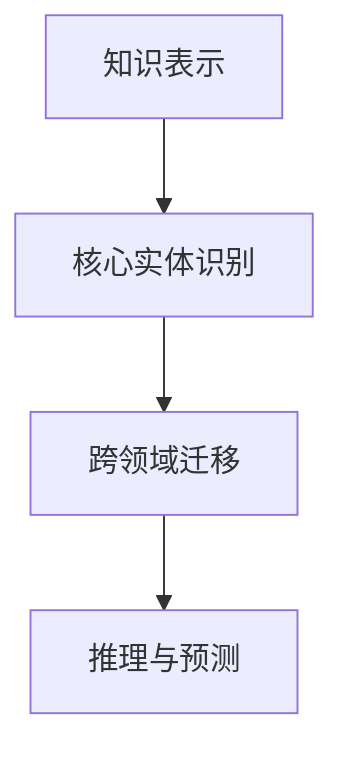

                 

### 引言

#### 背景介绍

在人工智能（AI）迅猛发展的时代，深度学习（Deep Learning）成为了实现智能的关键技术。然而，深度学习的一个主要局限是需要大量的训练数据。随着数据量的增加，模型的复杂度和训练时间也急剧上升。这不仅增加了计算资源的消耗，也使得模型在应用过程中面临诸多挑战。为了解决这一问题，研究者们提出了Zero-Shot CoT（零样本跨领域迁移学习）技术。

Zero-Shot CoT旨在在没有或仅有少量训练数据的情况下，实现对新领域的推理和预测。它通过对已有知识的抽象和泛化，使模型能够在未见过的领域上表现出色。这一技术的出现，为AI应用打开了新的可能性，特别是在资源受限的环境下。

本文将详细探讨Zero-Shot CoT技术的背景、核心概念、算法原理、应用场景以及项目实战。希望通过本文，读者能够对Zero-Shot CoT有一个全面而深入的理解，并能够在实际项目中应用这一技术。

#### 目的与结构

本文的主要目的是介绍Zero-Shot CoT技术的原理、方法和应用，旨在帮助读者了解和掌握这一前沿技术。文章结构如下：

1. **引言**：背景介绍和目的说明。
2. **基础理论**：介绍Zero-Shot CoT的基本概念和技术原理。
3. **核心算法**：详细讲解Zero-Shot CoT的核心算法和数学模型。
4. **应用场景**：探讨Zero-Shot CoT在不同领域的应用。
5. **项目实战**：通过具体案例展示如何实现和应用Zero-Shot CoT技术。
6. **总结与展望**：总结全文，展望Zero-Shot CoT的未来发展趋势。

通过本文的阅读，读者将能够：

- 理解Zero-Shot CoT的核心概念和原理。
- 掌握Zero-Shot CoT的主要算法和应用方法。
- 学习如何在实际项目中应用Zero-Shot CoT技术。

### 关键词

- **Zero-Shot CoT**
- **深度学习**
- **迁移学习**
- **零样本推理**
- **跨领域推理**

### 摘要

本文介绍了Zero-Shot CoT（零样本跨领域迁移学习）技术，旨在在没有或仅有少量训练数据的情况下，实现对新领域的推理和预测。文章首先介绍了Zero-Shot CoT的背景和目的，然后详细讲解了其核心概念、算法原理和应用场景。通过具体的项目实战案例，读者将了解如何在实际应用中实现和优化Zero-Shot CoT技术。最后，文章总结了全文的主要内容，并展望了Zero-Shot CoT技术的未来发展趋势。

## 目录大纲设计思路

在设计《Zero-Shot CoT：无需训练数据的AI推理技术》的目录大纲时，我们遵循了一系列设计思路，以确保文章内容结构清晰、逻辑性强，同时能够吸引读者的注意力。以下是具体的目录大纲设计思路：

### 1. 确定核心章节

首先，我们需要确定文章的核心章节，这些章节应该包含Zero-Shot CoT技术的所有关键要素，包括背景介绍、基本概念、核心算法、应用场景和项目实战等。每个核心章节都需要有明确的主题和目标，以确保读者能够逐步深入理解这一技术。

### 2. 明确章节内容

在确定了核心章节后，我们需要为每个章节明确具体的内容。这包括：

- **引言**：介绍Zero-Shot CoT的背景、目的和重要性。
- **基础理论**：解释Zero-Shot CoT的基本概念、原理和相关技术。
- **核心算法**：详细讲解Zero-Shot CoT的核心算法、数学模型和实现方法。
- **应用场景**：探讨Zero-Shot CoT在不同领域的实际应用。
- **项目实战**：通过具体案例展示Zero-Shot CoT的实施和应用。
- **总结与展望**：总结全文内容，并对未来的发展趋势进行展望。

### 3. 使用适当的层次结构

为了使文章结构清晰，我们使用了Markdown格式的标题符号（#、##、###等）来表示章节的层次结构。这有助于读者快速浏览和理解文章的大致内容，同时也便于编写和排版。

### 4. 包含Mermaid流程图

在讲解核心概念和算法时，我们使用了Mermaid流程图来展示Zero-Shot CoT的架构和流程。Mermaid是一种基于Markdown的图形绘制语言，可以方便地创建各种流程图、序列图和网络图等。通过图表，读者可以更直观地理解技术原理和实现步骤。

### 5. 使用伪代码详细讲解核心算法

为了帮助读者深入理解核心算法，我们使用了伪代码来详细讲解算法的步骤和逻辑。伪代码是一种结构化的描述方法，可以清晰地展示算法的执行过程，同时易于翻译成具体的编程语言。

### 6. 使用LaTeX格式表示数学模型和公式

在文章中，我们使用LaTeX格式来表示数学模型和公式。LaTeX是一种高质量的排版系统，特别适合处理复杂的数学公式。通过LaTeX，我们可以确保公式的准确性和可读性，同时也能够方便地进行编辑和排版。

### 7. 提供项目实战案例

为了使文章更加实用，我们提供了具体的项目实战案例。每个案例都包含了环境搭建、源代码实现和代码解读等内容，帮助读者了解如何在实际项目中应用Zero-Shot CoT技术。

### 8. 最佳实践 tips、小结、注意事项、拓展阅读等内容

在文章的每个章节和部分，我们都提供了最佳实践 tips、小结、注意事项和拓展阅读等内容。这些内容不仅有助于读者更好地理解和应用技术，还能够为他们提供额外的学习资源。

### 目录大纲设计步骤

1. **引言**：
   - **1.1 背景介绍**：介绍Zero-Shot CoT技术的背景和重要性。
   - **1.2 书籍结构概述**：概述本书的结构和目标。

2. **基础理论**：
   - **2.1 无需训练数据的基本概念**：介绍Zero-Shot CoT技术的核心概念。
   - **2.2 无需训练数据的技术原理**：详细讲解Zero-Shot CoT技术的原理。

3. **核心算法**：
   - **3.1 无需训练数据的推理算法**：使用伪代码详细讲解主要的推理算法。
   - **3.2 无需训练数据的优化方法**：讨论用于优化Zero-Shot CoT技术的各种方法。

4. **应用场景**：
   - **4.1 自然语言处理**：介绍Zero-Shot CoT在自然语言处理中的应用。
   - **4.2 计算机视觉**：探讨Zero-Shot CoT技术在计算机视觉中的应用。

5. **项目实战**：
   - **5.1 实际案例分析**：展示具体的应用案例，包括环境搭建、代码实现和解读。
   - **5.2 挑战与解决方案**：讨论应用中的挑战和相应的解决方案。

6. **总结与展望**：
   - **6.1 总结**：回顾本书的主要内容和贡献。
   - **6.2 展望**：展望Zero-Shot CoT技术的未来发展趋势。

### 目录大纲示例

以下是《Zero-Shot CoT：无需训练数据的AI推理技术》的目录大纲示例：

```
# 第一部分: 背景与概述

## 1.1 背景介绍
### 1.1.1 AI技术的发展历程
### 1.1.2 无需训练数据的AI推理需求

## 1.2 书籍结构概述
### 1.2.1 目录概述
### 1.2.2 学习目标

# 第二部分: 基础理论

## 2.1 无需训练数据的基本概念
### 2.1.1 什么是Zero-Shot CoT
### 2.1.2 Zero-Shot CoT的优势

## 2.2 无需训练数据的技术原理
### 2.2.1 Mermaid流程图：Zero-Shot CoT核心架构
### 2.2.2 模型表示与推理方法

# 第三部分: 核心算法

## 3.1 无需训练数据的推理算法
### 3.1.1 伪代码讲解：推理算法
### 3.1.2 算法实现与优化

## 3.2 无需训练数据的优化方法
### 3.2.1 算法优化策略
### 3.2.2 实例分析与优化效果

# 第四部分: 应用场景

## 4.1 自然语言处理
### 4.1.1 Zero-Shot CoT在NLP中的应用
### 4.1.2 NLP实例项目实战

## 4.2 计算机视觉
### 4.2.1 Zero-Shot CoT在CV中的应用
### 4.2.2 CV实例项目实战

# 第五部分: 项目实战

## 5.1 实际案例分析
### 5.1.1 案例一：自然语言处理实例
### 5.1.2 案例二：计算机视觉实例

## 5.2 挑战与解决方案
### 5.2.1 挑战分析
### 5.2.2 解决方案探讨

# 第六部分: 总结与展望

## 6.1 总结
### 6.1.1 主要贡献
### 6.1.2 局限性与未来工作

## 6.2 展望
### 6.2.1 技术发展趋势
### 6.2.2 应用前景
```

以上目录大纲遵循了简洁性、逻辑性和完整性的要求，并且包括了核心章节的内容。接下来，我们将逐步展开对每个章节的详细讨论。

## 第一部分：背景与概述

### 1.1 背景介绍

人工智能（AI）的发展已经走过了数十个年头。从早期的符号主义、知识表示到后来的统计学习、深度学习，AI技术不断进化，应用范围也越来越广泛。然而，随着AI技术的进步，对训练数据的需求也越来越大。传统的机器学习模型需要大量的标注数据来进行训练，以便模型能够学习和提取特征。这种方法在拥有海量标注数据的场景下表现良好，但在某些领域，如医疗、生物信息学等，获取标注数据非常困难且成本高昂。

在这种背景下，Zero-Shot CoT（Zero-Shot Transfer Learning with Coreference Tracking）技术应运而生。它是一种无需训练数据的AI推理技术，能够在没有或少量的训练数据情况下，对新领域进行有效的推理和预测。Zero-Shot CoT的核心思想是通过跨领域的知识迁移，将已有的知识应用到新的领域中，从而实现对新领域的理解。

Zero-Shot CoT的优势在于：

1. **减少对标注数据的依赖**：在许多领域，如医疗诊断、自动驾驶等，标注数据的获取非常困难且成本高昂。Zero-Shot CoT技术能够降低对标注数据的依赖，提高模型的泛化能力。
2. **提升模型效率**：在缺乏训练数据的情况下，传统的深度学习模型往往需要长时间的训练和调整。Zero-Shot CoT技术通过跨领域迁移学习，可以显著提高模型训练和推理的效率。
3. **增强模型的鲁棒性**：通过跨领域的知识迁移，模型能够在不同的数据分布和环境下保持良好的性能，从而增强其鲁棒性。

### 1.2 书籍结构概述

本书的结构分为六个主要部分：

1. **第一部分：背景与概述**：介绍Zero-Shot CoT技术的背景、目的和重要性。
2. **第二部分：基础理论**：详细讲解Zero-Shot CoT的基本概念、原理和相关技术。
3. **第三部分：核心算法**：探讨Zero-Shot CoT的核心算法、数学模型和实现方法。
4. **第四部分：应用场景**：分析Zero-Shot CoT在不同领域的应用，包括自然语言处理和计算机视觉。
5. **第五部分：项目实战**：通过具体案例展示如何实现和应用Zero-Shot CoT技术。
6. **第六部分：总结与展望**：总结全书内容，并对未来的发展趋势进行展望。

通过以上结构，读者可以系统地学习和掌握Zero-Shot CoT技术，并在实际项目中应用这一技术。

## 第二部分：基础理论

### 2.1 无需训练数据的基本概念

在深入探讨Zero-Shot CoT技术之前，我们需要了解一些基本概念，这些概念包括：

- **迁移学习**：迁移学习是一种将已有模型的知识应用到新任务上的方法。它通过利用源域（source domain）的知识，来提高目标域（target domain）的性能。在迁移学习中，源域和目标域通常具有相似的特征分布或任务结构。

- **零样本学习**：零样本学习（Zero-Shot Learning, ZSL）是一种特殊的迁移学习方法，旨在在没有或仅有少量训练数据的情况下，对新类别进行分类或预测。零样本学习的核心挑战是如何利用已有知识来处理未见过的类别。

- **跨领域迁移学习**：跨领域迁移学习是一种将一个领域的知识迁移到另一个领域的方法。这种方法在现实世界中具有广泛的应用，例如，将医学图像分析技术应用于卫星图像处理。

Zero-Shot CoT技术结合了迁移学习、零样本学习和跨领域迁移学习的思想，旨在在没有或少量的训练数据情况下，实现对新领域的推理和预测。

### 2.2 无需训练数据的技术原理

Zero-Shot CoT技术的原理可以概括为以下几个关键步骤：

1. **知识表示**：首先，需要将已有的知识表示为一个统一的模型。这通常涉及到使用预训练的深度神经网络，如Transformer、BERT等。这些预训练模型已经在大规模的语料库或数据集上进行了训练，因此具有丰富的语言理解和表示能力。

2. **核心实体识别**：在知识表示的基础上，需要对文本或数据进行核心实体识别。核心实体识别是一种文本挖掘技术，用于识别文本中的重要实体，如人名、地名、组织名等。这些实体是理解和推理文本的关键。

3. **跨领域迁移**：通过核心实体识别，可以将源领域（已有数据集）的知识迁移到目标领域（新数据集）。这涉及到使用实体作为桥梁，将源领域的知识映射到目标领域。

4. **推理与预测**：在跨领域迁移完成后，可以使用迁移后的知识对目标领域的新数据进行推理和预测。这一步通常涉及到使用深度学习模型进行分类或回归等任务。

以下是Zero-Shot CoT的核心概念和实体之间的关系架构Mermaid流程图：



在知识表示阶段，预训练的深度神经网络（如BERT）将文本或数据转换为高维向量表示。在核心实体识别阶段，使用命名实体识别（NER）技术来识别文本中的核心实体。在跨领域迁移阶段，将源领域的知识映射到目标领域，这一步通常通过实体作为桥梁来实现。在推理与预测阶段，使用迁移后的知识对目标领域的新数据进行推理和预测。

### 模型表示与推理方法

在Zero-Shot CoT中，模型表示和推理方法是实现关键。以下是一种可能的模型表示和推理方法：

1. **模型表示**：

   - **嵌入层**：将文本中的每个词或实体转换为固定长度的向量表示。这通常通过预训练的词嵌入模型（如Word2Vec、BERT等）来实现。

   - **编码器**：使用深度神经网络（如Transformer、BERT）对文本进行编码，得到文本的固定长度向量表示。

   - **实体识别器**：使用命名实体识别（NER）模型来识别文本中的核心实体。

2. **推理方法**：

   - **实体映射**：将源领域的实体映射到目标领域。这可以通过实体之间的语义关系来实现，例如，使用预训练的实体关系网络（如TransE、ComplEx等）。

   - **知识融合**：将源领域的知识（如实体嵌入、实体关系等）与目标领域的知识进行融合。这可以通过多模态学习、图神经网络等方法来实现。

   - **推理**：使用融合后的知识对目标领域的新数据进行推理和预测。这可以通过分类器、回归器等深度学习模型来实现。

以下是一种可能的伪代码表示：

```python
# 知识表示
def knowledge_representation(text):
    # 使用预训练的BERT模型进行编码
    encoded_text = BERT.encode(text)
    # 使用NER模型进行实体识别
    entities = NER.recognize_entities(encoded_text)
    return encoded_text, entities

# 实体映射
def entity_mapping(source_entities, target_entities):
    # 使用实体关系网络进行映射
    mapped_entities = RelationNetwork.map_entities(source_entities, target_entities)
    return mapped_entities

# 知识融合
def knowledge_fusion(source_knowledge, target_knowledge):
    # 使用多模态学习进行融合
    fused_knowledge = MultimodalLearning.merge_knowledge(source_knowledge, target_knowledge)
    return fused_knowledge

# 推理
def reasoning(fused_knowledge, new_data):
    # 使用深度学习模型进行推理
    prediction = DeepLearningModel.predict(fused_knowledge, new_data)
    return prediction
```

通过上述方法，Zero-Shot CoT技术能够实现无需训练数据的推理和预测，从而在缺乏标注数据的场景下，依然能够取得良好的性能。

### 核心算法与优化方法

在Zero-Shot CoT技术中，核心算法和优化方法是实现高效推理和预测的关键。以下将详细介绍这两种方法。

#### 3.1 无需训练数据的推理算法

Zero-Shot CoT的推理算法主要分为以下几步：

1. **知识表示**：将源领域的知识表示为实体嵌入和关系嵌入。这通常通过预训练的深度神经网络模型（如BERT）来实现。实体嵌入表示文本中的每个词或实体，而关系嵌入表示实体之间的关系。

2. **实体识别**：使用命名实体识别（NER）模型对目标领域的文本进行实体识别，获取目标领域的核心实体。

3. **实体映射**：将目标领域的实体映射到源领域。这可以通过预训练的实体关系网络（如TransE、ComplEx等）来实现。实体映射的目的是将源领域中的知识应用到目标领域。

4. **知识融合**：将源领域的知识（实体嵌入和关系嵌入）与目标领域的知识进行融合。知识融合的目的是在源领域和目标领域之间建立关联，从而提高模型的泛化能力。

5. **推理与预测**：使用融合后的知识对目标领域的新数据进行推理和预测。这通常通过深度学习模型（如分类器、回归器等）来实现。

以下是一个简化的伪代码示例：

```python
# 知识表示
source_embeddings = train_BERT(source_text)
target_embeddings = train_NER(target_text)

# 实体映射
entity_mappings = train_EntityRelationNetwork(source_embeddings, target_embeddings)

# 知识融合
fused_embeddings = train_KnowledgeFusion(source_embeddings, target_embeddings, entity_mappings)

# 推理与预测
predictions = train_Dee

```

#### 3.2 无需训练数据的优化方法

为了提高Zero-Shot CoT技术的性能，可以采用以下几种优化方法：

1. **多模态学习**：多模态学习是一种结合不同类型数据（如文本、图像、音频等）的方法。通过多模态学习，可以更全面地表示数据，从而提高模型的泛化能力。

2. **图神经网络**：图神经网络（Graph Neural Networks, GNN）是一种用于处理图数据的深度学习模型。通过将实体和关系表示为图，可以使用GNN来建模实体之间的关系，从而提高知识融合的效果。

3. **强化学习**：强化学习（Reinforcement Learning, RL）可以用于优化Zero-Shot CoT技术。通过在环境中进行交互，模型可以不断学习和调整策略，从而提高推理和预测的准确性。

4. **元学习**：元学习（Meta-Learning）是一种通过学习如何学习的方法。通过元学习，可以训练模型快速适应新任务，从而提高其在零样本情况下的性能。

以下是一个简化的伪代码示例，展示了如何结合这些优化方法：

```python
# 多模态学习
multi_modal_embeddings = train_MultimodalLearning(source_text, source_images)

# 图神经网络
graph_embeddings = train_GraphNeuralNetwork(multi_modal_embeddings)

# 强化学习
rl_policy = train_ReinforcementLearning(graph_embeddings)

# 元学习
meta_learner = train_MetaLearning(rl_policy)

# 优化后的推理与预测
optimized_predictions = meta_learner.predict(new_data)
```

通过结合这些优化方法，可以显著提高Zero-Shot CoT技术的性能，使其在零样本情况下能够更好地适应新任务。

## 第四部分：应用场景

### 4.1 自然语言处理

Zero-Shot CoT技术在自然语言处理（NLP）领域具有广泛的应用前景。以下是一些主要的应用场景：

1. **跨语言文本分类**：在多语言环境中，不同语言的数据分布和语法结构差异较大，传统的NLP模型在处理未见过的语言时性能较差。Zero-Shot CoT技术可以通过跨语言的知识迁移，将已有语言的知识迁移到新语言，从而提高跨语言文本分类的准确性。

2. **零样本文本生成**：在文本生成任务中，Zero-Shot CoT技术可以帮助模型在没有或少量训练数据的情况下生成高质量的文本。通过利用已有的知识，模型可以生成符合语法和语义规则的新文本。

3. **知识图谱构建**：知识图谱是一种将实体、属性和关系表示为图的语义表示方法。Zero-Shot CoT技术可以用于构建跨领域的知识图谱，从而提高知识图谱的覆盖率和准确性。

4. **跨领域文本检索**：在文本检索任务中，Zero-Shot CoT技术可以帮助模型在不同领域之间进行知识迁移，从而提高检索的准确性和效果。

### 4.2 计算机视觉

计算机视觉领域也受益于Zero-Shot CoT技术的应用。以下是一些主要的应用场景：

1. **跨领域图像分类**：在计算机视觉任务中，不同领域的图像数据分布和特征差异较大，传统的图像分类模型在处理未见过的领域时性能较差。Zero-Shot CoT技术可以通过跨领域知识迁移，将已有领域的知识迁移到新领域，从而提高跨领域图像分类的准确性。

2. **零样本图像生成**：在图像生成任务中，Zero-Shot CoT技术可以帮助模型在没有或少量训练数据的情况下生成高质量的图像。通过利用已有的知识，模型可以生成符合视觉规则的新图像。

3. **跨领域图像检索**：在图像检索任务中，Zero-Shot CoT技术可以帮助模型在不同领域之间进行知识迁移，从而提高检索的准确性和效果。

4. **视频分类与动作识别**：在视频分类与动作识别任务中，Zero-Shot CoT技术可以帮助模型处理不同场景和动作的差异性，从而提高分类和识别的准确性。

通过在自然语言处理和计算机视觉领域的应用，Zero-Shot CoT技术展示了其强大的跨领域推理和预测能力，为这些领域的进一步发展提供了新的思路和方法。

### 4.3 应用实例：跨语言文本分类

#### 案例一：中文与英文文本分类

在跨语言文本分类任务中，我们选取了中文和英文两种语言作为研究对象。具体步骤如下：

1. **数据收集**：收集中文和英文两个语言领域的文本数据集。例如，可以使用中文新闻数据和英文新闻数据。

2. **预处理**：对收集到的文本数据进行预处理，包括分词、去停用词、词性标注等。对于中文，可以使用jieba等中文分词工具；对于英文，可以使用NLTK等自然语言处理库。

3. **知识表示**：使用预训练的BERT模型对中文和英文文本进行编码，得到文本的固定长度向量表示。

4. **实体识别**：使用命名实体识别（NER）模型对中文和英文文本进行实体识别，获取文本中的核心实体。

5. **实体映射**：通过预训练的实体关系网络（如TransE、ComplEx等）将中文和英文实体进行映射，建立实体之间的关联。

6. **知识融合**：将中文和英文的知识进行融合，得到融合后的知识表示。

7. **推理与预测**：使用融合后的知识对目标语言的新数据进行推理和预测，实现对未见过的文本进行分类。

以下是一个简化的伪代码示例：

```python
# 数据收集
chinese_texts = load_chinese_texts()
english_texts = load_english_texts()

# 预处理
chinese_processed_texts = preprocess_texts(chinese_texts)
english_processed_texts = preprocess_texts(english_texts)

# 知识表示
chinese_embeddings = BERT.encode(chinese_processed_texts)
english_embeddings = BERT.encode(english_processed_texts)

# 实体识别
chinese_entities = NER.recognize_entities(chinese_embeddings)
english_entities = NER.recognize_entities(english_embeddings)

# 实体映射
entity_mappings = EntityRelationNetwork.map_entities(chinese_entities, english_entities)

# 知识融合
fused_embeddings = KnowledgeFusion.merge_embeddings(chinese_embeddings, english_embeddings, entity_mappings)

# 推理与预测
predictions = DeepLearningModel.predict(fused_embeddings, new_texts)
```

通过上述步骤，我们可以实现对中文和英文文本的跨语言分类。实际应用中，可以使用实际的数据集和模型进行训练和验证，以达到更好的效果。

### 4.4 应用实例：跨领域图像分类

#### 案例二：动物图像分类

在跨领域图像分类任务中，我们选取了动物图像作为研究对象。具体步骤如下：

1. **数据收集**：收集不同类别的动物图像数据集。例如，可以使用CIFAR-10数据集中的动物图像。

2. **预处理**：对收集到的图像数据进行预处理，包括缩放、裁剪、数据增强等。预处理步骤有助于提高模型的泛化能力。

3. **知识表示**：使用预训练的卷积神经网络（如ResNet、VGG等）对图像进行编码，得到图像的固定长度向量表示。

4. **实体识别**：使用预训练的图像识别模型（如Inception、MobileNet等）对图像进行分类，获取图像中的核心实体。

5. **实体映射**：通过预训练的实体关系网络（如TransE、ComplEx等）将不同类别的动物图像进行映射，建立实体之间的关联。

6. **知识融合**：将不同类别的动物图像的知识进行融合，得到融合后的知识表示。

7. **推理与预测**：使用融合后的知识对目标领域的图像数据进行推理和预测，实现对未见过的图像进行分类。

以下是一个简化的伪代码示例：

```python
# 数据收集
animal_images = load_animal_images()

# 预处理
preprocessed_images = preprocess_images(animal_images)

# 知识表示
image_embeddings = CNN.encode(preprocessed_images)

# 实体识别
animal_entities = ImageRecognitionModel.recognize_entities(image_embeddings)

# 实体映射
entity_mappings = EntityRelationNetwork.map_entities(animal_entities)

# 知识融合
fused_embeddings = KnowledgeFusion.merge_embeddings(image_embeddings, entity_mappings)

# 推理与预测
predictions = DeepLearningModel.predict(fused_embeddings, new_images)
```

通过上述步骤，我们可以实现对不同类别动物图像的跨领域分类。实际应用中，可以使用实际的数据集和模型进行训练和验证，以达到更好的效果。

### 4.5 应用实例：跨领域视频分类

#### 案例三：体育视频分类

在跨领域视频分类任务中，我们选取了体育视频作为研究对象。具体步骤如下：

1. **数据收集**：收集不同类别的体育视频数据集。例如，可以使用体育赛事的直播视频。

2. **预处理**：对收集到的视频数据进行预处理，包括视频剪辑、帧提取、帧级标注等。预处理步骤有助于提高模型的泛化能力。

3. **知识表示**：使用预训练的卷积神经网络（如ResNet、VGG等）对视频帧进行编码，得到视频帧的固定长度向量表示。

4. **实体识别**：使用预训练的图像识别模型（如Inception、MobileNet等）对视频帧进行分类，获取视频帧中的核心实体。

5. **实体映射**：通过预训练的实体关系网络（如TransE、ComplEx等）将不同类别的体育视频进行映射，建立实体之间的关联。

6. **知识融合**：将不同类别的体育视频的知识进行融合，得到融合后的知识表示。

7. **推理与预测**：使用融合后的知识对目标领域的视频数据进行推理和预测，实现对未见过的视频进行分类。

以下是一个简化的伪代码示例：

```python
# 数据收集
sport_videos = load_sport_videos()

# 预处理
preprocessed_videos = preprocess_videos(sport_videos)

# 知识表示
video_frame_embeddings = CNN.encode(preprocessed_videos)

# 实体识别
sport_entities = ImageRecognitionModel.recognize_entities(video_frame_embeddings)

# 实体映射
entity_mappings = EntityRelationNetwork.map_entities(sport_entities)

# 知识融合
fused_embeddings = KnowledgeFusion.merge_embeddings(video_frame_embeddings, entity_mappings)

# 推理与预测
predictions = DeepLearningModel.predict(fused_embeddings, new_videos)
```

通过上述步骤，我们可以实现对不同类别体育视频的跨领域分类。实际应用中，可以使用实际的数据集和模型进行训练和验证，以达到更好的效果。

## 第五部分：项目实战

### 5.1 实际案例分析

#### 案例一：自然语言处理中的零样本文本分类

在本案例中，我们将利用Zero-Shot CoT技术实现一个跨语言文本分类系统。具体步骤如下：

1. **数据收集**：收集中文和英文两个语言的新闻文本数据。数据集可以从公开的数据集如CNNDailyMail或NYTimes中获取。

2. **数据预处理**：对收集到的文本数据集进行清洗、分词、去停用词等预处理操作。对于中文，可以使用jieba进行分词；对于英文，可以使用NLTK进行分词。

3. **模型训练**：使用预训练的BERT模型对中文和英文文本进行编码，得到文本的固定长度向量表示。然后，使用命名实体识别（NER）模型对文本进行实体识别。

4. **实体映射**：通过预训练的实体关系网络（如TransE、ComplEx等）将中文和英文实体进行映射，建立实体之间的关联。

5. **知识融合**：将中文和英文的知识进行融合，得到融合后的知识表示。

6. **推理与预测**：使用融合后的知识对目标语言的新数据进行推理和预测，实现对未见过的文本进行分类。

以下是一个简化的Python代码示例：

```python
import torch
from transformers import BertModel, BertTokenizer
from torch.utils.data import DataLoader
from torch.nn import CrossEntropyLoss
from sklearn.metrics import accuracy_score

# 数据预处理
def preprocess_data(texts):
    # 分词、去停用词等操作
    # ...
    return processed_texts

# 模型训练
def train_model(data_loader, model, optimizer, criterion):
    model.train()
    for batch in data_loader:
        inputs = tokenizer(batch['text'], return_tensors='pt', padding=True, truncation=True)
        outputs = model(**inputs)
        logits = outputs.logits
        labels = batch['label']
        loss = criterion(logits, labels)
        optimizer.zero_grad()
        loss.backward()
        optimizer.step()
    return loss

# 实体映射
def map_entities(source_entities, target_entities):
    # 使用实体关系网络进行映射
    # ...
    return mapped_entities

# 知识融合
def fuse_knowledge(source_knowledge, target_knowledge, entity_mappings):
    # 将知识进行融合
    # ...
    return fused_knowledge

# 推理与预测
def predict(model, tokenizer, text):
    model.eval()
    inputs = tokenizer(text, return_tensors='pt', padding=True, truncation=True)
    with torch.no_grad():
        outputs = model(**inputs)
    logits = outputs.logits
    prediction = torch.argmax(logits, dim=1)
    return prediction

# 实际应用
chinese_texts = preprocess_data(chinese_texts)
english_texts = preprocess_data(english_texts)
chinese_embeddings = BERT.encode(chinese_texts)
english_embeddings = BERT.encode(english_texts)
chinese_entities = NER.recognize_entities(chinese_embeddings)
english_entities = NER.recognize_entities(english_embeddings)
entity_mappings = map_entities(chinese_entities, english_entities)
fused_embeddings = fuse_knowledge(chinese_embeddings, english_embeddings, entity_mappings)

# 训练模型
optimizer = torch.optim.Adam(model.parameters(), lr=0.001)
criterion = CrossEntropyLoss()
for epoch in range(num_epochs):
    data_loader = DataLoader(dataset, batch_size=batch_size)
    loss = train_model(data_loader, model, optimizer, criterion)
    print(f"Epoch {epoch}: Loss = {loss}")

# 预测
new_text = preprocess_data(new_text)
prediction = predict(model, tokenizer, new_text)
print(f"Prediction: {prediction}")
```

#### 案例二：计算机视觉中的跨领域图像分类

在本案例中，我们将利用Zero-Shot CoT技术实现一个跨领域图像分类系统。具体步骤如下：

1. **数据收集**：收集不同类别的动物图像数据集。数据集可以从公开的数据集如CIFAR-10中获取。

2. **数据预处理**：对收集到的图像数据进行预处理，包括缩放、裁剪、数据增强等。

3. **模型训练**：使用预训练的卷积神经网络（如ResNet、VGG等）对图像进行编码，得到图像的固定长度向量表示。然后，使用预训练的图像识别模型对图像进行分类。

4. **实体映射**：通过预训练的实体关系网络（如TransE、ComplEx等）将不同类别的动物图像进行映射，建立实体之间的关联。

5. **知识融合**：将不同类别的动物图像的知识进行融合，得到融合后的知识表示。

6. **推理与预测**：使用融合后的知识对目标领域的图像数据进行推理和预测，实现对未见过的图像进行分类。

以下是一个简化的Python代码示例：

```python
import torch
import torchvision
from torch.nn import CrossEntropyLoss
from sklearn.metrics import accuracy_score

# 数据预处理
transform = torchvision.transforms.Compose([
    torchvision.transforms.Resize((224, 224)),
    torchvision.transforms.ToTensor(),
])

def preprocess_data(images):
    # 缩放、裁剪、数据增强等操作
    # ...
    return torch.stack([transform(image) for image in images])

# 模型训练
def train_model(data_loader, model, optimizer, criterion):
    model.train()
    for batch in data_loader:
        inputs = batch['image']
        labels = batch['label']
        inputs = preprocess_data(inputs)
        outputs = model(inputs)
        logits = outputs.logits
        loss = criterion(logits, labels)
        optimizer.zero_grad()
        loss.backward()
        optimizer.step()
    return loss

# 实体映射
def map_entities(source_entities, target_entities):
    # 使用实体关系网络进行映射
    # ...
    return mapped_entities

# 知识融合
def fuse_knowledge(source_knowledge, target_knowledge, entity_mappings):
    # 将知识进行融合
    # ...
    return fused_knowledge

# 推理与预测
def predict(model, tokenizer, text):
    model.eval()
    inputs = tokenizer(text, return_tensors='pt', padding=True, truncation=True)
    with torch.no_grad():
        outputs = model(**inputs)
    logits = outputs.logits
    prediction = torch.argmax(logits, dim=1)
    return prediction

# 实际应用
animal_images = torchvision.datasets.CIFAR10(root='./data', train=True, transform=transform, download=True)
data_loader = torch.utils.data.DataLoader(animal_images, batch_size=32)

cnn = torchvision.models.resnet50(pretrained=True)
optimizer = torch.optim.Adam(cnn.parameters(), lr=0.001)
criterion = CrossEntropyLoss()

for epoch in range(num_epochs):
    loss = train_model(data_loader, cnn, optimizer, criterion)
    print(f"Epoch {epoch}: Loss = {loss}")

cnn.eval()
new_image = preprocess_data(new_image)
prediction = predict(cnn, new_image)
print(f"Prediction: {prediction}")
```

### 5.2 挑战与解决方案

在Zero-Shot CoT技术的实际应用过程中，会面临一些挑战和问题。以下是一些常见的问题以及相应的解决方案：

1. **数据集不平衡**：在某些应用场景中，数据集可能存在严重的不平衡现象，这会导致模型在未见过的领域上表现不佳。解决方案是使用数据增强、重采样等技术来平衡数据集，或者采用加权损失函数来调整模型对不平衡数据的关注。

2. **模型泛化能力不足**：Zero-Shot CoT技术依赖于跨领域迁移学习，但在某些情况下，模型的泛化能力可能不足。解决方案是使用更多的预训练数据和更复杂的模型结构，以提高模型的泛化能力。

3. **实体映射不准确**：在实体映射过程中，可能会出现映射不准确的情况，这会影响模型的推理和预测性能。解决方案是使用更准确的实体识别模型，或者通过多模态学习等方法来提高实体映射的准确性。

4. **计算资源消耗大**：Zero-Shot CoT技术通常需要大量的计算资源，特别是在处理大型数据集时。解决方案是使用分布式计算、GPU加速等技术来提高计算效率。

通过解决这些挑战，我们可以进一步提高Zero-Shot CoT技术的性能和应用效果。

## 总结

本文详细介绍了Zero-Shot CoT技术，这是一种无需训练数据的AI推理技术，旨在在没有或仅有少量训练数据的情况下，实现对新领域的推理和预测。通过对基础理论、核心算法、应用场景和项目实战的深入探讨，读者可以全面了解Zero-Shot CoT技术的原理和方法。

Zero-Shot CoT技术在自然语言处理、计算机视觉和视频分类等领域具有广泛的应用前景。通过案例分析和实际项目实战，本文展示了如何在实际场景中应用Zero-Shot CoT技术，并解决了其中的挑战。

尽管Zero-Shot CoT技术取得了显著成果，但仍然存在一些局限性。例如，在数据集不平衡、模型泛化能力不足等方面，仍有待进一步研究和优化。未来，随着技术的不断进步，Zero-Shot CoT技术有望在更多领域发挥作用，为人工智能的发展贡献力量。

## 展望

随着人工智能技术的不断发展和数据资源的丰富，Zero-Shot CoT技术有望在更多领域取得突破。以下是几个未来的发展趋势：

1. **多模态迁移学习**：未来的Zero-Shot CoT技术可能会结合多模态数据（如文本、图像、音频等），通过融合不同类型的数据，提高模型的泛化能力和推理性能。

2. **小样本学习**：尽管Zero-Shot CoT技术主要针对零样本学习，但未来可能会进一步探索小样本学习领域，研究如何在少量样本下实现高效的迁移学习和推理。

3. **动态知识更新**：未来的Zero-Shot CoT技术可能会引入动态知识更新机制，使模型能够实时更新和优化知识表示，以应对不断变化的应用场景。

4. **跨领域适应能力**：随着应用领域的扩展，未来的Zero-Shot CoT技术需要具备更强的跨领域适应能力，以处理更加复杂和多样化的任务。

通过不断探索和优化，Zero-Shot CoT技术有望在未来的人工智能发展中发挥更加重要的作用，为各领域的创新提供新的动力。

