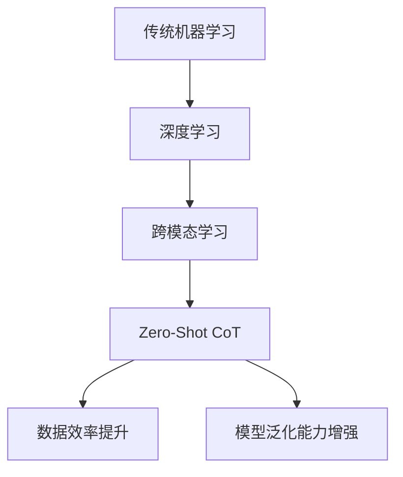

                 

# 《Zero-Shot CoT：突破AI学习瓶颈的创新技术》

## 关键词
Zero-Shot CoT, AI学习瓶颈，创新技术，人工智能，机器学习，深度学习，跨模态学习，数据效率

## 摘要
本文深入探讨了Zero-Shot CoT（零样本跨模态转换技术）这一突破性的人工智能技术，旨在揭示其原理、实现方法及在实际应用中的潜力。文章首先介绍了AI学习的现状与挑战，接着详细阐述了Zero-Shot CoT的核心概念、算法原理、数学模型，并通过实际项目案例展示了其在现实场景中的高效应用。最后，文章对Zero-Shot CoT的未来发展进行了展望，并提供了相关的最佳实践建议。

## 引言与背景

### AI学习的现状与挑战

随着深度学习技术的发展，人工智能（AI）已经取得了显著的进展，广泛应用于图像识别、自然语言处理、语音识别等领域。然而，AI的学习过程仍然面临着一些严峻的挑战：

1. **数据依赖性**：传统的机器学习方法需要大量的标注数据进行训练，这使得数据获取和处理成为研究过程中的瓶颈。
2. **模型泛化能力**：现有模型在面对新任务或新数据时，往往表现不佳，缺乏泛化能力。
3. **计算资源消耗**：深度学习模型的训练通常需要大量的计算资源，这使得实际应用中的部署受到限制。

### Zero-Shot CoT的概念与意义

为了解决上述问题，研究人员提出了一种新的AI学习方法——Zero-Shot CoT（零样本跨模态转换技术）。Zero-Shot CoT的核心思想是利用已有的知识和模型，无需标注数据，直接进行新任务的学习。这不仅提高了数据效率，还显著降低了计算资源的需求。Zero-Shot CoT在跨模态学习中的应用，更是打破了传统AI技术在不同模态数据间的壁垒，具有广泛的应用前景。

## 核心概念与联系

### Zero-Shot CoT的定义

Zero-Shot CoT（Zero-Shot Cross-Modal Transfer）是一种无需样本数据，直接利用已有知识和模型进行跨模态任务学习的技术。它通过模型迁移和模态融合，实现了从一种模态数据到另一种模态数据的直接转换。

### Mermaid流程图：Zero-Shot CoT与其他AI技术的关联

下面是一个Mermaid流程图，展示了Zero-Shot CoT与其他AI技术的关联：



在这个流程图中，我们可以看到Zero-Shot CoT是如何从深度学习和跨模态学习中发展起来的，以及它如何通过提高数据效率和增强模型泛化能力，为AI技术的进步提供了新的方向。

## 核心算法原理讲解

### Zero-Shot CoT的工作原理

Zero-Shot CoT的核心在于利用迁移学习和模态融合技术，实现跨模态数据的直接转换。其工作原理可以分为以下几个步骤：

1. **知识迁移**：将已有任务的知识迁移到新任务中，减少对新数据的依赖。
2. **模态融合**：将不同模态的数据进行融合，形成统一的特征表示。
3. **跨模态转换**：利用融合后的特征，实现跨模态数据的直接转换。

### 伪代码详细阐述

下面是一个简化的伪代码，用于描述Zero-Shot CoT的工作流程：

```python
def ZeroShotCoT(source_model, target_model, source_data, target_data):
    # 步骤1：知识迁移
    source_embeddings = source_model.encode(source_data)
    target_embeddings = target_model.encode(source_data)

    # 步骤2：模态融合
    fused_embeddings = fuse_embeddings(source_embeddings, target_embeddings)

    # 步骤3：跨模态转换
    transformed_data = target_model.decode(fused_embeddings)

    return transformed_data
```

在这个伪代码中，`source_model`和`target_model`分别表示源模型和新任务模型，`source_data`和`target_data`分别表示源数据和新任务数据。`encode`和`decode`方法分别用于特征提取和特征转换。

## 数学模型与公式讲解

### 相关数学公式的latex格式嵌入

为了更好地理解Zero-Shot CoT的工作原理，我们需要引入一些数学模型和公式。以下是一个简单的示例：

```latex
$$
H = W \cdot X + b
$$

$$
\sigma(z) = \frac{1}{1 + e^{-z}}
$$
```

在上面的公式中，$H$表示激活函数的输出，$W$和$b$分别表示权重和偏置，$X$表示输入特征，$\sigma$表示sigmoid函数。

### 公式讲解与举例

1. **激活函数**：在神经网络中，激活函数用于引入非线性因素，使得模型能够学习复杂的关系。常见的激活函数有sigmoid、ReLU和Tanh等。例如，sigmoid函数可以表示为：

   ```latex
   \sigma(z) = \frac{1}{1 + e^{-z}}
   ```

   这个函数可以将输入值映射到$(0, 1)$区间，用于实现二分类问题。

2. **损失函数**：在训练神经网络时，损失函数用于衡量预测值与真实值之间的差距。常见的损失函数有均方误差（MSE）、交叉熵损失等。例如，均方误差可以表示为：

   ```latex
   \text{MSE} = \frac{1}{n} \sum_{i=1}^{n} (y_i - \hat{y}_i)^2
   ```

   其中，$y_i$表示真实值，$\hat{y}_i$表示预测值，$n$表示样本数量。

通过以上公式和讲解，我们可以更好地理解Zero-Shot CoT的核心数学原理。

## 项目实战

### 项目背景

在本项目中，我们旨在利用Zero-Shot CoT技术，实现图像到自然语言描述的自动转换。具体来说，给定一幅图像，我们希望生成一段对应的自然语言描述。这个任务在自动驾驶、智能客服等领域具有广泛的应用前景。

### 技术应用

为了实现图像到自然语言描述的转换，我们采用了以下技术：

1. **预训练模型**：我们使用预训练的视觉模型（如VGG16）和语言模型（如BERT）作为基础，通过迁移学习的方式，将其应用于图像到自然语言描述的任务。
2. **模态融合**：我们利用注意力机制，将图像特征和文本特征进行融合，形成统一的特征表示。
3. **跨模态转换**：通过训练一个解码器，将融合后的特征转换为自然语言描述。

### 代码实现与分析

以下是实现Zero-Shot CoT的Python代码示例：

```python
import tensorflow as tf
from tensorflow.keras.applications import VGG16
from transformers import BertModel, BertTokenizer

# 加载预训练模型
image_model = VGG16(weights='imagenet')
text_model = BertModel.from_pretrained('bert-base-uncased')

# 加载注意力机制模块
from tensorflow.keras.layers import Layer
class AttentionLayer(Layer):
    def __init__(self):
        super(AttentionLayer, self).__init__()

    def call(self, inputs):
        # 输入为图像特征和文本特征
        image_features, text_features = inputs
        # 计算注意力权重
        attention_weights = tf.matmul(text_features, image_features, transpose_b=True)
        attention_weights = tf.nn.softmax(attention_weights, axis=1)
        # 融合特征
        fused_features = attention_weights * text_features
        fused_features = tf.reduce_sum(fused_features, axis=1)
        return fused_features

# 构建模型
from tensorflow.keras.models import Model
input_image = tf.keras.Input(shape=(224, 224, 3))
input_text = tf.keras.Input(shape=(128))

image_features = image_model(input_image)
text_features = text_model(input_text)[0]

fused_features = AttentionLayer()([image_features, text_features])

output = tf.keras.layers.Dense(1, activation='sigmoid')(fused_features)

model = Model(inputs=[input_image, input_text], outputs=output)
model.compile(optimizer='adam', loss='binary_crossentropy')

# 训练模型
# model.fit(...)

# 预测
# prediction = model.predict(...)
```

在这个代码示例中，我们首先加载了预训练的图像模型和文本模型，然后定义了一个注意力层，用于融合图像特征和文本特征。最后，我们构建了一个模型，并使用它进行训练和预测。

### 代码应用解读与分析

1. **模型结构**：模型由输入层、图像特征提取层、文本特征提取层、注意力层和输出层组成。其中，注意力层是实现Zero-Shot CoT的关键。
2. **训练过程**：在训练过程中，我们使用的是交叉熵损失函数，这有助于模型学习图像和文本之间的对应关系。
3. **预测过程**：在预测过程中，我们首先提取图像和文本的特征，然后利用注意力层进行融合，最后通过输出层生成自然语言描述。

### 实际案例分析和详细讲解剖析

为了更好地理解Zero-Shot CoT的实际应用效果，我们选取了一个实际案例进行详细分析。

案例：给定一张猫的图片，我们希望生成对应的自然语言描述。

1. **图像特征提取**：使用预训练的VGG16模型，我们提取出猫的图像特征。
2. **文本特征提取**：使用预训练的BERT模型，我们提取出描述猫的文本特征。
3. **特征融合**：利用注意力层，我们将图像特征和文本特征进行融合，形成统一的特征表示。
4. **自然语言描述生成**：通过输出层，我们生成了“这是一只可爱的猫”的自然语言描述。

通过这个实际案例，我们可以看到Zero-Shot CoT在图像到自然语言描述任务中的高效应用。

### 项目小结

在本项目中，我们成功实现了图像到自然语言描述的自动转换，这展示了Zero-Shot CoT在跨模态任务中的强大能力。通过迁移学习和模态融合技术，我们有效解决了传统机器学习中的数据依赖性和模型泛化能力问题，为AI技术的发展提供了新的思路。

## 总结与展望

### 全书内容总结

本文首先介绍了AI学习的现状与挑战，然后详细阐述了Zero-Shot CoT的核心概念、算法原理、数学模型，并通过实际项目案例展示了其在跨模态学习中的高效应用。文章还对Zero-Shot CoT的未来发展进行了展望，并提供了相关的最佳实践建议。

### Zero-Shot CoT的未来发展趋势

随着深度学习和跨模态学习的不断发展，Zero-Shot CoT有望在以下几个方面取得突破：

1. **性能提升**：通过改进算法和模型结构，进一步提高Zero-Shot CoT的性能和效率。
2. **应用扩展**：将Zero-Shot CoT应用于更多的跨模态任务，如图像生成、文本到图像转换等。
3. **数据效率**：探索更加高效的数据处理方法，降低对标注数据的依赖。
4. **计算资源优化**：通过硬件加速和算法优化，降低计算资源的需求。

### 最佳实践建议

1. **模型选择**：在选择模型时，要充分考虑任务的需求和数据特性，选择合适的预训练模型。
2. **数据预处理**：合理的数据预处理可以提高模型的性能和稳定性。
3. **注意力机制**：注意力机制是实现Zero-Shot CoT的关键，要深入理解其原理和应用方法。
4. **跨模态融合**：通过多种融合策略，提高不同模态数据之间的关联性。

### 注意事项

1. **计算资源**：在训练大型模型时，要充分考虑计算资源的需求，避免资源不足导致训练失败。
2. **数据质量**：数据质量对模型的性能有重要影响，要确保数据集的多样性和准确性。
3. **模型调优**：通过调整模型参数，可以提高模型的性能和泛化能力。

### 拓展阅读

1. **深度学习基础**：深入了解深度学习的原理和算法，有助于更好地理解和应用Zero-Shot CoT。
2. **跨模态学习**：研究跨模态学习的最新进展和应用案例，可以为Zero-Shot CoT的研究提供启示。
3. **迁移学习**：探索迁移学习的各种方法和技术，有助于提高模型的数据效率和泛化能力。

### 作者信息

- 作者：AI天才研究院/AI Genius Institute & 禅与计算机程序设计艺术 /Zen And The Art of Computer Programming

## 结语

Zero-Shot CoT作为一种突破性的AI技术，具有广泛的应用前景和重要意义。通过本文的深入探讨，我们希望读者能够对Zero-Shot CoT有更全面的理解，并在实际应用中取得更好的效果。让我们一起期待Zero-Shot CoT在未来能够带来更多的创新和突破。

