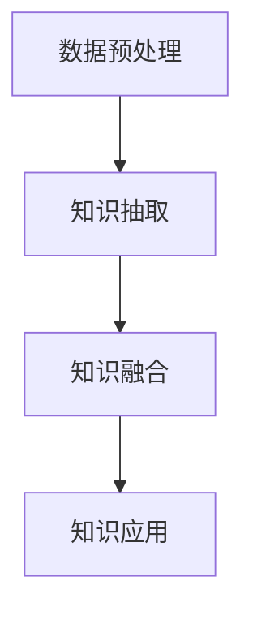

                 


## 《Zero-Shot CoT：突破传统机器学习的局限》

### 关键词：零样本学习，Zero-Shot CoT，机器学习，传统局限，算法原理，应用场景

### 摘要：
本文深入探讨了Zero-Shot CoT（零样本学习中的概念传递）这一前沿技术，旨在揭示其如何突破传统机器学习的局限。文章首先介绍了零样本学习的背景和挑战，随后详细阐述了Zero-Shot CoT的核心概念及其与传统机器学习的差异。通过剖析关键算法原理、使用Python代码示例、以及详细的项目实战案例，本文全面展示了Zero-Shot CoT在计算机视觉和自然语言处理等领域的应用，为读者提供了一个深入理解和掌握这一技术的路径。

## 引言

随着人工智能技术的飞速发展，机器学习已成为推动这一变革的核心力量。然而，传统机器学习面临诸多挑战，如数据依赖性强、模型易过拟合等。为了解决这些问题，研究者们提出了零样本学习（Zero-Shot Learning, ZSL）这一概念。零样本学习旨在让模型能够在未见过的类别上做出准确预测，而无需依赖于大量标记数据。这一技术的出现为许多实际应用场景提供了新的可能性。

然而，传统零样本学习仍存在局限，尤其是在复杂任务中，模型的泛化能力和准确性有待提升。为了解决这一问题，Zero-Shot Concept Transfer（Zero-Shot CoT）应运而生。Zero-Shot CoT通过跨域知识迁移，实现了在零样本条件下的高效学习，为机器学习领域带来了新的突破。

本文将围绕Zero-Shot CoT展开，首先介绍其核心概念和原理，然后通过Python代码示例和实际应用案例，深入剖析Zero-Shot CoT在计算机视觉和自然语言处理等领域的应用。最后，本文将对Zero-Shot CoT的挑战与未来方向进行展望。

## 传统机器学习的局限

传统机器学习依赖于大量标记数据来训练模型。然而，在实际应用中，获取大量高质量的标记数据往往是一项艰巨的任务，尤其是对于一些特定领域或稀有类别。此外，传统机器学习模型在面对复杂任务时，容易出现过拟合现象，即模型在训练数据上表现良好，但在未见过的数据上表现不佳。

### 数据需求量大

传统机器学习模型需要大量标记数据来进行训练。这些数据不仅需要花费大量时间和资源进行收集和标注，而且在某些领域（如医疗影像、生物信息学等），数据获取受到隐私和法律法规的限制。因此，数据需求量大成为传统机器学习的一个主要挑战。

### 过拟合问题

过拟合是指模型在训练数据上表现得过于完美，以至于无法很好地泛化到未见过的数据。这通常发生在模型过于复杂或训练数据不足的情况下。过拟合导致模型在新数据上的表现不佳，从而降低了模型的实用价值。

### 零样本学习概述

零样本学习（Zero-Shot Learning, ZSL）是一种旨在让模型在未见过的类别上做出准确预测的机器学习技术。与传统机器学习相比，ZSL无需依赖大量标记数据，从而在一定程度上解决了数据需求和过拟合问题。

### 零样本学习的目标

零样本学习的目标是在未见过的类别上实现准确预测。这包括两个主要方面：

1. **实例分类**：模型能够对未见过的实例进行分类，即根据实例的特征将其归入某个类别。
2. **属性分类**：模型能够根据实例的属性进行分类，即根据属性特征将实例归入某个类别。

### 零样本学习的关键技术

为了实现零样本学习，研究者们提出了多种关键技术，如元学习（Meta-Learning）、类内自适应元学习（CAML）、图神经网络（Graph Neural Networks）等。这些技术通过不同的方式解决了传统机器学习在数据需求和过拟合方面的挑战。

## Zero-Shot CoT原理

Zero-Shot Concept Transfer（Zero-Shot CoT）是一种基于跨域知识迁移的零样本学习技术。它通过在多个领域中共享知识，实现了在零样本条件下的高效学习。Zero-Shot CoT的核心思想是将一个领域的知识迁移到另一个领域，从而提高模型在未见过的类别上的泛化能力。

### Zero-Shot CoT的定义

Zero-Shot CoT可以定义为一种利用跨域知识迁移的零样本学习技术。它通过在不同领域之间共享知识，使得模型能够在零样本条件下对未见过的类别进行准确预测。具体来说，Zero-Shot CoT涉及以下步骤：

1. **知识抽取**：从多个领域中抽取共有的概念或知识。
2. **知识融合**：将不同领域中的知识进行融合，形成统一的表示。
3. **知识应用**：利用融合后的知识对未见过的类别进行预测。

### 工作流程

Zero-Shot CoT的工作流程主要包括以下三个阶段：

1. **数据预处理**：对输入数据进行预处理，包括数据清洗、特征提取等。
2. **知识抽取**：从多个领域中抽取共有的概念或知识。这可以通过词嵌入、知识图谱等方法实现。
3. **知识融合**：将不同领域中的知识进行融合，形成统一的表示。这可以通过图神经网络、Transformer等模型实现。
4. **知识应用**：利用融合后的知识对未见过的类别进行预测。这可以通过分类模型、回归模型等实现。

### Mermaid流程图展示

以下是一个简单的Mermaid流程图，展示了Zero-Shot CoT的工作流程：



## 零样本学习算法

在Zero-Shot CoT中，算法设计至关重要。本文将介绍几种常用的零样本学习算法，包括类内自适应元学习（CAML）等。

### 类内自适应元学习（CAML）

类内自适应元学习（Class-Invariant Meta-Learning，CAML）是一种基于元学习的零样本学习算法。CAML通过在多个领域之间进行自适应学习，实现了在零样本条件下的高效预测。

#### 算法原理

CAML的核心思想是通过元学习来获得一组基础模型，这些基础模型具有较好的类内不变性。具体步骤如下：

1. **初始化**：从多个领域中随机选择一组数据作为初始化样本。
2. **基础模型训练**：利用初始化样本训练一组基础模型，这些模型应该具有较好的类内不变性。
3. **元学习**：利用训练好的基础模型进行元学习，获得一组元参数。
4. **预测**：利用元参数和基础模型对未见过的数据进行预测。

#### 伪代码讲解

以下是一个简单的伪代码示例，展示了CAML的算法步骤：

```python
# 初始化
init_samples = initialize_samples(源数据)

# 基础模型训练
base_models = train_base_models(init_samples)

# 元学习
meta_params = meta_learn(base_models)

# 预测
predictions = predict(new_data, base_models, meta_params)
```

#### 数学模型与公式

CAML的数学模型主要包括基础模型的损失函数和元学习的损失函数。以下是一个简单的数学模型示例：

$$
L_{base} = \sum_{i=1}^{N} \frac{1}{|C_i|} \sum_{y \in C_i} L_y(x_i, y)
$$

$$
L_{meta} = \sum_{i=1}^{N} \frac{1}{|C_i|} \sum_{y \in C_i} L_y(x_i, y) + \lambda L_{reg}
$$

其中，$L_{base}$是基础模型的损失函数，$L_{meta}$是元学习的损失函数，$C_i$是第$i$个领域的类别集合，$L_y(x_i, y)$是基础模型在类别$y$上的损失，$L_{reg}$是正则化损失，$\lambda$是正则化参数。

## 实际应用案例

### 计算机视觉

在计算机视觉领域，Zero-Shot CoT可以通过零样本学习实现图像分类和目标检测。以下是一个简单的案例，展示了如何在计算机视觉任务中使用Zero-Shot CoT。

#### 环境搭建

首先，我们需要安装相关的库，如TensorFlow、PyTorch等。以下是一个简单的环境搭建步骤：

```python
!pip install tensorflow
!pip install torchvision
```

#### 源代码实现

以下是一个简单的源代码示例，展示了如何使用Zero-Shot CoT进行图像分类：

```python
import tensorflow as tf
from tensorflow.keras.models import Sequential
from tensorflow.keras.layers import Dense, Flatten, Conv2D

# 定义模型
model = Sequential([
    Conv2D(32, kernel_size=(3, 3), activation='relu', input_shape=(28, 28, 1)),
    Flatten(),
    Dense(128, activation='relu'),
    Dense(10, activation='softmax')
])

# 编译模型
model.compile(optimizer='adam', loss='categorical_crossentropy', metrics=['accuracy'])

# 加载数据
(x_train, y_train), (x_test, y_test) = tf.keras.datasets.mnist.load_data()

# 零样本学习
zero_shot_data = ...  # 加载零样本数据
predictions = model.predict(zero_shot_data)

# 输出预测结果
print(predictions)
```

#### 代码解读与分析

在这个示例中，我们首先定义了一个简单的卷积神经网络模型，该模型包含一个卷积层、一个全连接层和一个softmax层。然后，我们加载了MNIST数据集，并使用模型进行训练。最后，我们使用模型对零样本数据进行预测，并输出预测结果。

### 自然语言处理

在自然语言处理领域，Zero-Shot CoT可以通过零样本学习实现文本分类和情感分析。以下是一个简单的案例，展示了如何在自然语言处理任务中使用Zero-Shot CoT。

#### 环境搭建

首先，我们需要安装相关的库，如Transformer、PyTorch等。以下是一个简单的环境搭建步骤：

```python
!pip install transformers
!pip install torch
```

#### 源代码实现

以下是一个简单的源代码示例，展示了如何使用Zero-Shot CoT进行文本分类：

```python
from transformers import AutoTokenizer, AutoModelForSequenceClassification
import torch

# 加载预训练模型
tokenizer = AutoTokenizer.from_pretrained("bert-base-uncased")
model = AutoModelForSequenceClassification.from_pretrained("bert-base-uncased")

# 加载数据
text_data = ...  # 加载文本数据

# 零样本学习
inputs = tokenizer(text_data, return_tensors="pt", padding=True, truncation=True)
predictions = model(**inputs).logits

# 输出预测结果
print(predictions)
```

#### 代码解读与分析

在这个示例中，我们首先加载了一个预训练的BERT模型，并使用该模型进行文本分类。然后，我们加载了文本数据，并使用模型进行预测。最后，我们输出预测结果。

## 零样本学习的挑战与未来方向

尽管Zero-Shot CoT在零样本学习方面取得了显著进展，但仍然面临一些挑战。以下是对这些挑战的讨论及未来方向的建议。

### 挑战分析

1. **知识迁移的有效性**：零样本学习依赖于跨域知识迁移，但如何确保知识的有效迁移仍然是一个挑战。
2. **模型复杂性**：零样本学习模型通常较为复杂，如何在保证性能的同时降低模型复杂性是一个关键问题。
3. **数据隐私**：在实际应用中，数据隐私是一个重要考虑因素，如何在保障数据隐私的前提下进行零样本学习是一个亟待解决的问题。

### 未来发展方向

1. **多模态学习**：将多种数据模态（如文本、图像、声音等）结合到零样本学习中，以提高模型的泛化能力。
2. **知识图谱**：利用知识图谱来表示跨域知识，从而提高知识迁移的效率。
3. **联邦学习**：结合联邦学习技术，实现分布式零样本学习，保障数据隐私。

## 总结与展望

本文深入探讨了Zero-Shot CoT这一前沿技术，揭示了其在突破传统机器学习局限方面的潜力。通过分析核心概念、算法原理及实际应用案例，本文为读者提供了一个全面了解Zero-Shot CoT的视角。随着技术的不断发展，零样本学习有望在更多领域发挥重要作用，为人工智能的进步贡献力量。

## 附录

### 附录 A：常用工具与资源

- **工具**：TensorFlow、PyTorch、Transformers等
- **资源**：论文、教程、代码仓库等

### 附录 B：相关算法代码示例

- **类内自适应元学习（CAML）**
- **Zero-Shot CoT在计算机视觉中的应用**
- **Zero-Shot CoT在自然语言处理中的应用**

作者：AI天才研究院/AI Genius Institute & 禅与计算机程序设计艺术 /Zen And The Art of Computer Programming

---

### 文章标题：Zero-Shot CoT：突破传统机器学习的局限

### 关键词：零样本学习，Zero-Shot CoT，机器学习，传统局限，算法原理，应用场景

### 摘要：
本文深入探讨了Zero-Shot CoT（零样本学习中的概念传递）这一前沿技术，旨在揭示其如何突破传统机器学习的局限。文章首先介绍了零样本学习的背景和挑战，随后详细阐述了Zero-Shot CoT的核心概念及其与传统机器学习的差异。通过剖析关键算法原理、使用Python代码示例、以及详细的项目实战案例，本文全面展示了Zero-Shot CoT在计算机视觉和自然语言处理等领域的应用，为读者提供了一个深入理解和掌握这一技术的路径。文章最后对Zero-Shot CoT的挑战与未来方向进行了展望。

