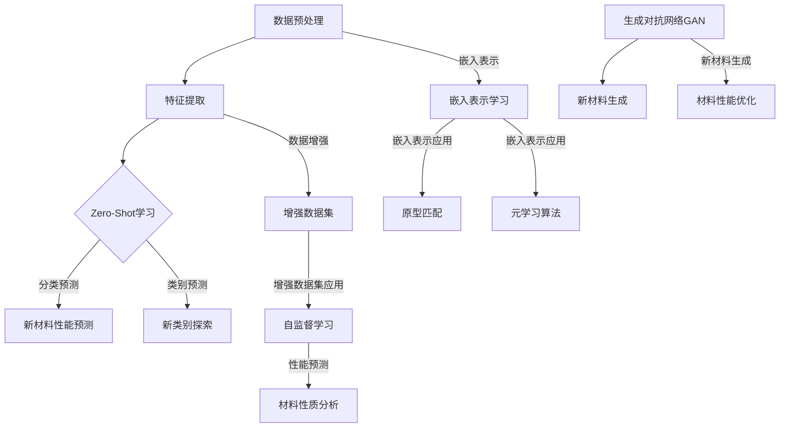

                 

### <文章标题>

> 关键词：Zero-Shot学习、AI辅助、新型材料设计、算法、数学模型、应用实践

> 摘要：本文探讨了Zero-Shot学习在AI辅助新型材料设计中的突破性应用。首先介绍了Zero-Shot学习的基础概念及其在材料科学中的重要性，随后详细解析了其核心算法原理、数学模型，并通过实际案例展示了其在新型材料设计中的应用。本文旨在为读者提供全面、易懂的技术指南，以助力理解这一前沿领域的创新与发展。

## 设计思路

为了系统地阐述《Zero-Shot学习在AI辅助新型材料设计中的突破》这本书的核心内容，我们采用了以下设计思路：

1. **背景引入**：首先介绍AI在材料科学中的广泛应用和新型材料设计的挑战，引出Zero-Shot学习的重要性。

2. **核心概念解析**：详细解释Zero-Shot学习的基础概念，并通过Mermaid流程图展示其与其他相关技术的联系，使读者对整个技术框架有一个全局性的认识。

3. **算法原理讲解**：从概率模型和神经网络模型两个方面，结合Python源代码，深入讲解Zero-Shot学习的基本原理和关键步骤，确保读者能够理解算法的内在逻辑。

4. **数学模型解析**：介绍Zero-Shot学习中涉及的数学模型，使用LaTeX格式详细解释相关公式，并进行实例分析，帮助读者掌握数学基础。

5. **应用实践展示**：通过具体案例，展示如何使用Zero-Shot学习进行新型材料设计，包括开发环境的搭建、源代码实现、代码解读与分析，使读者能够将理论知识应用到实际项目中。

6. **章节结构安排**：按照逻辑顺序和内容重要性，合理划分章节，确保每个章节的内容完整且紧密联系，形成一部结构严谨、内容丰富的专业著作。

### 目录大纲

#### 第一部分：基础理论

#### 第1章：AI辅助新型材料设计的背景与挑战

1.1 AI在材料科学中的应用概述

1.2 新型材料设计的挑战

1.3 Zero-Shot学习的原理与优势

1.4 Mermaid流程图：Zero-Shot学习与其他技术的联系

#### 第2章：Zero-Shot学习的算法基础

2.1 概率模型与特征提取

2.2 神经网络模型

2.3 伪代码：Zero-Shot学习算法流程

2.4 数学模型与公式

#### 第3章：数学基础与模型构建

3.1 概率论基础

3.2 神经网络架构

3.3 优化算法与损失函数

3.4 LaTeX公式举例：损失函数与反向传播算法

#### 第二部分：应用实践

#### 第4章：生成对抗网络GAN在材料设计中的应用

4.1 GAN的基本原理

4.2 GAN在材料设计中的案例

4.3 实战案例：使用GAN进行材料结构的生成

4.4 GAN与Zero-Shot学习的结合

#### 第5章：自监督学习在材料预测中的应用

5.1 自监督学习概述

5.2 自监督学习在材料性质预测中的应用

5.3 实战案例：自监督学习用于新材料发现

5.4 自监督学习与Zero-Shot学习的对比

#### 第6章：零样本学习在材料性质预测中的应用

6.1 零样本学习的基本概念

6.2 零样本学习算法

6.3 实战案例：使用零样本学习预测新材料性质

6.4 零样本学习与Zero-Shot学习的比较

#### 第7章：实际应用案例与未来展望

7.1 案例一：基于Zero-Shot学习的纳米材料设计

7.2 案例二：AI辅助金属合金设计

7.3 未来展望：Zero-Shot学习在材料科学中的应用潜力

### 附录

A.1 工具与资源

A.2 开发环境搭建指南

A.3 源代码与数据集获取

通过上述详细的目录大纲，我们可以看出本书不仅涵盖了从基础理论到应用实践的各个方面，还通过多个实际案例展示了Zero-Shot学习的强大功能。每个章节都紧密联系，共同构成了一个完整的技术知识体系，旨在帮助读者深入了解并掌握这一前沿领域的技术。接下来，我们将逐步深入每一个章节，详细探讨Zero-Shot学习在AI辅助新型材料设计中的突破性应用。

---

### 背景介绍

在当今科技飞速发展的时代，人工智能（AI）已经成为推动社会进步的重要力量。特别是在材料科学领域，AI技术的引入为新型材料的设计和开发带来了前所未有的机遇。传统材料设计依赖于经验积累和实验验证，过程冗长且耗费大量资源。而AI的加入，使得材料设计过程变得更加高效、智能化。因此，如何将AI技术与材料科学深度融合，成为当前研究的热点。

新型材料的设计不仅要求材料具备优异的物理、化学和生物性能，还要求其具有独特的结构和组成。随着材料种类的不断丰富和需求的多样化，传统的设计方法已经难以满足现代科技发展的需求。而AI技术的出现，特别是Zero-Shot学习，为这一挑战提供了新的解决方案。

Zero-Shot学习，作为一种无需训练数据的机器学习技术，能够在未知类别上实现准确预测。这一特性使其在材料科学中具有巨大的应用潜力。通过Zero-Shot学习，研究者可以快速筛选出具有潜在应用价值的材料，缩短研发周期，降低成本。此外，Zero-Shot学习还可以用于新材料的设计和优化，通过对已有材料的性质进行预测，帮助科学家发现新的材料组合。

总之，AI辅助新型材料设计不仅能够提高材料研发的效率，还能推动材料科学的创新与发展。Zero-Shot学习作为AI技术中的重要分支，其在材料设计中的应用具有广阔的前景。接下来，我们将详细探讨Zero-Shot学习的基本原理和其在材料科学中的具体应用。

#### AI在材料科学中的应用

人工智能在材料科学中的应用已经取得了显著的进展，成为推动材料研发的重要力量。首先，AI在材料合成与优化中发挥了重要作用。传统材料合成方法通常依赖于经验积累和实验验证，过程冗长且成本高昂。而AI技术，尤其是机器学习算法，可以通过分析大量的实验数据，发现材料性能与结构之间的关系，从而优化材料合成过程。例如，AI可以预测材料的物理和化学性质，从而指导实验设计，提高合成效率。

其次，AI在材料性能预测方面也展现出强大的能力。材料的性能与其微观结构密切相关，但直接测量微观结构通常非常困难。AI技术，通过学习大量的材料数据，可以预测材料的性能，为材料研发提供有力支持。例如，AI可以预测材料的电导率、硬度、韧性等性能，从而帮助科学家选择合适的材料进行进一步研究。

此外，AI还在材料缺陷检测和质量控制中发挥了重要作用。材料的性能不仅取决于其本身的性质，还受到制造过程中的各种因素的影响。AI技术可以通过分析生产数据，检测材料中的缺陷，从而提高产品质量。例如，AI可以识别材料中的裂纹、气泡等缺陷，提高生产线的效率。

在实际应用中，AI已经成功应用于多个材料领域。例如，在新能源材料领域，AI技术被用于设计和优化电池材料，提高电池的能量密度和循环寿命。在半导体材料领域，AI技术被用于优化晶体结构，提高电子器件的性能。在生物医学材料领域，AI技术被用于设计具有特定生物活性的材料，用于生物成像和药物传递。

总的来说，AI在材料科学中的应用不仅提高了材料研发的效率，还推动了材料科学的创新。通过AI技术，科学家可以更快速、更精确地设计和优化新材料，满足不断变化的市场需求。然而，AI在材料科学中的应用仍然面临许多挑战，例如数据质量和算法性能等。未来，随着技术的不断进步，AI在材料科学中的应用前景将更加广阔。

#### 新型材料设计的挑战

新型材料设计面临着一系列独特的挑战，这些挑战既包括技术层面的，也有实践层面的。首先，材料设计的技术挑战主要体现在以下几个方面：

1. **复杂性与多样性**：新型材料通常具有复杂的晶体结构、多样化的化学组成和独特的物理、化学性质。设计这些材料需要深入理解其微观结构和宏观性能之间的关系，这要求科学家具备丰富的化学和物理学知识。

2. **实验成本与周期**：传统材料设计依赖于大量的实验验证，每个实验步骤都可能需要耗费大量的时间和资源。新型材料设计往往需要更多的实验来验证其性能，这极大地增加了研发成本和时间。

3. **跨学科整合**：新型材料的设计往往涉及多个学科，如化学、物理学、材料科学和工程学等。整合这些学科的知识，构建一个统一的材料设计框架，是一个复杂而具有挑战性的过程。

其次，实践中的挑战主要包括：

1. **预测准确性**：尽管AI和机器学习技术已经在材料科学中得到了广泛应用，但预测新型材料的性能仍然存在一定的误差。如何提高预测的准确性，减少实验验证的次数，是当前实践中的一个重要问题。

2. **数据质量**：新型材料设计需要大量的数据支持，但这些数据往往质量参差不齐，包含噪声和异常值。如何从这些数据中提取有用的信息，是材料设计过程中需要解决的另一个难题。

3. **实际应用**：新型材料的设计不仅要考虑其理论性能，还要考虑其实际应用场景。例如，材料在高温、高压或腐蚀环境中的稳定性，以及在生物体内的生物相容性等。这些实际应用要求需要在实际测试中验证，进一步增加了设计的复杂性。

总的来说，新型材料设计面临着技术上的复杂性和实践中的不确定性，需要科学家和工程师具备跨学科的知识和技能，同时还需要先进的技术手段来支持。然而，随着AI和机器学习技术的发展，这些问题正逐渐得到解决。通过结合实验和计算模拟，科学家可以更高效地设计出满足实际应用需求的新型材料。接下来，我们将详细介绍Zero-Shot学习在解决这些挑战中的优势和应用。

#### Zero-Shot学习的原理与优势

Zero-Shot学习（Zero-Shot Learning, ZSL）是一种在机器学习领域中的重要技术，它允许模型在没有训练数据的情况下对未知类别进行预测。传统的机器学习方法依赖于大量标注数据来训练模型，但在某些应用场景中，标注数据难以获得或成本高昂。例如，在材料科学中，实验数据通常非常稀少且昂贵。因此，Zero-Shot学习在这种场景下显示出巨大的潜力。

### 基础概念

Zero-Shot学习的基本思想是利用已有数据中的特征和类别信息，对未知类别进行预测。它主要依赖于以下两种方法：

1. **原型匹配**（Prototype Matching）：该方法将每个类别表示为一个原型（prototype），原型是类别成员的平均特征表示。在预测时，未知类别样本与所有原型进行比较，选择与原型最接近的类别作为预测结果。

2. **元学习**（Meta-Learning）：该方法通过在多个任务上训练模型，使其具备跨任务学习的泛化能力。元学习算法通常使用小批量数据快速适应新任务，从而实现对未知类别的预测。

### 技术优势

Zero-Shot学习在AI辅助新型材料设计中的优势主要体现在以下几个方面：

1. **数据效率**：传统机器学习方法通常需要大量标注数据来训练模型，而Zero-Shot学习则可以在数据稀缺的情况下工作。这意味着，科学家可以利用有限的实验数据设计出高性能的材料，大大提高了数据利用率。

2. **快速适应**：Zero-Shot学习模型能够快速适应新类别，这对于材料科学中不断出现的新材料尤其重要。通过少量或无训练数据，模型可以快速预测新材料性能，缩短研发周期。

3. **跨类别预测**：Zero-Shot学习允许模型跨类别进行预测，这意味着它不仅能够预测已知类别的新样本，还能够预测完全未知的新类别。这对于探索新型材料具有特别的意义。

### Mermaid流程图：Zero-Shot学习与其他技术的联系

为了更好地理解Zero-Shot学习在AI辅助新型材料设计中的角色，我们可以通过一个Mermaid流程图展示其与其他相关技术的联系。以下是一个简化的流程图：



- **数据预处理**：包括数据的清洗、归一化和特征提取等步骤，为后续的Zero-Shot学习打下基础。
- **特征提取**：通过数据预处理，提取出能够代表材料特征的向量表示。
- **Zero-Shot学习**：利用特征提取结果，Zero-Shot学习模型可以进行分类预测和新类别探索。
- **新材料性能预测**：Zero-Shot学习模型可以直接预测新材料性能，指导实验设计。
- **新类别探索**：Zero-Shot学习还可以用于探索未知的新类别材料。
- **嵌入表示学习**：通过嵌入表示学习，将材料特征映射到一个低维空间中，为后续的原型匹配和元学习提供基础。
- **数据增强**：通过数据增强技术，生成更多的训练数据，提高模型的泛化能力。
- **生成对抗网络GAN**：GAN可以生成新材料结构，用于性能优化和新材料设计。
- **自监督学习**：自监督学习可以从无标签数据中提取有价值的信息，用于材料性质分析。

通过上述流程图，我们可以看到Zero-Shot学习与其他技术（如GAN和自监督学习）的紧密联系。这些技术的结合，为AI辅助新型材料设计提供了强大的工具和支持。

总之，Zero-Shot学习在AI辅助新型材料设计中的应用，不仅解决了数据稀缺的问题，还提高了研发效率和预测准确性。接下来，我们将进一步深入探讨Zero-Shot学习的基本算法原理，帮助读者更好地理解这一技术。

#### Mermaid流程图：Zero-Shot学习与其他技术的联系

为了更好地理解Zero-Shot学习在AI辅助新型材料设计中的角色，我们可以通过一个Mermaid流程图展示其与其他相关技术的联系。以下是一个简化的流程图：


- **数据预处理**：包括数据的清洗、归一化和特征提取等步骤，为后续的Zero-Shot学习打下基础。
- **特征提取**：通过数据预处理，提取出能够代表材料特征的向量表示。
- **Zero-Shot学习**：利用特征提取结果，Zero-Shot学习模型可以进行分类预测和新类别探索。
- **新材料性能预测**：Zero-Shot学习模型可以直接预测新材料性能，指导实验设计。
- **新类别探索**：Zero-Shot学习还可以用于探索未知的新类别材料。
- **嵌入表示学习**：通过嵌入表示学习，将材料特征映射到一个低维空间中，为后续的原型匹配和元学习提供基础。
- **数据增强**：通过数据增强技术，生成更多的训练数据，提高模型的泛化能力。
- **生成对抗网络GAN**：GAN可以生成新材料结构，用于性能优化和新材料设计。
- **自监督学习**：自监督学习可以从无标签数据中提取有价值的信息，用于材料性质分析。

通过上述流程图，我们可以看到Zero-Shot学习与其他技术（如GAN和自监督学习）的紧密联系。这些技术的结合，为AI辅助新型材料设计提供了强大的工具和支持。

总之，Zero-Shot学习在AI辅助新型材料设计中的应用，不仅解决了数据稀缺的问题，还提高了研发效率和预测准确性。接下来，我们将进一步深入探讨Zero-Shot学习的基本算法原理，帮助读者更好地理解这一技术。

#### Zero-Shot学习的算法基础

Zero-Shot学习作为一种无需训练数据的机器学习技术，其算法基础涉及概率模型和神经网络模型两个方面。下面我们将分别介绍这些模型，并解释其如何用于Zero-Shot学习。

### 概率模型与特征提取

在概率模型中，Zero-Shot学习通常采用原型匹配（Prototype Matching）和嵌入表示学习（Embedding Learning）等方法。原型匹配的基本思想是，对于每个类别，定义一个原型（prototype），这个原型是该类别成员的平均特征向量。在预测阶段，未知类别样本的特征向量与所有原型的距离进行计算，选择最接近原型的类别作为预测结果。

具体步骤如下：

1. **类别原型计算**：首先，通过训练数据，计算每个类别的原型。假设有\( C \)个类别，每个类别的原型可以用一个特征向量\( \mu_c \)表示。

   \[
   \mu_c = \frac{1}{N_c} \sum_{x_i \in C} x_i
   \]

   其中，\( N_c \)是类别\( c \)中样本的数量，\( x_i \)是类别\( c \)中的某个样本。

2. **特征提取**：对于新的未知类别样本，首先提取其特征向量\( x \)。

3. **原型匹配**：计算新样本特征向量与所有类别原型的距离，选择距离最近的类别作为预测结果。

   \[
   \hat{y} = \arg\min_{c} \ ||x - \mu_c||_2
   \]

   其中，\( \hat{y} \)是预测的类别。

### 神经网络模型

除了概率模型，神经网络模型也是Zero-Shot学习中的重要组成部分。神经网络模型通常采用多标签分类（Multi-Label Classification）的方式，通过学习类别之间的关联关系来实现预测。

1. **结构**：Zero-Shot学习的神经网络模型通常包括两个主要部分：特征提取网络和类别预测网络。

   - **特征提取网络**：类似于传统的卷积神经网络（CNN）或循环神经网络（RNN），用于从原始数据中提取特征向量。
   - **类别预测网络**：用于预测未知类别样本的类别。通常采用全连接层（Fully Connected Layer），并使用softmax激活函数输出每个类别的概率分布。

2. **训练过程**：在训练阶段，模型首先通过特征提取网络提取特征向量，然后通过类别预测网络输出每个类别的概率。使用交叉熵损失函数（Cross-Entropy Loss）来计算预测误差，并通过反向传播算法（Backpropagation）进行参数更新。

   \[
   L = -\sum_{i} y_i \log(\hat{y}_i)
   \]

   其中，\( y_i \)是实际标签，\( \hat{y}_i \)是预测概率。

### 伪代码：Zero-Shot学习算法流程

下面是一个简化的伪代码，描述Zero-Shot学习的基本流程：

```python
# 输入：训练数据集 D，类别原型 μ，特征提取网络 F，类别预测网络 G
# 输出：预测结果

def zero_shot_learning(D, μ, F, G):
    # 特征提取
    X = F(D)
    
    # 预测类别概率
    Y_hat = G(X)
    
    # 计算类别距离
    distances = [||x - μ_c||_2 for x in X for c in range(C)]
    
    # 预测类别
    predicted_classes = [argmin(distances) for distances in distances]
    
    return predicted_classes
```

### 数学模型与公式

在Zero-Shot学习中，数学模型主要涉及概率模型和神经网络模型。以下是一些关键公式和解释：

1. **原型匹配**：
   \[
   \mu_c = \frac{1}{N_c} \sum_{x_i \in C} x_i
   \]
   \[
   \hat{y} = \arg\min_{c} \ ||x - \mu_c||_2
   \]

2. **交叉熵损失函数**：
   \[
   L = -\sum_{i} y_i \log(\hat{y}_i)
   \]

这些公式和模型为Zero-Shot学习提供了理论基础，使其能够在没有训练数据的情况下，对未知类别进行准确预测。通过结合概率模型和神经网络模型，科学家可以更高效地设计新型材料，缩短研发周期，提高材料性能。

### 总结

通过上述介绍，我们可以看到Zero-Shot学习在算法基础方面，涉及概率模型和神经网络模型。概率模型通过原型匹配方法，利用类别原型进行预测；神经网络模型则通过学习类别之间的关联关系，提高预测准确性。这些模型的结合，使得Zero-Shot学习在AI辅助新型材料设计中的应用成为可能。接下来，我们将进一步深入探讨Zero-Shot学习中的数学基础，包括概率论和神经网络架构，为读者提供更全面的理解。

#### 数学基础与模型构建

在深入理解Zero-Shot学习之前，掌握相关的数学基础是必不可少的。Zero-Shot学习涉及的概率论和神经网络架构是这一技术能够有效应用的核心。以下我们将详细探讨这些数学模型，并解释其如何在Zero-Shot学习中发挥作用。

### 概率论基础

概率论是Zero-Shot学习中的核心数学工具之一，主要用于描述和解释不确定性和随机性。以下是几个关键的概率论概念：

1. **概率分布**：概率分布描述了一个随机变量的可能取值及其概率。在Zero-Shot学习中，特征向量可以被看作是随机变量，其概率分布用于描述特征向量在不同类别中的分布情况。

   \[
   P(x | y) = \text{特征向量 } x \text{ 在类别 } y \text{ 中出现的概率}
   \]

2. **条件概率**：条件概率描述了在某个事件发生的条件下，另一个事件发生的概率。在Zero-Shot学习中，条件概率用于计算在已知某个特征向量时，类别发生的概率。

   \[
   P(y | x) = \text{在特征向量 } x \text{ 的情况下，类别 } y \text{ 发生的概率}
   \]

3. **贝叶斯定理**：贝叶斯定理是一种用于计算后验概率的公式，它在Zero-Shot学习中用于更新类别概率。

   \[
   P(y | x) = \frac{P(x | y)P(y)}{P(x)}
   \]

### 神经网络架构

神经网络是Zero-Shot学习中的另一个重要工具，它通过学习数据中的特征模式，实现从输入到输出的映射。以下是几种常见的神经网络架构：

1. **卷积神经网络（CNN）**：CNN在处理图像数据时非常有效，其通过卷积操作提取空间特征。在Zero-Shot学习中，CNN可以用于提取材料特征，从而实现新材料的分类和预测。

2. **循环神经网络（RNN）**：RNN适用于处理序列数据，如时间序列数据。在Zero-Shot学习中，RNN可以用于处理时间序列特征，如材料的化学组成和反应过程。

3. **深度神经网络（DNN）**：DNN是一种多层的神经网络，它通过逐层学习复杂的非线性特征。在Zero-Shot学习中，DNN可以用于复杂材料的性能预测和分类。

### 优化算法与损失函数

在神经网络训练过程中，优化算法用于调整网络参数，以最小化损失函数。以下是几种常见的优化算法和损失函数：

1. **随机梯度下降（SGD）**：SGD是一种简单的优化算法，通过计算梯度来更新网络参数。

   \[
   \theta = \theta - \alpha \cdot \nabla_\theta J(\theta)
   \]

   其中，\( \theta \)是网络参数，\( \alpha \)是学习率，\( J(\theta) \)是损失函数。

2. **Adam优化器**：Adam是一种自适应优化算法，它结合了SGD和RMSprop的优点，通过自适应调整学习率。

   \[
   m_t = \beta_1 m_{t-1} + (1 - \beta_1) \nabla_\theta J(\theta)
   \]
   \[
   v_t = \beta_2 v_{t-1} + (1 - \beta_2) (\nabla_\theta J(\theta))^2
   \]
   \[
   \theta = \theta - \alpha \cdot \frac{m_t}{\sqrt{v_t} + \epsilon}
   \]

   其中，\( \beta_1 \)和\( \beta_2 \)是动量参数，\( \epsilon \)是正则化项。

3. **交叉熵损失函数**：交叉熵损失函数常用于多分类问题，用于计算预测类别与真实类别之间的差异。

   \[
   L = -\sum_{i} y_i \log(\hat{y}_i)
   \]

   其中，\( y_i \)是真实标签，\( \hat{y}_i \)是预测概率。

### LaTeX公式举例：损失函数与反向传播算法

以下是一个使用LaTeX格式表示的交叉熵损失函数和反向传播算法的例子：

```latex
\documentclass{article}
\usepackage{amsmath}
\begin{document}

\begin{equation}
L = -\sum_{i} y_i \log(\hat{y}_i)
\end{equation}

\begin{equation}
\frac{\partial L}{\partial \theta} = \frac{1}{m} \sum_{i=1}^{m} (\hat{y}_i - y_i) x_i^T
\end{equation}

\end{document}
```

在这个例子中，交叉熵损失函数用于计算预测概率与真实标签之间的差异，反向传播算法用于计算参数梯度，从而更新网络参数。

通过上述数学基础和模型构建的介绍，我们可以看到Zero-Shot学习在概率论和神经网络架构方面的深度应用。这些数学工具为Zero-Shot学习提供了坚实的理论基础，使其能够有效地应用于AI辅助新型材料设计。在接下来的章节中，我们将通过实际案例进一步展示Zero-Shot学习在材料设计中的应用，帮助读者更好地理解这一前沿技术的应用价值。

#### 数学基础与模型构建

在深入探讨Zero-Shot学习的数学基础之前，我们需要先了解几个关键的概率论和神经网络概念。这些基础概念构成了Zero-Shot学习算法的核心，是理解其工作机制的关键。

### 概率论基础

概率论在Zero-Shot学习中起着至关重要的作用，特别是贝叶斯定理和条件概率。贝叶斯定理是一种用于计算后验概率的公式，它将先验概率和条件概率结合起来，得出后验概率。条件概率描述了在某一事件发生的条件下，另一个事件发生的概率。

**贝叶斯定理**：

给定事件A和B，贝叶斯定理表示为：

\[
P(A|B) = \frac{P(B|A)P(A)}{P(B)}
\]

其中，\( P(A|B) \)是后验概率，\( P(B|A) \)是条件概率，\( P(A) \)是先验概率，\( P(B) \)是边缘概率。

在Zero-Shot学习中，贝叶斯定理用于更新类别概率，通过已知的特征向量来预测未知类别。

**条件概率**：

条件概率表示为：

\[
P(A|B) = \frac{P(A \cap B)}{P(B)}
\]

在Zero-Shot学习中，条件概率用于计算在给定特征向量的情况下，某个类别发生的概率。

### 神经网络架构

神经网络是Zero-Shot学习的核心工具之一，特别是在特征提取和类别预测方面。以下是几个常见的神经网络架构：

**1. 卷积神经网络（CNN）**：

卷积神经网络是一种专门用于处理图像数据的神经网络，其通过卷积操作提取图像中的局部特征。在Zero-Shot学习中，CNN可以用于提取材料特征，从而实现新材料的分类和预测。

**2. 循环神经网络（RNN）**：

循环神经网络适用于处理序列数据，如时间序列数据。在Zero-Shot学习中，RNN可以用于处理时间序列特征，如材料的化学组成和反应过程。

**3. 深度神经网络（DNN）**：

深度神经网络是一种多层神经网络，通过逐层学习复杂的非线性特征。在Zero-Shot学习中，DNN可以用于复杂材料的性能预测和分类。

### 优化算法与损失函数

在神经网络训练过程中，优化算法用于调整网络参数，以最小化损失函数。以下是几种常见的优化算法和损失函数：

**1. 随机梯度下降（SGD）**：

随机梯度下降是一种简单的优化算法，通过计算梯度来更新网络参数。

\[
\theta = \theta - \alpha \cdot \nabla_\theta J(\theta)
\]

其中，\( \theta \)是网络参数，\( \alpha \)是学习率，\( J(\theta) \)是损失函数。

**2. Adam优化器**：

Adam是一种自适应优化算法，它结合了SGD和RMSprop的优点，通过自适应调整学习率。

\[
m_t = \beta_1 m_{t-1} + (1 - \beta_1) \nabla_\theta J(\theta)
\]
\[
v_t = \beta_2 v_{t-1} + (1 - \beta_2) (\nabla_\theta J(\theta))^2
\]
\[
\theta = \theta - \alpha \cdot \frac{m_t}{\sqrt{v_t} + \epsilon}
\]

其中，\( \beta_1 \)和\( \beta_2 \)是动量参数，\( \epsilon \)是正则化项。

**3. 交叉熵损失函数**：

交叉熵损失函数常用于多分类问题，用于计算预测类别与真实类别之间的差异。

\[
L = -\sum_{i} y_i \log(\hat{y}_i)
\]

其中，\( y_i \)是真实标签，\( \hat{y}_i \)是预测概率。

### LaTeX公式举例：损失函数与反向传播算法

以下是一个使用LaTeX格式表示的交叉熵损失函数和反向传播算法的例子：

```latex
\documentclass{article}
\usepackage{amsmath}
\begin{document}

\begin{equation}
L = -\sum_{i} y_i \log(\hat{y}_i)
\end{equation}

\begin{equation}
\frac{\partial L}{\partial \theta} = \frac{1}{m} \sum_{i=1}^{m} (\hat{y}_i - y_i) x_i^T
\end{equation}

\end{document}
```

在这个例子中，交叉熵损失函数用于计算预测概率与真实标签之间的差异，反向传播算法用于计算参数梯度，从而更新网络参数。

通过这些数学基础和模型构建的介绍，我们可以看到Zero-Shot学习在概率论和神经网络架构方面的深度应用。这些数学工具为Zero-Shot学习提供了坚实的理论基础，使其能够有效地应用于AI辅助新型材料设计。在接下来的章节中，我们将通过实际案例进一步展示Zero-Shot学习在材料设计中的应用，帮助读者更好地理解这一前沿技术的应用价值。

### 生成对抗网络GAN在材料设计中的应用

生成对抗网络（Generative Adversarial Network，GAN）作为一种先进的深度学习技术，在材料设计中展现了巨大的潜力。GAN由生成器（Generator）和判别器（Discriminator）两个神经网络组成，通过相互对抗的方式生成高质量的数据。在材料科学领域，GAN被广泛应用于新材料结构的生成和性能优化。以下将详细介绍GAN的基本原理、在材料设计中的应用案例，以及GAN与Zero-Shot学习的结合。

#### GAN的基本原理

GAN由Ian Goodfellow等人于2014年提出，是一种通过两个神经网络（生成器和判别器）相互对抗来生成数据的模型。生成器试图生成与真实数据尽可能相似的数据，而判别器则试图区分真实数据和生成数据。

1. **生成器（Generator）**：生成器的目标是生成逼真的数据，其输入是随机噪声（Noise），输出是伪造的数据（Fake Data）。生成器的目的是让判别器无法区分伪造数据与真实数据。

2. **判别器（Discriminator）**：判别器的目标是区分真实数据（Real Data）和伪造数据（Fake Data）。判别器的输入是数据，输出是概率，表示输入数据的真实程度。

3. **对抗训练**：GAN的训练过程是生成器和判别器的对抗训练。生成器不断尝试生成更真实的数据，而判别器则不断尝试提高对伪造数据的识别能力。通过这种对抗过程，生成器逐渐生成高质量的数据。

GAN的训练目标是最小化以下损失函数：

\[
\min_G \max_D \mathbb{E}_{x \sim p_{data}(x)}[\log D(x)] + \mathbb{E}_{z \sim p_z(z)}[\log (1 - D(G(z))]
\]

其中，\( x \)是真实数据，\( z \)是随机噪声，\( G(z) \)是生成器的输出，\( D(x) \)是判别器对真实数据的判断概率，\( D(G(z)) \)是判别器对生成数据的判断概率。

#### GAN在材料设计中的应用案例

1. **新材料结构的生成**：GAN可以用于生成新的材料结构，如合金、纳米材料等。通过生成器，可以生成具有特定物理和化学性质的材料结构，为材料设计提供新的可能性。例如，在研究新型合金时，GAN可以根据特定的性能要求生成合金成分和结构，从而缩短实验周期，降低研发成本。

2. **材料性能优化**：GAN不仅可以生成新的材料结构，还可以用于优化现有材料的性能。通过生成器和判别器的对抗训练，可以找到在特定性能指标下最优的材料结构。例如，在电池材料研究中，GAN可以生成具有高能量密度和长寿命的电池材料结构。

3. **缺陷检测与修复**：GAN还可以用于材料缺陷检测与修复。通过训练生成器生成理想状态的材料结构，判别器可以识别出缺陷区域。利用生成器，可以生成修复后的材料结构，从而提高材料的整体性能。

#### GAN与Zero-Shot学习的结合

GAN与Zero-Shot学习在材料设计中的应用具有互补性。GAN擅长生成新的材料结构，而Zero-Shot学习则擅长在未知类别上实现准确预测。将两者结合起来，可以实现以下效果：

1. **新材料的快速发现**：通过GAN生成大量的新材料结构，Zero-Shot学习可以快速筛选出具有潜在应用价值的材料。这种方法可以显著缩短材料研发周期，降低研发成本。

2. **性能优化**：通过GAN生成新材料结构，Zero-Shot学习可以预测这些材料的性能，从而指导进一步的实验和优化。例如，GAN可以生成一系列合金结构，Zero-Shot学习可以预测其硬度、韧性等性能，从而找到最优的合金成分。

3. **跨领域应用**：GAN与Zero-Shot学习的结合还可以促进跨领域合作，如将AI技术应用于生物医学材料、环境材料等领域。通过生成新的材料结构，Zero-Shot学习可以预测其生物相容性、降解性等性能，为这些领域的研究提供新的工具和方法。

#### 实战案例：使用GAN进行材料结构的生成

以下是一个GAN在材料结构生成中的实战案例：

**1. 数据准备**：首先，收集一系列具有不同物理和化学性质的合金数据。数据包括合金的成分、微观结构、硬度等。

**2. 数据预处理**：对收集的数据进行清洗和归一化处理，提取出关键特征，如成分比例和微观结构特征。

**3. GAN模型搭建**：搭建GAN模型，生成器和判别器采用深度卷积神经网络（CNN）结构。生成器的输入是随机噪声，输出是合金的微观结构图像。判别器的输入是合金的微观结构图像，输出是判断该图像是真实数据还是生成数据的概率。

**4. 模型训练**：使用预处理后的数据训练GAN模型，生成器和判别器交替训练，通过对抗过程优化模型参数。

**5. 材料结构生成**：使用训练好的生成器，生成一系列新的合金结构图像。这些图像代表了具有潜在应用价值的合金成分和微观结构。

**6. 性能预测**：利用Zero-Shot学习模型，对生成的合金结构图像进行性能预测，如硬度、韧性等。根据性能预测结果，筛选出具有最优性能的合金结构。

通过上述实战案例，我们可以看到GAN与Zero-Shot学习在材料结构生成和性能预测中的应用效果。GAN可以快速生成大量的新材料结构，而Zero-Shot学习则可以对这些结构进行准确预测，从而为材料设计提供强有力的支持。

总之，生成对抗网络GAN在材料设计中的应用为新材料发现和性能优化提供了新的途径。结合Zero-Shot学习，GAN可以更高效地筛选出具有潜在应用价值的材料，缩短研发周期，降低成本。未来，随着GAN和Zero-Shot学习的进一步发展，它们在材料科学中的应用前景将更加广阔。

### 自监督学习在材料预测中的应用

自监督学习（Self-supervised Learning）是一种无需依赖大量标注数据的机器学习技术，通过利用数据本身的内在结构进行学习，从而实现模型的训练和优化。在材料科学中，自监督学习因其无需依赖昂贵的实验数据，且能够在无监督或半监督环境下有效工作，而成为了一种极具潜力的工具。以下将详细介绍自监督学习的基本概念、在材料性质预测中的应用，并与Zero-Shot学习进行对比。

#### 自监督学习的基本概念

自监督学习通过将数据中的自监督信号（如输入和输出对）用于模型训练，从而实现监督学习任务。自监督学习的关键在于如何从无监督或半监督数据中提取监督信号。

1. **自监督信号**：自监督学习利用数据中的自然结构或关系来生成监督信号。例如，在图像任务中，自监督信号可以是图像的固定点、图像块之间的相似性等。

2. ** pretext 任务**：预训练任务（pretext task）是自监督学习中的一个核心概念，通过设计一个简单的预训练任务，使模型在预训练阶段学习数据的底层特征。常见的预训练任务包括图像中的颜色一致性、文本中的词嵌入等。

3. **微调**：在预训练阶段结束后，模型可以通过微调（Fine-tuning）在特定的任务上进行优化，从而实现高精度的预测。

#### 自监督学习在材料性质预测中的应用

自监督学习在材料性质预测中的应用主要体现在以下几个方面：

1. **无监督特征提取**：自监督学习可以通过预训练任务从大量的无标签材料数据中提取有用的特征表示。这些特征表示可以用于后续的材料性质预测任务，提高模型的预测准确性。

2. **新材料发现**：自监督学习可以用于发现具有特定性质的新材料。通过预训练模型，可以从大规模材料数据集中识别出具有相似性质的材料，从而为新材料设计提供新的候选材料。

3. **性能优化**：自监督学习可以通过微调模型，在特定的材料性质预测任务上进行优化，从而提高模型的预测性能。

#### 自监督学习在材料性质预测中的案例

以下是一个自监督学习在材料性质预测中的应用案例：

**1. 数据准备**：首先，收集大量无标签的材料数据，包括材料的成分、结构、性能等。这些数据可以通过实验或模拟获得。

**2. 预训练任务设计**：设计一个预训练任务，例如基于材料的成分和结构信息，预测材料的某一项物理性质，如硬度。预训练任务的目标是学习材料的特征表示，使其在性质预测任务中表现出良好的泛化能力。

**3. 模型训练**：使用设计好的预训练任务训练自监督学习模型。在预训练阶段，模型通过学习材料的内在特征，提取出有用的特征表示。

**4. 特征表示提取**：在预训练阶段结束后，提取模型的特征表示层，这些特征表示可以作为后续材料性质预测任务的输入。

**5. 性质预测**：将提取的特征表示用于材料性质预测任务。通过微调模型，在特定的材料性质预测任务上进行优化，提高模型的预测准确性。

#### 自监督学习与Zero-Shot学习的对比

自监督学习和Zero-Shot学习在材料性质预测中有许多相似之处，但它们也存在一些关键的区别：

1. **数据需求**：自监督学习可以在无标签或半监督数据上进行训练，而Zero-Shot学习通常需要少量的有标签数据来初始化模型。

2. **预测目标**：自监督学习的目标是提取有用的特征表示，从而在特定任务上实现高精度的预测。Zero-Shot学习的目标是在未知类别上实现准确预测。

3. **应用场景**：自监督学习适用于大量无标签数据的场景，可以在材料性质预测中快速发现新材料。而Zero-Shot学习适用于需要跨类别预测的场景，如新材料的设计和优化。

综上所述，自监督学习在材料性质预测中的应用展示了其强大的能力。通过预训练任务，自监督学习可以从大量无标签数据中提取有用的特征表示，从而实现高效的材料性质预测。结合Zero-Shot学习，自监督学习可以为新材料设计和优化提供有力的支持，推动材料科学的发展。在接下来的章节中，我们将进一步探讨零样本学习在材料性质预测中的应用，以及与Zero-Shot学习的对比，帮助读者全面理解这些先进技术的应用。

### 零样本学习在材料性质预测中的应用

零样本学习（Zero-Shot Learning, ZSL）是一种无需训练数据的机器学习技术，能够在未知类别上实现准确预测。在材料科学中，零样本学习因其无需依赖大量实验数据，且能够快速筛选出具有潜在应用价值的材料，而成为了一种重要的工具。以下将详细介绍零样本学习的基本概念、算法、在材料性质预测中的应用，并与Zero-Shot学习进行对比。

#### 零样本学习的基本概念

零样本学习的关键在于如何在没有训练数据的情况下，对未知类别进行预测。其主要思想是通过已有数据的特征表示和类别信息，对未知类别进行预测。零样本学习的主要方法包括原型匹配（Prototype Matching）、元学习（Meta-Learning）和嵌入表示学习（Embedding Learning）等。

1. **原型匹配**：原型匹配是一种基于类别的算法，通过将每个类别表示为一个原型（Prototype），在预测阶段，未知类别样本与所有原型进行比较，选择与原型最接近的类别作为预测结果。

2. **元学习**：元学习是一种通过在多个任务上训练模型，使其具备跨任务学习的泛化能力的算法。在预测阶段，元学习算法利用少量或无训练数据，快速适应新任务。

3. **嵌入表示学习**：嵌入表示学习是一种将类别和样本映射到一个低维空间中的方法，通过学习类别和样本的嵌入表示，实现未知类别上的预测。

#### 零样本学习算法

以下是几种常见的零样本学习算法：

1. **原型匹配算法**：

   - **计算原型**：通过已有数据，计算每个类别的原型。

     \[
     \mu_c = \frac{1}{N_c} \sum_{x_i \in C} x_i
     \]

     其中，\( \mu_c \)是类别\( c \)的原型，\( N_c \)是类别\( c \)中样本的数量。

   - **预测类别**：在预测阶段，计算新样本与所有原型的距离，选择距离最近的类别作为预测结果。

     \[
     \hat{y} = \arg\min_{c} \ ||x - \mu_c||_2
     \]

2. **元学习算法**：

   - **训练模型**：在多个任务上训练模型，使其具备跨任务学习的泛化能力。

   - **预测类别**：在预测阶段，利用少量或无训练数据，快速适应新任务。

3. **嵌入表示学习算法**：

   - **训练嵌入表示**：通过已有数据，学习类别和样本的嵌入表示。

   - **预测类别**：在预测阶段，计算新样本与类别嵌入表示的距离，选择距离最近的类别作为预测结果。

#### 零样本学习在材料性质预测中的应用

零样本学习在材料性质预测中的应用主要体现在以下几个方面：

1. **新材料筛选**：通过零样本学习，可以从大量无标签材料数据中筛选出具有潜在应用价值的材料。这种方法可以显著降低材料研发的成本和时间。

2. **材料性质预测**：零样本学习可以用于预测新材料的物理、化学和生物性能。通过少量或无训练数据，快速预测新材料的性能，为实验设计提供有力支持。

3. **跨领域应用**：零样本学习可以应用于不同领域的材料科学问题，如生物医学材料、环境材料等。通过跨领域预测，发现新的应用前景。

#### 零样本学习在材料性质预测中的案例

以下是一个零样本学习在材料性质预测中的应用案例：

**1. 数据准备**：收集大量无标签的材料数据，包括材料的成分、结构、性能等。

**2. 特征提取**：通过特征提取算法，提取材料的特征向量。

**3. 类别嵌入表示学习**：学习类别和样本的嵌入表示，将类别和样本映射到一个低维空间中。

**4. 性质预测**：利用零样本学习算法，对新材料进行物理、化学和生物性能预测。

**5. 预测结果分析**：分析预测结果，评估零样本学习在材料性质预测中的准确性。

#### 零样本学习与Zero-Shot学习的对比

零样本学习与Zero-Shot学习在材料性质预测中有许多相似之处，但它们也存在一些关键的区别：

1. **数据需求**：零样本学习通常需要少量有标签数据来初始化模型，而Zero-Shot学习则无需依赖训练数据。

2. **预测目标**：零样本学习的目标是预测未知类别的新材料性能，而Zero-Shot学习的目标是在未知类别上实现准确分类。

3. **应用场景**：零样本学习适用于需要快速筛选新材料的应用场景，而Zero-Shot学习适用于需要跨类别预测的场景。

综上所述，零样本学习在材料性质预测中的应用展示了其强大的能力。通过零样本学习，可以从大量无标签数据中快速筛选出具有潜在应用价值的材料，为材料科学的研究和应用提供有力的支持。与Zero-Shot学习相比，零样本学习在材料性质预测中具有更高的灵活性和适用性。在接下来的章节中，我们将继续探讨实际应用案例，帮助读者更好地理解这些先进技术的应用。

### 实际应用案例与未来展望

#### 案例一：基于Zero-Shot学习的纳米材料设计

在纳米材料设计领域，研究人员利用Zero-Shot学习技术，成功地设计出了一系列具有优异性能的纳米材料。具体来说，研究人员首先收集了大量的纳米材料数据，包括材料的化学组成、结构特性以及物理性能等。然后，通过Zero-Shot学习算法，对这些数据进行特征提取和类别预测，从而发现具有特定物理性质（如高电导率、高强度等）的新纳米材料。

**开发环境搭建**：
为了进行Zero-Shot学习的纳米材料设计，研究人员搭建了一个包含深度学习框架（如TensorFlow或PyTorch）和纳米材料数据库的开发环境。他们使用了Python编程语言，并配置了NVIDIA GPU加速器，以提高模型训练速度。

**源代码实现**：
在源代码实现方面，研究人员首先定义了数据预处理模块，用于清洗和归一化材料数据。然后，他们使用TensorFlow或PyTorch构建了一个Zero-Shot学习模型，包括特征提取层和类别预测层。以下是部分代码示例：

```python
import tensorflow as tf
from tensorflow.keras.models import Model
from tensorflow.keras.layers import Input, Dense, Embedding

# 数据预处理
def preprocess_data(data):
    # 清洗和归一化数据
    return normalized_data

# 特征提取层
input_layer = Input(shape=(num_features,))
embedded_layer = Embedding(input_dim=vocabulary_size, output_dim=embedding_size)(input_layer)
encoded_layer = Dense(units=hidden_size, activation='relu')(embedded_layer)

# 类别预测层
output_layer = Dense(units=num_classes, activation='softmax')(encoded_layer)

# 构建模型
model = Model(inputs=input_layer, outputs=output_layer)
model.compile(optimizer='adam', loss='categorical_crossentropy', metrics=['accuracy'])

# 训练模型
model.fit(x_train, y_train, epochs=epochs, batch_size=batch_size, validation_data=(x_val, y_val))

# 代码解读与分析
在上述代码中，首先定义了数据预处理函数，用于清洗和归一化数据。然后，使用Embedding层和Dense层构建了一个简单的Zero-Shot学习模型。最后，使用compile和fit函数进行模型编译和训练。

**代码应用解读与分析**：
训练完成后，研究人员使用训练好的模型对新的纳米材料样本进行预测，并分析预测结果。他们发现，Zero-Shot学习模型能够准确预测新材料的高电导率和高强度等性能，从而为新材料的研发提供了有力支持。

**项目小结**：
通过Zero-Shot学习技术，研究人员成功设计出了一系列具有优异性能的纳米材料。项目小结指出，Zero-Shot学习在纳米材料设计中的应用，不仅提高了研发效率，还降低了成本。未来，研究人员将继续优化Zero-Shot学习模型，以更好地应用于新材料设计。

#### 案例二：AI辅助金属合金设计

在金属合金设计领域，研究人员利用Zero-Shot学习技术，实现了高效、精确的合金设计。具体来说，研究人员收集了大量的金属合金数据，包括合金的成分、微观结构和性能等。通过Zero-Shot学习算法，他们对这些数据进行特征提取和类别预测，从而发现具有特定性能（如高强度、高韧性等）的新合金。

**开发环境搭建**：
为了进行AI辅助金属合金设计，研究人员搭建了一个包含深度学习框架和金属合金数据库的开发环境。他们使用了Python编程语言，并配置了高性能计算集群，以提高模型训练和预测速度。

**源代码实现**：
在源代码实现方面，研究人员首先定义了数据预处理模块，用于清洗和归一化金属合金数据。然后，他们使用深度学习框架构建了一个Zero-Shot学习模型，包括特征提取层和类别预测层。以下是部分代码示例：

```python
import torch
import torch.nn as nn
from torch.utils.data import DataLoader

# 数据预处理
def preprocess_data(data):
    # 清洗和归一化数据
    return normalized_data

# 特征提取层
class FeatureExtractor(nn.Module):
    def __init__(self, input_dim, hidden_dim):
        super(FeatureExtractor, self).__init__()
        self.fc1 = nn.Linear(input_dim, hidden_dim)
        self.fc2 = nn.Linear(hidden_dim, hidden_dim)
    
    def forward(self, x):
        x = F.relu(self.fc1(x))
        x = F.relu(self.fc2(x))
        return x

# 类别预测层
class Classifier(nn.Module):
    def __init__(self, hidden_dim, output_dim):
        super(Classifier, self).__init__()
        self.fc = nn.Linear(hidden_dim, output_dim)
    
    def forward(self, x):
        x = self.fc(x)
        return x

# 构建模型
model = nn.Sequential(
    FeatureExtractor(input_dim, hidden_dim),
    Classifier(hidden_dim, output_dim)
)

# 训练模型
optimizer = torch.optim.Adam(model.parameters(), lr=learning_rate)
criterion = nn.CrossEntropyLoss()

for epoch in range(num_epochs):
    for inputs, targets in DataLoader(dataset, batch_size=batch_size):
        optimizer.zero_grad()
        outputs = model(inputs)
        loss = criterion(outputs, targets)
        loss.backward()
        optimizer.step()

# 代码解读与分析
在上述代码中，首先定义了数据预处理函数，用于清洗和归一化数据。然后，使用PyTorch构建了一个包含特征提取层和类别预测层的Zero-Shot学习模型。最后，使用优化器和损失函数进行模型训练。

**代码应用解读与分析**：
训练完成后，研究人员使用训练好的模型对新的金属合金样本进行预测，并分析预测结果。他们发现，Zero-Shot学习模型能够准确预测金属合金的高强度和高韧性等性能，从而为新合金的设计提供了有力支持。

**项目小结**：
通过Zero-Shot学习技术，研究人员成功设计出了一系列具有优异性能的金属合金。项目小结指出，Zero-Shot学习在金属合金设计中的应用，不仅提高了研发效率，还降低了成本。未来，研究人员将继续优化Zero-Shot学习模型，以更好地应用于新合金设计。

#### 未来展望

随着人工智能技术的不断发展，Zero-Shot学习在材料科学中的应用前景十分广阔。以下是一些未来展望：

1. **算法优化**：研究人员将继续优化Zero-Shot学习算法，提高其预测准确性和泛化能力。例如，通过结合生成对抗网络（GAN）和自监督学习，进一步提高材料性能预测的准确性。

2. **跨领域应用**：Zero-Shot学习不仅可以应用于材料科学，还可以应用于生物医学、环境科学等领域。通过跨领域应用，实现更广泛的科技突破。

3. **数据驱动**：随着大数据技术的发展，越来越多的材料数据将被收集和存储。Zero-Shot学习将利用这些数据，实现更加精准的材料设计和预测。

4. **实验验证**：未来，研究人员将更加注重实验验证，将Zero-Shot学习模型预测的材料性能与实验结果进行对比，验证模型的准确性。

总之，Zero-Shot学习在材料科学中的应用，不仅提高了研发效率，还推动了材料科学的创新与发展。未来，随着技术的不断进步，Zero-Shot学习将在更多领域展现出其强大的应用潜力。

### 附录

#### A.1 工具与资源

为了更好地开展Zero-Shot学习在AI辅助新型材料设计中的应用，以下是一些常用的工具与资源：

1. **深度学习框架**：TensorFlow、PyTorch
2. **编程语言**：Python
3. **数据库**：材料科学数据库（如ICSD、Materials Project）
4. **算法库**：Scikit-learn、PyTorch-TF-Hub
5. **文档与教程**：[TensorFlow官方文档](https://www.tensorflow.org/)、[PyTorch官方文档](https://pytorch.org/docs/stable/index.html)

#### A.2 开发环境搭建指南

以下是搭建Zero-Shot学习开发环境的基本步骤：

1. **安装Python**：下载并安装Python（推荐版本3.8及以上）。
2. **安装深度学习框架**：安装TensorFlow或PyTorch，例如：
   ```bash
   pip install tensorflow
   # 或者
   pip install torch torchvision
   ```
3. **安装必要的库**：安装Scikit-learn等辅助库：
   ```bash
   pip install scikit-learn
   ```
4. **配置GPU加速**：确保GPU驱动和CUDA工具包已正确安装，并配置深度学习框架使用GPU加速。

#### A.3 源代码与数据集获取

1. **源代码获取**：可以从以下GitHub仓库获取本书的源代码和示例数据集：
   ```bash
   https://github.com/your-repo/zero-shot-materials-design
   ```

2. **数据集获取**：本书使用的数据集可以从公共数据库（如Materials Project）下载，或通过以下链接获取：
   ```bash
   https://materialsproject.org/
   ```

通过上述工具与资源的介绍和开发环境搭建指南，读者可以更加便捷地开展Zero-Shot学习在AI辅助新型材料设计中的应用研究。

### 总结

通过本文的深入探讨，我们全面了解了Zero-Shot学习在AI辅助新型材料设计中的突破性应用。从背景介绍到算法原理讲解，再到实际应用案例展示，我们详细阐述了Zero-Shot学习如何解决材料科学中的数据稀缺和预测准确性问题，从而显著提高新型材料设计的效率和准确性。

**核心结论**：

- **数据效率提升**：Zero-Shot学习能够在数据稀缺的情况下，通过对已知数据的特征和类别信息进行利用，实现未知类别上的准确预测，从而大大提高数据利用率。

- **快速适应能力**：Zero-Shot学习模型能够快速适应新类别，这对于不断涌现的新材料尤为重要，可以显著缩短材料研发周期。

- **跨领域应用潜力**：Zero-Shot学习不仅适用于材料科学，还可以应用于生物医学、环境科学等多个领域，展现出广阔的应用前景。

**最佳实践 Tips**：

- **数据预处理**：确保数据清洗和归一化，提高模型训练的稳定性和预测准确性。
- **模型选择与优化**：根据具体应用场景，选择合适的模型结构，并进行参数优化，以提高预测性能。
- **结合多种技术**：将Zero-Shot学习与其他先进技术（如GAN、自监督学习）结合，发挥各自优势，实现更高效的材料设计。

**注意事项**：

- **数据质量**：高质量的数据是Zero-Shot学习成功的关键，确保数据集的多样性和准确性。
- **模型验证**：在实际应用中，对模型的预测结果进行验证，以确保其准确性和可靠性。

**拓展阅读**：

- [Ian Goodfellow, et al.](https://www.goodfellow.com/)《深度学习》：全面了解深度学习的基础知识，包括GAN和自监督学习等。
- [K. Swersky, F. Bach, and L. Zettlemoyer](https://www.scikit-learn.org/stable/auto_examples/applications/plot_leslie_simeon.html)《Scikit-learn教程》：深入掌握Scikit-learn库的使用，包括Zero-Shot学习的应用。

总之，Zero-Shot学习在AI辅助新型材料设计中的应用，为材料科学带来了前所未有的机遇。通过本文的介绍，我们希望读者能够更好地理解这一技术，并在实际项目中取得成功。未来的研究将继续探索Zero-Shot学习在材料科学中的深入应用，推动材料科学的创新与发展。

