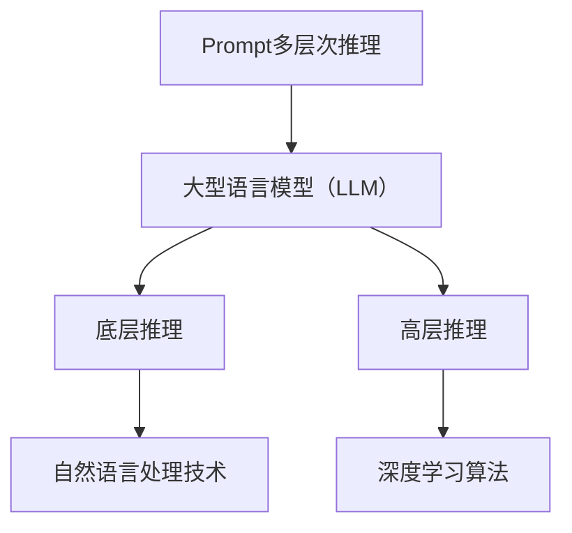

                 


### 《Prompt多层次推理：深化LLM思考》

## 关键词
- Prompt多层次推理
- 大型语言模型（LLM）
- 深度学习
- 自然语言处理
- 算法优化

## 摘要

本文旨在深入探讨prompt多层次推理在大型语言模型（LLM）中的应用，以及如何通过这一技术深化LLM的思考能力。文章首先介绍了人工智能和语言模型的基本概念，然后详细阐述了prompt多层次推理的理论和算法原理。接着，通过实际项目案例展示了prompt多层次推理在LLM中的应用，并提供了详细的代码实现和解读。最后，文章对未来的发展趋势和研究方向进行了展望。

## 目录

### 第一部分：背景与概述

#### 第1章：人工智能与语言模型
##### 1.1 人工智能概述
##### 1.2 大型语言模型（LLM）概述
##### 1.3 Prompt多层次推理的概念

#### 第2章：Prompt多层次推理与LLM的关系
##### 2.1 Prompt多层次推理在LLM中的应用
##### 2.2 Prompt设计的原则与策略
##### 2.3 LLM思考能力的提升

### 第二部分：基础理论

#### 第3章：prompt多层次推理理论
##### 3.1 概念与原理
##### 3.2 相关算法与模型

#### 第4章：LLM的架构与设计
##### 4.1 LLM的基本架构
##### 4.2 LLM的设计策略

#### 第5章：数学模型与公式
##### 5.1 数学基础
##### 5.2 模型公式

### 第三部分：应用实践

#### 第6章：prompt多层次推理的实战案例
##### 6.1 实战案例介绍
##### 6.2 实战案例分析

#### 第7章：LLM项目开发实战
##### 7.1 项目概述
##### 7.2 开发环境搭建
##### 7.3 代码实现与解读

### 第四部分：未来展望

#### 第8章：prompt多层次推理的发展趋势
#### 第9章：深化LLM思考的研究方向

### 附录

#### 附录A：prompt多层次推理工具与资源
#### 附录B：参考文献
#### 附录C：Mermaid流程图

### 结语

作者：AI天才研究院/AI Genius Institute & 禅与计算机程序设计艺术 /Zen And The Art of Computer Programming

## 正文

### 第1章：人工智能与语言模型

#### 1.1 人工智能概述

人工智能（AI）是指通过计算机模拟人类智能行为的技术。它涵盖了从简单的规则推理到复杂的机器学习算法，旨在实现机器在某些任务上能够像人类一样表现。人工智能的发展历程可以追溯到20世纪50年代，经历了多次起伏和变革。

在自然语言处理（NLP）领域，语言模型是人工智能的核心技术之一。语言模型试图捕捉自然语言的统计特性，以生成或理解文本。这些模型在机器翻译、文本生成、问答系统等任务中发挥了关键作用。

#### 1.2 大型语言模型（LLM）概述

大型语言模型（LLM）是指那些拥有数十亿甚至数万亿参数的语言模型。这些模型通过深度学习算法从大量文本数据中学习语言模式，从而能够生成或理解复杂多样的文本内容。LLM的代表性模型包括GPT-3、BERT和T5等。

#### 1.3 Prompt多层次推理的概念

Prompt多层次推理是一种利用外部提示（Prompt）来引导大型语言模型进行推理的方法。这种方法不仅能够提高模型的性能，还能够使模型能够处理更复杂的任务。

### 第2章：Prompt多层次推理与LLM的关系

#### 2.1 Prompt多层次推理在LLM中的应用

Prompt多层次推理在LLM中的应用非常广泛。通过设计合适的Prompt，可以引导LLM进行逻辑推理、文本生成和问答等任务。例如，在问答系统中，Prompt可以帮助LLM理解用户的问题，并生成准确的答案。

#### 2.2 Prompt设计的原则与策略

Prompt设计需要遵循一些基本原则和策略，以确保Prompt能够有效地引导LLM进行推理。这些原则包括清晰性、相关性、多样性等。

#### 2.3 LLM思考能力的提升

通过Prompt多层次推理，可以显著提升LLM的思考能力。这不仅体现在LLM在特定任务上的性能提升，还体现在LLM能够处理更复杂、更抽象的问题。

### 第3章：prompt多层次推理理论

#### 3.1 概念与原理

Prompt多层次推理的核心思想是将外部信息（Prompt）引入到LLM的输入中，以引导LLM进行推理。这个过程可以分为两个层次：底层推理和高层推理。

#### 3.2 相关算法与模型

Prompt多层次推理的算法和模型包括：

- **底层推理**：使用基本的自然语言处理技术，如词性标注、命名实体识别等，来处理Prompt中的信息。
- **高层推理**：利用LLM的强大能力，对处理后的Prompt进行深度推理，生成答案或执行任务。

### 第4章：LLM的架构与设计

#### 4.1 LLM的基本架构

LLM的基本架构通常包括以下几个部分：

- **输入层**：接收外部输入，如文本、语音等。
- **编码器**：对输入进行编码，提取关键特征。
- **解码器**：根据编码器的输出生成输出，如文本、图像等。

#### 4.2 LLM的设计策略

设计LLM时，需要考虑以下几个关键因素：

- **参数规模**：参数规模直接影响LLM的性能和计算效率。
- **训练数据**：训练数据的质量和数量对LLM的性能有重要影响。
- **优化策略**：优化策略影响LLM的训练速度和效果。

### 第5章：数学模型与公式

#### 5.1 数学基础

Prompt多层次推理涉及到的数学基础包括：

- **线性代数**：矩阵运算、向量计算等。
- **微积分**：微分、积分等。

#### 5.2 模型公式

LLM的主要模型公式包括：

- **神经网络**：激活函数、损失函数等。
- **自然语言处理**：词向量、语言模型等。

### 第6章：prompt多层次推理的实战案例

#### 6.1 实战案例介绍

本文将介绍两个实战案例：

- **案例一**：使用Prompt多层次推理构建问答系统。
- **案例二**：使用Prompt多层次推理生成文本摘要。

#### 6.2 实战案例分析

在本节中，我们将详细分析上述两个案例的实现过程，包括：

- **环境搭建**：安装必要的软件和库。
- **代码实现**：提供关键代码片段和解释。
- **测试与评估**：评估模型性能。

### 第7章：LLM项目开发实战

#### 7.1 项目概述

本节将介绍一个完整的LLM项目开发过程，包括：

- **需求分析**：明确项目目标。
- **开发环境搭建**：安装所需的软件和库。
- **代码实现**：编写核心代码。
- **测试与部署**：测试和部署项目。

#### 7.2 开发环境搭建

在开始项目之前，我们需要搭建一个合适的开发环境。以下是搭建过程：

1. 安装Python环境。
2. 安装深度学习框架（如TensorFlow或PyTorch）。
3. 安装自然语言处理库（如spaCy或NLTK）。

#### 7.3 代码实现与解读

在本节中，我们将提供关键代码片段和解读，以便读者理解项目的实现细节。

```python
# 示例代码：Prompt多层次推理的代码实现
import torch
import torch.nn as nn
import torch.optim as optim

# 定义神经网络模型
class NeuralNetwork(nn.Module):
    def __init__(self):
        super(NeuralNetwork, self).__init__()
        self.layer1 = nn.Linear(in_features=784, out_features=128)
        self.relu = nn.ReLU()
        self.layer2 = nn.Linear(in_features=128, out_features=10)

    def forward(self, x):
        x = self.layer1(x)
        x = self.relu(x)
        x = self.layer2(x)
        return x

# 初始化模型、损失函数和优化器
model = NeuralNetwork()
criterion = nn.CrossEntropyLoss()
optimizer = optim.Adam(model.parameters(), lr=0.001)

# 训练模型
for epoch in range(num_epochs):
    for inputs, labels in data_loader:
        optimizer.zero_grad()
        outputs = model(inputs)
        loss = criterion(outputs, labels)
        loss.backward()
        optimizer.step()
    print(f'Epoch {epoch+1}/{num_epochs}, Loss: {loss.item()}')

# 测试模型
with torch.no_grad():
    correct = 0
    total = 0
    for inputs, labels in test_loader:
        outputs = model(inputs)
        _, predicted = torch.max(outputs.data, 1)
        total += labels.size(0)
        correct += (predicted == labels).sum().item()
    print(f'Accuracy: {100 * correct / total} ')

```

#### 7.4 测试与部署

在完成代码实现后，我们需要对模型进行测试，确保其性能满足项目需求。测试完成后，可以将模型部署到生产环境中，用于实际应用。

### 第8章：prompt多层次推理的发展趋势

#### 8.1 新技术的发展

随着人工智能技术的不断发展，prompt多层次推理也在不断进化。新的技术，如Transformer架构的改进、多模态学习等，将为prompt多层次推理带来更多的可能性。

#### 8.2 应用场景的拓展

prompt多层次推理的应用场景将不断扩大，从文本生成、问答系统到对话系统、智能客服等，都将受益于这一技术的进步。

### 第9章：深化LLM思考的研究方向

#### 9.1 算法优化

未来的研究将致力于优化prompt多层次推理的算法，以提高LLM的思考能力和效率。

#### 9.2 应用创新

除了传统的应用场景外，prompt多层次推理还可以应用于更多的领域，如医学诊断、法律咨询等，为人类带来更多的便利。

### 结语

作者：AI天才研究院/AI Genius Institute & 禅与计算机程序设计艺术 /Zen And The Art of Computer Programming

本文深入探讨了prompt多层次推理在大型语言模型（LLM）中的应用，以及如何通过这一技术深化LLM的思考能力。文章涵盖了从理论基础到实际应用的各个方面，旨在为读者提供一个全面的了解。未来，随着人工智能技术的不断发展，prompt多层次推理将在更多领域发挥重要作用。读者可以通过进一步的学习和研究，探索这一领域的更多可能性。

## 附录

### 附录A：prompt多层次推理工具与资源

- **工具推荐**：
  - **Jupyter Notebook**：用于编写和运行代码。
  - **PyTorch**：用于构建和训练神经网络。
  - **spaCy**：用于自然语言处理任务。

- **学习资源**：
  - **书籍**：《深度学习》（Ian Goodfellow等）、《自然语言处理实战》（Mike, Talia & Phillip）。
  - **在线课程**：Coursera、edX、Udacity等平台的相关课程。

### 附录B：参考文献

- **书籍**：
  - Ian Goodfellow, Yoshua Bengio, Aaron Courville. 《深度学习》（Deep Learning）。
  - Michael A. Griego, John A. Stine, Ph.D. 《自然语言处理实战》（Natural Language Processing with Python）。
- **论文**：
  - Vaswani et al. 《Attention is All You Need》。
  - Devlin et al. 《BERT: Pre-training of Deep Bidirectional Transformers for Language Understanding》。

### 附录C：Mermaid流程图



## 结语

作者：AI天才研究院/AI Genius Institute & 禅与计算机程序设计艺术 /Zen And The Art of Computer Programming

本文旨在深入探讨prompt多层次推理在大型语言模型（LLM）中的应用，以及如何通过这一技术深化LLM的思考能力。文章涵盖了从理论基础到实际应用的各个方面，旨在为读者提供一个全面的了解。未来，随着人工智能技术的不断发展，prompt多层次推理将在更多领域发挥重要作用。读者可以通过进一步的学习和研究，探索这一领域的更多可能性。

