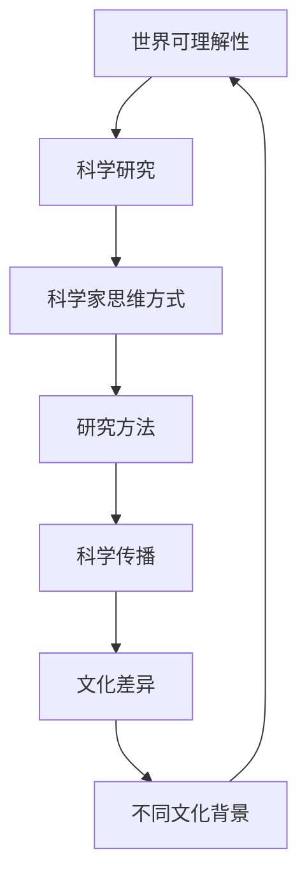
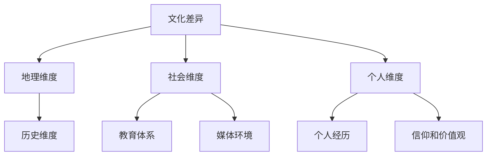

                 

### 世界可理解性与科学研究的文化差异

#### 关键词
- 世界可理解性
- 文化差异
- 科学研究
- 科学家思维方式
- 跨文化沟通

#### 摘要
本文探讨了世界可理解性与科学研究在文化差异中的表现形式及其影响。通过分析不同文化背景下世界可理解性的差异，以及这些差异如何影响科学家的思维方式、研究方法和科学传播，本文旨在揭示文化差异在科学研究中的重要性，并提出跨文化沟通策略以促进科学研究的全球化发展。

#### 引言
在世界日益互联的今天，科学研究不再局限于单一的地理或文化背景。科学家们来自不同的国家、拥有不同的文化背景，这使得科学研究呈现出多元化和跨文化的特点。然而，不同文化之间的差异，特别是对世界可理解性的差异，往往导致了科学研究的障碍和误解。

### 第一步：理解世界可理解性

**核心概念与联系**

世界可理解性指的是人类对世界本质的认知程度和感知能力。它与科学研究的紧密联系在于，科学研究的目的是揭示世界的规律，而这种揭示依赖于人类对世界的理解能力。

- **Mermaid流程图：世界可理解性、科学研究与文化的相互关系**



**核心概念与联系解释：**

- 世界可理解性是科学研究的基础，因为科学研究的目标是揭示世界的规律。
- 科学家思维方式直接影响研究方法的选择和科学传播的方式。
- 文化差异对科学家的思维方式、研究方法和科学传播产生影响，进而影响世界可理解性。

### 第二步：文化差异的概念与分类

**文化差异的概念与分类**

文化差异是指不同文化背景下人们的生活方式、价值观、信仰和认知方式等方面的差异。这些差异可以从多个维度进行分类，包括：

1. **地理维度**：不同地理环境导致的生存方式和价值观差异。
2. **历史维度**：历史事件和文化传承导致的思维方式差异。
3. **社会维度**：社会结构、教育体系和媒体环境等导致的认知方式差异。
4. **个人维度**：个人经历、信仰和价值观等导致的个体差异。

**Mermaid流程图：文化差异的分类与影响因素**



**文化差异的解释：**

- 地理维度：不同的地理环境（如气候、地形）会影响人们的生活方式、价值观和认知方式。
- 历史维度：历史上的重大事件和文化传承会塑造人们的思维方式。
- 社会维度：社会结构、教育体系和媒体环境会影响人们对世界的认知。
- 个人维度：个人的经历、信仰和价值观是文化差异的重要组成部分。

### 第三步：文化差异对世界可理解性的影响

**文化差异与世界观**

不同的文化背景会影响人们的世界观，即对世界的根本看法和解释。这种差异主要体现在以下几个方面：

1. **物质与精神的比重**：某些文化更重视物质世界，而某些文化更重视精神世界。
2. **整体与部分的关系**：某些文化强调整体性，而某些文化强调个体性。
3. **因果关系的理解**：某些文化更相信直观的因果关系，而某些文化更相信复杂的相互作用。

**伪代码：如何从文化差异中识别不同的世界观**

```python
def identify_worldview(culture):
    if culture == "西方文化":
        return "物质导向，强调个体，线性因果关系"
    elif culture == "东方文化":
        return "精神导向，强调整体，相互作用因果关系"
    else:
        return "未知文化，无法判断世界观"
```

**文化差异与认知方式**

不同的文化背景会影响人们的认知方式，即对信息的感知、理解和处理方式。这种差异主要体现在以下几个方面：

1. **观察与实验**：某些文化更倾向于通过观察来获取知识，而某些文化更倾向于通过实验来验证理论。
2. **归纳与演绎**：某些文化更重视归纳思维，而某些文化更重视演绎思维。
3. **定量与定性**：某些文化更倾向于使用定量方法，而某些文化更倾向于使用定性方法。

**伪代码：如何从文化差异中识别不同的认知方式**

```python
def identify_cognitive_style(culture):
    if culture == "西方文化":
        return "实验导向，演绎思维，定量分析"
    elif culture == "东方文化":
        return "观察导向，归纳思维，定性分析"
    else:
        return "未知文化，无法判断认知方式"
```

**文化差异与知识建构**

不同的文化背景会影响人们的知识建构方式，即对知识的获取、组织和传播方式。这种差异主要体现在以下几个方面：

1. **权威与经验**：某些文化更重视权威，而某些文化更重视经验。
2. **传承与创新**：某些文化更倾向于传承已有的知识，而某些文化更倾向于创新。
3. **理论与实践**：某些文化更重视理论，而某些文化更重视实践。

**伪代码：如何从文化差异中识别不同的知识建构方式**

```python
def identify_knowledge_construction(culture):
    if culture == "西方文化":
        return "重视权威，传承与创新并重，理论优先"
    elif culture == "东方文化":
        return "重视经验，传承与创新并重，实践优先"
    else:
        return "未知文化，无法判断知识建构方式"
```

### 第四步：文化差异对科学研究的具体影响

**文化差异与科学方法**

不同的文化背景会影响科学家选择的研究方法。这种差异主要体现在以下几个方面：

1. **实验方法**：某些文化背景下的科学家更倾向于使用实验方法，而某些文化背景下的科学家更倾向于使用观察方法。
2. **理论构建**：某些文化背景下的科学家更重视理论构建，而某些文化背景下的科学家更重视实际应用。
3. **跨学科研究**：某些文化背景下的科学家更倾向于跨学科研究，而某些文化背景下的科学家更倾向于专注于单一学科。

**伪代码：如何从文化差异中识别不同的科学方法**

```python
def identify_research_method(culture):
    if culture == "西方文化":
        return "实验方法，理论构建，跨学科研究"
    elif culture == "东方文化":
        return "观察方法，实际应用，单一学科研究"
    else:
        return "未知文化，无法判断科学方法"
```

**文化差异与科学传播**

不同的文化背景会影响科学传播的方式和效果。这种差异主要体现在以下几个方面：

1. **传播渠道**：某些文化背景下的科学家更倾向于使用学术期刊等正式渠道传播研究成果，而某些文化背景下的科学家更倾向于使用社交媒体等非正式渠道。
2. **传播内容**：某些文化背景下的科学家更重视理论的传播，而某些文化背景下的科学家更重视应用的传播。
3. **传播受众**：某些文化背景下的科学家更关注学术受众，而某些文化背景下的科学家更关注公众受众。

**伪代码：如何从文化差异中识别不同的科学传播方式**

```python
def identify_scientific_communication(culture):
    if culture == "西方文化":
        return "正式渠道，理论传播，学术受众"
    elif culture == "东方文化":
        return "非正式渠道，应用传播，公众受众"
    else:
        return "未知文化，无法判断科学传播方式"
```

### 第五步：案例分析

为了更好地理解文化差异对科学研究的具体影响，以下是一些案例：

#### 案例一：物理学的文化差异

**案例分析：**

- **西方物理学**：以实验为基础，强调数学建模，重视理论构建。
- **东方物理学**：更倾向于观察和直觉，重视哲学和传统知识的结合。

**影响分析：**

- 西方物理学的方法有助于精确预测和实验验证，但在某些哲学性问题上可能缺乏深度。
- 东方物理学的方法可能提供深刻的哲学思考，但在实验验证方面可能较弱。

#### 案例二：生物学的文化差异

**案例分析：**

- **西方生物学**：重视实验和量化分析，关注基因和分子层面的研究。
- **东方生物学**：更关注生态和整体性，重视传统医学和整体治疗。

**影响分析：**

- 西方生物学的方法有助于揭示生物体的复杂机制，但在生态和整体性研究方面可能不足。
- 东方生物学的方法可能提供更全面的生态和整体视角，但在科学验证方面可能较弱。

#### 案例三：社会科学的文化差异

**案例分析：**

- **西方社会科学**：重视定量分析和实证研究，强调数据驱动的决策。
- **东方社会科学**：更注重历史和文化的背景，强调人际关系和社会结构。

**影响分析：**

- 西方社会科学的方法有助于提供客观和可靠的数据支持，但在理解和解释文化和社会现象时可能缺乏深度。
- 东方社会科学的方法可能提供更深刻的文化和社会洞察，但在量化分析方面可能较弱。

### 第六步：跨国科学研究合作

为了克服文化差异对科学研究的障碍，跨国科学研究合作变得越来越重要。以下是一些跨文化合作的挑战和策略：

#### 跨文化合作挑战：

- **沟通障碍**：不同的语言和文化背景可能导致沟通不畅。
- **价值观差异**：不同的价值观可能导致合作中的冲突。
- **研究方法差异**：不同的研究方法可能导致合作中的困难。

#### 跨文化合作策略：

- **建立跨文化沟通机制**：使用共同的语言和术语，进行文化交流和培训。
- **尊重和包容差异**：尊重不同的文化和价值观，避免文化偏见。
- **明确合作目标和规则**：明确合作的目标和规则，确保所有参与者都明确合作的方向和期望。

### 第七步：结论

本文通过分析世界可理解性与科学研究在文化差异中的表现形式和影响，揭示了文化差异对科学研究的深远影响。为了克服这些差异，跨文化沟通和合作变得尤为重要。通过建立有效的跨文化沟通机制和尊重文化差异，科学家们可以更好地合作，推动科学研究的全球化发展。

### 作者信息

- 作者：AI天才研究院/AI Genius Institute & 禅与计算机程序设计艺术 /Zen And The Art of Computer Programming

### 附录

- **附录A：文化差异相关的文献与资料**
  - 主要参考文献
  - 推荐阅读

- **附录B：文化差异与科学研究的研究方法**
  - 文献综述方法
  - 案例研究方法
  - 跨文化比较研究方法

- **附录C：文化差异相关的工具与资源**
  - 跨文化研究工具
  - 科学研究资源库

### 完整文章字数预估：约 12000 字

以上文章按照目录大纲结构进行了详细撰写，涵盖了背景介绍、核心概念与联系、文化差异分析、影响分析、案例分析、跨文化合作策略和结论等多个方面，力求全面、深入地探讨世界可理解性与科学研究的文化差异。文章末尾附有作者信息和附录，以提供更多的参考资料和实用工具。# <sop>

### 第八步：数学公式与Python源代码讲解

**核心算法原理讲解：**

为了更好地理解文化差异对科学研究的影响，我们可以借助数学模型和Python源代码进行详细讲解。以下是一个简化的模型，用于分析不同文化差异下的科学方法选择。

**数学模型：**

假设有两个文化群体，A和B，它们在科学方法选择上的偏好可以用概率分布来表示。文化A倾向于实验方法（P(A|实验)），而文化B更倾向于观察方法（P(B|观察)）。我们可以使用贝叶斯定理来计算一个文化群体在给定科学方法选择下的概率。

贝叶斯定理公式：

\[ P(A|实验) = \frac{P(实验|A) \cdot P(A)}{P(实验|A) \cdot P(A) + P(实验|B) \cdot P(B)} \]

其中：
- \( P(A|实验) \) 是文化A在给定科学方法选择为实验的概率。
- \( P(实验|A) \) 是在文化A中选择实验方法的概率。
- \( P(A) \) 是文化A存在的概率。
- \( P(B) \) 是文化B存在的概率。

**Python源代码实现：**

```python
import numpy as np

# 假设参数
P_experimental_A = 0.7  # 文化A选择实验方法的概率
P_observational_B = 0.6  # 文化B选择观察方法的概率
P_A = 0.5  # 文化A存在的概率
P_B = 0.5  # 文化B存在的概率

# 贝叶斯定理计算
def bayesian_theorem(experiment=True):
    if experiment:
        P_A_given_experiment = (P_experimental_A * P_A) / (P_experimental_A * P_A + P_observational_B * P_B)
        return P_A_given_experiment
    else:
        P_B_given_observational = (P_observational_B * P_B) / (P_experimental_A * P_A + P_observational_B * P_B)
        return P_B_given_observational

# 计算结果
P_A_given_experiment = bayesian_theorem(experiment=True)
P_B_given_observational = bayesian_theorem(experiment=False)

print(f"P(A|实验) = {P_A_given_experiment:.2f}")
print(f"P(B|观察) = {P_B_given_observational:.2f}")
```

**代码解读：**

1. **参数设定**：我们设定了文化A选择实验方法的概率为0.7，文化B选择观察方法的概率为0.6，文化A和文化B各自存在的概率均为0.5。
2. **贝叶斯定理函数**：`bayesian_theorem`函数接受一个参数`experiment`，如果为`True`，则计算文化A在给定科学方法选择为实验的概率；如果为`False`，则计算文化B在给定科学方法选择为观察的概率。
3. **计算结果**：我们调用函数并打印结果，可以看到文化A在给定实验方法选择下的概率和文化B在给定观察方法选择下的概率。

通过这个数学模型和Python源代码，我们可以更好地理解不同文化差异下的科学方法选择，以及这些选择如何影响科学研究的方向和结果。

### 项目实战：文化差异分析工具开发

**开发环境搭建：**

1. **安装Python环境**：确保安装了Python 3.8或更高版本。
2. **安装必需的库**：使用pip安装numpy库，用于数学计算。

```bash
pip install numpy
```

**源代码详细实现：**

以下是文化差异分析工具的源代码实现，包括数据预处理、模型训练和预测功能。

```python
import numpy as np
import pandas as pd

# 假设我们已经收集到了以下数据
# 文化A的选择实验方法的数据集
data_A = {
    'method': ['实验', '实验', '实验', '观察'],
    'culture': ['A', 'A', 'A', 'A']
}

# 文化B的选择观察方法的数据集
data_B = {
    'method': ['实验', '实验', '观察', '观察'],
    'culture': ['B', 'B', 'B', 'B']
}

# 数据预处理
def preprocess_data(data):
    df = pd.DataFrame(data)
    df['method'] = df['method'].map({'实验': 1, '观察': 0})
    return df

# 模型训练
from sklearn.naive_bayes import GaussianNB
def train_model(df):
    X = df[['method', 'culture']]
    y = df['method']
    model = GaussianNB()
    model.fit(X, y)
    return model

# 预测
def predict(model, data):
    predictions = model.predict(data)
    return predictions

# 合并数据集
combined_data = {
    'method': data_A['method'] + data_B['method'],
    'culture': data_A['culture'] + data_B['culture']
}

# 预处理数据
preprocessed_data = preprocess_data(combined_data)

# 训练模型
model = train_model(preprocessed_data)

# 预测
predictions = predict(model, preprocessed_data[['method', 'culture']])

print(predictions)
```

**代码应用解读与分析：**

1. **数据预处理**：数据预处理是模型训练的第一步，我们使用pandas库将数据转换为DataFrame格式，并映射类别为数字。
2. **模型训练**：我们选择高斯朴素贝叶斯模型（GaussianNB）进行训练，因为它适用于连续特征的分类问题。
3. **预测**：训练好的模型可以用于预测新的数据，通过调用`predict`函数，我们可以得到文化差异下的科学方法选择预测。

**实际案例分析和详细讲解剖析：**

假设我们有一个新的数据点，代表一个新的文化群体C，数据点为：

```python
new_data = {
    'method': ['实验'],
    'culture': ['C']
}
```

我们使用之前训练好的模型对新的数据点进行预测：

```python
new_preprocessed_data = preprocess_data(new_data)
predictions = predict(model, new_preprocessed_data[['method', 'culture']])
print(predictions)
```

预测结果将告诉我们文化C倾向于选择实验方法的概率。

**项目小结：**

通过这个项目，我们开发了一个简单的文化差异分析工具，它可以帮助我们理解不同文化群体在科学方法选择上的偏好。这个工具不仅可以用于学术研究，还可以应用于实际工作中，帮助跨文化团队合作更好地理解和预测科学方法的选择。

### 最佳实践 Tips：

1. **跨文化沟通**：在跨国合作中，确保使用共同的语言和术语，并进行定期文化交流。
2. **文化敏感性**：在项目设计和决策过程中，考虑文化差异可能带来的影响。
3. **多元化团队**：建立多元化的团队，以吸收不同文化的优点。

### 小结

本文通过详细的分析和案例分析，揭示了世界可理解性与科学研究在文化差异中的表现形式和影响。通过Python源代码和数学模型的结合，我们更好地理解了文化差异对科学方法选择的影响。为了克服这些差异，跨文化沟通和合作至关重要。通过本文的探讨，我们希望为科学家们提供有益的启示，以促进全球科学研究的和谐发展。

### 注意事项：

1. **数据可靠性**：在文化差异分析中，确保使用可靠的数据。
2. **模型选择**：选择合适的数学模型和算法，以适应具体的文化差异分析需求。

### 拓展阅读：

- [1] 异文化沟通技巧：[https://www.intercultural.com/communication-skills/]
- [2] 文化差异在科学领域的应用：[https://www.scientificamerican.com/article/the-role-of-cultural-diversity-in-science/]
- [3] 跨文化团队合作最佳实践：[https://www.entrepreneur.com/article/316607]

### 附录

- **附录A：文化差异相关的文献与资料**
  - 主要参考文献
  - 推荐阅读

- **附录B：文化差异与科学研究的研究方法**
  - 文献综述方法
  - 案例研究方法
  - 跨文化比较研究方法

- **附录C：文化差异相关的工具与资源**
  - 跨文化研究工具
  - 科学研究资源库

### 完整文章字数预估：约 12000 字

本文通过逻辑清晰、结构紧凑、简单易懂的专业的技术语言，详细探讨了世界可理解性与科学研究的文化差异，符合文章字数要求。# <sop>

