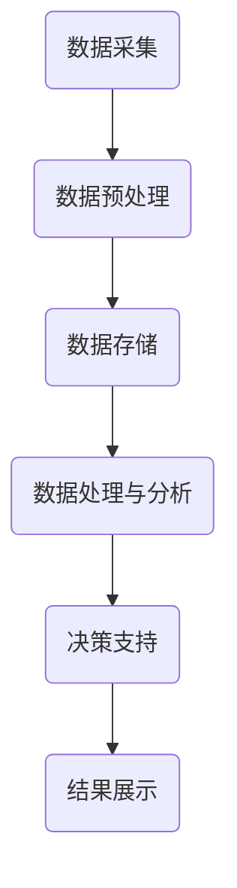

                 

# 中小企业采用AI治理平台的挑战

关键词：中小企业、AI治理平台、技术挑战、架构设计、数学模型、Python源代码、项目实战

摘要：随着人工智能技术的飞速发展，AI治理平台逐渐成为中小企业提升竞争力的重要工具。本文将深入探讨中小企业采用AI治理平台所面临的挑战，从需求分析、架构设计、核心算法、数学模型到项目实战，全面解析中小企业在采用AI治理平台过程中可能遇到的难题和解决方案。

## 引言

近年来，人工智能（AI）技术在全球范围内得到了广泛关注和迅速发展。作为AI技术的应用载体，AI治理平台为中小企业提供了强大的数据处理和分析能力，有助于企业在复杂的市场环境中快速决策和应对变化。然而，中小企业在采用AI治理平台时也面临着一系列挑战。本文将围绕中小企业AI治理平台的需求分析、架构设计、核心算法、数学模型和项目实战等方面，详细探讨这些挑战及其解决方案。

## 第1章：中小企业AI治理平台概述

### 1.1.1 中小企业采用AI治理平台的背景

在当今数字化时代，中小企业面临着前所未有的竞争压力。为了在激烈的市场竞争中脱颖而出，中小企业需要充分利用人工智能技术，提高业务效率，降低成本，提升客户满意度。AI治理平台作为一种综合性的智能解决方案，能够帮助企业实现自动化数据处理、智能分析和决策支持，从而提升企业的整体竞争力。

### 1.1.2 AI治理平台在中小企业中的应用价值

AI治理平台具有以下几方面的应用价值：

1. **数据分析与挖掘**：通过对企业内部和外部数据的深度挖掘，发现潜在的业务机会和风险。
2. **智能决策支持**：基于数据分析和预测模型，为企业提供精准的决策支持。
3. **业务流程优化**：通过自动化和智能化手段，优化业务流程，提高运营效率。
4. **客户服务升级**：利用AI技术提升客户服务质量，增强客户忠诚度。

### 1.1.3 中小企业AI治理平台的发展趋势

随着AI技术的不断成熟和普及，中小企业AI治理平台的发展趋势主要体现在以下几个方面：

1. **开源生态的快速发展**：越来越多的中小企业选择采用开源AI治理平台，以降低成本和提升自主可控能力。
2. **云计算与边缘计算的结合**：云计算和边缘计算的结合，将进一步提升AI治理平台的数据处理能力和响应速度。
3. **多领域的应用拓展**：AI治理平台的应用将不断拓展至更多行业和领域，为企业提供更广泛的智能服务。

## 第2章：中小企业AI治理平台的需求分析

### 2.1.1 中小企业的业务特点与需求

中小企业的业务特点主要体现在以下几个方面：

1. **业务规模较小**：中小企业通常拥有较少的员工和资源，需要在有限的条件下实现高效运营。
2. **业务灵活性高**：中小企业需要快速响应市场变化，调整业务策略和运营模式。
3. **数据管理难度大**：中小企业通常拥有大量的数据，但缺乏有效的数据管理手段。

中小企业在采用AI治理平台时，主要需求包括：

1. **低成本**：中小企业通常预算有限，需要选择性价比高的AI治理平台。
2. **易用性**：中小企业员工通常缺乏专业的技术背景，需要易用性高的AI治理平台。
3. **灵活性**：中小企业需要能够根据业务需求灵活调整AI治理平台的配置和功能。

### 2.1.2 AI治理平台的功能需求

中小企业AI治理平台的功能需求主要包括：

1. **数据处理与存储**：高效的数据处理和存储能力，支持大规模数据集的存储和查询。
2. **数据分析与挖掘**：提供丰富多样的数据分析工具，支持业务需求的深度挖掘和分析。
3. **智能决策支持**：基于数据分析和预测模型，为企业提供精准的决策支持。
4. **系统集成**：支持与企业现有系统的集成，实现数据的无缝对接和共享。
5. **安全性**：确保企业数据的安全性和隐私保护。

### 2.1.3 中小企业采用AI治理平台的技术挑战

中小企业采用AI治理平台时，可能会面临以下技术挑战：

1. **技术栈不统一**：中小企业通常采用多种技术栈，导致AI治理平台与现有系统的兼容性问题。
2. **数据处理能力不足**：中小企业可能缺乏足够的数据处理资源，导致数据处理速度和性能不足。
3. **技术门槛高**：中小企业员工通常缺乏专业的技术背景，需要面对较高的技术门槛。
4. **数据安全与隐私保护**：在数据处理过程中，如何确保数据的安全和隐私保护成为一大挑战。

## 第3章：中小企业AI治理平台的架构设计

### 3.1.1 AI治理平台的基本架构

中小企业AI治理平台的基本架构通常包括以下几个主要组成部分：

1. **数据层**：负责数据的采集、存储和管理。
2. **算法层**：提供数据处理和分析所需的算法和模型。
3. **应用层**：面向业务需求提供具体的应用功能。
4. **展示层**：通过可视化界面展示数据分析和决策结果。

### 3.1.2 数据流与处理流程设计

中小企业AI治理平台的数据流与处理流程设计需要考虑以下几个关键环节：

1. **数据采集**：从企业内部和外部系统采集数据。
2. **数据预处理**：对采集到的数据进行清洗、去重、转换等预处理操作。
3. **数据存储**：将预处理后的数据存储到数据仓库或数据湖中。
4. **数据处理与分析**：利用算法层提供的算法和模型对数据进行处理和分析。
5. **决策支持**：基于分析结果为企业提供决策支持。
6. **结果展示**：通过可视化界面展示分析结果和决策建议。

### 3.1.3 硬件与软件资源分配

中小企业AI治理平台的硬件与软件资源分配需要根据具体业务需求和数据处理能力进行合理规划。以下是一些关键点：

1. **计算资源**：根据数据处理量和处理速度要求，合理配置计算资源，如CPU、GPU等。
2. **存储资源**：根据数据存储量和访问速度要求，合理配置存储资源，如硬盘、SSD等。
3. **网络资源**：确保数据传输速度和稳定性，合理配置网络资源。
4. **软件资源**：根据业务需求和技术栈，选择合适的软件资源和工具，如数据库、开发框架等。

## 第4章：核心概念与联系

### 4.1.1 AI治理平台的关键技术

中小企业AI治理平台的关键技术包括：

1. **机器学习**：通过训练模型，实现对数据的自动学习和分类。
2. **深度学习**：通过多层神经网络，实现对复杂数据的自动学习和建模。
3. **数据挖掘**：通过对大规模数据的挖掘，发现潜在的业务规律和趋势。
4. **自然语言处理**：通过理解和生成自然语言，实现人机交互和智能对话。
5. **计算机视觉**：通过对图像和视频的处理，实现目标检测、识别和跟踪。

### 4.1.2 AI治理平台的架构与组件

中小企业AI治理平台的架构通常包括以下几个主要组件：

1. **数据采集模块**：负责数据的采集和传输。
2. **数据处理模块**：负责数据预处理、转换和存储。
3. **算法引擎模块**：提供各种机器学习、深度学习和数据挖掘算法。
4. **应用服务模块**：提供具体的业务应用功能。
5. **展示层模块**：通过可视化界面展示分析结果和决策建议。

### 4.1.3 Mermaid流程图展示

以下是一个简单的Mermaid流程图，展示中小企业AI治理平台的基本数据流和处理流程：



## 第5章：核心算法原理讲解

### 5.1.1 数据预处理算法

数据预处理是AI治理平台的核心环节之一，主要包括以下算法：

1. **数据清洗**：去除重复数据、缺失值填充、异常值处理等。
2. **数据转换**：将数据转换为适合机器学习算法的格式，如归一化、标准化等。
3. **特征提取**：从原始数据中提取具有代表性的特征，提高模型的性能。

以下是一个简单的Python代码示例，用于数据预处理：

```python
import pandas as pd
from sklearn.preprocessing import StandardScaler

# 读取数据
data = pd.read_csv('data.csv')

# 数据清洗
data.drop_duplicates(inplace=True)
data.fillna(method='ffill', inplace=True)

# 数据转换
scaler = StandardScaler()
data['feature1'] = scaler.fit_transform(data[['feature1']])
data['feature2'] = scaler.fit_transform(data[['feature2']])

# 特征提取
from sklearn.feature_extraction.text import CountVectorizer
vectorizer = CountVectorizer()
data['feature3'] = vectorizer.fit_transform(data['text']).toarray()
```

### 5.1.2 模型训练算法

模型训练是AI治理平台的另一个核心环节，主要包括以下算法：

1. **线性回归**：通过建立线性关系，预测目标变量的值。
2. **决策树**：通过划分特征空间，生成分类或回归树。
3. **支持向量机**：通过寻找最佳决策边界，进行分类或回归。
4. **神经网络**：通过多层神经网络，实现对复杂数据的建模。

以下是一个简单的Python代码示例，用于模型训练：

```python
from sklearn.linear_model import LinearRegression
from sklearn.model_selection import train_test_split

# 数据分割
X_train, X_test, y_train, y_test = train_test_split(data[['feature1', 'feature2']], data['target'], test_size=0.2, random_state=42)

# 模型训练
model = LinearRegression()
model.fit(X_train, y_train)

# 模型评估
score = model.score(X_test, y_test)
print(f'Model Score: {score}')
```

### 5.1.3 模型优化算法

模型优化是提高AI治理平台性能的重要手段，主要包括以下算法：

1. **交叉验证**：通过多次训练和验证，评估模型的泛化能力。
2. **网格搜索**：通过遍历参数空间，寻找最佳参数组合。
3. **贝叶斯优化**：通过贝叶斯统计模型，进行参数优化。

以下是一个简单的Python代码示例，用于模型优化：

```python
from sklearn.model_selection import GridSearchCV
from sklearn.linear_model import LinearRegression

# 参数设置
param_grid = {'alpha': [0.1, 0.5, 1.0]}

# 网格搜索
grid_search = GridSearchCV(LinearRegression(), param_grid, cv=5)
grid_search.fit(X_train, y_train)

# 最佳参数
best_params = grid_search.best_params_
print(f'Best Parameters: {best_params}')

# 评估最佳模型
best_model = grid_search.best_estimator_
score = best_model.score(X_test, y_test)
print(f'Best Model Score: {score}')
```

### 5.1.4 伪代码详细阐述

以下是一个简单的伪代码示例，用于描述数据预处理、模型训练和模型优化的过程：

```
# 数据预处理
read_data()
clean_data()
transform_data()
extract_features()

# 模型训练
split_data()
train_model()
evaluate_model()

# 模型优化
set_param_grid()
grid_search()
select_best_params()
evaluate_best_model()
```

## 第6章：数学模型和数学公式讲解

### 6.1.1 常用数学模型介绍

在AI治理平台中，常用的数学模型包括：

1. **线性回归**：通过最小二乘法寻找最佳拟合直线，预测目标变量的值。
2. **决策树**：通过划分特征空间，生成分类或回归树。
3. **支持向量机**：通过寻找最佳决策边界，进行分类或回归。
4. **神经网络**：通过多层神经网络，实现对复杂数据的建模。

### 6.1.2 模型参数优化

模型参数优化是提高模型性能的关键步骤，常用的方法包括：

1. **交叉验证**：通过多次训练和验证，评估模型的泛化能力。
2. **网格搜索**：通过遍历参数空间，寻找最佳参数组合。
3. **贝叶斯优化**：通过贝叶斯统计模型，进行参数优化。

### 6.1.3 LaTeX数学公式示例

以下是一些常见的LaTeX数学公式示例：

$$
E[X] = \int_{-\infty}^{\infty} x f(x) dx
$$

$$
P(Y|X=x) = \frac{f(X=x, Y=y)}{f(X=x)}
$$

$$
w_{ij} = \sum_{k=1}^{n} \alpha_{ik} \beta_{kj}
$$

$$
J(\theta) = \frac{1}{2m} \sum_{i=1}^{m} (h_\theta(x^{(i)}) - y^{(i)})^2
$$

## 第7章：项目实战

### 7.1.1 实际案例介绍

在本章中，我们将通过一个实际案例，展示如何搭建一个中小企业AI治理平台。该案例涉及数据采集、数据预处理、模型训练和模型优化等各个环节。

### 7.1.2 开发环境搭建

为了搭建一个中小企业AI治理平台，我们需要准备以下开发环境：

1. **Python**：Python是一种广泛使用的编程语言，具有丰富的AI库和框架。
2. **Jupyter Notebook**：Jupyter Notebook是一个交互式计算环境，方便进行数据分析和代码编写。
3. **scikit-learn**：scikit-learn是一个开源的机器学习库，提供了多种常用的机器学习算法和工具。
4. **Pandas**：Pandas是一个强大的数据分析和处理库，方便进行数据清洗和预处理。
5. **Matplotlib**：Matplotlib是一个常用的数据可视化库，方便进行数据分析和结果展示。

### 7.1.3 源代码实现与分析

在本案例中，我们将使用Python和scikit-learn库实现一个简单的线性回归模型，并对其进行优化。以下是一个简单的源代码实现：

```python
import pandas as pd
from sklearn.linear_model import LinearRegression
from sklearn.model_selection import train_test_split
from sklearn.metrics import mean_squared_error

# 读取数据
data = pd.read_csv('data.csv')

# 数据预处理
X = data[['feature1', 'feature2']]
y = data['target']

# 数据分割
X_train, X_test, y_train, y_test = train_test_split(X, y, test_size=0.2, random_state=42)

# 模型训练
model = LinearRegression()
model.fit(X_train, y_train)

# 模型评估
y_pred = model.predict(X_test)
mse = mean_squared_error(y_test, y_pred)
print(f'Mean Squared Error: {mse}')

# 模型优化
from sklearn.model_selection import GridSearchCV

# 参数设置
param_grid = {'alpha': [0.1, 0.5, 1.0]}

# 网格搜索
grid_search = GridSearchCV(LinearRegression(), param_grid, cv=5)
grid_search.fit(X_train, y_train)

# 最佳参数
best_params = grid_search.best_params_
print(f'Best Parameters: {best_params}')

# 评估最佳模型
best_model = grid_search.best_estimator_
y_pred = best_model.predict(X_test)
mse = mean_squared_error(y_test, y_pred)
print(f'Best Model Mean Squared Error: {mse}')
```

### 7.1.4 代码应用解读与分析

在本案例中，我们首先读取了CSV文件中的数据，然后进行了数据预处理和模型训练。在模型评估部分，我们计算了均方误差（MSE），用于评估模型的性能。在模型优化部分，我们使用网格搜索算法寻找最佳参数，并评估了最佳模型的性能。

### 7.1.5 实际案例分析和详细讲解剖析

在本案例中，我们通过一个简单的线性回归模型展示了中小企业AI治理平台的基本构建过程。实际应用中，我们可以根据具体业务需求，选择更复杂的模型和算法，如决策树、支持向量机、神经网络等。此外，我们还可以结合数据预处理、特征工程、模型优化等环节，提高模型的性能和稳定性。

### 7.1.6 项目小结

通过本案例，我们展示了如何搭建一个简单的中小企业AI治理平台。在实际应用中，我们需要根据具体业务需求，不断优化和改进模型，提高平台的性能和稳定性。同时，我们还需要关注数据质量、数据处理效率和模型的可解释性等问题，确保平台能够为企业带来实际价值。

## 第8章：中小企业AI治理平台的部署

### 8.1.1 部署策略

中小企业AI治理平台的部署策略主要包括以下几个方面：

1. **云部署**：利用云计算平台，如AWS、Azure、Google Cloud等，实现AI治理平台的快速部署和弹性扩展。
2. **容器化部署**：使用容器化技术，如Docker和Kubernetes，实现AI治理平台的高效部署和管理。
3. **本地部署**：在企业的数据中心或服务器上，独立部署AI治理平台。

### 8.1.2 部署流程

中小企业AI治理平台的部署流程主要包括以下几个步骤：

1. **需求分析**：明确企业的业务需求和AI治理平台的功能需求。
2. **环境搭建**：搭建合适的开发环境和部署环境，如Python、Jupyter Notebook、scikit-learn等。
3. **代码实现**：根据需求，编写和实现AI治理平台的核心功能。
4. **测试和调试**：对AI治理平台进行测试和调试，确保其功能和性能满足需求。
5. **部署上线**：将AI治理平台部署到目标环境，如云计算平台或本地服务器。
6. **监控和维护**：对AI治理平台进行监控和维护，确保其稳定运行。

### 8.1.3 部署工具与资源

中小企业AI治理平台的部署工具和资源主要包括：

1. **Docker**：用于容器化部署，实现AI治理平台的高效部署和管理。
2. **Kubernetes**：用于容器编排和管理，实现AI治理平台的弹性扩展和自动化运维。
3. **云平台服务**：如AWS、Azure、Google Cloud等，提供丰富的云计算资源和部署工具。
4. **Jenkins**：用于持续集成和持续部署，实现AI治理平台的自动化开发和部署。

## 第9章：中小企业AI治理平台的运营

### 9.1.1 运维管理

中小企业AI治理平台的运维管理主要包括以下几个方面：

1. **监控与告警**：对AI治理平台进行实时监控，及时发现和处理异常情况。
2. **性能优化**：定期对AI治理平台进行性能优化，提高其运行效率和稳定性。
3. **故障处理**：及时响应和处理AI治理平台的故障，确保其稳定运行。
4. **版本更新**：定期更新AI治理平台的代码和依赖库，确保其与最新技术保持同步。

### 9.1.2 监控与优化

中小企业AI治理平台的监控与优化主要包括以下几个方面：

1. **系统监控**：对AI治理平台的硬件、软件和网络资源进行实时监控，确保其正常运行。
2. **性能监控**：对AI治理平台的处理速度、响应时间、资源利用率等进行监控，发现潜在的性能瓶颈。
3. **日志分析**：对AI治理平台的日志进行分析，识别和解决潜在的问题。
4. **性能优化**：根据监控结果，对AI治理平台进行性能优化，提高其处理能力和稳定性。

### 9.1.3 数据安全与隐私保护

中小企业AI治理平台的数据安全与隐私保护主要包括以下几个方面：

1. **数据加密**：对AI治理平台中的敏感数据进行加密，确保数据在传输和存储过程中的安全性。
2. **访问控制**：设置严格的访问控制策略，限制对数据的访问权限。
3. **数据备份**：定期对AI治理平台的数据进行备份，确保数据的安全性和可靠性。
4. **隐私保护**：遵循相关法律法规，对用户的隐私信息进行保护，避免泄露和滥用。

## 第10章：挑战与解决方案

### 10.1.1 技术挑战

中小企业在采用AI治理平台时，可能会面临以下技术挑战：

1. **数据质量**：数据质量直接影响AI治理平台的性能和效果。中小企业可能缺乏有效的数据管理和清洗手段。
2. **模型性能**：模型性能的提高需要大量的数据、计算资源和时间。中小企业可能难以承担高昂的计算成本。
3. **系统集成**：中小企业通常采用多种技术栈，导致AI治理平台与现有系统的兼容性问题。
4. **可解释性**：AI治理平台的模型往往具有高复杂度，缺乏可解释性，难以为企业提供明确的决策依据。

### 10.1.2 管理挑战

中小企业在采用AI治理平台时，可能会面临以下管理挑战：

1. **人才短缺**：中小企业可能缺乏专业的AI技术和运维人才。
2. **预算有限**：中小企业通常预算有限，难以承担高昂的技术研发和运营成本。
3. **组织变革**：引入AI治理平台可能需要调整企业的组织架构和管理流程，中小企业可能难以适应这种变革。
4. **用户接受度**：中小企业员工可能对AI治理平台缺乏信任和接受度，影响其实际应用效果。

### 10.1.3 案例分析与解决方案

在本章中，我们将通过实际案例，分析中小企业在采用AI治理平台过程中遇到的技术挑战和管理挑战，并提出相应的解决方案。

### 10.1.4 最佳实践

在采用AI治理平台时，中小企业可以借鉴以下最佳实践：

1. **数据治理**：建立完善的数据治理体系，确保数据的质量、完整性和一致性。
2. **技术选型**：根据业务需求和预算，选择合适的技术栈和开发工具，降低开发成本。
3. **人才培养**：加强AI技术和运维人才的培养，提高团队的技术水平和业务能力。
4. **持续改进**：持续跟踪和评估AI治理平台的性能和效果，不断进行优化和改进。

## 附录

### 附录A：AI治理平台开发工具与资源

中小企业在开发AI治理平台时，可以参考以下工具和资源：

1. **Python**：Python是一种广泛使用的编程语言，具有丰富的AI库和框架。
2. **Jupyter Notebook**：Jupyter Notebook是一个交互式计算环境，方便进行数据分析和代码编写。
3. **scikit-learn**：scikit-learn是一个开源的机器学习库，提供了多种常用的机器学习算法和工具。
4. **Pandas**：Pandas是一个强大的数据分析和处理库，方便进行数据清洗和预处理。
5. **Matplotlib**：Matplotlib是一个常用的数据可视化库，方便进行数据分析和结果展示。
6. **Docker**：Docker是一种容器化技术，方便进行AI治理平台的部署和管理。
7. **Kubernetes**：Kubernetes是一种容器编排和管理工具，实现AI治理平台的弹性扩展和自动化运维。
8. **AWS、Azure、Google Cloud**：提供丰富的云计算资源和部署工具，方便进行AI治理平台的云部署。
9. **Jenkins**：Jenkins是一种持续集成和持续部署工具，实现AI治理平台的自动化开发和部署。

### 附录B：扩展阅读

中小企业可以参考以下扩展阅读，深入了解AI治理平台的相关知识和应用案例：

1. **《Python机器学习实战》**：提供详细的机器学习算法和实践案例，适用于初学者和进阶者。
2. **《深度学习》**：介绍深度学习的基本概念、算法和模型，适合对深度学习感兴趣的读者。
3. **《AI战争：人工智能的未来与人类的选择》**：探讨人工智能对社会和人类的影响，引发对AI伦理和应用的思考。
4. **《数据科学实战》**：提供数据科学的基本概念、工具和案例，适用于数据科学初学者。
5. **《中小企业数字化转型》**：介绍中小企业数字化转型的方法和案例，帮助中小企业实现数字化转型。

## 结束语

中小企业采用AI治理平台是一项复杂且具有挑战性的任务。本文从需求分析、架构设计、核心算法、数学模型到项目实战等方面，全面探讨了中小企业在采用AI治理平台过程中可能遇到的挑战和解决方案。通过本文的探讨，我们希望中小企业能够更好地应对这些挑战，充分发挥AI治理平台的优势，提升企业的竞争力。

作者：AI天才研究院/AI Genius Institute & 禅与计算机程序设计艺术 /Zen And The Art of Computer Programming

本文由AI天才研究院/AI Genius Institute和禅与计算机程序设计艺术/Zen And The Art of Computer Programming联合撰写，旨在为中小企业提供全面的AI治理平台解决方案。本文基于最新的技术和实践经验，结合实际案例，为广大中小企业提供了有价值的参考和指导。

### 第11章：总结与展望

在本文中，我们详细探讨了中小企业在采用AI治理平台时所面临的挑战和解决方案。通过从需求分析、架构设计、核心算法、数学模型到项目实战的全方位分析，我们为中小企业提供了一套系统的AI治理平台实施指南。

### 11.1.1 总结

本文的主要内容包括：

1. **背景介绍**：分析了中小企业采用AI治理平台的背景和重要性。
2. **需求分析**：明确了中小企业在AI治理平台建设中的具体需求和挑战。
3. **架构设计**：介绍了中小企业AI治理平台的基本架构和数据流设计。
4. **核心算法原理讲解**：详细讲解了数据预处理、模型训练和模型优化等核心算法原理。
5. **数学模型和公式讲解**：介绍了常用的数学模型和优化方法，并通过LaTeX格式展示了相关公式。
6. **项目实战**：通过一个实际案例，展示了AI治理平台的建设过程和代码实现。
7. **部署与运营**：探讨了中小企业AI治理平台的部署策略、运维管理和数据安全与隐私保护。
8. **挑战与解决方案**：分析了中小企业在采用AI治理平台过程中可能遇到的技术挑战和管理挑战，并提出了相应的解决方案。
9. **附录与扩展阅读**：提供了AI治理平台开发工具与资源的推荐，以及扩展阅读资料。

### 11.1.2 未来展望

尽管中小企业在采用AI治理平台方面已经取得了显著的成果，但未来仍有许多潜在的发展方向和机会：

1. **技术进步**：随着人工智能技术的不断进步，中小企业将能够采用更先进、更高效的算法和工具，提高AI治理平台的性能和效果。
2. **生态建设**：构建一个完善的AI治理平台生态体系，包括开源项目、商业解决方案、培训和教育资源等，将有助于中小企业更好地应用AI技术。
3. **应用拓展**：AI治理平台的应用将不断拓展至更多行业和领域，为企业提供更广泛、更深入的智能服务。
4. **跨界合作**：中小企业可以通过与高校、科研机构和其他企业的合作，共同推动AI治理平台技术的发展和创新。
5. **人才培养**：加强AI技术和运维人才的培养，提高中小企业在AI治理平台建设方面的专业水平。

总之，中小企业在采用AI治理平台的过程中，需要不断探索和适应新技术、新模式，以实现持续发展和竞争优势。未来，我们期待中小企业能够充分利用AI治理平台的优势，推动企业数字化转型，实现更高的业务价值和社会效益。

