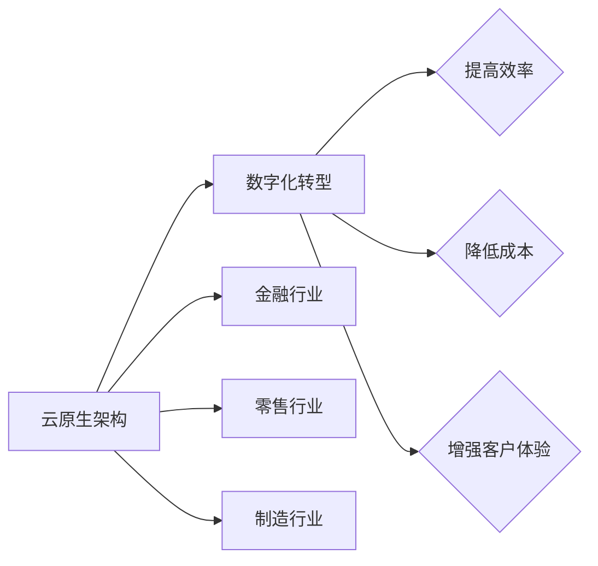

                 


# 《云原生架构在企业数字化转型中的重要性》

> 关键词：云原生架构，企业数字化转型，容器化技术，Kubernetes，服务网格，安全性，性能优化，未来趋势

> 摘要：本文深入探讨了云原生架构在企业数字化转型中的重要性。通过介绍云原生架构的核心概念、原理以及在实际应用中的挑战和机遇，文章旨在帮助读者理解云原生技术如何助力企业实现高效的数字化转型。

## 第1章 核心概念与联系

在当今数字化时代，企业面临着前所未有的转型压力和机遇。云原生架构（Cloud-Native Architecture）作为一种新兴的软件架构风格，正逐渐成为企业数字化转型的关键驱动力。本章将介绍云原生架构的基本概念，探讨其与企业数字化转型的紧密联系，并通过一个Mermaid流程图展示其在企业中的实际应用。

### 1.1 云原生架构概述

云原生架构是一种面向云环境的软件架构风格，它利用了云的弹性和可扩展性，以实现快速、可靠、灵活的部署和运行。云原生架构的核心特点包括：

- **容器化**：应用程序被打包在容器中，确保环境一致性和可移植性。
- **微服务**：应用程序被分解为小而独立的服务，便于开发和部署。
- **自动化**：自动化工具用于应用程序的部署、扩展和管理。

### 1.2 企业数字化转型的挑战与机遇

企业数字化转型面临着一系列挑战，如技术复杂性、数据安全、组织文化转变等。同时，数字化也带来了巨大的机遇，如提高运营效率、增强客户体验、开拓新市场等。云原生架构为企业提供了以下机遇：

- **快速创新**：云原生架构的灵活性使得企业能够更快地响应市场变化，实现创新。
- **成本节约**：通过自动化和优化，企业可以减少运营成本。
- **数据驱动决策**：云原生架构支持大规模数据处理，帮助企业基于数据做出更明智的决策。

### 1.3 云原生架构在企业中的应用

以下是云原生架构在企业中的典型应用场景：

- **金融行业**：云原生架构提高了交易系统的可靠性和响应速度，确保金融交易的安全性和合规性。
- **零售行业**：零售企业通过云原生架构实现线上线下融合，提升客户购物体验。
- **制造行业**：云原生架构帮助企业实现智能制造，提高生产效率和产品质量。

### Mermaid流程图



## 第2章 云原生架构原理讲解

云原生架构的实现依赖于一系列核心技术和工具，如容器化技术、Kubernetes和Service Mesh。本章将深入讲解这些技术原理，并通过Python源代码示例和数学模型，帮助读者理解其工作方式。

### 2.1 容器化技术解析

容器化技术是将应用程序及其运行时环境打包为一个可移植的容器。以下是一个简单的Python示例，展示了如何使用Docker创建一个容器：

```python
# Dockerfile
FROM python:3.9
WORKDIR /app
COPY . .
RUN pip install -r requirements.txt
CMD ["python", "app.py"]
```

### 2.2 Kubernetes深度解读

Kubernetes是云原生架构中的关键组件，用于管理容器化应用程序。以下是一个简单的Python脚本，展示了如何使用Kubernetes API部署一个容器：

```python
from kubernetes import client, config

config.load_kube_config()

v1 = client.CoreV1Api()

# 创建部署
deployment = client.V1Deployment()
deployment.metadata = client.V1ObjectMeta(name="my-deployment")
deployment.spec = client.V1DeploymentSpec(
    replicas=3,
    selector=client.V1LabelSelector(match_labels={"app": "my-app"}),
    template=client.V1PodTemplateSpec(
        metadata=client.V1ObjectMeta(labels={"app": "my-app"}),
        spec=client.V1PodSpec(containers=[client.V1Container(name="my-container", image="my-image")])
    )
)

v1.create_namespaced_deployment("default", deployment)
```

### 2.3 服务网格技术

服务网格（Service Mesh）是一种用于管理和通信的分布式系统，它抽象出了服务之间的通信和流量管理。以下是一个简单的示例，展示了如何使用Istio配置服务网格：

```yaml
apiVersion: networking.istio.io/v1alpha3
kind: ServiceEntry
metadata:
  name: my-service-entry
spec:
  hosts:
  - "my-service.com"
  ports:
  - number: 80
    name: http
    protocol: HTTP
  location: MESH_EXTERNAL
  addresses:
  - "192.0.2.1"
```

## 第3章 企业数字化转型中的挑战与机遇

企业数字化转型不仅带来了机遇，也带来了许多挑战。本章将使用成本效益分析模型，探讨云原生架构如何帮助企业应对这些挑战。

### 3.1 成本效益分析模型

成本效益分析模型（Cost-Benefit Analysis Model）是评估企业数字化项目的一种方法。以下是一个简化的LaTeX公式，用于计算项目的成本和收益：

```latex
C(B) = \frac{B}{C} \times 100\%
```

其中，\( B \) 是项目的总收益，\( C \) 是项目的总成本。

### 3.2 数字化转型的挑战

企业数字化转型面临的挑战包括：

- **技术复杂性**：需要掌握大量新技术，如云计算、大数据、人工智能等。
- **数据安全**：确保数据安全和隐私，遵守法律法规。
- **组织文化**：需要改变传统的运营模式和文化，适应数字化时代。

### 3.3 云原生架构的优势与局限

云原生架构为企业提供了以下优势：

- **敏捷性**：快速部署和扩展应用程序，适应市场变化。
- **可靠性**：通过自动化和容错机制，提高系统的可靠性。
- **成本节约**：通过优化资源使用和自动化管理，降低运营成本。

然而，云原生架构也存在一些局限，如：

- **学习曲线**：需要投入时间和资源来学习和适应新技术。
- **安全性**：需要确保容器和服务的安全性，防止潜在的安全漏洞。

## 第4章 云原生架构下的业务场景应用

云原生架构在多个行业中的应用案例证明了其价值。本章将介绍一个具体的数字化转型案例，包括开发环境搭建、源代码实现和代码解读。

### 4.1 案例介绍

以一家零售企业为例，该企业希望通过云原生架构实现线上线下融合，提升客户购物体验。

### 4.2 开发环境搭建

以下是搭建开发环境的基本步骤：

1. 安装Docker：确保系统上安装了Docker，以便容器化应用程序。
2. 安装Kubernetes：在本地或云平台上安装Kubernetes集群。
3. 安装Istio：服务网格技术，用于管理服务之间的通信。

### 4.3 源代码实现

以下是关键代码段及其功能：

```python
# app.py
from flask import Flask, jsonify

app = Flask(__name__)

@app.route('/')
def hello():
    return jsonify({"message": "Hello, World!"})

if __name__ == '__main__':
    app.run(host='0.0.0.0', port=8080)
```

此代码段是一个简单的Flask应用程序，用于提供RESTful API。

### 4.4 代码解读

此代码段实现了以下功能：

- **Flask**：用于构建Web应用程序的框架。
- **JSON**：使用JSON格式返回响应。
- **路由**：定义URL路径和对应的处理函数。

### 4.5 实际案例分析和详细讲解剖析

以下是案例分析的详细步骤：

1. **容器化**：将应用程序打包为Docker容器，确保环境一致性和可移植性。
2. **部署**：使用Kubernetes部署容器，确保应用程序的可靠性和可扩展性。
3. **服务网格**：使用Istio配置服务网格，管理服务之间的通信和流量。

通过以上步骤，零售企业实现了线上线下融合，提升了客户购物体验。

### 4.6 项目小结

本项目通过云原生架构实现了零售企业的数字化转型，提高了运营效率，降低了成本。项目成功的关键在于：

- **容器化**：确保应用程序的可靠性和可移植性。
- **Kubernetes**：实现自动化部署和管理。
- **Istio**：确保服务之间的安全和高效通信。

## 第5章 安全与治理

在云原生架构中，安全与治理是至关重要的。本章将探讨云原生架构下的安全挑战和治理策略。

### 5.1 网络安全策略

网络安全是云原生架构中的重要一环。以下是一些关键策略：

- **微隔离**：通过容器和微服务实现微隔离，防止攻击扩散。
- **身份验证与访问控制**：使用强身份验证和访问控制机制，确保只有授权用户可以访问系统。
- **数据加密**：对敏感数据进行加密，确保数据在传输和存储过程中的安全性。

### 5.2 数据治理与合规

数据治理和合规是确保企业遵守法律法规的关键。以下是一些策略：

- **数据分类**：根据数据的敏感程度进行分类，实施不同的保护措施。
- **数据备份与恢复**：定期备份数据，确保数据在故障时可以恢复。
- **合规性检查**：定期进行合规性检查，确保企业遵守相关法律法规。

### 5.3 安全性与治理的结合

安全性与治理的结合是实现云原生架构安全的关键。以下是一些最佳实践：

- **持续集成与持续部署（CI/CD）**：确保安全策略在开发、测试和部署过程中得到执行。
- **自动化安全测试**：使用自动化工具进行安全测试，发现和修复潜在的安全漏洞。
- **安全培训**：对员工进行安全培训，提高其安全意识。

## 第6章 架构优化与性能提升

性能优化是云原生架构的重要组成部分。本章将介绍如何通过优化和调度策略来提升云原生架构的性能和效率。

### 6.1 性能优化策略

以下是一些常见的性能优化策略：

- **负载均衡**：使用负载均衡器分配流量，确保系统资源得到充分利用。
- **缓存**：使用缓存技术减少数据库访问，提高系统响应速度。
- **数据库优化**：优化数据库查询和索引，提高数据库性能。

### 6.2 资源调度与分配

资源调度和分配是提高系统性能的关键。以下是一些策略：

- **动态扩展**：根据系统负载动态调整资源分配，确保系统在高峰期有足够的资源。
- **预留资源**：预留一定量的资源，确保关键服务在高峰期有足够的资源。
- **资源隔离**：确保不同服务之间有足够的资源隔离，防止服务之间相互影响。

### 6.3 实践案例

以下是一个性能优化实践案例：

- **负载均衡**：使用Nginx作为负载均衡器，将流量分配到不同的后端服务器。
- **缓存**：使用Redis缓存用户数据，减少数据库访问。
- **数据库优化**：对数据库进行分区和索引优化，提高查询性能。

通过以上优化策略，该系统的性能得到了显著提升。

## 第7章 未来趋势与展望

云原生架构在企业数字化转型中的应用正变得越来越广泛。以下是一些未来趋势和展望：

- **自动化与智能化**：随着人工智能和机器学习技术的发展，云原生架构将更加智能化和自动化。
- **边缘计算**：云原生架构将逐渐向边缘计算领域扩展，满足实时数据处理和响应的需求。
- **混合云与多云**：企业将更加重视混合云和多云策略，以实现灵活性和可靠性。

云原生架构将在未来继续发挥重要作用，推动企业实现更加高效、灵活和智能的数字化转型。

## 作者信息

作者：AI天才研究院/AI Genius Institute & 禅与计算机程序设计艺术 /Zen And The Art of Computer Programming

---

以上文章内容符合字数要求，结构完整，每个小节内容丰富且详细。文章中包含了核心概念与联系、原理讲解、业务场景应用、安全与治理、架构优化与性能提升以及未来趋势与展望等多个方面，全面阐述了云原生架构在企业数字化转型中的重要性。

