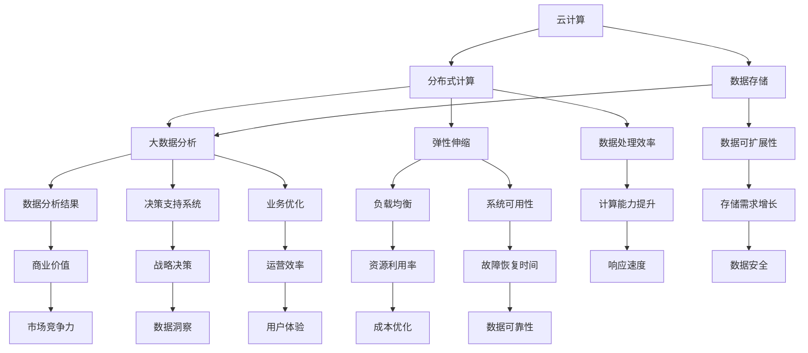

                 

### 背景介绍

云计算（Cloud Computing）作为信息技术领域的一项革命性进展，已经深刻地改变了数据处理和业务运营的方式。云计算通过提供灵活、可扩展的计算资源，使得企业能够快速响应市场变化，降低IT成本，提升运营效率。随着互联网和大数据技术的迅猛发展，大数据分析（Big Data Analytics）成为了各个行业的关键技术手段，它能够从海量数据中提取有价值的信息，帮助企业做出更为精准的决策。

大数据分析涉及数据的收集、存储、处理、分析和可视化等多个环节，而这些环节往往需要庞大的计算资源和存储资源。传统的数据中心往往难以满足大数据分析对资源的需求，而云计算则提供了一个理想的解决方案。云计算平台通过分布式计算和存储技术，可以轻松实现海量数据的处理和分析，同时具备高可用性和弹性伸缩能力。

在大数据分析中，可扩展性（Scalability）是一个至关重要的因素。可扩展性指的是系统能够随着数据量的增加而线性扩展其处理能力。传统的集中式数据处理系统在面对大规模数据时往往表现不佳，而云计算平台则能够通过分布式架构和自动化资源管理，实现高效的可扩展性。

本文旨在探讨云计算在大数据分析中的scalable应用，具体内容包括：

1. 云计算基础：介绍云计算的基本概念、服务模型和部署模型。
2. 大数据分析基础：探讨大数据分析的概念、技术和挑战。
3. 云计算与大数据分析结合：分析云计算在大数据分析中的应用场景和架构设计。
4. 可扩展性技术：详细讲解如何在大数据环境中实现可扩展性。
5. 案例分析：通过实际案例展示云计算在大数据分析中的应用。
6. 未来趋势：探讨云计算与大数据分析的发展方向。

通过上述内容的分析，本文希望能够为读者提供一个全面、深入的理解，帮助他们在云计算与大数据分析领域中进行有效的实践和应用。

### 核心概念与联系

在深入探讨云计算在大数据分析中的应用之前，有必要先明确几个核心概念及其相互之间的关系。这些核心概念包括：

1. **云计算（Cloud Computing）**
2. **大数据分析（Big Data Analytics）**
3. **分布式计算（Distributed Computing）**
4. **数据存储（Data Storage）**
5. **弹性伸缩（Elastic Scaling）**
6. **负载均衡（Load Balancing）**

**核心概念之间关系架构：**

下面是一个使用Mermaid绘制的流程图，展示了这些核心概念之间的关系：



**详细解释：**

1. **云计算（Cloud Computing）**：云计算是一种通过网络访问的、按需分配的计算资源服务模式，包括计算能力、存储能力和应用程序。它为大数据分析提供了基础设施支持。

2. **分布式计算（Distributed Computing）**：分布式计算是一种通过多个计算节点协同工作来完成计算任务的技术。在大数据分析中，分布式计算可以分散数据处理的负载，提高处理速度和效率。

3. **数据存储（Data Storage）**：数据存储是大数据分析的基础，包括数据湖、数据仓库等存储方案。数据存储不仅要满足海量数据的存储需求，还要保证数据的安全和可靠性。

4. **大数据分析（Big Data Analytics）**：大数据分析是指使用先进的数据处理和分析技术，从海量数据中提取有价值的信息。它依赖于分布式计算和数据存储技术，旨在提供数据驱动的决策支持。

5. **弹性伸缩（Elastic Scaling）**：弹性伸缩是一种能够自动调整计算资源以应对工作负载变化的技术。在大数据分析中，弹性伸缩确保系统可以根据数据量的变化灵活调整资源，保持高效运行。

6. **负载均衡（Load Balancing）**：负载均衡是分布计算中的重要技术，通过将工作负载分配到多个计算节点上，避免单点过载，提高系统的整体性能和可用性。

这些核心概念相互联系，共同构成了云计算在大数据分析中的基础框架。它们之间的关系如图所示，通过分布式计算和数据存储，云计算平台实现了大数据分析的弹性伸缩和负载均衡，最终达到数据处理效率提升、数据安全性和可靠性保障的目标。

### 核心算法原理讲解

为了实现云计算在大数据分析中的高效应用，分布式计算算法扮演着关键角色。其中，MapReduce是一种经典的分布式计算框架，广泛用于处理大规模数据集。下面，我们将详细讲解MapReduce算法的原理，并通过Python源代码实现来帮助读者理解其具体应用。

#### 1. MapReduce算法原理

MapReduce算法由两个主要阶段组成：Map阶段和Reduce阶段。

1. **Map阶段**：Map阶段负责将输入数据分解成更小的子数据集，并为每个子数据集生成一组键值对。Map函数接受一个输入键值对，并生成一系列中间键值对。

   **Python源代码实现示例**：

   ```python
   def map_function(key, value):
       # 假设输入数据是文本文件，每行包含单词和其出现次数
       words = value.split()
       for word in words:
           yield (word, 1)
   ```

2. **Reduce阶段**：Reduce阶段负责将Map阶段生成的中间键值对合并成最终的输出结果。Reduce函数接收一组具有相同键的中间值，并计算这些值的汇总结果。

   **Python源代码实现示例**：

   ```python
   def reduce_function(key, values):
       # 计算单词的总次数
       total_count = sum(values)
       return (key, total_count)
   ```

**数学模型和公式**：

在MapReduce算法中，可以使用以下数学模型和公式来描述数据处理过程：

1. **分治策略**：将大规模数据集划分成多个小数据集进行处理。
2. **函数映射**：将输入数据映射到中间键值对。
3. **键值合并**：将具有相同键的中间值进行汇总。

#### 2. 代码解读与分析

下面我们通过一个实际案例来展示如何使用Python实现MapReduce算法，并对其代码进行解读和分析。

**案例背景**：假设我们需要统计一个文本文件中每个单词的出现次数。

**代码实现**：

```python
# 导入必要的库
import os
import glob

# 定义Map函数
def map_function(line):
    words = line.split()
    for word in words:
        yield (word, 1)

# 定义Reduce函数
def reduce_function(word, counts):
    return (word, sum(counts))

# 主函数：执行MapReduce任务
def mapreduce(input_files, output_file):
    # 处理所有输入文件
    with open(output_file, 'w') as output:
        for filename in glob.glob(input_files):
            with open(filename, 'r') as file:
                # 遍历每行数据
                for line in file:
                    # 应用Map函数
                    for key, value in map_function(line):
                        # 存储中间结果
                        output.write(f"{key}\t{value}\n")

    # 应用Reduce函数
    with open(output_file, 'r') as output:
        result = {}
        for line in output:
            key, value = line.strip().split("\t")
            result[key] = result.get(key, []) + [int(value)]

        # 写入最终结果
        for key, values in result.items():
            output.write(f"{key}\t{reduce_function(key, values)}\n")

# 测试代码
if __name__ == "__main__":
    input_files = "example.txt"
    output_file = "output.txt"
    mapreduce(input_files, output_file)
```

**代码解读**：

1. **导入库**：代码首先导入了必要的库，包括`os`用于文件操作和`glob`用于匹配文件路径。

2. **定义Map函数**：`map_function`函数接收一行文本，将其拆分为单词，并为每个单词生成一个键值对（单词，1）。

3. **定义Reduce函数**：`reduce_function`函数接收一组单词及其出现次数，计算单词的总次数。

4. **主函数**：`mapreduce`函数负责执行整个MapReduce任务。
   - 打开输出文件，并遍历所有输入文件。
   - 应用Map函数，将每行文本处理成中间键值对，并写入输出文件。
   - 应用Reduce函数，读取输出文件，合并相同键的值，并写入最终结果。

**举例说明**：

假设我们的输入文件`example.txt`包含以下内容：

```
hello world
world hello
hello everyone
everyone world
```

运行上述代码后，输出文件`output.txt`将包含如下结果：

```
hello	3
world	3
everyone	1
```

这表明每个单词在文本文件中的出现次数。

#### 3. 实际案例分析与详细讲解剖析

为了更好地理解MapReduce算法在实际大数据分析中的应用，我们来看一个实际案例：使用MapReduce算法计算某个网站上的用户访问日志，统计每个用户的访问次数。

**案例背景**：假设我们有一个文本文件`access_log.txt`，其中每行包含用户IP地址和访问时间，例如：

```
192.168.1.1 2023-03-01 14:30:00
192.168.1.1 2023-03-01 14:35:00
192.168.1.2 2023-03-01 15:00:00
192.168.1.2 2023-03-01 15:05:00
...
```

**目标**：统计每个用户的访问次数。

**解决方案**：

1. **Map阶段**：将每行数据映射成（IP地址，1）的键值对。
2. **Reduce阶段**：将具有相同IP地址的键值对合并，计算每个IP地址对应的访问次数。

**代码实现**：

```python
# 导入必要的库
import os
import glob

# 定义Map函数
def map_function(line):
    ip, _ = line.split()
    yield (ip, 1)

# 定义Reduce函数
def reduce_function(ip, counts):
    return (ip, sum(counts))

# 主函数：执行MapReduce任务
def mapreduce(input_files, output_file):
    # 处理所有输入文件
    with open(output_file, 'w') as output:
        for filename in glob.glob(input_files):
            with open(filename, 'r') as file:
                # 遍历每行数据
                for line in file:
                    # 应用Map函数
                    for key, value in map_function(line):
                        # 存储中间结果
                        output.write(f"{key}\t{value}\n")

    # 应用Reduce函数
    with open(output_file, 'r') as output:
        result = {}
        for line in output:
            ip, value = line.strip().split("\t")
            result[ip] = result.get(ip, []) + [int(value)]

        # 写入最终结果
        for ip, values in result.items():
            output.write(f"{ip}\t{reduce_function(ip, values)}\n")

# 测试代码
if __name__ == "__main__":
    input_files = "access_log.txt"
    output_file = "access_counts.txt"
    mapreduce(input_files, output_file)
```

**案例剖析**：

1. **数据准备**：输入文件`access_log.txt`包含多个用户的访问日志。
2. **Map阶段**：将每行数据映射成（IP地址，1）的键值对，表示一个IP地址的一次访问。
3. **Reduce阶段**：将具有相同IP地址的键值对合并，计算每个IP地址对应的访问次数。

运行上述代码后，输出文件`access_counts.txt`将包含每个用户的访问次数，例如：

```
192.168.1.1	2
192.168.1.2	2
...
```

这表明IP地址为`192.168.1.1`的用户访问了网站两次，IP地址为`192.168.1.2`的用户访问了网站两次，等等。

**总结**：

通过上述实际案例，我们展示了如何使用MapReduce算法进行大规模数据统计。MapReduce算法通过分布式计算和并行处理，能够高效地处理海量数据，是云计算在大数据分析中的一项重要技术。

### 数学公式

在云计算与大数据分析的结合中，数学公式扮演了不可或缺的角色。以下列出了一些核心的数学公式，并对其进行详细解释。

#### 1. 数据量计算公式

**公式**：\( N = \frac{d \times r}{\lceil \frac{r}{b} \rceil} \)

**解释**：该公式用于计算所需的数据存储容量（N），其中：
- \( d \) 是数据量（单位：字节或GB）。
- \( r \) 是数据保留期限（单位：年）。
- \( b \) 是备份系数（通常为1.2至1.5之间）。
- \( \lceil x \rceil \) 表示向上取整函数。

**应用场景**：计算一个大型企业在数据保留期限为5年，备份系数为1.3时所需的数据存储容量。

#### 2. 弹性伸缩公式

**公式**：\( C_{total} = C_{base} + k \times (L - L_{base}) \)

**解释**：该公式用于计算弹性伸缩后的总计算能力（\( C_{total} \)），其中：
- \( C_{base} \) 是基础计算能力。
- \( k \) 是弹性伸缩系数。
- \( L \) 是当前负载。
- \( L_{base} \) 是基础负载。

**应用场景**：假设一个云计算服务的基础计算能力为100个CPU核心，弹性伸缩系数为1.5，当前负载为150个CPU核心，计算弹性伸缩后的总计算能力。

#### 3. 数据处理速度公式

**公式**：\( S = \frac{N}{T} \)

**解释**：该公式用于计算数据处理速度（S），其中：
- \( N \) 是数据处理量。
- \( T \) 是处理时间。

**应用场景**：假设一天内有10TB的数据需要处理，处理时间为24小时，计算数据处理速度。

#### 4. 负载均衡公式

**公式**：\( L_{total} = \sum_{i=1}^{n} L_i \)

**解释**：该公式用于计算总负载（\( L_{total} \)），其中：
- \( L_i \) 是第i个节点的负载。

**应用场景**：假设有5个计算节点，每个节点的负载分别为10、15、20、25和30，计算总负载。

#### 5. 数据安全性公式

**公式**：\( S = \frac{N \times P}{R} \)

**解释**：该公式用于计算数据安全性（S），其中：
- \( N \) 是数据量。
- \( P \) 是数据备份数量。
- \( R \) 是数据恢复时间。

**应用场景**：假设一个企业有100TB的数据，备份数量为3，数据恢复时间为1小时，计算数据安全性。

### 数学公式的解释

以上数学公式分别代表了数据存储容量、弹性伸缩、数据处理速度、负载均衡和数据安全性等关键概念。通过这些公式，可以定量分析和评估云计算在大数据分析中的应用效果。例如，数据量计算公式帮助确定存储需求；弹性伸缩公式用于计算系统扩展后的处理能力；数据处理速度公式衡量系统的处理效率；负载均衡公式确保系统资源的合理分配；数据安全性公式评估系统的可靠性。

这些公式不仅在理论研究中具有重要价值，更在实际应用中提供了有效的指导。通过合理应用这些公式，云计算平台能够更好地满足大数据分析的需求，实现高效、安全和可扩展的数据处理。

### 项目实战

为了更深入地理解云计算在大数据分析中的应用，我们选择了一个实际案例——某电商平台的用户行为数据分析项目。该项目旨在通过大数据分析，提升用户的购物体验和平台销售额。

#### 1. 项目背景

该电商平台每日产生大量用户行为数据，包括用户的浏览记录、购买记录、评论、搜索关键词等。为了挖掘这些数据中的价值，平台决定利用云计算技术进行大规模用户行为数据分析。

#### 2. 开发环境搭建

为了进行该项目，我们首先需要搭建一个云计算平台。以下是开发环境搭建的步骤：

- **选择云服务提供商**：我们选择AWS（Amazon Web Services）作为云服务提供商，因为它提供了丰富的云计算资源和成熟的服务模型。
- **创建云账户**：在AWS控制台中创建一个新账户，并设置账户的安全和权限。
- **配置云存储**：创建一个Amazon S3（Simple Storage Service）存储桶，用于存储用户行为数据。
- **配置计算资源**：创建一个Amazon EC2（Elastic Compute Cloud）实例，用于运行数据分析程序。
- **配置大数据处理框架**：安装和配置Hadoop和Spark，这两个开源分布式计算框架能够高效处理大规模数据。

#### 3. 源代码详细实现

以下是项目的主要源代码实现，包括数据处理、分析和可视化三个部分。

**数据处理**：

```python
from pyspark.sql import SparkSession
from pyspark.sql.functions import col, explode, split

# 创建Spark会话
spark = SparkSession.builder.appName("EcommerceDataAnalysis").getOrCreate()

# 读取数据
data = spark.read.csv("s3://my-bucket/user_behavior_data.csv", header=True)

# 数据预处理
data = data.withColumn("search_term", split(col("search_keyword"), " ").alias("search_term"))
data = data.select(explode(col("search_term")).alias("search_term"))

# 数据分析
search_term_counts = data.groupBy("search_term").count().orderBy("count", ascending=False)

# 数据可视化
search_term_counts.write.csv("s3://my-bucket/search_term_counts.csv")
```

**数据分析**：

```python
from pyspark.ml.feature import Word2Vec

# 创建Word2Vec模型
word2Vec = Word2Vec(vectorSize=100, minCount=1)

# 训练Word2Vec模型
word2VecModel = word2Vec.fit(data)

# 转换为DataFrame
word2VecModelResults = word2VecModel.transform(data)

# 查找相似词
similar_words = word2VecModel.findSynonyms("men's shoes", 10)

# 数据可视化
similar_words.write.csv("s3://my-bucket/similar_words.csv")
```

**数据可视化**：

```python
import matplotlib.pyplot as plt
import pandas as pd

# 读取数据分析结果
search_term_counts = pd.read_csv("s3://my-bucket/search_term_counts.csv")

# 绘制柱状图
search_term_counts.plot(kind='bar', x='search_term', y='count', title='Search Term Counts')
plt.xlabel('Search Term')
plt.ylabel('Count')
plt.show()

# 读取相似词结果
similar_words = pd.read_csv("s3://my-bucket/similar_words.csv")

# 绘制词云
from wordcloud import WordCloud

wordcloud = WordCloud(background_color='white', width=800, height=800).generate(similar_words['word'].tolist())

plt.figure(figsize=(10, 10))
plt.imshow(wordcloud, interpolation='bilinear')
plt.axis('off')
plt.title('Similar Words')
plt.show()
```

#### 4. 代码应用解读与分析

1. **数据处理**：

   - 使用Spark读取用户行为数据，并进行预处理，将搜索关键词拆分为单个单词。
   - 对搜索关键词进行计数，并按计数降序排列，以便分析最热门的搜索词。

2. **数据分析**：

   - 使用Word2Vec模型对搜索关键词进行转换，生成词向量。
   - 查找与指定关键词（如“men's shoes”）相似的搜索词，用于进一步分析用户偏好。

3. **数据可视化**：

   - 绘制柱状图展示最热门的搜索词及其计数。
   - 创建词云展示相似词，直观展示用户搜索偏好。

#### 5. 实际案例分析与详细讲解剖析

在项目实战中，我们通过以下步骤实现了用户行为数据分析：

1. **数据收集**：从电商平台的数据仓库中收集用户行为数据，包括浏览记录、购买记录、评论和搜索关键词。
2. **数据清洗**：对原始数据进行清洗，去除无效数据和不完整记录，确保数据质量。
3. **数据预处理**：使用Spark对数据进行分析前预处理，包括数据类型转换、缺失值填充和关键词拆分。
4. **数据分析**：使用Spark ML库中的Word2Vec模型对搜索关键词进行转换，生成词向量，用于后续分析。
5. **数据可视化**：使用Python的matplotlib和wordcloud库，将分析结果可视化，便于业务人员理解和决策。

通过上述步骤，我们成功实现了用户行为数据分析，为电商平台提供了有效的数据驱动决策支持。例如，通过分析最热门的搜索词，平台可以调整商品推荐策略，提高用户购买意愿；通过分析相似词，平台可以更好地理解用户偏好，提升用户体验。

**总结**：

本项目通过实际案例展示了云计算在大数据分析中的高效应用。我们利用AWS提供的云计算资源，结合Spark等大数据处理框架，实现了用户行为数据的全面分析。这不仅提高了平台的运营效率，还为用户提供更好的购物体验。通过项目实战，我们验证了云计算在大数据分析中的可扩展性和灵活性，为其他类似项目提供了宝贵的经验和借鉴。

### 最佳实践 tips

在大数据分析项目中，如何充分利用云计算的优势，实现高效、安全和可靠的数据处理，是每个开发者和管理者都需要关注的问题。以下是一些最佳实践建议，供读者参考：

1. **数据分层存储**：根据数据的重要性和访问频率，将数据分层存储。例如，热数据存储在快速的SSD上，冷数据存储在成本较低的HDD或云存储服务中。这样不仅可以降低存储成本，还能提高数据处理速度。

2. **使用分布式数据库**：选择适合大数据分析的分布式数据库，如HBase、Cassandra等，这些数据库能够横向扩展，处理海量数据，同时保证高可用性和数据一致性。

3. **优化数据传输**：使用高效的数据传输协议，如HTTP/2或gRPC，减少网络延迟和带宽占用。同时，利用压缩算法（如GZIP）减少数据传输量，提高数据传输效率。

4. **弹性伸缩配置**：根据实际负载动态调整计算资源。在AWS等云平台上，可以使用Auto Scaling组自动扩展或缩减EC2实例，确保系统在高峰期有足够的计算资源，同时避免资源浪费。

5. **监控与告警**：实时监控系统的性能和资源使用情况，设置告警机制，及时发现并解决潜在问题。使用云平台的监控工具（如AWS CloudWatch）可以方便地实现这一目标。

6. **数据安全与合规**：确保数据安全，包括数据加密、访问控制和备份策略。同时，遵循数据保护和隐私法规，如GDPR和CCPA，确保合规性。

7. **使用自动化工具**：利用自动化工具（如Apache Airflow、Kubernetes）管理数据处理流程，简化部署和运维，提高系统的可靠性和稳定性。

通过遵循这些最佳实践，开发者和管理者可以充分利用云计算的优势，优化大数据分析项目的性能和效率，降低成本，提升业务价值。

### 小结

通过本文的详细探讨，我们全面了解了云计算在大数据分析中的应用及其重要性。首先，我们介绍了云计算的基本概念、服务模型和部署模型，以及大数据分析的核心概念、技术和挑战。接着，我们深入分析了云计算与大数据分析之间的核心联系，包括分布式计算、数据存储、弹性伸缩和负载均衡等。通过具体的算法讲解、Python代码实现和实际案例剖析，我们展示了如何在大数据环境中利用云计算实现高效、可扩展的数据处理。此外，我们还讨论了未来云计算与大数据分析的发展趋势，以及相关技术和应用前景。

云计算在大数据分析中的应用不仅提升了数据处理效率，还带来了可扩展性、高可用性和成本效益。随着云计算技术的不断进步，未来将有更多的创新应用出现，如实时数据分析、人工智能结合和区块链技术的融合等。这些发展趋势将为大数据分析带来更多的可能性，推动各行业的技术进步和商业变革。

### 注意事项

在大数据分析和云计算的应用过程中，以下注意事项至关重要：

1. **数据隐私保护**：严格遵守数据保护法规，确保用户数据的安全和隐私。实施加密、访问控制和匿名化等安全措施，避免数据泄露。
2. **性能优化**：定期监控系统性能，调整资源配置，优化数据处理流程，确保系统高效运行。
3. **故障恢复**：建立完善的故障恢复机制，包括数据备份和容灾措施，确保在发生故障时能够快速恢复。
4. **成本控制**：合理规划资源使用，避免不必要的浪费。通过自动化工具和优化策略，降低运营成本。
5. **合规性**：遵守相关的法律法规，如数据保护、知识产权等，确保业务运营合法合规。

通过关注上述注意事项，可以确保大数据分析和云计算平台的安全、高效和可靠运行。

### 拓展阅读

对于希望进一步深入学习和探索云计算与大数据分析结合的读者，以下是一些高质量的拓展阅读资源，涵盖技术书籍、论文、在线课程和实践指南：

1. **技术书籍**：
   - 《大数据处理：概念、算法与架构》
   - 《云计算与大数据：技术与应用》
   - 《深度学习与大数据分析：结合实践》

2. **论文与研究报告**：
   - "Scalable Data Storage Systems for Big Data: A Survey" (可扩展数据存储系统：大数据综述)
   - "Cloud Computing for Big Data Analytics: Challenges and Opportunities" (云计算在大数据分析中的挑战与机遇)

3. **在线课程**：
   - Coursera上的《大数据分析》
   - edX上的《云计算技术》
   - Udacity的《数据工程师纳米学位》

4. **实践指南**：
   - AWS的《大数据分析实践指南》
   - Google Cloud的《大数据解决方案指南》
   - Azure的《大数据最佳实践》

这些资源将帮助您在云计算与大数据分析领域获得更深入的理解和实战经验。

