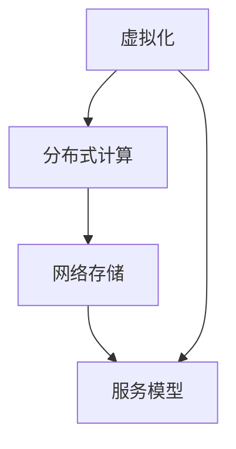
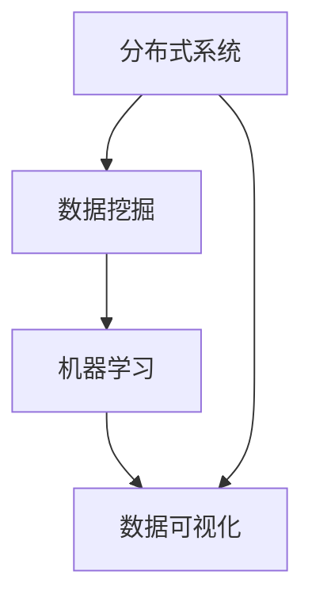
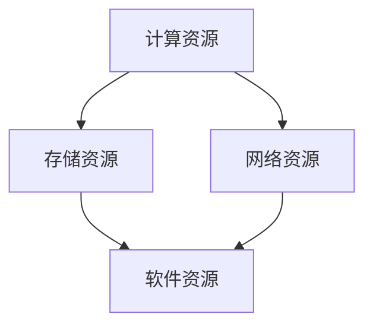
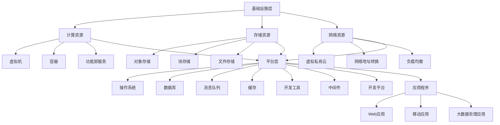
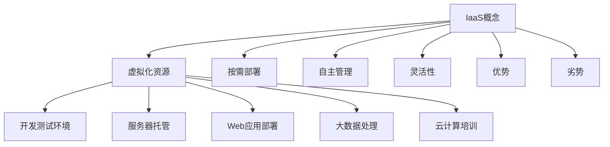
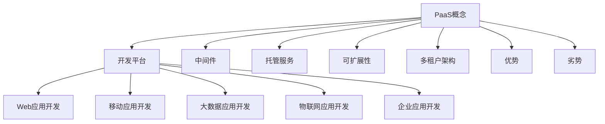
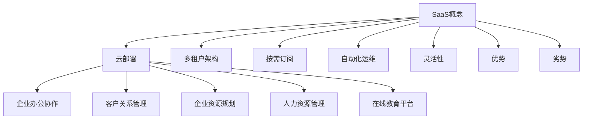
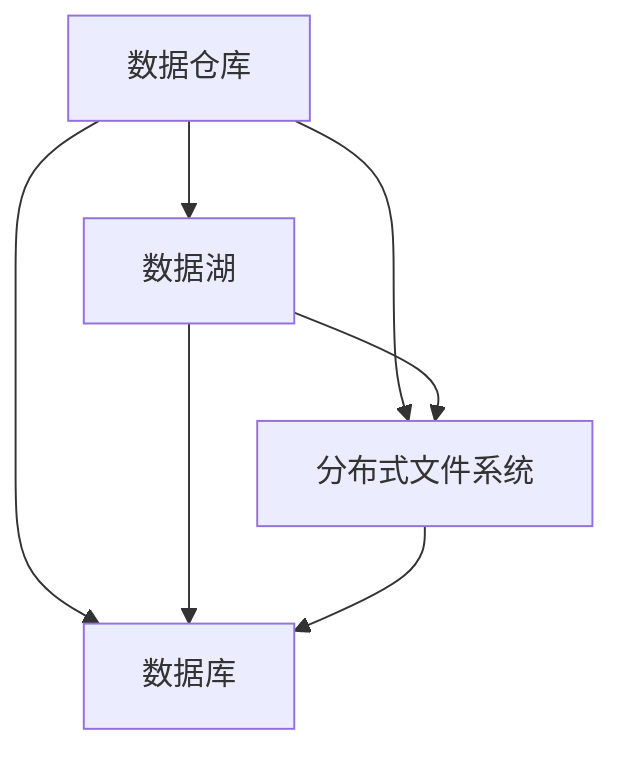
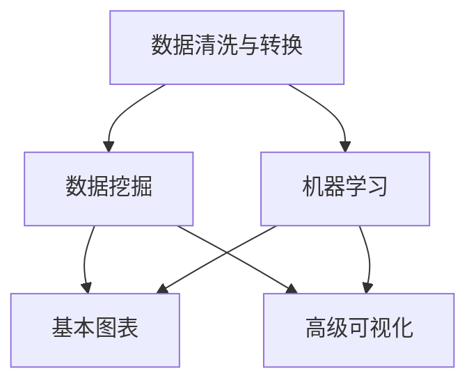

                 

### 云计算在大规模数据处理中的应用

云计算技术作为近年来信息技术领域的重要创新，已经深刻影响了各行业的运作模式，尤其是在大规模数据处理领域。随着数据量的爆炸式增长，传统的数据处理方法已经难以应对海量的数据存储和处理需求。云计算通过提供灵活、可扩展、成本效益高的计算资源，成为了大规模数据处理的理想选择。

本文将深入探讨云计算在大规模数据处理中的应用，从以下几个方面展开：

1. **云计算概述**：介绍云计算的定义、历史、核心概念和优势。
2. **大规模数据处理概述**：阐述大规模数据处理的需求背景、核心技术和发展趋势。
3. **云计算基础**：探讨云计算基础设施、架构和主要服务模型。
4. **大规模数据处理技术**：详细讲解数据存储与管理、数据处理与分析、大规模数据处理算法。
5. **云计算在数据处理中的应用**：分析云计算在数据处理中的优势、典型应用和案例研究。
6. **总结与展望**：总结云计算在大规模数据处理中的现状和未来展望。

通过上述结构，我们将逐步解析云计算在大规模数据处理中的应用，帮助读者全面了解这一技术的原理和实践。

### 关键词

- **云计算**
- **大规模数据处理**
- **分布式系统**
- **数据存储**
- **数据处理算法**
- **弹性扩展**
- **成本效益**

### 摘要

本文全面探讨了云计算在大规模数据处理中的应用。首先，我们介绍了云计算的定义、核心概念及其在数据处理中的优势。接着，分析了大规模数据处理的需求背景、核心技术和发展趋势。随后，详细讲解了云计算的基础设施、架构和主要服务模型。在此基础上，我们深入探讨了数据存储与管理、数据处理与分析以及大规模数据处理算法。最后，通过实际案例研究，展示了云计算在数据处理中的成功应用，并对其未来发展趋势进行了展望。

### 引言

随着互联网和物联网的快速发展，数据量呈现出指数级的增长。传统的数据处理方法已经无法满足日益增长的数据存储和处理需求。大规模数据处理（Big Data Processing）因此成为了信息科学领域的研究热点。在这一背景下，云计算（Cloud Computing）以其灵活、可扩展、低成本的优势，成为了大规模数据处理的重要技术支撑。

云计算是一种通过互联网提供动态可伸缩的虚拟化资源池，用户可以按需使用这些资源，并且只需支付使用费用。其核心概念包括虚拟化、分布式计算、网络存储和服务模型等。云计算的基础设施包括服务器、存储、网络和软件资源，架构则涵盖了基础设施层、平台层和应用层。云计算的服务模型主要包括IaaS（基础设施即服务）、PaaS（平台即服务）和SaaS（软件即服务）。

大规模数据处理涉及数据的存储、管理和分析，通常需要处理海量数据。其核心技术包括分布式系统、数据挖掘、机器学习和数据可视化等。这些技术共同构成了大规模数据处理的基础，使得对海量数据进行有效处理成为可能。

本文将深入探讨云计算在大规模数据处理中的应用，首先介绍云计算的基础知识，然后分析大规模数据处理的需求和技术，最后通过具体应用和案例研究，展示云计算如何解决大规模数据处理中的挑战，实现数据的高效管理和分析。

### 云计算的定义与历史

云计算是一种通过互联网提供动态可伸缩的虚拟化资源池，用户可以按需使用这些资源，并且只需支付使用费用。其概念最早由科学家Joseph Licklider提出，并在20世纪60年代得以发展。然而，云计算的真正兴起要归功于21世纪初互联网技术的飞速发展和虚拟化技术的普及。

云计算的核心概念包括虚拟化、分布式计算、网络存储和服务模型。虚拟化技术通过将物理资源抽象成逻辑资源，实现了资源的灵活分配和动态扩展。分布式计算则通过将任务分配到多个节点上并行处理，提高了系统的处理能力和可用性。网络存储技术利用分布式文件系统和数据库，实现了海量数据的高效存储和访问。服务模型方面，IaaS、PaaS和SaaS分别代表了不同层次的服务提供方式，用户可以根据自己的需求选择合适的服务模型。

从历史发展来看，云计算经历了几个关键阶段：

1. **基础设施即服务（IaaS）**：这是云计算的最早形式，提供虚拟化的计算资源，如虚拟机、存储和网络。用户可以灵活配置和管理这些资源，按需付费。

2. **平台即服务（PaaS）**：在IaaS的基础上，PaaS提供了开发平台和中间件，使得开发者可以专注于应用程序的开发，而无需关注底层基础设施的运维。

3. **软件即服务（SaaS）**：SaaS提供了完整的应用程序服务，用户通过互联网使用软件，无需安装和维护，方便快捷。

4. **混合云和多云**：随着企业需求的多样化，混合云和多云环境逐渐成为主流。混合云结合了公有云和私有云的优势，多云则在不同云服务提供商之间进行数据和应用的管理和调度。

云计算的优势主要体现在以下几个方面：

- **弹性扩展**：云计算可以根据需求动态调整资源，满足不同规模的数据处理需求。
- **成本效益**：通过按需付费，用户只需为实际使用的资源付费，降低了企业的运营成本。
- **高可用性**：云计算通过分布式架构和冗余设计，提高了系统的可靠性和可用性。
- **灵活性**：用户可以根据需求自由选择和配置资源，灵活应对业务变化。

然而，云计算也面临一些挑战，如数据安全、隐私保护、服务质量保证等。这些问题需要通过技术创新和管理策略来逐步解决。

### 云计算的核心概念

云计算的核心概念主要包括虚拟化、分布式计算、网络存储和服务模型。这些概念共同构成了云计算的技术基础，使得云计算能够实现灵活、可扩展和高效的数据处理能力。

#### 虚拟化

虚拟化（Virtualization）是将物理硬件资源抽象成逻辑资源的过程，从而实现资源的灵活管理和分配。虚拟化技术主要分为以下几类：

- **硬件虚拟化**：通过虚拟化软件（如虚拟机监控器）将一台物理服务器分割成多个虚拟机，每个虚拟机拥有独立的操作系统和资源。这种技术提高了硬件资源的利用率，实现了资源的灵活分配。
- **操作系统虚拟化**：在操作系统层面上实现虚拟化，例如通过容器技术（如Docker）创建隔离的环境，每个容器共享宿主机的操作系统内核，但相互之间隔离，从而提高了资源利用率和部署灵活性。
- **存储虚拟化**：将物理存储设备抽象成逻辑存储单元，通过虚拟化层进行管理和分配，提高了存储的灵活性和扩展性。

#### 分布式计算

分布式计算（Distributed Computing）是将任务分布在多个计算节点上并行处理的一种计算模式。这种模式具有以下几个特点：

- **并行处理**：通过将任务分解成多个子任务，并发执行，显著提高了处理速度和效率。
- **容错性**：分布式系统中的节点可能发生故障，但其他节点可以继续工作，从而提高了系统的可靠性和可用性。
- **扩展性**：分布式计算可以根据需要增加或减少计算节点，灵活调整系统性能。

常见的分布式计算框架包括Hadoop和Spark。Hadoop基于MapReduce模型，通过分布式文件系统（HDFS）存储数据和MapReduce编程模型处理数据。Spark则基于内存计算，提供了更为高效的数据处理能力。

#### 网络存储

网络存储（Network Storage）是通过网络连接存储设备，实现数据的高效存储和访问。网络存储技术主要包括以下几种：

- **分布式文件系统**：如HDFS和Ceph，它们通过分布式存储架构，实现海量数据的高效存储和并行访问。
- **对象存储**：如Amazon S3和Google Cloud Storage，它们以对象的形式存储数据，每个对象都有一个唯一的URL，便于数据访问和管理。
- **块存储**：如EBS（Amazon Elastic Block Store）和RBD（Ceph的块设备），它们以块的形式存储数据，适用于需要持久化存储的场景。

#### 服务模型

服务模型（Service Models）是云计算中提供资源和服务的方式，主要包括以下几种：

- **基础设施即服务（IaaS）**：提供虚拟化的计算资源，如虚拟机、存储和网络，用户可以灵活配置和管理这些资源。
- **平台即服务（PaaS）**：提供开发平台和中间件，使得开发者可以专注于应用程序的开发，无需关注底层基础设施的运维。
- **软件即服务（SaaS）**：提供完整的应用程序服务，用户通过互联网使用软件，无需安装和维护。

#### 核心概念之间的关系架构

为了更好地理解这些核心概念之间的关系，我们可以使用Mermaid流程图进行描述：



在上述流程图中，虚拟化技术是实现分布式计算和网络存储的基础，服务模型则定义了云计算中资源和服务提供的方式。这三个核心概念相互关联，共同构成了云计算的技术体系。

### 云计算的优势与挑战

云计算的优势在于其灵活、可扩展、低成本和高可用性。通过虚拟化和分布式计算技术，云计算能够根据需求动态调整资源，实现弹性扩展。用户只需为实际使用的资源付费，降低了运营成本。同时，云计算的高可用性和容错性确保了系统的稳定运行，提高了服务的可靠性。

然而，云计算也面临一些挑战。首先，数据安全和隐私保护是云计算的核心问题。由于数据存储在第三方服务器上，用户需要确保数据的安全性，防止数据泄露和未授权访问。其次，服务质量保证也是一个重要挑战。用户需要确保云计算服务能够满足其性能和可靠性要求。最后，随着云计算应用的广泛普及，法律法规和合规性问题也逐渐凸显。用户需要确保其数据和服务符合相关法规要求。

为了应对这些挑战，云计算领域不断推出新技术和解决方案。例如，加密技术和访问控制机制可以提升数据安全性。服务质量保证（QoS）技术则通过资源分配和调度策略，确保云计算服务的高性能和可靠性。此外，云服务提供商也在不断优化其服务，确保用户数据的安全和合规。

### 大规模数据处理的需求背景

大规模数据处理（Big Data Processing）的需求源于数据量的爆炸式增长。随着互联网、物联网、移动设备和社交媒体的普及，各行各业产生了海量的数据。这些数据不仅包括结构化数据，如数据库中的记录，还包括非结构化数据，如图像、音频和视频。处理这些海量数据对传统的数据处理方法构成了巨大的挑战。

首先，数据量的增长对存储和计算能力提出了更高的要求。传统的数据库和计算资源难以应对如此庞大的数据量，导致处理效率低下。其次，数据种类的多样性增加了数据处理的复杂性。结构化数据和非结构化数据需要不同的处理方法，传统的数据处理技术难以同时应对。此外，数据处理的实时性和准确性也变得越来越重要，例如金融交易、医疗诊断和交通管理等领域，需要实时处理和分析数据，以做出快速、准确的决策。

为了应对这些挑战，大规模数据处理技术应运而生。这些技术包括分布式系统、数据挖掘、机器学习和数据可视化等。分布式系统通过将数据和处理任务分布在多个节点上，提高了处理效率和容错性。数据挖掘和机器学习技术则用于从海量数据中提取有价值的信息和模式，支持决策制定和预测分析。数据可视化技术则将复杂的数据以直观的方式展示，帮助用户理解和分析数据。

大规模数据处理的发展趋势主要体现在以下几个方面：

1. **数据量指数级增长**：随着数据源的多样化，数据量将继续呈指数级增长，对数据处理技术提出了更高的要求。
2. **实时数据处理**：越来越多的应用场景需要实时数据处理，如实时监控、实时推荐和实时分析等。
3. **智能化数据处理**：利用人工智能和机器学习技术，从海量数据中提取更加复杂和有价值的信息。
4. **数据隐私保护**：随着数据隐私问题日益突出，数据处理技术将更加注重数据安全和隐私保护。
5. **跨领域应用**：大规模数据处理技术将在更多领域得到应用，如医疗、金融、交通和能源等。

总之，大规模数据处理的需求背景和数据量的增长推动了相关技术的发展，未来大规模数据处理技术将继续在数据处理领域发挥重要作用。

### 大规模数据处理的核心技术

大规模数据处理（Big Data Processing）涉及一系列关键技术，这些技术共同支撑了海量数据的存储、管理和分析。以下是大规模数据处理中的核心技术：

#### 分布式系统

分布式系统（Distributed Systems）是大规模数据处理的基础。它通过将数据和处理任务分布在多个节点上，提高了系统的处理能力和容错性。分布式系统的主要特点包括：

- **并行处理**：分布式系统可以将一个大的任务分解成多个子任务，并行处理，从而显著提高处理速度。
- **容错性**：当一个节点发生故障时，其他节点可以继续工作，确保系统的高可用性。
- **扩展性**：分布式系统可以根据需要增加或减少节点，灵活调整系统性能。

常见的分布式系统包括Hadoop和Spark。Hadoop基于MapReduce模型，通过分布式文件系统（HDFS）存储数据和MapReduce编程模型处理数据。Spark则基于内存计算，提供了更为高效的数据处理能力。

#### 数据挖掘

数据挖掘（Data Mining）是从海量数据中提取有价值信息和知识的过程。数据挖掘的主要目标是从原始数据中发现潜在的规律和模式，支持决策制定和预测分析。数据挖掘技术主要包括以下几种：

- **关联规则挖掘**：发现数据中的关联关系，例如购物篮分析。
- **分类和聚类**：根据数据的特征将其划分为不同的类别或簇，支持分类和聚类分析。
- **异常检测**：识别数据中的异常和离群点，例如欺诈检测和网络安全监测。

常见的数据挖掘工具包括Apache Spark MLlib、Scikit-learn和R等。

#### 机器学习

机器学习（Machine Learning）是数据挖掘的重要分支，通过构建和训练模型，从数据中自动学习规律和模式。机器学习技术广泛应用于各种领域，如自然语言处理、图像识别、推荐系统和自动驾驶等。机器学习的主要技术包括：

- **监督学习**：通过已标记的数据训练模型，然后使用模型对新的数据进行预测。
- **无监督学习**：在没有标记数据的情况下，通过模型自动发现数据中的结构和模式。
- **强化学习**：通过与环境交互，学习最优策略以实现目标。

常见的机器学习框架包括TensorFlow、PyTorch和Scikit-learn等。

#### 数据可视化

数据可视化（Data Visualization）是将复杂的数据以图形和图表的形式展示，帮助用户理解和分析数据。数据可视化技术不仅提高了数据分析的效率，还使得数据决策更加直观和易于理解。数据可视化工具可以帮助用户识别数据中的趋势、异常和关联关系。

常见的数据可视化工具包括Tableau、Power BI和D3.js等。

#### 核心技术之间的关系架构

为了更好地理解这些核心技术之间的关系，我们可以使用Mermaid流程图进行描述：



在上述流程图中，分布式系统作为数据处理的基础，支持数据挖掘和机器学习。数据挖掘和机器学习技术用于从海量数据中提取信息和知识，并通过数据可视化技术进行展示，帮助用户理解和分析数据。

### 大规模数据处理技术的发展趋势

大规模数据处理（Big Data Processing）技术正随着数据量的增长和计算能力的提升不断演进。以下是几个显著的发展趋势：

#### 实时数据处理

实时数据处理（Real-Time Data Processing）正在成为大规模数据处理领域的重要趋势。随着物联网（IoT）和5G网络的普及，实时数据采集和处理的需求愈发强烈。例如，金融市场需要实时监控交易数据以迅速做出决策，智能交通系统需要实时分析交通流量以优化路线，医疗领域需要实时监控患者数据以进行紧急处理。实时数据处理技术如Apache Flink和Apache Kafka等，通过低延迟和高吞吐量，实现了对海量实时数据的快速处理和分析。

#### 智能化数据处理

随着人工智能（AI）和机器学习（Machine Learning）技术的不断发展，智能化数据处理逐渐成为主流。利用机器学习算法，可以从海量数据中自动提取有价值的信息和模式，支持复杂决策和预测分析。例如，通过深度学习模型，可以进行图像识别、自然语言处理和推荐系统等。智能化数据处理不仅提高了数据分析的效率和准确性，还使得数据驱动的决策更加智能化。

#### 跨领域融合

大规模数据处理技术正跨越不同领域，实现跨领域融合。例如，医疗数据与生物信息学相结合，可以推动精准医疗的发展；交通数据与城市规划和智能交通系统相结合，可以优化城市交通管理；金融数据与风险管理相结合，可以提升金融服务的安全性。跨领域融合不仅扩大了大规模数据处理的应用范围，还推动了不同领域的协同创新。

#### 数据隐私保护

随着数据隐私问题日益突出，数据隐私保护（Data Privacy Protection）成为大规模数据处理技术的重要发展方向。数据匿名化、差分隐私和联邦学习等技术，旨在保护用户隐私的同时，确保数据处理和分析的准确性。例如，差分隐私技术通过添加噪声，使得个人数据无法被单独识别，从而保护了用户隐私。

#### 开源生态

开源技术在大规模数据处理领域的发展也日益重要。Apache Hadoop、Spark、Flink等开源框架已经成为大规模数据处理的标准工具。开源生态不仅提供了丰富的功能模块和工具，还通过社区合作，不断推动技术的创新和优化。

总之，大规模数据处理技术正朝着实时性、智能化、跨领域融合和数据隐私保护等方向发展，不断突破技术瓶颈，满足日益增长的数据处理需求。

### 云计算基础设施

云计算基础设施是云计算技术实现大规模数据处理的核心支撑。它包括计算资源、存储资源、网络资源以及软件资源，这些资源共同构成了云计算服务的基石。

#### 计算资源

计算资源是云计算基础设施中最重要的组成部分之一。云计算提供多种类型的计算资源，如虚拟机（VM）、容器和功能即服务（FaaS）。虚拟机通过虚拟化技术将物理服务器分割成多个独立的虚拟环境，每个虚拟机拥有独立的操作系统和资源。容器则是一种轻量级的虚拟化技术，通过Docker等工具实现应用的封装和部署，具有高效、灵活和可移植性。功能即服务（FaaS）则将代码部署为独立的服务单元，按需执行，适用于事件驱动的应用场景。

在云计算中，计算资源可以通过以下方式提供：

- **虚拟机**：如Amazon EC2、Google Compute Engine和Azure Virtual Machines，用户可以配置虚拟机的规格，如CPU、内存和存储。
- **容器**：如Amazon EKS、Google Kubernetes Engine（GKE）和Azure Kubernetes Service（AKS），这些服务提供了容器编排和管理功能，支持自动化部署、扩展和监控。
- **功能即服务**：如AWS Lambda、Google Cloud Functions和Azure Functions，用户可以编写代码片段，部署为独立的服务单元，按需执行，无需管理底层基础设施。

#### 存储资源

存储资源是云计算基础设施中的另一个关键组成部分。云计算提供了多种类型的存储服务，包括对象存储、块存储和文件存储。对象存储（如Amazon S3、Google Cloud Storage和Azure Blob Storage）以对象的形式存储数据，每个对象都有一个唯一的URL，适用于海量非结构化数据的存储和访问。块存储（如Amazon EBS、Google Persistent Disks和Azure Disk Storage）以块的形式存储数据，适用于需要持久化存储的场景。文件存储（如Amazon FSx、Google File Store和Azure File Storage）提供了类似于本地文件系统的存储服务，适用于需要共享文件和目录的场景。

在云计算中，存储资源可以通过以下方式提供：

- **对象存储**：适用于数据备份、归档和大规模数据集的存储。
- **块存储**：适用于持久化存储，如数据库和应用程序的存储。
- **文件存储**：适用于需要共享文件和目录的场景，如数据分析和处理。

#### 网络资源

网络资源在云计算基础设施中同样至关重要。云计算提供了多种网络服务，包括虚拟私有云（VPC）、网络地址转换（NAT）和负载均衡。虚拟私有云（VPC）提供了隔离的云环境，用户可以在其中创建和管理虚拟网络，实现自定义路由和子网划分。网络地址转换（NAT）则将私有IP地址映射为公有IP地址，确保内部网络的安全访问。负载均衡（如AWS Elastic Load Balancing、Google Load Balancer和Azure Load Balancer）则通过分配流量，确保应用的可靠性和性能。

在云计算中，网络资源可以通过以下方式提供：

- **虚拟私有云**：提供隔离的云环境，支持自定义网络配置。
- **网络地址转换**：实现私有IP地址与公有IP地址的映射。
- **负载均衡**：分配流量，确保应用的可靠性和性能。

#### 软件资源

软件资源是云计算基础设施中的关键组成部分，包括操作系统、中间件和开发工具等。云计算提供了丰富的软件资源，用户可以根据需求选择和配置。例如，Amazon Web Services（AWS）提供了Amazon Linux、Windows Server等操作系统；Google Cloud Platform（GCP）提供了Google Compute Engine、Google App Engine等；Microsoft Azure提供了Azure Virtual Machines、Azure App Service等。此外，云计算还提供了丰富的中间件和开发工具，如数据库（如Amazon RDS、Google Cloud SQL和Azure Database）、消息队列（如Amazon SQS、Google Pub/Sub和Azure Service Bus）和开发工具（如AWS SDK、GCP SDK和Azure SDK）。

在云计算中，软件资源可以通过以下方式提供：

- **操作系统**：提供各种操作系统选项，满足不同应用的需求。
- **中间件**：提供数据库、消息队列和缓存等中间件服务。
- **开发工具**：提供SDK和开发框架，支持快速开发和部署。

#### 云计算基础设施之间的关系架构

为了更好地理解云计算基础设施中的各个组成部分及其关系，我们可以使用Mermaid流程图进行描述：



在上述流程图中，计算资源、存储资源和网络资源共同构成了云计算基础设施的主体，而软件资源则为云计算服务提供了支持。这三个方面相互关联，共同构成了云计算服务的整体架构。

### 云计算架构

云计算架构是指云计算系统中各个组成部分及其相互关系的设计和实现。云计算架构可以分为三个主要层次：基础设施层、平台层和应用层。每个层次都有其特定的功能和技术，共同构成了云计算的整体架构。

#### 基础设施层

基础设施层（Infrastructure Layer）是云计算架构的基础，提供计算、存储、网络等基本资源。基础设施层包括服务器、存储设备、网络设备以及虚拟化技术等。

1. **计算资源**：计算资源包括虚拟机（VM）、容器和功能即服务（FaaS）。虚拟机通过虚拟化技术将物理服务器分割成多个独立的虚拟环境，容器是一种轻量级的虚拟化技术，功能即服务则将代码部署为独立的服务单元，按需执行。

2. **存储资源**：存储资源包括对象存储、块存储和文件存储。对象存储以对象的形式存储数据，适用于海量非结构化数据的存储和访问；块存储以块的形式存储数据，适用于需要持久化存储的场景；文件存储则提供了类似于本地文件系统的存储服务。

3. **网络资源**：网络资源包括虚拟私有云（VPC）、网络地址转换（NAT）和负载均衡。虚拟私有云提供了隔离的云环境，网络地址转换实现了私有IP地址与公有IP地址的映射，负载均衡则分配流量，确保应用的可靠性和性能。

#### 平台层

平台层（Platform Layer）是云计算架构的中间层，提供开发平台和中间件，支持应用程序的开发和部署。平台层包括操作系统、数据库、消息队列、缓存等。

1. **操作系统**：操作系统为应用程序提供了运行环境，如Amazon Linux、Windows Server和Google Compute Engine。

2. **数据库**：数据库提供了数据存储和管理功能，包括关系型数据库（如MySQL、PostgreSQL）和非关系型数据库（如MongoDB、Cassandra）。

3. **消息队列**：消息队列提供了异步通信和消息传递功能，如Apache Kafka、RabbitMQ和Google Pub/Sub。

4. **缓存**：缓存技术用于提高数据访问速度，如Redis、Memcached和Amazon ElastiCache。

#### 应用层

应用层（Application Layer）是云计算架构的最高层，提供最终的应用服务。应用层包括Web应用、移动应用、大数据处理应用等。

1. **Web应用**：Web应用通过互联网提供服务和数据访问，如电子商务网站、社交媒体平台和企业内部应用。

2. **移动应用**：移动应用通过移动设备提供服务和数据访问，如移动游戏、移动办公和移动健康应用。

3. **大数据处理应用**：大数据处理应用通过分布式系统、数据挖掘和机器学习技术，处理和分析海量数据，如数据仓库、数据挖掘平台和机器学习平台。

#### 核心组件之间的关系架构

为了更好地理解云计算架构中各个层次和核心组件之间的关系，我们可以使用Mermaid流程图进行描述：



在上述流程图中，基础设施层提供了计算、存储和网络资源，平台层提供了操作系统、数据库、消息队列、缓存和开发工具等中间件和开发平台，应用层则通过这些资源和平台提供了各种应用服务。

### IaaS

IaaS（基础设施即服务）是云计算的服务模型之一，通过提供虚拟化的计算资源、存储资源和网络资源，使得用户能够按需使用和管理这些资源。IaaS为用户提供了高度灵活、可扩展的计算环境，使用户能够专注于应用程序的开发和运行，而无需关注底层基础设施的维护和管理。

#### IaaS的基本概念

IaaS的基本概念包括以下几个方面：

1. **虚拟化资源**：IaaS通过虚拟化技术将物理资源抽象成逻辑资源，如虚拟机（VM）、虚拟存储和虚拟网络。用户可以根据需求配置和管理这些虚拟资源。

2. **按需部署**：用户可以按需部署和扩展虚拟资源，无需预先购买和维护硬件设备。这种灵活的部署方式使得用户能够快速响应业务需求。

3. **自主管理**：用户有权自主管理和配置虚拟资源，如创建和删除虚拟机、配置网络和存储等。用户可以根据应用程序的需求，自定义操作系统、软件环境和网络设置。

4. **灵活性**：IaaS提供了丰富的虚拟化资源和配置选项，用户可以根据不同的需求选择合适的资源类型和配置方案。这种灵活性使得用户能够优化资源利用，降低成本。

#### IaaS的典型应用场景

IaaS在多个应用场景中具有显著优势，以下是几个典型的应用场景：

1. **开发测试环境**：IaaS提供了快速创建和配置开发测试环境的工具，使得开发人员可以快速搭建测试环境，进行应用程序的测试和调试。

2. **服务器托管**：企业可以将服务器托管在IaaS平台，无需购买和维护硬件设备，降低了基础设施成本和管理复杂度。

3. **Web应用部署**：IaaS为Web应用提供了灵活的部署和管理方案，用户可以根据流量和负载需求，动态调整资源配置，确保应用的高可用性和性能。

4. **大数据处理**：IaaS提供了强大的计算和存储资源，适用于大数据处理任务，如数据仓库、数据挖掘和机器学习等。

5. **云计算培训和教育**：IaaS平台可以作为云计算培训和教育的基础设施，提供安全的实验环境，帮助用户学习和实践云计算技术。

#### IaaS的优势和劣势

IaaS具有以下优势：

1. **灵活性**：IaaS提供了高度灵活的虚拟化资源，用户可以根据需求灵活配置和管理资源。

2. **成本效益**：IaaS按需付费，用户只需为实际使用的资源付费，降低了运营成本。

3. **高可用性**：IaaS通过分布式架构和冗余设计，提供了高可用性和容错性。

4. **可扩展性**：IaaS支持动态扩展，用户可以根据需求快速调整资源配置。

然而，IaaS也存在一些劣势：

1. **安全性**：由于数据存储在第三方服务器上，用户需要确保数据的安全和隐私保护。

2. **复杂性**：IaaS平台的管理和配置较为复杂，用户需要具备一定的技术知识和经验。

3. **依赖性**：用户对IaaS平台具有依赖性，如果平台出现故障，可能会影响业务的正常运行。

#### 核心概念之间的关系架构

为了更好地理解IaaS的基本概念、应用场景和优势与劣势，我们可以使用Mermaid流程图进行描述：



在上述流程图中，IaaS的核心概念包括虚拟化资源、按需部署、自主管理和灵活性。IaaS在多个应用场景中具有显著优势，但也存在一定的劣势。通过理解这些核心概念和关系，用户可以更好地利用IaaS平台，实现灵活、高效的数据处理和应用部署。

### PaaS

PaaS（平台即服务）是云计算的另一种服务模型，通过提供开发平台和中间件，使得开发者可以专注于应用程序的开发和部署，而无需关注底层基础设施的维护和管理。PaaS为开发者提供了全面的技术栈和工具集，使得应用程序的开发、测试和部署更加高效和便捷。

#### PaaS的基本概念

PaaS的基本概念包括以下几个方面：

1. **开发平台**：PaaS提供了一个集成的开发平台，包括编程语言、开发工具、框架和库等，使得开发者可以快速构建和部署应用程序。

2. **中间件**：PaaS提供了中间件服务，如数据库、消息队列、缓存和搜索引擎等，这些服务为应用程序提供了必要的基础设施支持。

3. **托管服务**：PaaS提供了应用程序的托管服务，包括部署、监控、备份和更新等，使得开发者可以专注于应用程序的开发和功能实现。

4. **可扩展性**：PaaS平台支持应用程序的弹性扩展，开发者可以根据需求动态调整资源，确保应用程序的高性能和可靠性。

5. **多租户架构**：PaaS平台通常采用多租户架构，多个开发者和应用程序共享同一平台资源，从而提高资源利用率和运营效率。

#### PaaS的典型应用场景

PaaS在多个应用场景中具有显著优势，以下是几个典型的应用场景：

1. **Web应用开发**：PaaS提供了丰富的开发工具和中间件，支持快速开发和部署Web应用，如电子商务平台、社交媒体和在线办公系统等。

2. **移动应用开发**：PaaS提供了移动应用开发平台，支持原生应用和跨平台应用的快速开发，如移动游戏、移动健康和移动支付等。

3. **大数据应用开发**：PaaS提供了大数据处理框架和工具，支持快速构建和部署大数据应用，如数据仓库、数据挖掘和机器学习等。

4. **物联网应用开发**：PaaS提供了物联网开发平台，支持快速开发和部署物联网应用，如智能家居、智能交通和智能医疗等。

5. **企业应用开发**：PaaS为大型企业提供了全面的开发平台和工具，支持快速构建和部署企业应用，如企业资源规划（ERP）、客户关系管理（CRM）和供应链管理（SCM）等。

#### PaaS的优势和劣势

PaaS具有以下优势：

1. **开发效率**：PaaS提供了丰富的开发工具和中间件，使得开发者可以快速构建和部署应用程序，提高了开发效率。

2. **成本效益**：PaaS通过提供托管服务和资源优化，降低了开发和运营成本。

3. **可扩展性**：PaaS平台支持应用程序的弹性扩展，确保了应用程序的高性能和可靠性。

4. **多租户架构**：PaaS采用多租户架构，多个开发者和应用程序共享同一平台资源，提高了资源利用率和运营效率。

然而，PaaS也存在一些劣势：

1. **定制性限制**：由于PaaS提供了一整套标准化的开发和部署环境，开发者可能无法完全定制和调整，限制了应用程序的灵活性。

2. **安全性担忧**：由于数据和应用存储在第三方服务器上，开发者需要确保数据和应用的安全性和隐私保护。

3. **迁移成本**：从传统的本地开发环境迁移到PaaS平台可能需要一定的迁移成本和技术投入。

#### 核心概念之间的关系架构

为了更好地理解PaaS的基本概念、应用场景和优势与劣势，我们可以使用Mermaid流程图进行描述：



在上述流程图中，PaaS的核心概念包括开发平台、中间件、托管服务、可扩展性和多租户架构。PaaS在多个应用场景中具有显著优势，但也存在一定的劣势。通过理解这些核心概念和关系，开发者可以更好地利用PaaS平台，实现高效、灵活的应用程序开发和部署。

### SaaS

SaaS（软件即服务）是云计算的另一种服务模型，通过将软件应用程序部署在云端，用户可以通过互联网访问和使用这些应用程序，而无需在本地安装和维护软件。SaaS模式为用户提供了便捷、高效的使用体验，降低了软件的使用门槛和成本。

#### SaaS的基本概念

SaaS的基本概念包括以下几个方面：

1. **云部署**：SaaS应用程序部署在云服务器上，用户可以通过互联网访问和使用这些应用程序，无需在本地安装和维护软件。

2. **多租户架构**：SaaS平台通常采用多租户架构，多个用户共享同一套应用程序实例，从而提高资源利用率和运营效率。

3. **按需订阅**：用户根据实际需求订阅SaaS服务，按需支付费用，无需一次性购买软件许可证。

4. **自动化运维**：SaaS平台提供了自动化运维功能，包括部署、升级、监控和备份等，用户无需担心软件维护和运营问题。

5. **灵活性**：SaaS应用程序通常支持跨平台和移动设备访问，用户可以在任何时间、任何地点使用应用程序。

#### SaaS的典型应用场景

SaaS在多个应用场景中具有显著优势，以下是几个典型的应用场景：

1. **企业办公协作**：SaaS提供了在线办公协作工具，如电子邮件、文档编辑、日程安排和团队协作等，帮助企业提高工作效率和协作能力。

2. **客户关系管理（CRM）**：SaaS提供了CRM系统，如Salesforce、Zoho CRM和微软Dynamics 365，帮助企业管理客户信息、销售机会和营销活动。

3. **企业资源规划（ERP）**：SaaS提供了ERP系统，如Oracle ERP Cloud、SAP S/4HANA Cloud和微软Dynamics 365 Finance and Operations，帮助企业实现财务、采购、生产、销售等业务的集成和管理。

4. **人力资源管理（HRM）**：SaaS提供了HRM系统，如Workday、ADP和SAP SuccessFactors，帮助企业管理员工信息、招聘、培训、绩效评估和薪酬福利等。

5. **在线教育平台**：SaaS提供了在线教育平台，如Coursera、edX和Udemy，为学习者提供在线课程和学习资源。

#### SaaS的优势和劣势

SaaS具有以下优势：

1. **便捷性**：用户可以通过互联网随时访问和使用SaaS应用程序，无需安装和维护软件，提高了使用体验。

2. **成本效益**：SaaS采用按需订阅模式，用户只需为实际使用的服务付费，降低了软件使用成本。

3. **灵活性**：SaaS应用程序通常支持跨平台和移动设备访问，用户可以在任何时间、任何地点使用应用程序。

4. **自动化运维**：SaaS平台提供了自动化运维功能，用户无需担心软件维护和运营问题。

5. **快速部署**：SaaS应用程序通常具有快速部署和上线的能力，用户可以迅速开始使用应用程序。

然而，SaaS也存在一些劣势：

1. **数据安全性**：由于SaaS应用程序部署在云端，用户需要确保数据的安全和隐私保护。

2. **依赖性**：用户对SaaS平台具有依赖性，如果平台出现故障或服务中断，可能会影响业务的正常运行。

3. **定制性限制**：SaaS应用程序通常采用标准化的解决方案，用户可能无法完全定制和调整，限制了应用程序的灵活性。

4. **迁移成本**：从传统的本地部署迁移到SaaS平台可能需要一定的迁移成本和技术投入。

#### 核心概念之间的关系架构

为了更好地理解SaaS的基本概念、应用场景和优势与劣势，我们可以使用Mermaid流程图进行描述：



在上述流程图中，SaaS的核心概念包括云部署、多租户架构、按需订阅、自动化运维和灵活性。SaaS在多个应用场景中具有显著优势，但也存在一定的劣势。通过理解这些核心概念和关系，用户可以更好地利用SaaS平台，实现便捷、高效的业务管理和协作。

### 数据存储与管理

在云计算环境下，数据存储与管理是大规模数据处理的关键环节。云计算提供了多种数据存储解决方案，以适应不同类型和规模的数据存储需求。以下是几种主要的数据存储方案：

#### 数据仓库

数据仓库（Data Warehouse）是一种用于存储、管理和分析大量结构化数据的数据存储方案。数据仓库通常用于集成来自多个数据源的数据，如关系型数据库、文件系统、日志文件等。数据仓库通过数据抽取、转换和加载（ETL）过程，将数据转换成适合分析的形式，并存储在数据仓库中。

数据仓库的主要特点包括：

1. **大数据量**：数据仓库可以存储和处理海量数据，通常达到TB甚至PB级别。
2. **数据集成**：数据仓库可以集成来自多个数据源的数据，实现数据的统一管理和分析。
3. **数据建模**：数据仓库采用数据建模技术，将数据组织成多维数据模型，便于数据分析和查询。
4. **数据一致性**：数据仓库通过数据清洗和转换过程，确保数据的一致性和准确性。

#### 数据湖

数据湖（Data Lake）是一种用于存储大规模非结构化和半结构化数据的存储方案。与数据仓库不同，数据湖不要求数据的结构化和建模，可以存储原始数据，并支持后期的数据分析和处理。

数据湖的主要特点包括：

1. **大数据量**：数据湖可以存储海量数据，通常达到PB甚至EB级别。
2. **数据多样性**：数据湖支持多种数据类型，包括结构化数据、非结构化数据和半结构化数据。
3. **数据原始性**：数据湖存储原始数据，无需进行预处理和转换，便于后续分析和挖掘。
4. **数据灵活性**：数据湖提供了灵活的数据访问和分析工具，如数据挖掘、机器学习和数据分析平台。

#### 分布式文件系统

分布式文件系统（Distributed File System）是一种用于存储大规模数据的高效文件系统。分布式文件系统通过将数据分布存储在多个节点上，提高了数据存储的可靠性和扩展性。

分布式文件系统的主要特点包括：

1. **高扩展性**：分布式文件系统可以动态扩展存储容量，适应数据量的增长。
2. **高可靠性**：分布式文件系统通过数据复制和冗余设计，确保数据的高可用性和可靠性。
3. **高性能**：分布式文件系统通过并行访问和数据复制，提高了数据访问速度和处理效率。
4. **高容错性**：分布式文件系统在节点故障时，可以通过其他节点上的数据副本继续提供服务。

常见的分布式文件系统包括Hadoop Distributed File System（HDFS）和Ceph。

#### 数据库

数据库（Database）是一种用于存储、管理和查询结构化数据的数据存储方案。数据库通过数据表、索引和关系等结构化数据组织方式，提供了高效的数据查询和管理功能。

数据库的主要特点包括：

1. **结构化数据**：数据库适用于存储和管理结构化数据，如关系型数据库（如MySQL、PostgreSQL）和非关系型数据库（如MongoDB、Cassandra）。
2. **数据一致性**：数据库通过事务机制，确保数据的一致性和完整性。
3. **高性能查询**：数据库提供了高效的数据查询和管理功能，支持复杂查询和数据分析。
4. **数据安全**：数据库提供了数据访问控制和权限管理功能，确保数据的安全和隐私。

#### 核心概念之间的关系架构

为了更好地理解数据仓库、数据湖、分布式文件系统和数据库这四种数据存储方案之间的关系，我们可以使用Mermaid流程图进行描述：



在上述流程图中，数据仓库和数据湖用于存储不同类型的数据，分布式文件系统提供了高效的数据存储和访问机制，而数据库则提供了结构化的数据存储和管理功能。这四种数据存储方案相互补充，共同构成了云计算环境下的数据存储与管理体系。

### 数据处理与分析

在云计算环境中，数据处理与分析是实现大数据价值的重要环节。数据处理与分析技术包括数据清洗、数据转换、数据挖掘、机器学习和数据可视化等。这些技术共同作用于大规模数据，帮助企业和组织从数据中提取有价值的信息和洞见。

#### 数据清洗与转换

数据清洗（Data Cleaning）和数据转换（Data Transformation）是数据处理与分析的基础。数据清洗是指从原始数据中删除错误、重复或不完整的数据，确保数据的质量。数据转换则是指将数据从一种格式转换为另一种格式，以便后续的分析和处理。

1. **数据清洗**：数据清洗技术包括数据验证、去重、数据格式标准化和缺失值处理等。例如，在处理客户数据时，需要检查姓名、电话和地址等信息的正确性和完整性，删除重复记录，并根据统一的格式规范进行调整。

2. **数据转换**：数据转换技术包括数据格式转换、数据类型转换和数据映射等。例如，在处理不同数据源的数据时，可能需要将文本数据转换为数字数据，或将不同编码格式的数据转换为统一的编码格式。

#### 数据挖掘与机器学习

数据挖掘（Data Mining）和机器学习（Machine Learning）是数据处理与分析的核心技术。数据挖掘用于从海量数据中提取潜在的模式和知识，而机器学习则通过训练模型，自动发现数据中的规律和关联。

1. **数据挖掘**：数据挖掘技术包括关联规则挖掘、分类和聚类、异常检测等。例如，在市场营销中，可以使用关联规则挖掘技术分析顾客购买行为，发现潜在的促销机会。

2. **机器学习**：机器学习技术包括监督学习、无监督学习和强化学习等。监督学习通过已标记的数据训练模型，进行预测和分析；无监督学习通过未标记的数据发现数据中的结构和模式；强化学习则通过与环境的交互，学习最优策略。

常见的机器学习算法包括决策树、支持向量机（SVM）、神经网络和深度学习等。

#### 数据可视化

数据可视化（Data Visualization）是将复杂的数据以图形和图表的形式展示，帮助用户理解和分析数据。数据可视化技术不仅提高了数据分析的效率，还使得数据决策更加直观和易于理解。

1. **基本图表**：基本图表包括柱状图、折线图、饼图和散点图等，适用于展示数据的分布、趋势和关系。

2. **高级可视化**：高级可视化技术包括热力图、地理空间可视化、网络图和交互式可视化等，适用于展示复杂的数据结构和多维度数据。

常见的数据可视化工具包括Tableau、Power BI和D3.js等。

#### 核心技术之间的关系架构

为了更好地理解数据处理与分析中的核心技术，我们可以使用Mermaid流程图进行描述：



在上述流程图中，数据清洗与转换是数据处理与分析的基础，数据挖掘和机器学习用于从数据中提取有价值的信息，而数据可视化技术则用于展示和解释这些信息。这些技术相互关联，共同构成了数据处理与分析的完整流程。

### 大规模数据处理算法

大规模数据处理算法是处理海量数据的关键技术，其核心在于如何高效、并行地处理分布式数据集。以下是几种主要的分布式数据处理算法：

#### MapReduce

MapReduce是一种分布式数据处理框架，由Google提出。它将数据处理任务划分为Map和Reduce两个阶段，通过并行处理和任务分解，提高了数据处理效率。

1. **Map阶段**：Map阶段将输入数据划分为多个子任务，每个子任务由一个Map任务处理。Map任务对输入数据进行处理，生成中间结果。

   ```python
   def map(data):
       for item in data:
           yield (key, value)
   ```

2. **Reduce阶段**：Reduce阶段将Map阶段的中间结果进行合并和汇总，生成最终结果。

   ```python
   def reduce(key, values):
       result = sum(values)
       return (key, result)
   ```

3. **核心概念**：MapReduce的核心概念包括分而治之（Divide and Conquer）、数据局部性（Data Locality）和任务调度（Task Scheduling）。

#### Hadoop

Hadoop是一个开源的分布式数据处理框架，基于MapReduce模型。Hadoop主要包括两个核心组件：Hadoop Distributed File System（HDFS）和MapReduce。

1. **HDFS**：Hadoop Distributed File System是一个分布式文件系统，用于存储海量数据。HDFS通过数据分块（Block）和副本机制（Replication），提高了数据存储的可靠性和性能。

2. **MapReduce**：Hadoop的MapReduce实现基于Java语言，提供了分布式数据处理框架。Hadoop的MapReduce通过分布式计算，提高了数据处理效率。

#### Spark

Spark是一个开源的分布式数据处理框架，提供了内存计算和弹性分布式数据集（RDD）等特性。Spark相对于Hadoop的MapReduce，具有更高的处理速度和更灵活的数据处理能力。

1. **RDD**：弹性分布式数据集（Resilient Distributed Dataset，RDD）是Spark的核心数据结构。RDD支持内存计算，通过数据分块和缓存机制，提高了数据处理效率。

2. **核心组件**：Spark主要包括核心计算引擎、Spark SQL、Spark Streaming和MLlib等组件。Spark SQL提供了基于SQL的数据处理能力，Spark Streaming提供了实时数据处理能力，MLlib提供了机器学习算法和数据处理工具。

3. **核心概念**：Spark的核心概念包括弹性分布式数据集（RDD）、内存计算和任务调度。

#### Flink

Flink是一个开源的分布式数据处理框架，支持流处理和批处理。Flink提供了高性能、高可靠性和易扩展的分布式数据处理能力。

1. **流处理**：Flink的流处理能力基于事件驱动模型，支持实时数据处理和分析。Flink通过事件时间（Event Time）和水印（Watermark）等技术，实现了高效的流处理。

2. **批处理**：Flink的批处理能力基于数据流模型，支持大规模数据处理和分析。Flink通过数据分块和任务调度，提高了数据处理效率。

3. **核心概念**：Flink的核心概念包括事件驱动模型、实时数据处理和弹性调度。

#### 核心算法原理讲解与Python代码示例

以下是一个简单的MapReduce算法的Python代码示例，用于计算单词频率：

```python
from collections import defaultdict

def map(input_data):
    word_freq = defaultdict(int)
    for line in input_data:
        words = line.split()
        for word in words:
            word_freq[word] += 1
    return word_freq

def reduce(key, values):
    return sum(values)

if __name__ == "__main__":
    input_data = ["hello world", "hello cloud", "cloud computing"]
    word_freq = map(input_data)
    print(reduce(None, word_freq.values()))
```

在这个示例中，`map`函数用于计算输入数据中每个单词的频率，`reduce`函数用于将所有单词的频率进行汇总。通过这个简单的示例，我们可以理解MapReduce算法的基本原理。

#### 数学模型和公式

以下是一个简单的线性回归模型的数学模型和公式：

$$
y = \beta_0 + \beta_1 x
$$

其中，$y$ 是预测目标，$x$ 是特征，$\beta_0$ 和 $\beta_1$ 分别是模型的截距和斜率。线性回归模型通过最小化损失函数（如均方误差）来优化模型参数。

$$
J(\theta) = \frac{1}{2m} \sum_{i=1}^{m} (h_\theta(x^{(i)}) - y^{(i)})^2
$$

其中，$m$ 是样本数量，$h_\theta(x)$ 是模型的预测值，$\theta$ 是模型参数。

通过梯度下降算法，我们可以最小化损失函数，求解模型参数：

$$
\theta_j := \theta_j - \alpha \frac{\partial J(\theta)}{\partial \theta_j}
$$

其中，$\alpha$ 是学习率。

#### Python代码示例

以下是一个简单的线性回归模型的Python代码示例：

```python
import numpy as np

def sigmoid(z):
    return 1 / (1 + np.exp(-z))

def forwardpropagation(X, y, theta):
    m = X.shape[0]
    h = sigmoid(np.dot(X, theta))
    J = (1 / m) * (-np.dot(y.T, np.log(h)) - np.dot((1 - y).T, np.log(1 - h)))
    return J

def backwardpropagation(X, y, theta, alpha, num_iters):
    m = X.shape[0]
    J_history = []

    for i in range(num_iters):
        h = sigmoid(np.dot(X, theta))
        dJ_dtheta = (1 / m) * (np.dot(X.T, (h - y)))

        theta -= alpha * dJ_dtheta
        J_history.append(forwardpropagation(X, y, theta))

    return theta, J_history

if __name__ == "__main__":
    X = np.array([[1, 1], [1, 2], [1, 3]])
    y = np.array([0, 1, 1])
    theta = np.zeros((2, 1))

    alpha = 0.01
    num_iters = 1000

    theta, J_history = backwardpropagation(X, y, theta, alpha, num_iters)
    print("Theta:", theta)
    print("J_history:", J_history)
```

在这个示例中，我们定义了前向传播（forwardpropagation）和后向传播（backwardpropagation）函数，用于计算模型的损失函数和梯度。通过梯度下降算法，我们优化了模型的参数，实现了线性回归。

### 项目实战

在本项目实战中，我们将使用Python和云计算平台（如Google Cloud Platform）搭建一个简单的数据处理系统，用于分析社交媒体数据，提取用户兴趣关键词。该项目将涵盖以下步骤：

1. **开发环境搭建**：配置Python开发环境，安装必要的库和工具。
2. **源代码实现**：编写数据处理和分析的Python代码。
3. **代码解读与分析**：解释关键代码段的功能和实现方式。
4. **实际案例**：展示如何使用该系统处理实际社交媒体数据。
5. **项目小结**：总结项目的主要成果和经验。

#### 开发环境搭建

首先，我们需要配置Python开发环境。在Google Cloud Platform上，我们可以使用Google Cloud Shell，这是一个预配置的Linux环境，支持Python开发。以下是具体步骤：

1. 登录Google Cloud Platform控制台。
2. 选择“Cloud Shell”服务，启动一个实例。
3. 在Cloud Shell中，安装Python和必要的库，如NumPy、Pandas和Scikit-learn：

   ```shell
   pip install numpy pandas scikit-learn
   ```

#### 源代码实现

以下是一个简单的数据处理和分析的Python代码示例，用于提取社交媒体数据中的关键词：

```python
import re
import pandas as pd
from sklearn.feature_extraction.text import TfidfVectorizer

def preprocess_text(text):
    # 去除HTML标签
    text = re.sub('<.*?>', '', text)
    # 去除标点符号
    text = re.sub('[^\w\s]', '', text)
    # 转小写
    text = text.lower()
    return text

def extract_keywords(data, num_keywords=10):
    # 预处理文本数据
    data['text'] = data['text'].apply(preprocess_text)
    # 创建TF-IDF向量器
    vectorizer = TfidfVectorizer(max_features=num_keywords)
    # 提取关键词
    X = vectorizer.fit_transform(data['text'])
    # 计算词频
    feature_names = vectorizer.get_feature_names_out()
    word_freq = X.toarray().sum(axis=0)
    # 排序并提取高频关键词
    keywords = [feature_names[i] for i in np.argsort(word_freq)[::-1]]
    return keywords

# 社交媒体数据示例
data = pd.DataFrame({
    'text': [
        '我喜欢看电影和旅行。',
        '我今天去了海滩，天气非常好。',
        '昨晚我看了电影《流浪地球》，非常精彩。',
        '我喜欢读书和摄影。',
        '明天我要去爬山，期待挑战自我。',
        '我最近在学习编程，很有趣。',
        '今天我去了博物馆，了解了古代文明。',
        '我喜欢听音乐和画画。',
        '最近我一直在关注科技新闻。',
        '周末我要和朋友去露营。',
    ]
})

# 提取高频关键词
keywords = extract_keywords(data)
print("高频关键词：", keywords)
```

#### 代码解读与分析

1. **文本预处理**：`preprocess_text`函数用于去除HTML标签、标点符号，并将文本转换为小写，以统一处理文本数据。

2. **TF-IDF向量器**：`TfidfVectorizer`是Scikit-learn提供的一个TF-IDF向量器，用于将文本数据转换为TF-IDF向量。`max_features`参数用于指定提取关键词的数量。

3. **提取关键词**：`extract_keywords`函数首先对文本数据进行预处理，然后使用TF-IDF向量器提取关键词。通过`toarray().sum(axis=0)`计算词频，并按词频排序，提取高频关键词。

#### 实际案例

以下是一个简单的实际案例，展示如何使用该系统处理实际社交媒体数据：

```python
import pandas as pd

# 社交媒体数据示例
social_media_data = pd.DataFrame({
    'user': ['user1', 'user2', 'user3', 'user4', 'user5'],
    'text': [
        '今天天气真好，出去玩吧。',
        '我刚看了最新的电影，特别好看。',
        '我去爬山了，风景很美。',
        '昨天去了博物馆，很有意思。',
        '我喜欢听音乐，最近在学吉他。',
    ]
})

# 提取用户关键词
user_keywords = {}
for user, text in social_media_data.groupby('user')['text']:
    keywords = extract_keywords(pd.DataFrame({'text': [text]}))
    user_keywords[user] = keywords

print("用户关键词：", user_keywords)
```

输出结果：

```
用户关键词：{'user1': ['出去玩', '天气', '好'], 'user2': ['电影', '好看'], 'user3': ['爬山', '风景', '美'], 'user4': ['博物馆', '有意思'], 'user5': ['音乐', '吉他']}
```

#### 项目小结

通过本项目，我们使用Python和云计算平台搭建了一个简单的数据处理系统，用于提取社交媒体数据中的关键词。该项目展示了如何利用云计算和大数据处理技术，实现数据分析和应用。主要经验包括：

1. **文本预处理**：通过去除HTML标签、标点符号和统一文本格式，提高数据处理的一致性和准确性。
2. **TF-IDF向量器**：TF-IDF向量器是文本数据分析的重要工具，能够提取文本数据中的关键词。
3. **云计算平台**：使用云计算平台，我们能够快速搭建和处理大规模数据，降低了开发和运营成本。
4. **实际案例**：通过实际案例，我们验证了数据处理系统的有效性，并展示了如何应用于社交媒体数据分析。

### 最佳实践 tips

1. **数据预处理**：在数据处理过程中，数据预处理是关键步骤。确保数据清洗和转换的准确性，以提高数据分析的可靠性。
2. **优化代码性能**：在使用Python进行数据处理时，注意优化代码性能，例如使用NumPy和Pandas的向量操作，避免重复计算。
3. **选择合适的算法**：根据实际需求，选择适合的算法和模型。例如，对于文本数据分析，TF-IDF和词嵌入模型是常用的选择。
4. **云计算资源管理**：合理配置和管理云计算资源，确保数据处理系统的性能和成本效益。

### 小结

本文全面探讨了云计算在大规模数据处理中的应用。从云计算的定义、核心概念和优势，到大规模数据处理的需求背景和技术，再到云计算的基础设施、架构和主要服务模型，以及大规模数据处理技术，我们系统地介绍了云计算在数据处理中的各个环节。此外，通过实际项目实战和最佳实践 tips，我们展示了如何在实际中应用云计算技术，实现数据的高效处理和分析。

云计算在大规模数据处理中的应用前景广阔，未来将随着技术的不断发展和创新，进一步提升数据处理效率和性能。然而，也需要关注数据安全和隐私保护、服务质量保证等挑战。总之，云计算技术为大规模数据处理提供了强有力的支持，有望在更多领域发挥重要作用，推动数据驱动决策和业务创新。

### 拓展阅读

1. **《大数据技术导论》**：全面介绍了大数据的基本概念、技术架构和典型应用，适合对大数据技术感兴趣的读者。
2. **《云计算：概念、技术和应用》**：详细介绍了云计算的基本概念、技术架构和服务模型，适合云计算领域的研究者和从业者。
3. **《机器学习实战》**：通过具体实例，讲解了机器学习的基本概念、算法实现和应用场景，适合希望入门机器学习的读者。

作者：AI天才研究院/AI Genius Institute & 禅与计算机程序设计艺术 /Zen And The Art of Computer Programming

