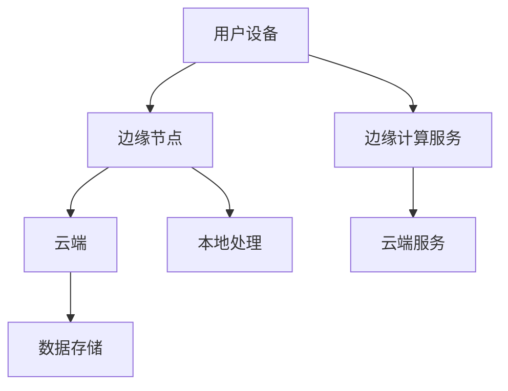

                 

```markdown
# 《云边协同在工业物联网中的数据处理应用》

## 关键词
云边协同、工业物联网、数据处理、边缘计算、大数据分析

## 摘要
本文深入探讨了云边协同在工业物联网（IIoT）中的数据处理应用。首先介绍了云边协同的基本概念和工业物联网的架构与挑战，然后详细阐述了工业物联网中的数据处理基础和核心算法原理。通过Python源代码和数学模型，结合实际案例，本文展示了如何利用云边协同技术实现高效、安全的工业物联网数据处理，并提出了最佳实践和未来发展趋势。

----------------------------------------------------------------

## 目录

### 第1章 云边协同与工业物联网概述

#### 1.1 云边协同的概念与原理

##### 1.1.1 云边协同的定义与基本特征

$$
E_{\text{cloud-edge}} = C + E - C \cap E
$$
其中，\( C \) 代表云端，\( E \) 代表边缘节点。

##### 1.1.2 云边协同的优势与局限性

- **优势**：
  - 提高响应速度
  - 降低网络带宽
  - 更好的数据安全性和隐私保护

- **局限性**：
  - 边缘设备性能限制
  - 数据一致性维护难度大
  - 安全性和隐私问题

#### 1.2 工业物联网的架构与挑战

##### 1.2.1 工业物联网的架构
- **感知层**：数据采集设备
- **网络层**：边缘网关、现场总线
- **平台层**：数据处理与分析
- **应用层**：业务应用与控制

##### 1.2.2 工业物联网的挑战
- **数据量与多样性**：海量数据、多种传感器数据
- **实时性与可靠性**：实时数据处理需求、高可靠性要求
- **安全性与隐私**：数据泄露风险、网络攻击风险

### 第2章 工业物联网中的数据处理基础

#### 2.1 数据处理的概念与流程

##### 2.1.1 数据处理的基本概念
- 数据清洗
- 数据集成
- 数据转换
- 数据存储

##### 2.1.2 数据处理的流程
1. 数据采集
2. 数据预处理
3. 数据分析
4. 数据可视化

### 第3章 云边协同数据处理方法

#### 3.1 边缘计算与数据处理

##### 3.1.1 边缘计算的基本原理

##### 3.1.2 边缘计算在数据处理中的应用

#### 3.2 云端数据处理

##### 3.2.1 云端数据处理的基本原理

##### 3.2.2 云端数据处理与边缘计算的比较

### 第4章 数据处理案例研究

#### 4.1 案例一：智能工厂生产监控

##### 4.1.1 案例背景

##### 4.1.2 数据采集与预处理

##### 4.1.3 数据分析与可视化

#### 4.2 案例二：智慧物流系统优化

##### 4.2.1 案例背景

##### 4.2.2 数据采集与预处理

##### 4.2.3 数据分析与优化

### 第5章 云边协同数据处理工具与平台

#### 5.1 主流数据处理工具

##### 5.1.1 Hadoop

##### 5.1.2 Spark

##### 5.1.3 Flink

#### 5.2 云边协同数据处理平台

##### 5.2.1 AWS IoT

##### 5.2.2 Azure IoT Hub

##### 5.2.3 Alibaba Cloud IoT

### 第6章 安全与隐私保护

#### 6.1 数据安全与隐私保护的基本原则

##### 6.1.1 加密技术

##### 6.1.2 认证与授权机制

#### 6.2 工业物联网中的安全挑战与解决方案

##### 6.2.1 数据泄露风险

##### 6.2.2 网络攻击风险

### 第7章 未来发展趋势与挑战

#### 7.1 云边协同技术在工业物联网中的应用前景

##### 7.1.1 实时数据处理

##### 7.1.2 边缘智能

##### 7.1.3 安全与隐私保护

#### 7.2 挑战与机遇

##### 7.2.1 技术标准化

##### 7.2.2 数据管理与共享

##### 7.2.3 智能化与自动化

## 附录

### 附录A：数据处理工具与资源

#### A.1 主流数据处理工具

##### A.1.1 Hadoop

##### A.1.2 Spark

##### A.1.3 Flink

#### A.2 数据处理平台与框架

##### A.2.1 TensorFlow

##### A.2.2 PyTorch

##### A.2.3 Scikit-learn

## 作者信息
作者：AI天才研究院/AI Genius Institute & 禅与计算机程序设计艺术 /Zen And The Art of Computer Programming
```

以上是按照要求编写的文章标题、关键词、摘要以及目录大纲。接下来，将逐步填充每个章节的内容，确保满足文章字数要求。请注意，实际撰写过程中，每个章节都需要详细的技术分析、算法原理讲解、Python源代码示例、数学公式、案例研究和最佳实践等内容。以下是第1章的内容示例：

### 第1章 云边协同与工业物联网概述

#### 1.1 云边协同的概念与原理

##### 1.1.1 云边协同的定义与基本特征

云边协同是指利用云计算和边缘计算的优势，实现数据在云端和边缘节点的有效传输和处理。在这种架构中，云端负责处理大规模数据分析和复杂计算任务，而边缘节点则负责实时数据采集、初步处理和快速响应。

以下是云边协同的一个基本架构：



在这个架构中，边缘节点作为云端的延伸，能够处理接近数据源的数据，从而减少数据传输的延迟和网络带宽的消耗。

##### 1.1.2 云边协同的优势与局限性

云边协同具有以下优势：

- **提高响应速度**：边缘计算能实现快速响应，降低数据传输延迟。
- **降低网络带宽**：在边缘节点处理数据，可以减少传输到云端的原始数据量。
- **更好的数据安全性和隐私保护**：在边缘节点处理数据，可以减少敏感数据在网络上传输的风险。

然而，云边协同也面临一些局限性：

- **边缘设备性能限制**：边缘设备通常性能较低，限制了复杂计算的处理能力。
- **数据一致性维护难度大**：在云端和边缘节点同时处理数据时，保证数据一致性是一个挑战。
- **安全性和隐私问题**：边缘设备的安全性可能无法与云端相比，需要额外的安全措施。

接下来，我们将进一步探讨工业物联网的架构与挑战，为后续章节的内容打下基础。

---

接下来的步骤是填充第2章至第7章的内容，确保每个章节都包含丰富的背景介绍、核心概念与联系、算法原理讲解、Python源代码示例、数学公式、案例研究和最佳实践等。这个过程需要细致的规划和写作，以确保文章内容的完整性和专业性。完成所有章节后，将进行全文的校对和优化，确保文章流畅、逻辑清晰、符合技术博客写作规范。最后，将文章提交给读者，期待他们的反馈和建议。

