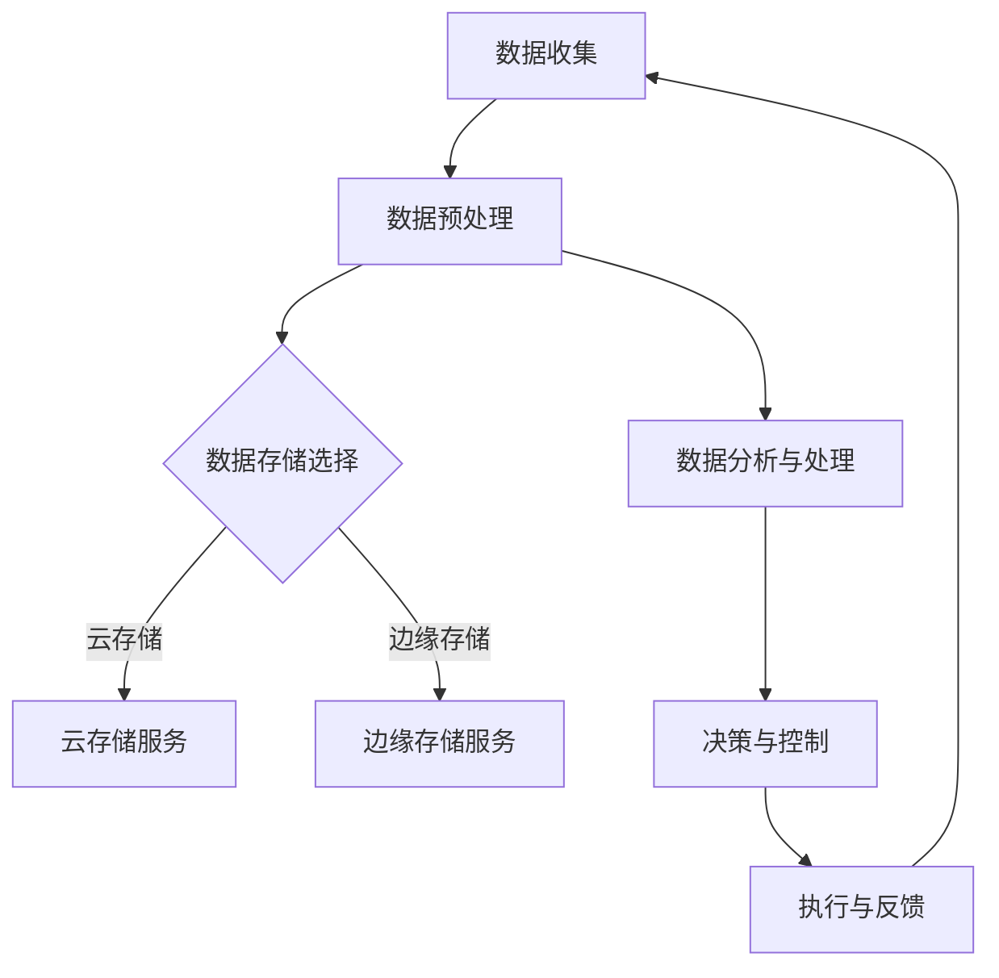
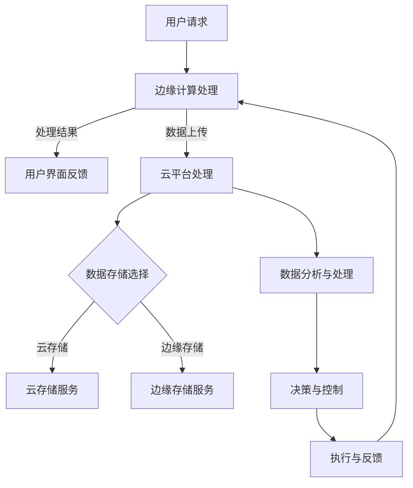
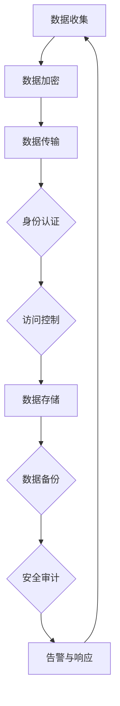

                 

### 引言

在当今数字化的时代，物联网（Internet of Things，IoT）已经成为连接物理世界与数字世界的桥梁，它通过将各种设备、传感器和数据连接起来，为我们带来了前所未有的便利和效率。然而，随着物联网设备的数量和复杂性的增加，如何有效地管理和协调这些设备成为了一个关键挑战。在此背景下，云边端协同架构的应用显得尤为重要。

#### **云边端协同的必要性**

云计算、边缘计算和端计算各自在不同的层面上为物联网提供了支持，但它们的独立运作往往无法满足物联网系统的整体需求。云计算提供了强大的计算和存储能力，但网络延迟和带宽限制成为瓶颈；边缘计算在接近数据源的地方提供了低延迟计算，但资源有限；端计算则在设备本地进行数据预处理，但能力有限。因此，云边端协同架构通过整合这三种计算模式，实现了优势互补，提升了物联网系统的整体性能和可靠性。

#### **本书结构安排与内容预期**

本书将系统地探讨云边端协同在物联网架构中的应用。首先，我们将回顾物联网的基础知识，包括其发展背景、架构和关键技术。随后，我们将深入探讨云计算、边缘计算和端计算在物联网中的应用，以及如何选择和搭建云平台。接着，我们将分析云边端协同架构的设计原则和实际案例，探讨物联网安全与隐私保护的关键问题。最后，我们将通过几个应用案例展示物联网在智能家居、智能交通和智能农业等领域的实际应用，并展望物联网的未来发展趋势。

通过本书的阅读，读者将能够系统地理解云边端协同架构在物联网中的应用，掌握相关技术原理，并能运用这些知识来解决实际问题。希望本书能够为物联网领域的研究者和实践者提供有价值的参考和指导。

### 关键词

- 物联网
- 云计算
- 边缘计算
- 端计算
- 云边端协同
- 物联网安全

### 摘要

本文探讨了云边端协同在物联网架构中的应用。首先，介绍了物联网的发展背景与现状，以及云计算、边缘计算和端计算在物联网中的重要性。随后，详细阐述了云边端协同的必要性，并介绍了本书的结构安排和内容预期。接下来，通过多个章节深入探讨了物联网的基础知识、云计算与物联网、边缘计算与物联网、端计算与物联网、云边端协同架构设计、物联网安全与隐私保护以及物联网的应用案例。最后，展望了物联网的未来发展趋势，并提供了相关工具与资源的附录。通过本文的阅读，读者将能够系统地理解云边端协同在物联网架构中的应用，掌握相关技术原理，并能将其运用到实际项目中。

#### 第2章 物联网基础

物联网（Internet of Things，IoT）作为一种新兴技术，正迅速改变着我们的生活方式和社会结构。本章将介绍物联网的发展背景与现状、物联网架构以及物联网的关键技术，为后续章节的深入探讨奠定基础。

##### **2.1 物联网概述**

物联网是指通过互联网将各种物理设备连接起来，实现设备与设备、设备与云之间的信息交换和智能控制。物联网的核心目标是通过数据的收集、传输和分析，提高资源利用效率，改善生活质量，促进经济增长。物联网的发展可以追溯到20世纪80年代，当时一些企业和研究机构开始探索如何将物理设备与互联网连接。随着传感器技术、无线通信技术、云计算和大数据分析技术的不断进步，物联网逐渐成为一个独立的技术领域。

目前，物联网已广泛应用于多个行业，如智能家居、智能交通、智能医疗、智能农业和工业自动化等。根据市场调研机构的数据，全球物联网设备数量预计将在未来几年内呈现爆炸式增长，到2030年，物联网设备的数量可能达到数百亿级别。

##### **2.2 物联网架构**

物联网架构通常包括感知层、网络层和应用层三个部分。

1. **感知层**：感知层是物联网架构的最底层，主要功能是收集物理世界中的各种数据。感知层包括各种传感器和设备，如温度传感器、湿度传感器、摄像头、智能门锁等。这些设备能够实时感知环境变化，并将数据传输到网络层。

2. **网络层**：网络层负责将感知层收集到的数据传输到云平台或其他设备。网络层通常使用无线通信技术，如Wi-Fi、蓝牙、Zigbee、LoRa等，实现设备之间的数据传输。网络层还需要考虑数据传输的安全性和可靠性，以防止数据在传输过程中被窃取或篡改。

3. **应用层**：应用层是物联网架构的最高层，主要功能是根据感知层和网络层提供的数据，实现各种智能应用。应用层可以是云端的平台应用，也可以是端设备上的本地应用。常见的应用场景包括智能监控、智能分析、远程控制等。

##### **2.3 物联网的关键技术**

物联网的实现依赖于多种关键技术的支持，包括传感器技术、无线通信技术、云计算和大数据分析技术。

1. **传感器技术**：传感器是物联网的核心组件，用于感知和采集物理世界中的各种信息。传感器的种类繁多，如温度传感器、湿度传感器、光传感器、压力传感器、运动传感器等。随着纳米技术和微机电系统（MEMS）技术的发展，传感器的体积越来越小，成本越来越低，性能越来越高。

2. **无线通信技术**：无线通信技术是实现设备之间数据传输的主要手段。常见的无线通信技术包括Wi-Fi、蓝牙、Zigbee、LoRa等。这些技术各有优缺点，适用于不同的应用场景。例如，Wi-Fi具有较高的带宽和传输距离，但功耗较高；蓝牙适用于短距离、低功耗应用；Zigbee适合智能家居等短距离、多设备场景；LoRa适合长距离、低功耗场景。

3. **云计算**：云计算为物联网提供了强大的计算和存储能力。通过云计算平台，物联网设备可以随时随地访问和处理数据。云计算还支持海量设备的连接和管理，提高了物联网系统的可扩展性和可靠性。

4. **大数据分析技术**：大数据分析技术是物联网应用的重要基础。物联网设备产生的海量数据需要通过大数据分析技术进行处理和分析，以提取有价值的信息。大数据分析技术包括数据采集、存储、处理、分析和可视化等多个方面。

通过本章的介绍，读者可以初步了解物联网的发展背景、架构和关键技术，为后续章节的深入探讨打下基础。

#### 第3章 云计算与物联网

云计算作为一种新兴的计算模式，已经在各个行业中得到了广泛应用。本章将深入探讨云计算在物联网中的应用，包括云计算平台的选择与搭建、云服务的使用与优化，以及云计算与物联网的融合优势。

##### **3.1 云计算在物联网中的应用**

云计算为物联网提供了强大的支持，主要表现在以下几个方面：

1. **数据处理与存储**：物联网设备会产生大量数据，这些数据需要通过云计算平台进行存储和处理。云计算平台提供了弹性、高效、可靠的数据存储和处理能力，能够满足物联网设备的数据处理需求。

2. **数据分析和智能应用**：云计算平台支持各种数据分析工具和算法，能够对物联网设备产生的数据进行深度分析，提取有价值的信息。通过数据分析，可以实现智能监控、预测维护、优化决策等应用。

3. **设备管理**：云计算平台支持设备的集中管理，包括设备监控、设备配置、设备升级等。通过云计算平台，可以方便地管理大量物联网设备，提高运维效率。

4. **业务集成与协同**：云计算平台支持多种应用开发和部署方式，可以方便地将物联网应用与现有业务系统集成，实现业务的协同和扩展。

##### **3.2 云平台的选择与搭建**

在选择和搭建云平台时，需要考虑以下几个方面：

1. **平台类型**：根据物联网应用的需求，可以选择不同的云平台。例如，公有云适合大规模、通用性的应用；私有云适合对数据安全性和控制要求较高的应用；混合云适合需要灵活扩展和高效资源利用的应用。

2. **性能与成本**：根据物联网设备的数据量和处理需求，选择具有高性能和低成本的云平台。例如，选择具有高带宽和低延迟的云服务，可以提高物联网系统的响应速度和用户体验。

3. **安全性**：物联网应用涉及大量敏感数据，需要确保数据的安全性和隐私保护。选择具有严格安全措施和合规性的云平台，可以提高数据的安全性。

4. **可扩展性**：物联网应用需要具备良好的可扩展性，以适应设备数量和数据处理量的变化。选择具有弹性扩展能力的云平台，可以确保系统在业务增长时能够顺利扩展。

##### **3.3 云服务的使用与优化**

在物联网应用中，合理使用云服务可以提高系统的性能和可靠性。以下是一些使用云服务的优化策略：

1. **数据存储优化**：根据数据的重要性和访问频率，选择合适的数据存储方案。例如，将热数据存储在高速存储设备上，将冷数据存储在成本较低的存储设备上，可以提高存储效率。

2. **计算资源优化**：根据设备的数据处理需求，动态调整计算资源。例如，使用容器化技术将应用部署在容器中，可以根据需求动态调整容器数量，提高计算资源利用率。

3. **网络优化**：优化物联网设备与云平台之间的网络连接，降低网络延迟和带宽使用。例如，使用CDN（内容分发网络）将数据缓存到用户附近的服务器，减少数据传输距离。

4. **安全优化**：加强物联网应用的安全防护，包括数据加密、身份认证、访问控制等。使用云平台提供的安全服务，如防火墙、入侵检测等，提高系统的安全性。

##### **3.4 云计算与物联网的融合优势**

云计算与物联网的融合为物联网应用带来了显著的优势：

1. **提升数据处理能力**：云计算提供了强大的计算和存储能力，可以处理海量物联网设备产生的数据，实现实时分析和智能应用。

2. **降低系统成本**：通过云计算，物联网设备可以共享云平台提供的资源，降低设备成本和运营成本。

3. **提高系统可靠性**：云计算平台具有高可用性和弹性扩展能力，可以确保物联网系统在设备数量和数据量增加时依然稳定运行。

4. **促进业务创新**：云计算和物联网的结合为开发者提供了丰富的开发工具和平台，可以快速实现新的物联网应用，推动业务创新。

通过本章的讨论，我们可以看到云计算在物联网中的应用具有重要意义，为物联网系统提供了强大的支持。选择合适的云平台，优化云服务的使用，可以充分发挥云计算的优势，提升物联网系统的性能和可靠性。

### 3.4 云计算与物联网的融合优势

云计算与物联网的融合为物联网应用带来了显著的优势，具体体现在以下几个方面：

1. **数据处理能力的提升**：云计算平台具备强大的计算和存储能力，能够高效处理来自海量物联网设备的数据。这不仅解决了传统单点计算能力的限制，还能够实现实时数据处理和智能分析，从而为物联网应用提供实时、精准的决策支持。

2. **系统成本的降低**：通过云计算，物联网设备无需自行购置昂贵的计算和存储资源，而是可以共享云平台提供的资源。这种方式不仅降低了设备的初始购置成本，还能够根据实际需求灵活调整资源使用，进一步降低运营成本。

3. **系统可靠性的提高**：云计算平台通常具有高可用性和弹性扩展能力，能够在设备数量和数据量增加时保持系统的稳定运行。此外，云平台还提供了完善的备份和恢复机制，能够确保数据的安全性和系统的可靠性。

4. **业务创新的促进**：云计算为物联网开发者提供了丰富的开发工具和平台，使得快速构建和部署物联网应用变得更加容易。开发者可以利用云平台提供的各种服务和API，快速实现新的业务场景，推动业务创新。

#### **实例解析**

以智能家居应用为例，云计算平台可以实时收集和处理来自各种智能设备的传感器数据，如温度传感器、湿度传感器和智能门锁等。通过数据分析，云平台可以实时调整家居环境参数，实现自动调节空调、灯光和窗帘等功能。同时，云计算平台还支持远程监控和操作，用户可以通过智能手机或平板电脑随时随地查看和控制家居设备。这种云计算与物联网的融合应用，不仅提升了用户的生活质量，还创造了新的商业模式。

#### **数据流动与存储优化**

在云计算与物联网的融合中，数据的流动与存储优化是一个关键环节。以下是一些优化策略：

1. **边缘计算结合**：在物联网应用中，边缘计算可以将一部分数据处理和分析任务分配到靠近数据源的设备上，减少数据传输的延迟和带宽消耗。例如，在智能交通系统中，可以将在车辆附近进行的交通状况监控和分析，减少对云平台的依赖。

2. **数据分层存储**：根据数据的重要性和访问频率，可以将数据分层存储在不同的存储设备上。例如，将热数据存储在快速的SSD上，将冷数据存储在成本较低的HDD上。这种方式可以提高存储资源的利用率，降低存储成本。

3. **数据压缩与加密**：在数据传输和存储过程中，可以采用数据压缩技术减少数据量，降低带宽消耗和存储空间需求。同时，数据加密技术可以确保数据在传输和存储过程中的安全性，防止数据泄露。

4. **分布式存储**：使用分布式存储技术可以将数据分散存储在多个节点上，提高数据存储的可靠性和访问速度。例如，云平台可以采用分布式文件系统（如HDFS）或分布式数据库（如HBase），确保数据的高效存储和快速访问。

通过这些数据流动与存储优化策略，可以进一步提升云计算与物联网融合应用的性能和可靠性，为用户提供更优质的服务体验。

#### **安全性考虑**

在云计算与物联网的融合应用中，安全性是一个不可忽视的重要问题。以下是一些关键的安全性和隐私保护措施：

1. **访问控制**：使用强认证和访问控制机制，确保只有授权用户才能访问物联网设备和数据。例如，使用多因素认证（MFA）和基于角色的访问控制（RBAC）。

2. **数据加密**：对数据进行加密存储和传输，防止数据在传输和存储过程中的泄露。使用SSL/TLS等加密协议保护数据在传输过程中的安全，使用AES等对称加密算法保护数据在存储过程中的安全。

3. **网络隔离**：在物联网设备和云平台之间建立网络隔离，限制不必要的网络访问。例如，使用防火墙和虚拟专用网络（VPN）隔离内外网络。

4. **安全审计**：定期进行安全审计，监控物联网设备和云平台的操作日志，及时发现和响应潜在的安全威胁。

5. **数据隐私保护**：在处理用户数据时，遵守数据隐私保护法规，如《通用数据保护条例》（GDPR）等。对用户数据进行匿名化和去标识化处理，确保用户隐私不被泄露。

通过这些安全性和隐私保护措施，可以大大提高云计算与物联网融合应用的安全性和可靠性，保障用户数据和系统的安全。

### 第4章 边缘计算与物联网

边缘计算是一种将计算、存储和网络功能分布到网络边缘的技术，旨在提升物联网系统的实时性和响应速度。本章将深入探讨边缘计算在物联网中的应用、优势与挑战，并通过实际案例展示其应用效果。

##### **4.1 边缘计算概述**

边缘计算是指将数据处理和计算任务从传统的集中式数据中心转移到网络边缘，即接近数据源的地方进行。边缘计算的核心思想是通过在靠近数据生成源头的地方处理数据，减少数据传输的距离和时间，提高系统的实时性和响应速度。边缘计算的关键组件包括边缘服务器、边缘网关和边缘设备。

边缘服务器位于网络边缘，提供计算和存储资源，可以运行复杂的应用程序和服务。边缘网关负责连接物联网设备和边缘服务器，实现数据传输和协议转换。边缘设备则是物联网系统的感知层，通过传感器和执行器实时收集和反馈环境数据。

##### **4.2 边缘计算的优势与挑战**

**优势：**

1. **低延迟**：边缘计算将数据处理任务从远程数据中心转移到网络边缘，减少了数据传输的延迟，提高了系统的响应速度。这对于实时性要求高的物联网应用，如自动驾驶、智能制造和智能医疗等领域尤为重要。

2. **高带宽利用**：边缘计算减少了数据传输的需求，从而降低了网络带宽的消耗，提高了网络资源的利用效率。

3. **数据隐私保护**：边缘计算可以在本地处理数据，减少数据在传输过程中的暴露风险，提高数据隐私保护能力。

4. **可靠性增强**：边缘计算通过在分布式节点上部署计算和存储资源，提高了系统的容错能力和可靠性。

**挑战：**

1. **资源限制**：边缘设备通常资源有限，包括计算能力、存储容量和电池寿命等。这限制了边缘设备能够执行的任务类型和复杂度。

2. **网络不稳定**：边缘计算依赖于无线网络，网络稳定性是一个挑战。网络连接中断或网络质量差会影响边缘计算的性能。

3. **安全风险**：边缘计算设备分布在网络边缘，面临更多的安全威胁。确保边缘设备的安全性是边缘计算面临的重要挑战。

4. **维护复杂性**：边缘设备分散在各个位置，维护和管理复杂度增加。需要开发有效的运维和管理策略来应对这一挑战。

##### **4.3 边缘计算实例分析**

**案例1：智能交通系统**

智能交通系统（ITS）利用边缘计算技术，实现实时交通监控和管理。在智能交通系统中，边缘服务器和边缘网关部署在道路附近，实时收集交通流量、车辆速度、天气等信息。通过边缘计算，系统能够快速处理这些数据，实现实时交通信号调节、事故预警和道路优化建议。例如，当检测到前方拥堵时，系统可以立即调整信号灯时间，以缓解交通压力。

**案例2：智慧农业**

智慧农业利用边缘计算技术，实现对农田环境的实时监测和管理。在农田中，部署了各种传感器，如土壤湿度传感器、气象传感器和作物生长传感器等。边缘设备收集这些传感器数据，并通过边缘计算进行实时分析，提供精准的灌溉、施肥和病虫害防治建议。通过边缘计算，农业系统可以实现自动化和智能化管理，提高农业生产效率和农产品质量。

**案例3：工业自动化**

在工业自动化领域，边缘计算技术被广泛应用于生产线监控和设备维护。在工业自动化系统中，边缘服务器和边缘网关部署在车间现场，实时收集生产设备的运行数据。通过边缘计算，系统可以实时监控设备的运行状态，进行故障预测和预防性维护。例如，当检测到设备运行异常时，系统可以立即发出预警，并建议维修人员前往处理。通过边缘计算，工业自动化系统可以大幅提高生产效率和设备利用率。

通过以上实例分析，我们可以看到边缘计算在物联网中的应用范围非常广泛，不仅在提升系统的实时性和响应速度方面具有显著优势，还能为不同行业提供定制化的解决方案。尽管面临一些挑战，但随着技术的不断进步，边缘计算将在物联网领域发挥越来越重要的作用。

### 第5章 端计算与物联网

端计算（Edge Computing）是近年来随着物联网和智能设备的普及而迅速发展起来的一种计算模式。本章将介绍端计算的概述、优势与挑战，并通过实际案例展示端计算在物联网中的应用。

##### **5.1 端计算概述**

端计算是指在设备本地进行数据处理和计算的技术，与传统的云计算和边缘计算不同，端计算强调在数据生成源附近进行实时处理，以减少数据传输的延迟和带宽消耗。端计算的主要组成部分包括端设备、端服务器和端应用程序。

端设备是指各种智能设备，如智能手机、平板电脑、智能手表和可穿戴设备等。这些设备通常配备有传感器、处理器和存储器，能够收集和存储数据。端服务器是位于网络边缘的计算节点，提供额外的计算和存储资源，支持端设备的扩展需求。端应用程序是运行在端设备或端服务器上的软件，用于处理数据、执行任务和提供用户界面。

##### **5.2 端计算的优势与挑战**

**优势：**

1. **低延迟**：端计算在设备本地进行数据处理，减少了数据传输的距离和时间，从而降低了系统的延迟。这对于需要实时响应的应用，如自动驾驶、远程医疗和智能监控等尤为重要。

2. **高效利用资源**：端计算利用设备本地的计算和存储资源，减少了对外部网络的依赖，提高了系统的资源利用效率。端设备可以利用自身的处理能力进行数据预处理，减轻云端和边缘服务器的负担。

3. **隐私保护**：端计算可以在设备本地处理数据，减少了数据在传输过程中的暴露风险，提高了数据隐私保护能力。

4. **增强自主性**：端计算使得设备可以独立运行，即使在没有网络连接的情况下也能执行一些基本的任务。这对于远程作业、紧急情况下的自主决策等场景非常有价值。

**挑战：**

1. **计算能力有限**：端设备通常资源有限，包括计算能力、存储容量和电池寿命等。这限制了端设备能够执行的任务类型和复杂度。

2. **网络不稳定**：端设备通常依赖无线网络进行通信，网络连接的不稳定性和带宽限制可能影响端计算的性能。

3. **安全风险**：端设备分布在网络边缘，更容易受到攻击。确保端设备的安全性是端计算面临的重要挑战。

4. **维护复杂性**：端设备的分散性增加了维护和管理复杂度。需要开发有效的运维和管理策略来应对这一挑战。

##### **5.3 端计算实例分析**

**案例1：智能医疗**

在智能医疗领域，端计算被广泛应用于远程医疗和移动健康监测。例如，医生可以利用智能手机上的应用程序进行远程诊疗，通过摄像头和传感器实时监测患者的身体状况。患者佩戴的智能手表或健康监测设备可以收集心率、血压等数据，并通过端计算进行实时分析，提供个性化的医疗建议。通过端计算，智能医疗系统可以实现更快速、准确的诊断和治疗方案。

**案例2：智能制造**

在智能制造中，端计算被用于实时监控和优化生产过程。例如，工厂中的智能传感器可以收集设备状态和生产数据，通过端计算进行实时分析，发现设备故障或生产异常。端计算可以快速响应，调整生产参数或发出预警，避免生产中断。通过端计算，智能制造系统可以实现更高效、更可靠的生产过程。

**案例3：智能城市**

在智能城市中，端计算被用于提升城市管理的效率和响应速度。例如，智能路灯可以通过传感器收集光照、温度、湿度等数据，通过端计算进行分析，实现智能照明控制，降低能源消耗。智能垃圾桶可以通过端计算监测垃圾桶的填充状态，实现智能清运，提高城市环境管理水平。通过端计算，智能城市可以实现更智能、更高效的城市管理。

通过以上实例分析，我们可以看到端计算在物联网中的应用非常广泛，不仅提升了系统的实时性和响应速度，还提高了资源利用效率和数据隐私保护能力。尽管面临一些挑战，端计算在物联网领域具有巨大的潜力和发展前景。

### 第6章 云边端协同架构设计

云边端协同架构是一种结合云计算、边缘计算和端计算的技术体系，旨在优化物联网系统的性能、可靠性和资源利用。本章将探讨云边端协同架构的设计原则、具体方法，并通过实际案例解析其设计与应用。

#### **6.1 云边端协同架构原理**

云边端协同架构的核心思想是将云计算、边缘计算和端计算有机结合，实现资源的灵活调度和优化利用。具体原理如下：

1. **资源层次划分**：将计算和存储资源划分为三层：云端、边缘端和端设备。云端提供高带宽、高计算能力的资源，边缘端提供中等带宽、中等计算能力的资源，端设备提供低带宽、低计算能力的资源。

2. **任务调度策略**：根据任务的性质和需求，动态调整任务在云端、边缘端和端设备的执行位置。对于计算密集型任务，优先在云端执行；对于延迟敏感型任务，优先在边缘端执行；对于实时性要求高的任务，优先在端设备本地执行。

3. **数据流动管理**：通过数据分层存储和传输优化，实现数据在云端、边缘端和端设备之间的快速流动和高效处理。对于热数据，优先存储在云端；对于冷数据，存储在边缘端或端设备本地。

4. **服务协同与集成**：通过服务网格和微服务架构，实现云端、边缘端和端设备的协同工作，提供一体化服务。例如，云端提供数据存储和分析服务，边缘端提供实时处理和智能决策服务，端设备提供本地感知和执行服务。

#### **6.2 云边端协同架构设计方法**

设计云边端协同架构时，需要考虑以下方法：

1. **需求分析**：明确物联网应用的需求，包括数据处理需求、响应时间要求、数据安全性需求等。根据需求分析结果，确定云端、边缘端和端设备的资源需求和配置方案。

2. **技术选型**：选择合适的云计算平台、边缘计算框架和端计算设备。例如，选择具有高可用性和弹性扩展能力的云计算平台，选择适合边缘计算场景的硬件设备，选择具备高性能和低功耗的端设备。

3. **架构设计**：设计合理的云边端协同架构，包括云端、边缘端和端设备的布局和连接方式。例如，可以将云端部署在数据中心，边缘端部署在靠近数据源的设备附近，端设备部署在用户终端。

4. **任务调度与优化**：制定任务调度策略，实现任务的动态分配和优化执行。例如，根据任务类型和需求，将任务分配到云端、边缘端或端设备，并优化任务执行的顺序和资源利用。

5. **数据管理**：设计数据流动和存储方案，实现数据的快速流动和高效处理。例如，采用数据分层存储策略，将热数据存储在云端，将冷数据存储在边缘端或端设备本地，采用数据压缩和加密技术提高数据传输和存储的效率。

6. **安全与隐私保护**：设计安全机制，确保云端、边缘端和端设备的数据安全和隐私保护。例如，采用身份认证、访问控制和数据加密等技术，保护数据在传输和存储过程中的安全。

#### **6.3 云边端协同架构案例解析**

**案例1：智能交通系统**

智能交通系统利用云边端协同架构，实现高效的交通管理和优化。云端负责大数据分析和交通预测，边缘端负责实时交通监控和信号调节，端设备负责车辆状态和路况信息的收集。具体架构如下：

1. **需求分析**：智能交通系统需要实时处理大量交通数据，实现交通信号调节、事故预警和交通流量优化。

2. **技术选型**：选择云计算平台（如AWS、Azure）提供大数据分析能力，选择边缘计算设备（如Raspberry Pi）进行实时处理，选择智能车辆终端（如车载传感器）收集路况信息。

3. **架构设计**：将云端部署在数据中心，边缘端部署在交通信号灯附近，端设备部署在车辆上。

4. **任务调度与优化**：根据交通数据的特点和需求，将数据分析和交通预测任务分配到云端，将实时监控和信号调节任务分配到边缘端，将车辆状态和路况信息收集任务分配到端设备。

5. **数据管理**：采用数据分层存储策略，将热数据存储在云端，将冷数据存储在边缘端，将本地临时数据存储在端设备。

6. **安全与隐私保护**：采用多重加密技术和身份认证机制，确保数据在传输和存储过程中的安全，保护用户隐私。

通过智能交通系统的案例，我们可以看到云边端协同架构在优化交通管理和提升系统性能方面的显著优势。

**案例2：智慧农业**

智慧农业利用云边端协同架构，实现精准农业管理和高效农业生产。云端负责数据分析和管理，边缘端负责农田监控和实时分析，端设备负责传感器数据和执行器控制。具体架构如下：

1. **需求分析**：智慧农业需要实时监测农田环境，进行精准灌溉、施肥和病虫害防治。

2. **技术选型**：选择云计算平台提供数据分析和管理服务，选择边缘计算设备（如农业物联网网关）进行实时处理，选择各种农业传感器和执行器。

3. **架构设计**：将云端部署在数据中心，边缘端部署在农田监控站点，端设备部署在农田中。

4. **任务调度与优化**：将农田数据分析和决策任务分配到云端，将实时监控和数据分析任务分配到边缘端，将传感器数据和执行器控制任务分配到端设备。

5. **数据管理**：采用数据分层存储策略，将热数据存储在云端，将冷数据存储在边缘端，将本地临时数据存储在端设备。

6. **安全与隐私保护**：采用多重加密技术和身份认证机制，确保数据在传输和存储过程中的安全，保护用户隐私。

通过智慧农业的案例，我们可以看到云边端协同架构在提升农业生产效率和优化资源利用方面的显著优势。

通过以上案例解析，我们可以看到云边端协同架构在物联网应用中的设计原则和方法，以及其实际应用效果。云边端协同架构不仅提升了系统的性能和可靠性，还为不同行业提供了定制化的解决方案。

### 第7章 物联网安全与隐私保护

在物联网（IoT）快速发展的背景下，物联网安全与隐私保护成为不可忽视的关键问题。本章将探讨物联网安全的总体概述、云边端协同环境下的安全挑战，并提出相应的解决方案，以确保物联网系统的安全可靠运行。

##### **7.1 物联网安全概述**

物联网安全涉及多个方面，包括物理安全、网络安全、数据安全和应用安全。物理安全主要涉及物联网设备的物理保护和防止设备被盗或损坏；网络安全主要关注防止恶意攻击者通过网络入侵物联网系统；数据安全涉及保护数据在传输和存储过程中的完整性、保密性和可用性；应用安全则关注物联网应用软件的安全，防止恶意软件或漏洞导致系统崩溃或数据泄露。

##### **7.2 云边端协同环境下的安全挑战**

云边端协同架构在带来便利和高效性的同时，也带来了新的安全挑战：

1. **分布式攻击**：由于物联网设备分布广泛，攻击者可以通过攻击某一设备进而影响整个系统。例如，攻击者可能通过攻击端设备，获取用户隐私数据，或通过边缘设备入侵云端。

2. **数据泄露**：物联网设备产生的数据量巨大，包括用户隐私数据、业务数据等。在传输和存储过程中，数据泄露风险极高，特别是在云边端协同环境中，数据可能在多个节点间传输，增加了泄露的可能性。

3. **身份认证与访问控制**：在云边端协同架构中，设备、用户和系统服务之间的认证与访问控制变得更加复杂。传统集中式架构中的单一认证和访问控制机制在分布式环境中难以有效实施。

4. **设备管理**：物联网设备种类繁多，设备管理变得更加复杂。确保每个设备的安全配置和软件更新成为一大挑战，特别是在设备资源有限的场景下。

5. **网络隔离与防火墙**：在云边端协同环境中，网络隔离和防火墙配置需要更加细致和动态，以防止恶意流量进入系统。同时，分布式网络架构的防火墙配置和管理也更加复杂。

##### **7.3 物联网安全解决方案**

针对云边端协同环境下的安全挑战，以下是一些可行的解决方案：

1. **多层次安全防护**：采用多层次的安全防护策略，包括物理安全、网络安全、数据安全和应用安全。在物理层，使用加密锁、防篡改设计等手段保护设备；在网络层，采用防火墙、入侵检测系统（IDS）等防止网络攻击；在数据层，使用数据加密、哈希校验等手段保护数据完整性；在应用层，进行代码审计和漏洞修复，确保应用安全。

2. **加密技术**：采用端到端加密技术，确保数据在传输过程中的安全。使用SSL/TLS等协议保护数据在传输过程中的完整性、保密性和认证性。同时，在数据存储过程中，使用加密技术保护数据不被未经授权访问。

3. **身份认证与访问控制**：采用强认证机制，如多因素认证（MFA）、基于角色的访问控制（RBAC）等，确保只有授权用户和设备能够访问系统和数据。此外，通过动态访问控制策略，根据用户角色和权限动态调整访问权限。

4. **设备管理**：建立统一的设备管理平台，实现设备的安全配置、软件更新和监控。使用设备指纹技术，确保设备的唯一性和安全性，防止未授权设备接入系统。同时，定期进行设备安全审计，确保设备安全配置得到执行。

5. **安全监控与响应**：建立安全监控和响应机制，实时监控系统的安全状态，及时发现和响应安全事件。使用入侵检测系统（IDS）、安全信息与事件管理器（SIEM）等工具，收集和分析系统日志，识别潜在的安全威胁。

6. **安全培训与意识提升**：加强物联网安全培训，提高用户和开发者的安全意识。通过安全意识提升活动，使相关人员了解物联网安全的重要性，掌握基本的安全防护措施。

通过上述解决方案，可以有效提升云边端协同环境下的物联网安全，确保系统的可靠性和数据的安全。在未来，随着物联网技术的不断发展和应用场景的扩展，物联网安全将成为一个持续关注和研究的重点领域。

### 7.3 物联网安全解决方案

针对物联网安全面临的挑战，我们可以采取以下具体解决方案来提升物联网系统的安全性：

#### **多层次安全防护架构**

为了建立一个全面的安全防护体系，我们需要在不同层级实施多种安全措施：

1. **物理安全**：在物联网设备层面，通过硬件加密锁、防水防尘设计、硬件安全模块（HSM）等物理防护手段，确保设备的物理安全。此外，对于户外设备，应考虑采用太阳能充电、无线充电等替代电源方案，降低被破坏的风险。

2. **网络安全**：在网络层面，部署防火墙、入侵检测系统（IDS）和入侵防御系统（IPS），实时监控和分析网络流量，防止恶意攻击。对于无线通信，采用WPA3等高级加密协议，确保数据在传输过程中的安全。

3. **数据安全**：在数据层面，采用数据加密技术，如AES-256和RSA加密，确保数据在存储和传输过程中不被窃取。同时，使用哈希函数（如SHA-256）来验证数据的完整性，防止数据篡改。

4. **应用安全**：在应用层面，进行代码审计和安全测试，及时发现和修复安全漏洞。采用安全编程实践，如输入验证、输出编码和错误处理，防止常见的安全威胁，如SQL注入、跨站脚本攻击（XSS）等。

#### **加密技术实施**

数据加密是保护物联网安全的核心措施，以下是一些具体的实施策略：

1. **端到端加密**：在数据传输过程中，采用SSL/TLS等加密协议，确保数据在从源设备传输到云端的整个过程中都是加密的。这可以防止中间人攻击和数据截获。

2. **存储加密**：对于存储在云端或边缘端的数据，使用加密算法进行加密，确保数据在静态存储状态下也是安全的。加密密钥应妥善管理，避免泄露。

3. **数据加密与签名**：对于敏感数据，如用户身份信息、支付信息等，采用加密算法进行加密，同时使用数字签名技术确保数据的完整性和来源的可信性。

#### **身份认证与访问控制**

为了确保只有授权用户和设备能够访问系统和数据，需要采用强大的身份认证和访问控制机制：

1. **多因素认证（MFA）**：除了传统的用户名和密码，增加额外的验证因素，如手机验证码、指纹识别或智能卡等，增强认证安全性。

2. **基于角色的访问控制（RBAC）**：为不同角色设置不同的访问权限，确保用户只能访问与其角色相关的数据和功能。通过权限管理和策略定义，严格控制访问权限。

3. **动态访问控制**：根据用户的行为和上下文环境动态调整访问权限。例如，对于异常访问行为，可以临时限制访问或发出警报。

#### **设备管理**

物联网设备种类繁多，设备管理至关重要：

1. **设备注册与认证**：所有设备在接入网络前必须进行注册和认证，确保设备是合法的、安全的。使用设备指纹技术，确保设备的唯一性和安全性。

2. **软件更新与补丁管理**：定期对设备进行软件更新和补丁管理，确保设备上的软件是最新且安全的。使用自动更新工具，简化更新过程。

3. **监控与审计**：部署监控系统，实时监控设备状态和安全事件。定期进行安全审计，确保设备的安全配置得到执行。

#### **安全培训与意识提升**

提升用户和开发者的安全意识是物联网安全的重要组成部分：

1. **安全培训**：定期为用户和开发者提供物联网安全培训，提高他们的安全意识和应对能力。

2. **安全意识提升活动**：通过安全宣传活动、案例分享和模拟演练，增强用户对物联网安全威胁的认识，提高防范能力。

通过上述解决方案，物联网系统的安全性将得到显著提升，为用户和业务提供更加安全和可靠的保障。

### 7.4 实际案例解析

以下将通过两个实际案例展示物联网安全解决方案在具体应用中的效果：

#### **案例1：智能家居系统**

智能家居系统集成了多种设备，如智能门锁、智能灯泡、智能摄像头等。为了确保系统的安全性，采取了以下措施：

1. **设备注册与认证**：所有智能家居设备在出厂前都进行了安全认证，用户在接入系统前必须通过多重认证（用户名、密码、手机验证码）。

2. **数据加密**：系统采用SSL/TLS协议加密数据传输，确保数据在传输过程中不被窃取。存储在云平台上的数据也使用AES-256进行加密。

3. **权限管理**：通过RBAC机制，用户只能访问与其角色相关的设备。例如，家庭主人在家时可以完全控制所有设备，而外出时只能远程监控部分设备。

4. **软件更新**：定期推送安全补丁和软件更新，确保设备上的软件是最新的，减少了被攻击的风险。

通过这些措施，智能家居系统在安全性方面得到了显著提升，用户对系统的信任度也得到了增强。

#### **案例2：智能工厂**

智能工厂中，各种传感器和设备通过网络连接，实时监控生产过程。为了确保系统的安全性，采取了以下措施：

1. **网络安全**：部署防火墙和入侵检测系统（IDS），实时监控网络流量，防止外部攻击。内部网络使用VPN进行隔离，确保数据在传输过程中的安全。

2. **设备管理**：对所有设备进行注册和认证，确保设备的安全配置得到执行。通过自动更新工具，定期推送安全补丁和软件更新。

3. **数据安全**：在数据传输过程中使用加密协议，如HTTPS和SSL，确保数据在传输过程中不被窃取。存储在边缘设备和云端的数据都采用加密存储，确保数据的安全。

4. **访问控制**：通过多因素认证（MFA）和基于角色的访问控制（RBAC），严格控制访问权限。只有授权人员才能访问敏感数据和关键设备。

通过这些措施，智能工厂在安全性方面得到了显著提升，生产效率和设备利用率也得到了提高。

通过这两个案例，我们可以看到物联网安全解决方案在实际应用中的效果。这些措施不仅提高了系统的安全性，也为物联网技术的广泛应用提供了可靠保障。

### 第8章 物联网应用案例

物联网技术在各个行业中的应用已经越来越广泛，为传统产业带来了巨大的变革和创新。本章将通过智能家居、智能交通和智能农业三个实际应用案例，展示物联网技术的应用效果和具体实现。

#### **8.1 智能家居应用**

智能家居应用是物联网技术的一个典型应用场景。通过将各种家电设备、传感器和控制系统联网，实现家庭环境的智能化管理和自动化控制。以下是一个具体的智能家居应用案例：

**案例描述**：某家庭安装了智能门锁、智能灯泡、智能摄像头、智能恒温器和智能窗帘等设备。所有设备通过Wi-Fi连接到家庭局域网，并通过智能家居中心进行统一管理。

**技术实现**：
1. **智能门锁**：使用蓝牙或Wi-Fi技术，用户可以通过手机APP远程控制门锁，实现无钥匙开锁。同时，智能门锁集成了传感器，可以记录开门和关门时间，提高家庭安全。

2. **智能灯泡**：用户可以通过手机APP远程控制家中的智能灯泡，实现定时开关、亮度调节等功能。智能灯泡还具备感应功能，可以根据环境光线自动调整亮度。

3. **智能摄像头**：用户可以通过手机APP实时查看家中的监控画面，确保家庭安全。智能摄像头还具备人脸识别功能，可以自动识别家庭成员，并提供个性化问候。

4. **智能恒温器**：智能恒温器可以通过传感器监测室内温度，并根据用户的习惯自动调整温度，提高能源利用效率。用户可以通过手机APP远程控制恒温器，实现智能调节。

5. **智能窗帘**：智能窗帘可以通过传感器监测室内光线强度，自动调整窗帘的开启和关闭，实现自然光调节，提高居住舒适度。

**效果评估**：通过智能家居系统，用户可以远程监控和控制家庭设备，提高生活便利性和安全性。同时，智能设备的数据收集和分析，为用户提供个性化服务和能源优化建议，提高生活质量。

#### **8.2 智能交通应用**

智能交通系统利用物联网技术，实现交通流量监测、交通信号控制和智能导航等功能，提高交通效率和安全性。以下是一个具体的智能交通应用案例：

**案例描述**：某城市部署了智能交通系统，包括智能摄像头、智能交通信号灯、智能停车传感器和智能导航系统。

**技术实现**：
1. **智能摄像头**：在关键路口和路段安装智能摄像头，实时监测交通流量和路况信息。摄像头集成了图像识别和大数据分析技术，可以自动识别车辆类型、行驶速度和交通拥堵状况。

2. **智能交通信号灯**：智能交通信号灯可以根据实时交通流量和路况信息，自动调整信号灯时间，优化交通流量。例如，在高峰时段，信号灯可以延长绿灯时间，减少车辆等待时间。

3. **智能停车传感器**：在停车场安装智能停车传感器，实时监测停车位使用情况。用户可以通过手机APP查询停车信息，找到空闲停车位，提高停车效率。

4. **智能导航系统**：智能导航系统利用实时交通数据和路况信息，为用户提供最佳行驶路线和交通提示，减少交通拥堵和行车时间。

**效果评估**：通过智能交通系统，城市交通效率和安全性得到显著提升。实时交通流量监测和信号灯优化，提高了道路通行能力，减少了交通拥堵。智能停车系统和导航系统，提高了停车效率和出行便利性。

#### **8.3 智能农业应用**

智能农业利用物联网技术，实现农业生产过程的智能化管理，提高农业生产效率和质量。以下是一个具体的智能农业应用案例：

**案例描述**：某农场利用物联网技术，实现土壤湿度监测、气象监测、智能灌溉和病虫害监测等功能。

**技术实现**：
1. **土壤湿度传感器**：在农田中安装土壤湿度传感器，实时监测土壤湿度。根据湿度数据，智能灌溉系统可以自动调整灌溉水量，提高水资源利用效率。

2. **气象监测设备**：在农田周围安装气象监测设备，实时监测气温、湿度、降雨量等气象信息。这些数据可以帮助农民预测天气变化，合理安排农业生产活动。

3. **智能灌溉系统**：智能灌溉系统可以根据土壤湿度传感器和气象监测数据，自动调整灌溉时间和水量，实现精准灌溉，减少水资源浪费。

4. **病虫害监测设备**：在农田中安装病虫害监测设备，如摄像头和传感器，实时监测农作物病虫害情况。系统可以自动识别病虫害类型，并提供防治建议，提高农作物产量。

**效果评估**：通过智能农业系统，农民可以实时掌握农田状况，科学管理农业生产过程，提高农业产量和产品质量。智能灌溉系统减少了水资源浪费，提高了水资源利用效率。病虫害监测设备帮助农民提前发现和防治病虫害，减少农药使用，提高农产品安全性。

通过以上三个实际应用案例，我们可以看到物联网技术在智能家居、智能交通和智能农业等领域的广泛应用。物联网技术不仅提高了生产效率和用户体验，还为各行业带来了创新和变革。

### 8.4 智能城市应用

智能城市是物联网技术的另一个重要应用领域，通过物联网设备和系统，实现城市管理的智能化和高效化。以下是一个具体的智能城市应用案例：

**案例描述**：某城市部署了智能城市管理系统，包括智能路灯、智能垃圾桶、智能交通管理和智能安防系统。

**技术实现**：
1. **智能路灯**：在街道上安装智能路灯，通过传感器监测光线强度和行人流量，自动调整灯光亮度，节省能源。同时，智能路灯还具备远程监控和故障诊断功能，便于维护和管理。

2. **智能垃圾桶**：在公共场所安装智能垃圾桶，通过传感器监测垃圾桶的填充程度。当垃圾桶达到一定容量时，系统会自动通知清洁工进行清理，提高垃圾处理效率。

3. **智能交通管理**：在关键路口和路段安装智能摄像头和交通信号灯，实时监测交通流量和路况。系统可以根据实时数据调整信号灯时间，优化交通流量。同时，智能导航系统为市民提供最佳行驶路线，减少交通拥堵。

4. **智能安防系统**：在公共场所和重要设施安装智能摄像头和传感器，实现全天候监控。系统可以自动识别异常行为，如非法入侵、火灾等，并立即通知相关部门进行处理。

**效果评估**：通过智能城市管理系统，城市运营效率显著提高。智能路灯和垃圾桶减少了能源消耗和维护成本，智能交通管理优化了交通流量，减少了交通拥堵和事故发生。智能安防系统提高了城市安全水平，保障了市民的安全。

通过智能城市应用案例，我们可以看到物联网技术在提升城市管理效率和市民生活质量方面的重要作用。未来，随着物联网技术的不断发展和普及，智能城市将带来更多便捷和智能化的城市体验。

### 9.1 物联网技术发展趋势

物联网技术正以前所未有的速度发展，并不断推动各个行业的创新和变革。以下将探讨物联网技术的未来发展趋势，包括5G、人工智能和大数据等关键技术的融合应用，以及新兴物联网应用的崛起。

#### **5G技术的融合**

5G技术的商用化将显著提升物联网系统的通信速度和连接密度，为物联网的广泛应用提供坚实基础。5G网络的高带宽、低延迟和大规模连接能力，使得海量物联网设备能够实时连接和传输数据。例如，在自动驾驶、智能制造和远程医疗等领域，5G技术将提供更加稳定和高效的通信服务，提升系统性能和用户体验。

#### **人工智能的深度融合**

人工智能（AI）技术的快速发展为物联网带来了新的机遇。通过在物联网设备中集成AI算法，可以实现实时数据处理和智能决策。例如，AI可以在智能交通系统中实时分析交通流量，优化信号灯时间；在智能家居中，AI可以学习用户的习惯，提供个性化服务。随着AI技术的不断进步，物联网系统的智能化水平将进一步提高。

#### **大数据的深度应用**

物联网设备每天产生海量数据，这些数据的价值需要通过大数据分析技术来挖掘。大数据技术可以帮助企业更好地理解用户需求，优化业务流程，提升服务质量。例如，在零售行业，通过分析消费者的购物行为和偏好，可以精准推送个性化推荐；在农业领域，通过大数据分析，可以实现精准农业管理，提高产量和质量。

#### **新兴物联网应用的崛起**

随着物联网技术的进步，新兴物联网应用不断涌现，如增强现实（AR）、虚拟现实（VR）和区块链等。AR和VR技术将改变人们的交互方式，为物联网应用带来更加丰富的体验。区块链技术则为物联网提供了去中心化的数据存储和交易方式，确保数据的安全和透明性。

#### **跨领域融合与协作**

物联网技术的发展将推动不同领域的融合与协作，形成新的生态系统。例如，智能城市项目中，物联网、云计算、大数据和人工智能等技术的协同应用，可以实现城市管理的智能化和高效化。跨领域的合作将推动物联网技术的全面应用，为社会发展带来更多可能性。

#### **标准化和法规的完善**

随着物联网应用的普及，标准化和法规的制定变得尤为重要。国际标准化组织（ISO）和国际电工委员会（IEC）等机构正在制定物联网相关的标准和规范，以确保设备之间的互操作性和数据的安全性。同时，各国政府也在加强物联网法律法规的制定，保障物联网系统的安全运行。

通过以上探讨，我们可以看到物联网技术未来的发展趋势充满了机遇和挑战。随着5G、人工智能、大数据等关键技术的深度融合，物联网将迎来更加广阔的应用前景。在新的技术浪潮中，物联网行业将不断创新，为各个领域带来巨大的变革和进步。

### 9.2 物联网在行业中的应用前景

物联网技术在各个行业的应用前景广阔，为传统产业带来了新的发展机遇。以下将重点讨论物联网在工业、医疗和农业等领域的具体应用前景。

#### **工业领域**

物联网技术在工业领域有着广泛的应用前景，主要体现在智能制造和工业自动化方面。通过物联网技术，企业可以实现设备的远程监控、故障预测和生产线的智能化管理。

1. **智能制造**：物联网技术可以帮助企业实现生产过程的数字化和智能化。例如，通过传感器和智能系统，可以对设备进行实时监控，实现设备的预测性维护，减少停机时间，提高生产效率。同时，物联网技术还可以实现生产线的自动化控制，优化生产流程，降低生产成本。

2. **工业自动化**：物联网技术使得工业设备之间的协同工作变得更加高效。通过物联网设备，企业可以实现设备的互联互通，实现生产过程的自动化。例如，在汽车制造业中，物联网技术可以用于生产线的实时监控和调度，提高生产效率和产品质量。

3. **供应链管理**：物联网技术还可以优化供应链管理。通过物联网传感器和系统，企业可以实时监控货物的运输过程，确保供应链的透明性和可靠性。例如，在冷链物流中，物联网技术可以实时监控货物的温度和湿度，确保食品的新鲜度和安全性。

#### **医疗领域**

物联网技术在医疗领域的应用前景也十分广阔，主要体现在远程医疗、智能医疗设备和健康管理方面。

1. **远程医疗**：物联网技术使得医生和患者之间可以实现远程医疗诊断和治疗。通过物联网设备，患者可以在家中进行实时健康监测，并将数据传输给医生。医生可以通过数据分析，实时了解患者的健康状况，提供精准的诊疗建议。

2. **智能医疗设备**：物联网技术可以将各种医疗设备连接起来，实现设备之间的数据共享和协同工作。例如，智能输液泵、智能心电图机和智能呼吸机等设备，可以通过物联网技术实现数据的实时传输和分析，提高诊断和治疗的准确性。

3. **健康管理**：物联网技术可以帮助用户实现健康数据的长期监测和管理。通过智能手环、智能手表等设备，用户可以实时监测自己的心率、血压、睡眠质量等健康数据，并通过手机APP进行数据分析和反馈，实现个性化的健康管理。

#### **农业领域**

物联网技术在农业领域的应用前景也极为广阔，主要体现在智能农业和精准农业方面。

1. **智能农业**：物联网技术可以帮助农民实时监测土壤、气候和作物生长情况，实现农业生产过程的智能化管理。通过传感器和物联网设备，农民可以实时获取农田的土壤湿度、温度和光照数据，并根据数据调整灌溉、施肥和病虫害防治等措施，提高农业生产效率。

2. **精准农业**：物联网技术可以实现农田的精准管理和高效利用。通过物联网传感器，农民可以精确测量农田的土壤养分、水分和作物生长状况，并根据这些数据制定科学的种植计划。例如，通过精准施肥，可以减少化肥的使用，降低环境污染，提高农产品质量。

3. **农产品供应链管理**：物联网技术还可以优化农产品的供应链管理。通过物联网设备和系统，企业可以实时监控农产品的运输过程，确保农产品的品质和安全。例如，在冷链物流中，物联网技术可以实时监测运输过程中的温度和湿度，确保农产品的新鲜度和安全性。

通过以上分析，我们可以看到物联网技术在各个行业中的应用前景非常广阔，为传统产业带来了新的发展机遇。随着物联网技术的不断进步，我们有理由相信，物联网将在未来发挥更加重要的作用，推动各行业的创新和变革。

### 9.3 物联网的未来挑战与机遇

物联网技术的快速发展为各行各业带来了前所未有的机遇，但同时也面临着一系列挑战。以下将讨论物联网在数据隐私、安全性和标准化等方面的未来挑战，并提出相应的应对策略。

#### **数据隐私保护**

随着物联网设备的普及，大量个人数据被收集和传输，数据隐私保护成为关键挑战。用户担心自己的隐私数据被未经授权访问或滥用。应对策略包括：

1. **数据匿名化与去标识化**：在数据收集和存储过程中，对用户数据进行匿名化和去标识化处理，减少隐私泄露的风险。

2. **隐私保护协议**：采用隐私保护协议，如差分隐私和同态加密，确保数据在传输和存储过程中不被未经授权的用户访问。

3. **用户权限管理**：建立严格的用户权限管理机制，确保只有授权用户能够访问敏感数据，并定期审查权限设置，确保其合理性。

4. **用户知情同意**：在数据收集和使用前，明确告知用户数据收集的目的、范围和使用方式，并获取用户的明确同意。

#### **安全性问题**

物联网设备分布广泛，安全防护措施不到位可能导致系统被恶意攻击，数据被窃取或篡改。应对策略包括：

1. **多层次安全防护**：在物理层、网络层、数据层和应用层实施多层次安全防护措施，包括加密、防火墙、入侵检测和多重认证等。

2. **设备安全管理**：建立设备注册和认证机制，确保设备的安全配置得到执行。定期更新设备固件，修复安全漏洞。

3. **安全监控与响应**：建立实时安全监控和响应机制，及时发现和处理安全事件。采用自动化工具进行安全审计和漏洞扫描。

4. **安全培训与意识提升**：加强用户和开发者的安全培训，提高安全意识和防范能力。

#### **标准化问题**

物联网技术的快速发展导致了设备、协议和平台的不统一，标准化成为实现物联网设备互操作性的关键。应对策略包括：

1. **国际标准化组织合作**：积极参与国际标准化组织的活动，推动物联网相关标准和规范的制定。

2. **行业联盟与协作**：成立物联网行业联盟，促进企业之间的协作与标准化的实现。

3. **开源生态**：鼓励开源社区的发展，推动物联网开源标准和解决方案的推广。

4. **技术创新与实验**：通过技术创新和实验，探索新的物联网技术和标准，为标准化提供技术支持。

通过应对上述挑战，物联网技术将能够更好地发挥其潜力，推动各行业的创新和进步。

### 附录A 云边端协同实用工具与资源

在构建云边端协同架构时，选择合适的工具和资源至关重要。以下列出了一些常用的实用工具和资源，以帮助开发者和研究人员在物联网项目中顺利实施云边端协同架构。

#### **A.1 云计算平台使用指南**

**1. AWS（Amazon Web Services）**
- **使用指南**：AWS提供了丰富的云计算服务，包括EC2、S3、Lambda、DynamoDB等。开发者可以使用AWS IoT Core进行设备管理，使用AWS Lambda在云端执行代码。
- **资源链接**：[AWS 官方文档](https://aws.amazon.com/documentation/)

**2. Azure（Microsoft Azure）**
- **使用指南**：Azure提供了Azure IoT Hub、Azure Functions、Azure Storage等云服务。开发者可以使用Azure IoT Edge在边缘端运行代码。
- **资源链接**：[Azure 官方文档](https://docs.microsoft.com/en-us/azure/)

**3. Google Cloud Platform（GCP）**
- **使用指南**：GCP提供了Google Cloud IoT、Google Functions、Google Cloud Storage等服务。开发者可以使用Cloud IoT Core进行设备管理，使用Cloud Functions在边缘端执行代码。
- **资源链接**：[GCP 官方文档](https://cloud.google.com/docs)

#### **A.2 边缘计算框架介绍**

**1. Kubernetes（K8s）**
- **使用指南**：Kubernetes是一种开源的容器编排平台，可以用于部署和管理边缘计算节点。开发者可以使用K8s Edge Nodes管理边缘设备，并部署边缘应用。
- **资源链接**：[Kubernetes 官方文档](https://kubernetes.io/docs/)

**2. Eclipse Kura**
- **使用指南**：Eclipse Kura是一个开源的Java边缘计算框架，支持部署和管理边缘应用。开发者可以使用Kura进行边缘设备的集成和应用程序开发。
- **资源链接**：[Eclipse Kura 官方文档](http://eclipse.org/kura/)

**3. Zephyr RTOS**
- **使用指南**：Zephyr是一个开源的实时操作系统，适用于边缘计算设备。开发者可以使用Zephyr进行边缘设备的嵌入式开发。
- **资源链接**：[Zephyr 官方文档](https://zephyrproject.org/)

#### **A.3 端计算工具推荐**

**1. Node.js**
- **使用指南**：Node.js是一个基于Chrome V8引擎的JavaScript运行环境，适用于端计算开发。开发者可以使用Node.js编写高效的边缘端应用程序。
- **资源链接**：[Node.js 官方文档](https://nodejs.org/en/docs/)

**2. Python**
- **使用指南**：Python是一种流行的编程语言，适用于端计算开发。开发者可以使用Python编写脚本和应用程序，进行数据分析和边缘计算。
- **资源链接**：[Python 官方文档](https://docs.python.org/3/)

**3. Flutter**
- **使用指南**：Flutter是一个开源的UI工具包，适用于跨平台端计算应用开发。开发者可以使用Flutter构建美观且高效的端计算应用程序。
- **资源链接**：[Flutter 官方文档](https://flutter.dev/docs)

通过以上工具和资源的介绍，开发者可以更好地选择适合自己项目的云计算平台、边缘计算框架和端计算工具，从而高效地构建和部署云边端协同架构。

### 附录B Mermaid 流程图

在物联网架构设计中，流程图是一种非常有效的工具，可以帮助我们直观地理解和分析系统的整体架构和工作流程。以下将使用Mermaid语言，绘制几个物联网架构相关的流程图。

#### **B.1 物联网架构流程图**



**说明**：
- **A**：数据收集，表示传感器和设备收集数据。
- **B**：数据预处理，表示对原始数据进行清洗和格式化。
- **C**：数据存储选择，根据数据重要性和访问频率选择存储位置。
- **D**：云存储服务，表示数据存储在云端。
- **E**：边缘存储服务，表示数据存储在边缘。
- **F**：数据分析与处理，表示对数据进行分析和处理。
- **G**：决策与控制，表示根据分析结果做出决策。
- **H**：执行与反馈，表示执行决策并收集反馈。

#### **B.2 云边端协同流程图**



**说明**：
- **A**：用户请求，表示用户向系统发出请求。
- **B**：边缘计算处理，表示在边缘设备上进行数据处理和初步分析。
- **C**：用户界面反馈，表示将处理结果反馈给用户。
- **D**：数据上传，表示将部分数据上传到云平台。
- **E**：数据存储选择，根据数据特性选择存储位置。
- **F**：云存储服务，表示数据存储在云端。
- **G**：边缘存储服务，表示数据存储在边缘。
- **H**：数据分析与处理，表示在云平台对数据进行进一步分析和处理。
- **I**：决策与控制，表示根据分析结果做出决策。
- **J**：执行与反馈，表示执行决策并收集反馈。

#### **B.3 物联网安全流程图**



**说明**：
- **A**：数据收集，表示传感器和设备收集数据。
- **B**：数据加密，表示对数据进行加密处理，确保数据在传输过程中的安全。
- **C**：数据传输，表示数据通过无线网络传输到云端或边缘设备。
- **D**：身份认证，表示对数据传输方进行身份验证，确保数据来源可信。
- **E**：访问控制，表示根据用户权限控制数据访问权限。
- **F**：数据存储，表示将数据存储在云端或边缘设备。
- **G**：数据备份，表示定期对数据进行备份，确保数据不会因设备故障而丢失。
- **H**：安全审计，表示对系统操作进行安全审计，及时发现和响应安全事件。
- **I**：告警与响应，表示在检测到安全事件时发出告警并采取响应措施。

通过以上Mermaid流程图的绘制，我们可以更直观地理解物联网架构的各个部分以及其工作流程，有助于更好地设计和优化物联网系统。

### 附录C 伪代码与数学公式

在物联网系统的设计和实现过程中，伪代码和数学公式是理解和实现核心算法的重要工具。以下将结合一个简单的物联网数据处理算法，展示伪代码的编写方式和嵌入文中独立段落的LaTeX公式。

#### **C.1 物联网核心算法伪代码**

```python
# 伪代码：物联网数据处理算法

# 初始化数据接收器
receiver = DataReceiver()

# 初始化数据处理模块
processor = DataProcessor()

# 初始化数据存储模块
storage = DataStorage()

# 主循环
while True:
    # 接收传感器数据
    data = receiver.receive_data()

    # 数据预处理
    preprocessed_data = processor.preprocess(data)

    # 数据存储
    storage.save_data(preprocessed_data)

    # 数据分析
    analysis_result = processor.analyze_data(preprocessed_data)

    # 根据分析结果执行决策
    processor.execute_decision(analysis_result)

    # 等待下一轮数据接收
    time.sleep(1)
```

**说明**：
- `DataReceiver`：用于接收传感器数据。
- `DataProcessor`：用于数据预处理、分析、决策等处理。
- `DataStorage`：用于数据存储。

#### **C.2 数学模型与公式**

文中独立段落的LaTeX公式：

$$
E = mc^2
$$

这是著名的质能等价公式，由爱因斯坦提出，描述了质量和能量之间的关系。

#### **C.3 数学公式举例**

段落内的LaTeX公式：

$$
y = mx + b
$$

这是线性回归模型的基本公式，其中 $m$ 是斜率，$b$ 是截距。

**说明**：
- 在Markdown中，独立段落的LaTeX公式前后使用 `$$` 括起来，确保公式以独立段落的形式展示。
- 段落内的LaTeX公式前后使用 `$` 括起来，确保公式在段落中正确显示。

通过使用伪代码和数学公式，我们可以更加精确地描述物联网系统的数据处理算法和数学模型，从而帮助开发者和研究人员更好地理解和实现物联网系统的核心功能。

### 结论

通过对云边端协同在物联网架构中的应用的全面探讨，我们深入理解了物联网技术的发展背景、核心概念、关键技术以及在实际应用中的挑战和解决方案。云计算、边缘计算和端计算的有机结合，不仅提升了物联网系统的性能和可靠性，还为不同行业带来了创新和变革。在未来的发展中，物联网技术将继续融合5G、人工智能和大数据等关键技术，推动更多新兴应用的崛起。然而，随着技术的进步，物联网安全与隐私保护问题也将变得更加重要。因此，我们必须加强多层次的安全防护措施，确保物联网系统的安全可靠运行。通过持续的技术创新和标准化工作，物联网技术将在未来发挥更加重要的作用，为社会发展和人民生活带来更多便利和可能性。

### 作者信息

作者：AI天才研究院/AI Genius Institute & 禅与计算机程序设计艺术 /Zen And The Art of Computer Programming

