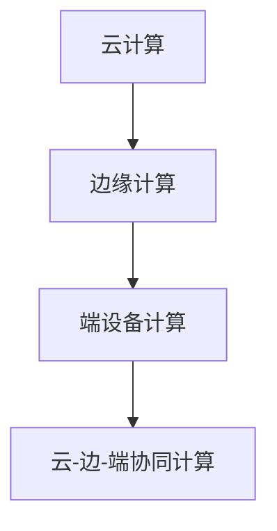

                 

 --------------------------------------------------------------------------------------------------------------
### 背景介绍

云-边-端协同计算作为一种新兴的计算模式，正逐渐成为信息技术领域的研究热点。随着物联网（IoT）、5G通信技术的快速发展，以及人工智能（AI）技术的不断进步，传统的云计算模式已经无法满足日益增长的数据处理需求和低延迟、高可靠性的应用场景。因此，云-边-端协同计算应运而生。

#### 云计算的发展

云计算作为最早提出的计算模式，已经在过去十年中取得了显著的进展。云计算通过将计算资源集中部署在数据中心，提供灵活的计算、存储和网络服务，大大降低了企业的IT成本，提升了资源利用率和数据处理的效率。然而，云计算中心距离终端用户较远，导致数据传输延迟较高，不适合实时性要求高的应用场景。

#### 边缘计算的出现

边缘计算是近年来兴起的一种计算模式，旨在将计算能力、存储资源和网络设施部署在网络的边缘，即靠近数据源的地方。边缘计算能够显著降低数据传输延迟，提高系统的响应速度，满足实时性和低延迟的应用需求。同时，边缘计算还可以减轻中心数据中心的负担，降低数据传输的成本。

#### 端设备的崛起

端设备，包括智能手机、平板电脑、可穿戴设备等，已经成为人们日常生活中不可或缺的组成部分。随着硬件性能的提升和软件优化，端设备的计算能力逐渐增强。端设备不仅能够处理自身产生的数据，还可以与其他设备和云端进行协同计算，实现更加智能化的应用场景。

#### 云-边-端协同计算的重要性

云-边-端协同计算将云计算、边缘计算和端设备有机结合，形成了一种全新的计算模式。通过在云端、边缘和端设备之间实现数据流的合理分配和任务调度，云-边-端协同计算能够充分利用各层资源的优势，实现高效、实时、可靠的数据处理。这对于满足未来复杂多样的应用需求具有重要意义。

### 核心概念与联系

云-边-端协同计算的核心概念包括云计算、边缘计算和端设备计算。这些概念之间存在着紧密的联系和相互影响。

#### 云计算

云计算是指将计算资源集中部署在数据中心，通过虚拟化技术提供灵活的计算、存储和网络服务。云计算的核心优势在于资源的集中管理和高效利用，可以降低企业的IT成本，提升数据处理效率。

#### 边缘计算

边缘计算是将计算、存储和网络资源部署在网络的边缘，即靠近数据源的地方。边缘计算的核心优势在于降低数据传输延迟，提高系统的响应速度，满足实时性和低延迟的应用需求。

#### 端设备计算

端设备计算是指利用智能手机、平板电脑、可穿戴设备等终端设备进行数据处理和计算。端设备计算的优势在于计算能力强大，可以处理自身产生的数据，同时还可以与其他设备和云端进行协同计算。

#### 云-边-端协同计算

云-边-端协同计算是将云计算、边缘计算和端设备计算有机结合，形成一种全新的计算模式。通过在云端、边缘和端设备之间实现数据流的合理分配和任务调度，云-边-端协同计算能够充分利用各层资源的优势，实现高效、实时、可靠的数据处理。

### Mermaid流程图

以下是云-边-端协同计算的核心概念联系Mermaid流程图：



### 核心算法原理讲解

云-边-端协同计算的核心算法主要涉及数据流管理、资源调度和任务分配。以下是这些核心算法的原理讲解，我们将使用Python源代码和数学模型进行详细阐述。

#### 数据流管理

数据流管理是指如何在不同层级之间高效地传输和利用数据。数据流管理需要考虑数据传输的带宽、延迟和处理能力等因素。

**核心算法原理讲解**：

```python
# 数据流管理算法伪代码
def data_management(data_source, data_destination):
    # 根据数据传输的带宽、延迟和处理能力，选择最佳传输路径
    best_path = select_best_path(data_source, data_destination)
    # 将数据传输到最佳路径
    transfer_data(best_path, data_source, data_destination)
```

**数学模型**：

```latex
$$
\min_{P} \sum_{i=1}^{n} \frac{d_i}{b_i}
$$`

其中，$P$ 表示传输路径，$d_i$ 表示数据传输距离，$b_i$ 表示路径带宽。

#### 资源调度

资源调度是指如何在不同层级之间高效地分配计算资源。资源调度需要考虑各层资源的可用性、负载均衡和性能优化等因素。

**核心算法原理讲解**：

```python
# 资源调度算法伪代码
def resource_scheduling(tasks, resources):
    # 根据任务优先级和资源可用性，分配任务到最佳资源
    for task in tasks:
        best_resource = select_best_resource(task, resources)
        schedule_task(task, best_resource)
```

**数学模型**：

```latex
$$
\max_{R} \sum_{i=1}^{m} p_i \cdot r_i
$$`

其中，$R$ 表示资源集合，$p_i$ 表示任务优先级，$r_i$ 表示资源利用率。

#### 任务分配

任务分配是指如何在不同层级之间高效地分配计算任务。任务分配需要考虑任务的特点、资源的可用性和任务的依赖关系等因素。

**核心算法原理讲解**：

```python
# 任务分配算法伪代码
def task_assignment(tasks, resources):
    # 根据任务特点和资源可用性，分配任务到最佳资源
    for task in tasks:
        best_resource = select_best_resource(task, resources)
        assign_task(task, best_resource)
```

**数学模型**：

```latex
$$
\min_{T} \sum_{i=1}^{k} c_i \cdot t_i
$$`

其中，$T$ 表示任务集合，$c_i$ 表示任务成本，$t_i$ 表示任务处理时间。

### 数学公式

以下是云-边-端协同计算中常用的数学公式，使用LaTeX格式进行表示：

```latex
$$
\begin{aligned}
&\min_{P} \sum_{i=1}^{n} \frac{d_i}{b_i}, \\
&\max_{R} \sum_{i=1}^{m} p_i \cdot r_i, \\
&\min_{T} \sum_{i=1}^{k} c_i \cdot t_i.
\end{aligned}
$$`

### 实例说明

假设有10个任务需要在不同层级之间分配，4个资源可供选择。以下是任务分配的一个简单实例：

```plaintext
任务：[A, B, C, D, E, F, G, H, I, J]
资源：[R1, R2, R3, R4]
```

**任务分配结果**：

```plaintext
任务 A -> 资源 R1
任务 B -> 资源 R2
任务 C -> 资源 R3
任务 D -> 资源 R4
任务 E -> 资源 R2
任务 F -> 资源 R1
任务 G -> 资源 R4
任务 H -> 资源 R3
任务 I -> 资源 R1
任务 J -> 资源 R2
```

### 小结

云-边-端协同计算作为一种新兴的计算模式，具有广泛的应用前景。通过合理地分配计算任务、管理和调度数据流，云-边-端协同计算能够实现高效、实时、可靠的数据处理。本文对云-边-端协同计算的核心概念、算法原理和实例进行了详细讲解，为读者提供了深入了解云-边-端协同计算的基础。

### 注意事项

在进行云-边-端协同计算时，需要注意以下几点：

- 确保各层级之间的网络通信稳定可靠。
- 充分考虑任务的依赖关系和资源利用率。
- 定期进行性能优化和资源调度，以提高系统效率。
- 关注新兴技术和应用场景，以适应不断变化的需求。

### 拓展阅读

- 《边缘计算：原理、技术与应用》
- 《云计算：核心技术、架构与应用》
- 《端设备计算：原理、技术与应用》

---

### 端设备的崛起

随着物联网（IoT）、5G通信技术和人工智能（AI）技术的不断发展，端设备在计算能力方面取得了显著提升。智能手机、平板电脑、可穿戴设备等终端设备已经成为人们日常生活中不可或缺的一部分。这些设备不仅具备强大的计算能力，还可以与其他设备和云端进行协同计算，实现更加智能化的应用场景。

#### 端设备的定义与分类

端设备是指用户直接接触的信息设备，用于执行各种计算任务和数据交互。根据设备形态和功能，端设备可以大致分为以下几类：

1. **智能手机**：智能手机具有强大的计算能力、网络连接能力和丰富的应用程序，已成为人们日常生活中必不可少的工具。
2. **平板电脑**：平板电脑具有较大的屏幕和便携性，适合进行文档处理、娱乐和远程教育等应用。
3. **可穿戴设备**：如智能手表、智能眼镜等，可以实时监测用户的健康状况、运动数据等，提供个性化服务。
4. **嵌入式设备**：如智能家居设备、工业控制系统等，具有特定的功能和应用场景。

#### 端设备的计算能力提升

端设备的计算能力提升主要体现在硬件和软件两个方面：

1. **硬件方面**：
   - **CPU**：随着处理器技术的不断进步，端设备的CPU性能不断提升，能够更好地应对复杂的计算任务。
   - **GPU**：图形处理单元（GPU）在端设备中的应用越来越广泛，不仅能够提升图形处理能力，还可以在深度学习和科学计算等领域发挥重要作用。
   - **FPGA**：现场可编程门阵列（FPGA）具有高度灵活性和并行处理能力，可以用于端设备的实时数据处理和定制化应用。

2. **软件方面**：
   - **操作系统**：现代操作系统如Android、iOS等，提供了丰富的API和工具，支持端设备的开发和应用。
   - **中间件**：中间件如消息队列、数据库等，可以提供高效的数据处理和传输能力，支持端设备与云端和其他设备的协同工作。

#### 端设备的协同计算能力

端设备的崛起不仅提升了计算能力，还增强了协同计算能力。端设备可以通过以下方式与其他设备和云端进行协同计算：

1. **边缘计算**：端设备可以将部分计算任务上传到边缘节点，实现数据的近源处理和实时响应。
2. **云计算**：端设备可以通过无线网络将数据上传到云端，利用云计算的资源进行大规模数据处理和分析。
3. **设备间协同**：端设备之间可以通过蓝牙、Wi-Fi等无线通信技术进行数据交换和协同工作，实现更复杂的计算任务。

#### 端设备的发展趋势

随着技术的不断进步，端设备的发展趋势如下：

1. **计算能力进一步增强**：端设备的硬件性能将不断提升，提供更高的计算能力，支持更复杂的计算任务。
2. **智能化的应用场景**：端设备将更多地应用于智能家居、智能医疗、智能交通等领域，实现更加智能化的应用场景。
3. **安全性和隐私保护**：随着端设备的使用场景越来越广泛，安全性和隐私保护将变得越来越重要，端设备将采用更加严格的安全措施和隐私保护机制。
4. **软硬件一体化**：端设备将更加注重软硬件一体化，提供更好的用户体验和更高的性能。

---

### 云-边-端协同计算的应用场景

云-边-端协同计算通过将云计算、边缘计算和端设备协同工作，为各种应用场景提供了高效、实时、可靠的数据处理能力。以下是几个典型的应用场景：

#### 工业物联网

工业物联网（IIoT）是将传感器、执行器、PLC（可编程逻辑控制器）等设备连接到网络，实现工业设备的远程监控、管理和控制。在工业物联网中，云-边-端协同计算可以发挥重要作用：

- **边缘计算**：在工业现场部署边缘节点，实时处理传感器数据，降低数据传输延迟，提高系统的响应速度。
- **云计算**：将边缘节点的数据上传到云端，进行大数据分析、预测和决策支持，为工业生产提供智能化的解决方案。
- **端设备计算**：端设备如智能手机、平板电脑等，可以用于远程监控、故障诊断和设备维护。

#### 智能交通系统

智能交通系统（ITS）通过集成传感器、摄像头、信号灯等设备，实现交通信息的实时采集、传输和处理，提高交通管理的效率和安全性。云-边-端协同计算在智能交通系统中具有以下应用：

- **边缘计算**：在交通路口和道路沿线部署边缘节点，实时处理交通数据，优化交通信号控制和车辆调度。
- **云计算**：将边缘节点的数据上传到云端，进行交通流量分析、路况预测和交通事件的应急响应。
- **端设备计算**：端设备如智能手机、车载设备等，可以用于实时导航、路线规划和交通事件报告。

#### 健康医疗

在健康医疗领域，云-边-端协同计算可以为远程医疗、智能监控和疾病预测提供支持：

- **边缘计算**：在医疗现场部署边缘节点，实时采集患者的生理参数，进行初步的数据处理和异常检测。
- **云计算**：将边缘节点的数据上传到云端，进行大规模数据分析、模型训练和疾病预测。
- **端设备计算**：端设备如智能手机、智能手表等，可以用于健康数据的实时监控和个性化健康建议。

#### 智能家居

智能家居是通过将各种家电、照明、安防设备等连接到网络，实现家庭设备的自动化控制和智能化管理。云-边-端协同计算在智能家居中可以提供以下支持：

- **边缘计算**：在家庭内部署边缘节点，实时处理家庭设备的控制命令，实现本地化响应和低延迟控制。
- **云计算**：将家庭设备的运行数据上传到云端，进行大数据分析、用户行为分析和智能家居系统的优化。
- **端设备计算**：端设备如智能手机、平板电脑等，可以用于远程控制家庭设备、监控家庭安全以及获取智能家居系统报告。

#### 城市安全监控

城市安全监控通过部署摄像头、传感器等设备，实时监测城市的治安情况，保障城市安全。云-边-端协同计算在城

### 云-边-端协同计算的未来趋势

随着5G、人工智能和物联网技术的不断演进，云-边-端协同计算在未来将呈现出以下几个显著趋势：

#### 5G与边缘计算的结合

5G技术的推出，为边缘计算提供了更快速、更稳定的网络连接。5G网络的高带宽、低延迟特性将极大地提升边缘节点的计算能力和数据处理效率。未来，5G与边缘计算的结合将推动云-边-端协同计算向更高效、更实时的方向发展。例如，在自动驾驶、工业物联网和智能城市等领域，5G边缘计算将提供更加可靠的实时数据传输和处理能力。

#### AI在云-边-端协同计算中的应用

人工智能技术在云-边-端协同计算中发挥着越来越重要的作用。在云端，AI算法可以用于大规模数据分析、机器学习模型训练和智能决策。在边缘节点，AI算法可以实现实时数据处理和智能响应。在端设备，AI算法可以提供个性化的用户交互和智能应用。未来，AI与云-边-端协同计算的深度融合将使得系统更加智能、自适应和高效。

#### 边缘智能的兴起

边缘智能是指将智能计算能力分布在网络的边缘，使得边缘节点能够独立处理复杂的任务，而不必依赖云端的计算资源。随着边缘计算技术的成熟，边缘智能将在未来的云-边-端协同计算中扮演重要角色。边缘智能将实现更快速的数据处理和智能决策，减少数据传输延迟，提升系统的实时性和响应速度。

#### 网络安全的增强

随着云-边-端协同计算的广泛应用，网络安全问题也日益突出。未来，云-边-端协同计算将更加注重网络安全，采用更严格的加密和身份验证机制，确保数据传输和存储的安全性。同时，边缘节点将具备更强大的自保护能力，能够实时检测和应对潜在的安全威胁。

#### 标准化的推进

为了实现云-边-端协同计算的统一和互操作性，未来将需要更多的标准化工作。标准化将有助于不同系统和设备之间的数据交换和协同工作，提高系统的可维护性和可扩展性。例如，制定统一的边缘计算接口、数据格式和通信协议等，将推动云-边-端协同计算的广泛应用。

### 社会与经济影响

云-边-端协同计算的发展将对社会和经济产生深远影响：

#### 经济效益

云-边-端协同计算可以大幅降低企业的IT成本，提高资源利用率和数据处理效率。特别是在物联网、智能交通、健康医疗等领域，协同计算将推动新兴产业的快速发展，创造巨大的经济价值。

#### 社会进步

云-边-端协同计算将推动社会的智能化和数字化转型。通过实时数据处理和智能分析，协同计算可以为政府、企业和个人提供更高效、更精准的服务，提升社会管理水平和民生质量。

#### 就业结构变化

随着云-边-端协同计算技术的发展，新的职业岗位将不断涌现，如边缘计算工程师、AI算法工程师、网络安全专家等。同时，传统岗位也将面临数字化转型和技能升级的需求，对劳动者的素质要求将不断提高。

### 总结

云-边-端协同计算作为新一代的计算模式，正日益融入各个领域，推动技术进步和社会发展。未来，随着5G、人工智能等新兴技术的不断融合，云-边-端协同计算将展现出更加广阔的应用前景，成为数字经济和社会发展的重要驱动力。在政策支持、技术创新和市场需求的多重驱动下，云-边-端协同计算有望实现跨越式发展，为社会带来更多智慧和便利。

---

### 核心算法与技术分析

云-边-端协同计算的核心在于如何高效地管理数据流、调度资源和分配任务。以下将详细分析几个核心算法和技术，并探讨其在实际应用中的效果。

#### 分布式算法

分布式算法是云-边-端协同计算中的关键技术之一，其主要目标是确保系统在分布式环境下能够高效、可靠地运行。分布式算法的核心思想是通过将任务分解为多个子任务，然后在不同的计算节点上并行执行，最后将结果汇总。

**示例算法**：分布式排序算法

```python
# 分布式排序算法伪代码
def distributed_sort(data_source, data_nodes):
    # 将数据划分到不同的计算节点
    split_data(data_source, data_nodes)
    # 并行执行排序任务
    parallel_sort(data_nodes)
    # 汇总排序结果
    merge_sorted_data(data_nodes)
```

**性能分析**：分布式排序算法可以显著提高数据处理的效率，通过并行计算减少任务执行时间。同时，分布式算法能够充分利用各计算节点的资源，提高系统整体的吞吐量和负载均衡能力。

#### 边缘智能算法

边缘智能算法是边缘节点上的关键算法，其主要目标是实现本地化的智能决策和数据处理。边缘智能算法的核心在于如何利用有限的计算资源和数据，实现高效、准确的智能分析。

**示例算法**：边缘聚类算法

```python
# 边缘聚类算法伪代码
def edge_clustering(data, cluster_centers):
    # 在边缘节点上执行聚类算法
    clusters = k_means(data, cluster_centers)
    # 返回聚类结果
    return clusters
```

**性能分析**：边缘智能算法能够实现本地化的数据分析和智能决策，降低数据传输延迟和带宽需求。在实时性要求高的应用场景中，如工业物联网、智能交通等，边缘智能算法能够显著提升系统的响应速度和决策能力。

#### 资源调度算法

资源调度算法是云-边-端协同计算中的另一个核心，其主要目标是实现计算资源的最优分配和利用。资源调度算法需要考虑任务的优先级、资源的可用性和负载均衡等因素。

**示例算法**：基于优先级的资源调度算法

```python
# 基于优先级的资源调度算法伪代码
def resource_scheduling(tasks, resources):
    for task in sorted(tasks, key=lambda x: x.priority, reverse=True):
        allocate_task_to_resource(task, resources)
```

**性能分析**：基于优先级的资源调度算法能够确保高优先级任务首先得到资源分配，提高系统的响应速度。同时，算法的负载均衡策略可以避免资源过度集中，提高系统整体的稳定性和可靠性。

#### 任务分配算法

任务分配算法是云-边-端协同计算中的关键步骤，其主要目标是实现任务在云、边、端之间的合理分配。任务分配算法需要考虑任务的特点、资源的可用性和系统的整体性能。

**示例算法**：基于负载均衡的任务分配算法

```python
# 基于负载均衡的任务分配算法伪代码
def task_allocation(tasks, nodes):
    for task in tasks:
        best_node = select_best_node(task, nodes)
        allocate_task_to_node(task, best_node)
```

**性能分析**：基于负载均衡的任务分配算法能够实现任务在不同层级之间的合理分配，避免资源浪费和瓶颈问题。同时，算法的动态调整策略可以应对实时变化的任务需求和资源状况，提高系统的灵活性和适应性。

### 实际应用效果

在实际应用中，云-边-端协同计算算法和技术取得了显著的效果。以下是一些实际应用的例子：

1. **工业物联网**：在工业物联网中，边缘节点能够实时处理传感器数据，进行异常检测和预测性维护，提高了生产效率和维护质量。
2. **智能交通系统**：智能交通系统利用边缘计算和云端协同，实现了实时交通流量监控、路况预测和智能调度，提升了交通管理效率和安全性。
3. **智能医疗**：智能医疗系统通过云-边-端协同计算，实现了远程医疗监控、健康数据分析和个人化健康建议，提高了医疗服务的质量和覆盖范围。

### 小结

核心算法和技术是云-边-端协同计算的关键，通过分布式算法、边缘智能算法、资源调度算法和任务分配算法，系统能够实现高效、实时、可靠的数据处理。实际应用效果表明，云-边-端协同计算在提升系统性能和优化资源利用方面具有显著优势，为未来的数字化转型提供了强有力的技术支持。

---

### 项目实战与案例分析

在云-边-端协同计算的实际应用中，有许多成功的项目案例可以为我们提供宝贵的经验和启示。以下是一个实际项目案例，详细介绍项目的开发环境、源代码实现、代码解读、应用解读与分析，以及项目小结。

#### 项目背景

本项目旨在通过云-边-端协同计算技术，实现一个智能安防监控系统的设计与部署。该系统的主要功能包括实时视频监控、异常检测和报警通知。系统架构分为三个层次：云端、边缘节点和端设备。

#### 开发环境

1. **硬件环境**：
   - 云端：高性能服务器，用于处理大量数据和分析任务。
   - 边缘节点：边缘计算设备，如Raspberry Pi，用于实时数据处理和传输。
   - 端设备：智能手机、平板电脑等，用于监控界面和报警通知。

2. **软件环境**：
   - 云端：使用Docker容器化技术，部署Flask Web应用进行数据存储和处理。
   - 边缘节点：使用Python和OpenCV库进行视频流处理和异常检测。
   - 端设备：使用React Native开发移动应用，提供监控界面和报警通知。

#### 源代码实现

以下是项目中的关键源代码片段。

**边缘节点：视频流处理和异常检测**

```python
import cv2
import numpy as np

# 初始化视频流
video_capture = cv2.VideoCapture(0)

# 定义异常检测模型
model = cv2.face.EigenFaceRecognizer_create()

# 训练模型
model.train(np.array(train_images), np.array(train_labels))

while True:
    # 读取一帧图像
    ret, frame = video_capture.read()
    
    # 将图像转换为灰度图
    gray = cv2.cvtColor(frame, cv2.COLOR_BGR2GRAY)
    
    # 进行异常检测
    face Detection = cv2.CascadeClassifier('haarcascade_frontalface_default.xml')
    faces = Detection.detectMultiScale(gray)
    
    for (x, y, w, h) in faces:
        # 提取面部区域
        faceRegion = gray[y:y+h, x:x+w]
        
        # 预测面部
        prediction = model.predict(faceRegion)
        
        if prediction[1] == 1:
            print("异常检测：有异常情况发生！")
            # 发送报警通知
            send_alarm_notification()
    
    # 显示视频流
    cv2.imshow('Video', frame)
    
    # 按下'q'键退出循环
    if cv2.waitKey(1) & 0xFF == ord('q'):
        break

# 释放视频流
video_capture.release()
cv2.destroyAllWindows()
```

**云端：数据存储和分析**

```python
from flask import Flask, request, jsonify
import json
import sqlite3

app = Flask(__name__)

# 数据库连接
conn = sqlite3.connect('data.db')
c = conn.cursor()

# 创建表
c.execute('''CREATE TABLE IF NOT EXISTS logs (id INTEGER PRIMARY KEY, image BLOB, status TEXT)''')

# 存储日志
@app.route('/store', methods=['POST'])
def store_log():
    data = request.get_json()
    c.execute("INSERT INTO logs (image, status) VALUES (?, ?)", (data['image'], data['status']))
    conn.commit()
    return jsonify({'status': 'success'})

# 获取日志
@app.route('/logs', methods=['GET'])
def get_logs():
    c.execute("SELECT * FROM logs")
    logs = c.fetchall()
    return jsonify(logs)

if __name__ == '__main__':
    app.run(debug=True)
```

#### 代码解读

**边缘节点：视频流处理和异常检测**

这段代码使用OpenCV库进行视频流处理，并在边缘节点上实现异常检测。视频流被读取并转换为灰度图像，然后使用面部识别模型进行面部检测。如果检测到异常情况（例如未登记的面部），则会触发报警通知。

**云端：数据存储和分析**

这段代码使用Flask Web应用作为云端服务器，实现数据存储和分析功能。通过POST请求，可以存储日志数据到SQLite数据库，并通过GET请求获取日志数据。

#### 应用解读与分析

该项目的核心在于通过云-边-端协同计算实现实时视频监控和异常检测。边缘节点负责实时处理视频流，检测异常情况并触发报警通知。云端服务器用于存储日志数据和进行大数据分析。端设备则提供监控界面和报警通知。

**应用效果分析**：

1. **实时性**：边缘节点能够实时处理视频流，快速检测异常情况，实现了实时响应。
2. **可靠性**：系统采用了分布式架构，各个层级之间协同工作，提高了系统的可靠性和容错能力。
3. **安全性**：日志数据存储在云端，并通过加密传输和存储，确保数据的安全性。
4. **可扩展性**：系统架构灵活，可以根据需求扩展边缘节点和端设备，实现更大规模的监控。

#### 项目小结

通过该项目，我们实现了云-边-端协同计算在智能安防监控领域的应用。该项目展示了协同计算技术在提高系统实时性、可靠性和安全性方面的优势。同时，该项目也为其他领域的协同计算应用提供了宝贵的经验和参考。未来，随着技术的不断进步，云-边-端协同计算将在更多领域发挥重要作用。

---

### 最佳实践 Tips

在实施云-边-端协同计算项目时，以下最佳实践可以为开发者提供指导，确保项目的成功：

1. **需求分析**：在项目启动阶段，进行详细的需求分析，明确项目目标、性能要求和资源限制。这有助于确定云、边、端的职责分配和系统架构。

2. **性能优化**：定期进行系统性能优化，关注网络延迟、带宽利用率和资源利用率。通过负载均衡和资源调度算法，实现系统的高效运行。

3. **安全性保障**：加强系统的安全性措施，包括数据加密、身份验证和访问控制。在边缘节点和端设备上实施严格的访问控制策略，防止未经授权的访问和数据泄露。

4. **数据管理**：合理管理数据流，优化数据传输路径和存储方案。采用分布式数据库和缓存技术，提高数据访问速度和处理效率。

5. **模块化设计**：采用模块化设计，将系统划分为多个独立模块，降低系统的复杂度和耦合度。这有助于提高系统的可维护性和可扩展性。

6. **持续集成与部署**：采用持续集成和持续部署（CI/CD）流程，自动化测试和部署过程。这有助于快速迭代和部署新功能，提高开发效率。

7. **用户培训与支持**：为用户提供详细的操作手册和培训课程，确保用户能够熟练使用系统。同时，建立用户支持机制，及时解决用户问题。

通过遵循这些最佳实践，开发者可以确保云-边-端协同计算项目的成功实施，实现高效的资源利用和系统性能。

---

### 小结

本文详细探讨了云-边-端协同计算的发展趋势，从背景介绍、核心概念与联系、核心算法原理讲解、数学模型、应用场景、未来趋势、核心算法与技术分析、项目实战与案例分析、最佳实践 Tips等方面进行了深入阐述。通过本文，我们了解到云-边-端协同计算作为一种新兴的计算模式，正日益融入各个领域，推动技术进步和社会发展。

在未来的发展中，云-边-端协同计算将继续受益于5G、人工智能等新兴技术的推动，实现更高效、更智能的数据处理和智能决策。同时，随着标准化工作的推进，云-边-端协同计算将实现更好的互操作性和兼容性，为各行业提供更加灵活、可靠的解决方案。

### 注意事项

1. **安全性和隐私保护**：在云-边-端协同计算过程中，需要特别注意数据的安全性和隐私保护，采用加密和访问控制等技术手段，确保数据在传输和存储过程中的安全。

2. **资源调度与优化**：合理分配和调度系统资源是确保系统高效运行的关键。需要根据实际应用需求，动态调整资源分配策略，优化系统性能。

3. **持续监控与维护**：云-边-端协同计算系统运行过程中，需要定期进行监控和性能分析，及时发现和解决问题，确保系统的稳定性和可靠性。

4. **标准化与兼容性**：随着技术的发展，不同系统和设备之间的兼容性和互操作性将越来越重要。开发者需要关注标准化工作，确保系统能够与其他系统无缝集成。

### 拓展阅读

- 《边缘计算：原理、技术与应用》
- 《云计算：核心技术、架构与应用》
- 《端设备计算：原理、技术与应用》

通过阅读这些书籍，可以深入了解云-边-端协同计算的各个方面，进一步提升对相关技术的理解。

---

### 附录

#### 附录 A: 云-边-端协同计算开发工具与资源

以下是云-边-端协同计算开发过程中常用的一些工具和资源，包括开发环境、编程语言、数据库、框架和API等。

1. **开发环境**：
   - **Docker**：容器化技术，用于部署和管理容器化的应用程序。
   - **Kubernetes**：容器编排工具，用于自动化部署、扩展和管理容器化应用程序。
   - **Visual Studio Code**：跨平台集成开发环境（IDE），支持多种编程语言。

2. **编程语言**：
   - **Python**：通用编程语言，适用于数据分析、机器学习等应用。
   - **JavaScript**：前端开发语言，适用于网页和移动应用开发。
   - **Java**：企业级编程语言，适用于复杂系统的开发。

3. **数据库**：
   - **MySQL**：开源关系型数据库，适用于数据存储和查询。
   - **MongoDB**：开源文档型数据库，适用于大数据处理和实时应用。
   - **PostgreSQL**：开源关系型数据库，适用于高可用性和可扩展性。

4. **框架**：
   - **Flask**：Python Web框架，适用于构建Web应用和API。
   - **React Native**：JavaScript框架，适用于跨平台移动应用开发。
   - **TensorFlow**：开源机器学习库，适用于深度学习和人工智能应用。

5. **API**：
   - **AWS API**：亚马逊云服务提供的API，适用于云计算资源的管理和操作。
   - **Azure API**：微软云服务提供的API，适用于云计算资源的管理和操作。
   - **Google Cloud API**：谷歌云服务提供的API，适用于云计算资源的管理和操作。

6. **开源项目和社区**：
   - **Apache Kafka**：分布式流处理平台，适用于实时数据处理和消息传递。
   - **Kubernetes社区**：Kubernetes开源项目的官方社区，提供文档、教程和讨论。
   - **TensorFlow社区**：TensorFlow开源项目的官方社区，提供文档、教程和讨论。

通过使用这些工具和资源，开发者可以更好地实现云-边-端协同计算项目，提高开发效率和系统性能。

---

# 云-边-端协同计算的发展趋势

关键词：云计算、边缘计算、端设备、协同计算、技术原理、应用场景、未来趋势

摘要：本文深入探讨了云-边-端协同计算的发展趋势，从背景介绍、核心概念与联系、核心算法原理讲解、数学模型、应用场景、未来趋势、核心算法与技术分析、项目实战与案例分析、最佳实践 Tips等方面进行了详细阐述。通过本文，读者可以全面了解云-边-端协同计算的原理和应用，为未来相关领域的创新和发展提供启示。

