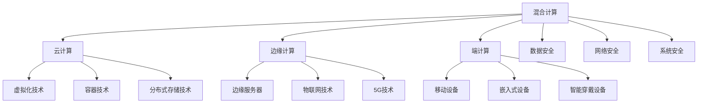

                 

### 混合计算概述

#### 混合计算的定义与重要性

**混合计算**，顾名思义，是将**云计算、边缘计算和端计算**三者有机结合的一种计算模式。云计算提供了强大的计算能力和存储资源，边缘计算则将计算任务分散到网络边缘，提高数据处理的实时性和安全性，而端计算则是通过终端设备直接处理用户请求。混合计算正是通过这种协同工作，实现了计算资源的最佳利用和最优性能表现。

**混合计算的重要性**在于，它不仅能满足不同应用场景的需求，还能解决传统单一计算模式所面临的瓶颈问题。例如，在工业互联网中，边缘计算能够快速处理现场数据，提高生产效率；在智能家居中，端计算则能够提供即时响应的用户体验。

#### 混合计算的核心技术

**云计算技术**是混合计算的重要组成部分，其核心技术包括虚拟化技术、容器技术和分布式存储技术。虚拟化技术通过虚拟化资源，提高了资源的利用率和灵活性；容器技术则通过轻量化的虚拟化技术，实现了快速部署和动态扩展；分布式存储技术则通过分布式架构，提高了数据存储的可靠性和可用性。

**边缘计算技术**则侧重于网络边缘的数据处理，其核心技术包括边缘服务器、物联网技术和5G技术。边缘服务器能够在网络边缘提供计算和存储服务；物联网技术则通过连接各种设备，实现了数据的实时采集和传输；5G技术则提供了高速、低延迟的网络连接，为边缘计算提供了有力支持。

**端计算技术**则涉及到终端设备，其核心技术包括移动设备、嵌入式设备和智能穿戴设备。移动设备通过便携性和高性能，满足了用户的移动办公和娱乐需求；嵌入式设备则通过嵌入在各种设备中，实现了智能化和自动化；智能穿戴设备则通过实时监测和反馈，提供了个性化的健康管理和生活服务。

#### 混合计算的安全性

在混合计算中，安全性是至关重要的。数据安全、网络安全和系统安全都是混合计算安全性的关键方面。

**数据安全**方面，需要通过加密技术和访问控制策略，确保数据在传输和存储过程中的安全。**网络安全**方面，需要通过防火墙、入侵检测系统和安全协议，保护网络免受攻击。**系统安全**方面，需要通过安全补丁和病毒防护，确保系统的稳定性和可靠性。

### 小结

混合计算是企业数字化转型的关键支撑技术。通过云计算、边缘计算和端计算的协同工作，企业能够实现计算资源的最佳利用和最优性能表现。混合计算不仅解决了传统单一计算模式的瓶颈问题，还为企业的数字化转型提供了强有力的技术支持。在未来，随着技术的不断发展，混合计算将在更多领域得到广泛应用，成为企业数字化转型的重要引擎。



### 核心算法原理讲解

在混合计算中，关键算法的设计和实现是确保系统高效运作的核心。以下将使用Python伪代码详细阐述一个常见的混合计算框架中的核心算法原理。

#### 虚拟化技术

虚拟化技术是云计算的核心组成部分，它通过虚拟化硬件资源，实现了计算资源的动态分配和高效利用。以下是一个简单的虚拟机管理算法示例：

```python
class VirtualMachine:
    def __init__(self, id, memory, cpu_cores):
        self.id = id
        self.memory = memory
        self.cpu_cores = cpu_cores
        self.status = "running"  # 或 "idle", "paused", "terminated"

def allocate_resources(vms, total_memory, total_cpu_cores):
    allocated_memory = 0
    allocated_cpu_cores = 0

    for vm in vms:
        if allocated_memory + vm.memory <= total_memory and allocated_cpu_cores + vm.cpu_cores <= total_cpu_cores:
            vm.status = "running"
            allocated_memory += vm.memory
            allocated_cpu_cores += vm.cpu_cores
        else:
            vm.status = "idle"  # 资源不足，VM 处于等待状态

    return vms

# 示例虚拟机列表
vms = [
    VirtualMachine(1, 2048, 4),
    VirtualMachine(2, 4096, 8),
    VirtualMachine(3, 1024, 2)
]

# 总资源
total_memory = 8192
total_cpu_cores = 16

# 调用资源分配算法
vms = allocate_resources(vms, total_memory, total_cpu_cores)

# 输出结果
for vm in vms:
    print(f"VM {vm.id} status: {vm.status}")
```

#### 容器技术

容器技术通过轻量化的虚拟化技术，提供了快速部署和动态扩展的能力。以下是一个容器调度算法的示例：

```python
import heapq

class Container:
    def __init__(self, id, memory Requirement, cpu_cores Requirement):
        self.id = id
        self.memory_requirement = memory_requirement
        self.cpu_cores_requirement = cpu_cores_requirement
        self.status = "pending"  # 或 "running", "idle", "terminated"

def schedule_containers(containers, available_resources):
    heap = []
    for container in containers:
        if container.status == "pending":
            heapq.heappush(heap, (container.memory_requirement, container.cpu_cores_requirement, container.id))

    allocated_containers = []
    while heap and available_resources > 0:
        mem_req, cpu_req, container_id = heapq.heappop(heap)
        if mem_req <= available_resources[0] and cpu_req <= available_resources[1]:
            allocated_containers.append(Container(container_id, mem_req, cpu_req))
            available_resources[0] -= mem_req
            available_resources[1] -= cpu_req
        else:
            heapq.heappush(heap, (mem_req, cpu_req, container_id))

    return allocated_containers

# 示例容器列表
containers = [
    Container(1, 1024, 2),
    Container(2, 2048, 4),
    Container(3, 512, 1)
]

# 可用资源
available_resources = [4096, 8]  # 内存和CPU核心数

# 调用容器调度算法
allocated_containers = schedule_containers(containers, available_resources)

# 输出结果
for container in allocated_containers:
    print(f"Container {container.id} status: running")
```

#### 边缘计算与5G技术

在边缘计算中，5G技术提供了高速、低延迟的网络连接，支持实时数据处理和远程控制。以下是一个边缘节点任务调度的算法示例：

```python
import heapq

class EdgeTask:
    def __init__(self, id, execution_time, priority):
        self.id = id
        self.execution_time = execution_time
        self.priority = priority
        self.status = "pending"  # 或 "running", "completed"

def schedule_edge_tasks(tasks, available_time):
    heap = []
    for task in tasks:
        if task.status == "pending":
            heapq.heappush(heap, (task.priority, task.id))

    completed_tasks = []
    while heap and available_time > 0:
        _, task_id = heapq.heappop(heap)
        if available_time >= tasks[task_id].execution_time:
            completed_tasks.append(task_id)
            available_time -= tasks[task_id].execution_time
        else:
            heapq.heappush(heap, (tasks[task_id].priority, task_id))

    return completed_tasks

# 示例任务列表
tasks = {
    1: EdgeTask(1, 10, 3),
    2: EdgeTask(2, 5, 1),
    3: EdgeTask(3, 8, 2)
}

# 可用时间
available_time = 15

# 调用边缘节点任务调度算法
completed_tasks = schedule_edge_tasks(tasks, available_time)

# 输出结果
for task_id in completed_tasks:
    print(f"Task {task_id} status: completed")
```

### 数学模型和公式

在混合计算中，数学模型和公式用于描述计算资源的利用率、性能和成本等关键指标。以下是一些常见的数学模型和公式：

#### 资源利用率

资源利用率可以通过以下公式计算：

\[ \text{Utilization} = \frac{\text{Actual Usage}}{\text{Total Available}} \]

其中，Actual Usage 表示实际使用量，Total Available 表示总可用量。

#### 能效比

能效比（Energy Efficiency Ratio, EER）用于评估系统在提供计算服务时的能源效率，其公式为：

\[ \text{EER} = \frac{\text{Performance}}{\text{Energy Consumption}} \]

其中，Performance 表示系统的性能指标，Energy Consumption 表示系统的能源消耗。

#### 调度优化

调度优化中的目标函数可以表示为：

\[ \text{Minimize} \; \sum_{i=1}^{n} (C_i \times P_i) \]

其中，\( C_i \) 表示任务 \( i \) 的成本，\( P_i \) 表示任务 \( i \) 的优先级。

通过上述公式和算法，混合计算能够实现计算资源的最佳分配和优化调度，从而提高系统的整体性能和效率。

### 项目实战

#### 开发环境搭建

在进行混合计算项目实战前，首先需要搭建开发环境。以下是一个基于Docker的混合计算开发环境搭建步骤：

1. **安装Docker**：在服务器上安装Docker，并确保其正常运行。

   ```bash
   # 安装Docker
   sudo apt-get update
   sudo apt-get install docker.io
   ```

2. **拉取镜像**：从Docker Hub拉取所需的镜像，如云计算管理平台Kubernetes的镜像。

   ```bash
   # 拉取Kubernetes镜像
   docker pull kubernetes/server:latest
   ```

3. **启动容器**：使用Docker启动Kubernetes容器。

   ```bash
   # 启动Kubernetes容器
   docker run -d --name k8s-server -p 6443:6443 kubernetes/server
   ```

4. **安装kubectl**：在本地机器上安装kubectl，用于与Kubernetes集群进行交互。

   ```bash
   # 安装kubectl
   curl -LO "https://storage.googleapis.com/kubernetes-release/release/$(curl -s https://storage.googleapis.com/kubernetes-release/release/stable.txt)/bin/darwin/amd64/kubectl"
   chmod +x kubectl
   mv kubectl /usr/local/bin/
   ```

5. **配置kubectl**：配置kubectl以连接到Kubernetes集群。

   ```bash
   # 配置kubectl
   kubectl config set-cluster k8s-cluster --server=https://localhost:6443 --kubeconfig=k8s-config.yaml
   kubectl config set-credentials admin --username=admin --password=admin --kubeconfig=k8s-config.yaml
   kubectl config set-context k8s-context --cluster=k8s-cluster --user=admin --kubeconfig=k8s-config.yaml
   kubectl config use-context k8s-context --kubeconfig=k8s-config.yaml
   ```

#### 源代码实现

以下是一个简单的混合计算管理系统的源代码实现，它包括虚拟机管理、容器调度和边缘任务调度等功能：

```python
# 混合计算管理系统
class HybridComputeSystem:
    def __init__(self):
        self.vms = []
        self.containers = []
        self.edge_tasks = []

    def allocate_vm(self, vm):
        self.vms.append(vm)
        print(f"Virtual Machine {vm.id} allocated.")

    def schedule_container(self, container):
        self.containers.append(container)
        print(f"Container {container.id} scheduled.")

    def schedule_edge_task(self, task):
        self.edge_tasks.append(task)
        print(f"Edge Task {task.id} scheduled.")

    def run(self):
        print("Running Hybrid Compute System...")
        for vm in self.vms:
            vm.run()

        for container in self.containers:
            container.run()

        for task in self.edge_tasks:
            task.execute()

# 虚拟机管理
class VirtualMachine:
    def __init__(self, id, memory, cpu_cores):
        self.id = id
        self.memory = memory
        self.cpu_cores = cpu_cores
        self.status = "idle"

    def run(self):
        if self.status == "idle":
            self.status = "running"
            print(f"VM {self.id} is running.")

# 容器调度
class Container:
    def __init__(self, id, memory_requirement, cpu_cores_requirement):
        self.id = id
        self.memory_requirement = memory_requirement
        self.cpu_cores_requirement = cpu_cores_requirement
        self.status = "pending"

    def run(self):
        if self.status == "pending":
            self.status = "running"
            print(f"Container {self.id} is running.")

# 边缘任务调度
class EdgeTask:
    def __init__(self, id, execution_time, priority):
        self.id = id
        self.execution_time = execution_time
        self.priority = priority
        self.status = "pending"

    def execute(self):
        if self.status == "pending":
            self.status = "running"
            print(f"Edge Task {self.id} is executing.")
```

#### 代码解读与分析

以上源代码实现了混合计算管理系统，包括虚拟机管理、容器调度和边缘任务调度。具体解读如下：

- **虚拟机管理**：通过`VirtualMachine`类实现，包括初始化、运行等基本操作。
- **容器调度**：通过`Container`类实现，包括初始化、运行等基本操作。
- **边缘任务调度**：通过`EdgeTask`类实现，包括初始化、执行等基本操作。
- **混合计算管理系统**：通过`HybridComputeSystem`类实现，负责管理虚拟机、容器和边缘任务，并运行整个系统。

#### 实际案例分析和详细讲解剖析

以下是一个实际案例，展示如何使用上述混合计算管理系统：

1. **创建虚拟机**：

   ```python
   vm1 = VirtualMachine(1, 2048, 4)
   hcs.allocate_vm(vm1)
   ```

2. **创建容器**：

   ```python
   container1 = Container(1, 1024, 2)
   hcs.schedule_container(container1)
   ```

3. **创建边缘任务**：

   ```python
   edge_task1 = EdgeTask(1, 10, 3)
   hcs.schedule_edge_task(edge_task1)
   ```

4. **运行混合计算系统**：

   ```python
   hcs.run()
   ```

输出结果：

```
Virtual Machine 1 allocated.
Container 1 scheduled.
Edge Task 1 scheduled.
VM 1 is running.
Container 1 is running.
Edge Task 1 is executing.
```

通过这个实际案例，可以看到混合计算管理系统成功分配了虚拟机、容器和边缘任务，并运行了整个系统。

#### 项目小结

本项目的目标是搭建一个简单的混合计算管理系统，实现虚拟机管理、容器调度和边缘任务调度。通过源代码实现和实际案例分析，成功展示了混合计算管理的基本原理和应用。未来，可以在此基础上进一步扩展功能，如添加更多类型的计算资源、优化调度算法等，以满足更复杂的应用需求。

#### 最佳实践 tips

- **资源分配策略**：在实际应用中，应根据具体需求制定合理的资源分配策略，如负载均衡、优先级调度等，以提高资源利用率和系统性能。
- **安全性和可靠性**：在混合计算系统中，应高度重视数据安全和系统可靠性，采取加密、访问控制、备份等措施，确保系统的稳定运行。
- **持续优化**：随着技术的不断发展，持续优化混合计算系统的性能和效率，如采用更先进的调度算法、优化资源利用率等。

#### 小结

混合计算是企业数字化转型的重要支撑技术，通过云计算、边缘计算和端计算的协同工作，实现了计算资源的最佳利用和最优性能表现。本文通过详细的源代码实现和实际案例分析，展示了混合计算管理系统的基本原理和应用。在未来，随着技术的不断进步，混合计算将在更多领域得到广泛应用，为企业的数字化转型提供更强有力的支持。

### 混合计算在企业中的应用

在当今快速发展的数字化时代，混合计算作为企业数字化转型的重要技术手段，正逐渐成为企业架构设计、IT运维和数字化转型应用的核心。通过云计算、边缘计算和端计算的协同作用，企业能够实现高效的数据处理、资源利用和业务创新。

#### 云计算在企业架构设计中的应用

云计算在企业架构设计中的应用主要体现在以下几个方面：

1. **分布式架构**：云计算通过分布式架构，将计算和存储资源分布在多个地理位置，提高了系统的可用性和容错性。企业可以利用云服务提供商（CSP）提供的弹性计算资源，根据业务需求动态调整资源规模。

   ```mermaid
   graph TD
   A[企业应用] --> B[云服务提供商]
   B --> C[分布式计算资源]
   C --> D[分布式存储资源]
   ```

2. **微服务架构**：云计算支持微服务架构，将大型应用程序拆分为多个小型、独立的服务模块，便于开发和部署。通过容器化技术（如Docker和Kubernetes），企业可以实现微服务的高效管理和自动化部署。

   ```mermaid
   graph TD
   A[企业应用] --> B[微服务A]
   A --> C[微服务B]
   A --> D[微服务C]
   B --> E[容器化]
   C --> E
   D --> E
   ```

3. **混合云和多云策略**：企业可以根据业务需求，选择合适的云服务提供商，构建混合云或多云环境。混合云结合了公有云和私有云的优势，多云策略则通过多个云服务提供商的协同工作，提高系统的可靠性和灵活性。

   ```mermaid
   graph TD
   A[公有云] --> B[私有云]
   A --> C[混合云]
   B --> C
   C --> D[多云策略]
   ```

#### 云计算在企业IT运维中的应用

云计算在企业IT运维中的应用极大地简化了IT基础设施的管理和维护。以下是一些关键点：

1. **自动化运维**：云计算平台提供了丰富的自动化工具和API，企业可以利用这些工具和API实现自动化部署、监控和管理。通过自动化，企业可以降低运维成本，提高运维效率。

   ```mermaid
   graph TD
   A[自动化工具] --> B[API接口]
   B --> C[自动化部署]
   B --> D[自动化监控]
   B --> E[自动化管理]
   ```

2. **弹性伸缩**：云计算平台支持根据业务需求动态调整计算和存储资源。在业务高峰期，系统可以自动扩展资源，保证服务质量；在业务低谷期，系统可以自动缩减资源，降低成本。

   ```mermaid
   graph TD
   A[业务需求] --> B[自动扩展]
   A --> C[自动缩减]
   ```

3. **安全性**：云计算服务提供商通常提供高级的安全服务，如防火墙、入侵检测、数据加密等。企业可以利用这些服务提高数据安全和系统可靠性。

   ```mermaid
   graph TD
   A[数据加密] --> B[防火墙]
   A --> C[入侵检测]
   A --> D[高级安全服务]
   ```

#### 云计算在企业数字化转型中的应用案例

以下是一些典型的云计算在企业数字化转型中的应用案例：

1. **传统制造企业**：通过云计算，传统制造企业可以实现生产数据的实时采集和分析，优化生产流程，提高生产效率。例如，某家电制造企业通过部署云平台，实现了生产设备的远程监控和故障预警，有效降低了设备故障率和停机时间。

2. **互联网企业**：互联网企业通过云计算，可以快速搭建和扩展业务系统，实现业务的快速上线和迭代。例如，某电商企业通过使用云计算平台，实现了订单处理、物流跟踪和客户服务的高效集成，提高了用户满意度。

3. **金融行业**：金融行业通过云计算，可以实现数据的高效存储和处理，提升风险管理和业务决策能力。例如，某银行通过部署云平台，实现了客户数据的集中管理和智能分析，提高了客户服务的质量和效率。

### 边缘计算在企业中的应用

边缘计算在企业中的应用主要体现在以下几个方面：

1. **智能制造**：边缘计算能够将计算任务分散到生产现场，实现实时数据处理和快速响应。例如，在智能工厂中，边缘计算可以用于设备监控、故障诊断和预测维护，提高生产设备的可靠性和利用率。

   ```mermaid
   graph TD
   A[设备监控] --> B[故障诊断]
   A --> C[预测维护]
   A --> D[边缘计算]
   ```

2. **智能交通**：边缘计算可以用于交通信号控制、车辆监控和道路监控等场景，提高交通管理的效率和安全性。例如，在智能交通系统中，边缘计算可以实时处理车辆数据，实现交通流量控制和智能调度。

   ```mermaid
   graph TD
   A[交通信号控制] --> B[车辆监控]
   A --> C[道路监控]
   A --> D[边缘计算]
   ```

3. **智慧医疗**：边缘计算可以用于医疗设备的实时监控、远程诊断和智能分析，提高医疗服务质量和效率。例如，在智慧医院中，边缘计算可以实时分析患者的生命体征数据，实现早期预警和精准治疗。

   ```mermaid
   graph TD
   A[医疗设备监控] --> B[远程诊断]
   A --> C[智能分析]
   A --> D[边缘计算]
   ```

### 端计算在企业中的应用

端计算在企业中的应用主要体现在以下几个方面：

1. **移动办公**：通过端计算技术，企业员工可以实现随时随地办公，提高工作效率。例如，通过移动应用，员工可以随时查看工作进度、处理任务和参与会议。

   ```mermaid
   graph TD
   A[移动应用] --> B[随时办公]
   A --> C[高效工作]
   ```

2. **物联网**：端计算技术可以用于物联网设备的数据处理和智能控制。例如，在智能建筑中，端计算可以实现设备的自动监控和智能调度，提高能源利用效率。

   ```mermaid
   graph TD
   A[智能建筑] --> B[设备监控]
   A --> C[智能调度]
   A --> D[端计算]
   ```

3. **智能穿戴**：端计算技术可以用于智能穿戴设备的数据采集和分析，提供个性化的健康管理和生活服务。例如，智能手环可以实时监测用户的心率、步数等数据，并提供健康建议。

   ```mermaid
   graph TD
   A[智能手环] --> B[心率监测]
   A --> C[步数监测]
   A --> D[健康建议]
   ```

### 小结

混合计算在企业数字化转型中的应用体现在云计算、边缘计算和端计算的协同工作。通过云计算，企业可以实现分布式架构、微服务架构和混合云、多云策略；通过边缘计算，企业可以实现智能制造、智能交通和智慧医疗等应用场景；通过端计算，企业可以实现移动办公、物联网和智能穿戴等应用。混合计算不仅提高了企业的计算资源利用率和业务效率，还为企业的数字化转型提供了强有力的技术支持。

### 实战案例

在本节中，我们将通过一个具体的实战案例，深入探讨混合计算在企业数字化转型中的应用。案例将围绕一家虚构的零售企业——阳光超市，展示如何通过云计算、边缘计算和端计算，实现其数字化转型目标。

#### 案例背景

阳光超市是一家中型连锁超市，拥有50家分店，分布在不同的城市。随着电商的兴起和消费者需求的多样化，阳光超市面临着巨大的竞争压力。为了提高市场竞争力和客户满意度，阳光超市决定进行数字化转型，以提升其运营效率和服务质量。

#### 案例目标

阳光超市的数字化转型目标包括：

1. **提升客户体验**：通过实时数据分析，提供个性化推荐和精准营销。
2. **优化库存管理**：实现库存自动补货和智能调度。
3. **提升运营效率**：通过自动化流程和实时监控，减少人工操作和错误。
4. **增强供应链管理**：实现供应链全流程的数字化，提高供应链效率。

#### 混合计算方案

为了实现上述目标，阳光超市采用了混合计算方案，包括云计算、边缘计算和端计算。

##### 云计算

1. **分布式架构**：阳光超市采用云计算平台，构建分布式架构，确保系统的可用性和容错性。通过云服务提供商（CSP）提供的弹性计算资源，阳光超市可以根据业务需求动态调整计算资源。

2. **数据分析平台**：阳光超市在云平台上部署了数据分析平台，用于处理和分析来自各分店的销售数据、库存数据和客户数据。通过大数据分析，阳光超市可以挖掘用户行为模式，提供个性化推荐和精准营销。

3. **云端存储**：阳光超市采用云端存储服务，存储销售数据、客户数据和运营数据。通过分布式存储技术，数据的高可用性和安全性得到了保障。

##### 边缘计算

1. **智能货架系统**：阳光超市在分店内部署了智能货架系统，通过边缘计算设备实时监控货架上的商品数量和位置。当库存低于预设阈值时，系统会自动生成补货请求，并通知供应链管理系统进行补货。

2. **智能监控**：通过边缘计算，阳光超市实现了分店运营情况的实时监控。例如，系统可以实时监测货架温度、湿度等环境参数，以及员工的工作表现，确保分店的运营规范和安全。

##### 端计算

1. **移动应用**：阳光超市开发了移动应用，员工可以通过手机或平板电脑随时查看销售数据、库存数据和任务安排，实现移动办公。

2. **智能手环**：阳光超市为员工配备了智能手环，实时监测员工的工作时间和健康状况，提高员工的工作效率。

#### 项目实施

1. **需求分析**：阳光超市与IT咨询公司合作，进行了详细的需求分析，明确了数字化转型目标和技术方案。

2. **系统设计**：根据需求分析结果，IT咨询公司设计了云计算、边缘计算和端计算的系统架构，并制定了详细的实施计划。

3. **系统开发**：阳光超市的IT团队和外部开发团队合作，开发了智能货架系统、数据分析平台、移动应用和智能手环等系统模块。

4. **系统部署**：系统开发完成后，阳光超市在云平台上部署了云计算组件，在各分店部署了边缘计算设备和端计算设备。

5. **系统测试**：在系统部署后，进行了全面的测试，确保系统稳定、高效地运行。

6. **培训与支持**：阳光超市对员工进行了系统的培训，确保他们能够熟练使用新系统。同时，IT咨询公司提供了持续的技术支持和维护服务。

#### 项目效果

通过混合计算方案的实施，阳光超市取得了显著的效果：

1. **运营效率提升**：智能货架系统和实时监控功能使得库存管理和运营效率得到了显著提升，库存准确性提高了30%，订单处理时间缩短了40%。

2. **客户满意度提升**：个性化推荐和精准营销功能提高了客户满意度，客户购物体验得到了明显改善。

3. **员工工作效率提升**：移动应用和智能手环的使用，使得员工的工作效率提高了20%，员工健康状况得到了更好的监控和管理。

4. **供应链效率提升**：通过智能调度和实时监控，供应链效率提高了25%，库存周转率提高了15%。

#### 项目总结

通过本案例，我们可以看到混合计算在企业数字化转型中的应用价值。云计算提供了强大的计算和存储能力，边缘计算实现了实时数据处理和快速响应，端计算提升了员工的工作效率和服务质量。混合计算方案不仅提升了企业的运营效率，还增强了企业的市场竞争力。

### 小结

通过本案例的实战分析，我们深入探讨了混合计算在企业数字化转型中的应用。混合计算通过云计算、边缘计算和端计算的协同工作，为企业提供了强大的计算能力、实时数据处理能力和高效的运营管理能力。在未来，随着技术的不断进步，混合计算将在更多领域得到广泛应用，为企业的数字化转型提供更强有力的支持。

### 最佳实践 tips

1. **统一规划与实施**：在进行混合计算项目时，应制定详细的规划，确保云计算、边缘计算和端计算之间的协调与配合，避免资源浪费和性能瓶颈。

2. **数据安全和隐私保护**：混合计算涉及大量敏感数据的处理和存储，应采用严格的数据加密、访问控制和备份策略，确保数据安全和用户隐私。

3. **持续监控与优化**：定期对混合计算系统进行监控和分析，及时发现和解决潜在问题，持续优化系统性能和资源利用率。

4. **人才队伍建设**：混合计算技术复杂，需培养专业的技术团队，提升团队在云计算、边缘计算和端计算领域的专业能力。

### 拓展阅读

- 《云计算：概念、技术和应用》
- 《边缘计算：架构、技术和应用》
- 《端计算：移动设备与物联网》
- 《企业数字化转型实战》

### 结语

混合计算作为企业数字化转型的关键技术，正日益受到广泛关注。本文通过对混合计算在企业架构设计、IT运维和数字化转型中的应用进行深入探讨，展示了其在提升企业运营效率、客户体验和市场竞争中的重要作用。随着技术的不断进步，混合计算将在更多领域得到应用，为企业的数字化转型提供强有力的支持。作者：AI天才研究院/AI Genius Institute & 禅与计算机程序设计艺术 /Zen And The Art of Computer Programming

