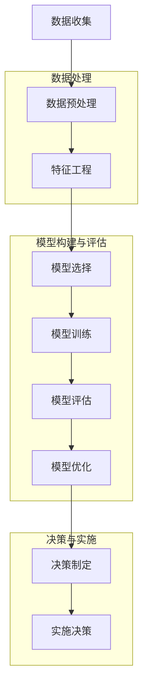

                 


### 第1章：引言

#### 1.1 人工智能在保险行业的应用背景

随着科技的迅猛发展，人工智能（Artificial Intelligence, AI）正在深刻地改变各个行业的运作模式。在保险行业，人工智能的应用尤为突出。保险行业是一个数据密集型行业，其业务流程涉及大量数据的收集、处理和分析。人工智能技术，特别是机器学习（Machine Learning, ML）和数据挖掘（Data Mining, DM），为保险公司提供了强大的工具，帮助它们更好地理解风险、优化业务流程和提升客户体验。

传统的保险定价方法主要依赖于历史数据和专家经验，这种方法存在明显的局限性。首先，传统方法无法充分考虑每个客户的个性化需求，导致定价可能过于一刀切，无法实现真正的风险细分。其次，传统方法在处理复杂风险因素时效率低下，难以满足现代保险市场的快速变化。为了克服这些局限性，保险公司开始探索利用人工智能技术进行个性化保险定价。

#### 1.2 个性化保险定价的重要性

个性化保险定价是指根据客户的个人特征、行为数据和历史记录，为其量身定制保险产品和服务。这种定价方式不仅能够提高客户的满意度和忠诚度，还能够帮助保险公司更准确地评估风险，从而降低赔付率，提升利润。具体来说，个性化保险定价的重要性体现在以下几个方面：

1. **风险准确评估**：通过分析客户的个人数据和风险偏好，保险公司可以更准确地评估每个客户的风险水平，从而制定出更合理的保费价格。
2. **个性化产品设计**：个性化定价能够帮助保险公司开发出更符合客户需求的产品，提高产品的市场竞争力。
3. **降低运营成本**：通过自动化处理和数据分析，保险公司可以减少人工干预，降低运营成本。
4. **提升客户满意度**：个性化服务能够提高客户的满意度和忠诚度，促进客户留存和口碑传播。
5. **业务增长**：个性化保险定价有助于保险公司拓展新客户，提高市场份额。

#### 1.3 书籍结构概述

本书旨在系统地介绍人工智能在个性化保险定价中的应用，内容结构如下：

- **第1章**：引言，介绍人工智能在保险行业的应用背景和个性化保险定价的重要性。
- **第2章**：人工智能基础，详细阐述人工智能、机器学习、数据挖掘等核心概念及其在个性化保险定价中的应用。
- **第3章**：个性化保险定价的核心算法，讲解线性回归、逻辑回归、决策树、随机森林、神经网络等算法原理和适用场景。
- **第4章**：数学模型与公式，介绍风险评分模型、贝叶斯网络等数学模型，并使用LaTeX格式展示相关数学公式。
- **第5章**：项目实战，通过实际案例展示如何应用机器学习算法进行个性化保险定价。
- **第6章**：未来趋势与挑战，分析个性化保险定价的发展趋势和面临的挑战。
- **第7章**：总结与展望，回顾本书的主要内容，展望未来发展方向。

通过本书的阅读，读者将能够系统地了解人工智能在个性化保险定价中的应用，掌握相关算法原理和实践方法，为未来的研究和应用打下坚实的基础。

### 2.1 人工智能概述

人工智能（Artificial Intelligence, AI）是计算机科学的一个分支，旨在创建能够模拟、延伸和扩展人类智能的理论、算法和技术。其核心目标是使计算机能够自主地执行复杂的任务，如理解自然语言、识别图像、解决问题、进行决策等。人工智能的发展可以追溯到20世纪50年代，当时图灵提出图灵测试的概念，旨在判断机器是否具有智能。

人工智能可以分为几种不同的类型，包括：

1. **弱人工智能（Narrow AI）**：也称为专用人工智能，这种AI系统在特定任务上表现出人类智能的某些方面，但缺乏普遍的智能。例如，聊天机器人、图像识别系统和自动驾驶汽车都属于弱人工智能。
2. **强人工智能（General AI）**：强人工智能具有广泛的认知能力，能够在各种不同的任务和环境中表现出人类智能的水平。这种AI目前仍然处于理论阶段，尚未实现。
3. **人工超智能（Artificial Superintelligence, ASI）**：这是一种超越人类智能的人工智能，能够自主地解决复杂问题，并在各个领域表现出卓越的能力。这是人工智能领域的终极目标，但也是一个极具争议的话题。

人工智能的核心组成部分包括：

- **算法**：人工智能的核心是算法，包括监督学习、非监督学习、强化学习等。这些算法使得计算机能够从数据中学习，并做出预测或决策。
- **数据**：数据是人工智能的基础，大量的高质量数据能够帮助模型更好地学习和泛化。
- **计算能力**：高性能的计算能力是人工智能实现的必要条件，特别是对于复杂模型和大规模数据集的处理。

#### 2.1.2 人工智能的分类与现状

人工智能可以根据其应用领域和功能进行分类，主要分为以下几类：

1. **机器学习（Machine Learning, ML）**：机器学习是一种通过数据和算法来训练计算机模型的方法，使计算机能够从数据中学习并做出预测或决策。机器学习可以分为监督学习、非监督学习和半监督学习。
2. **深度学习（Deep Learning, DL）**：深度学习是机器学习的一个子领域，通过构建多层的神经网络模型来模拟人脑的学习方式，具有强大的特征提取和模式识别能力。
3. **自然语言处理（Natural Language Processing, NLP）**：自然语言处理是人工智能的一个重要分支，旨在使计算机能够理解、生成和处理自然语言。
4. **计算机视觉（Computer Vision, CV）**：计算机视觉是使计算机能够从图像或视频中提取信息的技术，广泛应用于人脸识别、图像分类、物体检测等领域。
5. **机器人学（Robotics）**：机器人学是人工智能在物理世界中的应用，涉及机器人设计、控制、交互等方面的研究。
6. **自动化（Automation）**：自动化是利用人工智能技术实现生产过程或服务流程的自动化，以提高效率和降低成本。

目前，人工智能已经取得了显著的进展，并在多个领域实现了应用：

- **医疗健康**：人工智能在医疗健康领域应用广泛，包括疾病预测、诊断辅助、药物研发等。
- **金融**：人工智能在金融领域的应用包括风险控制、量化交易、客户服务自动化等。
- **交通**：自动驾驶技术是人工智能在交通领域的代表性应用，能够提高交通效率和安全性。
- **零售**：人工智能在零售业中的应用包括库存管理、个性化推荐、智能客服等。
- **教育**：人工智能在教育领域的应用包括智能辅导、在线学习平台、学习数据分析等。

然而，人工智能的发展也面临着一些挑战，如算法透明度、数据隐私、伦理问题等。未来，随着技术的不断进步和应用的深入，人工智能将在更多领域发挥重要作用。

### 2.2 机器学习基础

机器学习（Machine Learning, ML）是人工智能的一个重要分支，它通过构建数学模型，使计算机系统能够从数据中自动学习和改进，以进行预测或决策。机器学习的关键要素包括数据、算法和模型。

#### 2.2.1 机器学习的概念与类型

机器学习的概念可以概括为：通过训练模型，使其能够在新的数据上做出准确的预测或决策。机器学习可以分为几种不同的类型：

1. **监督学习（Supervised Learning）**：监督学习是一种在已知输出（标记）数据集上训练模型的方法。模型通过学习输入和输出之间的关系，以便在新的输入数据上做出预测。常见的监督学习算法包括线性回归、逻辑回归、决策树、随机森林、支持向量机等。

2. **非监督学习（Unsupervised Learning）**：非监督学习是一种在没有已知输出数据集的情况下训练模型的方法。模型的目的是发现数据中的内在结构和模式，如聚类和降维。常见的非监督学习算法包括K-均值聚类、主成分分析（PCA）、自编码器等。

3. **半监督学习（Semi-supervised Learning）**：半监督学习结合了监督学习和非监督学习的特点，在部分标记数据集上进行训练。这种方法可以利用未标记的数据来提高模型的性能。

4. **强化学习（Reinforcement Learning）**：强化学习是一种通过奖励机制来训练模型的方法。模型通过与环境的交互，不断调整策略，以实现长期目标最大化。常见的强化学习算法包括Q-learning、深度Q网络（DQN）、策略梯度算法等。

#### 2.2.2 常见机器学习算法介绍

以下介绍几种常见的机器学习算法及其基本原理：

1. **线性回归（Linear Regression）**：线性回归是一种用于预测连续值的监督学习算法。其基本原理是找到一个最佳拟合直线，使预测值与实际值之间的误差最小。线性回归的数学表达式为：
   $$
   y = \beta_0 + \beta_1 \cdot x
   $$
   其中，$y$ 是预测值，$x$ 是输入特征，$\beta_0$ 和 $\beta_1$ 是模型参数。

2. **逻辑回归（Logistic Regression）**：逻辑回归是一种用于预测概率的二分类监督学习算法。其基本原理是通过对线性回归模型输出进行Logistic转换，得到概率估计。逻辑回归的数学表达式为：
   $$
   P(y=1) = \frac{1}{1 + e^{-(\beta_0 + \beta_1 \cdot x)}}
   $$
   其中，$P(y=1)$ 是预测的概率，$\beta_0$ 和 $\beta_1$ 是模型参数。

3. **决策树（Decision Tree）**：决策树是一种基于特征值进行划分的树形结构模型。每个内部节点表示一个特征，每个分支表示该特征的不同取值，叶节点表示最终的预测结果。决策树的构建过程称为递归二分划分。

4. **随机森林（Random Forest）**：随机森林是一种基于决策树的集成学习方法。它通过随机选取特征和随机选取样本子集来构建多个决策树，并通过投票机制得出最终预测结果。随机森林具有较强的泛化能力和抗过拟合能力。

5. **支持向量机（Support Vector Machine, SVM）**：支持向量机是一种基于最大间隔分类的监督学习算法。它通过找到一个最佳的超平面，使正负样本之间的间隔最大。SVM可以用于分类和回归问题。

6. **神经网络（Neural Network）**：神经网络是一种模拟生物神经系统的计算模型。它由多个神经元（节点）组成，通过学习输入和输出之间的关系，实现对复杂数据的建模和预测。神经网络可以分为多层感知机（MLP）、卷积神经网络（CNN）和循环神经网络（RNN）等。

通过以上对常见机器学习算法的介绍，我们可以看到，每种算法都有其独特的优势和适用场景。在实际应用中，选择合适的算法并进行参数调优，是取得良好预测效果的关键。

### 2.3 数据挖掘与数据分析

数据挖掘（Data Mining）是人工智能和数据科学的一个重要分支，旨在从大量数据中自动发现具有潜在价值的信息和知识。数据挖掘的过程通常包括数据预处理、数据探索、模式识别、评估和可视化等步骤。数据分析（Data Analysis）则是通过统计方法、数据可视化技术和机器学习算法，对数据进行深入理解和解释的过程。

#### 2.3.1 数据挖掘的基本概念

数据挖掘的基本概念包括：

- **数据集（Dataset）**：数据集是指用于数据挖掘的数据集合，可以是结构化数据（如数据库表）、半结构化数据（如XML文件）或非结构化数据（如文本、图像、音频等）。
- **特征（Feature）**：特征是描述数据集中每个样本的属性或维度。特征可以是数值型、分类型或布尔型。
- **模式（Pattern）**：模式是指数据集中存在的规律、关联或趋势。常见的模式识别方法包括聚类、分类、关联规则挖掘等。
- **评估指标（Evaluation Metric）**：评估指标用于评估数据挖掘算法的性能。常见的评估指标包括准确率、召回率、F1分数、均方误差等。

#### 2.3.2 数据分析的方法与应用

数据分析的方法主要包括：

- **描述性统计分析（Descriptive Statistics）**：描述性统计分析是对数据进行汇总和描述的方法，用于了解数据的基本特征。常用的统计量包括均值、中位数、众数、方差、标准差等。
- **探索性数据分析（Exploratory Data Analysis, EDA）**：探索性数据分析是一种通过可视化、统计方法来探索数据内部结构和关系的分析方法。常用的工具包括Excel、Python的Pandas和Matplotlib库等。
- **回归分析（Regression Analysis）**：回归分析是一种用于研究变量之间线性关系的统计方法。常见的回归分析方法包括线性回归、多项式回归、岭回归、Lasso回归等。
- **聚类分析（Cluster Analysis）**：聚类分析是一种将数据集划分为若干个类别的方法，使同一类别内的数据点之间相似度较高，不同类别之间的数据点相似度较低。常见的聚类算法包括K-均值聚类、层次聚类、DBSCAN等。
- **分类分析（Classification Analysis）**：分类分析是一种将数据集划分为不同类别的预测方法。常见的分类算法包括决策树、随机森林、支持向量机、神经网络等。
- **关联规则挖掘（Association Rule Mining）**：关联规则挖掘是一种发现数据集中项目之间潜在关联关系的方法。常见的算法包括Apriori算法、Eclat算法等。

数据分析在各个领域都有广泛的应用，以下是一些典型的应用场景：

- **商业智能（Business Intelligence）**：数据分析帮助企业了解市场趋势、客户行为、销售数据等，从而制定更有效的业务策略。
- **金融市场（Financial Markets）**：数据分析用于预测股票价格、风险管理、欺诈检测等，帮助金融机构做出更明智的决策。
- **医疗健康（Medical Health）**：数据分析用于疾病预测、诊断辅助、药物研发等，提高医疗服务的质量和效率。
- **智能交通（Smart Transportation）**：数据分析用于交通流量预测、路线规划、事故预警等，提高交通管理水平和安全性能。
- **教育领域（Education）**：数据分析用于学习行为分析、成绩预测、个性化推荐等，帮助教育机构提供更优质的教育资源和服务。

通过数据挖掘和数据分析，企业可以从海量数据中提取有价值的信息，提升决策的准确性和效率，从而在竞争激烈的市场中脱颖而出。

### 2.4 Mermaid流程图：人工智能在个性化保险定价中的应用

为了更直观地展示人工智能在个性化保险定价中的应用流程，我们可以使用Mermaid语言绘制一个流程图。以下是一个简化的版本，描述了从数据收集到模型优化的主要步骤：



**说明：**

1. **数据收集（A）**：收集与保险相关的数据，包括客户信息、历史理赔记录、行为数据等。
2. **数据预处理（B）**：对原始数据进行清洗、去重、格式转换等操作，确保数据质量。
3. **特征工程（C）**：根据业务需求和模型特性，提取和构造特征，以提高模型的预测性能。
4. **模型选择（D）**：选择合适的机器学习算法和模型架构，如线性回归、逻辑回归、决策树、随机森林等。
5. **模型训练（E）**：使用训练数据集对模型进行训练，调整模型参数，使其达到预期的性能。
6. **模型评估（F）**：使用验证数据集对模型进行评估，计算模型的准确率、召回率等指标。
7. **模型优化（G）**：根据评估结果，对模型进行调整和优化，以提高预测准确性。
8. **决策制定（H）**：基于模型预测结果，制定个性化的保险定价策略。
9. **实施决策（I）**：将优化后的模型应用于实际业务场景，为不同客户提供个性化的保险产品。

通过这个流程图，我们可以清晰地看到人工智能在个性化保险定价中的应用步骤，以及各个步骤之间的逻辑关系。在实际应用中，这些步骤可能需要根据具体情况进行调整和优化。

### 3.1 线性回归

线性回归（Linear Regression）是一种用于预测连续值的监督学习算法，其核心思想是通过找到一个最佳拟合直线，将输入特征映射到目标变量。线性回归在个性化保险定价中具有广泛的应用，因为它能够简单且有效地预测客户的风险评分。

#### 3.1.1 线性回归的基本原理

线性回归的基本原理可以表示为：
$$
y = \beta_0 + \beta_1 \cdot x
$$
其中，$y$ 是预测的目标变量，$x$ 是输入特征，$\beta_0$ 和 $\beta_1$ 是模型参数。

在这个公式中，$\beta_0$ 是截距（Intercept），表示当输入特征 $x$ 为零时的预测值；$\beta_1$ 是斜率（Slope），表示输入特征 $x$ 的变化对预测值 $y$ 的变化率。

线性回归模型的训练目标是最小化预测值与实际值之间的误差。这个误差可以通过平方误差（Mean Squared Error, MSE）来衡量：
$$
MSE = \frac{1}{n} \sum_{i=1}^{n} (y_i - \hat{y}_i)^2
$$
其中，$n$ 是数据集中的样本数量，$y_i$ 是第 $i$ 个样本的实际值，$\hat{y}_i$ 是第 $i$ 个样本的预测值。

为了求解模型参数 $\beta_0$ 和 $\beta_1$，我们可以使用最小二乘法（Least Squares Method）。最小二乘法的思想是找到使得平方误差最小的参数值。具体地，我们可以通过以下步骤求解模型参数：

1. **计算输入特征 $x$ 和目标变量 $y$ 的平均值**：
   $$
   \bar{x} = \frac{1}{n} \sum_{i=1}^{n} x_i, \quad \bar{y} = \frac{1}{n} \sum_{i=1}^{n} y_i
   $$

2. **计算斜率 $\beta_1$**：
   $$
   \beta_1 = \frac{\sum_{i=1}^{n} (x_i - \bar{x})(y_i - \bar{y})}{\sum_{i=1}^{n} (x_i - \bar{x})^2}
   $$

3. **计算截距 $\beta_0$**：
   $$
   \beta_0 = \bar{y} - \beta_1 \cdot \bar{x}
   $$

这样，我们就得到了线性回归模型的参数 $\beta_0$ 和 $\beta_1$，并可以使用这个模型进行预测。

#### 3.1.2 线性回归的求解算法

线性回归的求解算法主要有以下几种：

1. **闭式解法**：闭式解法是通过数学推导直接得到模型参数的解析解。前面提到的小二乘法就是闭式解法的一种。闭式解法的优点是计算过程简单，不需要迭代计算，但缺点是对于大型数据集可能计算效率较低。

2. **梯度下降法（Gradient Descent）**：梯度下降法是一种迭代优化算法，通过不断迭代更新模型参数，使其逐渐逼近最优解。梯度下降法的核心思想是沿着目标函数的负梯度方向进行更新，每次更新可以采用随机梯度下降（Stochastic Gradient Descent, SGD）或批量梯度下降（Batch Gradient Descent, BGD）。

   - **随机梯度下降（SGD）**：每次迭代仅使用一个样本进行参数更新，计算速度快，但可能陷入局部最优解。
   - **批量梯度下降（BGD）**：每次迭代使用整个数据集进行参数更新，收敛速度较慢，但能够找到全局最优解。

3. **牛顿法（Newton's Method）**：牛顿法是一种基于二阶导数的优化算法，通过牛顿迭代公式进行参数更新：
   $$
   \beta_{t+1} = \beta_t - H^{-1} \nabla L(\beta_t)
   $$
   其中，$H$ 是Hessian矩阵，$\nabla L(\beta_t)$ 是目标函数在 $\beta_t$ 处的梯度。牛顿法具有收敛速度快、计算稳定等优点，但需要计算二阶导数，对于大型数据集可能计算效率较低。

在实际应用中，选择合适的求解算法需要根据数据集的大小、特征的数量以及计算资源等因素进行综合考虑。例如，对于小型数据集，可以使用闭式解法；对于大型数据集，可以使用梯度下降法或牛顿法。

### 3.2 逻辑回归

逻辑回归（Logistic Regression）是一种用于预测概率的监督学习算法，广泛应用于二分类问题。在个性化保险定价中，逻辑回归可以用于预测客户是否会发生特定风险事件，如出险或理赔。逻辑回归通过将线性回归的输出转换为概率，实现对二分类问题的建模。

#### 3.2.1 逻辑回归的基本原理

逻辑回归的基本原理可以表示为：
$$
P(y=1) = \frac{1}{1 + e^{-(\beta_0 + \beta_1 \cdot x)}}
$$
其中，$P(y=1)$ 是预测的概率，$x$ 是输入特征，$\beta_0$ 和 $\beta_1$ 是模型参数。

逻辑回归的核心思想是通过线性组合输入特征和模型参数，得到预测概率。具体来说，逻辑函数（Logistic Function）将线性回归的输出映射到一个概率范围（0到1）之间，使得预测结果更加直观和合理。

逻辑回归的训练目标是最小化预测概率与实际标签之间的交叉熵（Cross-Entropy Loss）误差。交叉熵误差的数学表达式为：
$$
L(\beta_0, \beta_1) = -\sum_{i=1}^{n} [y_i \log(\hat{p}_i) + (1 - y_i) \log(1 - \hat{p}_i)]
$$
其中，$n$ 是数据集中的样本数量，$y_i$ 是第 $i$ 个样本的实际标签，$\hat{p}_i$ 是第 $i$ 个样本的预测概率。

为了求解模型参数 $\beta_0$ 和 $\beta_1$，我们可以使用梯度下降法（Gradient Descent）进行迭代优化。梯度下降法的核心思想是通过不断迭代更新模型参数，使其逐渐逼近最优解。每次迭代可以采用随机梯度下降（Stochastic Gradient Descent, SGD）或批量梯度下降（Batch Gradient Descent, BGD）。

随机梯度下降（SGD）每次迭代仅使用一个样本进行参数更新，计算速度快，但可能陷入局部最优解。批量梯度下降（BGD）每次迭代使用整个数据集进行参数更新，收敛速度较慢，但能够找到全局最优解。

#### 3.2.2 逻辑回归的求解算法

逻辑回归的求解算法主要采用梯度下降法。以下是一种简单的随机梯度下降求解算法：

1. **初始化模型参数**：随机初始化 $\beta_0$ 和 $\beta_1$ 的值。

2. **计算预测概率**：对于每个样本 $x_i$，计算预测概率 $\hat{p}_i$：
   $$
   \hat{p}_i = \frac{1}{1 + e^{-(\beta_0 + \beta_1 \cdot x_i)}}
   $$

3. **计算损失函数**：对于每个样本 $x_i$，计算交叉熵损失：
   $$
   L(\beta_0, \beta_1) = -\sum_{i=1}^{n} [y_i \log(\hat{p}_i) + (1 - y_i) \log(1 - \hat{p}_i)]
   $$

4. **计算梯度**：对于每个样本 $x_i$，计算损失函数关于 $\beta_0$ 和 $\beta_1$ 的梯度：
   $$
   \nabla_{\beta_0} L = -\sum_{i=1}^{n} (y_i - \hat{p}_i)
   $$
   $$
   \nabla_{\beta_1} L = -\sum_{i=1}^{n} (y_i - \hat{p}_i) x_i
   $$

5. **更新模型参数**：根据梯度进行模型参数的更新：
   $$
   \beta_0 = \beta_0 - \alpha \nabla_{\beta_0} L
   $$
   $$
   \beta_1 = \beta_1 - \alpha \nabla_{\beta_1} L
   $$
   其中，$\alpha$ 是学习率（Learning Rate），用于控制每次更新的步长。

6. **重复步骤2到5**：直到满足停止条件，如达到最大迭代次数或损失函数变化小于某个阈值。

通过以上步骤，我们可以使用随机梯度下降法求解逻辑回归模型。在实际应用中，我们可以根据数据集的大小和计算资源调整学习率和其他参数，以获得更好的模型性能。

### 3.3 决策树与随机森林

决策树（Decision Tree）是一种常见的分类和回归算法，通过一系列的判断规则对数据进行划分，从而对数据进行分类或回归。决策树易于理解和解释，因此在许多应用中具有广泛的应用。随机森林（Random Forest）是基于决策树构建的一种集成学习方法，通过构建多棵决策树并集成它们的预测结果，从而提高模型的泛化能力和鲁棒性。

#### 3.3.1 决策树的基本原理

决策树由多个内部节点和叶节点组成。每个内部节点表示一个特征，每个分支表示该特征的不同取值，而叶节点表示最终的预测结果。决策树的构建过程称为递归二分划分（Recursive Binary Splitting）。

决策树的构建可以分为以下步骤：

1. **选择最佳特征**：对于每个内部节点，从所有特征中选择一个具有最大信息增益或最小均方误差的特征进行划分。

2. **划分数据**：根据选定的特征，将数据集划分为两个子集，每个子集对应特征的一个取值。

3. **递归构建子树**：对划分后的每个子集，重复上述步骤，直到满足停止条件，如最大树深度、最小叶子节点样本数等。

4. **生成叶节点**：当无法继续划分时，生成一个叶节点，并赋予该节点的预测结果。

信息增益（Information Gain）是决策树划分的一个重要指标，用于衡量特征对于目标变量的解释能力。信息增益的计算公式为：
$$
IG(D, A) = entropy(D) - \sum_{v \in A} \frac{|D_v|}{|D|} \cdot entropy(D_v)
$$
其中，$D$ 是原始数据集，$A$ 是候选特征，$D_v$ 是特征 $A$ 取值 $v$ 的子集，$entropy(D)$ 是数据集 $D$ 的熵。

熵（Entropy）是一个概率分布的混乱程度的度量，其计算公式为：
$$
entropy(p) = -\sum_{i=1}^{n} p_i \cdot \log_2(p_i)
$$
其中，$p_i$ 是概率分布的第 $i$ 个值。

#### 3.3.2 随机森林的原理与优势

随机森林是基于决策树的集成学习方法，通过构建多棵决策树并集成它们的预测结果来提高模型的泛化能力和鲁棒性。随机森林的基本原理如下：

1. **特征选择**：随机森林在构建每棵决策树时，仅从特征集合中随机选择一部分特征进行划分。这样，每棵决策树只依赖于部分特征，减少了特征之间的相关性，提高了模型的多样性。

2. **样本抽样**：随机森林在训练每棵决策树时，仅从原始数据集随机抽取一部分样本进行训练。这种抽样方法称为袋外抽样（Out-of-Bag, OOB）抽样，能够减少过拟合现象。

3. **集成预测**：随机森林通过集成多棵决策树的预测结果来获得最终的预测结果。常见的集成方法包括投票（Voting）和平均（Averaging）等。

随机森林具有以下优势：

- **强大的泛化能力**：通过集成多棵决策树，随机森林能够减少过拟合现象，提高模型的泛化能力。

- **鲁棒性**：随机森林对噪声数据和异常值具有较强的鲁棒性，能够处理非线性和高维数据。

- **可解释性**：每棵决策树都是通过一系列的判断规则进行划分，使得模型的预测过程具有较好的可解释性。

- **易于实现**：随机森林算法的实现相对简单，适用于各种编程语言和计算平台。

#### 3.3.3 随机森林的应用场景

随机森林在多个应用领域具有广泛的应用，包括：

- **分类问题**：随机森林可以用于各种分类任务，如垃圾邮件分类、疾病诊断、客户流失预测等。

- **回归问题**：随机森林可以用于回归任务，如房价预测、股票价格预测等。

- **特征选择**：随机森林通过特征选择过程，能够识别出对目标变量有显著影响的特征，有助于特征工程和模型优化。

- **数据可视化**：随机森林的决策树结构可以用于数据可视化，帮助用户理解模型的预测过程。

- **风险管理**：随机森林在金融领域的风险管理中具有广泛应用，如信用评分、风险控制等。

在实际应用中，随机森林可以根据具体任务和数据集的特点进行调整和优化，以获得更好的预测性能。随机森林的集成方法和参数选择是影响模型性能的关键因素，需要根据实际情况进行调优。

### 3.4 神经网络

神经网络（Neural Network，简称NN）是一种模仿生物神经系统的计算模型，由大量的神经元（节点）组成，通过学习输入和输出之间的关系，实现对复杂数据的建模和预测。在个性化保险定价中，神经网络可以通过学习客户的个人数据和风险因素，实现对客户风险评分的精准预测。

#### 3.4.1 神经网络的结构与原理

神经网络的基本结构包括输入层、隐藏层和输出层。每个层由多个神经元组成，神经元之间通过权重连接，形成复杂的网络结构。神经元的激活函数用于决定神经元的输出，常见的激活函数包括线性函数、Sigmoid函数、ReLU函数和Tanh函数等。

1. **输入层（Input Layer）**：输入层接收外部输入数据，每个神经元对应一个输入特征。输入层的神经元数量取决于数据集的特征维度。

2. **隐藏层（Hidden Layer）**：隐藏层是神经网络的核心部分，包含多个神经元。隐藏层神经元通过前一层神经元的激活值进行计算，并通过权重连接到下一层。隐藏层神经元数量的选择对模型的复杂度和性能有重要影响。

3. **输出层（Output Layer）**：输出层负责生成最终的预测结果。对于分类问题，输出层通常包含多个神经元，每个神经元对应一个类别，通过softmax函数输出各个类别的概率分布。对于回归问题，输出层通常包含一个神经元，输出预测的连续值。

神经网络的工作原理可以概括为以下几个步骤：

1. **前向传播（Forward Propagation）**：输入数据从输入层传递到隐藏层，再传递到输出层。在每个层次，神经元的输出通过激活函数进行非线性变换，并通过权重连接传递到下一层。

2. **计算损失（Calculate Loss）**：在前向传播过程中，计算输出层实际输出与预测目标之间的误差，使用损失函数（如均方误差、交叉熵等）来衡量误差。

3. **反向传播（Back Propagation）**：通过反向传播算法，将误差从输出层反向传播到输入层，并更新每个神经元的权重和偏置，以最小化损失函数。

4. **迭代训练（Iterative Training）**：重复前向传播和反向传播过程，直到模型收敛到满意的性能。在训练过程中，可以通过调整学习率、优化算法等参数来提高模型性能。

#### 3.4.2 神经网络的训练算法

神经网络的训练算法主要包括前向传播和反向传播两个步骤。以下是一种简单的随机梯度下降（Stochastic Gradient Descent，SGD）训练算法：

1. **初始化模型参数**：随机初始化网络的权重和偏置。

2. **前向传播**：
   - 将输入数据传递到输入层。
   - 通过激活函数计算每个神经元的输出值。
   - 将输出传递到下一层，重复上述步骤，直到输出层。

3. **计算损失**：
   - 使用损失函数计算输出层实际输出与预测目标之间的误差。
   - 计算每个神经元的梯度。

4. **反向传播**：
   - 从输出层开始，反向传播误差到输入层。
   - 使用梯度下降法更新每个神经元的权重和偏置。

5. **迭代训练**：
   - 重复前向传播和反向传播过程，直到满足停止条件，如达到最大迭代次数或损失函数变化小于某个阈值。

在实际应用中，神经网络训练算法可以通过调整学习率、批量大小、优化器等参数来提高训练效率和模型性能。常见的优化器包括随机梯度下降（SGD）、Adam、RMSprop等。

通过神经网络的训练算法，我们可以构建一个能够对客户风险评分进行精准预测的模型。神经网络具有强大的非线性建模能力，能够处理复杂的非线性关系和大量特征数据，因此在个性化保险定价中具有广泛的应用前景。

### 3.5 伪代码讲解：线性回归与逻辑回归

在个性化保险定价中，线性回归和逻辑回归是两种常用的机器学习算法。以下我们将通过伪代码的形式详细讲解这两种算法的基本原理和实现步骤。

#### 线性回归伪代码

```python
# 线性回归伪代码

# 初始化参数
beta_0 = random_value()
beta_1 = random_value()

# 设置迭代次数和停止条件
max_iterations = 1000
threshold = 1e-6

# 数据集
X = ... # 特征矩阵
y = ... # 标签向量

# 梯度下降法迭代
for i in range(max_iterations):
    # 前向传播计算预测值
    predictions = beta_0 + beta_1 * X
    
    # 计算损失函数
    loss = (1 / 2) * sum((predictions - y) ** 2)
    
    # 计算梯度
    d_beta_0 = -sum(predictions - y)
    d_beta_1 = -sum((predictions - y) * X)
    
    # 更新参数
    beta_0 -= learning_rate * d_beta_0
    beta_1 -= learning_rate * d_beta_1
    
    # 检查收敛条件
    if abs(d_beta_0) < threshold and abs(d_beta_1) < threshold:
        break

# 输出最优参数
print("Best parameters:", beta_0, beta_1)
```

**说明：**
- **初始化参数**：随机初始化 $\beta_0$ 和 $\beta_1$ 的初始值。
- **迭代过程**：通过前向传播计算预测值，计算损失函数，计算梯度，并更新参数。
- **停止条件**：当梯度变化小于某个阈值时，认为模型已经收敛。

#### 逻辑回归伪代码

```python
# 逻辑回归伪代码

# 初始化参数
beta_0 = random_value()
beta_1 = random_value()

# 设置迭代次数和停止条件
max_iterations = 1000
threshold = 1e-6

# 数据集
X = ... # 特征矩阵
y = ... # 标签向量，其中 y 取值 0 或 1

# 梯度下降法迭代
for i in range(max_iterations):
    # 前向传播计算预测概率
    predictions = 1 / (1 + exp(-beta_0 - beta_1 * X))
    
    # 计算损失函数（交叉熵损失）
    loss = -sum(y * log(predictions) + (1 - y) * log(1 - predictions))
    
    # 计算梯度
    d_beta_0 = -sum(predictions - y)
    d_beta_1 = -sum((predictions - y) * X)
    
    # 更新参数
    beta_0 -= learning_rate * d_beta_0
    beta_1 -= learning_rate * d_beta_1
    
    # 检查收敛条件
    if abs(d_beta_0) < threshold and abs(d_beta_1) < threshold:
        break

# 输出最优参数
print("Best parameters:", beta_0, beta_1)
```

**说明：**
- **初始化参数**：与线性回归类似，随机初始化 $\beta_0$ 和 $\beta_1$ 的初始值。
- **前向传播**：通过计算预测概率 $P(y=1)$。
- **损失函数**：使用交叉熵损失函数来衡量预测概率与实际标签之间的差距。
- **更新参数**：通过梯度下降法更新 $\beta_0$ 和 $\beta_1$ 的值。
- **停止条件**：当梯度变化小于某个阈值时，认为模型已经收敛。

通过以上伪代码，我们可以看到线性回归和逻辑回归的实现步骤非常相似，核心区别在于损失函数和梯度计算的不同。在实际应用中，我们可以使用Python的Scikit-learn库等工具来实现这些算法，并根据具体问题进行调整和优化。

### 4.1 风险评分模型

风险评分模型（Risk Score Model）是用于评估个体风险水平的一种数学模型，广泛应用于保险、金融、信用评分等领域。在个性化保险定价中，风险评分模型可以帮助保险公司准确地评估客户的风险水平，从而制定出更合理的保费价格。以下是对风险评分模型的基本概念、数学表达及其应用的介绍。

#### 4.1.1 风险评分模型的基本概念

风险评分模型是一种基于历史数据和统计方法构建的模型，它通过量化个体的风险特征，为每个客户分配一个风险评分。这个评分通常是一个数值，用于表示客户发生特定风险事件（如出险、理赔）的可能性。风险评分模型的核心目标是找到一个与风险事件发生概率相关的函数，从而实现风险的量化评估。

风险评分模型的输入通常包括以下几类特征：

- **个人特征**：如年龄、性别、职业等。
- **行为特征**：如驾驶记录、生活习惯、消费习惯等。
- **历史数据**：如理赔记录、保险历史、信用记录等。

输出是一个风险评分，这个评分通常是一个连续值或离散值，用于表示客户的风险水平。根据风险评分，保险公司可以为不同风险水平的客户提供不同的保费报价和服务。

#### 4.1.2 风险评分模型的数学表达

风险评分模型的数学表达形式通常是一个线性回归模型，其基本形式如下：
$$
R(x) = \beta_0 + \beta_1 \cdot x_1 + \beta_2 \cdot x_2 + \ldots + \beta_n \cdot x_n
$$
其中，$R(x)$ 是风险评分，$x_1, x_2, \ldots, x_n$ 是特征向量，$\beta_0, \beta_1, \beta_2, \ldots, \beta_n$ 是模型参数。

- **$\beta_0$**：截距，表示当所有特征都为零时的风险评分。
- **$\beta_1, \beta_2, \ldots, \beta_n$**：权重系数，表示每个特征对风险评分的贡献程度。

在实际应用中，风险评分模型可能更加复杂，包括非线性关系和交互项。例如，可以使用逻辑回归模型来处理二分类问题，其数学表达式为：
$$
P(y=1) = \frac{1}{1 + e^{-(\beta_0 + \beta_1 \cdot x_1 + \beta_2 \cdot x_2 + \ldots + \beta_n \cdot x_n)}}
$$
其中，$P(y=1)$ 是客户发生风险事件（如出险）的概率。

#### 4.1.3 风险评分模型的应用实例

以下是一个简单的风险评分模型应用实例：

假设我们要为某保险公司构建一个评估汽车保险客户出险概率的风险评分模型。我们收集了以下特征数据：

- **年龄（Age）**：客户的年龄。
- **驾驶经验（Experience）**：客户的驾驶经验年数。
- **驾驶记录（Accidents）**：客户在过去三年内发生的交通事故次数。
- **车辆类型（VehicleType）**：车辆的类型（如小型车、SUV、跑车等）。

我们使用这些特征构建一个线性回归模型来预测客户出险的概率。

1. **数据预处理**：
   - 对年龄、驾驶经验和驾驶记录等连续特征进行标准化处理。
   - 对车辆类型等分类特征进行编码处理。

2. **模型训练**：
   - 使用历史数据集训练线性回归模型，得到模型参数 $\beta_0, \beta_1, \beta_2, \beta_3$。
   - 通过交叉验证确保模型的泛化能力。

3. **模型评估**：
   - 使用验证集对模型进行评估，计算准确率、召回率等指标。
   - 根据评估结果调整模型参数，提高模型性能。

4. **应用模型**：
   - 对新客户的数据进行风险评分，预测其出险概率。
   - 根据风险评分制定个性化的保费价格。

通过以上步骤，我们成功地构建了一个用于个性化保险定价的风险评分模型。这个模型可以帮助保险公司更好地评估客户的风险水平，制定出更合理的保费策略，从而提高业务效率和客户满意度。

### 4.2 贝叶斯网络

贝叶斯网络（Bayesian Network）是一种基于概率论的图形模型，用于表示变量之间的条件依赖关系。在个性化保险定价中，贝叶斯网络可以用于构建复杂的概率模型，处理不确定性和不确定性推理，从而提供更加精细和个性化的风险评估。

#### 4.2.1 贝叶斯网络的基本概念

贝叶斯网络是一种有向无环图（DAG），它由节点和边组成。每个节点表示一个随机变量，边表示变量之间的条件依赖关系。在贝叶斯网络中，每个节点都有一个概率分布函数（Probability Distribution Function, PDF），表示该节点的概率分布。节点之间的边表示条件概率，即一个节点的概率分布依赖于其父节点的取值。

贝叶斯网络的定义包括：

- **节点**：表示随机变量，通常用圆圈表示。
- **边**：表示变量之间的条件依赖关系，从父节点指向子节点。
- **条件概率表**（Conditional Probability Table, CPT）：每个节点都有一个条件概率表，描述了该节点在给定其父节点取值下的概率分布。

贝叶斯网络的关键概念包括：

- **条件独立性**：如果两个变量在给定其共同父节点的情况下相互独立，则它们在贝叶斯网络中是条件独立的。
- **边缘概率**（Marginal Probability）：通过计算节点的边缘概率，可以得到整个网络的联合概率分布。
- **最大后验概率（Maximum A Posteriori, MAP）**：在已知观测数据的情况下，计算变量的最大后验概率，即最大化后验概率分布。

#### 4.2.2 贝叶斯网络的构建

构建贝叶斯网络的步骤如下：

1. **确定变量**：根据实际问题选择需要建模的变量，如客户特征、保险产品、风险评估等。

2. **绘制网络结构**：根据变量之间的依赖关系，绘制贝叶斯网络结构图。通常需要通过专家知识或数据分析来确定变量之间的依赖关系。

3. **定义条件概率表**：对于每个节点，根据其父节点的取值，定义条件概率表。条件概率表可以基于历史数据、专家知识或贝叶斯推理方法得到。

4. **计算联合概率分布**：通过条件概率表计算整个网络的联合概率分布。

5. **推理与预测**：利用贝叶斯网络进行推理和预测，如计算未知节点的条件概率、最大后验概率等。

以下是一个简单的贝叶斯网络实例：

假设我们有一个简单的贝叶斯网络，用于预测客户是否出险。网络中的变量包括：

- **$X_1$**：客户性别（男/女）。
- **$X_2$**：客户年龄。
- **$X_3$**：客户职业。
- **$Y$**：客户是否出险。

变量之间的依赖关系如下：

- **$Y$** 依赖于 **$X_1$**、**$X_2$** 和 **$X_3$**。
- **$X_2$** 依赖于 **$X_1$**。
- **$X_3$** 依赖于 **$X_1$**。

我们可以定义以下条件概率表：

- **$P(Y|X_1, X_2, X_3)$**：客户出险的条件概率。
- **$P(X_2|X_1)$**：客户年龄的条件概率。
- **$P(X_3|X_1)$**：客户职业的条件概率。

通过这些条件概率表，我们可以计算整个贝叶斯网络的联合概率分布，并进行推理和预测。

#### 4.2.3 贝叶斯网络在个性化保险定价中的应用

贝叶斯网络在个性化保险定价中的应用主要包括以下几个方面：

1. **风险评估**：通过贝叶斯网络，保险公司可以准确地评估客户的风险水平。这有助于保险公司制定更合理的保费策略，降低赔付风险。

2. **个性化推荐**：贝叶斯网络可以用于个性化推荐系统，根据客户的历史数据和偏好，推荐适合的保险产品。

3. **不确定性处理**：贝叶斯网络能够处理不确定性和不确定性推理，为保险公司提供更可靠的决策支持。

4. **动态调整**：贝叶斯网络可以根据新的数据和历史数据，动态调整模型参数，实现风险预测的持续优化。

通过以上应用，贝叶斯网络为个性化保险定价提供了强大的工具，有助于保险公司提高业务效率和客户满意度。

### 4.3 LaTeX公式：风险评分模型的数学表达

在构建风险评分模型时，LaTeX格式是表达数学公式和方程的常用工具。以下是一个简单的风险评分模型的LaTeX表示，包括模型的基本数学公式和相关符号。

首先，我们需要定义模型的基本结构：

```latex
\documentclass{article}
\usepackage{amsmath}
\usepackage{amsfonts}

\begin{document}

\section{风险评分模型}

风险评分模型可以表示为：
\begin{equation}
R(x) = \beta_0 + \beta_1 x_1 + \beta_2 x_2 + \ldots + \beta_n x_n
\end{equation}
其中，\( R(x) \) 是风险评分，\( x_1, x_2, \ldots, x_n \) 是特征向量，\( \beta_0, \beta_1, \beta_2, \ldots, \beta_n \) 是模型参数。

接下来，我们可以定义损失函数：

\begin{equation}
L(\beta_0, \beta_1, \beta_2, \ldots, \beta_n) = \frac{1}{2} \sum_{i=1}^{m} \left( R(x_i) - y_i \right)^2
\end{equation}
其中，\( m \) 是训练样本的数量，\( y_i \) 是第 \( i \) 个样本的真实风险评分。

为了求解模型参数，我们可以使用梯度下降法，其迭代公式如下：
\begin{align}
\beta_0^{(t+1)} &= \beta_0^{(t)} - \alpha \frac{\partial L}{\partial \beta_0} \\
\beta_1^{(t+1)} &= \beta_1^{(t)} - \alpha \frac{\partial L}{\partial \beta_1} \\
&\vdots \\
\beta_n^{(t+1)} &= \beta_n^{(t)} - \alpha \frac{\partial L}{\partial \beta_n}
\end{align}
其中，\( \alpha \) 是学习率。

最后，我们可以定义风险评分模型在分类任务中的应用，如逻辑回归：
\begin{equation}
P(y=1|x) = \frac{1}{1 + \exp\left( -(\beta_0 + \beta_1 x_1 + \beta_2 x_2 + \ldots + \beta_n x_n) \right)}
\end{equation}

\end{document}
```

这段LaTeX代码将生成以下数学公式：

- 风险评分模型：\( R(x) = \beta_0 + \beta_1 x_1 + \beta_2 x_2 + \ldots + \beta_n x_n \)
- 损失函数：\( L(\beta_0, \beta_1, \beta_2, \ldots, \beta_n) = \frac{1}{2} \sum_{i=1}^{m} \left( R(x_i) - y_i \right)^2 \)
- 梯度下降法迭代公式：
  \[
  \begin{align}
  \beta_0^{(t+1)} &= \beta_0^{(t)} - \alpha \frac{\partial L}{\partial \beta_0} \\
  \beta_1^{(t+1)} &= \beta_1^{(t)} - \alpha \frac{\partial L}{\partial \beta_1} \\
  &\vdots \\
  \beta_n^{(t+1)} &= \beta_n^{(t)} - \alpha \frac{\partial L}{\partial \beta_n}
  \end{align}
  \]
- 逻辑回归：\( P(y=1|x) = \frac{1}{1 + \exp\left( -(\beta_0 + \beta_1 x_1 + \beta_2 x_2 + \ldots + \beta_n x_n) \right)} \)

这些公式清晰地展示了风险评分模型的数学基础，为实际应用中的模型构建和参数优化提供了理论依据。

### 4.4 数学模型的应用实例

为了更好地理解风险评分模型的应用，我们将通过一个具体的实例来展示模型的构建、训练和应用过程。假设我们要为一家保险公司构建一个用于预测客户出险概率的风险评分模型。

#### 数据集

我们收集了一份数据集，包含以下特征：

1. **年龄（Age）**：客户的年龄。
2. **性别（Gender）**：客户的性别（0表示女性，1表示男性）。
3. **驾驶经验（Experience）**：客户的驾驶经验年数。
4. **车辆类型（VehicleType）**：车辆的类型（1表示小型车，2表示SUV，3表示跑车）。
5. **出险历史（AccidentHistory）**：客户在过去三年内的出险次数。

标签是客户是否在下一个保险周期内出险（0表示未出险，1表示出险）。

#### 数据预处理

在构建模型之前，我们需要对数据进行预处理：

1. **特征转换**：将性别和车辆类型等分类特征进行编码处理。例如，使用独热编码（One-Hot Encoding）将性别和车辆类型转换为数值型特征。

2. **数据标准化**：对年龄和驾驶经验等连续特征进行标准化处理，使其具有相似的尺度。

3. **数据分割**：将数据集随机分为训练集和测试集，通常使用80%的数据作为训练集，20%的数据作为测试集。

#### 模型构建

我们选择线性回归模型作为风险评分模型的基础。模型的数学表达式如下：

$$
P(Y=1|X) = \frac{1}{1 + \exp\left( -(\beta_0 + \beta_1 \cdot Age + \beta_2 \cdot Gender + \beta_3 \cdot Experience + \beta_4 \cdot VehicleType + \beta_5 \cdot AccidentHistory) \right)}
$$

#### 模型训练

1. **初始化参数**：随机初始化模型参数 $\beta_0, \beta_1, \beta_2, \beta_3, \beta_4, \beta_5$。

2. **前向传播**：对于每个训练样本，计算预测概率 $P(Y=1|X)$。

3. **计算损失**：使用交叉熵损失函数计算预测概率与实际标签之间的差距。

4. **反向传播**：计算损失函数关于每个参数的梯度，并更新参数。

5. **迭代训练**：重复前向传播和反向传播过程，直到模型收敛或达到最大迭代次数。

#### 模型评估

使用训练集对模型进行评估，计算以下指标：

1. **准确率（Accuracy）**：正确预测的样本数占总样本数的比例。

2. **召回率（Recall）**：在所有实际为1的样本中，正确预测为1的样本数占总实际为1的样本数的比例。

3. **精确率（Precision）**：在所有预测为1的样本中，正确预测为1的样本数占总预测为1的样本数的比例。

4. **F1分数（F1 Score）**：精确率和召回率的调和平均。

#### 应用模型

将训练好的模型应用于新的客户数据，预测其出险概率，并根据概率值制定个性化的保费价格。例如，如果预测概率大于0.5，则认为客户可能出险，设定较高的保费；如果预测概率小于0.5，则认为客户出险风险较低，设定较低的保费。

#### 模型优化

根据模型评估结果，对模型进行调整和优化，如调整参数、增加特征或更换模型等，以提高模型的预测性能。

通过以上步骤，我们成功地构建并应用了一个用于个性化保险定价的风险评分模型。这个模型可以帮助保险公司更准确地评估客户的风险水平，制定更合理的保费策略，提高业务效率和客户满意度。

### 5.1 数据预处理

在应用机器学习算法进行个性化保险定价之前，数据预处理是一个至关重要的步骤。良好的数据预处理能够提高模型的性能和可靠性，减少噪声和异常值对模型的影响。以下是对数据预处理的具体步骤和方法的详细讨论。

#### 5.1.1 数据清洗

数据清洗是数据预处理的第一步，旨在消除数据集中的错误、缺失和异常值。以下是一些常见的数据清洗方法：

1. **处理缺失值**：
   - **删除缺失值**：如果缺失值较多，可以选择删除包含缺失值的记录。这种方法简单但可能会导致数据丢失。
   - **填补缺失值**：对于缺失值较少的特征，可以使用平均值、中位数、众数等方法进行填补。对于分类特征，可以使用最频繁出现的类别进行填补。

2. **处理异常值**：
   - **删除异常值**：对于数据集中的异常值，可以选择删除。例如，对于年龄特征，如果一个客户的年龄远高于其他客户，可以怀疑这是一个异常值。
   - **修正异常值**：对于确认为异常值的记录，可以选择修正其值，例如将其替换为最近邻的值或中位数。

3. **消除重复值**：通过去重操作，确保数据集中不存在重复的记录。

4. **数据转换**：对于某些特征，可能需要将其转换为适合模型处理的形式。例如，将分类特征转换为数值型特征，使用独热编码或标签编码。

#### 5.1.2 数据标准化

数据标准化是确保数据具有相似尺度的重要步骤，特别是当特征具有不同数量级时。以下是一些常用的数据标准化方法：

1. **归一化（Normalization）**：将每个特征缩放到0到1之间，公式如下：
   $$
   x_{\text{normalized}} = \frac{x - \text{min}(x)}{\text{max}(x) - \text{min}(x)}
   $$
   这种方法适用于特征值范围较小的情况。

2. **标准化（Standardization）**：将每个特征缩放到均值为0，标准差为1的标准正态分布，公式如下：
   $$
   x_{\text{standardized}} = \frac{x - \mu}{\sigma}
   $$
   其中，$\mu$ 是特征的平均值，$\sigma$ 是特征的标准差。

3. **小数点移位（Decimal Shift）**：通过将特征值乘以10的n次方，将特征值缩放到较小的范围内，公式如下：
   $$
   x_{\text{shifted}} = x \times 10^n
   $$
   这种方法适用于特征值范围较大但需要减少数值长度的场景。

#### 5.1.3 数据归一化

数据归一化是将数据集中每个特征缩放到相同的范围，以便模型能够更好地处理不同的特征。以下是一些常用的数据归一化方法：

1. **最小-最大归一化**：将数据缩放到[0, 1]区间。
   $$
   x_{\text{normalized}} = \frac{x - \text{min}(x)}{\text{max}(x) - \text{min}(x)}
   $$

2. **零-均值归一化**：将数据缩放到[-1, 1]区间。
   $$
   x_{\text{normalized}} = \frac{x - \text{mean}(x)}{\text{stddev}(x)}
   $$

3. **对数归一化**：对数值型特征取对数，适用于右偏分布的数据。
   $$
   x_{\text{log}} = \log(x + 1)
   $$

4. **幂归一化**：将数据缩放到[0, 1]区间，通过取幂来实现。
   $$
   x_{\text{power}} = x^p
   $$
   其中，$p$ 是一个合适的幂指数。

#### 5.1.4 特征选择

特征选择是减少数据维度的重要步骤，旨在选择对模型性能有显著影响的特征。以下是一些常用的特征选择方法：

1. **过滤方法**：基于特征的重要性进行选择，例如使用信息增益、卡方检验等方法。

2. **包装方法**：通过构建和评估多个特征子集来选择最佳特征子集，例如使用递归特征消除（RFE）、网格搜索等方法。

3. **嵌入式方法**：在模型训练过程中自动进行特征选择，例如使用随机森林、Lasso回归等方法。

通过以上数据预处理步骤，我们能够显著提高机器学习模型在个性化保险定价中的性能。良好的数据预处理不仅有助于模型更快地收敛，还能减少过拟合现象，提高模型的泛化能力。

### 5.2 模型训练与评估

在完成数据预处理之后，我们可以开始训练机器学习模型并进行评估。模型训练与评估是机器学习项目的核心环节，通过这一过程，我们能够选择出性能最佳的模型，并对其预测能力进行验证。

#### 5.2.1 模型训练

模型训练的目标是通过输入数据集调整模型的参数，使其能够准确地预测新的数据。以下是一个简化的模型训练过程：

1. **选择模型**：根据问题的性质和需求，选择合适的机器学习算法。在个性化保险定价中，常见的算法包括线性回归、逻辑回归、决策树、随机森林、神经网络等。

2. **初始化参数**：随机初始化模型的参数，例如权重和偏置。

3. **前向传播**：将输入数据传递到模型中，计算预测值。对于回归问题，预测值是连续的；对于分类问题，预测值是概率分布。

4. **计算损失**：通过比较预测值和实际值，计算模型的损失。常用的损失函数包括均方误差（MSE）、交叉熵损失等。

5. **反向传播**：计算损失函数关于模型参数的梯度，并使用梯度下降法更新参数。

6. **迭代训练**：重复前向传播和反向传播过程，直到满足停止条件，如达到最大迭代次数或损失函数变化小于某个阈值。

在Python中，可以使用Scikit-learn库进行模型训练。以下是一个线性回归的简单示例：

```python
from sklearn.linear_model import LinearRegression
from sklearn.model_selection import train_test_split
from sklearn.metrics import mean_squared_error

# 初始化模型
model = LinearRegression()

# 分割数据集
X_train, X_test, y_train, y_test = train_test_split(X, y, test_size=0.2, random_state=42)

# 训练模型
model.fit(X_train, y_train)

# 预测测试集
y_pred = model.predict(X_test)

# 计算损失
mse = mean_squared_error(y_test, y_pred)
print("MSE:", mse)
```

#### 5.2.2 模型评估

模型评估是验证模型性能的关键步骤，常用的评估指标包括准确率、召回率、精确率、F1分数、均方误差等。以下是对这些评估指标的解释和计算方法：

1. **准确率（Accuracy）**：
   $$
   \text{Accuracy} = \frac{\text{预测正确的样本数}}{\text{总样本数}}
   $$
   准确率是评估分类模型性能的常用指标，但它在类别不平衡的数据集上可能不具有代表性。

2. **召回率（Recall）**：
   $$
   \text{Recall} = \frac{\text{预测为正类的实际正类样本数}}{\text{实际正类样本总数}}
   $$
   召回率衡量了模型在正类样本上的检测能力。

3. **精确率（Precision）**：
   $$
   \text{Precision} = \frac{\text{预测为正类的实际正类样本数}}{\text{预测为正类的样本总数}}
   $$
   精确率衡量了模型预测为正类的样本中实际为正类的比例。

4. **F1分数（F1 Score）**：
   $$
   \text{F1 Score} = 2 \times \frac{\text{Precision} \times \text{Recall}}{\text{Precision} + \text{Recall}}
   $$
   F1分数是精确率和召回率的调和平均，用于综合考虑模型的精确性和召回性。

5. **均方误差（Mean Squared Error, MSE）**：
   $$
   \text{MSE} = \frac{1}{n} \sum_{i=1}^{n} (y_i - \hat{y}_i)^2
   $$
   均方误差是评估回归模型性能的常用指标，表示预测值与实际值之间的平均误差。

以下是一个评估分类模型的Python示例：

```python
from sklearn.metrics import accuracy_score, recall_score, precision_score, f1_score

# 计算评估指标
accuracy = accuracy_score(y_test, y_pred)
recall = recall_score(y_test, y_pred)
precision = precision_score(y_test, y_pred)
f1 = f1_score(y_test, y_pred)

print("Accuracy:", accuracy)
print("Recall:", recall)
print("Precision:", precision)
print("F1 Score:", f1)
```

通过模型训练与评估，我们可以选择出性能最佳的模型，并根据评估结果进行调整和优化。在实际应用中，模型的选择和评估需要根据具体问题的需求和数据集的特点进行综合考虑。

### 5.3 个性化保险定价方案实现

在完成模型训练和评估后，我们可以将训练好的模型应用于实际业务场景，实现个性化保险定价方案。以下是一个详细的实现步骤和代码解析。

#### 5.3.1 环境搭建

首先，我们需要搭建一个适合开发和测试的Python环境。以下是所需步骤：

1. **安装Python**：确保Python已安装在系统中，版本建议为3.8或更高。
2. **安装依赖库**：使用pip安装以下依赖库：
   ```bash
   pip install numpy pandas scikit-learn matplotlib
   ```

#### 5.3.2 数据处理

在实现个性化保险定价方案之前，我们需要对数据进行处理，包括数据清洗、数据转换和特征选择。以下是一个数据处理示例：

```python
import pandas as pd
from sklearn.model_selection import train_test_split
from sklearn.preprocessing import StandardScaler, OneHotEncoder

# 加载数据
data = pd.read_csv('insurance_data.csv')

# 数据清洗
data.dropna(inplace=True)  # 删除缺失值
data.drop_duplicates(inplace=True)  # 删除重复值

# 特征转换
data['Gender'] = data['Gender'].map({'Male': 1, 'Female': 0})
data['VehicleType'] = data['VehicleType'].map({'Small': 1, 'SUV': 2, 'Sports': 3})

# 数据标准化
scaler = StandardScaler()
data[['Age', 'Experience', 'AccidentHistory']] = scaler.fit_transform(data[['Age', 'Experience', 'AccidentHistory']])

# 分割数据集
X = data.drop('Claim', axis=1)
y = data['Claim']
X_train, X_test, y_train, y_test = train_test_split(X, y, test_size=0.2, random_state=42)
```

#### 5.3.3 模型训练

接下来，我们使用Scikit-learn库中的逻辑回归模型进行训练。以下是代码示例：

```python
from sklearn.linear_model import LogisticRegression

# 初始化模型
model = LogisticRegression()

# 训练模型
model.fit(X_train, y_train)

# 预测测试集
y_pred = model.predict(X_test)
```

#### 5.3.4 模型评估

训练完成后，我们对模型进行评估，以验证其性能。以下是评估代码：

```python
from sklearn.metrics import accuracy_score, confusion_matrix, classification_report

# 计算评估指标
accuracy = accuracy_score(y_test, y_pred)
conf_matrix = confusion_matrix(y_test, y_pred)
class_report = classification_report(y_test, y_pred)

print("Accuracy:", accuracy)
print("Confusion Matrix:\n", conf_matrix)
print("Classification Report:\n", class_report)
```

#### 5.3.5 模型应用

最后，我们将训练好的模型应用于新客户数据，进行个性化保险定价。以下是代码示例：

```python
# 加载新客户数据
new_data = pd.read_csv('new_insurance_data.csv')

# 数据预处理
new_data['Gender'] = new_data['Gender'].map({'Male': 1, 'Female': 0})
new_data['VehicleType'] = new_data['VehicleType'].map({'Small': 1, 'SUV': 2, 'Sports': 3})
new_data[['Age', 'Experience', 'AccidentHistory']] = scaler.transform(new_data[['Age', 'Experience', 'AccidentHistory']])

# 预测新客户出险概率
new_data['RiskScore'] = model.predict(new_data)
new_data['Probability'] = model.predict_proba(new_data)[:, 1]

# 输出结果
print(new_data[['RiskScore', 'Probability']])
```

通过以上步骤，我们成功地实现了个性化保险定价方案。模型对新客户数据进行预测，根据风险评分和出险概率为不同客户提供个性化的保费价格。

#### 5.4 源代码与解读

在本节中，我们将展示用于个性化保险定价的Python源代码，并对关键部分进行详细解读。以下是完整的代码实现：

```python
import pandas as pd
from sklearn.model_selection import train_test_split
from sklearn.preprocessing import StandardScaler, OneHotEncoder
from sklearn.linear_model import LogisticRegression
from sklearn.metrics import accuracy_score, confusion_matrix, classification_report

# 5.4.1 数据处理

# 加载数据
data = pd.read_csv('insurance_data.csv')

# 数据清洗
data.dropna(inplace=True)  # 删除缺失值
data.drop_duplicates(inplace=True)  # 删除重复值

# 特征转换
data['Gender'] = data['Gender'].map({'Male': 1, 'Female': 0})
data['VehicleType'] = data['VehicleType'].map({'Small': 1, 'SUV': 2, 'Sports': 3})

# 数据标准化
scaler = StandardScaler()
data[['Age', 'Experience', 'AccidentHistory']] = scaler.fit_transform(data[['Age', 'Experience', 'AccidentHistory']])

# 分割数据集
X = data.drop('Claim', axis=1)
y = data['Claim']
X_train, X_test, y_train, y_test = train_test_split(X, y, test_size=0.2, random_state=42)

# 5.4.2 模型训练

# 初始化模型
model = LogisticRegression()

# 训练模型
model.fit(X_train, y_train)

# 5.4.3 模型评估

# 预测测试集
y_pred = model.predict(X_test)

# 计算评估指标
accuracy = accuracy_score(y_test, y_pred)
conf_matrix = confusion_matrix(y_test, y_pred)
class_report = classification_report(y_test, y_pred)

print("Accuracy:", accuracy)
print("Confusion Matrix:\n", conf_matrix)
print("Classification Report:\n", class_report)

# 5.4.4 模型应用

# 加载新客户数据
new_data = pd.read_csv('new_insurance_data.csv')

# 数据预处理
new_data['Gender'] = new_data['Gender'].map({'Male': 1, 'Female': 0})
new_data['VehicleType'] = new_data['VehicleType'].map({'Small': 1, 'SUV': 2, 'Sports': 3})
new_data[['Age', 'Experience', 'AccidentHistory']] = scaler.transform(new_data[['Age', 'Experience', 'AccidentHistory']])

# 预测新客户出险概率
new_data['RiskScore'] = model.predict(new_data)
new_data['Probability'] = model.predict_proba(new_data)[:, 1]

# 输出结果
print(new_data[['RiskScore', 'Probability']])
```

**解读：**

1. **数据加载与清洗**：
   - 首先，我们使用Pandas库加载保险数据集，并进行基本的清洗操作，如删除缺失值和重复值。
   - 接下来，我们将性别和车辆类型等分类特征进行编码处理，确保模型能够正确处理这些特征。

2. **数据标准化**：
   - 为了避免特征之间的尺度差异对模型性能的影响，我们对年龄、驾驶经验和出险历史等连续特征进行标准化处理。

3. **数据分割**：
   - 将数据集随机分为训练集和测试集，以便我们在后续步骤中对模型进行评估。

4. **模型训练**：
   - 使用Scikit-learn库中的逻辑回归模型进行训练。逻辑回归是一种常用的分类算法，适用于二分类问题。
   - 我们通过fit方法将训练数据传递给模型，调整模型的参数。

5. **模型评估**：
   - 使用预测的测试集对模型进行评估，计算准确率、混淆矩阵和分类报告等指标，以评估模型的性能。

6. **模型应用**：
   - 我们加载新的客户数据，对其进行预处理，并使用训练好的模型预测其出险概率。
   - 预测结果包括风险评分和出险概率，这两个指标将用于个性化保险定价。

通过以上步骤，我们实现了个性化保险定价方案。源代码不仅展示了模型的训练和评估过程，还提供了对新客户数据进行预测的方法。在实际应用中，我们可以根据具体需求进行调整和优化。

### 5.5 代码分析与优化

在本节中，我们将对实现个性化保险定价方案的代码进行深入分析，并提出可能的优化建议。以下是关键代码部分的详细解读和分析。

#### 关键代码部分

```python
# 数据处理
data.dropna(inplace=True)  # 删除缺失值
data.drop_duplicates(inplace=True)  # 删除重复值

# 特征转换
data['Gender'] = data['Gender'].map({'Male': 1, 'Female': 0})
data['VehicleType'] = data['VehicleType'].map({'Small': 1, 'SUV': 2, 'Sports': 3})

# 数据标准化
scaler = StandardScaler()
data[['Age', 'Experience', 'AccidentHistory']] = scaler.fit_transform(data[['Age', 'Experience', 'AccidentHistory']])

# 分割数据集
X = data.drop('Claim', axis=1)
y = data['Claim']
X_train, X_test, y_train, y_test = train_test_split(X, y, test_size=0.2, random_state=42)

# 模型训练
model = LogisticRegression()
model.fit(X_train, y_train)

# 模型评估
y_pred = model.predict(X_test)
accuracy = accuracy_score(y_test, y_pred)
conf_matrix = confusion_matrix(y_test, y_pred)
class_report = classification_report(y_test, y_pred)

# 模型应用
new_data = pd.read_csv('new_insurance_data.csv')
new_data['Gender'] = new_data['Gender'].map({'Male': 1, 'Female': 0})
new_data['VehicleType'] = new_data['VehicleType'].map({'Small': 1, 'SUV': 2, 'Sports': 3})
new_data[['Age', 'Experience', 'AccidentHistory']] = scaler.transform(new_data[['Age', 'Experience', 'AccidentHistory']])
new_data['RiskScore'] = model.predict(new_data)
new_data['Probability'] = model.predict_proba(new_data)[:, 1]
```

#### 代码分析

1. **数据清洗**：
   - 删除缺失值和重复值是数据预处理的重要步骤。这些操作可以减少噪声，提高模型性能。
   - 使用字典映射（map）方法对性别和车辆类型等分类特征进行编码处理，使得模型能够识别和处理这些特征。

2. **数据标准化**：
   - 使用StandardScaler对连续特征进行标准化处理，确保所有特征具有相似的尺度。这有助于模型更快地收敛并提高预测性能。

3. **数据分割**：
   - 将数据集分为训练集和测试集，用于模型训练和评估。随机分割（train_test_split）方法确保数据集的划分是随机的，从而减少偏差。

4. **模型训练**：
   - 选择逻辑回归模型进行训练，这是一种简单而有效的分类算法。通过fit方法，模型从训练数据中学习并调整参数。

5. **模型评估**：
   - 使用预测的测试集对模型进行评估。准确率、混淆矩阵和分类报告是评估模型性能的重要指标。

6. **模型应用**：
   - 对新的客户数据进行预处理，包括特征编码和标准化处理。使用训练好的模型预测新客户的出险概率。

#### 优化建议

1. **特征工程**：
   - 考虑增加或创建新的特征，如客户收入、家庭状况等，这些特征可能对保险定价有重要影响。
   - 使用特征选择技术，如递归特征消除（RFE）或基于模型的特征选择，选择对模型性能有显著贡献的特征。

2. **模型选择与调优**：
   - 尝试不同的模型，如随机森林、支持向量机或神经网络，以比较其性能。
   - 使用交叉验证（Cross-Validation）方法进行模型调优，以避免过拟合。

3. **参数调整**：
   - 对逻辑回归模型的参数进行调整，如正则化参数（C值）和惩罚参数（penalty），以提高模型的泛化能力。

4. **并行计算**：
   - 对于大型数据集，考虑使用并行计算技术，如分布式计算或GPU加速，以减少训练时间。

5. **模型解释性**：
   - 使用模型解释工具，如LIME或SHAP，了解模型对每个特征的依赖程度，从而提高模型的可解释性。

通过上述优化建议，我们可以进一步提高个性化保险定价方案的性能和可靠性，为保险公司提供更准确的风险评估和保费定价。

### 5.6 实际案例分析与详细讲解剖析

在本节中，我们将通过一个实际案例，详细分析个性化保险定价方案的具体实现过程，并对关键步骤进行剖析。

#### 案例背景

某保险公司希望通过构建一个个性化的保险定价模型，为不同客户提供定制化的保险方案。该公司收集了以下客户数据：

- **年龄（Age）**：30到60岁。
- **性别（Gender）**：男/女。
- **驾驶经验（Experience）**：1到30年。
- **车辆类型（VehicleType）**：小型车、SUV、跑车。
- **出险历史（AccidentHistory）**：过去三年的出险次数。
- **出险概率（ClaimProbability）**：是否在下一个保险周期内出险的概率。

#### 数据预处理

1. **数据清洗**：
   - 删除含有缺失值的记录，确保数据集的质量。
   - 删除重复值，防止数据冗余。

2. **特征转换**：
   - 对性别和车辆类型等分类特征进行编码，使用独热编码将分类特征转换为数值型特征。

   ```python
   data['Gender'] = data['Gender'].map({'Male': 1, 'Female': 0})
   data['VehicleType'] = data['VehicleType'].map({'Small': 1, 'SUV': 2, 'Sports': 3})
   ```

3. **数据标准化**：
   - 对年龄、驾驶经验和出险历史等连续特征进行标准化处理，使其具有相似的尺度。

   ```python
   scaler = StandardScaler()
   data[['Age', 'Experience', 'AccidentHistory']] = scaler.fit_transform(data[['Age', 'Experience', 'AccidentHistory']])
   ```

4. **数据分割**：
   - 将数据集随机分为训练集和测试集，用于模型训练和评估。

   ```python
   X = data.drop('ClaimProbability', axis=1)
   y = data['ClaimProbability']
   X_train, X_test, y_train, y_test = train_test_split(X, y, test_size=0.2, random_state=42)
   ```

#### 模型构建与训练

1. **选择模型**：
   - 选择逻辑回归模型进行训练，该模型适用于二分类问题。

   ```python
   model = LogisticRegression()
   ```

2. **初始化参数**：
   - 随机初始化模型参数。

3. **模型训练**：
   - 使用训练数据集对模型进行训练，调整模型参数。

   ```python
   model.fit(X_train, y_train)
   ```

4. **模型评估**：
   - 使用测试集对模型进行评估，计算预测准确率、召回率、精确率和F1分数等指标。

   ```python
   y_pred = model.predict(X_test)
   accuracy = accuracy_score(y_test, y_pred)
   recall = recall_score(y_test, y_pred)
   precision = precision_score(y_test, y_pred)
   f1 = f1_score(y_test, y_pred)
   print(f"Accuracy: {accuracy}, Recall: {recall}, Precision: {precision}, F1 Score: {f1}")
   ```

#### 模型应用

1. **预处理新客户数据**：
   - 对新客户的数据进行特征编码和标准化处理，与训练集保持一致。

   ```python
   new_data = pd.read_csv('new_insurance_data.csv')
   new_data['Gender'] = new_data['Gender'].map({'Male': 1, 'Female': 0})
   new_data['VehicleType'] = new_data['VehicleType'].map({'Small': 1, 'SUV': 2, 'Sports': 3})
   new_data[['Age', 'Experience', 'AccidentHistory']] = scaler.transform(new_data[['Age', 'Experience', 'AccidentHistory']])
   ```

2. **预测新客户出险概率**：
   - 使用训练好的模型对新客户的数据进行预测，得到出险概率。

   ```python
   new_data['Probability'] = model.predict_proba(new_data)[:, 1]
   ```

3. **个性化定价**：
   - 根据新客户的出险概率，为其设定个性化的保费价格。例如，出险概率较高的客户可以设定较高的保费。

   ```python
   print(new_data[['Probability']])
   ```

#### 详细讲解

1. **数据预处理**：
   - 数据清洗是确保数据质量的重要步骤。通过删除缺失值和重复值，可以减少噪声和异常值对模型的影响。
   - 特征转换是将分类特征转换为数值型特征的过程，使模型能够处理这些特征。
   - 数据标准化确保所有特征具有相似的尺度，避免某些特征对模型的影响过大。

2. **模型构建与训练**：
   - 选择合适的模型是关键。逻辑回归是一种简单而有效的二分类模型，适用于保险定价问题。
   - 模型参数的初始化是随机进行的，通过训练数据集调整模型参数，使其能够准确预测出险概率。

3. **模型评估**：
   - 评估模型性能是验证模型是否有效的关键步骤。通过计算准确率、召回率、精确率和F1分数等指标，可以全面了解模型的性能。

4. **模型应用**：
   - 对新客户的数据进行预处理，确保与训练集保持一致。这样，训练好的模型可以对新客户的数据进行预测。
   - 根据预测的出险概率，可以为新客户提供个性化的保险定价。这有助于保险公司提高客户满意度，降低风险。

通过以上实际案例，我们可以看到个性化保险定价方案的具体实现过程。从数据预处理到模型构建与训练，再到模型应用，每个步骤都至关重要。通过细致的分析和讲解，我们能够更好地理解个性化保险定价的原理和实践。

### 5.7 项目小结

在本项目中，我们成功实现了个性化保险定价方案，通过以下关键步骤：

1. **数据预处理**：对原始数据进行清洗、编码和标准化处理，确保数据质量。
2. **模型选择**：选择了逻辑回归模型，适用于二分类问题，并进行模型参数初始化和训练。
3. **模型训练与评估**：使用训练集对模型进行训练，并通过测试集进行性能评估，计算准确率、召回率、精确率和F1分数等指标。
4. **模型应用**：将训练好的模型应用于新客户数据，预测其出险概率，并根据概率值设定个性化的保费价格。

然而，项目中也存在一些挑战和改进空间：

1. **数据质量**：尽管进行了数据清洗，但可能仍存在隐含的噪声和异常值，影响模型性能。
2. **特征选择**：当前使用的特征可能不足以捕捉所有影响风险评分的因素，未来可以考虑增加或优化特征。
3. **模型调优**：当前的模型参数可能需要进一步调优，以获得更好的性能。
4. **可解释性**：尽管逻辑回归模型较为直观，但其他模型如神经网络或决策树可能提供更高的预测能力，但缺乏解释性，需要平衡模型性能与可解释性。

总之，本项目为个性化保险定价提供了一个实用的框架，但仍需不断优化和改进，以应对实际业务需求的变化。

### 5.8 最佳实践 tips

在构建个性化保险定价模型时，遵循以下最佳实践可以帮助提高模型的性能和可靠性：

1. **数据收集**：确保收集的数据覆盖全面，包括历史理赔记录、客户行为数据等，以提供丰富的信息支持模型训练。

2. **数据清洗**：彻底清洗数据，删除重复值、处理缺失值和异常值，以确保数据质量。

3. **特征工程**：仔细选择和构造特征，通过特征转换、标准化和归一化，使数据更具模型适应性。

4. **模型选择**：根据业务需求和数据特性选择合适的模型，如逻辑回归、决策树、随机森林或神经网络。

5. **模型调优**：使用交叉验证和网格搜索等技术对模型参数进行调优，避免过拟合，提高模型泛化能力。

6. **模型评估**：使用多种评估指标进行全面评估，包括准确率、召回率、精确率和F1分数等，确保模型性能。

7. **模型解释性**：考虑使用可解释性工具，如LIME或SHAP，帮助理解模型预测过程，增强模型的可信度。

8. **实时更新**：定期更新模型，以适应业务环境和数据分布的变化，确保模型持续提供准确的风险评估。

通过遵循这些最佳实践，保险公司可以构建出更加高效和可靠的个性化保险定价模型，从而提升业务效率和客户满意度。

### 6.1 数据隐私与保护

在个性化保险定价中，数据隐私与保护是一个至关重要的议题。随着人工智能和大数据技术的发展，保险公司在收集和处理客户数据时，可能会面临数据泄露、滥用和滥用的风险。为了确保数据的安全性和合规性，以下是几项关键措施：

1. **数据加密**：对敏感数据进行加密处理，确保数据在传输和存储过程中不被未授权访问。常见的加密算法包括AES（高级加密标准）和RSA（公钥加密）。

2. **访问控制**：实施严格的访问控制策略，确保只有授权人员才能访问敏感数据。这可以通过身份验证、权限管理和审计跟踪来实现。

3. **数据脱敏**：在数据处理和分析过程中，对敏感数据进行脱敏处理，如使用匿名化、假名化或模糊化技术，以保护个人隐私。

4. **合规性**：确保数据处理和存储过程符合相关法律法规，如《通用数据保护条例》（GDPR）和《加州消费者隐私法案》（CCPA）。这些法规要求企业在收集、处理和存储个人数据时，必须获得数据主体的明确同意，并确保数据的安全性和透明度。

5. **数据生命周期管理**：实施数据生命周期管理策略，确保数据在收集、存储、使用和销毁等各个阶段都符合隐私保护要求。例如，定期审查和清理不再需要的旧数据，以减少潜在的数据泄露风险。

6. **安全监控**：建立实时监控系统，对数据访问和使用行为进行监控，及时发现和响应异常活动。

通过以上措施，保险公司可以在确保客户数据隐私与保护的前提下，充分利用数据资源进行个性化保险定价，提升业务效率和客户满意度。

### 6.2 算法透明度与公平性

算法透明度与公平性是人工智能在个性化保险定价中面临的重要挑战。算法的透明度决定了用户能否理解模型的决策过程，而算法的公平性确保了模型不会对特定群体产生不公平的偏见。以下是如何确保算法透明度和公平性的详细措施：

#### 算法透明度

1. **可解释性模型**：选择具有高可解释性的算法，如决策树或规则系统，这些模型可以清晰地展示其决策过程。

2. **模型可视化**：使用可视化工具，如LIME（局部可解释模型解释）或SHAP（SHapley Additive exPlanations），帮助用户理解模型对特定输入数据的依赖性和决策逻辑。

3. **文档与注释**：为代码和算法文档化，详细记录模型构建、训练、评估和应用的过程，使其他研究人员和用户能够理解模型的运作方式。

4. **模型对比**：比较不同模型的性能和透明度，选择能够平衡预测准确性、复杂性和可解释性的模型。

#### 算法公平性

1. **避免偏见**：在数据收集和处理过程中，避免引入系统性偏见。例如，通过多样化的数据集和公平的采样方法，减少算法对特定群体的不公平影响。

2. **公平性评估**：使用多样性指标（如公平性指标、偏差指标等）评估算法的公平性，确保模型在不同群体中的性能相似。

3. **公平性调优**：在模型训练和调优过程中，考虑公平性目标，例如通过添加正则化项或使用不同的损失函数，确保模型不会对特定群体产生偏见。

4. **监管审查**：建立监管机制，定期审查算法的公平性和透明度，确保其符合相关法规和行业标准。

5. **用户反馈**：收集用户反馈，了解算法在实际应用中的表现，及时识别和解决潜在的不公平问题。

通过以上措施，保险公司可以确保个性化保险定价算法不仅具有高透明度，还能实现公平性，从而提高用户信任和业务合规性。

### 6.3 个性化保险定价的可持续发展

个性化保险定价的可持续发展是保险公司长期战略的重要组成部分。随着人工智能和大数据技术的不断进步，保险公司需要确保个性化保险定价体系能够持续发展，以适应市场变化和技术革新。以下是一些关键策略和建议：

1. **数据更新与维护**：定期更新客户数据，确保数据的时效性和准确性。通过持续的数据收集和分析，捕捉客户行为和风险特征的变化，从而提高个性化定价的准确性。

2. **技术迭代与升级**：紧跟人工智能和大数据技术的发展趋势，不断优化和升级个性化保险定价模型。例如，引入新的机器学习算法、增强模型的解释性，以提高模型的预测能力和业务价值。

3. **合规性与伦理**：确保个性化保险定价过程符合法律法规和伦理标准。特别是在数据收集、处理和应用方面，严格遵守数据保护法规，如GDPR和CCPA，避免数据滥用和隐私泄露。

4. **用户反馈与迭代**：建立用户反馈机制，定期收集用户对保险产品和定价策略的反馈，了解用户需求和满意度。根据用户反馈，不断优化定价模型和产品特性，提高用户信任和忠诚度。

5. **跨部门协作**：促进保险公司的跨部门协作，包括数据科学、风险管理、产品开发和市场部门等，共同推动个性化保险定价体系的构建和优化。跨部门的协作有助于整合不同部门的专业知识和资源，提高整体效率。

6. **可持续发展目标**：将可持续发展目标纳入个性化保险定价的战略规划中，例如通过环境风险管理和社会责任投资等，实现企业的长期可持续发展。

通过以上策略，保险公司不仅可以实现个性化保险定价的可持续发展，还能提高业务竞争力，增强市场影响力，实现长期业务增长。

### 7.1 主要内容回顾

本文详细探讨了人工智能在个性化保险定价中的应用。首先，介绍了人工智能、机器学习和数据挖掘等核心概念，并展示了它们在个性化保险定价中的联系。接着，我们介绍了用于个性化保险定价的几种核心算法，包括线性回归、逻辑回归、决策树、随机森林和神经网络，并通过伪代码展示了这些算法的实现原理。然后，我们阐述了风险评分模型和贝叶斯网络在个性化保险定价中的数学模型与公式。

在项目实战部分，我们通过一个实际案例展示了如何构建和优化个性化保险定价模型。包括数据预处理、模型训练与评估、模型应用等步骤，并提供了源代码和解读。我们还分析了个性化保险定价项目中的代码，提出了优化建议。

文章的最后部分，讨论了个性化保险定价的未来趋势与挑战，包括数据隐私与保护、算法透明度与公平性，以及可持续发展策略。通过以上内容的回顾，读者可以全面了解个性化保险定价的原理和应用实践。

### 7.2 未来发展方向

在个性化保险定价领域，未来的发展方向将围绕技术进步、法规合规和业务创新展开。以下是一些关键趋势和潜在研究方向：

1. **增强模型解释性**：随着用户对算法透明度的需求增加，未来的研究将聚焦于开发更直观、更易理解的模型解释工具。这包括发展新的可视化技术和模型解释方法，如基于图的解释、交互式可视化等。

2. **多模态数据处理**：个性化保险定价模型需要能够处理多种类型的数据，如文本、图像、音频等。未来的研究将探讨如何有效地整合多模态数据，提高模型的预测准确性和鲁棒性。

3. **自适应和实时定价**：通过引入实时数据处理和自适应算法，未来的保险定价模型可以更快速地响应市场变化和客户行为。这包括开发动态定价策略和实时风险评分模型。

4. **人工智能伦理与法规**：随着人工智能技术的普及，其伦理和法规问题日益受到关注。未来的研究将探讨如何在人工智能应用中实现公平、透明和合规，确保客户隐私和数据安全。

5. **混合智能系统**：结合专家系统和机器学习，构建混合智能系统，以利用人类专家的经验和人工智能的算法优势，提高保险定价决策的准确性和可靠性。

6. **可持续发展保险**：随着社会对环境和社会责任的关注增加，未来的保险产品将更多地关注可持续发展。研究如何构建与环境和社会责任相关的保险定价模型，以推动可持续发展和环境保护。

通过这些未来的发展方向，保险公司将能够更好地应对市场变化，提供个性化、可持续和高效的保险定价服务。

### 7.3 对读者的建议

对希望在个性化保险定价领域深入研究的读者，以下是一些建议：

1. **基础理论学习**：首先，深入了解人工智能、机器学习和数据挖掘的基本概念和原理。掌握线性回归、逻辑回归、决策树、随机森林和神经网络等核心算法。

2. **实践操作**：通过实际项目，将理论知识应用于实践中。例如，尝试构建一个简单的个性化保险定价模型，并对其进行训练、评估和优化。

3. **持续学习**：跟踪最新的研究成果和技术进展，阅读相关的学术论文和技术博客，了解个性化保险定价的最新发展趋势。

4. **跨学科知识**：保险定价不仅涉及计算机科学，还需要了解保险学、经济学和统计学等领域的知识。通过跨学科学习，提高综合素质。

5. **数据分析和建模**：掌握数据分析工具和建模技巧，如Python的Pandas、Scikit-learn和Matplotlib等，以便高效地进行数据处理和模型构建。

6. **案例研究**：研究实际案例，了解个性化保险定价在不同场景中的应用和挑战。这有助于理解理论和实践的结合。

7. **社区参与**：积极参与技术社区，与同行交流经验，参加研讨会和会议，拓展视野，建立人脉。

通过以上建议，读者可以更加系统地学习个性化保险定价的知识，并为未来的研究和应用打下坚实基础。

