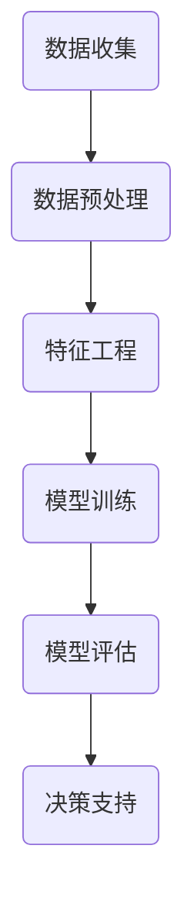

                 

### 第1章 引言与概述

> **关键词**：人工智能，个性化健康管理，健康风险预测，机器学习，深度学习，大数据分析

**摘要**：
随着人工智能（AI）技术的飞速发展，其在医疗健康领域的应用越来越广泛。个性化健康管理作为AI的一个重要应用方向，旨在通过大数据分析和机器学习技术，为个体提供精准的健康风险评估和个性化健康建议。本章将介绍人工智能在个性化健康管理中的应用背景和意义，概述本文将要探讨的AI驱动的健康风险预测模型。

---

**1.1 书籍背景与目标**
本书旨在为研究人员、工程师以及对人工智能在健康管理领域应用感兴趣的读者提供一个全面的指南。通过系统地介绍人工智能的基础知识、个性化健康管理的基本概念以及AI驱动的健康风险预测模型，本书旨在帮助读者深入理解这一领域的核心原理和实践应用。

**1.2 个性化健康管理的现状**
个性化健康管理是指利用个体化的健康数据，通过机器学习和数据分析技术，为个体提供定制化的健康服务。目前，这一领域已经取得了显著进展，包括疾病的早期预测、个性化治疗方案推荐等。然而，个性化健康管理仍然面临数据隐私、模型准确性和临床转化等挑战。

**1.3 人工智能在健康管理中的应用前景**
人工智能在健康管理中的应用前景广阔。通过深度学习和大数据分析，AI可以帮助识别健康风险因素，预测疾病发生，甚至制定个性化健康干预策略。随着技术的进步和数据量的增加，个性化健康管理有望实现更高的准确性和实用性。

---

**Mermaid流程图：个性化健康管理的基本流程**

**1.4 本章结构**
本章首先介绍了人工智能在个性化健康管理中的应用背景和意义，然后概述了本书的研究内容和目标。接下来，我们将详细介绍个性化健康管理的基本概念和技术框架，为后续章节的深入探讨打下基础。

