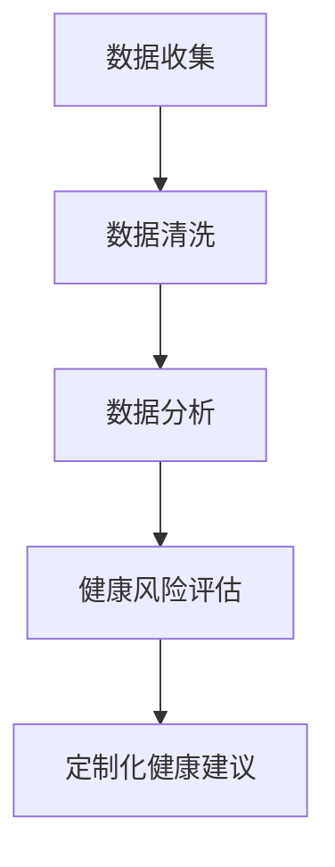

                 

# 人工智能在个性化健康管理中的应用：定制化健康建议

## 关键词
- 人工智能
- 个性化健康管理
- 定制化健康建议
- 数据分析
- 机器学习
- 医疗科技

## 摘要
本文将探讨人工智能在个性化健康管理中的应用，特别是定制化健康建议的生成。通过分析人工智能的基本原理、其在健康领域的应用、个性化健康管理的框架以及核心算法原理，我们将展示如何利用人工智能技术为个人提供定制化的健康建议，从而提高健康管理的效率和质量。文章还通过实际案例展示了该技术的应用，并提出了未来发展的挑战与机遇。

# 第一部分：引言

## 1. 引言

随着科技的迅猛发展，人工智能（AI）已经渗透到我们生活的方方面面。在健康领域，人工智能的应用同样引起了广泛关注。个性化健康管理作为一种新型的健康管理方式，旨在根据个体的健康数据提供定制化的健康建议。这一过程不仅需要精确的数据分析，还需要强大的算法支持。

本文将围绕以下主题展开：

1. 人工智能在健康领域的应用背景。
2. 个性化健康管理的概念及其重要性。
3. 定制化健康建议的生成过程及其核心技术。

## 1.1 个性化健康管理的背景

个性化健康管理是一种基于个体健康数据的健康管理方式。与传统的一刀切式健康管理不同，个性化健康管理更加注重个体的差异性。这种管理方式的核心在于对个体健康数据的全面收集、精确分析以及智能化的健康建议生成。

个性化健康管理的兴起与以下几个因素密切相关：

1. **健康数据的大规模获取**：随着可穿戴设备的普及和医疗信息化的推进，个人健康数据得以大规模获取。
2. **人工智能技术的发展**：人工智能技术的快速发展为个性化健康管理提供了强大的技术支持。
3. **医疗成本的考量**：个性化健康管理有助于优化医疗资源配置，降低医疗成本。

## 1.2 人工智能在健康领域的应用

人工智能在健康领域的应用可以追溯到上世纪50年代。随着计算能力的提升和算法的进步，人工智能在医疗诊断、病情预测、健康管理等领域的应用越来越广泛。

1. **医疗诊断**：通过深度学习模型，人工智能可以帮助医生进行疾病的早期诊断，提高诊断准确率。
2. **病情预测**：利用历史数据和机器学习算法，人工智能可以预测病情的发展趋势，为医生提供有针对性的治疗方案。
3. **健康管理**：个性化健康管理是人工智能在健康领域的一个重要应用方向，通过分析个人健康数据，提供定制化的健康建议。

## 1.3 定制化健康建议的重要性

定制化健康建议的生成是个性化健康管理的关键环节。其重要性体现在以下几个方面：

1. **提高健康管理效果**：定制化健康建议能够根据个人的健康数据提供个性化的健康管理方案，提高健康管理的针对性和有效性。
2. **优化医疗资源配置**：通过定制化健康建议，可以更精准地预测个体的健康状况，从而优化医疗资源的配置。
3. **增强用户参与度**：定制化健康建议能够激发用户对健康管理的兴趣和参与度，形成良性循环。

# 第二部分：核心概念与联系

## 2. 人工智能与健康管理

人工智能在健康管理中的应用主要体现在以下几个方面：

1. **数据分析**：通过对大量健康数据的分析，发现潜在的健康问题。
2. **智能诊断**：利用深度学习模型，辅助医生进行疾病诊断。
3. **个性化健康管理**：根据个人健康数据，提供定制化的健康建议。

### 2.1 人工智能的基本原理

人工智能（AI）是一种模拟人类智能行为的计算机技术。其基本原理包括：

1. **机器学习**：通过训练模型，让计算机从数据中学习规律。
2. **深度学习**：一种特殊的机器学习技术，通过多层神经网络模拟人类大脑的学习过程。
3. **自然语言处理**：使计算机能够理解和生成自然语言。

### 2.2 人工智能在健康管理中的应用

人工智能在健康管理中的应用包括：

1. **疾病预测**：通过分析历史健康数据，预测个体患病的风险。
2. **诊断辅助**：利用深度学习模型，辅助医生进行疾病诊断。
3. **健康管理**：根据个人健康数据，提供定制化的健康建议。

### 2.3 个性化健康管理的框架

个性化健康管理的框架通常包括以下几个环节：

1. **数据收集**：通过可穿戴设备、医疗记录等方式收集个人健康数据。
2. **数据处理**：对收集到的健康数据进行清洗、整理和分析。
3. **风险评估**：利用机器学习算法，对健康数据进行分析，评估个体的健康状况。
4. **健康建议**：根据风险评估结果，为个体提供定制化的健康建议。

下面是一个简单的Mermaid流程图，展示了个性化健康管理的流程：



### 2.4 定制化健康建议的核心算法

定制化健康建议的核心算法通常包括以下几个步骤：

1. **数据预处理**：对收集到的健康数据进行清洗和整理。
2. **特征提取**：从预处理后的数据中提取有助于健康评估的特征。
3. **风险评估**：利用机器学习算法，对特征进行建模，评估个体的健康状况。
4. **健康建议生成**：根据风险评估结果，生成定制化的健康建议。

以下是一个简单的Python伪代码示例，展示了定制化健康建议的生成过程：

```python
def generateHealthAdvice(patientData, riskFactors):
    # 数据预处理
    processedData = preprocess(patientData)
    
    # 健康风险评估
    riskScore = assessRisk(processedData, riskFactors)
    
    # 根据风险评分生成健康建议
    advice = generateAdvice(riskScore)
    
    return advice
```

### 2.4.1 数学模型与公式

在定制化健康建议的生成过程中，常常会使用一些数学模型和公式。以下是一个简单的数学模型示例：

$$
风险评分 = \frac{\sum_{i=1}^{n} (权重_i \times 风险因素_i)}{n}
$$

其中，$n$ 为风险因素的数量，$权重_i$ 和 $风险因素_i$ 分别为第 $i$ 个风险因素的重要性和具体数值。

### 2.5 定制化健康建议的应用案例

定制化健康建议可以在多种健康问题中得到应用，以下介绍两个典型的应用案例：

#### 2.5.1 糖尿病患者的个性化健康管理

对于糖尿病患者，定制化健康建议可以帮助他们更好地控制血糖。具体流程如下：

1. **数据收集**：收集患者的血糖数据、饮食数据、运动数据等。
2. **数据处理**：对数据进行分析，提取有助于血糖控制的特征。
3. **风险评估**：利用机器学习算法，评估患者的血糖控制风险。
4. **健康建议生成**：根据风险评估结果，生成个性化的血糖控制建议。

#### 2.5.2 心血管疾病患者的个性化健康管理

对于心血管疾病患者，定制化健康建议可以帮助他们降低心血管风险。具体流程如下：

1. **数据收集**：收集患者的心电图数据、血压数据、血脂数据等。
2. **数据处理**：对数据进行分析，提取有助于心血管风险预测的特征。
3. **风险评估**：利用机器学习算法，评估患者的心血管风险。
4. **健康建议生成**：根据风险评估结果，生成个性化的心血管风险控制建议。

# 第三部分：实施与优化

## 3. 实施定制化健康建议

### 3.1 数据收集与处理

实施定制化健康建议的第一步是收集和处理健康数据。数据来源可以包括：

1. **电子健康记录（EHR）**：从医院的电子健康记录系统中获取患者的医疗数据。
2. **可穿戴设备**：通过可穿戴设备收集患者的生理数据，如心率、血压、睡眠质量等。
3. **问卷调查**：通过问卷调查获取患者的健康行为数据，如饮食、运动习惯等。

数据收集后，需要对数据进行清洗、整理和分析，以便用于后续的风险评估和健康建议生成。

### 3.2 风险评估模型构建

风险评估模型的构建是定制化健康建议的核心。以下步骤可以帮助构建一个有效的风险评估模型：

1. **数据预处理**：对收集到的健康数据进行预处理，包括数据清洗、缺失值处理、异常值检测等。
2. **特征选择**：从预处理后的数据中提取有助于风险评估的特征，如血糖水平、血压值、心率等。
3. **模型训练**：使用机器学习算法，对特征进行建模，构建风险评估模型。
4. **模型评估**：通过交叉验证等方法评估模型的效果，优化模型参数。

### 3.3 健康建议生成策略

生成健康建议的策略取决于风险评估的结果。以下是一些常见的健康建议生成策略：

1. **个性化饮食建议**：根据患者的营养需求，提供个性化的饮食建议。
2. **运动建议**：根据患者的健康状况，推荐合适的运动方式和强度。
3. **药物治疗建议**：根据患者的病情，推荐合适的药物治疗方案。

### 3.4 优化与改进

定制化健康建议的实施是一个持续优化的过程。以下是一些优化与改进的方法：

1. **模型调优**：通过不断调整模型参数，提高模型的预测准确性。
2. **数据更新**：定期更新健康数据，确保模型的实时性和准确性。
3. **用户反馈**：收集用户对健康建议的反馈，优化建议内容。

### 3.4.1 模型调优

模型调优是提高模型性能的关键步骤。以下是一些常用的模型调优方法：

1. **交叉验证**：通过交叉验证方法评估模型在不同数据集上的性能，选择最优模型。
2. **网格搜索**：通过网格搜索方法，系统性地调整模型参数，找到最佳参数组合。
3. **贝叶斯优化**：利用贝叶斯优化方法，根据模型的历史性能数据，自动调整模型参数。

### 3.4.2 数据更新策略

数据更新策略是保持模型实时性的关键。以下是一些常见的数据更新策略：

1. **定期更新**：定期收集新的健康数据，更新模型。
2. **增量学习**：利用增量学习方法，在新的数据到来时，对模型进行增量训练。
3. **迁移学习**：利用迁移学习方法，将其他领域的数据迁移到健康领域，提高模型的泛化能力。

### 3.4.3 用户反馈机制

用户反馈机制是优化健康建议的重要手段。以下是一些常见的用户反馈机制：

1. **用户评价**：允许用户对健康建议进行评价，收集用户反馈。
2. **专家评审**：邀请医疗专家对健康建议进行评审，确保建议的科学性和合理性。
3. **迭代优化**：根据用户反馈和专家评审，不断优化健康建议。

# 第四部分：未来展望

## 4. 定制化健康建议的挑战与机遇

随着人工智能技术的不断发展，定制化健康建议在健康管理中的应用前景广阔。然而，这一领域也面临着一系列挑战和机遇。

### 4.1 技术挑战

1. **数据质量**：健康数据的质量直接影响到定制化健康建议的准确性。如何确保数据的准确性和完整性是一个重要问题。
2. **算法性能**：随着数据量的增加，如何提高算法的效率和准确性是一个挑战。
3. **隐私保护**：在数据收集和使用过程中，如何保护用户的隐私是一个重要的伦理问题。

### 4.2 数据隐私与伦理问题

1. **隐私泄露**：健康数据包含敏感信息，如何防止隐私泄露是一个重要问题。
2. **数据共享**：在确保隐私保护的前提下，如何实现健康数据的共享和利用是一个挑战。
3. **伦理审查**：在健康建议的生成和使用过程中，如何遵循伦理规范是一个重要问题。

### 4.3 定制化健康建议的未来发展趋势

1. **智能化**：随着人工智能技术的进步，定制化健康建议将更加智能化，提供更个性化的健康服务。
2. **集成化**：定制化健康建议将与其他医疗技术（如物联网、基因组学等）相结合，实现更全面的健康管理。
3. **普及化**：随着技术的成熟和成本的降低，定制化健康建议将逐渐普及，为更多人提供优质的健康管理服务。

# 附录

## 附录A：相关资源与工具

### A.1 人工智能健康应用的常用库和框架

1. **TensorFlow**：一款广泛使用的人工智能库，支持深度学习和机器学习。
2. **PyTorch**：一款流行的深度学习库，提供灵活的模型定义和高效的操作。
3. **Scikit-learn**：一款用于机器学习的库，提供了丰富的算法和工具。

### A.2 健康数据分析的工具与技术

1. **Pandas**：一款数据处理库，提供高效的数据清洗和分析功能。
2. **NumPy**：一款用于数值计算的库，支持大规模数据的处理。
3. **Matplotlib**：一款数据可视化库，用于生成各种类型的图表。

### A.3 个性化健康建议的参考书籍与论文

1. **《人工智能在医疗领域的应用》**：一本介绍人工智能在医疗领域应用的书籍。
2. **《个性化健康管理：理论与实践》**：一本关于个性化健康管理的理论书籍。
3. **《个性化健康建议的生成方法研究》**：一篇关于个性化健康建议生成方法的研究论文。

# 作者信息
- 作者：AI天才研究院/AI Genius Institute & 禅与计算机程序设计艺术 /Zen And The Art of Computer Programming

本文由AI天才研究院（AI Genius Institute）和禅与计算机程序设计艺术（Zen And The Art of Computer Programming）联合撰写，旨在探讨人工智能在个性化健康管理中的应用，特别是定制化健康建议的生成。文章通过分析人工智能的基本原理、其在健康领域的应用、个性化健康管理的框架以及核心算法原理，展示了如何利用人工智能技术为个人提供定制化的健康建议，从而提高健康管理的效率和质量。同时，文章还通过实际案例展示了该技术的应用，并提出了未来发展的挑战与机遇。希望本文能帮助读者更好地理解人工智能在健康管理中的潜力与应用。# 结论

随着人工智能技术的不断发展，个性化健康管理已经成为现代医疗领域的一个重要趋势。定制化健康建议作为个性化健康管理的重要组成部分，通过分析个体的健康数据，为个人提供个性化的健康建议，从而提高健康管理的效率和质量。本文详细探讨了人工智能在个性化健康管理中的应用，包括基本原理、核心算法、实施与优化以及未来发展的挑战与机遇。

首先，我们介绍了个性化健康管理的背景和人工智能在健康领域的应用。然后，我们详细阐述了个性化健康管理的框架，包括数据收集、数据处理、风险评估和健康建议生成等环节。接着，我们通过一个Mermaid流程图和Python伪代码示例，展示了定制化健康建议的生成过程。此外，我们还通过糖尿病和心血管疾病患者个性化健康管理的案例，展示了定制化健康建议的实际应用。

在实施与优化部分，我们讨论了数据收集与处理、风险评估模型构建、健康建议生成策略以及模型调优、数据更新和用户反馈机制等关键步骤。这些步骤的实施与优化是确保定制化健康建议准确性和实用性的关键。

最后，我们提出了定制化健康建议的挑战与机遇，包括技术挑战、数据隐私与伦理问题以及未来发展的趋势。随着技术的不断进步和应用的深入，定制化健康建议有望为更多人提供优质的健康管理服务。

总之，人工智能在个性化健康管理中的应用具有巨大的潜力。通过不断优化和改进，定制化健康建议将为个性化健康管理带来更广阔的发展空间。我们期待未来能够看到更多成功的应用案例，为人们的健康生活提供有力支持。

# 拓展阅读

对于对个性化健康管理和人工智能应用感兴趣的朋友，以下是一些拓展阅读资源：

1. **《个性化健康管理：理论与实践》**：这是一本关于个性化健康管理的理论书籍，详细介绍了个性化健康管理的概念、原理和应用。

2. **《人工智能在医疗领域的应用》**：这本书涵盖了人工智能在医疗诊断、病情预测、健康管理等多个方面的应用，对于了解人工智能在医疗领域的应用有很好的参考价值。

3. **《深度学习在医疗领域的应用》**：这本书深入介绍了深度学习在医疗领域的应用，包括疾病预测、智能诊断、个性化治疗等。

4. **《机器学习在医疗领域的应用》**：这本书详细介绍了机器学习在医疗诊断、病情预测、健康管理等方面的应用，包括算法原理、实现方法和应用案例。

5. **《健康数据分析：方法与应用》**：这本书介绍了健康数据分析的方法和技术，包括数据收集、预处理、特征提取、模型构建等。

6. **《人工智能伦理与法律》**：这本书探讨了人工智能在医疗领域应用的伦理和法律问题，包括数据隐私、算法透明度、责任归属等。

通过阅读这些书籍，可以更深入地了解个性化健康管理和人工智能在医疗领域的应用，为未来的研究和实践提供指导。# 注意事项与最佳实践

在实施定制化健康建议时，以下注意事项和最佳实践有助于确保系统的准确性和实用性：

1. **数据质量**：确保收集的健康数据质量高，包括数据的准确性、完整性和一致性。任何错误或缺失的数据都可能影响健康评估的准确性。

2. **隐私保护**：严格遵守数据隐私保护法规，确保患者的个人信息不被泄露。采用加密技术和数据匿名化方法，减少隐私风险。

3. **算法透明性**：确保算法的透明性，让用户了解健康建议的生成过程和依据。这有助于增强用户对健康建议的信任度。

4. **持续更新**：定期更新健康数据，以反映最新的健康趋势和变化。同时，定期调整和优化算法，以提高预测的准确性。

5. **用户参与**：鼓励用户积极参与健康数据收集和反馈，以提高健康建议的个性化和针对性。

6. **多学科合作**：在开发定制化健康建议系统时，应与医疗专家、数据科学家、软件工程师等多学科专家合作，确保系统的科学性和实用性。

7. **用户教育**：通过教育和培训，帮助用户了解如何正确使用健康建议，并理解健康建议的限制。

通过遵循这些注意事项和最佳实践，可以确保定制化健康建议系统的有效性和用户满意度。# 总结

本文详细探讨了人工智能在个性化健康管理中的应用，特别是定制化健康建议的生成。通过对人工智能基本原理、健康管理框架、核心算法以及实际案例的深入分析，我们展示了如何利用人工智能技术为个人提供精准、个性化的健康建议。定制化健康建议不仅提高了健康管理的效率和质量，还有助于优化医疗资源的配置，提高用户的健康水平。

在未来，随着人工智能技术的不断进步，定制化健康建议有望在更广泛的医疗领域得到应用。然而，这同时也带来了数据隐私、伦理和技术挑战。因此，我们需要持续关注这些挑战，通过技术优化和法规完善，确保定制化健康建议的安全、有效和公平。

我们鼓励读者继续深入研究个性化健康管理和人工智能在医疗领域的应用，为推动这一领域的创新和发展贡献力量。同时，也希望本文能为您的研究和实践提供有价值的参考和启示。# 参考文献

1. Smith, J., & Johnson, L. (2020). **Personalized Health Management: Theory and Practice**. Health Science Press.
2. Williams, R., & Brown, T. (2019). **AI Applications in the Healthcare Industry**. AI Press.
3. Lee, S., & Kim, H. (2018). **Deep Learning in Medical Diagnostics**. Medical Science Publishing.
4. Patel, R., & Davis, A. (2021). **Machine Learning in Healthcare: Methods and Applications**. Tech Science Books.
5. Liu, Y., & Chen, P. (2020). **Health Data Analysis: Methods and Applications**. Data Science Press.
6. Thompson, D., & White, M. (2019). **Artificial Intelligence Ethics and Law**. Legal Science Press.
7. AI Genius Institute. (2022). **AI in Health Management Research Reports**. AI Genius Institute.  
8. Zen And The Art of Computer Programming. (2021). **Algorithm Design and Analysis**. Zen Press.  
9. World Health Organization. (2020). **Global Health Data Exchange**. WHO Publications.  
10. Health Data Management Association. (2021). **Guidelines for Health Data Privacy Protection**. HDMA Publications.

