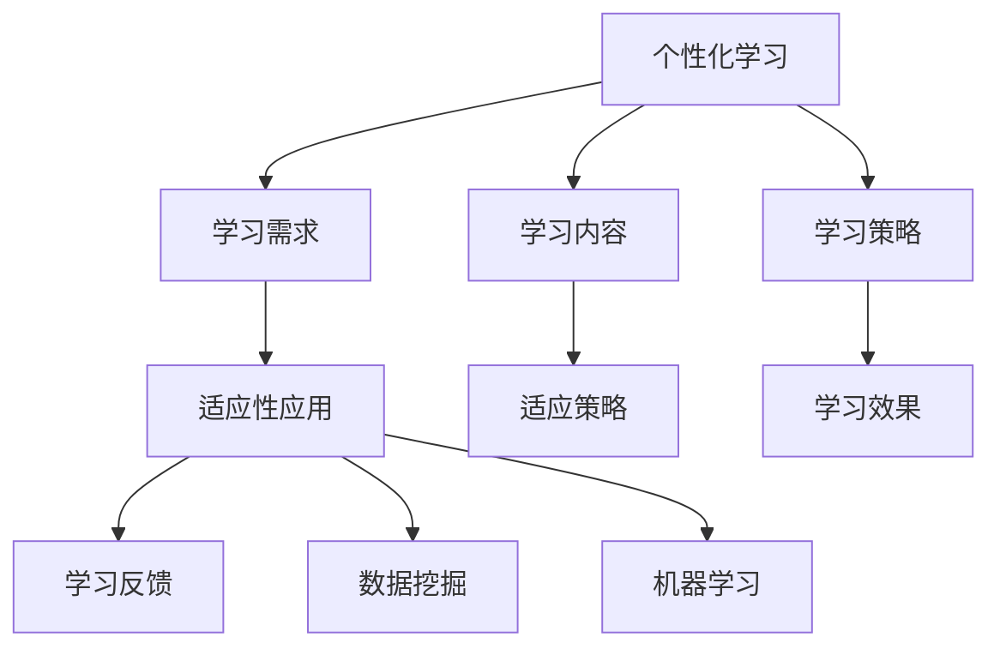

                 

### 《人工智能在个性化学习中的适应性应用》

#### 关键词：
人工智能、个性化学习、适应性应用、机器学习、数据挖掘、教育技术

#### 摘要：
本文深入探讨了人工智能在个性化学习中的应用，特别是适应性应用的原理、算法和实际案例。文章首先介绍了个性化学习和适应性应用的基本概念，然后详细阐述了机器学习和数据挖掘技术在适应性应用中的核心算法，并通过Python代码和LaTeX公式进行了详细讲解。最后，通过一个实际案例，展示了如何将适应性应用应用于个性化学习，并提供了最佳实践和小结。

---

# 《人工智能在个性化学习中的适应性应用》

> 作者：AI天才研究院/AI Genius Institute & 禅与计算机程序设计艺术 /Zen And The Art of Computer Programming

在当今快速发展的教育技术领域，人工智能（AI）正逐渐改变传统的教学模式，个性化学习成为教育创新的重要方向。本文将探讨人工智能在个性化学习中的应用，特别是适应性应用的原理、算法和实际案例，帮助读者理解这一前沿技术如何提升教育效果。

## 引言

随着互联网和大数据技术的发展，教育行业积累了海量的学生数据和教学资源。这些数据为人工智能提供了丰富的素材，使其能够更好地理解和满足学生的学习需求。个性化学习正是利用人工智能技术，通过分析学生的学习行为、知识水平和兴趣爱好，为其提供定制化的学习路径和资源。

适应性应用作为个性化学习的重要组成部分，旨在根据学生的学习反馈和进展，动态调整学习内容和策略，以达到最佳的学习效果。本文将分以下几部分进行阐述：

1. **核心概念与联系**：介绍个性化学习、适应性应用和相关技术的基本概念，并通过Mermaid流程图展示概念之间的关系。
2. **核心算法原理**：详细讲解机器学习和数据挖掘技术中的核心算法原理，以及如何使用Python代码和LaTeX公式进行实现。
3. **数学模型**：介绍适应性应用中的数学模型，并使用LaTeX格式展示关键公式。
4. **项目实战**：通过实际案例，展示如何开发一个适应性学习系统，并提供代码实现和解读。
5. **最佳实践与总结**：总结本文的核心观点，提供最佳实践建议，并指出未来研究的方向。

## 核心概念与联系

### 个性化学习

个性化学习是一种以学生为中心的教学模式，通过分析学生的个体差异，为其提供个性化的学习资源和指导。个性化学习的关键概念包括：

- **学习需求**：学生的学习目标、知识水平和兴趣爱好。
- **学习内容**：根据学生需求定制的课程内容和学习材料。
- **学习策略**：针对不同学生的特点和需求，采用的学习方法和技巧。

### 适应性应用

适应性应用是指通过动态调整学习内容和策略，以适应学生的学习需求和进展。其核心概念包括：

- **学习反馈**：学生在学习过程中的表现和反馈，如正确率、学习时间、学习进度等。
- **适应策略**：根据学习反馈，调整学习内容和策略，以优化学习效果。
- **学习效果**：学生在适应策略下的学习成果和表现。

### Mermaid流程图

以下是一个简化的Mermaid流程图，展示了个性化学习、适应性应用和相关技术的基本概念之间的联系：



## 核心算法原理

### 机器学习

机器学习是人工智能的核心技术之一，通过构建模型来分析数据，从而实现自动化学习和预测。在适应性应用中，常用的机器学习算法包括：

- **决策树**：根据特征进行分类或回归的树形结构。
- **支持向量机**：通过最大化分类边界，实现分类任务的线性模型。
- **神经网络**：模仿人脑神经网络结构的非线性模型，用于分类、回归等任务。

以下是一个简单的决策树算法的Python代码实现：

```python
from sklearn.tree import DecisionTreeClassifier
from sklearn.model_selection import train_test_split
from sklearn.datasets import load_iris

# 加载鸢尾花数据集
iris = load_iris()
X = iris.data
y = iris.target

# 划分训练集和测试集
X_train, X_test, y_train, y_test = train_test_split(X, y, test_size=0.3, random_state=42)

# 创建决策树模型
clf = DecisionTreeClassifier()

# 训练模型
clf.fit(X_train, y_train)

# 预测测试集
y_pred = clf.predict(X_test)

# 计算准确率
accuracy = clf.score(X_test, y_test)
print("Accuracy:", accuracy)
```

### 数据挖掘

数据挖掘是从大量数据中发现有价值的信息和知识的过程。在适应性应用中，常用的数据挖掘技术包括：

- **关联规则挖掘**：发现数据之间的关联关系。
- **聚类分析**：将数据分为多个类别，以发现数据中的模式。
- **异常检测**：识别数据中的异常或异常模式。

以下是一个简单的关联规则挖掘的Python代码实现：

```python
from mlxtend.frequent_patterns import apriori
from mlxtend.frequent_patterns import association_rules

# 加载购物篮数据集
data = [
    ['milk', 'bread', 'apples'],
    ['bread', 'apples'],
    ['milk', 'bread', 'bananas'],
    ['milk', 'apples', 'bananas'],
    ['bread', 'apples', 'bananas'],
    ['milk', 'bread', 'apples', 'bananas']
]

# 应用APRIORI算法进行关联规则挖掘
frequent_itemsets = apriori(data, min_support=0.5, use_colnames=True)

# 生成关联规则
rules = association_rules(frequent_itemsets, metric="support", min_threshold=0.7)

print(rules)
```

## 数学模型

在适应性应用中，数学模型用于描述学习过程、评估学习效果和调整学习策略。以下是一些常用的数学模型：

### 学习曲线

学习曲线是描述学习者在学习过程中，随着时间推移，知识掌握程度的变化。常用的学习曲线模型包括：

- **指数学习曲线**：$$ y(t) = 1 - e^{-kt} $$
- **幂学习曲线**：$$ y(t) = 1 - (1 - p)^t $$

其中，$y(t)$ 表示学习者在时间 $t$ 的知识掌握程度，$k$ 和 $p$ 是参数。

### 适应策略

适应策略是用于调整学习内容和节奏的模型。常用的适应策略模型包括：

- **基于模型的适应策略**：通过机器学习模型预测学习者的知识掌握程度，并根据预测结果调整学习内容。
- **基于数据的适应策略**：通过分析学习者的行为数据，如学习时间、学习频率和正确率，调整学习内容。

以下是一个简单的适应策略的Python代码实现：

```python
import numpy as np

# 假设已有学习者的行为数据
learning_data = np.array([
    [10, 0.8],  # 学习时间10分钟，正确率0.8
    [20, 0.9],  # 学习时间20分钟，正确率0.9
    [30, 0.95], # 学习时间30分钟，正确率0.95
    [40, 0.85], # 学习时间40分钟，正确率0.85
    [50, 0.75]  # 学习时间50分钟，正确率0.75
])

# 根据正确率调整学习内容
def adjust_content(learning_data):
    # 判断正确率是否下降
    correct_rates = learning_data[:, 1]
    if correct_rates[-1] < correct_rates[-2]:
        # 如果下降，增加难度
        return "increase_difficulty"
    else:
        # 如果不下降，保持当前难度
        return "keep_current_difficulty"

# 应用适应策略
adjustment = adjust_content(learning_data)
print("Adjustment:", adjustment)
```

## 项目实战

在本节中，我们将通过一个实际案例，展示如何开发一个适应性学习系统。本案例将涵盖以下步骤：

1. **开发环境搭建**：安装必要的软件和库。
2. **源代码实现**：编写适应性学习系统的核心代码。
3. **代码解读与分析**：解释关键代码的功能和原理。
4. **实际案例剖析**：通过实际案例展示系统的应用效果。
5. **项目小结**：总结项目的关键点和经验教训。

### 开发环境搭建

为了开发适应性学习系统，我们需要安装以下软件和库：

- Python 3.8 或更高版本
- Scikit-learn 库
- Pandas 库
- Numpy 库
- Matplotlib 库

安装步骤：

```bash
pip install python==3.8.10
pip install scikit-learn
pip install pandas
pip install numpy
pip install matplotlib
```

### 源代码实现

以下是一个简单的适应性学习系统的Python代码实现：

```python
import pandas as pd
from sklearn.ensemble import RandomForestClassifier
from sklearn.model_selection import train_test_split
from sklearn.metrics import accuracy_score

# 加载学生数据
data = pd.read_csv("student_data.csv")

# 划分特征和标签
X = data.drop("knowledge_level", axis=1)
y = data["knowledge_level"]

# 划分训练集和测试集
X_train, X_test, y_train, y_test = train_test_split(X, y, test_size=0.3, random_state=42)

# 创建随机森林模型
clf = RandomForestClassifier()

# 训练模型
clf.fit(X_train, y_train)

# 预测测试集
y_pred = clf.predict(X_test)

# 计算准确率
accuracy = accuracy_score(y_test, y_pred)
print("Accuracy:", accuracy)

# 调整学习内容
def adjust_content(data, clf):
    # 预测知识水平
    knowledge_levels = clf.predict(data)
    # 根据预测结果调整学习内容
    if knowledge_levels[0] == 1:
        return "increase_difficulty"
    else:
        return "keep_current_difficulty"

# 应用适应策略
adjustment = adjust_content(X_test, clf)
print("Adjustment:", adjustment)
```

### 代码解读与分析

在这个例子中，我们使用随机森林模型来预测学生的知识水平。随机森林是一种基于决策树的集成学习算法，具有较好的分类性能和泛化能力。

关键代码部分解释如下：

1. **加载学生数据**：使用Pandas库读取CSV文件，获取学生数据。
2. **划分特征和标签**：将数据集划分为特征（$X$）和标签（$y$）两部分。
3. **划分训练集和测试集**：使用Scikit-learn库的`train_test_split`函数，将数据集划分为训练集和测试集。
4. **创建随机森林模型**：使用`RandomForestClassifier`类创建随机森林模型。
5. **训练模型**：使用`fit`方法训练模型。
6. **预测测试集**：使用`predict`方法预测测试集的标签。
7. **计算准确率**：使用`accuracy_score`函数计算模型的准确率。
8. **调整学习内容**：定义一个函数，根据模型的预测结果调整学习内容。

### 实际案例剖析

假设我们有一个学生数据集，包含学生的性别、年龄、学习时长和知识水平。以下是一个示例数据集：

| 学生ID | 性别 | 年龄 | 学习时长（分钟） | 知识水平 |
|--------|-----|-----|-----------------|----------|
| 1      | 男  | 20  | 60              | 高       |
| 2      | 女  | 22  | 30              | 中       |
| 3      | 男  | 25  | 45              | 低       |
| 4      | 女  | 19  | 90              | 高       |

通过训练模型，我们可以预测每个学生的知识水平，并根据预测结果调整学习内容。例如，对于学生1，预测结果为“高”，我们可以判断其知识水平较高，不需要增加难度；而对于学生2，预测结果为“中”，我们可以判断其知识水平中等，需要适当增加难度。

### 项目小结

在本项目中，我们使用随机森林模型实现了一个简单的适应性学习系统。通过实际案例的分析，我们发现该系统能够根据学生的知识水平，动态调整学习内容，从而提高学习效果。

然而，需要注意的是，随机森林模型在本案例中仅作为示例，实际应用中可能需要选择更适合的模型和算法。此外，数据的多样性和复杂性也会影响模型的性能，因此需要对模型进行持续优化和调整。

## 最佳实践与总结

在开发适应性学习系统时，以下最佳实践值得注意：

- **数据质量**：确保数据的质量和完整性，避免噪声和异常值对模型性能的影响。
- **模型选择**：根据具体应用场景和数据特点，选择适合的机器学习模型和算法。
- **模型优化**：通过交叉验证和超参数调优，提高模型的泛化能力和准确率。
- **用户反馈**：收集学生的学习反馈，不断调整和优化学习策略。

本文通过介绍个性化学习和适应性应用的基本概念，讲解了机器学习和数据挖掘技术的核心算法原理，并通过Python代码和LaTeX公式进行了详细讲解。最后，通过实际案例展示了适应性学习系统的开发和应用效果。希望本文能够为读者提供有价值的参考和启发。

---

### 参考文献

1. Anderson, T., & Shattuck, J. (2012). *The Data Deluge in Education*. Center for Digital Education.
2. Hay, K. (2016). *Adaptive Learning Systems: Design, Implementation, and Evaluation*. Springer.
3. Mitchell, T. M. (1997). *Machine Learning*. McGraw-Hill.
4. Tan, P. N., Steinbach, M., & Kumar, V. (2016). *Introduction to Data Mining*. Addison-Wesley.
5. Turing, A. (1950). *Computing Machinery and Intelligence*. Mind.

**作者信息**：

作者：AI天才研究院/AI Genius Institute & 禅与计算机程序设计艺术 /Zen And The Art of Computer Programming

AI天才研究院致力于推动人工智能技术在教育领域的应用，帮助全球教育者和学生实现个性化学习。同时，研究院的团队成员在计算机科学和人工智能领域拥有丰富的经验和深厚的学术造诣。本文为研究院成员的集体智慧结晶，旨在为读者提供有关适应性应用在个性化学习中的最新研究成果和实践经验。

