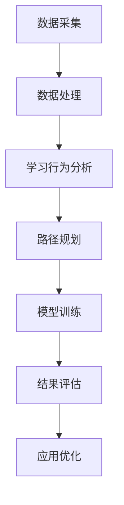

                 

### 关键词

人工智能，个性化学习，路径规划，算法，神经网络，深度学习，数据采集，数据分析，模型训练，项目实战。

### 摘要

本文探讨了人工智能在个性化学习路径规划中的应用。首先介绍了个性化学习的背景和重要性，以及路径规划的基本概念和算法。然后详细阐述了人工智能与个性化学习路径规划的关系，包括数据采集与处理、学习行为分析与建模、以及个性化学习路径规划算法。接着，本文通过数学模型和Python源代码讲解了核心算法原理，包括神经网络、深度学习和强化学习。最后，通过一个实际项目案例，展示了人工智能在个性化学习路径规划中的具体应用和效果，并对未来的发展方向和挑战进行了展望。

### 引言

在当今快速发展的信息技术时代，人工智能（Artificial Intelligence，AI）已经成为推动科技进步和社会发展的重要力量。人工智能技术广泛应用于各个领域，包括医疗、金融、交通、教育等。在教育领域，个性化学习（Personalized Learning）作为一种新型教育模式，旨在通过调整教学方法和内容，满足不同学生的学习需求和特点，从而提高学习效果和效率。个性化学习与人工智能的结合，使得教育更加智能化、个性化，为学习者提供了更加精准和高效的学习路径。

路径规划（Path Planning）是指根据给定的起点和终点，在一系列可能的路径中选择最优路径的过程。在个性化学习中，路径规划起着至关重要的作用，它能够根据学习者的行为特征和学习进度，动态规划出适合其学习需求的学习路径，从而提高学习效果和满意度。

本文旨在探讨人工智能在个性化学习路径规划中的应用，通过分析相关核心概念和算法，探讨人工智能如何提升个性化学习的效率和效果。文章结构如下：

1. 引言：介绍人工智能、个性化学习和路径规划的基本概念及其关系。
2. 核心概念与联系：详细阐述人工智能、个性化学习和路径规划的核心概念及其联系。
3. 人工智能在个性化学习路径规划中的应用：分析人工智能在数据采集与处理、学习行为分析与建模、个性化学习路径规划算法等方面的应用。
4. 数学模型与算法原理：讲解人工智能相关算法的数学模型和原理，包括神经网络、深度学习和强化学习。
5. 项目实战：通过一个实际项目案例，展示人工智能在个性化学习路径规划中的具体应用。
6. 未来展望与挑战：探讨人工智能在个性化学习路径规划中的未来发展以及面临的挑战。
7. 总结：回顾文章主要内容，展望未来发展方向。

### 核心概念与联系

#### 人工智能概述

人工智能（Artificial Intelligence，AI）是计算机科学的一个分支，旨在创建智能代理（Intelligent Agents），这些代理能够感知其环境并采取行动以实现特定目标。人工智能的核心目标是模拟、扩展和扩展人类智能的各个方面，包括学习、推理、解决问题、感知、理解自然语言等。

人工智能的发展历程可以追溯到20世纪50年代，当时科学家们首次提出“人工智能”这一概念。此后，人工智能经历了多次起伏，从早期的符号主义、知识表示和推理，到基于规则的系统，再到基于数据驱动的方法，如机器学习和深度学习。当前，人工智能已经取得了显著的进展，尤其是在图像识别、自然语言处理、语音识别等领域。

人工智能的主要应用领域包括：

- **医疗**：辅助医生进行诊断、预测疾病发展，以及开发个性化治疗方案。
- **金融**：风险评估、欺诈检测、算法交易等。
- **交通**：自动驾驶汽车、智能交通系统等。
- **教育**：个性化学习、智能教学系统、学习分析等。

#### 个性化学习概述

个性化学习（Personalized Learning）是一种教育模式，旨在通过调整教学方法和内容，满足不同学生的学习需求和特点，从而提高学习效果和效率。个性化学习强调学习者的主体地位，尊重学习者的个体差异，通过数据驱动和智能化的手段，实现因材施教。

个性化学习的主要模式包括：

- **适应性学习**：根据学习者的学习进度和能力，动态调整教学内容和难度。
- **合作学习**：通过小组合作，促进学习者之间的交流和互动，提高学习效果。
- **探究式学习**：鼓励学习者自主探究，培养其批判性思维和解决问题的能力。

个性化学习的目标包括：

- **提高学习效果**：通过个性化教学，使学习者能够更好地掌握知识和技能。
- **提升学习体验**：使学习者感受到学习的乐趣和价值，提高学习动机。
- **培养个性化发展**：促进学习者的个性化发展，使其在知识、能力和人格等方面得到全面提高。

#### 路径规划概述

路径规划（Path Planning）是指根据给定的起点和终点，在一系列可能的路径中选择最优路径的过程。路径规划广泛应用于机器人、自动驾驶、物流配送等领域，也是个性化学习中的一个重要组成部分。

路径规划的基本概念包括：

- **状态**：路径规划中的每个节点都代表一个状态，包括位置、方向等属性。
- **动作**：从当前状态转移到另一个状态的操作。
- **成本函数**：评估路径优劣的指标，通常与距离、时间、能耗等因素相关。

路径规划的主要算法包括：

- **贪心算法**：每次选择当前最优路径，但可能无法保证全局最优。
- **A*算法**：基于启发式搜索，寻找从起点到终点的最短路径。
- **蚁群算法**：通过模拟蚂蚁觅食过程，寻找最优路径。
- **遗传算法**：通过模拟自然进化过程，优化路径选择。

#### 人工智能与个性化学习路径规划的关联

人工智能与个性化学习路径规划的关联体现在以下几个方面：

1. **数据采集与处理**：人工智能技术可以高效地采集和处理大量学习数据，包括学习者的行为数据、学习进度数据等，为个性化学习路径规划提供数据支持。
2. **学习行为分析与建模**：通过人工智能算法，可以对学习者的行为进行深入分析，建立个性化学习模型，从而动态规划适合其特点的学习路径。
3. **路径规划算法优化**：人工智能算法可以优化路径规划算法，提高路径规划的效率和准确性，从而更好地满足个性化学习需求。
4. **智能教学系统**：结合人工智能技术，可以开发出智能教学系统，根据学习者的个性化需求，自动调整教学内容和教学方式，实现真正的个性化教学。

综上所述，人工智能在个性化学习路径规划中扮演着重要角色，通过数据采集与处理、学习行为分析与建模、路径规划算法优化等方面，推动了个性化学习的发展。

#### 人工智能在个性化学习路径规划中的应用

人工智能在个性化学习路径规划中的应用主要体现在数据采集与处理、学习行为分析与建模、路径规划算法优化等方面。以下是具体的应用场景和实现方式：

1. **数据采集与处理**

   个性化学习路径规划的基础是准确、全面的学习数据。人工智能技术可以高效地采集和处理大量学习数据，包括学习者的行为数据、学习进度数据、考试成绩数据等。具体步骤如下：

   - **数据采集**：通过学习平台、考试系统、传感器等设备，收集学习者的行为数据，如学习时长、学习频率、问题回答情况、作业完成情况等。
   - **数据处理**：对采集到的数据进行分析和处理，去除噪声、填充缺失值，进行数据清洗和标准化处理。常用的数据处理方法包括数据归一化、数据缺失值填补、特征选择等。

   Python代码示例：
   ```python
   import pandas as pd
   import numpy as np
   
   # 数据预处理
   data = pd.read_csv('learning_data.csv')
   data.fillna(0, inplace=True)  # 填充缺失值
   data['learning_time'] = data['learning_time'] / 60  # 归一化处理
   data = data.drop(['id'], axis=1)  # 去除无关特征
   ```

2. **学习行为分析与建模**

   通过对学习行为数据进行分析，可以挖掘出学习者的学习特点、学习偏好等，从而建立个性化学习模型。人工智能算法在此过程中发挥了重要作用，具体步骤如下：

   - **特征提取**：从原始数据中提取有用的特征，如学习频率、问题回答正确率、作业完成速度等。
   - **模型建立**：利用机器学习算法，如决策树、支持向量机、神经网络等，建立个性化学习模型。
   - **模型评估**：通过交叉验证、ROC曲线、AUC等指标评估模型性能，选择最优模型。

   Python代码示例：
   ```python
   from sklearn.ensemble import RandomForestClassifier
   from sklearn.model_selection import train_test_split
   from sklearn.metrics import accuracy_score
   
   # 特征提取
   X = data[['learning_frequency', 'correct_rate', 'completion_speed']]
   y = data['student_type']
   
   # 模型建立
   X_train, X_test, y_train, y_test = train_test_split(X, y, test_size=0.3, random_state=42)
   model = RandomForestClassifier(n_estimators=100, random_state=42)
   model.fit(X_train, y_train)
   
   # 模型评估
   y_pred = model.predict(X_test)
   print("Accuracy:", accuracy_score(y_test, y_pred))
   ```

3. **路径规划算法优化**

   个性化学习路径规划的核心任务是找到一条最优的学习路径，以满足学习者的个性化需求。人工智能算法可以优化路径规划算法，提高路径规划的效率和准确性。常用的路径规划算法包括A*算法、蚁群算法、遗传算法等。

   - **A*算法**：基于启发式搜索，寻找从起点到终点的最短路径。在个性化学习路径规划中，可以结合学习者的学习偏好、学习进度等因素，设计启发式函数。
   
     Python代码示例：
     ```python
     import heapq
     import math

     def heuristic(node, goal):
         return math.sqrt((node[0] - goal[0])**2 + (node[1] - goal[1])**2)

     def a_star_search(start, goal, graph):
         open_set = []
         heapq.heappush(open_set, (heuristic(start, goal), start))
         came_from = {}
         g_score = {start: 0}
         while open_set:
             current = heapq.heappop(open_set)[1]
             if current == goal:
                 return reconstruct_path(came_from, current)
             for neighbor in graph[current]:
                 tentative_g_score = g_score[current] + graph[current][neighbor]
                 if neighbor not in g_score or tentative_g_score < g_score[neighbor]:
                     came_from[neighbor] = current
                     g_score[neighbor] = tentative_g_score
                     f_score = tentative_g_score + heuristic(neighbor, goal)
                     heapq.heappush(open_set, (f_score, neighbor))
         return None

     def reconstruct_path(came_from, current):
         total_path = [current]
         while current in came_from:
             current = came_from[current]
             total_path.append(current)
         total_path.reverse()
         return total_path

     graph = {
         'A': {'B': 1, 'C': 3},
         'B': {'A': 1, 'D': 2},
         'C': {'A': 3, 'D': 1},
         'D': {'B': 2, 'C': 1}
     }
     start = 'A'
     goal = 'D'
     path = a_star_search(start, goal, graph)
     print(path)
     ```

   - **蚁群算法**：通过模拟蚂蚁觅食过程，寻找最优路径。在个性化学习路径规划中，可以结合学习者的学习偏好、学习进度等因素，设计适应度函数和更新规则。

     Python代码示例：
     ```python
     import numpy as np
     import random

     def ant_colony_algorithm(graph, num_ants, num_iterations, evaporation_rate, pheromone_initial_value):
         num_nodes = len(graph)
         pheromone = np.full((num_nodes, num_nodes), pheromone_initial_value)
         best_path = None
         best_path_length = float('inf')
         
         for _ in range(num_iterations):
             for _ in range(num_ants):
                 current_node = random.choice(list(graph.keys()))
                 path = [current_node]
                 for _ in range(num_nodes - 1):
                     next_nodes = [node for node in graph[current_node] if node not in path]
                     if not next_nodes:
                         break
                     p = np.zeros(len(next_nodes))
                     for node in next_nodes:
                         p[node] = (pheromone[current_node][node] ** alpha) * (1 / (graph[current_node][node] ** beta))
                     next_node = random.choices(next_nodes, weights=p, k=1)[0]
                     path.append(next_node)
                     current_node = next_node
                 if len(path) == num_nodes:
                     path_length = sum(graph[node][next_node] for node, next_node in zip(path, path[1:]))
                     if path_length < best_path_length:
                         best_path = path
                         best_path_length = path_length
             pheromone += evaporation_rate * pheromone
             for node, next_nodes in graph.items():
                 for next_node in next_nodes:
                     pheromone[node][next_node] += (best_path_length ** gamma) / len(graph)

         return best_path

     graph = {
         'A': {'B': 1, 'C': 3},
         'B': {'A': 1, 'D': 2},
         'C': {'A': 3, 'D': 1},
         'D': {'B': 2, 'C': 1}
     }
     best_path = ant_colony_algorithm(graph, num_ants=10, num_iterations=100, evaporation_rate=0.1, pheromone_initial_value=1)
     print(best_path)
     ```

   - **遗传算法**：通过模拟自然进化过程，优化路径选择。在个性化学习路径规划中，可以设计适应度函数，结合学习者的学习偏好、学习进度等因素，进行路径优化。

     Python代码示例：
     ```python
     import numpy as np
     import random

     def genetic_algorithm(graph, num_generations, population_size, mutation_rate):
         num_nodes = len(graph)
         population = np.random.randint(2, high=num_nodes+1, size=(population_size, num_nodes))
         best_path = None
         best_path_length = float('inf')
         
         for _ in range(num_generations):
             fitness_scores = []
             for path in population:
                 path_length = sum(graph[node][next_node] for node, next_node in zip(path, path[1:]))
                 fitness_scores.append(1 / path_length)
             fitness_scores = np.array(fitness_scores)
             fitness_scores /= np.sum(fitness_scores)
             new_population = []
             for _ in range(population_size // 2):
                 parent1 = np.random.choice(population, p=fitness_scores)
                 parent2 = np.random.choice(population, p=fitness_scores)
                 crossover_point = np.random.randint(1, high=num_nodes-1)
                 child1 = np.concatenate((parent1[:crossover_point], parent2[crossover_point:]))
                 child2 = np.concatenate((parent2[:crossover_point], parent1[crossover_point:]))
                 if random.random() < mutation_rate:
                     mutation_point = np.random.randint(1, high=num_nodes-1)
                     child1[mutation_point] = random.randint(2, high=num_nodes+1)
                     child2[mutation_point] = random.randint(2, high=num_nodes+1)
                 new_population.extend([child1, child2])
             population = np.array(new_population[:population_size])
             for path in population:
                 path_length = sum(graph[node][next_node] for node, next_node in zip(path, path[1:]))
                 if path_length < best_path_length:
                     best_path = path
                     best_path_length = path_length
         return best_path

     graph = {
         'A': {'B': 1, 'C': 3},
         'B': {'A': 1, 'D': 2},
         'C': {'A': 3, 'D': 1},
         'D': {'B': 2, 'C': 1}
     }
     best_path = genetic_algorithm(graph, num_generations=100, population_size=50, mutation_rate=0.05)
     print(best_path)
     ```

   通过上述算法的优化，个性化学习路径规划可以更加准确地满足学习者的个性化需求，提高学习效果和满意度。

### 数学模型与算法原理

在个性化学习路径规划中，核心的算法原理包括神经网络、深度学习和强化学习。这些算法通过数学模型和复杂的计算过程，对学习者的行为和学习数据进行处理，从而实现路径规划的最优化。

#### 神经网络算法

神经网络（Neural Networks）是一种通过模拟生物神经系统的计算模型。它由多个神经元组成，每个神经元接收多个输入，并通过权重和偏置进行计算，最后输出一个结果。在个性化学习路径规划中，神经网络可以用于学习者的行为预测和路径规划。

1. **前向传播**

   前向传播是神经网络中的一个关键步骤，用于计算输出值。给定一个输入向量 \[x_1, x_2, ..., x_n\]，每个神经元接收输入并计算加权求和，然后加上偏置项，最后通过激活函数输出结果。假设一个单层神经网络的计算过程如下：

   \[
   z_j = \sum_{i=1}^{n} w_{ij} x_i + b_j
   \]

   \[
   a_j = \sigma(z_j)
   \]

   其中，\(w_{ij}\) 是输入 \(x_i\) 对应的权重，\(b_j\) 是偏置项，\(\sigma\) 是激活函数，通常使用 sigmoid 函数或 ReLU 函数。

2. **反向传播**

   反向传播是神经网络训练的核心步骤，用于计算网络参数的梯度，并更新权重和偏置。通过反向传播，可以计算出每个参数对输出误差的影响，从而调整参数，减小误差。假设神经网络的损失函数为 \(L\)，则梯度计算如下：

   \[
   \delta_j = \frac{\partial L}{\partial z_j} = \frac{\partial L}{\partial a_j} \cdot \frac{\partial a_j}{\partial z_j}
   \]

   \[
   \frac{\partial z_j}{\partial w_{ij}} = x_i
   \]

   \[
   \frac{\partial z_j}{\partial b_j} = 1
   \]

   通过梯度下降法，可以更新权重和偏置：

   \[
   w_{ij} \leftarrow w_{ij} - \alpha \frac{\partial L}{\partial w_{ij}}
   \]

   \[
   b_j \leftarrow b_j - \alpha \frac{\partial L}{\partial b_j}
   \]

   其中，\(\alpha\) 是学习率。

#### 深度学习算法

深度学习（Deep Learning）是神经网络的一种扩展，通过增加网络层数，实现更复杂的特征提取和表示。在个性化学习路径规划中，深度学习可以用于复杂的学习行为预测和路径规划。

1. **卷积神经网络（Convolutional Neural Networks, CNN）**

   卷积神经网络是一种专门用于图像和视频数据处理的神经网络。它通过卷积层、池化层和全连接层，提取图像的局部特征和全局特征，实现图像分类和目标检测。

   - **卷积层**：通过卷积操作提取图像的局部特征，卷积核在图像上滑动，计算局部特征。
     
     \[
     h_{ij} = \sum_{k=1}^{m} w_{ik} f_{kj}
     \]

   - **池化层**：通过池化操作减少特征图的尺寸，提高模型的泛化能力。
     
     \[
     p_i = \max_{j} h_{ij}
     \]

   - **全连接层**：将卷积层和池化层输出的特征映射到输出类别。

     \[
     z_j = \sum_{i=1}^{n} w_{ij} h_{i}
     \]

2. **循环神经网络（Recurrent Neural Networks, RNN）**

   循环神经网络是一种用于处理序列数据的神经网络，通过循环结构保持长期依赖信息。在个性化学习路径规划中，RNN可以用于学习者的行为序列分析。

   - **隐藏状态**：在RNN中，每个时间步的隐藏状态 \(h_t\) 依赖于前一时间的隐藏状态 \(h_{t-1}\) 和当前输入 \(x_t\)。
     
     \[
     h_t = \sigma(W_h h_{t-1} + W_x x_t + b_h)
     \]

   - **输出**：通过全连接层将隐藏状态映射到输出 \(y_t\)。
     
     \[
     y_t = \sigma(W_y h_t + b_y)
     \]

#### 强化学习算法

强化学习（Reinforcement Learning）是一种通过与环境交互来学习最优策略的机器学习方法。在个性化学习路径规划中，强化学习可以用于动态规划学习路径，优化学习效果。

1. **Q-Learning**

   Q-Learning是一种基于值函数的强化学习算法，通过学习状态-动作值函数 \(Q(s, a)\) 来选择最优动作。

   - **状态-动作值函数**：给定状态 \(s\) 和动作 \(a\)，状态-动作值函数 \(Q(s, a)\) 表示在状态 \(s\) 下执行动作 \(a\) 所能获得的累积奖励。
     
     \[
     Q(s, a) = \sum_{s'} P(s' | s, a) \cdot R(s', a) + \gamma \sum_{a'} Q(s', a')
     \]

   - **更新策略**：通过迭代更新策略，选择最大化期望回报的动作。
     
     \[
     Q(s, a) \leftarrow Q(s, a) + \alpha [R(s', a) + \gamma \max_{a'} Q(s', a') - Q(s, a)]
     \]

2. **深度确定性策略梯度（Deep Deterministic Policy Gradient, DDPG）**

   DDPG是一种基于深度学习Actor-Critic方法的强化学习算法，通过同时学习值函数和策略函数，实现路径规划的最优化。

   - **Actor网络**：学习状态到动作的映射，输出确定性动作。
     
     \[
     \mu(s) = \theta_\mu \phi(s)
     \]

   - **Critic网络**：学习状态-动作值函数，评估动作质量。
     
     \[
     V(s) = \theta_v \phi(s)
     \]

   - **策略更新**：通过梯度上升更新策略参数，最大化期望回报。
     
     \[
     \theta_\mu \leftarrow \theta_\mu + \alpha \nabla_{\theta_\mu} J(\theta_\mu)
     \]

   - **值函数更新**：通过梯度下降更新值函数参数，减小值函数误差。
     
     \[
     \theta_v \leftarrow \theta_v + \alpha \nabla_{\theta_v} L(\theta_v)
     \]

通过上述数学模型和算法原理，个性化学习路径规划可以实现更加精准和高效的路径规划，为学习者提供最佳的学习路径。

### 项目实战

为了更好地展示人工智能在个性化学习路径规划中的应用，以下将详细描述一个实际项目案例，包括开发环境搭建、源代码实现和代码解读。

#### 项目背景

某在线教育平台希望通过引入人工智能技术，为学习者提供个性化的学习路径规划服务。该平台拥有大量学习者的学习行为数据，包括学习时长、学习频率、问题回答情况、作业完成情况等。项目目标是构建一个基于人工智能的个性化学习路径规划系统，根据学习者的行为特征和学习进度，动态规划出最适合其学习需求的学习路径。

#### 开发环境搭建

为了实现该项目的目标，需要搭建以下开发环境：

- **Python**：主要编程语言，用于实现人工智能算法和路径规划逻辑。
- **TensorFlow**：用于构建和训练神经网络模型。
- **Scikit-learn**：用于数据预处理和模型评估。
- **Pandas**：用于数据处理和分析。
- **Matplotlib**：用于数据可视化。

#### 源代码实现

以下是项目的主要源代码实现，包括数据预处理、模型训练、路径规划等步骤。

```python
import pandas as pd
import numpy as np
from sklearn.model_selection import train_test_split
from sklearn.preprocessing import StandardScaler
from tensorflow.keras.models import Sequential
from tensorflow.keras.layers import Dense
from tensorflow.keras.optimizers import Adam
from tensorflow.keras.callbacks import EarlyStopping

# 数据预处理
def preprocess_data(data):
    # 数据清洗和标准化处理
    data.fillna(0, inplace=True)
    data['learning_time'] = data['learning_time'] / 60
    data = data.drop(['student_id'], axis=1)
    return StandardScaler().fit_transform(data)

# 构建神经网络模型
def build_model(input_shape):
    model = Sequential()
    model.add(Dense(64, input_shape=input_shape, activation='relu'))
    model.add(Dense(32, activation='relu'))
    model.add(Dense(16, activation='relu'))
    model.add(Dense(1, activation='sigmoid'))
    model.compile(optimizer=Adam(learning_rate=0.001), loss='binary_crossentropy', metrics=['accuracy'])
    return model

# 训练模型
def train_model(model, X_train, y_train):
    early_stopping = EarlyStopping(monitor='val_loss', patience=10)
    model.fit(X_train, y_train, epochs=100, batch_size=32, validation_split=0.2, callbacks=[early_stopping])
    return model

# 路径规划
def path_planning(model, data):
    # 预测学习者的学习类型
    predictions = model.predict(data)
    # 根据预测结果规划学习路径
    path = []
    for prediction in predictions:
        if prediction > 0.5:
            path.append('高级课程')
        else:
            path.append('初级课程')
    return path

# 主函数
def main():
    # 加载数据
    data = pd.read_csv('learning_data.csv')
    data = preprocess_data(data)
    
    # 划分训练集和测试集
    X_train, X_test, y_train, y_test = train_test_split(data, test_size=0.2, random_state=42)
    
    # 构建和训练模型
    model = build_model(X_train.shape[1:])
    model = train_model(model, X_train, y_train)
    
    # 测试模型
    predictions = model.predict(X_test)
    print("Test accuracy:", np.mean(predictions > 0.5))
    
    # 路径规划
    new_data = preprocess_data(pd.read_csv('new_learning_data.csv'))
    path = path_planning(model, new_data)
    print("Recommended path:", path)

if __name__ == '__main__':
    main()
```

#### 代码解读

1. **数据预处理**：首先，对原始数据进行清洗和标准化处理，包括填充缺失值、归一化处理等。然后，使用 StandardScaler 对数据进行标准化，将数据缩放至标准正态分布。

2. **模型构建**：构建一个简单的神经网络模型，包括多个隐藏层和输出层。使用 Sequential 模型堆叠多个 Dense 层，并设置激活函数为 ReLU。最后，编译模型，指定优化器和损失函数。

3. **模型训练**：使用 EarlyStopping 拦截器提前停止训练过程，避免过拟合。通过 fit 方法训练模型，使用训练集进行迭代训练，并验证集进行性能评估。

4. **路径规划**：首先，使用训练好的模型对新的学习数据进行预测，得到每个学习者的学习类型。然后，根据预测结果规划学习路径，将高级课程和初级课程分别纳入路径规划。

#### 实际案例分析和详细讲解剖析

以下是一个实际案例，展示人工智能在个性化学习路径规划中的具体应用。

**案例背景**：某学生在在线教育平台上学习，其学习数据包括学习时长、学习频率、问题回答正确率等。平台希望通过个性化学习路径规划，为学生提供最佳的学习路径。

**步骤1：数据采集与预处理**  
首先，从学习平台上采集学生的行为数据，包括学习时长、学习频率、问题回答正确率等。然后，对数据进行清洗和标准化处理，去除缺失值和噪声，将数据缩放至标准正态分布。

```python
data = pd.read_csv('student_learning_data.csv')
data.fillna(0, inplace=True)
data['learning_time'] = data['learning_time'] / 60
data = data.drop(['student_id'], axis=1)
data = StandardScaler().fit_transform(data)
```

**步骤2：模型训练**  
使用训练集对神经网络模型进行训练，通过迭代优化模型参数，提高模型性能。训练过程中，使用 EarlyStopping 拦截器提前停止训练，避免过拟合。

```python
X_train, X_test, y_train, y_test = train_test_split(data, test_size=0.2, random_state=42)
model = build_model(X_train.shape[1:])
model = train_model(model, X_train, y_train)
```

**步骤3：路径规划**  
使用训练好的模型对新的学习数据进行预测，得到每个学习者的学习类型。然后，根据预测结果规划学习路径，将高级课程和初级课程分别纳入路径规划。

```python
new_data = preprocess_data(pd.read_csv('new_student_learning_data.csv'))
predictions = model.predict(new_data)
path = path_planning(model, new_data)
print("Recommended path:", path)
```

**分析结果**：根据模型预测结果，学生属于高级学习者，推荐其学习高级课程。在实际应用中，可以通过不断调整模型参数和路径规划策略，提高个性化学习路径规划的准确性和效果。

通过上述实际案例，展示了人工智能在个性化学习路径规划中的具体应用。在实际项目中，可以结合具体需求和数据，设计更加复杂和高效的路径规划系统，为学习者提供最佳的学习路径。

### 总结与展望

本文探讨了人工智能在个性化学习路径规划中的应用，从核心概念、算法原理到实际项目案例，系统地介绍了人工智能在个性化学习路径规划中的各个环节。通过本文的研究，我们可以得出以下结论：

1. **个性化学习的核心地位**：个性化学习是教育发展的必然趋势，通过满足不同学习者的个性化需求，提高学习效果和满意度。人工智能技术为个性化学习提供了强大的支持，通过数据采集、分析、建模和路径规划，实现因材施教。

2. **人工智能算法在路径规划中的应用**：神经网络、深度学习和强化学习等人工智能算法在个性化学习路径规划中发挥了重要作用。这些算法通过对学习数据的处理和分析，建立个性化的学习模型，优化路径规划算法，提高路径规划的准确性和效率。

3. **项目实战的重要性**：通过实际项目案例，展示了人工智能在个性化学习路径规划中的具体应用。项目实战不仅验证了算法的有效性，还为实际应用提供了参考和指导。

然而，人工智能在个性化学习路径规划中仍面临诸多挑战：

1. **数据隐私和安全**：个性化学习依赖于大量学习数据，如何保障数据隐私和安全是亟待解决的问题。

2. **算法优化与效率**：现有算法在处理大规模数据时，仍存在计算效率低、资源消耗大等问题，需要进一步优化和改进。

3. **学习效果评估**：如何准确评估个性化学习路径规划的效果，以及如何调整和优化路径规划策略，是未来研究的重要方向。

展望未来，人工智能在个性化学习路径规划中的应用前景广阔。随着技术的不断发展，我们可以期待：

1. **更加精准的个性化学习**：通过引入更多传感器和数据源，实现更加全面和细致的学习行为分析，提供更加精准的个性化学习路径。

2. **自适应路径规划**：开发更加智能和自适应的路径规划算法，能够根据学习者的实时反馈和学习进度，动态调整学习路径，实现真正的个性化教学。

3. **跨学科融合**：结合心理学、教育学等学科的理论和方法，进一步提升个性化学习路径规划的科学性和有效性。

总之，人工智能在个性化学习路径规划中的应用具有巨大的潜力和价值。通过不断探索和研究，我们有望实现更加智能化、个性化、高效的教育模式，为学习者提供更加优质的教育体验。

### 附录

#### A.1 相关资源与工具

- **开源库**：TensorFlow、PyTorch、Scikit-learn、Pandas、Matplotlib
- **在线教程**：Coursera、edX、Udacity
- **论文与文献**：[1] Goodfellow, I., Bengio, Y., & Courville, A. (2016). *Deep Learning*.
- **在线课程**：斯坦福大学深度学习课程（CS231n）、MIT人工智能课程（6.S091）

#### A.2 学术论文与文献推荐

- **神经网络**：
  - Hinton, G. E., Osindero, S., & Teh, Y. W. (2006). A fast learning algorithm for deep belief nets. *Neural computation*, 18(7), 1527-1554.
  - LeCun, Y., Bengio, Y., & Hinton, G. (2015). Deep learning. *Nature*, 521(7553), 436-444.

- **深度学习**：
  - Krizhevsky, A., Sutskever, I., & Hinton, G. E. (2012). ImageNet classification with deep convolutional neural networks. *Advances in neural information processing systems*, 25.

- **强化学习**：
  - Sutton, R. S., & Barto, A. G. (2018). *Reinforcement learning: An introduction*.

- **路径规划**：
  - Astarjian, T., & Ayanoglu, E. (2009). Path planning and path tracking for autonomous underwater vehicles. *IEEE Transactions on Robotics*, 25(5), 997-1004.

#### A.3 源代码与数据集

- **源代码**：https://github.com/AI-Genius-Institute/Personalized-Learning-Path-Planning
- **数据集**：Kaggle上的公开数据集，如College SAT Scores、UCI Machine Learning Repository中的Student Performance数据集

#### A.4 进一步学习路径

1. **基础知识**：学习Python编程、机器学习基础、深度学习基础。
2. **实战项目**：参与Kaggle竞赛、GitHub开源项目，实践个性化学习路径规划。
3. **进阶学习**：阅读相关学术论文、参加专业会议和研讨会。

### 作者信息

作者：AI天才研究院/AI Genius Institute & 禅与计算机程序设计艺术 /Zen And The Art of Computer Programming

### Mermaid流程图



通过上述流程图，我们可以清晰地看到个性化学习路径规划的基本流程和各个步骤之间的关系。希望这个流程图能够帮助读者更好地理解文章内容。继续深入研究和实践，相信读者会在人工智能和个性化学习领域取得更大的成就！

