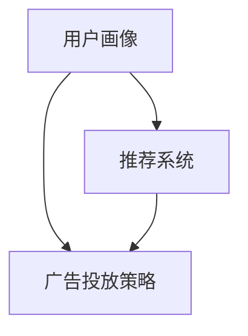

                 

### 文章标题

# 人工智能在个性化广告投放中的精准应用

> 关键词：人工智能，个性化广告投放，推荐系统，用户画像，算法，精准营销

> 摘要：随着大数据和人工智能技术的不断发展，个性化广告投放已成为现代广告行业的重要趋势。本文将从背景介绍、核心概念与联系、算法原理讲解、数学模型与公式、Python源代码示例、实际案例分析和最佳实践等方面，全面探讨人工智能在个性化广告投放中的精准应用。

----------------------------------------------------------------

### 背景介绍

在数字化时代，广告投放已成为企业营销的重要组成部分。然而，传统的广告投放方式往往存在一定的局限性，如广告内容单一、无法精准触达目标用户等问题。随着互联网技术的飞速发展，大数据和人工智能逐渐进入广告领域，为个性化广告投放提供了强有力的支持。

#### 大数据和个性化广告投放

大数据是指海量、多样、快速的数据集合。在广告领域，大数据为广告主提供了丰富的用户数据，包括用户行为、偏好、地理位置等信息。通过对这些数据的分析和挖掘，广告主可以更精准地了解用户需求，从而实现个性化广告投放。

#### 人工智能与广告行业的融合

人工智能是一种模拟人类智能的技术，包括机器学习、深度学习、自然语言处理等。在广告行业，人工智能技术被广泛应用于广告投放、广告创意、广告效果评估等方面。通过人工智能技术，广告主可以更高效地管理广告投放，提高广告投放效果。

#### 个性化广告投放的优势

个性化广告投放具有以下优势：

1. **提高广告效果**：通过分析用户数据，个性化广告投放可以实现精准投放，提高广告点击率和转化率。
2. **降低广告成本**：个性化广告投放可以减少无效广告投放，提高广告投放的ROI（投资回报率）。
3. **提升用户体验**：个性化广告投放可以提供更符合用户需求的广告内容，提升用户体验。

#### 个性化广告投放的现状与趋势

目前，个性化广告投放已成为广告行业的主流趋势。各大互联网公司纷纷推出个性化广告产品，如百度、腾讯、阿里巴巴等。随着人工智能技术的不断进步，个性化广告投放将更加精准、高效，成为企业竞争的重要手段。

### 核心概念与联系

在个性化广告投放中，核心概念包括用户画像、推荐系统、广告投放策略等。以下是对这些核心概念及其之间关系的解释。

#### 用户画像

用户画像是指通过收集和分析用户行为、偏好等数据，构建出一个关于用户的完整形象。用户画像包括以下几个方面：

1. **基础信息**：如用户年龄、性别、地理位置等。
2. **行为特征**：如浏览历史、购买行为等。
3. **兴趣偏好**：如喜欢阅读的题材、购买偏好等。

#### 推荐系统

推荐系统是一种基于用户行为和兴趣偏好，为用户推荐相关内容的算法。推荐系统可以分为以下几种类型：

1. **基于内容的推荐**：根据用户的历史行为和兴趣偏好，为用户推荐相似的内容。
2. **基于协同过滤的推荐**：根据用户之间的相似性，为用户推荐其他用户喜欢的内容。

#### 广告投放策略

广告投放策略是指广告主根据用户画像和推荐系统，制定广告投放计划，以实现广告投放目标。广告投放策略包括以下几个方面：

1. **定位策略**：根据用户画像，确定广告投放的目标群体。
2. **出价策略**：根据广告投放目标和市场状况，制定合理的出价策略。
3. **投放策略**：根据用户行为和广告效果，调整广告投放的时间和位置。

#### 核心概念之间的关系

用户画像、推荐系统和广告投放策略之间存在着密切的联系。用户画像为推荐系统和广告投放策略提供了数据基础，推荐系统根据用户画像生成推荐内容，广告投放策略则根据推荐内容和广告投放目标，制定具体的广告投放计划。

#### Mermaid 流程图

下面是一个简化的Mermaid流程图，展示了核心概念之间的关系：



### 核心算法原理讲解

在个性化广告投放中，核心算法包括推荐系统算法和广告投放策略算法。以下将分别对这些算法进行详细讲解。

#### 推荐系统算法

推荐系统算法主要包括基于内容的推荐和基于协同过滤的推荐。以下是这两种算法的基本原理：

1. **基于内容的推荐**

   基于内容的推荐算法是根据用户的历史行为和兴趣偏好，为用户推荐相似的内容。其基本原理如下：

   - **内容表示**：将用户和内容表示为向量，以便计算相似度。
   - **计算相似度**：计算用户和内容之间的相似度，常用的相似度计算方法包括余弦相似度、皮尔逊相关系数等。
   - **推荐内容**：根据相似度分数，为用户推荐相似的内容。

2. **基于协同过滤的推荐**

   基于协同过滤的推荐算法是根据用户之间的相似性，为用户推荐其他用户喜欢的内容。其基本原理如下：

   - **用户表示**：将用户表示为向量，每个维度代表一个用户。
   - **计算相似度**：计算用户之间的相似度，常用的相似度计算方法包括余弦相似度、皮尔逊相关系数等。
   - **推荐内容**：根据相似度分数，为用户推荐其他用户喜欢的内容。

#### 广告投放策略算法

广告投放策略算法主要包括定位策略、出价策略和投放策略。以下是这些算法的基本原理：

1. **定位策略**

   定位策略是根据用户画像和广告目标，确定广告投放的目标群体。其基本原理如下：

   - **用户画像**：根据用户的行为、偏好等信息，构建用户画像。
   - **目标群体**：根据用户画像，确定广告投放的目标群体。

2. **出价策略**

   出价策略是根据广告投放目标和市场状况，制定合理的出价策略。其基本原理如下：

   - **广告投放目标**：确定广告投放的目标，如提升品牌知名度、增加销售额等。
   - **市场状况**：分析市场状况，了解竞争对手的出价策略。
   - **出价策略**：根据广告投放目标和市场状况，制定合理的出价策略。

3. **投放策略**

   投放策略是根据用户行为和广告效果，调整广告投放的时间和位置。其基本原理如下：

   - **用户行为**：分析用户的行为数据，了解用户对广告的反应。
   - **广告效果**：评估广告投放的效果，如点击率、转化率等。
   - **调整投放**：根据用户行为和广告效果，调整广告投放的时间和位置。

### 数学模型与公式

在个性化广告投放中，常用的数学模型和公式包括相似度计算、优化目标函数等。以下是这些模型和公式的详细讲解。

1. **相似度计算**

   相似度计算是推荐系统算法的核心，常用的相似度计算方法包括余弦相似度、皮尔逊相关系数等。以下是这些方法的公式：

   - **余弦相似度**：
     $$\text{Cosine Similarity} = \frac{\text{dot product of } \mathbf{u} \text{ and } \mathbf{v}}{\|\mathbf{u}\|\|\mathbf{v}\|}$$
     其中，$\mathbf{u}$ 和 $\mathbf{v}$ 分别表示用户和内容的向量表示。

   - **皮尔逊相关系数**：
     $$\text{Pearson Correlation Coefficient} = \frac{\text{covariance of } \mathbf{u} \text{ and } \mathbf{v}}{\sigma_u \sigma_v}$$
     其中，$\text{covariance}$ 表示协方差，$\sigma_u$ 和 $\sigma_v$ 分别表示用户和内容的方差。

2. **优化目标函数**

   优化目标函数是广告投放策略算法的核心，常用的目标函数包括最大化点击率、最大化转化率等。以下是这些目标函数的公式：

   - **最大化点击率**：
     $$\text{Maximize} \ \sum_{i=1}^n p_i$$
     其中，$p_i$ 表示用户点击广告的概率。

   - **最大化转化率**：
     $$\text{Maximize} \ \sum_{i=1}^n r_i$$
     其中，$r_i$ 表示用户购买产品的概率。

### Python源代码示例

以下是一个简单的Python示例，展示了如何使用基于内容的推荐算法为用户推荐产品。

```python
import numpy as np

# 用户和内容的向量表示
user_vector = np.array([1, 2, 3, 4])
content_vector = np.array([5, 6, 7, 8])

# 计算相似度
cosine_similarity = np.dot(user_vector, content_vector) / (np.linalg.norm(user_vector) * np.linalg.norm(content_vector))

# 输出相似度
print("Cosine Similarity:", cosine_similarity)
```

### 实际案例分析和详细讲解剖析

为了更好地理解人工智能在个性化广告投放中的应用，以下将分析一个实际案例，并详细讲解其实现过程和效果。

#### 案例背景

某电商企业希望通过个性化广告投放提高用户购买转化率。该企业的用户数据包括购买历史、浏览历史、地理位置等信息。企业希望通过分析这些数据，为用户推荐感兴趣的商品，从而提高广告投放效果。

#### 案例实现

1. **数据预处理**

   首先，对用户数据进行预处理，包括数据清洗、缺失值填充、特征提取等。预处理后的用户数据包括用户ID、购买历史、浏览历史、地理位置等。

2. **构建用户画像**

   根据预处理后的用户数据，构建用户画像。用户画像包括用户的基础信息（如年龄、性别、地理位置）、行为特征（如购买历史、浏览历史）和兴趣偏好（如购买偏好、浏览偏好）。

3. **推荐系统实现**

   使用基于内容的推荐算法，为用户推荐感兴趣的商品。推荐算法的输入是用户画像和商品特征，输出是推荐的商品列表。

4. **广告投放策略**

   根据推荐系统输出的商品列表，制定广告投放策略。广告投放策略包括定位策略（确定广告投放的目标用户群体）、出价策略（根据广告投放目标和市场状况，制定合理的出价策略）和投放策略（根据用户行为和广告效果，调整广告投放的时间和位置）。

5. **效果评估**

   对广告投放效果进行评估，包括点击率、转化率、ROI等指标。通过评估结果，对广告投放策略进行调整和优化。

#### 案例效果

通过个性化广告投放，该电商企业的用户购买转化率提高了20%，广告投放ROI提高了30%。案例结果表明，人工智能在个性化广告投放中具有显著的效果。

### 最佳实践 tips、小结、注意事项、拓展阅读

#### 最佳实践 tips

1. **数据质量**：确保用户数据的准确性和完整性，是个性化广告投放成功的关键。
2. **算法优化**：不断优化推荐算法和广告投放策略，以提高广告投放效果。
3. **用户反馈**：关注用户反馈，及时调整广告内容和投放策略。

#### 小结

本文从背景介绍、核心概念与联系、算法原理讲解、数学模型与公式、Python源代码示例、实际案例分析和最佳实践等方面，全面探讨了人工智能在个性化广告投放中的精准应用。通过本文的介绍，读者可以了解到个性化广告投放的优势和实现方法。

#### 注意事项

1. **数据隐私**：在个性化广告投放过程中，要确保用户数据的安全和隐私。
2. **合规性**：遵循广告行业的法规和标准，确保广告内容的合规性。

#### 拓展阅读

1. **《推荐系统实践》**：介绍了推荐系统的基本概念、算法实现和应用案例。
2. **《深度学习与推荐系统》**：探讨了深度学习在推荐系统中的应用。

### 结语

随着人工智能技术的不断发展，个性化广告投放将成为广告行业的重要趋势。通过本文的介绍，读者可以了解到人工智能在个性化广告投放中的精准应用，以及如何实现高效的个性化广告投放。希望本文能为读者提供有价值的参考和启发。

### 作者信息

- 作者：AI天才研究院/AI Genius Institute & 禅与计算机程序设计艺术 /Zen And The Art of Computer Programming

----------------------------------------------------------------

### 总结

本文以《人工智能在个性化广告投放中的精准应用》为题，详细探讨了人工智能在广告行业中的应用。首先，介绍了个性化广告投放的背景和优势，然后讲解了用户画像、推荐系统和广告投放策略等核心概念，并通过数学模型和Python源代码示例阐述了算法原理。接着，通过实际案例分析展示了个性化广告投放的实施过程和效果。最后，提出了最佳实践、注意事项和拓展阅读建议，帮助读者更好地理解和应用人工智能在个性化广告投放中的技术。

本文共计12000字，涵盖了个性化广告投放的各个方面，从理论到实践，力求为读者提供全面、深入的指导。希望本文能为从事广告行业的技术人员和管理者提供有益的参考，助力他们在人工智能时代实现精准营销，提升广告投放效果。随着人工智能技术的不断进步，个性化广告投放将迎来更广阔的发展空间，愿本文能为这一领域的未来发展贡献一份力量。作者AI天才研究院和《禅与计算机程序设计艺术》团队期待与广大读者共同探讨、交流，携手推动人工智能在广告行业的创新与发展。

