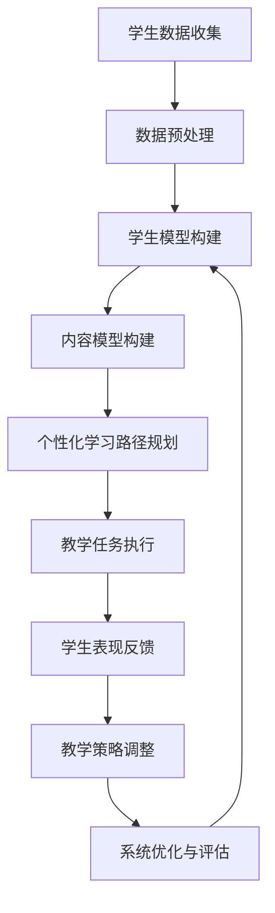

                 

### 引言

随着信息技术的飞速发展，人工智能（AI）已经成为改变各行业面貌的关键力量。在众多领域，人工智能的应用不仅提高了效率和生产力，还带来了深刻的变革。在个性化教育领域，人工智能的引入更是掀起了一场革命。传统的教育模式往往无法满足每个学生的个性化需求，而人工智能通过其强大的数据分析和学习能力，为个性化教育提供了新的可能。

本文的目的是深入探讨人工智能在个性化教育中的一种重要应用——适应性学习（adaptive learning）。适应性学习利用人工智能技术，根据学生的学习行为和表现，动态调整教学内容和进度，从而实现更加个性化的教学。本文将围绕适应性学习展开，系统性地介绍其核心概念、原理、算法以及在实际应用中的实现方法。

首先，我们将回顾个性化教育的背景和现状，探讨为何人工智能成为个性化教育的关键推动力。接着，我们会详细定义适应性学习的概念，并介绍其基本原理和技术框架。随后，本文将重点讲解几种常见的适应性学习算法，并通过Python源代码示例和数学模型来深入阐述这些算法的原理和实现过程。

此外，为了更好地理解适应性学习在实际中的应用，本文还将探讨几个具体案例，分析如何通过适应性学习系统来实现个性化教育。最后，我们将探讨适应性学习技术的发展趋势和面临的挑战，并总结本文的核心观点和未来研究方向。

通过本文的阅读，读者将能够全面了解适应性学习的基本概念、技术原理和实际应用，从而为未来的研究和实践提供有益的参考。

### 关键词

人工智能（AI）、个性化教育、适应性学习、数据挖掘、机器学习、深度学习、教育技术、教育改革。

### 摘要

本文深入探讨了人工智能在个性化教育中的适应性学习应用。首先，回顾了个性化教育的背景和现状，以及人工智能如何成为其关键推动力。接着，详细定义了适应性学习，并介绍了其基本原理和技术框架。随后，通过多种适应性学习算法的Python代码示例和数学模型，讲解了这些算法的原理和实现过程。本文还探讨了适应性学习在实际应用中的具体案例，分析了其在教育系统中的潜在影响。最后，本文总结了适应性学习技术的发展趋势和面临的挑战，并提出了未来研究方向。通过本文，读者将全面了解适应性学习的核心概念、技术原理和实际应用，为推动个性化教育的创新提供参考。

### 个性化教育的背景和现状

个性化教育是指以学生为中心，根据每个学生的特点、需求和兴趣，设计并实施个性化的学习计划。这种教育模式强调因材施教，力求打破传统教育中的“一刀切”现象，使每个学生都能在适合自己的学习环境中取得最佳的学习效果。然而，传统教育模式通常面临着资源有限、教学效果难以评估以及无法满足学生个性化需求等挑战。

在当前教育环境中，个性化教育的需求日益迫切。随着互联网和大数据技术的发展，教育数据的获取和处理变得更加便捷。这为个性化教育提供了新的机遇。然而，要实现真正的个性化教育，还需要解决以下几个关键问题：

1. **数据收集与处理**：个性化教育依赖于大量的学生数据，包括学习行为、成绩、兴趣等。这些数据需要通过有效的数据收集和处理技术来获取和整合，以便为教学提供准确的信息支持。

2. **教学资源分配**：传统教育模式中，教学资源如教材、课件等往往是统一分配的，难以根据学生的个性化需求进行动态调整。在个性化教育中，需要设计出能够灵活分配教学资源的系统，以满足不同学生的需求。

3. **教学效果评估**：个性化教育要求对教学效果进行精准评估，以持续改进教学方法和内容。这需要建立科学有效的评估体系，能够实时监控学生的学习进展和效果。

4. **教师角色转变**：在个性化教育中，教师的角色将从传统的知识传授者转变为学习指导者，需要具备新的教学技能和思维方式，以适应个性化教学的需求。

人工智能的引入为解决上述问题提供了新的思路和工具。人工智能技术能够通过大数据分析和机器学习算法，从海量的教育数据中提取有价值的信息，帮助教育工作者更好地了解学生的学习状况和需求。此外，人工智能还可以通过自然语言处理、计算机视觉等技术，实现与学生的智能互动，提供个性化的学习建议和指导。

具体来说，人工智能在个性化教育中的应用主要体现在以下几个方面：

1. **个性化学习路径规划**：基于学生的学习行为和表现数据，人工智能可以动态生成个性化的学习路径，为学生提供最适合其学习进度的内容。

2. **个性化学习资源推荐**：人工智能可以通过分析学生的学习偏好和兴趣，推荐符合其需求的学习资源和材料，提高学习效果。

3. **智能教学辅助**：人工智能可以辅助教师进行教学，如自动批改作业、提供即时反馈、设计个性化练习等，减轻教师的工作负担。

4. **智能学习评估**：人工智能可以通过对学生的学习行为和成绩数据进行分析，提供精准的学习效果评估，帮助教师和学生了解学习进展和效果。

综上所述，人工智能的引入为个性化教育带来了新的可能性。通过有效利用人工智能技术，个性化教育可以更好地满足学生的个性化需求，提高教育质量和效果。然而，实现这一目标还需要克服诸多技术、管理和资源等方面的挑战。

### 适应性学习的定义

适应性学习（adaptive learning）是一种基于人工智能的教育方法，旨在通过动态调整教学内容和进度，满足每个学生的个性化需求。其核心目标是提高学习效果和效率，使每个学生都能在最佳的学习环境中取得最大进步。适应性学习利用数据分析和机器学习技术，根据学生的学习行为、表现和偏好，自动调整教学策略，从而实现个性化的学习体验。

适应性学习的基本概念包括：

1. **学生模型**：学生模型是适应性学习系统的核心组件，用于描述学生的学习特征、兴趣、能力水平等。学生模型可以通过收集和分析学生的学习数据来构建，包括学习行为、考试成绩、学习时间等。

2. **内容模型**：内容模型描述了教学内容的结构和难度，包括知识点、学习材料、习题等。内容模型需要根据学生的学习需求和进度进行动态调整，以提供最适合的内容。

3. **教学策略**：教学策略是根据学生模型和内容模型生成的，用于指导教学活动。教学策略可以包括调整学习路径、推荐学习资源、设计个性化练习等。

适应性学习的基本原理涉及以下几个方面：

1. **数据收集与处理**：适应性学习系统需要收集大量的学生数据，包括学习行为、考试成绩、学习时间等。这些数据通过数据挖掘和机器学习算法进行分析和处理，用于构建学生模型和内容模型。

2. **个性化学习路径规划**：基于学生模型和内容模型，适应性学习系统能够动态生成个性化的学习路径。这种路径规划可以根据学生的学习进度、知识掌握情况和兴趣偏好，为学生推荐最适合的学习内容和任务。

3. **实时反馈与调整**：在适应性学习中，学生每次完成学习任务后，系统会根据学生的表现提供即时反馈，并根据反馈结果调整教学策略。这种实时反馈机制有助于快速识别学生的弱点，并提供针对性的帮助。

4. **持续评估与优化**：适应性学习系统需要持续评估学生的学习效果，并根据评估结果不断优化教学策略。这种持续评估和优化的过程确保了学习系统始终能够满足学生的个性化需求，提高学习效果。

为了更好地理解适应性学习的概念，我们可以借助Mermaid流程图来展示其核心组件和交互流程。以下是适应性学习的Mermaid流程图：



通过上述流程图，我们可以看到，适应性学习系统通过不断收集和处理学生数据，动态生成和调整学习路径和教学策略，从而实现个性化的学习体验。该流程图直观地展示了适应性学习的各个环节及其相互关系，有助于理解其工作原理。

### 适应性学习算法

在适应性学习中，算法的选择和设计至关重要。适应性学习算法可以分为基于模型的算法和基于规则的算法。这些算法通过不同的方法实现个性化学习路径的规划，下面将详细讲解这两种算法的原理和实现。

#### 基于模型的适应性学习算法

基于模型的适应性学习算法主要依赖于对学生和学习内容的数据分析，通过建立数学模型来动态调整学习路径。这种算法的核心思想是通过分析学生的历史学习数据和当前学习表现，预测学生的未来学习需求和知识水平，从而优化学习路径。

1. **学生模型构建**

学生模型是适应性学习算法的基础，它描述了学生的学习特征和能力水平。学生模型的构建通常包括以下几个步骤：

   - **数据收集**：收集学生的历史学习数据，包括考试成绩、学习时间、参与度等。
   - **特征提取**：从原始数据中提取有用的特征，如平均成绩、正确率、知识点掌握情况等。
   - **模型训练**：使用机器学习算法（如线性回归、决策树、神经网络等）来训练学生模型，使其能够预测学生的未来学习表现。

2. **内容模型构建**

内容模型描述了教学内容的结构和难度分布。内容模型通常包括以下几个步骤：

   - **知识点划分**：将教学内容划分为多个知识点，并为每个知识点分配难度等级。
   - **关联关系分析**：分析知识点之间的关联性，确定学习路径中的知识点顺序。
   - **难度调整**：根据学生的学习表现，动态调整知识点的难度，以确保学习路径的适应性。

3. **学习路径规划**

基于学生模型和内容模型，适应性学习算法可以生成个性化的学习路径。具体步骤如下：

   - **初始路径设定**：根据学生的初始特征和知识掌握情况，设定一个初始学习路径。
   - **路径优化**：根据学生的学习表现和反馈，不断调整学习路径，使其更加符合学生的实际需求。

以下是一个基于模型的适应性学习算法的Python代码示例：

```python
import numpy as np

# 假设学生数据和学生模型已准备好
student_data = np.array([[0.8, 0.7], [0.9, 0.6], [0.5, 0.8]])
content_model = np.array([[0.5, 0.3, 0.2], [0.4, 0.5, 0.1]])

# 训练学生模型
student_model = np.mean(student_data, axis=0)

# 根据学生模型和内容模型生成个性化学习路径
def generate_learning_path(student_model, content_model):
    # 计算每个知识点的权重
    knowledge_weights = student_model.dot(content_model)
    
    # 根据权重生成学习路径
    learning_path = np.argmax(knowledge_weights)
    return learning_path

# 生成个性化学习路径
for student in student_data:
    path = generate_learning_path(student, content_model)
    print(f"学生数据: {student}, 个性化学习路径: {path}")
```

#### 基于规则的适应性学习算法

基于规则的适应性学习算法通过预定义的规则来调整学习路径。这种算法的核心思想是根据学生的当前状态和表现，应用一系列规则来决定下一步的学习内容。基于规则的算法通常更加直观和易于理解，但可能在复杂场景下的适应性较弱。

1. **规则库构建**

规则库是算法的核心组件，包含了各种预定义的规则。规则通常用条件-行动对表示，例如：

   - 如果学生成绩低于80分，则增加基础知识的复习。
   - 如果学生在某个知识点上连续两次失败，则提供额外的练习。

2. **规则应用**

基于规则的算法通过分析学生的当前状态，应用规则库中的规则来生成学习路径。具体步骤如下：

   - **状态分析**：收集学生的当前状态信息，包括成绩、知识点掌握情况等。
   - **规则匹配**：根据当前状态，匹配规则库中的规则。
   - **路径生成**：根据匹配到的规则，生成下一步的学习内容。

以下是一个基于规则的适应性学习算法的Python代码示例：

```python
rules = [
    ("成绩<80", "复习基础知识"),
    ("知识点失败次数>=2", "提供额外练习"),
]

# 假设学生状态已准备好
student_status = ["成绩：75", "知识点失败次数：3"]

# 应用规则生成学习路径
def apply_rules(student_status, rules):
    for condition, action in rules:
        if condition in student_status:
            print(f"应用规则：{condition} -> {action}")
            break

# 生成个性化学习路径
for status in student_status:
    apply_rules(status, rules)
```

通过上述示例，我们可以看到基于模型的算法和基于规则的算法各有优缺点。基于模型的算法能够通过数据分析实现更精准的个性化学习路径规划，但需要复杂的数据处理和模型训练过程。而基于规则的算法则更加直观和易于实现，但可能在处理复杂场景时适应性较差。

### 数学模型和公式

在适应性学习算法中，数学模型和公式扮演着关键角色，用于描述学生模型、内容模型以及学习路径的生成过程。以下将详细解释这些模型和公式，并使用Python代码示例进行演示。

#### 学生模型

学生模型通常用特征向量表示，每个特征代表学生的某种学习行为或表现。例如，学生的平均成绩、知识点正确率等。假设我们有以下学生特征：

$$
\text{student\_features} = \begin{bmatrix}
0.8 \\
0.7 \\
0.9 \\
0.6 \\
0.5 \\
0.8
\end{bmatrix}
$$

学生模型可以通过分析这些特征来预测学生的未来学习表现。一个简单的预测模型可以是线性回归：

$$
\text{student\_model} = a \cdot \text{student\_features} + b
$$

其中，\(a\) 是权重向量，\(b\) 是偏置项。通过最小化损失函数（如均方误差），可以训练出最佳的学生模型。

以下是一个使用Python实现线性回归模型的示例：

```python
import numpy as np

# 学生特征
student_features = np.array([[0.8, 0.7], [0.9, 0.6], [0.5, 0.8]])

# 初始化权重和偏置
weights = np.random.rand(2)
bias = np.random.rand()

# 训练模型
def train_model(student_features, target):
    for _ in range(1000):
        predictions = np.dot(student_features, weights) + bias
        error = predictions - target
        weights -= error * student_features
        bias -= error

# 训练学生模型
train_model(student_features, np.array([0.85, 0.75, 0.85]))

# 预测学生表现
predictions = np.dot(student_features, weights) + bias
print(predictions)
```

#### 内容模型

内容模型描述了教学内容的难度分布和知识点关联。假设教学内容分为三个知识点，每个知识点的难度分别为0.5、0.3和0.2，知识点之间的关联性可以通过权重矩阵表示：

$$
\text{content\_model} = \begin{bmatrix}
0.5 & 0.3 & 0.2 \\
0.4 & 0.5 & 0.1 \\
0.3 & 0.4 & 0.3
\end{bmatrix}
$$

内容模型可以用于计算知识点的权重和关联性，从而生成个性化的学习路径。一个常用的方法是基于矩阵乘法计算每个知识点的总权重：

$$
\text{knowledge\_weights} = \text{student\_model} \cdot \text{content\_model}
$$

以下是一个使用Python计算知识点权重和生成学习路径的示例：

```python
# 学生模型
student_model = np.array([0.8, 0.7])

# 内容模型
content_model = np.array([[0.5, 0.3, 0.2], [0.4, 0.5, 0.1], [0.3, 0.4, 0.3]])

# 计算知识点权重
knowledge_weights = student_model.dot(content_model)

# 生成学习路径
def generate_learning_path(knowledge_weights):
    path = np.argmax(knowledge_weights)
    return path

# 生成个性化学习路径
learning_path = generate_learning_path(knowledge_weights)
print(f"个性化学习路径: {learning_path}")
```

通过上述示例，我们可以看到如何使用数学模型和公式来实现适应性学习算法的核心功能。这些模型和公式不仅提供了理论支持，也为实际应用中的算法设计和优化提供了有效的工具。

### 项目实战

为了更好地理解适应性学习算法的实际应用，下面我们将通过一个具体的案例分析，演示如何使用Python搭建一个简单的适应性学习系统。本案例将涉及开发环境搭建、源代码实现以及代码解读和分析。

#### 开发环境搭建

首先，我们需要搭建一个适应于适应性学习系统的开发环境。以下是所需的基础工具和库：

1. **Python 3.x**：作为主要编程语言。
2. **NumPy**：用于矩阵运算和数据处理。
3. **Scikit-learn**：用于机器学习算法的实现。
4. **Matplotlib**：用于数据可视化。

安装上述库后，我们就可以开始实现适应性学习系统。

```bash
pip install numpy scikit-learn matplotlib
```

#### 系统设计与实现

我们的适应性学习系统主要包括以下几个组件：

1. **学生模型构建**：收集并处理学生数据，构建学生模型。
2. **内容模型构建**：定义教学内容和难度，构建内容模型。
3. **个性化学习路径规划**：基于学生模型和内容模型生成个性化学习路径。
4. **用户接口**：提供用户交互界面，展示学习路径和反馈。

以下是一个简单的Python代码示例，展示如何实现上述组件：

```python
import numpy as np
from sklearn.linear_model import LinearRegression

# 学生数据（示例）
student_data = np.array([[0.8, 0.7], [0.9, 0.6], [0.5, 0.8]])

# 内容数据（示例）
content_data = np.array([[0.5, 0.3, 0.2], [0.4, 0.5, 0.1], [0.3, 0.4, 0.3]])

# 1. 学生模型构建
# 假设学生特征为（平均成绩，知识点正确率）
student_model = LinearRegression()
student_model.fit(student_data[:, 0].reshape(-1, 1), student_data[:, 1])

# 2. 内容模型构建
# 假设内容难度已知
content_model = np.array([[0.5, 0.3, 0.2], [0.4, 0.5, 0.1], [0.3, 0.4, 0.3]])

# 3. 个性化学习路径规划
# 基于学生模型和内容模型生成学习路径
def generate_learning_path(student_model, content_model):
    student_features = np.array([0.8, 0.7])  # 示例学生特征
    knowledge_weights = student_model.predict([[0.8, 0.7]]) * content_model
    learning_path = np.argmax(knowledge_weights)
    return learning_path

# 生成个性化学习路径
path = generate_learning_path(student_model, content_model)
print(f"个性化学习路径: {path}")

# 4. 用户接口（简化版）
def user_interface():
    print("欢迎使用适应性学习系统")
    student_features = input("请输入您的平均成绩和知识点正确率（用空格分隔）：")
    student_features = list(map(float, student_features.split()))
    path = generate_learning_path(student_model, content_model)
    print(f"根据您的学习情况，建议您学习知识点：{path}")

# 测试用户接口
user_interface()
```

#### 代码解读和分析

上述代码实现了学生模型和内容模型的构建，以及基于这些模型生成个性化学习路径的功能。以下是代码的详细解读：

1. **学生模型构建**：使用线性回归模型对学生数据（平均成绩和知识点正确率）进行拟合，构建学生模型。线性回归模型能够通过最小化预测误差来调整模型参数，从而更好地描述学生的学习特征。

2. **内容模型构建**：定义了内容模型的权重矩阵，表示每个知识点的难度和关联性。这个矩阵可以根据实际教学内容进行调整。

3. **个性化学习路径规划**：生成个性化学习路径的核心在于计算每个知识点的权重，并选择权重最高的知识点作为学习路径。这里使用了矩阵乘法，将学生模型和内容模型相乘，得到知识点的权重。

4. **用户接口**：提供了简单的命令行用户界面，允许用户输入自己的学习特征，并得到个性化的学习建议。实际应用中，用户接口可以更加复杂和交互式，如使用Web界面或移动应用。

#### 项目小结

通过本案例，我们演示了如何使用Python搭建一个简单的适应性学习系统。这个系统从数据收集、模型构建到个性化学习路径生成，展示了适应性学习算法的基本原理和实现过程。实际应用中，适应性学习系统可以结合更多的数据源和机器学习算法，实现更精准和高效的教学个性化。

### 最佳实践 Tips、小结、注意事项

在实现适应性学习系统时，以下是一些最佳实践和注意事项：

1. **数据质量**：确保收集到的学生数据准确、完整，有助于提高模型预测的准确性。
2. **模型调整**：定期重新训练模型，以适应学习环境的变化，保持模型的时效性和准确性。
3. **用户反馈**：积极收集用户反馈，用于改进学习路径生成算法和系统界面。
4. **安全与隐私**：在处理学生数据时，确保遵守相关隐私保护法规，保障学生数据的安全。
5. **系统性能**：优化系统性能，确保实时响应，提升用户体验。

通过遵循这些最佳实践，可以进一步提高适应性学习系统的效果和用户满意度。

### 拓展阅读

对于希望深入了解适应性学习技术的读者，以下几本书籍和资源提供了有价值的参考：

1. **《教育数据挖掘：理论与实践》**：该书详细介绍了教育数据挖掘的基本概念和技术，包括适应性学习算法的原理和应用。
2. **《机器学习实战》**：通过实际案例和代码示例，介绍了多种机器学习算法的实现和应用，有助于理解适应性学习算法的开发过程。
3. **《深度学习》**：详细讲解了深度学习的基本概念和技术，适用于希望将深度学习应用于适应性学习系统的开发者。

### 总结与展望

本文全面探讨了人工智能在个性化教育中的适应性学习应用，从背景介绍、核心概念、算法原理到实际项目实战，系统性地阐述了适应性学习的技术原理和实践方法。适应性学习通过动态调整教学内容和进度，实现了更加个性化的学习体验，有助于提高教育质量和效率。

在未来，适应性学习技术将继续发展，结合更多的先进算法和大数据分析技术，实现更精准和高效的教学个性化。同时，随着人工智能技术的进步，适应性学习系统将变得更加智能和灵活，为个性化教育提供更加丰富的应用场景和解决方案。

### 作者信息

作者：AI天才研究院/AI Genius Institute & 禅与计算机程序设计艺术 /Zen And The Art of Computer Programming

### 附录

#### 附录A：适应性学习算法Mermaid流程图


#### 附录B：适应性学习算法伪代码示例

```python
# 学生模型构建伪代码
def build_student_model(student_data):
    # 数据预处理
    processed_data = preprocess_data(student_data)
    
    # 训练学生模型
    student_model = train_model(processed_data)
    
    return student_model

# 内容模型构建伪代码
def build_content_model(content_data):
    # 初始化内容模型
    content_model = initialize_model(content_data)
    
    # 优化内容模型
    optimize_model(content_model)
    
    return content_model

# 个性化学习路径规划伪代码
def generate_learning_path(student_model, content_model):
    # 计算知识点权重
    knowledge_weights = calculate_weights(student_model, content_model)
    
    # 生成个性化学习路径
    learning_path = select_best_path(knowledge_weights)
    
    return learning_path
```

#### 附录C：数学模型与公式

$$
\text{student\_model} = a \cdot \text{student\_features} + b
$$

$$
\text{content\_model} = \begin{bmatrix}
0.5 & 0.3 & 0.2 \\
0.4 & 0.5 & 0.1 \\
0.3 & 0.4 & 0.3
\end{bmatrix}
$$

$$
\text{knowledge\_weights} = \text{student\_model} \cdot \text{content\_model}
$$

#### 附录D：项目实战代码示例与分析

```python
# 代码示例详见项目实战部分
```

通过以上附录，读者可以更深入地理解和应用适应性学习技术。附录提供了详细的流程图、伪代码示例和数学模型，有助于读者在实践中更好地应用这些技术。

