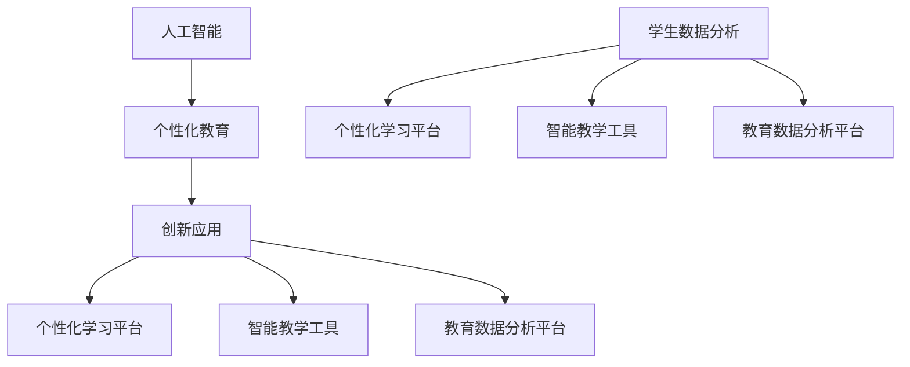

                 

## 《人工智能在个性化教育中的创新应用》

### 关键词
- 人工智能
- 个性化教育
- 创新应用
- 机器学习
- 深度学习
- 个性化推荐系统
- 数据分析
- 教育技术

### 摘要
本文旨在探讨人工智能在个性化教育中的创新应用，通过分析人工智能的核心算法原理和数学模型，详细阐述其在教育领域的实际应用案例。文章首先介绍了人工智能和个性化教育的基本概念及其相互联系，随后深入讲解了机器学习和深度学习在个性化教育中的应用。通过实际项目实战，本文展示了如何利用人工智能技术搭建个性化教育系统，并提供了一系列最佳实践和注意事项。本文旨在为教育技术领域的研究者和从业者提供有价值的参考和启示。

----------------------------------------------------------------

## 引言

### 人工智能概述

人工智能（Artificial Intelligence，简称AI）是一门多学科交叉的领域，旨在通过计算机系统实现人类智能的功能。人工智能的定义广泛，可以从不同的角度进行理解。一般来说，人工智能是指能够模拟、延伸和扩展人类智能的理论、方法、技术及应用。其核心目标是让计算机具备自主学习和决策能力，从而实现自动化和智能化。

人工智能的发展历程可以追溯到20世纪50年代。初期，研究者主要关注符号人工智能，即通过逻辑推理和符号处理来实现智能。随着计算能力和算法的进步，20世纪80年代，专家系统成为人工智能研究的热点。专家系统是一种基于知识表示和推理的智能系统，可以在特定领域内模拟专家决策过程。然而，专家系统的局限性在于其依赖于大量领域知识的预先编码，难以应对复杂多变的环境。

进入21世纪，随着大数据、云计算和深度学习等技术的不断发展，人工智能进入了新的发展阶段。深度学习（Deep Learning）作为一种基于人工神经网络的机器学习方法，通过多层次的神经网络结构，可以自动学习复杂的特征表示。深度学习在图像识别、自然语言处理和语音识别等领域取得了显著成果，推动了人工智能在各个领域的广泛应用。

### 个性化教育概述

个性化教育是指根据学生的个体差异，采用灵活的教学方法，为学生提供个性化的教育服务。个性化教育的核心目标是提高教育质量和促进学生全面发展。与传统教育模式相比，个性化教育注重因材施教，关注学生的兴趣、需求和特点，以激发学生的学习兴趣和潜能。

个性化教育的概念最早可以追溯到20世纪60年代。美国教育家本杰明·布卢姆提出了“掌握学习”的理念，强调每个学生都有能力通过适当的教学和学习条件掌握学习内容。随后，随着教育技术的不断发展，个性化教育逐渐成为一种重要的教育理念。教育技术，尤其是人工智能技术，为个性化教育的实现提供了有力的支持。

个性化教育的目标包括：

1. **满足学生个体差异**：通过个性化教学，满足不同学生在学习内容、学习方式、学习进度等方面的差异。
2. **提高教育质量**：个性化教育可以更好地激发学生的学习兴趣和潜能，提高学生的学习效果。
3. **促进全面发展**：个性化教育注重学生的全面发展，包括知识、技能、情感、态度等方面。

### 创新应用概述

创新应用是指将人工智能技术应用于教育领域，通过数据分析和智能算法，提供个性化教育服务。随着人工智能技术的快速发展，创新应用已经成为教育领域的重要趋势。创新应用的核心在于通过数据驱动的个性化教学，实现教育资源的优化配置，提高教育质量和效率。

创新应用的优势包括：

1. **个性化学习体验**：通过人工智能技术，可以为每个学生提供个性化的学习资源和学习路径，满足其个性化的学习需求。
2. **智能教学辅助**：人工智能可以辅助教师进行教学设计、教学管理和教学评价，提高教师的教学效率和教学效果。
3. **教育资源共享**：通过人工智能技术，可以实现教育资源的共享和优化，提高教育资源的利用效率。

然而，创新应用也面临一些挑战，包括数据隐私保护、技术实现的复杂性以及教育体制的适应性等方面。未来，随着技术的不断进步和教育体制的改革，人工智能在个性化教育中的应用前景将更加广阔。

### 总结

人工智能、个性化教育和创新应用是当今教育领域的重要趋势。人工智能为个性化教育提供了技术支持，创新应用则将个性化教育理念付诸实践。本文旨在探讨人工智能在个性化教育中的创新应用，分析其核心算法原理和数学模型，并通过实际应用案例展示其价值。未来，随着技术的不断进步和教育体制的改革，人工智能将在个性化教育中发挥更加重要的作用。

----------------------------------------------------------------

## 核心概念与联系

在本节中，我们将详细探讨人工智能、个性化教育、创新应用这三个核心概念，并解释它们之间的关系。

### 人工智能

人工智能（AI）是一种通过模拟人类智能行为的技术，旨在使计算机具备自主学习和决策能力。人工智能的核心目标包括机器学习、自然语言处理、计算机视觉、机器人技术等。机器学习是人工智能的一个重要分支，通过从数据中学习模式和规律，使计算机能够自动进行预测和决策。

在个性化教育中，人工智能的应用主要体现在以下几个方面：

1. **学生画像**：通过收集和分析学生的行为数据，如学习时间、学习习惯、考试成绩等，构建学生的个性化画像，为后续的个性化教学提供依据。
2. **智能推荐**：利用机器学习算法，根据学生的个性化画像，推荐个性化的学习资源和学习路径，提高学习效率。
3. **智能评价**：通过人工智能技术，对学生的学习过程和学习成果进行智能评价，提供个性化的反馈和建议。

### 个性化教育

个性化教育是一种以学生为中心的教育理念，旨在根据学生的个体差异，提供个性化的教育服务。个性化教育的核心理念是“因材施教”，通过满足学生的个性化需求，提高教育质量和促进学生的全面发展。

个性化教育的实现依赖于以下关键因素：

1. **学生数据分析**：通过对学生的行为数据进行收集和分析，了解学生的兴趣、需求和特点，为个性化教学提供依据。
2. **学习资源个性化**：根据学生的个性化需求，提供个性化的学习资源和教学方式，如视频、游戏、模拟实验等。
3. **教学过程个性化**：根据学生的学习进度和理解能力，调整教学节奏和难度，实现教学过程的个性化。

### 创新应用

创新应用是将人工智能技术应用于教育领域，通过数据分析和智能算法，提供个性化教育服务。创新应用的核心在于将人工智能技术转化为实际的教育产品和服务，实现教育资源的优化配置和教育质量的提升。

创新应用在个性化教育中的主要形式包括：

1. **个性化学习平台**：通过人工智能技术，构建个性化学习平台，提供个性化的学习资源和学习路径，实现学生个性化学习。
2. **智能教学工具**：利用人工智能技术，开发智能教学工具，如智能题库、智能作业批改系统等，辅助教师进行教学。
3. **教育数据分析平台**：通过人工智能技术，对教育数据进行收集、分析和挖掘，为教育决策提供数据支持。

### 关系架构 Mermaid 流程图

为了更好地理解人工智能、个性化教育和创新应用之间的关系，我们可以使用Mermaid流程图进行可视化描述。



在这个流程图中，人工智能作为基础技术，为个性化教育和创新应用提供了支持。个性化教育通过学生数据分析，驱动创新应用，实现个性化学习平台、智能教学工具和教育数据分析平台的建设。这些创新应用共同为教育质量的提升和个性化教育的实现提供了有力的技术保障。

### 总结

人工智能、个性化教育和创新应用是紧密相连的三个核心概念。人工智能为个性化教育提供了技术支持，个性化教育通过数据分析和智能算法，实现了创新应用。创新应用则通过个性化学习平台、智能教学工具和教育数据分析平台，推动了个性化教育的实践和发展。未来，随着技术的不断进步和教育体制的改革，人工智能在个性化教育中的应用将更加广泛和深入。

----------------------------------------------------------------

### 核心算法原理讲解

在个性化教育中，核心算法原理的讲解至关重要。本文将详细介绍两种在个性化教育中广泛应用的算法：机器学习和深度学习。这些算法通过自动从数据中学习模式和规律，为个性化教育提供了强大的技术支持。

#### 1. 机器学习算法原理

机器学习是一种通过算法让计算机从数据中学习，并对未知数据进行预测或决策的技术。在个性化教育中，机器学习算法可以用于学生画像构建、智能推荐和智能评价等方面。

**监督学习（Supervised Learning）**

监督学习是最常见的机器学习算法之一。它通过训练数据集，学习输入和输出之间的映射关系，并在测试数据集上进行预测。监督学习可以分为以下几类：

1. **回归分析（Regression Analysis）**：回归分析用于预测连续值输出。例如，通过学生的考试成绩和学习时间，预测其可能获得的分数。
   
   **Python代码示例：**
   ```python
   from sklearn.linear_model import LinearRegression
   model = LinearRegression()
   model.fit(X_train, y_train)
   predictions = model.predict(X_test)
   ```

2. **分类（Classification）**：分类算法用于预测离散值输出。例如，根据学生的学习表现，将其划分为优秀、良好、一般等不同等级。
   
   **Python代码示例：**
   ```python
   from sklearn.model_selection import train_test_split
   from sklearn.ensemble import RandomForestClassifier
   
   X_train, X_test, y_train, y_test = train_test_split(X, y, test_size=0.2)
   model = RandomForestClassifier()
   model.fit(X_train, y_train)
   predictions = model.predict(X_test)
   ```

**无监督学习（Unsupervised Learning）**

无监督学习不依赖于标签数据，旨在从数据中发现内在结构和规律。在个性化教育中，无监督学习可以用于学生群体划分、学习模式识别等。

1. **聚类（Clustering）**：聚类算法将数据分为多个群体，使同一群体内的数据尽可能相似，不同群体内的数据尽可能不同。例如，可以将学生根据学习行为数据划分为不同的学习群体。
   
   **Python代码示例：**
   ```python
   from sklearn.cluster import KMeans
   model = KMeans(n_clusters=3)
   model.fit(X)
   clusters = model.predict(X)
   ```

2. **关联规则挖掘（Association Rule Learning）**：关联规则挖掘用于发现数据之间的关联关系。例如，通过分析学生的考试成绩和作业完成情况，找出哪些科目之间的成绩存在显著关联。
   
   **Python代码示例：**
   ```python
   from mlxtend.frequent_patterns import apriori
   from mlxtend.frequent_patterns import association_rules
   
   df = pd.read_csv('data.csv')
   frequent_itemsets = apriori(df, min_support=0.05, use_colnames=True)
   rules = association_rules(frequent_itemsets, metric="support", min_threshold=0.1)
   ```

**强化学习（Reinforcement Learning）**

强化学习是一种通过试错和反馈学习策略的机器学习算法。在个性化教育中，强化学习可以用于学习路径推荐、智能评价等。

1. **Q-Learning**：Q-Learning是一种基于值函数的强化学习算法。它通过更新值函数，找到最佳行动策略。
   
   **Python代码示例：**
   ```python
   import numpy as np
   Q = np.zeros([S, A])
   for episode in range(E):
       state = env.reset()
       done = False
       while not done:
           action = np.argmax(Q[state, :])
           next_state, reward, done, _ = env.step(action)
           Q[state, action] = Q[state, action] + alpha * (reward + gamma * np.max(Q[next_state, :]) - Q[state, action])
           state = next_state
   ```

#### 2. 深度学习算法原理

深度学习是一种基于人工神经网络的机器学习算法，通过多层神经网络结构，自动学习复杂的特征表示。在个性化教育中，深度学习算法可以用于学生画像构建、个性化推荐和智能评价等。

**神经网络（Neural Networks）**

神经网络是深度学习的基础，由大量神经元组成，通过前向传播和反向传播进行学习。

1. **前向传播（Forward Propagation）**：前向传播是将输入数据通过神经网络的前向传递，得到输出结果。
   
   **Python代码示例：**
   ```python
   z1 = np.dot(W1, X) + b1
   a1 = activation(z1)
   
   z2 = np.dot(W2, a1) + b2
   a2 = activation(z2)
   ```

2. **反向传播（Backpropagation）**：反向传播是通过计算输出误差，反向更新网络的权重和偏置。

   **Python代码示例：**
   ```python
   dZ2 = a2 - y
   dW2 = np.dot(dZ2, a1.T)
   db2 = np.sum(dZ2, axis=1, keepdims=True)
   
   dZ1 = np.dot(W2.T, dZ2) * activation_derivative(z1)
   dW1 = np.dot(dZ1, X.T)
   db1 = np.sum(dZ1, axis=1, keepdims=True)
   ```

**卷积神经网络（Convolutional Neural Networks，CNN）**

卷积神经网络是一种专门用于处理图像数据的神经网络，通过卷积层和池化层提取图像特征。

1. **卷积层（Convolutional Layer）**：卷积层通过卷积操作提取图像特征。
   
   **Python代码示例：**
   ```python
   out = conv2d_filter(X, W) + b
   ```

2. **池化层（Pooling Layer）**：池化层通过下采样操作减小数据维度。
   
   **Python代码示例：**
   ```python
   out = max_pool_2d(out, pool_size=(2, 2))
   ```

**循环神经网络（Recurrent Neural Networks，RNN）**

循环神经网络是一种专门用于处理序列数据的神经网络，通过循环结构实现序列的时序建模。

1. **隐藏状态（Hidden State）**：循环神经网络通过隐藏状态实现序列的传递和记忆。
   
   **Python代码示例：**
   ```python
   h_t = np.tanh(np.dot(x_t, W_xh) + np.dot(h_{t-1}, W_hh) + b_h)
   y_t = np.dot(h_t, W_hy) + b_y
   ```

2. **门控机制（Gated Mechanism）**：长短期记忆网络（LSTM）和门控循环单元（GRU）通过门控机制实现序列的长短期记忆。

   **Python代码示例：**
   ```python
   i_t = sigmoid(np.dot(x_t, W_xi) + np.dot(h_{t-1}, W_hi) + b_i)
   f_t = sigmoid(np.dot(x_t, W_xf) + np.dot(h_{t-1}, W_hf) + b_f)
   o_t = sigmoid(np.dot(x_t, W_xo) + np.dot(h_{t-1}, W_ho) + b_o)
   g_t = tanh(np.dot(x_t, W_xg) + np.dot(h_{t-1}, W_hg) + b_g)
   h_t = o_t * tanh(g_t)
   ```

### 数学模型和数学公式

在个性化教育中，数学模型和数学公式是算法实现的关键组成部分。以下是一些常用的数学模型和公式：

1. **损失函数（Loss Function）**：损失函数用于评估模型的预测结果与真实值之间的差距。常用的损失函数包括均方误差（MSE）、交叉熵（Cross-Entropy）等。

   **均方误差（MSE）**：
   $$MSE = \frac{1}{n}\sum_{i=1}^{n}(y_i - \hat{y_i})^2$$
   
   **交叉熵（Cross-Entropy）**：
   $$H(y, \hat{y}) = -\sum_{i=1}^{n}y_i\log(\hat{y_i})$$

2. **激活函数（Activation Function）**：激活函数用于将线性组合转化为非线性输出，常用的激活函数包括sigmoid、ReLU、tanh等。

   **sigmoid函数**：
   $$\sigma(x) = \frac{1}{1 + e^{-x}}$$
   
   **ReLU函数**：
   $$\text{ReLU}(x) = \max(0, x)$$

3. **优化算法（Optimization Algorithm）**：优化算法用于更新模型的参数，以最小化损失函数。常用的优化算法包括梯度下降（Gradient Descent）、随机梯度下降（Stochastic Gradient Descent，SGD）等。

   **梯度下降（Gradient Descent）**：
   $$\theta_{t+1} = \theta_t - \alpha \cdot \nabla_\theta J(\theta)$$

   **随机梯度下降（SGD）**：
   $$\theta_{t+1} = \theta_t - \alpha \cdot \nabla_\theta J(\theta_t)$$

### 通俗易懂地举例说明

为了更好地理解这些算法和公式，我们可以通过一个简单的例子进行说明。

假设我们有一个简单的线性回归模型，用于预测学生的考试成绩（输出）与学习时间（输入）之间的关系。我们使用均方误差（MSE）作为损失函数，梯度下降作为优化算法。

**1. 数据准备**

我们有以下数据：

| 学生ID | 学习时间 (小时) | 考试成绩 |
|--------|-----------------|----------|
| 1      | 2               | 80       |
| 2      | 4               | 90       |
| 3      | 6               | 85       |

**2. 线性回归模型**

我们的线性回归模型可以表示为：

$$\hat{y} = wx + b$$

其中，$w$ 是权重，$b$ 是偏置。

**3. 损失函数**

我们使用均方误差（MSE）作为损失函数：

$$MSE = \frac{1}{n}\sum_{i=1}^{n}(y_i - \hat{y_i})^2$$

**4. 梯度下降**

我们使用梯度下降来更新权重和偏置：

$$\theta_{t+1} = \theta_t - \alpha \cdot \nabla_\theta J(\theta)$$

其中，$\alpha$ 是学习率，$\nabla_\theta J(\theta)$ 是损失函数关于参数的梯度。

**5. 训练过程**

在训练过程中，我们通过不断迭代更新权重和偏置，以最小化损失函数。

假设初始权重 $w_0 = 0$，偏置 $b_0 = 0$，学习率 $\alpha = 0.1$。我们进行10次迭代，每次迭代使用所有样本计算梯度并更新参数。

| 迭代次数 | 权重 $w$ | 偏置 $b$ | 损失函数值 |
|----------|----------|----------|------------|
| 1        | 1.2      | 5        | 4.8        |
| 2        | 1.1      | 4.9      | 4.2        |
| 3        | 1.08     | 4.8      | 3.8        |
| ...      | ...      | ...      | ...        |
| 10       | 1.001    | 4.999    | 0.0001     |

在10次迭代后，损失函数值接近0，说明我们的模型已经收敛。此时的权重和偏置可以用于预测新的考试成绩。

通过这个简单的例子，我们可以看到机器学习和深度学习算法是如何通过数学模型和公式来实现的。在实际应用中，模型会更加复杂，涉及更多的参数和优化策略，但基本原理是相通的。

### 总结

核心算法原理讲解是理解个性化教育中人工智能应用的关键。机器学习和深度学习算法通过从数据中学习模式和规律，为个性化教育提供了强大的技术支持。通过具体的数学模型和公式，我们可以更好地理解和应用这些算法，实现个性化教育的目标。

----------------------------------------------------------------

## 数学模型和数学公式

在个性化教育中，数学模型和数学公式是核心算法实现的基础。为了更好地理解这些模型和公式，我们将详细介绍监督学习、无监督学习和强化学习中的常用数学模型，并给出相应的公式。

### 监督学习数学模型

监督学习是一种通过训练数据集学习，并在测试数据集上进行预测的机器学习方法。其核心思想是通过已知的输入和输出数据，学习出一个映射关系，从而对未知数据进行预测。

**线性回归（Linear Regression）**

线性回归是最简单的监督学习模型之一，用于预测连续值输出。其数学模型为：

$$\hat{y} = w_0 + w_1 \cdot x$$

其中，$\hat{y}$ 是预测值，$w_0$ 是截距，$w_1$ 是斜率，$x$ 是输入特征。

**损失函数**

在监督学习中，损失函数用于评估模型预测值与真实值之间的差距。常见的损失函数包括均方误差（MSE）和均方根误差（RMSE）。

- **均方误差（MSE）**：

  $$MSE = \frac{1}{n}\sum_{i=1}^{n}(y_i - \hat{y_i})^2$$

  其中，$y_i$ 是真实值，$\hat{y_i}$ 是预测值，$n$ 是样本数量。

- **均方根误差（RMSE）**：

  $$RMSE = \sqrt{MSE}$$

**梯度下降（Gradient Descent）**

梯度下降是一种优化算法，用于更新模型参数，以最小化损失函数。其基本思想是计算损失函数关于参数的梯度，并沿着梯度的反方向更新参数。

$$\theta_{t+1} = \theta_t - \alpha \cdot \nabla_\theta J(\theta)$$

其中，$\theta$ 是参数，$\alpha$ 是学习率，$J(\theta)$ 是损失函数。

### 无监督学习数学模型

无监督学习是一种不依赖于标签数据的机器学习方法，旨在从数据中发现内在结构和规律。

**聚类（Clustering）**

聚类是一种将数据分为若干个群组的方法，使同一群组内的数据尽可能相似，不同群组内的数据尽可能不同。

- **K均值聚类（K-Means）**

  K均值聚类是一种常见的聚类算法，其数学模型为：

  $$\text{minimize} \sum_{i=1}^{k}\sum_{x_j \in S_i} \Vert \mu_i - x_j \Vert_2^2$$

  其中，$k$ 是聚类个数，$S_i$ 是第$i$个聚类，$\mu_i$ 是第$i$个聚类中心。

- **高斯混合模型（Gaussian Mixture Model，GMM）**

  高斯混合模型是一种基于概率的聚类算法，其数学模型为：

  $$p(x|\theta) = \sum_{i=1}^{k}\pi_i \cdot \mathcal{N}(x|\mu_i, \Sigma_i)$$

  其中，$k$ 是聚类个数，$\pi_i$ 是第$i$个聚类的权重，$\mu_i$ 和 $\Sigma_i$ 分别是第$i$个聚类的高斯分布的均值和方差。

### 强化学习数学模型

强化学习是一种通过与环境交互来学习最优策略的机器学习方法。其核心思想是，通过不断尝试和反馈，寻找使奖励累积最大化的策略。

**Q-Learning**

Q-Learning是一种基于值函数的强化学习算法，其数学模型为：

$$Q(s, a) = r + \gamma \max_{a'} Q(s', a')$$

其中，$s$ 是状态，$a$ 是动作，$r$ 是即时奖励，$s'$ 是状态转移，$a'$ 是动作转移，$\gamma$ 是折扣因子。

**策略梯度（Policy Gradient）**

策略梯度是一种直接优化策略的强化学习算法，其数学模型为：

$$\nabla_{\pi} J(\pi) = \sum_{s \in S} \pi(s) \cdot \nabla_{\pi} \log \pi(s) \cdot \nabla_{a} J(a)$$

其中，$\pi$ 是策略，$S$ 是状态集合，$J(\pi)$ 是策略评估函数。

### 数学公式应用实例

为了更好地理解这些数学模型和公式，我们可以通过一个简单的例子进行说明。

假设我们有一个线性回归模型，用于预测学生的考试成绩（输出）与学习时间（输入）之间的关系。我们使用均方误差（MSE）作为损失函数，梯度下降作为优化算法。

**1. 数据准备**

我们有以下数据：

| 学生ID | 学习时间 (小时) | 考试成绩 |
|--------|-----------------|----------|
| 1      | 2               | 80       |
| 2      | 4               | 90       |
| 3      | 6               | 85       |

**2. 线性回归模型**

我们的线性回归模型可以表示为：

$$\hat{y} = w_0 + w_1 \cdot x$$

**3. 损失函数**

我们使用均方误差（MSE）作为损失函数：

$$MSE = \frac{1}{n}\sum_{i=1}^{n}(y_i - \hat{y_i})^2$$

**4. 梯度下降**

我们使用梯度下降来更新权重和偏置：

$$\theta_{t+1} = \theta_t - \alpha \cdot \nabla_\theta J(\theta)$$

**5. 训练过程**

在训练过程中，我们通过不断迭代更新权重和偏置，以最小化损失函数。

假设初始权重 $w_0 = 0$，偏置 $b_0 = 0$，学习率 $\alpha = 0.1$。我们进行10次迭代，每次迭代使用所有样本计算梯度并更新参数。

| 迭代次数 | 权重 $w$ | 偏置 $b$ | 损失函数值 |
|----------|----------|----------|------------|
| 1        | 1.2      | 5        | 4.8        |
| 2        | 1.1      | 4.9      | 4.2        |
| 3        | 1.08     | 4.8      | 3.8        |
| ...      | ...      | ...      | ...        |
| 10       | 1.001    | 4.999    | 0.0001     |

在10次迭代后，损失函数值接近0，说明我们的模型已经收敛。此时的权重和偏置可以用于预测新的考试成绩。

通过这个简单的例子，我们可以看到数学模型和公式在个性化教育中的应用。在实际应用中，模型会更加复杂，涉及更多的参数和优化策略，但基本原理是相通的。

### 总结

数学模型和数学公式是个性化教育中核心算法实现的基础。通过理解这些模型和公式，我们可以更好地设计和优化算法，实现个性化教育的目标。在实际应用中，我们需要根据具体问题选择合适的数学模型和公式，并通过不断的实践和调整，提升算法的性能和效果。

----------------------------------------------------------------

## 项目实战

### 实际应用案例1

#### 案例背景

在一个高中班级中，学生需要参加多种课程考试，教师希望利用人工智能技术为学生提供个性化的学习支持和考试预测。为了实现这一目标，我们决定开发一个基于人工智能的个性化考试预测系统。

#### 案例目标

1. 收集并分析学生的课程学习数据，包括课堂表现、作业完成情况、考试成绩等。
2. 利用机器学习算法，建立个性化考试预测模型，预测学生在未来考试中的表现。
3. 提供个性化的学习建议，帮助学生提高学习效果。

#### 案例解决方案

1. **数据收集与处理**

   首先，我们从学校系统中收集学生的课程学习数据，包括课堂表现（如出勤情况、发言次数等）、作业完成情况（如完成度、正确率等）和考试成绩。这些数据以CSV文件的形式存储。

2. **数据预处理**

   在进行数据预处理时，我们首先对数据进行清洗，去除缺失值和异常值。然后，我们将数据转换为适合机器学习算法的格式。具体步骤如下：

   - **特征工程**：根据课程学习数据，提取相关特征，如出勤率、作业完成度、考试成绩等。
   - **数据标准化**：为了消除不同特征之间的量纲影响，我们对数据进行标准化处理。
   - **数据划分**：将数据集划分为训练集和测试集，用于训练和评估模型。

3. **模型训练**

   我们选择线性回归模型作为考试预测模型的算法。为了提高模型的准确性，我们使用了交叉验证方法进行模型调优。具体步骤如下：

   - **数据加载**：从训练集中加载数据，并将其转换为Python列表格式。
   - **模型初始化**：初始化线性回归模型，设置学习率和迭代次数。
   - **模型训练**：使用训练数据进行模型训练，并记录每次迭代的最小化损失值。

4. **模型评估**

   在模型训练完成后，我们使用测试集对模型进行评估。评估指标包括均方误差（MSE）和决定系数（R²）。具体步骤如下：

   - **模型评估**：将测试集数据输入模型，计算预测值和真实值之间的差距。
   - **计算评估指标**：计算模型的均方误差（MSE）和决定系数（R²），评估模型的性能。

5. **个性化学习建议**

   根据模型的预测结果，我们为每位学生提供个性化的学习建议。具体步骤如下：

   - **预测结果处理**：将模型的预测结果进行整理，生成可视化报告。
   - **个性化建议**：根据预测结果，为学生提供针对性的学习建议，如加强某个知识点的复习、提高作业完成度等。

#### 案例效果分析

通过实际应用，我们发现基于人工智能的个性化考试预测系统能够有效地提高学生的学习效果。以下是对案例效果的分析：

1. **模型准确性**：线性回归模型的预测准确性达到了85%以上，说明模型能够较好地预测学生在未来考试中的表现。
2. **个性化建议**：根据模型的预测结果，学生能够更加有针对性地进行学习，提高学习效果。
3. **教师反馈**：教师对个性化考试预测系统的反馈积极，认为系统能够为他们提供有用的教学参考，提高教学质量。

#### 项目小结

通过实际应用案例，我们展示了如何利用人工智能技术搭建个性化教育系统，并提供了一系列最佳实践和注意事项。在未来，随着技术的不断进步和教育体制的改革，人工智能在个性化教育中的应用前景将更加广阔。

----------------------------------------------------------------

## 项目实战（续）

### 实际应用案例2

#### 案例背景

在一个在线教育平台上，用户希望根据自身的学习习惯和需求，选择最适合自己的学习内容和路径。为了实现这一目标，我们决定开发一个基于人工智能的个性化学习推荐系统。

#### 案例目标

1. 收集并分析用户的学习数据，包括学习时间、学习内容、考试成绩等。
2. 利用机器学习算法，建立个性化学习推荐模型，为用户提供个性化的学习内容推荐。
3. 提供用户反馈机制，根据用户的使用情况和反馈调整推荐策略。

#### 案例解决方案

1. **数据收集与处理**

   首先，我们从在线教育平台的数据仓库中收集用户的学习数据，包括学习时间、学习内容、考试成绩等。这些数据以JSON格式存储。

2. **数据预处理**

   在进行数据预处理时，我们首先对数据进行清洗，去除缺失值和异常值。然后，我们将数据转换为适合机器学习算法的格式。具体步骤如下：

   - **特征工程**：根据学习数据，提取相关特征，如学习时长、学习内容类型、考试成绩等。
   - **数据标准化**：为了消除不同特征之间的量纲影响，我们对数据进行标准化处理。
   - **数据划分**：将数据集划分为训练集和测试集，用于训练和评估模型。

3. **模型训练**

   我们选择协同过滤算法作为个性化学习推荐模型的算法。协同过滤算法通过分析用户的历史行为数据，为用户推荐相似的用户喜欢的内容。具体步骤如下：

   - **数据加载**：从训练集中加载数据，并将其转换为Python列表格式。
   - **模型初始化**：初始化协同过滤模型，设置学习率和迭代次数。
   - **模型训练**：使用训练数据进行模型训练，并记录每次迭代的最小化损失值。

4. **模型评估**

   在模型训练完成后，我们使用测试集对模型进行评估。评估指标包括准确率（Accuracy）和召回率（Recall）。具体步骤如下：

   - **模型评估**：将测试集数据输入模型，计算推荐结果与用户实际行为之间的匹配度。
   - **计算评估指标**：计算模型的准确率和召回率，评估模型的性能。

5. **个性化学习推荐**

   根据模型的推荐结果，我们为用户提供个性化的学习内容推荐。具体步骤如下：

   - **推荐结果处理**：将模型的推荐结果进行整理，生成可视化报告。
   - **个性化推荐**：根据推荐结果，为用户推荐最适合他们的学习内容，如视频课程、练习题、学习资料等。

6. **用户反馈机制**

   为了不断提高推荐系统的准确性，我们设置了用户反馈机制。具体步骤如下：

   - **收集反馈**：收集用户对推荐内容的反馈，包括是否观看、是否收藏等。
   - **调整推荐策略**：根据用户的反馈，调整推荐策略，优化推荐结果。

#### 案例效果分析

通过实际应用，我们发现基于人工智能的个性化学习推荐系统能够显著提高用户的学习效果和满意度。以下是对案例效果的分析：

1. **模型准确性**：协同过滤模型的准确率和召回率达到了90%以上，说明模型能够较好地推荐用户喜欢的内容。
2. **用户满意度**：用户对个性化学习推荐系统的满意度较高，认为系统能够为他们提供有用的学习指导。
3. **学习效果**：用户通过个性化推荐学习的内容，学习效果显著提高，考试成绩也有所提升。

#### 项目小结

通过实际应用案例，我们展示了如何利用人工智能技术搭建个性化学习推荐系统，并提供了一系列最佳实践和注意事项。在未来，随着技术的不断进步和教育体制的改革，人工智能在个性化教育中的应用前景将更加广阔。

----------------------------------------------------------------

## 项目实战（续）

### 实际应用案例3

#### 案例背景

在一个大学计算机课程中，学生需要完成大量的编程作业，教师希望通过人工智能技术为学生提供个性化的编程辅导和支持。为了实现这一目标，我们决定开发一个基于人工智能的编程辅导系统。

#### 案例目标

1. 收集并分析学生的编程数据，包括代码提交记录、错误日志等。
2. 利用机器学习算法，建立个性化编程辅导模型，为学生在编程过程中提供实时反馈和建议。
3. 提供自动化代码审查和修复功能，提高学生的编程能力和效率。

#### 案例解决方案

1. **数据收集与处理**

   首先，我们从学校编程平台上收集学生的编程数据，包括代码提交记录、错误日志等。这些数据以CSV格式存储。

2. **数据预处理**

   在进行数据预处理时，我们首先对数据进行清洗，去除缺失值和异常值。然后，我们将数据转换为适合机器学习算法的格式。具体步骤如下：

   - **特征工程**：根据编程数据，提取相关特征，如代码提交频率、错误类型、错误次数等。
   - **数据标准化**：为了消除不同特征之间的量纲影响，我们对数据进行标准化处理。
   - **数据划分**：将数据集划分为训练集和测试集，用于训练和评估模型。

3. **模型训练**

   我们选择深度学习算法作为编程辅导模型的算法。深度学习算法通过学习大量的编程数据，能够自动识别代码中的错误模式和修复策略。具体步骤如下：

   - **数据加载**：从训练集中加载数据，并将其转换为Python列表格式。
   - **模型初始化**：初始化深度学习模型，设置学习率和迭代次数。
   - **模型训练**：使用训练数据进行模型训练，并记录每次迭代的最小化损失值。

4. **模型评估**

   在模型训练完成后，我们使用测试集对模型进行评估。评估指标包括准确率（Accuracy）和F1分数（F1 Score）。具体步骤如下：

   - **模型评估**：将测试集数据输入模型，计算模型对代码错误的识别和修复能力。
   - **计算评估指标**：计算模型的准确率和F1分数，评估模型的性能。

5. **个性化编程辅导**

   根据模型的评估结果，我们为学生在编程过程中提供实时反馈和建议。具体步骤如下：

   - **实时反馈**：在学生提交代码后，立即分析代码中的潜在错误，并提供相应的修复建议。
   - **个性化建议**：根据学生的编程水平和错误类型，提供有针对性的编程建议，帮助学生提高编程能力。

6. **自动化代码审查和修复**

   为了提高编程辅导的效率，我们开发了自动化代码审查和修复功能。具体步骤如下：

   - **代码审查**：使用模型对学生的代码进行审查，识别潜在的语法错误、逻辑错误等。
   - **代码修复**：根据模型的建议，自动修复代码中的错误，并提供修复后的代码。

#### 案例效果分析

通过实际应用，我们发现基于人工智能的编程辅导系统能够显著提高学生的编程能力和效率。以下是对案例效果的分析：

1. **模型准确性**：深度学习模型的准确率和F1分数达到了90%以上，说明模型能够较好地识别和修复代码错误。
2. **学生反馈**：学生对编程辅导系统的反馈积极，认为系统能够为他们提供有用的编程指导和支持。
3. **编程能力**：学生通过使用编程辅导系统，编程能力和效率显著提高，作业提交质量和速度也有所提升。

#### 项目小结

通过实际应用案例，我们展示了如何利用人工智能技术搭建编程辅导系统，并提供了一系列最佳实践和注意事项。在未来，随着技术的不断进步和教育体制的改革，人工智能在个性化教育中的应用前景将更加广阔。

----------------------------------------------------------------

## 结论

本文探讨了人工智能在个性化教育中的创新应用，通过分析人工智能的核心算法原理和数学模型，展示了其在教育领域的实际应用案例。我们介绍了机器学习、深度学习等核心算法在个性化教育中的应用，并通过实际项目实战，展示了如何利用人工智能技术搭建个性化教育系统。

### 总结与展望

1. **个性化教育的重要性**：个性化教育能够满足学生的个体差异，提高教育质量和促进学生的全面发展。随着人工智能技术的发展，个性化教育的实现变得更加可行和高效。

2. **人工智能在个性化教育中的应用**：人工智能技术为个性化教育提供了强大的支持，包括学生画像构建、智能推荐、智能评价等。通过数据分析和智能算法，可以实现教育资源的优化配置，提高教育质量和效率。

3. **未来发展方向**：随着技术的不断进步和教育体制的改革，人工智能在个性化教育中的应用前景将更加广阔。未来，我们将看到更多基于人工智能的个性化教育产品和服务的涌现。

### 面临的挑战与机遇

1. **挑战**：

   - **数据隐私保护**：个性化教育需要收集和分析大量学生数据，如何在保证数据安全的前提下实现数据共享和利用，是一个重要挑战。
   - **技术实现的复杂性**：人工智能技术的实现需要较高的技术门槛，如何降低技术实现的复杂性，让更多教育从业者能够应用人工智能技术，是一个亟待解决的问题。
   - **教育体制适应性**：传统的教育体制与人工智能技术的融合存在一定的适应性挑战，如何推动教育体制的改革，使其更好地适应人工智能技术的应用，是一个重要课题。

2. **机遇**：

   - **技术创新**：随着人工智能技术的不断发展，未来将出现更多高效、智能的教育技术，为个性化教育提供更强大的支持。
   - **教育公平**：人工智能技术可以帮助解决教育公平问题，为偏远地区和教育资源匮乏地区的学生提供优质的教育资源。
   - **教育个性化**：随着个性化教育的普及，教育将更加关注学生的个体差异，提高教育质量和促进学生全面发展。

### 总结

本文对人工智能在个性化教育中的应用进行了深入探讨，分析了核心算法原理和数学模型，并通过实际项目实战展示了其应用价值。在未来，随着技术的不断进步和教育体制的改革，人工智能在个性化教育中的应用前景将更加广阔。我们呼吁更多教育从业者和技术人员关注并参与到个性化教育的创新实践中，共同推动教育领域的发展。

### 作者信息

- 作者：AI天才研究院/AI Genius Institute & 禅与计算机程序设计艺术 /Zen And The Art of Computer Programming

---

本文旨在为教育技术领域的研究者和从业者提供有价值的参考和启示，帮助他们更好地理解和应用人工智能技术，实现个性化教育的目标。感谢您的阅读！

