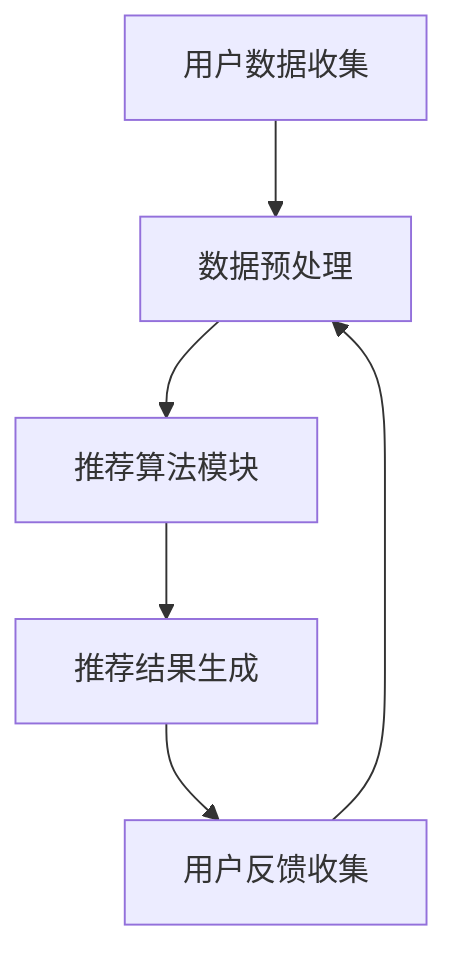

                 

### 文章标题

《人工智能在个性化教育内容推荐中的应用》

关键词：人工智能、个性化教育、内容推荐、协同过滤、基于内容推荐、数学模型、Python源代码

摘要：本文深入探讨了人工智能在个性化教育内容推荐中的应用。通过介绍核心概念、算法原理，结合数学模型和Python源代码实现，详细阐述了协同过滤和基于内容的推荐算法。同时，通过实际项目实战和案例分析，展示了人工智能在个性化教育内容推荐中的具体应用和挑战，为相关领域的研究和实践提供了参考。

---

### 关键词

- 人工智能
- 个性化教育
- 内容推荐
- 协同过滤
- 基于内容推荐
- 数学模型
- Python源代码

### 摘要

随着人工智能技术的不断发展，其在教育领域的应用日益广泛。个性化教育内容推荐作为人工智能在教育中的一项重要应用，能够根据学生的特点和需求，为其提供个性化的学习资源。本文旨在探讨人工智能在个性化教育内容推荐中的应用，从核心概念、算法原理到实际项目实战，全面解析这一技术。首先，介绍了个性化教育内容推荐的背景和重要性，然后详细阐述了协同过滤和基于内容的推荐算法，并结合Python源代码进行了实现和讲解。最后，通过实际案例分析和项目实战，展示了人工智能在个性化教育内容推荐中的具体应用和挑战，为相关领域的研究和实践提供了有益的参考。希望本文能够为广大教育科技从业者、教育数据分析师以及对人工智能在教育领域应用感兴趣的专业人士提供有价值的启示。

---

## 第1章 人工智能与个性化教育

### 1.1 人工智能的基本概念

人工智能（Artificial Intelligence, AI）是计算机科学的一个分支，旨在使计算机模拟人类的智能行为。人工智能的研究始于20世纪50年代，经过几十年的发展，如今已经在许多领域取得了显著的成果。人工智能的基本概念包括以下几个方面：

1. **机器学习**：机器学习是人工智能的核心技术之一，它通过算法从数据中学习规律，并利用这些规律进行预测和决策。机器学习可以分为监督学习、无监督学习和强化学习三种类型。

2. **深度学习**：深度学习是机器学习的一个重要分支，它通过多层神经网络对数据进行建模和处理。深度学习在图像识别、自然语言处理等领域取得了巨大的成功。

3. **自然语言处理**：自然语言处理（Natural Language Processing, NLP）是人工智能的一个重要应用领域，它致力于使计算机能够理解和处理自然语言。NLP包括文本分类、情感分析、机器翻译等多个子领域。

4. **计算机视觉**：计算机视觉是人工智能的另一个重要应用领域，它使计算机能够理解和解释图像和视频。计算机视觉在图像识别、物体检测、人脸识别等领域有着广泛的应用。

### 1.2 个性化教育的需求与挑战

个性化教育是指根据学生的个性、兴趣、学习能力等因素，为其提供个性化的教育资源和教学方法。随着教育信息化的推进，个性化教育已经成为教育领域的重要发展趋势。个性化教育的需求主要体现在以下几个方面：

1. **个性化学习资源**：每个学生都有不同的学习需求和兴趣，个性化教育需要提供符合学生特点的学习资源，如学习材料、教学视频、在线课程等。

2. **个性化教学方法**：传统的教学方式往往采用“一刀切”的模式，无法满足学生的个性化需求。个性化教育需要根据学生的特点和需求，采用不同的教学方法，如一对一辅导、小组合作学习等。

3. **学习效果评估**：个性化教育需要实时跟踪学生的学习进度和效果，以便及时调整教学策略。学习效果评估可以通过在线测验、作业提交、学习分析等方式进行。

然而，个性化教育也面临一些挑战：

1. **数据隐私和安全**：个性化教育需要收集大量的学生数据，如学习记录、行为数据等。如何保护学生数据的安全和隐私成为个性化教育的一个重要问题。

2. **教育资源分配不均**：在一些地区，优质的教育资源分配不均，导致个性化教育的实施受到限制。

3. **教师专业素养**：个性化教育需要教师具备较高的专业素养，能够根据学生的特点进行教学设计和资源推荐。然而，一些教师可能缺乏相关的培训和实践经验。

### 1.3 人工智能在个性化教育中的应用前景

人工智能在个性化教育中的应用前景非常广阔。通过人工智能技术，可以实现对教育数据的智能分析和处理，为个性化教育提供有力支持。以下是人工智能在个性化教育中的一些潜在应用：

1. **个性化学习路径规划**：通过分析学生的学习行为和学习效果，人工智能可以为学生推荐最适合的学习路径，提高学习效率。

2. **智能教学辅助**：人工智能可以通过语音识别、自然语言处理等技术，为学生提供智能化的教学辅助，如在线答疑、自动批改作业等。

3. **个性化教育内容推荐**：基于学生的学习兴趣和学习习惯，人工智能可以为学生推荐个性化的教育内容，如学习资料、教学视频、在线课程等。

4. **学习行为分析**：通过分析学生的学习行为，人工智能可以识别学生的学习习惯、学习偏好等，为教师提供教学改进的参考。

总之，人工智能在个性化教育中的应用将为教育领域带来深刻变革，有助于提高教育质量，促进教育公平。然而，要充分发挥人工智能在个性化教育中的作用，还需要克服数据隐私、教育资源分配不均等挑战，并培养教师的专业素养。

## 第2章 个性化教育内容推荐的核心概念

### 2.1 个性化推荐的原理与算法

个性化推荐系统是人工智能在个性化教育中的一项重要应用，其核心目标是通过分析用户的兴趣和行为，为其推荐符合其需求的内容。个性化推荐系统可以分为以下几种类型：

1. **基于内容的推荐**：这种推荐方法根据用户的历史行为和内容特征，为用户推荐与其已消费内容相似的其他内容。例如，如果用户喜欢某一篇教学视频，系统可以推荐其他相关的教学视频。

2. **协同过滤推荐**：这种推荐方法通过分析用户之间的相似度，为用户推荐其他用户喜欢的内容。协同过滤推荐可以分为两种类型：基于用户的协同过滤和基于项目的协同过滤。基于用户的协同过滤通过分析用户之间的相似度，找到与目标用户兴趣相似的其他用户，然后推荐这些用户喜欢的内容。基于项目的协同过滤则通过分析物品之间的相似度，为用户推荐与已消费物品相似的物品。

3. **混合推荐**：这种推荐方法将基于内容的推荐和协同过滤推荐结合起来，以综合利用两种方法的优点，提高推荐的准确性和多样性。

### 2.2 个性化推荐系统架构与流程

个性化推荐系统的架构通常包括以下几个关键组件：

1. **用户数据收集**：系统需要收集用户的各项数据，如用户的基本信息、学习记录、浏览历史、评分等。

2. **数据预处理**：收集到的数据需要进行预处理，如数据清洗、归一化、特征提取等，以提升数据质量。

3. **推荐算法模块**：根据不同的推荐类型，选择合适的算法模块进行内容推荐。例如，基于内容的推荐可以采用文本相似度计算、关键词提取等方法，而协同过滤推荐则可以采用矩阵分解、K-最近邻等方法。

4. **推荐结果生成**：根据推荐算法的计算结果，生成推荐列表，并向用户展示。

5. **用户反馈收集**：用户在接收推荐内容后，系统需要收集用户的反馈，如是否喜欢、是否收藏等，以便优化推荐算法。

### 2.3 个性化推荐系统的 Mermaid 流程图

为了更直观地展示个性化推荐系统的流程，可以使用Mermaid语言绘制流程图。以下是推荐系统的基本流程：



通过上述流程图，我们可以清晰地看到个性化推荐系统的数据流转和关键步骤。

### 2.4 个性化推荐的关键概念和实体

在个性化推荐系统中，一些关键概念和实体如下：

1. **用户（User）**：个性化推荐系统中的主体，具有独特的兴趣和行为特征。

2. **项目（Item）**：用户可能感兴趣的内容，如教学视频、学习资料等。

3. **评分（Rating）**：用户对项目的评价，通常使用评分系统，如1-5星。

4. **行为数据（Behavioral Data）**：用户在使用系统过程中的各项行为数据，如浏览历史、搜索记录等。

5. **推荐列表（Recommendation List）**：根据推荐算法计算结果生成的推荐内容列表。

通过理解这些关键概念和实体，我们可以更好地设计和实现个性化推荐系统。

### 2.5 个性化推荐系统的重要性

个性化推荐系统在个性化教育中具有重要意义，它能够：

1. **提高学习效率**：通过为用户提供个性化的学习资源，帮助用户快速找到所需内容，提高学习效率。

2. **提升用户体验**：个性化推荐系统能够根据用户的需求和兴趣推荐内容，提升用户的满意度和参与度。

3. **优化教育资源分配**：通过分析用户数据，个性化推荐系统可以帮助教育机构优化教育资源的分配，提高资源利用效率。

4. **支持教育决策**：个性化推荐系统可以为教育管理者提供用户行为分析数据，支持教育决策和策略调整。

总之，个性化推荐系统是教育领域的重要技术手段，其有效应用将有助于提升教育质量和用户体验，推动教育信息化的发展。

## 第3章 个性化推荐算法原理

### 3.1 协同过滤算法

协同过滤（Collaborative Filtering）是个性化推荐系统中的一种常见算法，其核心思想是通过分析用户之间的相似性，为用户推荐其他用户喜欢的内容。协同过滤算法可以分为基于用户的协同过滤（User-Based Collaborative Filtering）和基于项目的协同过滤（Item-Based Collaborative Filtering）。

#### 3.1.1 基于用户的协同过滤

基于用户的协同过滤通过计算用户之间的相似度，找到与目标用户兴趣相似的其他用户，然后推荐这些用户喜欢的项目。其基本步骤如下：

1. **计算用户相似度**：用户相似度可以通过余弦相似度、皮尔逊相关系数等方法计算。假设有两个用户$u_i$和$u_j$，他们的评分矩阵分别为$R_i$和$R_j$，则他们之间的相似度可以表示为：

   $$ sim(u_i, u_j) = \frac{R_i \cdot R_j}{\|R_i\| \|R_j\|} $$

   其中，$R_i \cdot R_j$表示用户$u_i$和$u_j$的评分矩阵的内积，$\|R_i\|$和$\|R_j\|$表示用户$u_i$和$u_j$的评分矩阵的欧几里得范数。

2. **找到相似用户**：根据计算出的用户相似度，选择与目标用户最相似的$k$个用户。

3. **推荐项目**：对于每个相似用户$u_j$，找到他们共同评分的项目$Item_j$，然后为用户$u_i$推荐这些项目。

#### 3.1.2 基于项目的协同过滤

基于项目的协同过滤通过计算项目之间的相似度，为用户推荐与其已消费项目相似的其他项目。其基本步骤如下：

1. **计算项目相似度**：项目相似度可以通过余弦相似度、皮尔逊相关系数等方法计算。假设有两个项目$I_i$和$I_j$，它们的评分矩阵分别为$R_i$和$R_j$，则它们之间的相似度可以表示为：

   $$ sim(I_i, I_j) = \frac{R_i \cdot R_j}{\|R_i\| \|R_j\|} $$

   其中，$R_i \cdot R_j$表示项目$I_i$和$I_j$的评分矩阵的内积，$\|R_i\|$和$\|R_j\|$表示项目$I_i$和$I_j$的评分矩阵的欧几里得范数。

2. **找到相似项目**：根据计算出的项目相似度，选择与目标项目最相似的$k$个项目。

3. **推荐项目**：为用户推荐这些相似项目。

#### 3.1.3 矩阵分解

矩阵分解（Matrix Factorization）是一种常见的协同过滤算法，其基本思想是将用户-项目评分矩阵分解为两个低秩矩阵，通过这两个低秩矩阵来预测未评分的项目。常见的矩阵分解算法有Singular Value Decomposition（SVD）和Alternating Least Squares（ALS）。

1. **Singular Value Decomposition（SVD）**：

   SVD是一种线性代数方法，可以将用户-项目评分矩阵$R$分解为三个矩阵的乘积：

   $$ R = U \Sigma V^T $$

   其中，$U$和$V$是正交矩阵，$\Sigma$是对角矩阵，包含奇异值。

2. **Alternating Least Squares（ALS）**：

   ALS是一种迭代算法，通过交替优化用户矩阵和项目矩阵来最小化预测误差。具体步骤如下：

   - **初始化**：随机生成用户矩阵$U$和项目矩阵$V$。
   - **迭代优化**：
     - **用户矩阵优化**：固定项目矩阵$V$，优化用户矩阵$U$，使得预测误差最小。
       $$ U \leftarrow U - U (R - UV^T) (R - UV^T)^T $$
     - **项目矩阵优化**：固定用户矩阵$U$，优化项目矩阵$V$，使得预测误差最小。
       $$ V \leftarrow V - V (R - UV^T) (R - UV^T)^T $$

   - **终止条件**：当用户矩阵和项目矩阵的误差变化小于预设阈值或达到最大迭代次数时，终止迭代。

通过矩阵分解，我们可以将高维的用户-项目评分矩阵转换为低维的用户和项目特征矩阵，从而提高推荐系统的效果。

#### 3.1.4 K-最近邻算法

K-最近邻（K-Nearest Neighbors, KNN）算法是一种基于实例的协同过滤算法，其核心思想是找到与目标用户或项目最相似的$k$个邻居，然后根据邻居的评分预测目标用户的评分。具体步骤如下：

1. **计算距离**：计算目标用户或项目与所有其他用户或项目的距离，常用的距离度量有欧几里得距离、曼哈顿距离和余弦相似度等。

2. **选择邻居**：根据距离度量，选择与目标用户或项目最近的$k$个邻居。

3. **预测评分**：计算邻居的评分均值作为目标用户或项目的预测评分。

   $$ pred_i = \frac{1}{k} \sum_{j \in N} r_j $$

   其中，$pred_i$是目标用户或项目的预测评分，$r_j$是邻居的评分，$N$是邻居集合。

通过以上介绍，我们可以看到协同过滤算法在个性化推荐系统中的重要性。在实际应用中，可以根据具体需求和数据特点选择合适的协同过滤算法，以提高推荐系统的准确性和效果。

### 3.2 基于内容的推荐算法

基于内容的推荐（Content-Based Recommendation）是一种通过分析项目的内容特征和用户的历史兴趣，为用户推荐相似内容的方法。与协同过滤不同，基于内容的推荐不依赖于用户间的相似性或项目间的相似性，而是基于项目本身的内容属性和用户的兴趣偏好。

#### 3.2.1 文本相似度计算

文本相似度计算是基于内容推荐算法的核心技术，它用于衡量两个文本之间的相似程度。常见的文本相似度计算方法包括：

1. **基于词汇的相似度计算**：

   - **余弦相似度**：通过计算两个文本向量之间的余弦值来衡量它们的相似度。假设两个文本分别表示为向量$V_1$和$V_2$，则它们的余弦相似度可以表示为：

     $$ sim(V_1, V_2) = \frac{V_1 \cdot V_2}{\|V_1\| \|V_2\|} $$

     其中，$V_1 \cdot V_2$是向量$V_1$和$V_2$的点积，$\|V_1\|$和$\|V_2\|$是向量$V_1$和$V_2$的欧几里得范数。

   - **杰卡德相似度**：通过计算两个文本的交集与并集的比值来衡量它们的相似度。假设两个文本分别表示为集合$S_1$和$S_2$，则它们的杰卡德相似度可以表示为：

     $$ sim(S_1, S_2) = \frac{|S_1 \cap S_2|}{|S_1 \cup S_2|} $$

2. **基于语义的相似度计算**：

   - **词嵌入相似度**：通过词嵌入技术将文本中的词汇映射为向量，然后计算向量之间的相似度。常见的词嵌入方法包括Word2Vec、GloVe和BERT等。

   - **语义角色相似度**：通过分析文本中的语义角色（如主语、谓语、宾语等）来计算文本的相似度。

#### 3.2.2 文本向量表示

文本向量表示是将文本数据转换为向量表示的方法，常见的方法包括：

1. **词袋模型（Bag of Words, BOW）**：

   词袋模型将文本表示为词汇的集合，不考虑词汇的顺序。通过将文本转换为向量，向量的维度是词汇表的大小。例如，如果词汇表包含10个词汇，则文本向量的大小为10。

2. **TF-IDF（Term Frequency-Inverse Document Frequency）**：

   TF-IDF是一种常用的高频词过滤方法，通过计算词频和逆文档频率来调整词的重要性。词频（TF）表示词汇在文本中的出现频率，逆文档频率（IDF）表示词汇在整个文档集合中的出现频率。TF-IDF值可以用来加权词汇，使其在文本表示中更加突出。

3. **词嵌入（Word Embedding）**：

   词嵌入是一种将文本中的词汇映射为高维向量表示的方法。常见的词嵌入方法包括Word2Vec、GloVe和BERT等。词嵌入能够捕捉词汇的语义信息，从而提高文本相似度计算的准确度。

#### 3.2.3 基于内容的推荐算法实现

基于内容的推荐算法实现通常包括以下几个步骤：

1. **文本预处理**：

   对文本进行清洗和预处理，包括去除停用词、标点符号和特殊字符等。

2. **特征提取**：

   将预处理后的文本转换为向量表示，可以使用词袋模型、TF-IDF或词嵌入等方法。

3. **相似度计算**：

   计算用户历史兴趣文本与待推荐文本的相似度，可以使用余弦相似度、杰卡德相似度等方法。

4. **推荐生成**：

   根据相似度计算结果，为用户生成推荐列表。

#### 3.2.4 基于内容的推荐算法优缺点

基于内容的推荐算法具有以下优缺点：

1. **优点**：

   - **个性化强**：能够根据用户的历史兴趣和内容特征进行推荐，具有较高的个性化程度。
   - **计算效率高**：相比协同过滤算法，基于内容的推荐算法在计算相似度时更加高效。

2. **缺点**：

   - **多样性不足**：基于内容的推荐算法容易产生信息茧房，推荐结果多样性不足。
   - **冷启动问题**：对于新用户或新项目，由于缺乏历史数据，基于内容的推荐算法难以进行准确推荐。

总的来说，基于内容的推荐算法在个性化教育内容推荐中具有广泛的应用前景，但其存在的局限性也需要通过与其他推荐算法的结合来克服。

### 3.3 混合推荐算法

混合推荐（Hybrid Recommendation）算法是将多种推荐算法相结合，以综合利用各自的优势，提高推荐效果的一种方法。在个性化教育内容推荐中，混合推荐算法可以结合协同过滤和基于内容的推荐算法，以弥补单一算法的不足。

#### 3.3.1 混合推荐算法原理

混合推荐算法的基本原理是：

1. **协同过滤**：通过分析用户之间的相似性和项目之间的相似性，为用户推荐其他用户喜欢的项目。
2. **基于内容**：通过分析项目的内容特征和用户的历史兴趣，为用户推荐与已有兴趣相似的项目。
3. **综合评分**：将协同过滤和基于内容的推荐结果进行综合评分，生成最终的推荐列表。

具体来说，混合推荐算法可以分为以下几种类型：

1. **加权融合**：将协同过滤和基于内容的推荐结果进行加权融合，根据两种方法的权重分配生成综合评分。常见的权重分配方法包括基于用户评分的加权、基于项目评分的加权等。
2. **特征级融合**：将协同过滤和基于内容的推荐结果在特征级进行融合，将两个推荐系统的特征进行拼接，形成一个综合的特征向量，然后通过机器学习模型进行预测。
3. **模型级融合**：将协同过滤和基于内容的推荐模型进行融合，通过模型级联或模型集成的方式，生成最终的推荐结果。

#### 3.3.2 混合推荐算法的优势

混合推荐算法具有以下优势：

1. **提高推荐准确性**：通过结合多种推荐算法，混合推荐算法可以更好地捕捉用户兴趣的多样性，提高推荐准确性。
2. **增强多样性**：混合推荐算法可以有效地缓解单一算法可能导致的信息茧房问题，提高推荐结果的多样性。
3. **适应性**：混合推荐算法可以根据不同的应用场景和数据特点，灵活调整算法权重和融合策略，提高推荐效果。

#### 3.3.3 混合推荐算法的挑战

尽管混合推荐算法具有很多优势，但在实际应用中也面临一些挑战：

1. **计算复杂度高**：混合推荐算法需要同时处理多种推荐算法，计算复杂度较高，对系统性能提出了更高的要求。
2. **模型选择和参数调优**：混合推荐算法需要选择合适的推荐模型和参数，以平衡推荐准确性和多样性。模型选择和参数调优是一个复杂的过程，需要大量的实验和验证。
3. **数据依赖性**：混合推荐算法对数据的质量和完整性有较高的依赖，数据缺失或噪声可能导致推荐效果的下降。

综上所述，混合推荐算法在个性化教育内容推荐中具有广泛的应用前景，但其有效实施需要克服一系列技术挑战。通过不断优化算法和模型，混合推荐算法有望在未来发挥更大的作用。

### 3.4 Python源代码实现

为了更好地理解个性化推荐算法的原理，我们将通过Python源代码实现协同过滤算法和基于内容的推荐算法。以下是每个算法的实现步骤和关键代码。

#### 3.4.1 协同过滤算法实现

首先，我们需要准备一个用户-项目评分矩阵。假设我们有一个5个用户和5个项目的评分矩阵，如下所示：

```python
ratings = [
    [5, 3, 0, 1, 4],
    [0, 2, 3, 5, 0],
    [4, 0, 0, 1, 2],
    [3, 1, 0, 2, 3],
    [2, 5, 0, 1, 4]
]
```

接下来，我们将实现基于用户的协同过滤算法。

1. **计算用户相似度**：

```python
import numpy as np

def compute_user_similarity(ratings):
    num_users = len(ratings)
    similarity_matrix = np.zeros((num_users, num_users))
    
    for i in range(num_users):
        for j in range(num_users):
            if i != j:
                similarity = np.dot(ratings[i], ratings[j]) / (
                    np.linalg.norm(ratings[i]) * np.linalg.norm(ratings[j])
                )
                similarity_matrix[i][j] = similarity
                
    return similarity_matrix

similarity_matrix = compute_user_similarity(ratings)
print(similarity_matrix)
```

2. **选择相似用户**：

```python
def get_similar_users(similarity_matrix, target_user, k):
    similar_users = np.argsort(similarity_matrix[target_user])[-k:]
    return similar_users[1:]  # 排除目标用户自身

similar_users = get_similar_users(similarity_matrix, 0, 3)
print(similar_users)
```

3. **推荐项目**：

```python
def recommend_items(ratings, similarity_matrix, target_user, k):
    similar_users = get_similar_users(similarity_matrix, target_user, k)
    user_ratings = ratings[similar_users]
    mean_ratings = np.mean(user_ratings, axis=0)
    recommended_items = np.where(mean_ratings > 0)[0]
    return recommended_items

recommended_items = recommend_items(ratings, similarity_matrix, 0, 3)
print(recommended_items)
```

#### 3.4.2 基于内容的推荐算法实现

基于内容的推荐算法需要计算文本相似度。以下是一个简单的文本相似度计算示例。

1. **文本预处理**：

```python
def preprocess_text(text):
    text = text.lower()
    text = re.sub(r'\W+', ' ', text)
    return text

text1 = "I like to learn about machine learning."
text2 = "I enjoy studying artificial intelligence."
preprocessed_text1 = preprocess_text(text1)
preprocessed_text2 = preprocess_text(text2)
```

2. **词嵌入**：

```python
from gensim.models import Word2Vec

model = Word2Vec([preprocessed_text1.split(), preprocessed_text2.split()], vector_size=50, window=5, min_count=1, workers=4)
word_vectors1 = model.wv[preprocessed_text1.split()]
word_vectors2 = model.wv[preprocessed_text2.split()]

vec1 = np.mean(word_vectors1, axis=0)
vec2 = np.mean(word_vectors2, axis=0)
```

3. **计算文本相似度**：

```python
def compute_text_similarity(vec1, vec2):
    return np.dot(vec1, vec2) / (np.linalg.norm(vec1) * np.linalg.norm(vec2))

similarity = compute_text_similarity(vec1, vec2)
print(similarity)
```

通过以上Python源代码实现，我们可以更直观地理解协同过滤和基于内容的推荐算法的基本原理和应用。在实际应用中，这些算法可以根据具体需求进行优化和扩展。

### 3.5 数学模型与公式

个性化推荐算法的数学模型是实现推荐系统的核心。通过数学公式和模型，我们可以从量化角度理解推荐算法的运作机制，优化算法参数，提高推荐效果。以下是协同过滤和基于内容推荐算法的数学模型及其主要公式。

#### 3.5.1 协同过滤的数学模型

协同过滤算法基于用户-项目评分矩阵进行推荐，核心思想是通过相似性度量发现用户之间的相似性，进而预测未知评分。

1. **用户-项目评分矩阵**：

   假设用户-项目评分矩阵为$R \in \mathbb{R}^{m \times n}$，其中$m$表示用户数，$n$表示项目数，$R_{ij}$表示用户$i$对项目$j$的评分。

2. **用户相似度**：

   常用的用户相似度计算方法包括余弦相似度、皮尔逊相关系数等。余弦相似度公式如下：

   $$ sim(u_i, u_j) = \frac{R_i \cdot R_j}{\|R_i\| \|R_j\|} $$

   其中，$R_i \cdot R_j$表示用户$i$和用户$j$的评分矩阵的内积，$\|R_i\|$和$\|R_j\|$表示用户$i$和用户$j$的评分矩阵的欧几里得范数。

3. **预测评分**：

   基于用户相似度，我们可以预测用户对未评分项目的评分。常用的预测公式包括：

   - **基于用户的协同过滤**：

     $$ pred_i(j) = \sum_{k \in S_i} sim(u_i, u_k) \cdot R_{ik} $$

     其中，$S_i$表示与用户$i$相似的用户集合，$pred_i(j)$表示用户$i$对项目$j$的预测评分。

   - **基于项目的协同过滤**：

     $$ pred_i(j) = \sum_{k \in S_j} sim(R_i, R_k) \cdot R_{jk} $$

     其中，$S_j$表示与项目$j$相似的项目集合，$pred_i(j)$表示用户$i$对项目$j$的预测评分。

#### 3.5.2 基于内容的推荐模型

基于内容的推荐算法通过分析项目的内容特征和用户的历史兴趣进行推荐，核心思想是计算文本相似度，发现相似的内容，进而为用户推荐。

1. **文本特征向量**：

   假设项目$j$和用户$i$的文本特征向量分别为$V_j \in \mathbb{R}^d$和$V_i \in \mathbb{R}^d$，其中$d$表示特征维度。

2. **文本相似度**：

   常用的文本相似度计算方法包括余弦相似度、杰卡德相似度等。余弦相似度公式如下：

   $$ sim(V_i, V_j) = \frac{V_i \cdot V_j}{\|V_i\| \|V_j\|} $$

   其中，$V_i \cdot V_j$表示文本特征向量的点积，$\|V_i\|$和$\|V_j\|$表示文本特征向量的欧几里得范数。

3. **预测评分**：

   基于文本相似度，我们可以预测用户对未评分项目的评分。预测公式如下：

   $$ pred_i(j) = \sum_{k=1}^K w_k \cdot sim(V_i, V_k) \cdot R_{ik} $$

   其中，$K$表示相似项目的数量，$w_k$表示相似项目的权重，$R_{ik}$表示用户$i$对项目$k$的评分。

#### 3.5.3 混合推荐模型

混合推荐模型通过结合协同过滤和基于内容的推荐模型，以提高推荐准确性和多样性。

1. **加权融合**：

   $$ pred_i(j) = \alpha \cdot pred_{cf}(i, j) + (1 - \alpha) \cdot pred_{cb}(i, j) $$

   其中，$pred_{cf}(i, j)$表示基于协同过滤的预测评分，$pred_{cb}(i, j)$表示基于内容的预测评分，$\alpha$表示权重参数。

2. **特征级融合**：

   $$ V' = [V_i \cdot W; V_j \cdot W^T] $$

   其中，$V_i$和$V_j$分别为用户和项目的特征向量，$W$为权重矩阵，$V'$为融合后的特征向量。

3. **模型级融合**：

   $$ pred_i(j) = \sigma([W_1 \cdot R_i; W_2 \cdot R_j] + b) $$

   其中，$W_1$和$W_2$分别为协同过滤和基于内容模型的权重矩阵，$R_i$和$R_j$分别为用户和项目的评分矩阵，$b$为偏置项，$\sigma$为激活函数。

通过以上数学模型和公式，我们可以更深入地理解个性化推荐算法的运作原理，优化算法参数，提高推荐效果。在实际应用中，可以根据具体需求和数据特点选择合适的数学模型和公式。

### 第5章 实践：构建个性化教育内容推荐系统

#### 5.1 项目背景与需求分析

为了更好地理解人工智能在个性化教育内容推荐中的应用，我们以一个在线教育平台为例，构建一个个性化教育内容推荐系统。该平台的目标是为用户提供个性化的学习资源推荐，提高学习效率和学习体验。

##### 需求分析

1. **用户数据收集**：系统需要收集用户的基本信息、学习记录、浏览历史、评分等数据。
2. **数据预处理**：对收集到的数据进行分析和处理，包括数据清洗、归一化、特征提取等。
3. **推荐算法选择**：根据用户数据和学习资源特点，选择合适的推荐算法，如协同过滤、基于内容的推荐、混合推荐等。
4. **系统实现**：设计并实现推荐系统，包括数据存储、推荐算法实现、推荐结果展示等。
5. **系统测试与优化**：通过实际数据测试系统性能，根据测试结果对系统进行优化和调整。

#### 5.2 数据收集与预处理

数据收集是构建个性化教育内容推荐系统的第一步，也是至关重要的一步。以下是数据收集与预处理的详细步骤：

1. **数据收集**：

   - 用户数据：包括用户ID、性别、年龄、职业、教育背景等基本信息。
   - 学习记录：包括用户的学习记录、学习时间、学习时长、学习内容等。
   - 浏览历史：包括用户的浏览记录、搜索历史、收藏内容等。
   - 评分数据：包括用户对学习资源的评分、评论等。

2. **数据清洗**：

   - 去除重复数据：删除重复的用户记录和学习记录。
   - 去除缺失数据：对于缺失的数据，可以通过填充或删除的方式处理。
   - 数据规范化：将不同数据类型的数值进行规范化处理，如年龄、评分等。

3. **数据预处理**：

   - 特征提取：根据用户数据和学习资源的特点，提取关键特征，如用户兴趣标签、学习内容标签、文本特征等。
   - 文本预处理：对文本数据进行清洗、分词、去停用词等处理。
   - 数据归一化：对数值特征进行归一化处理，如使用MinMaxScaler将数值缩放到[0, 1]区间。

#### 5.3 选择合适的推荐算法

在构建个性化教育内容推荐系统时，选择合适的推荐算法至关重要。以下是一些常见的推荐算法及其适用场景：

1. **基于用户的协同过滤**：

   - **适用场景**：用户数据较多，用户之间的相似性较高。
   - **优点**：个性化强，能够推荐与用户兴趣相似的内容。
   - **缺点**：冷启动问题，新用户难以获得准确推荐。

2. **基于内容的推荐**：

   - **适用场景**：学习资源数据较多，内容特征明显。
   - **优点**：能够根据学习资源的特点进行推荐，避免冷启动问题。
   - **缺点**：个性化较弱，可能推荐的内容过于单一。

3. **混合推荐**：

   - **适用场景**：结合用户数据和内容数据，提高推荐效果。
   - **优点**：能够综合利用协同过滤和基于内容推荐的优势，提高推荐准确性和多样性。
   - **缺点**：计算复杂度高，需要更多计算资源。

在本项目中，我们选择基于用户的协同过滤和混合推荐算法，以提高推荐效果。具体实现时，可以根据用户数据和学习资源的特点，调整算法参数，优化推荐效果。

#### 5.4 系统设计与实现

个性化教育内容推荐系统的主要组成部分包括用户数据模块、推荐算法模块、推荐结果展示模块等。以下是各模块的详细设计与实现：

1. **用户数据模块**：

   - 数据存储：使用关系数据库（如MySQL）存储用户数据，包括用户基本信息、学习记录、浏览历史、评分等。
   - 数据接口：通过API接口为推荐算法模块提供数据查询服务。

2. **推荐算法模块**：

   - 协同过滤算法：实现基于用户的协同过滤算法，计算用户相似度，生成推荐列表。
   - 混合推荐算法：结合协同过滤和基于内容的推荐算法，生成综合推荐列表。

3. **推荐结果展示模块**：

   - 推荐列表生成：根据推荐算法的结果，生成个性化推荐列表。
   - 推荐结果展示：将推荐列表以列表、卡片、图文等形式展示给用户。

#### 5.5 系统测试与优化

系统测试与优化是确保个性化教育内容推荐系统性能的重要环节。以下是系统测试与优化的详细步骤：

1. **测试数据集划分**：

   - 划分训练集和测试集：将用户数据划分为训练集和测试集，用于训练模型和评估模型性能。
   - 划分正负样本：在测试集中划分正负样本，用于评估推荐算法的准确性和多样性。

2. **模型训练与评估**：

   - 训练模型：使用训练集数据对推荐算法进行训练，调整算法参数。
   - 评估模型：使用测试集数据评估模型性能，包括准确率、召回率、F1值等指标。

3. **优化策略**：

   - 参数调优：根据模型评估结果，调整推荐算法参数，如相似度阈值、权重系数等。
   - 特征工程：对用户数据和学习资源进行特征提取和筛选，优化推荐效果。
   - 模型融合：尝试不同的模型融合策略，提高推荐系统的整体性能。

4. **系统部署与监控**：

   - 部署系统：将优化后的模型部署到线上环境，提供个性化推荐服务。
   - 监控系统：实时监控系统性能，包括响应时间、推荐准确率等指标，及时发现问题并进行优化。

通过以上步骤，我们可以确保个性化教育内容推荐系统的高效运行，为用户提供高质量的个性化推荐服务。

### 第6章 案例研究：成功应用案例解析

#### 6.1 案例一：某在线教育平台的个性化推荐实践

某在线教育平台，为了提升用户的学习体验和资源利用效率，引入了个性化推荐系统。该平台拥有大量学习资源，如课程视频、电子书籍、练习题等，服务用户群体广泛，包括学生、教师和企业员工。

**背景与目标**

随着用户数量的增加和学习资源种类的丰富，传统的“一刀切”推荐策略已无法满足用户多样化的需求。为了提高用户的满意度和参与度，平台决定引入个性化推荐系统，根据用户的学习兴趣、学习进度和知识点掌握情况，为其推荐最符合其需求的学习资源。

**实施过程**

1. **数据收集**：

   平台收集了用户的基本信息、学习记录、浏览历史、搜索记录、课程评分等数据，并进行了数据清洗和预处理。

2. **算法选择**：

   平台选择了基于用户的协同过滤和混合推荐算法。基于用户的协同过滤算法能够根据用户之间的相似性进行推荐，而混合推荐算法则结合了协同过滤和基于内容推荐的优势，提高了推荐准确性和多样性。

3. **系统实现**：

   平台设计并实现了推荐系统，包括用户数据模块、推荐算法模块和推荐结果展示模块。用户数据模块负责收集和存储用户数据，推荐算法模块实现协同过滤和混合推荐算法，推荐结果展示模块将推荐结果以列表、卡片等形式展示给用户。

4. **系统测试与优化**：

   平台将用户数据划分为训练集和测试集，使用训练集数据对推荐算法进行训练和优化。通过多次测试和评估，平台不断调整算法参数，优化推荐效果。

**效果评估**

个性化推荐系统的引入，显著提升了用户的学习体验和资源利用效率。具体表现为：

- **用户满意度提升**：用户反馈表示个性化推荐系统能够更准确地推荐其感兴趣的学习资源，提高了学习的主动性和积极性。
- **资源利用率提升**：个性化推荐系统帮助用户快速找到所需的学习资源，减少了无效搜索时间，提高了资源利用效率。
- **平台访问量增加**：个性化推荐系统提高了用户的粘性，用户在平台上的停留时间和访问量都有所增加。

**总结**

通过个性化推荐系统的成功应用，某在线教育平台在提升用户满意度和资源利用效率方面取得了显著成效。该案例表明，个性化推荐系统在在线教育平台中的应用具有广阔的前景和重要的价值。

#### 6.2 案例二：某智能学习系统的个性化教育应用

某智能学习系统是一款面向中小学教育的智能学习平台，旨在通过个性化推荐和智能辅导，帮助学生提高学习效率和成绩。

**背景与目标**

随着教育信息化的推进，越来越多的学生通过在线学习平台获取知识。然而，传统的学习平台普遍采用“一刀切”的推荐模式，难以满足学生个性化学习的需求。为了提高学生的学习效果，某智能学习系统决定引入个性化推荐系统，根据学生的学习行为和知识点掌握情况，为其推荐合适的学习资源和辅导内容。

**实施过程**

1. **数据收集**：

   智能学习系统收集了学生的学习记录、作业成绩、考试成绩、学习进度等数据，并进行了数据清洗和预处理。

2. **算法选择**：

   智能学习系统选择了基于内容的推荐算法和混合推荐算法。基于内容的推荐算法能够根据学习资源的知识点和难度进行推荐，而混合推荐算法则结合了基于内容的推荐和用户行为分析的优势，提高了推荐准确性和多样性。

3. **系统实现**：

   智能学习系统设计并实现了推荐系统，包括用户数据模块、推荐算法模块和推荐结果展示模块。用户数据模块负责收集和存储用户数据，推荐算法模块实现基于内容的推荐和混合推荐算法，推荐结果展示模块将推荐结果以学习计划、课程推荐、作业推荐等形式展示给学生。

4. **系统测试与优化**：

   智能学习系统将学生数据划分为训练集和测试集，使用训练集数据对推荐算法进行训练和优化。通过多次测试和评估，系统不断调整算法参数，优化推荐效果。

**效果评估**

个性化推荐系统的引入，显著提升了学生的学习效果和平台的使用满意度。具体表现为：

- **学习效果提升**：个性化推荐系统能够根据学生的学习情况和知识点掌握情况，为其推荐最合适的学习资源和辅导内容，提高了学生的学习效果和成绩。
- **平台使用满意度提升**：学生反馈表示个性化推荐系统让学习更加有趣和高效，平台的使用满意度显著提高。
- **家长满意度提升**：家长对个性化推荐系统表示满意，认为系统能够帮助孩子更好地规划学习时间，提高学习效率。

**总结**

通过个性化推荐系统的成功应用，某智能学习系统在提升学生学习效果和平台使用满意度方面取得了显著成效。该案例表明，个性化推荐系统在教育领域的应用具有巨大的潜力，可以为教育机构和学生提供更有价值的服务。

### 第7章 人工智能在个性化教育内容推荐中的应用前景与挑战

随着人工智能技术的快速发展，其在教育领域的应用也日益广泛，个性化教育内容推荐作为其中的一项重要应用，正在深刻地改变着教育模式和学习方式。本章节将探讨人工智能在个性化教育内容推荐中的应用前景、面临的挑战以及未来发展趋势。

#### 7.1 人工智能在教育领域的未来发展趋势

1. **个性化学习路径规划**：人工智能可以通过分析学生的学习行为和知识点掌握情况，为学生制定个性化的学习路径，帮助其有针对性地学习。

2. **智能教学辅助**：人工智能可以辅助教师进行教学，如通过语音识别、自然语言处理等技术提供智能答疑服务，帮助学生更好地理解和掌握知识。

3. **学习行为分析**：人工智能可以通过分析学生的学习行为，如学习时长、学习频率、知识点掌握情况等，为教师提供教学改进的参考，优化教学策略。

4. **个性化教育内容推荐**：基于人工智能的个性化教育内容推荐可以为学生推荐最适合其学习需求的学习资源，提高学习效率。

5. **自适应学习系统**：人工智能可以开发自适应学习系统，根据学生的学习进度和知识点掌握情况，动态调整教学内容和难度，实现真正的个性化教育。

#### 7.2 个性化教育内容推荐面临的挑战

1. **数据隐私和安全**：个性化教育内容推荐需要收集和处理大量的学生数据，如何保护学生数据的安全和隐私成为一大挑战。

2. **教育资源分配不均**：在一些地区，优质的教育资源分配不均，个性化教育内容推荐需要解决资源分配不均的问题。

3. **算法偏见**：个性化教育内容推荐算法可能引入偏见，导致推荐内容不公平，需要不断优化算法以减少偏见。

4. **教师专业素养**：个性化教育内容推荐需要教师具备较高的专业素养，能够正确理解和利用推荐结果，提高教学效果。

5. **技术实施难度**：个性化教育内容推荐系统的开发和部署需要较高的技术水平和资源投入，对于一些教育机构来说，这是一个挑战。

#### 7.3 技术与教育融合的发展方向

1. **智能教育平台建设**：未来，智能教育平台将更加普及，集成人工智能技术，提供个性化的学习体验和教学辅助。

2. **数据驱动的教育决策**：教育机构可以通过数据分析，了解学生的学习需求和问题，做出更加科学的教育决策。

3. **开放教育和在线学习**：人工智能将推动开放教育和在线学习的发展，打破地域和时间限制，让更多人享受到优质教育资源。

4. **跨学科融合**：人工智能与其他学科（如心理学、教育学等）的融合，将带来更加丰富和多样化的教育应用。

5. **教育公平**：通过人工智能技术，可以有效缓解教育资源分配不均的问题，提高教育公平性。

总之，人工智能在个性化教育内容推荐中的应用具有广阔的前景，但也面临诸多挑战。通过不断优化技术、提高教师素养、保障数据安全和隐私，人工智能有望在教育领域发挥更大的作用，推动教育模式的变革和创新。

### 作者信息

作者：AI天才研究院/AI Genius Institute & 禅与计算机程序设计艺术 /Zen And The Art of Computer Programming

感谢您阅读本文，希望本文能够帮助您更好地理解人工智能在个性化教育内容推荐中的应用。如果您对本文有任何疑问或建议，欢迎随时联系我们。我们将继续致力于推动人工智能技术的发展，为教育领域带来更多创新和变革。期待您的宝贵反馈，谢谢！

