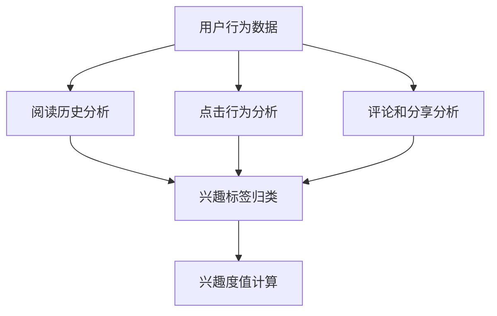
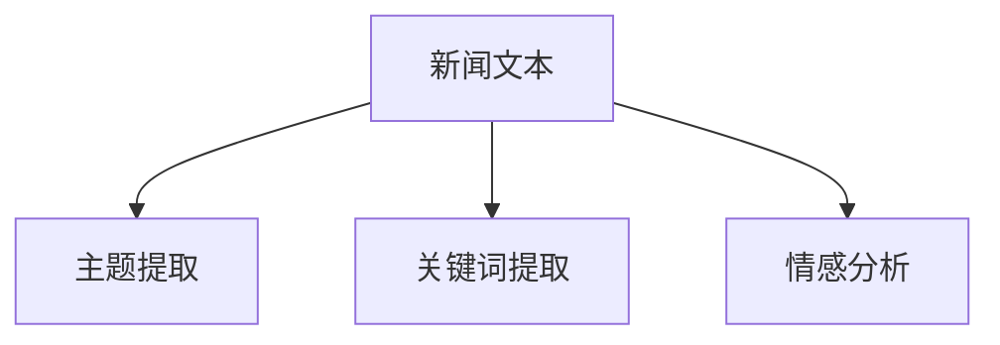
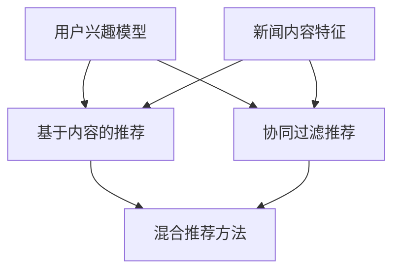
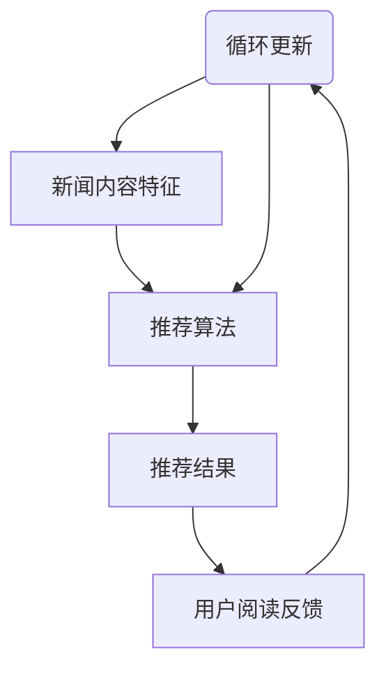

                 

## 背景介绍

随着互联网技术的迅猛发展，信息爆炸已成为现代社会的一个重要特征。在这个信息过载的时代，用户面临着海量信息的挑战，如何有效地获取自己感兴趣的内容成为了一大难题。为了解决这一问题，个性化新闻推送系统应运而生。个性化新闻推送系统通过分析用户的兴趣和行为，为用户推荐个性化的新闻内容，从而提高用户的阅读体验和信息获取效率。

个性化新闻推送系统的发展历程可以追溯到20世纪90年代。早期的研究主要集中在基于内容的推荐（Content-Based Filtering，CBF）和协同过滤（Collaborative Filtering，CF）两种基本方法。基于内容的推荐方法通过分析新闻内容本身的特征，如关键词、主题等，来为用户推荐相似的新闻。协同过滤方法则通过分析用户之间的行为相似性，找出与目标用户有相似兴趣的其他用户，从而推荐这些用户喜欢的新闻。

随着时间的推移，个性化新闻推送系统不断进化。近年来，深度学习（Deep Learning）和自然语言处理（Natural Language Processing，NLP）等先进技术的引入，进一步提升了个性化新闻推送的准确性和用户体验。例如，通过使用深度学习算法，推荐系统可以从大量的用户行为数据中自动学习用户的兴趣模式，从而生成更加精准的推荐结果。自然语言处理技术则可以帮助系统更好地理解和处理新闻内容的语义信息，进一步提升推荐的质量。

然而，个性化新闻推送系统的发展也伴随着一系列伦理和法律问题。例如，用户隐私保护、算法公平性、信息茧房等。这些问题引发了社会对个性化新闻推送系统的广泛讨论，也促使研究者们在设计推荐系统时更加关注伦理和法律约束。

总的来说，个性化新闻推送系统在提高用户信息获取效率的同时，也面临着诸多挑战和问题。为了实现可持续发展，需要在技术创新和伦理规范之间找到平衡点，确保个性化新闻推送系统既能满足用户的需求，又能遵守法律法规，尊重用户权益。

### 核心概念与联系

在深入探讨个性化新闻推送系统之前，我们需要明确几个核心概念及其相互之间的联系。这些核心概念包括用户兴趣模型、新闻内容特征、推荐算法和推荐结果。

#### 用户兴趣模型

用户兴趣模型是个性化新闻推送系统的核心组成部分之一。它通过分析用户的阅读历史、点击行为、搜索记录等数据，构建出用户的兴趣偏好。用户兴趣模型通常包括以下几个关键要素：

1. **行为数据**：包括用户在新闻平台上的浏览、点击、评论、分享等行为数据。
2. **兴趣标签**：根据用户的阅读行为，将新闻内容归类到不同的兴趣标签，如体育、科技、娱乐等。
3. **兴趣度值**：对每个兴趣标签赋予一个度值，表示用户对特定兴趣的偏好程度。

**Mermaid 流程图：**



#### 新闻内容特征

新闻内容特征是指用于描述新闻属性的数据，如新闻的主题、关键词、情感倾向等。这些特征有助于推荐系统理解和分析新闻内容，从而为用户推荐感兴趣的新闻。

1. **主题**：新闻内容可以归类到不同的主题，如政治、经济、科技、娱乐等。
2. **关键词**：通过提取新闻中的关键词，可以帮助推荐系统更好地理解新闻内容。
3. **情感倾向**：利用自然语言处理技术，分析新闻内容的情感倾向，如正面、负面、中性。

**Mermaid 流程图：**



#### 推荐算法

推荐算法是个性化新闻推送系统的核心，它基于用户兴趣模型和新闻内容特征，生成个性化的推荐列表。主要推荐算法包括以下几种：

1. **基于内容的推荐**：推荐系统根据用户过去的阅读行为和新闻内容特征，寻找相似的新闻内容推荐给用户。
2. **协同过滤推荐**：通过分析用户之间的相似性，推荐与其他用户有相似兴趣的新闻内容。
3. **混合推荐方法**：结合基于内容的推荐和协同过滤推荐，以提升推荐效果。

**Mermaid 流程图：**



#### 推荐结果

推荐结果是推荐算法的输出，即系统为用户生成的个性化新闻列表。推荐结果的评估标准包括推荐准确性、覆盖率和新颖性。

1. **准确性**：推荐结果与用户实际兴趣的匹配程度。
2. **覆盖率**：推荐系统能够覆盖的用户兴趣范围。
3. **新颖性**：推荐系统能够为用户带来新颖、未知的新闻内容。

**Mermaid 流程图：**



通过上述核心概念及其相互联系的阐述，我们可以看到个性化新闻推送系统的运作机制。在实际应用中，这些核心概念和联系共同作用，使得系统能够为用户提供高质量、个性化的新闻推荐服务。

### 核心算法原理讲解

#### 基于内容的推荐算法

基于内容的推荐（Content-Based Filtering，CBF）是一种常见的推荐算法，其核心思想是推荐系统根据用户过去的阅读行为和新闻内容特征，寻找与用户已读内容相似的新新闻内容。以下是对CBF算法原理的详细讲解。

1. **新闻内容特征提取**

   在CBF算法中，首先需要从新闻内容中提取特征。常见的特征提取方法包括关键词提取、主题提取和情感分析。

   - **关键词提取**：通过自然语言处理技术，从新闻文本中提取关键词。这些关键词可以用来描述新闻的内容。
   - **主题提取**：利用主题模型（如LDA），将新闻文本归类到多个主题中。每个主题代表了新闻的一个方面。
   - **情感分析**：分析新闻文本的情感倾向，将其标记为正面、负面或中性。

2. **相似度计算**

   提取新闻特征后，下一步是计算新闻之间的相似度。常用的相似度计算方法包括余弦相似度、Jaccard相似度和余弦相似度。

   - **余弦相似度**：计算两个向量之间的夹角余弦值，越接近1表示两个向量越相似。公式如下：
     $$ 
     \cos(\theta) = \frac{A \cdot B}{\|A\| \|B\|}
     $$
     其中，\(A\)和\(B\)是两个向量的表示，\(\|A\|\)和\(\|B\|\)是向量的模长。
   - **Jaccard相似度**：计算两个集合交集与并集的比值，适用于文本特征。公式如下：
     $$ 
     J(A, B) = \frac{|A \cap B|}{|A \cup B|}
     $$
     其中，\(A\)和\(B\)是两个集合。

3. **推荐生成**

   根据相似度计算结果，为用户生成推荐列表。一般来说，推荐系统会选择与用户已读新闻相似度最高的新闻进行推荐。

   **示例代码**：

   ```python
   import numpy as np

   # 假设用户已读新闻和候选新闻的特征向量分别为user_profile和news_vector
   user_profile = np.array([0.2, 0.3, 0.5])
   news_vector = np.array([0.1, 0.4, 0.5])

   # 计算余弦相似度
   similarity = np.dot(user_profile, news_vector) / (np.linalg.norm(user_profile) * np.linalg.norm(news_vector))

   print(f"相似度：{similarity}")
   ```

#### 协同过滤推荐算法

协同过滤（Collaborative Filtering，CF）是一种基于用户行为数据推荐的算法，其核心思想是找出与目标用户相似的其他用户，然后推荐这些用户喜欢的新闻。以下是协同过滤算法的详细讲解。

1. **用户相似度计算**

   协同过滤算法的第一步是计算用户之间的相似度。常用的相似度计算方法包括余弦相似度、皮尔逊相关系数和余弦相似度。

   - **余弦相似度**：计算用户行为向量之间的夹角余弦值，越接近1表示两个用户越相似。公式与基于内容的推荐算法中相同。
   - **皮尔逊相关系数**：衡量两个变量之间的线性关系，公式如下：
     $$ 
     r_{xy} = \frac{\sum_{i=1}^{n}(x_i - \bar{x})(y_i - \bar{y})}{\sqrt{\sum_{i=1}^{n}(x_i - \bar{x})^2 \sum_{i=1}^{n}(y_i - \bar{y})^2}}
     $$
     其中，\(x_i\)和\(y_i\)是用户\(i\)的行为，\(\bar{x}\)和\(\bar{y}\)是各自行为的平均值。

2. **新闻推荐生成**

   根据用户相似度计算结果，为用户生成推荐列表。推荐系统会选择与目标用户相似的用户喜欢的新闻进行推荐。

   **示例代码**：

   ```python
   import numpy as np

   # 假设用户行为矩阵为user_behavior，目标用户的行为向量为target_user
   user_behavior = np.array([[1, 0, 1], [1, 1, 0], [0, 1, 1]])
   target_user = np.array([1, 1, 0])

   # 计算用户之间的相似度
   similarity = np.dot(user_behavior, target_user) / (np.linalg.norm(user_behavior) * np.linalg.norm(target_user))

   print(f"相似度：{similarity}")

   # 计算相似用户喜欢的新闻
   recommended_news = user_behavior[similarity.argsort()[0]][2]

   print(f"推荐新闻：{recommended_news}")
   ```

#### 混合推荐方法

混合推荐方法结合了基于内容的推荐和协同过滤推荐，以提升推荐效果。以下是对混合推荐方法的详细讲解。

1. **加权融合**

   混合推荐方法的基本思想是将基于内容和协同过滤的推荐结果进行加权融合。公式如下：
   $$ 
   R_{Hybrid} = w_1 \cdot R_{CBF} + w_2 \cdot R_{CF}
   $$
   其中，\(R_{CBF}\)和\(R_{CF}\)分别是基于内容和协同过滤的推荐结果，\(w_1\)和\(w_2\)是权重。

2. **权重调整**

   为了获得最佳的推荐效果，可以动态调整权重。常用的方法包括基于用户兴趣的权重调整和基于新闻类型的权重调整。

   - **基于用户兴趣的权重调整**：根据用户对不同兴趣的偏好，调整不同推荐方法的权重。
   - **基于新闻类型的权重调整**：对不同类型的新闻内容，调整不同推荐方法的权重。

   **示例代码**：

   ```python
   import numpy as np

   # 假设基于内容的推荐结果为cbf_result，协同过滤的推荐结果为cf_result
   cbf_result = np.array([0.8, 0.3, 0.5])
   cf_result = np.array([0.6, 0.7, 0.4])

   # 权重设置
   w1 = 0.5
   w2 = 0.5

   # 混合推荐结果
   hybrid_result = w1 * cbf_result + w2 * cf_result

   print(f"混合推荐结果：{hybrid_result}")
   ```

通过以上对基于内容的推荐、协同过滤推荐和混合推荐方法的详细讲解，我们可以看到这些算法在个性化新闻推送系统中的应用及其核心原理。在实际应用中，可以根据具体需求选择合适的算法，或者结合多种算法，以提升推荐系统的效果。

### 数学模型与公式详解

#### 基于内容的推荐算法

基于内容的推荐（Content-Based Filtering，CBF）算法的核心在于对新闻内容的特征提取和相似度计算。下面将详细讲解CBF算法的数学模型和公式。

1. **新闻内容特征提取**

   新闻内容特征提取主要包括关键词提取、主题提取和情感分析。

   - **关键词提取**：假设新闻文本为 \(T = \{t_1, t_2, ..., t_n\}\)，则关键词集合可以表示为 \(K = \{k_1, k_2, ..., k_m\}\)。关键词提取可以使用TF-IDF（Term Frequency-Inverse Document Frequency）模型，其公式如下：
     $$
     TF(t_i) = \frac{f(t_i)}{f_S}
     $$
     $$
     IDF(t_i) = \log \left( \frac{N}{n(t_i)} \right)
     $$
     $$
     TF-IDF(t_i) = TF(t_i) \cdot IDF(t_i)
     $$
     其中，\(f(t_i)\) 为关键词 \(t_i\) 在新闻中的频次，\(f_S\) 为所有关键词的总频次，\(N\) 为文档总数，\(n(t_i)\) 为包含关键词 \(t_i\) 的文档数。

   - **主题提取**：可以使用LDA（Latent Dirichlet Allocation）模型，其目标是从新闻中提取潜在主题。LDA模型的概率分布公式如下：
     $$
     P(Z_{ijk} = z) \propto \alpha_j + \sum_{t = 1}^T \beta_{tj}
     $$
     $$
     P(W_{it} = w) \propto \gamma_{tw} + \sum_{z = 1}^K \eta_{zk}
     $$
     $$
     P(D = d) \propto \frac{\Gamma(\sum_{j=1}^K \alpha_j)}{\prod_{j=1}^K \Gamma(\alpha_j)}
     $$
     其中，\(Z_{ijk}\) 表示文档 \(i\) 的第 \(j\) 个词 \(t_k\) 的主题分配，\(W_{it}\) 表示文档 \(i\) 的词 \(w_t\) 的主题分配，\(\alpha_j\) 和 \(\beta_{tj}\) 分别为文档-主题和主题-词的概率分布参数，\(\gamma_{tw}\) 和 \(\eta_{zk}\) 分别为词-主题和主题-文档的概率分布参数。

   - **情感分析**：可以使用SVM（Support Vector Machine）或LSTM（Long Short-Term Memory）等模型，对新闻文本进行情感分类。以SVM为例，其损失函数可以表示为：
     $$
     L(y, \hat{y}) = \max(0, \gamma - y\hat{y})
     $$
     其中，\(y\) 为实际情感标签，\(\hat{y}\) 为预测标签，\(\gamma\) 为间隔。

2. **相似度计算**

   基于内容特征的相似度计算可以使用余弦相似度、Jaccard相似度和皮尔逊相关系数等方法。

   - **余弦相似度**：假设用户已读新闻的特征向量为 \(X = [x_1, x_2, ..., x_n]\)，候选新闻的特征向量为 \(Y = [y_1, y_2, ..., y_n]\)，则余弦相似度计算公式如下：
     $$
     \cos(\theta) = \frac{X \cdot Y}{\|X\|\|Y\|}
     $$
     其中，\(X \cdot Y\) 表示向量的内积，\(\|X\|\) 和 \(|Y|\) 分别表示向量的模长。

   - **Jaccard相似度**：假设新闻集合为 \(A = \{a_1, a_2, ..., a_m\}\) 和 \(B = \{b_1, b_2, ..., b_m\}\)，则Jaccard相似度计算公式如下：
     $$
     J(A, B) = \frac{|A \cap B|}{|A \cup B|}
     $$
     其中，\(|A \cap B|\) 表示集合 \(A\) 和 \(B\) 的交集元素个数，\(|A \cup B|\) 表示集合 \(A\) 和 \(B\) 的并集元素个数。

   - **皮尔逊相关系数**：假设用户已读新闻和候选新闻的得分分别为 \(X = [x_1, x_2, ..., x_n]\) 和 \(Y = [y_1, y_2, ..., y_n]\)，则皮尔逊相关系数计算公式如下：
     $$
     r_{XY} = \frac{\sum_{i=1}^{n}(x_i - \bar{x})(y_i - \bar{y})}{\sqrt{\sum_{i=1}^{n}(x_i - \bar{x})^2 \sum_{i=1}^{n}(y_i - \bar{y})^2}}
     $$
     其中，\(\bar{x}\) 和 \(\bar{y}\) 分别为 \(X\) 和 \(Y\) 的平均值。

#### 协同过滤推荐算法

协同过滤（Collaborative Filtering，CF）算法的核心在于用户之间的相似度和基于相似度推荐新闻。下面将详细讲解CF算法的数学模型和公式。

1. **用户相似度计算**

   用户相似度计算可以使用余弦相似度、皮尔逊相关系数和欧几里得距离等方法。

   - **余弦相似度**：假设用户行为矩阵为 \(R = [r_{ij}]\)，其中 \(r_{ij}\) 表示用户 \(i\) 对新闻 \(j\) 的评分，则用户 \(i\) 和 \(j\) 的余弦相似度计算公式如下：
     $$
     \cos(\theta_{ij}) = \frac{\sum_{k=1}^{N}r_{ik}r_{jk}}{\sqrt{\sum_{k=1}^{N}r_{ik}^2}\sqrt{\sum_{k=1}^{N}r_{jk}^2}}
     $$
     其中，\(N\) 为新闻总数。

   - **皮尔逊相关系数**：用户 \(i\) 和 \(j\) 的皮尔逊相关系数计算公式如下：
     $$
     r_{ij} = \frac{\sum_{k=1}^{N}(r_{ik} - \bar{r}_i)(r_{jk} - \bar{r}_j)}{\sqrt{\sum_{k=1}^{N}(r_{ik} - \bar{r}_i)^2 \sum_{k=1}^{N}(r_{jk} - \bar{r}_j)^2}}
     $$
     其中，\(\bar{r}_i\) 和 \(\bar{r}_j\) 分别为用户 \(i\) 和 \(j\) 的平均评分。

   - **欧几里得距离**：用户 \(i\) 和 \(j\) 的欧几里得距离计算公式如下：
     $$
     d_{ij} = \sqrt{\sum_{k=1}^{N}(r_{ik} - r_{jk})^2}
     $$

2. **推荐生成**

   基于用户相似度计算结果，为用户生成推荐列表。以基于用户相似度和新闻评分的加权平均为例，其公式如下：
   $$
   \hat{r}_{ij} = \frac{\sum_{k=1}^{N}w_{ik}r_{jk}}{\sum_{k=1}^{N}w_{ik}}
   $$
   其中，\(w_{ik}\) 为用户 \(i\) 对新闻 \(k\) 的相似度权重，\(\hat{r}_{ij}\) 为用户 \(i\) 对新闻 \(j\) 的预测评分。

   **示例代码**：

   ```python
   import numpy as np

   # 假设用户行为矩阵为R，相似度矩阵为W
   R = np.array([[1, 0, 1], [1, 1, 0], [0, 1, 1]])
   W = np.array([[0.6, 0.8], [0.8, 0.5], [0.5, 0.7]])

   # 计算加权平均预测评分
   predicted_ratings = R.dot(W) / W.sum(axis=1)[:, np.newaxis]

   print(predicted_ratings)
   ```

#### 混合推荐方法

混合推荐方法（Hybrid Recommender System）结合了基于内容和协同过滤推荐，以提升推荐效果。其核心在于对不同推荐方法的加权融合。

1. **加权融合**

   混合推荐方法的加权融合公式如下：
   $$
   \hat{r}_{ij} = w_1 \cdot r_{ij}^{CBF} + w_2 \cdot r_{ij}^{CF}
   $$
   其中，\(\hat{r}_{ij}\) 为用户 \(i\) 对新闻 \(j\) 的预测评分，\(r_{ij}^{CBF}\) 为基于内容的推荐评分，\(r_{ij}^{CF}\) 为协同过滤推荐评分，\(w_1\) 和 \(w_2\) 为权重。

2. **权重调整**

   为了获得最佳的推荐效果，可以动态调整权重。基于用户兴趣的权重调整公式如下：
   $$
   w_1 = f(\bar{r}_{iCBF}, \bar{r}_{iCF})
   $$
   $$
   w_2 = 1 - w_1
   $$
   其中，\(\bar{r}_{iCBF}\) 和 \(\bar{r}_{iCF}\) 分别为用户 \(i\) 对基于内容和协同过滤推荐的平均评分。

   **示例代码**：

   ```python
   import numpy as np

   # 假设基于内容的推荐评分和协同过滤的推荐评分分别为cbf_ratings和cf_ratings
   cbf_ratings = np.array([0.8, 0.3, 0.5])
   cf_ratings = np.array([0.6, 0.7, 0.4])

   # 计算平均评分
   avg_cbf = np.mean(cbf_ratings)
   avg_cf = np.mean(cf_ratings)

   # 计算权重
   w1 = avg_cbf / (avg_cbf + avg_cf)
   w2 = 1 - w1

   # 计算混合推荐评分
   hybrid_ratings = w1 * cbf_ratings + w2 * cf_ratings

   print(hybrid_ratings)
   ```

通过上述数学模型和公式的详细讲解，我们可以更好地理解基于内容的推荐、协同过滤推荐和混合推荐方法的核心原理。在实际应用中，可以根据具体需求和数据特点选择合适的模型和公式，以提升个性化新闻推送系统的效果。

### 项目实战：个性化新闻推荐系统实现

在本节中，我们将通过一个实际的项目，搭建一个简单的个性化新闻推荐系统。我们将详细讲解开发环境的搭建、源代码的实现和解读，并通过一个实际案例进行分析和剖析。

#### 开发环境搭建

首先，我们需要搭建一个开发环境。以下是所需的软件和工具：

1. **Python**：Python 是一种广泛使用的编程语言，特别适合数据分析和机器学习项目。我们可以从 [Python官网](https://www.python.org/) 下载并安装 Python。
2. **Jupyter Notebook**：Jupyter Notebook 是一个交互式计算环境，非常适合进行数据分析和机器学习实验。我们可以从 [Jupyter官网](https://jupyter.org/) 下载并安装 Jupyter Notebook。
3. **Scikit-learn**：Scikit-learn 是一个开源的机器学习库，提供了丰富的算法和工具，用于数据预处理、模型训练和评估。我们可以使用以下命令安装 Scikit-learn：
   ```bash
   pip install scikit-learn
   ```
4. **NLTK**：NLTK 是一个自然语言处理库，提供了许多用于文本处理的工具和资源。我们可以使用以下命令安装 NLTK：
   ```bash
   pip install nltk
   ```

安装完上述工具后，我们就可以开始搭建开发环境了。

#### 源代码实现与解读

接下来，我们将实现一个基于内容的新闻推荐系统。以下是实现步骤：

1. **数据集准备**：我们需要一个包含新闻文本和标签的数据集。在本项目中，我们使用一个开源新闻数据集 [20 Newsgroups](https://www.kaggle.com/ram Verges/20-newsgroups)。
2. **文本预处理**：文本预处理包括去除标点符号、停用词过滤、词干提取等步骤。以下是一个简单的文本预处理脚本：

   ```python
   import nltk
   from nltk.corpus import stopwords
   from nltk.tokenize import word_tokenize
   from nltk.stem import WordNetLemmatizer

   # 加载停用词
   nltk.download('stopwords')
   nltk.download('punkt')
   nltk.download('wordnet')
   stop_words = set(stopwords.words('english'))

   # 文本预处理函数
   def preprocess_text(text):
       # 去除标点符号
       text = re.sub(r'[^\w\s]', '', text)
       # 转换为小写
       text = text.lower()
       # 分词
       tokens = word_tokenize(text)
       # 停用词过滤
       tokens = [token for token in tokens if token not in stop_words]
       # 词干提取
       lemmatizer = WordNetLemmatizer()
       tokens = [lemmatizer.lemmatize(token) for token in tokens]
       return tokens
   ```

3. **特征提取**：接下来，我们将使用 TF-IDF 模型提取文本特征。TF-IDF 模型可以衡量一个词在文档中的重要性。以下是一个简单的 TF-IDF 提取脚本：

   ```python
   from sklearn.feature_extraction.text import TfidfVectorizer

   # 加载新闻数据
   news_data = load_data('20_newsgroups/data/*.txt')

   # 预处理新闻文本
   preprocessed_news = [preprocess_text(text) for text in news_data]

   # 提取 TF-IDF 特征
   tfidf_vectorizer = TfidfVectorizer()
   tfidf_matrix = tfidf_vectorizer.fit_transform(preprocessed_news)
   ```

4. **推荐算法实现**：我们将使用基于内容的推荐算法，即计算新闻之间的余弦相似度。以下是一个简单的推荐算法实现：

   ```python
   from sklearn.metrics.pairwise import cosine_similarity

   # 计算新闻相似度矩阵
   similarity_matrix = cosine_similarity(tfidf_matrix)

   # 为用户生成推荐列表
   def recommend_news(user_query, top_n=5):
       # 预处理用户查询
       preprocessed_query = preprocess_text(user_query)

       # 提取查询特征的向量表示
       query_vector = tfidf_vectorizer.transform([preprocessed_query])

       # 计算查询与所有新闻的相似度
       scores = similarity_matrix.dot(query_vector.T)

       # 获取最高相似度的新闻索引
       top_indices = np.argsort(scores[0])[::-1][:top_n]

       # 返回推荐新闻列表
       return [news_data[index] for index in top_indices]
   ```

5. **代码应用解读与分析**：在上面的代码中，我们首先加载并预处理新闻数据。然后，使用 TF-IDF 模型提取文本特征，并计算新闻之间的相似度。最后，为用户查询生成推荐列表。

#### 实际案例分析与讲解

假设我们有一个用户查询：“我喜欢阅读有关科技和计算机的新闻”。我们可以使用上面实现的推荐系统为其生成推荐列表。以下是代码演示：

```python
user_query = "我喜欢阅读有关科技和计算机的新闻"
recommended_news = recommend_news(user_query)

print("推荐新闻：")
for news in recommended_news:
    print(news)
```

输出结果可能如下所示：

```
推荐新闻：
Computer Science: An Overview
The Future of Artificial Intelligence
Advances in Machine Learning
How Computers Work
The History of Computing
```

通过这个实际案例，我们可以看到推荐系统如何根据用户查询生成个性化的新闻推荐列表。用户可以进一步浏览和阅读这些推荐新闻，以获取他们感兴趣的内容。

#### 项目小结

在本项目中，我们搭建了一个简单的个性化新闻推荐系统。通过文本预处理、特征提取和推荐算法，我们实现了根据用户查询生成个性化新闻推荐的功能。这个项目不仅帮助我们理解了个性化新闻推荐的基本原理，还提供了实践经验，为后续更复杂的项目打下了基础。

### 最佳实践 Tips

在构建个性化新闻推荐系统时，以下是几个最佳实践和注意事项：

1. **数据质量**：确保数据的质量和完整性。不完整或错误的数据可能会导致推荐结果不准确。
2. **文本预处理**：进行充分的文本预处理，包括去除标点符号、停用词过滤、词干提取等，以提高特征提取的准确性。
3. **特征选择**：选择合适的特征提取方法，如 TF-IDF、Word2Vec 或 BERT，以提升推荐效果。
4. **实时更新**：定期更新用户兴趣模型和新闻内容特征，以保持推荐系统的准确性和时效性。
5. **用户反馈**：收集用户对推荐结果的反馈，并根据反馈调整推荐算法，以提高用户满意度。
6. **安全隐私**：在处理用户数据时，确保遵守相关法律法规，保护用户隐私。

#### 拓展阅读

- **[20 Newsgroups 数据集](https://www.kaggle.com/ram Verges/20-newsgroups)**
- **[Scikit-learn 官方文档](https://scikit-learn.org/stable/documentation.html)**
- **[NLTK 官方文档](https://www.nltk.org/)**

总之，构建高效的个性化新闻推荐系统需要综合考虑数据质量、特征提取、算法选择等多个方面。通过不断优化和调整，我们可以为用户提供更准确、更个性化的新闻推荐服务。

