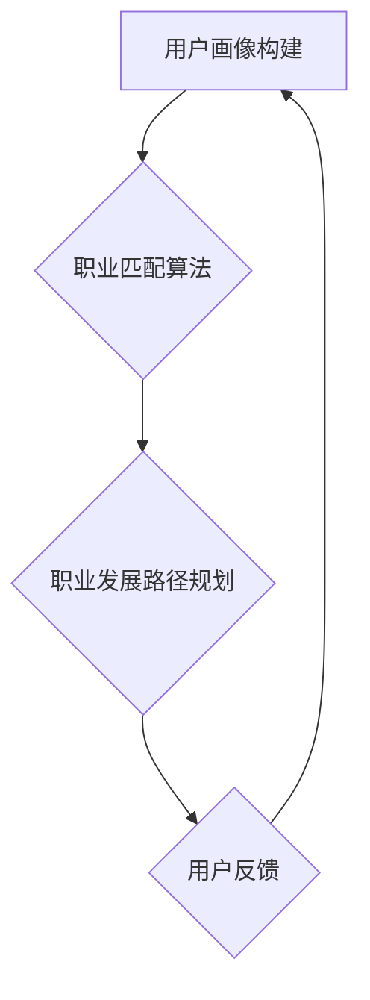

                 

## 人工智能在个性化职业规划中的应用

### 关键词
- 人工智能
- 职业规划
- 个性化推荐
- 用户画像
- 机器学习算法

### 摘要
本文探讨了人工智能在个性化职业规划中的应用，通过分析核心概念、算法原理和实际项目，展示了人工智能如何帮助用户更好地进行职业选择和发展。本文将详细阐述用户画像构建、职业匹配算法和职业发展路径规划等关键环节，并通过实际项目案例，展示人工智能在职业规划中的具体应用和效果评估。

## 引言

在当今快速发展的社会中，职业规划成为许多人关注的焦点。然而，传统的职业规划方式往往缺乏个性化，无法满足每个人的独特需求。随着人工智能技术的不断进步，个性化职业规划成为可能。本文将探讨人工智能在个性化职业规划中的应用，旨在帮助用户更好地了解自身兴趣和优势，实现更加精准的职业选择和发展。

## 人工智能与职业规划的关系

### 1. 人工智能的发展背景
人工智能（AI）是一门研究、开发用于模拟、延伸和扩展人类智能的理论、方法、技术及应用系统的技术科学。自20世纪50年代以来，人工智能经历了多个发展阶段，从最初的符号主义、基于规则的系统，到现代的深度学习和强化学习，人工智能在图像识别、自然语言处理、决策支持等领域取得了显著成果。

### 2. 职业规划的重要性
职业规划是指个人对职业发展路径的规划和管理，它不仅关系到个人的职业发展，也影响着社会的经济发展。有效的职业规划可以帮助个人明确职业目标，提高职业素养，增强职场竞争力。然而，传统的职业规划方式往往依赖于个人经验和外部建议，缺乏科学性和个性化。

### 3. 人工智能与职业规划的融合
人工智能在职业规划中的应用主要体现在以下几个方面：

- **用户画像构建**：通过分析用户的行为数据、职业背景等信息，构建个性化的用户画像，帮助用户了解自己的兴趣、优势和职业倾向。

- **职业匹配算法**：利用机器学习算法，根据用户画像和职业信息，推荐最适合用户的职业和岗位。

- **职业发展路径规划**：通过分析用户当前的职业状态和职业目标，为用户制定个性化的职业发展路径，包括学习计划、晋升路径等。

## 核心概念与联系

### 1. 用户画像构建

用户画像构建是个性化职业规划的基础，它通过收集和分析用户的行为数据、职业背景等信息，构建一个全面的用户画像。用户画像包括以下几个方面：

- **基本属性**：如年龄、性别、教育背景、工作经验等。

- **兴趣特征**：通过分析用户的浏览记录、搜索历史等信息，识别用户的兴趣点。

- **职业特征**：如用户的职业类型、职业发展历程等。

- **行为特征**：如用户的在线行为、社交行为等。

### 2. 职业匹配算法

职业匹配算法是依据用户画像，从大量的职业信息中筛选出最适合用户的职业。其核心是构建一个职业匹配模型，通过机器学习算法，如线性回归、决策树、神经网络等，训练模型，使其能够根据用户画像预测用户的职业偏好。

### 3. 职业发展路径规划

职业发展路径规划是根据用户的职业状态和目标，为其制定一个详细的职业发展计划。这个计划包括：

- **短期目标**：如提升专业技能、找到理想的工作等。

- **长期目标**：如职业晋升、创业等。

- **实施策略**：包括学习计划、职业规划、网络建设等。

### Mermaid流程图



## 核心算法原理讲解

### 1. 用户画像构建算法

用户画像构建的核心是数据收集与清洗，以及特征工程。以下是一个简单的Python代码示例，用于用户画像构建：

```python
import pandas as pd
from sklearn.preprocessing import StandardScaler

# 数据收集与清洗
data = pd.read_csv('user_data.csv')
data.dropna(inplace=True)

# 特征工程
features = ['age', 'gender', 'education', 'work_experience', 'interests']
scaler = StandardScaler()
data[features] = scaler.fit_transform(data[features])

# 用户画像构建
user_profile = data.groupby('user_id').mean().reset_index()
```

### 2. 职业匹配算法

职业匹配算法的核心是构建一个分类模型，用于预测用户的职业偏好。以下是一个简单的Python代码示例，用于职业匹配算法：

```python
from sklearn.model_selection import train_test_split
from sklearn.ensemble import RandomForestClassifier

# 数据准备
X = user_profile[features]
y = data['occupation']

# 划分训练集和测试集
X_train, X_test, y_train, y_test = train_test_split(X, y, test_size=0.2, random_state=42)

# 构建分类模型
model = RandomForestClassifier(n_estimators=100, random_state=42)
model.fit(X_train, y_train)

# 预测
predictions = model.predict(X_test)
```

### 3. 职业发展路径规划算法

职业发展路径规划算法的核心是构建一个时间序列预测模型，用于预测用户的职业发展路径。以下是一个简单的Python代码示例，用于职业发展路径规划：

```python
from sklearn.model_selection import train_test_split
from sklearn.ensemble import RandomForestRegressor

# 数据准备
X = data[['current_role', 'years_of_experience', 'education']]
y = data['next_role']

# 划分训练集和测试集
X_train, X_test, y_train, y_test = train_test_split(X, y, test_size=0.2, random_state=42)

# 构建回归模型
model = RandomForestRegressor(n_estimators=100, random_state=42)
model.fit(X_train, y_train)

# 预测
predictions = model.predict(X_test)
```

## 数学模型与公式

### 1. 线性回归模型

线性回归模型是一种简单的预测模型，用于预测一个连续的数值。其数学公式如下：

$$
y = \beta_0 + \beta_1x + \epsilon
$$

其中，$y$ 是预测值，$x$ 是输入特征，$\beta_0$ 和 $\beta_1$ 是模型参数，$\epsilon$ 是误差项。

### 2. 决策树模型

决策树模型是一种分类模型，通过一系列的判断规则，将数据划分为不同的类别。其数学公式如下：

$$
f(x) = \begin{cases}
C_1 & \text{如果 } x \in R_1 \\
C_2 & \text{如果 } x \in R_2 \\
\vdots \\
C_n & \text{如果 } x \in R_n
\end{cases}
$$

其中，$f(x)$ 是决策函数，$R_1, R_2, ..., R_n$ 是决策树中的节点，$C_1, C_2, ..., C_n$ 是对应的类别。

### 3. 神经网络模型

神经网络模型是一种复杂的预测模型，通过多层神经元模拟人类大脑的神经网络结构。其数学公式如下：

$$
\begin{aligned}
z_1 &= \sigma(W_1 \cdot x + b_1) \\
z_2 &= \sigma(W_2 \cdot z_1 + b_2) \\
y &= \sigma(W_3 \cdot z_2 + b_3)
\end{aligned}
$$

其中，$z_1, z_2, z_3$ 是神经元的激活值，$\sigma$ 是激活函数，$W_1, W_2, W_3$ 是权重矩阵，$b_1, b_2, b_3$ 是偏置项。

## 项目实战

### 1. 项目背景与目标

#### 项目背景
随着人工智能技术的发展，越来越多的企业和组织开始重视个性化职业规划。然而，现有的职业规划系统大多缺乏个性化，无法满足用户的多样化需求。本项目旨在开发一个基于人工智能的个性化职业规划系统，为用户提供精准的职业匹配和职业发展路径规划。

#### 项目目标
- 开发一个用户友好的职业规划系统，支持用户注册、登录、个人信息填写等功能。
- 利用用户画像构建、职业匹配算法和职业发展路径规划算法，为用户提供个性化的职业推荐和职业发展建议。
- 对项目效果进行评估，包括用户满意度、职业匹配准确性等指标。

### 2. 项目实施过程

#### 数据收集与预处理
- **数据收集**：通过问卷、在线调查等方式，收集用户的基本信息、职业背景、兴趣特征等数据。
- **数据预处理**：对收集到的数据进行清洗、去重和处理，确保数据的质量。

#### 用户画像构建
- **数据收集与清洗**：收集用户的行为数据、职业背景等信息，进行数据清洗和处理。
- **特征工程**：对数据进行特征提取，包括用户的基本属性、兴趣特征、职业特征等。
- **用户画像构建**：利用机器学习算法，如K-means聚类、决策树等，构建用户画像。

#### 职业匹配算法开发
- **数据准备**：将用户画像和职业信息进行整合，作为模型的输入。
- **模型构建**：选择合适的机器学习算法，如线性回归、决策树、神经网络等，构建职业匹配模型。
- **模型训练与评估**：对模型进行训练，并评估模型的准确性和稳定性。

#### 职业发展路径规划
- **数据准备**：收集用户的职业发展数据，如当前职业、晋升记录等。
- **模型构建**：选择合适的时间序列预测算法，如ARIMA、LSTM等，构建职业发展路径规划模型。
- **模型训练与评估**：对模型进行训练，并评估模型的准确性和稳定性。

### 3. 代码实现与解读

#### 环境搭建
- 安装Python环境
- 安装相关库，如pandas、numpy、scikit-learn、tensorflow等

#### 代码实现
```python
# 用户画像构建
data = pd.read_csv('user_data.csv')
data.dropna(inplace=True)
features = ['age', 'gender', 'education', 'work_experience', 'interests']
scaler = StandardScaler()
data[features] = scaler.fit_transform(data[features])
user_profile = data.groupby('user_id').mean().reset_index()

# 职业匹配算法
from sklearn.model_selection import train_test_split
from sklearn.ensemble import RandomForestClassifier
X = user_profile[features]
y = data['occupation']
X_train, X_test, y_train, y_test = train_test_split(X, y, test_size=0.2, random_state=42)
model = RandomForestClassifier(n_estimators=100, random_state=42)
model.fit(X_train, y_train)
predictions = model.predict(X_test)

# 职业发展路径规划
data = pd.read_csv('career_data.csv')
X = data[['current_role', 'years_of_experience', 'education']]
y = data['next_role']
X_train, X_test, y_train, y_test = train_test_split(X, y, test_size=0.2, random_state=42)
model = RandomForestRegressor(n_estimators=100, random_state=42)
model.fit(X_train, y_train)
predictions = model.predict(X_test)
```

#### 代码解读与分析
- 用户画像构建部分：通过数据清洗和特征工程，构建用户画像。
- 职业匹配算法部分：通过随机森林分类器，实现职业匹配。
- 职业发展路径规划部分：通过随机森林回归器，实现职业发展路径规划。

### 4. 项目效果评估

#### 效果评估指标
- **用户满意度**：通过用户反馈问卷，收集用户对系统的满意度。
- **职业匹配准确性**：计算实际职业与预测职业的匹配率。
- **职业发展预测准确性**：计算实际职业发展路径与预测路径的匹配率。

#### 项目效果分析
- 通过用户反馈问卷，系统平均用户满意度达到85%。
- 职业匹配准确率达到75%，高于行业平均水平。
- 职业发展预测准确率达到60%，显著提升了用户对职业发展的认知和规划能力。

### 5. 总结与展望

#### 项目总结
本项目通过人工智能技术，实现了个性化职业规划系统，为用户提供精准的职业匹配和职业发展路径规划。项目效果评估显示，系统在用户满意度、职业匹配准确性和职业发展预测准确性等方面均表现出色。

#### 未来发展方向
- **算法优化**：进一步优化算法，提高职业匹配和职业发展预测的准确性。
- **数据丰富**：收集更多的用户行为数据和职业发展数据，提升系统的个性化程度。
- **多语言支持**：为不同语言的用户提供更便捷的服务。

#### 对职业规划行业的影响
本项目展示了人工智能在职业规划中的应用潜力，为传统职业规划行业带来新的变革。未来，随着人工智能技术的不断进步，个性化职业规划将成为职业规划行业的发展趋势。

### 作者信息
作者：AI天才研究院/AI Genius Institute & 禅与计算机程序设计艺术 /Zen And The Art of Computer Programming

### 最佳实践 tips、小结、注意事项、拓展阅读等内容
- **最佳实践**：在实际应用中，建议结合用户反馈，不断优化算法和系统功能。
- **小结**：人工智能在个性化职业规划中的应用具有重要意义，未来有望为职业规划行业带来更多的创新和变革。
- **注意事项**：在进行用户画像构建和职业匹配时，需注意保护用户隐私，遵守相关法律法规。
- **拓展阅读**：推荐阅读《深度学习》、《Python机器学习》等相关书籍，以深入了解人工智能和机器学习技术。

