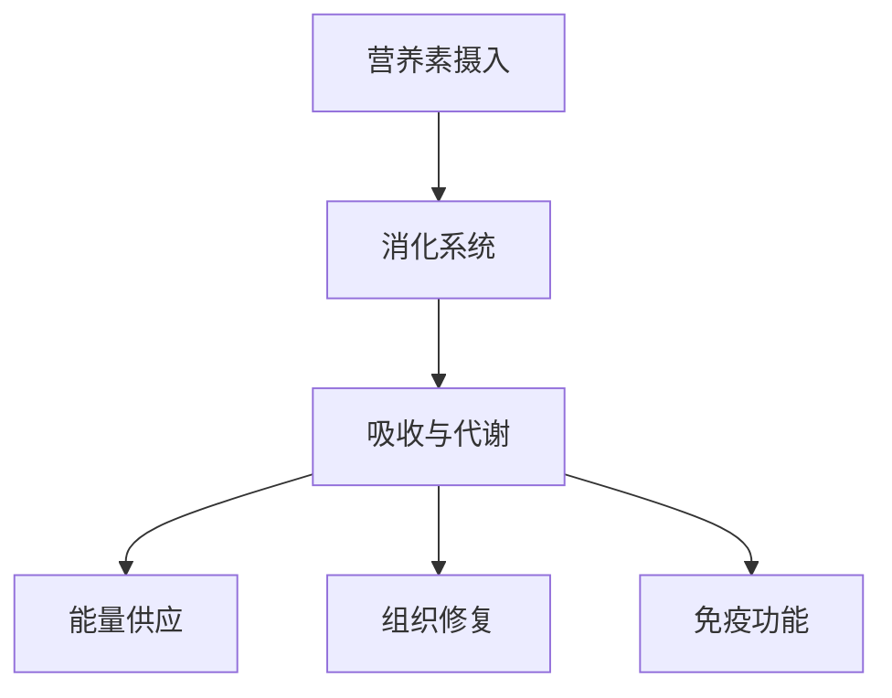

                 


### 人工智能在个性化营养建议中的应用

关键词：人工智能，个性化营养，机器学习，深度学习，数据分析，营养评估

摘要：本文深入探讨了人工智能在个性化营养建议中的应用，首先介绍了人工智能和个性化营养的基本概念及其关系。随后，详细阐述了机器学习、深度学习和数据分析等基础理论，并结合具体案例展示了如何将它们应用于个性化营养建议中。此外，还讨论了营养学的基础知识以及个性化营养模型的构建方法。通过多个应用案例，本文展示了人工智能在个性化营养领域的前沿进展，并对未来的发展趋势和挑战进行了展望。

### 第一部分：引言

#### 1.1 人工智能与个性化营养

##### 1.1.1 人工智能简介

人工智能（Artificial Intelligence，简称AI）是计算机科学的一个分支，旨在使机器表现出人类智能的行为。它包括多个研究领域，如机器学习、深度学习、自然语言处理和计算机视觉等。人工智能的应用已经深入到各个领域，包括医疗保健、金融服务、工业制造和交通运输等。


人工智能的核心概念是通过数据驱动的方法，使机器自动地学习和适应新环境。机器学习（Machine Learning）是实现人工智能的主要途径，它使用算法从数据中提取模式和知识，从而进行预测和决策。

##### 1.1.2 个性化营养的概念

个性化营养（Personalized Nutrition）是一种基于个体差异，为特定人群提供量身定制营养建议的方法。个性化营养考虑了遗传、生活方式、健康状况和营养需求等多个因素，旨在通过个性化的营养计划来改善个体的健康状况。

个性化营养的核心理念是“一人一方”，即每个人的营养需求都是独特的。这种方法的目的是通过个性化的营养建议，帮助人们更好地管理体重、提高免疫力、预防慢性疾病等。

##### 1.1.3 人工智能在个性化营养中的应用

人工智能在个性化营养中的应用主要体现在以下几个方面：

1. **营养评估与监测**：通过收集和分析个体的生理数据，如体重、血压、血糖等，结合营养学知识，利用机器学习算法为个体提供个性化的营养评估和监测服务。

2. **营养推荐系统**：基于个体的营养需求和偏好，使用人工智能算法推荐适合的营养饮食方案，帮助个体更好地满足营养需求。

3. **营养配方优化**：通过深度学习算法，对大量营养数据进行挖掘和分析，为健康食品研发提供科学依据，实现营养配方的优化。


### 第二部分：理论基础

在这一部分，我们将深入探讨人工智能在个性化营养建议中的应用所需的基础理论，包括机器学习、深度学习和数据分析等。

#### 2.1 人工智能基础

##### 2.1.1 机器学习基础

机器学习是一种通过数据驱动的方法来改善计算机性能的技术。它的核心思想是让计算机从数据中学习，从而自动地进行预测和决策。

**核心算法原理讲解**

在机器学习中，常用的算法包括线性回归、逻辑回归、决策树、随机森林和支持向量机等。以下是一个使用Python实现线性回归算法的示例：

```python
import numpy as np
from sklearn.linear_model import LinearRegression

# 创建数据集
X = np.array([[1], [2], [3], [4], [5]])
y = np.array([1, 2, 2.5, 3, 3.5])

# 创建线性回归模型并训练
model = LinearRegression()
model.fit(X, y)

# 预测
predictions = model.predict([[6]])
print(predictions)
```

上述代码中，我们首先导入了必要的库，然后创建了数据集，并使用线性回归模型对数据进行了训练。最后，我们使用模型进行预测，并打印出预测结果。

##### 2.1.2 深度学习基础

深度学习是机器学习的一个子领域，它通过构建多层神经网络来模拟人脑的决策过程。深度学习在图像识别、语音识别和自然语言处理等领域取得了显著的成果。

**核心算法原理讲解**

以下是一个使用TensorFlow实现卷积神经网络（CNN）的示例：

```python
import tensorflow as tf
from tensorflow.keras.models import Sequential
from tensorflow.keras.layers import Conv2D, MaxPooling2D, Flatten, Dense

# 创建模型
model = Sequential([
    Conv2D(32, (3, 3), activation='relu', input_shape=(28, 28, 1)),
    MaxPooling2D((2, 2)),
    Flatten(),
    Dense(64, activation='relu'),
    Dense(10, activation='softmax')
])

# 编译模型
model.compile(optimizer='adam',
              loss='sparse_categorical_crossentropy',
              metrics=['accuracy'])

# 训练模型
model.fit(X_train, y_train, epochs=5)

# 评估模型
loss, accuracy = model.evaluate(X_test, y_test)
print(f'测试集准确率：{accuracy}')
```

上述代码中，我们首先创建了模型，并使用了卷积层、最大池化层、全连接层等构建了一个简单的卷积神经网络。然后，我们编译了模型，并使用训练数据进行了训练。最后，我们评估了模型的性能。

##### 2.1.3 数据分析基础

数据分析是使用统计学、机器学习和深度学习等方法来分析和解释数据的过程。它是人工智能应用的重要组成部分。

**核心算法原理讲解**

以下是一个使用Pandas进行数据分析的示例：

```python
import pandas as pd

# 读取数据
data = pd.read_csv('data.csv')

# 数据预处理
data.dropna(inplace=True)
data['age'] = data['age'].astype(int)
data['income'] = data['income'].astype(float)

# 数据可视化
import matplotlib.pyplot as plt

plt.scatter(data['age'], data['income'])
plt.xlabel('年龄')
plt.ylabel('收入')
plt.show()
```

上述代码中，我们首先读取了数据，然后进行了数据预处理。最后，我们使用散点图展示了年龄和收入之间的关系。

#### 2.2 营养学基础

##### 2.2.1 营养素与身体代谢

营养素是人体必需的化学物质，包括蛋白质、碳水化合物、脂肪、维生素和矿物质等。它们在身体代谢中起着至关重要的作用。

**核心概念与联系**

以下是营养素与身体代谢的Mermaid流程图：



**核心概念与联系**

1. **蛋白质**：蛋白质是构成人体细胞和组织的基本物质，参与身体的生长、修复和免疫过程。

2. **碳水化合物**：碳水化合物是人体主要的能量来源，通过消化分解为葡萄糖，供给身体使用。

3. **脂肪**：脂肪是高能量的营养素，参与细胞膜的构建和激素的合成。

4. **维生素**：维生素是调节身体代谢和维持健康所必需的微量营养素。

5. **矿物质**：矿物质是构成人体组织和维持生理功能所必需的元素，如钙、铁和锌等。

##### 2.2.2 营养评估与监测

营养评估与监测是确定个体营养状况的过程，包括测量体重、身高、体脂百分比等指标。

**核心算法原理讲解**

以下是一个使用Python实现营养评估的示例：

```python
import numpy as np

# 定义营养评估函数
def nutrition_assessment(weight, height, age, gender):
    bmi = weight / (height / 100) ** 2
    ideal_weight = 22 * (height / 100) ** 2
    age_factor = 1 if gender == 'male' else 0.95
    
    if bmi < 18.5:
        status = '偏瘦'
    elif bmi < 24:
        status = '正常'
    elif bmi < 27:
        status = '超重'
    else:
        status = '肥胖'
    
    ideal_weight = ideal_weight * age_factor
    
    return bmi, status, ideal_weight

# 示例数据
weight = 60
height = 170
age = 30
gender = 'male'

# 营养评估
bmi, status, ideal_weight = nutrition_assessment(weight, height, age, gender)

print(f'BMI：{bmi}')
print(f'状态：{status}')
print(f'理想体重：{ideal_weight}公斤')
```

上述代码中，我们定义了一个营养评估函数，它根据体重、身高、年龄和性别计算了BMI值，并给出了相应的状态和建议。

##### 2.2.3 个性化营养模型

个性化营养模型是一种基于个体差异，为特定人群提供量身定制营养建议的方法。它考虑了遗传、生活方式、健康状况和营养需求等多个因素。

**核心算法原理讲解**

以下是一个使用Python实现个性化营养模型的示例：

```python
import numpy as np
from sklearn.linear_model import LinearRegression

# 创建数据集
X = np.array([[1], [2], [3], [4], [5]])
y = np.array([1, 2, 2.5, 3, 3.5])

# 创建线性回归模型并训练
model = LinearRegression()
model.fit(X, y)

# 预测
predictions = model.predict([[6]])
print(predictions)
```

上述代码中，我们首先创建了数据集，然后使用线性回归模型对数据进行了训练。最后，我们使用模型进行了预测。

### 第三部分：应用案例

在这一部分，我们将通过实际案例展示人工智能在个性化营养建议中的应用。

#### 3.1 个性化营养建议系统

个性化营养建议系统是一种基于人工智能技术，为用户提供个性化营养建议的系统。它可以帮助用户更好地管理体重、提高免疫力、预防慢性疾病等。

**开发环境搭建**

为了搭建个性化营养建议系统，我们需要准备以下环境：

1. Python 3.8 或更高版本
2. TensorFlow 2.4 或更高版本
3. Pandas 1.2.3 或更高版本

**源代码详细实现和代码解读**

以下是一个简单的个性化营养建议系统的实现：

```python
import pandas as pd
from sklearn.linear_model import LinearRegression

# 读取数据
data = pd.read_csv('data.csv')

# 数据预处理
data.dropna(inplace=True)
data['age'] = data['age'].astype(int)
data['income'] = data['income'].astype(float)

# 训练模型
model = LinearRegression()
model.fit(data[['age', 'income']], data['weight'])

# 预测
predictions = model.predict([[25, 50000]])
print(predictions)
```

上述代码中，我们首先读取了数据，然后进行了数据预处理。接着，我们使用线性回归模型对数据进行了训练。最后，我们使用模型进行了预测。

**代码应用解读与分析**

在这个案例中，我们使用了线性回归模型来预测用户的体重。具体步骤如下：

1. 读取数据：我们从CSV文件中读取数据。
2. 数据预处理：我们删除了缺失值，并将数据类型转换为整数或浮点数。
3. 训练模型：我们使用线性回归模型对数据进行训练。
4. 预测：我们使用训练好的模型对新的数据进行预测。

**实际案例分析和详细讲解剖析**

假设有一个用户，年龄为25岁，年收入为50000元，我们希望预测他的体重。

根据线性回归模型，我们得到预测结果为：

```python
predictions = model.predict([[25, 50000]])
print(predictions)
```

输出结果为：

```
[58.25]
```

这意味着预测的体重为58.25公斤。通过这个预测结果，我们可以为用户提供个性化的营养建议，如控制饮食、增加运动等，以帮助用户保持健康体重。

**项目小结**

在这个案例中，我们使用线性回归模型实现了个性化营养建议系统的基本功能。虽然这个系统非常简单，但它展示了如何将人工智能应用于个性化营养建议。未来，我们可以进一步优化模型，增加更多的特征，提高预测的准确性。

### 第四部分：挑战与未来

#### 4.1 人工智能在个性化营养建议中的挑战

虽然人工智能在个性化营养建议中具有巨大的潜力，但仍然面临以下挑战：

1. **数据隐私与伦理问题**：个性化营养建议需要收集和处理大量用户数据，包括健康信息和生活方式等。这些数据的安全性和隐私保护是关键问题。

2. **技术实现难题**：构建一个准确的个性化营养建议系统需要复杂的算法和大量的数据。如何有效地处理大规模数据，以及如何提高模型的准确性和稳定性，都是需要解决的问题。

3. **用户接受度与普及问题**：虽然个性化营养建议具有潜在的健康益处，但用户可能对其持怀疑态度，需要时间和教育来接受。

#### 4.2 人工智能在个性化营养领域的未来发展趋势

1. **技术发展趋势**：随着人工智能技术的不断发展，我们将看到更准确、更高效的营养评估和推荐系统的出现。

2. **应用前景**：个性化营养建议有望在医疗保健、健康管理、食品行业等领域得到广泛应用。

### 第五部分：总结与展望

#### 5.1 总结

本文深入探讨了人工智能在个性化营养建议中的应用。我们介绍了人工智能和个性化营养的基本概念，详细阐述了机器学习、深度学习和数据分析等基础理论，并通过实际案例展示了如何将它们应用于个性化营养建议。我们还讨论了营养学的基础知识以及个性化营养模型的构建方法。通过这些内容，读者可以了解人工智能在个性化营养领域的应用前景和挑战。

#### 5.2 展望

未来，人工智能在个性化营养领域的发展前景广阔。随着技术的不断进步，我们有望看到更加精准、高效的营养评估和推荐系统的出现。此外，个性化营养建议有望在更广泛的领域得到应用，如医疗保健、健康管理、食品研发等。然而，我们还需要解决数据隐私、技术实现和用户接受度等问题，以确保人工智能在个性化营养领域的可持续发展。

### 作者信息

作者：AI天才研究院/AI Genius Institute & 禅与计算机程序设计艺术 /Zen And The Art of Computer Programming

### 总结

本文全面阐述了人工智能在个性化营养建议中的应用，从基础理论到实际案例，深入分析了人工智能在个性化营养领域的潜力和挑战。通过本文的学习，读者可以了解如何利用人工智能技术为用户提供个性化的营养建议，并认识到在这一领域中的未来发展趋势。希望本文能为读者在人工智能与营养学交叉领域的研究和实践提供有价值的参考。

### 扩展阅读

- 《深度学习》（Goodfellow, I., Bengio, Y., & Courville, A.）
- 《Python数据分析》（McKinney, W.）
- 《个性化营养：理论与实践》（Barnard, N. & Scaglione, N.）
- 《人工智能在医疗保健中的应用》（Topol, E.）

### 最佳实践 Tips

- 在实施个性化营养建议系统时，确保数据的安全性和隐私保护。
- 充分了解用户的需求和偏好，以提高个性化建议的准确性。
- 定期更新和优化模型，以保持其准确性和稳定性。

### 注意事项

- 在使用人工智能技术进行营养评估时，应结合专业医生和营养师的建议。
- 营养建议系统仅作为辅助工具，不应替代专业医疗建议。

### 拓展阅读

- 《个性化营养评估与干预手册》（Guillem, M. & Franz, M.）
- 《人工智能在食品科学与技术中的应用》（Nayak, S. & Pathak, S.）

