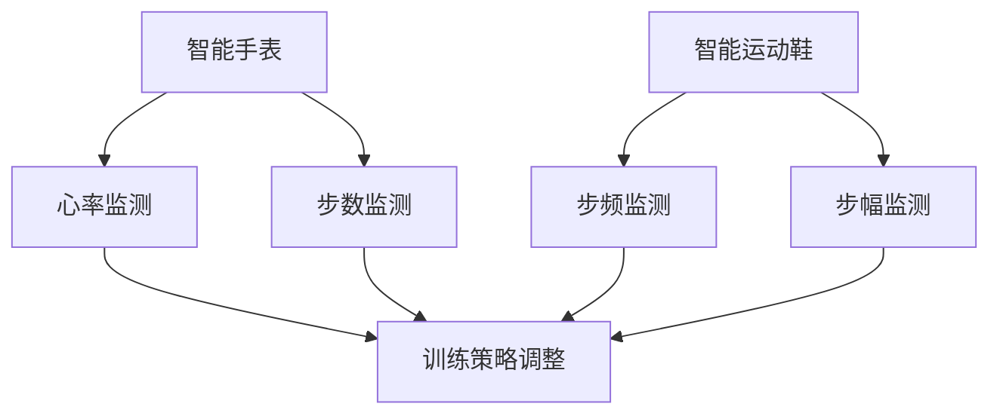
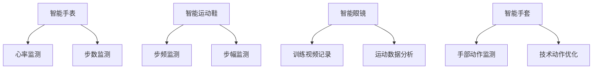
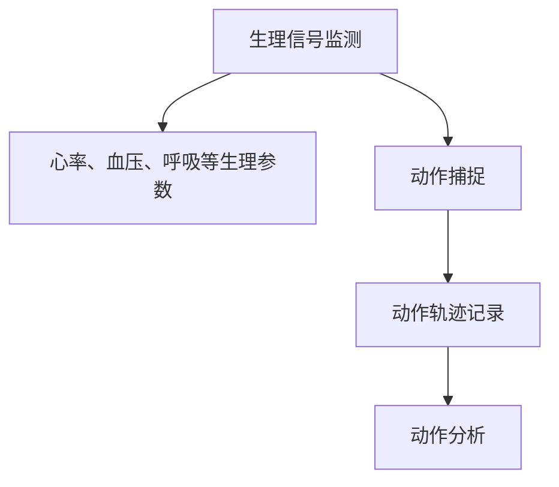
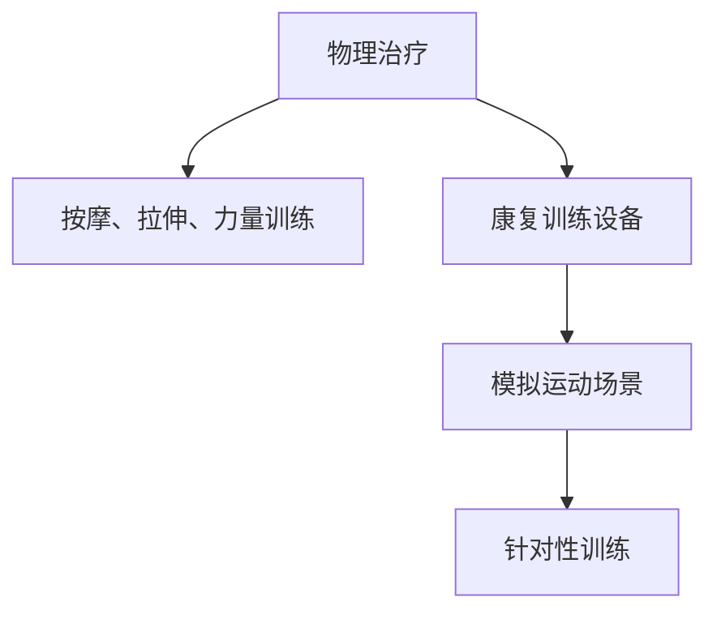

                 

# 《人工智能在体育训练中的创新应用》

## 摘要

本文旨在探讨人工智能在体育训练中的创新应用，通过深入分析人工智能与体育训练的关系，介绍人工智能的基础知识，阐述其在体育训练中的具体应用，并探讨人工智能与体育康复、体育管理及体育营销等方面的关联。文章最后对未来人工智能在体育训练中的发展趋势、挑战与机遇以及研究方向进行了展望。

## 关键词

- 人工智能
- 体育训练
- 数据分析
- 智能穿戴设备
- 运动表现分析
- 康复训练
- 选手选拔
- 赛事管理
- 体育营销

## 引言

### 1.1 人工智能与体育训练的关系

随着科技的飞速发展，人工智能（AI）逐渐渗透到各个领域，为传统行业带来了全新的变革。在体育训练领域，人工智能的应用为运动员的个性化训练、技术动作优化、体能管理等方面提供了强有力的支持，从而提高运动表现和竞技水平。

### 1.2 人工智能在体育训练中的发展现状

目前，人工智能在体育训练中的应用主要集中在数据采集与分析、技术动作优化、体能训练策略优化等方面。通过智能穿戴设备、传感器技术等手段，运动员的动作、心率、血压等数据可以被实时采集并进行分析，为教练和运动员提供科学合理的训练方案。

### 1.3 本书的目的与结构安排

本文将首先介绍人工智能的基础知识，包括机器学习和深度学习的基本原理。然后，详细阐述人工智能在体育训练中的应用，包括数据采集与分析、技术应用、智能穿戴设备等方面。接着，讨论人工智能与运动康复、体育管理及体育营销等方面的关联。最后，对未来人工智能在体育训练中的发展趋势、挑战与机遇以及研究方向进行展望。

## 人工智能基础

### 2.1 人工智能概述

#### 2.1.1 人工智能的定义

人工智能（Artificial Intelligence，简称AI）是指计算机系统模拟人类智能行为的能力，包括感知、理解、学习、推理、规划等。人工智能的目的是使计算机具有人类智能的特点，从而实现自动化、智能化。

#### 2.1.2 人工智能的发展历程

人工智能的发展可以分为四个阶段：

1. **诞生阶段（1950s-1960s）**：人工智能的概念提出，早期研究主要集中在符号主义和逻辑推理。
2. **繁荣阶段（1970s-1980s）**：人工智能应用逐渐扩展，专家系统、自然语言处理等领域取得重要突破。
3. **低谷阶段（1990s）**：由于实际应用受限，人工智能研究进入低谷。
4. **复兴阶段（2000s-至今）**：随着计算机性能的不断提升和深度学习技术的发展，人工智能迎来了新的发展机遇。

### 2.2 机器学习基础

机器学习（Machine Learning，简称ML）是人工智能的核心技术之一，它通过数据驱动的方式，使计算机能够自动改进性能，实现从数据中学习规律和模式。

#### 2.2.1 监督学习

监督学习（Supervised Learning）是一种最常用的机器学习方法，它通过已标记的训练数据集，学习输入和输出之间的映射关系。监督学习包括回归分析和分类分析。

##### 回归分析

回归分析（Regression Analysis）用于预测连续值的输出。常见的回归模型包括线性回归、多项式回归、岭回归等。

```python
import numpy as np
from sklearn.linear_model import LinearRegression

# 假设数据集 X 为特征矩阵，y 为目标值
X = np.array([[1, 2], [2, 3], [3, 4]])
y = np.array([2, 3, 4])

# 创建线性回归模型
model = LinearRegression()

# 训练模型
model.fit(X, y)

# 预测新数据
new_data = np.array([[4, 5]])
predicted_value = model.predict(new_data)

print(predicted_value)
```

##### 分类分析

分类分析（Classification Analysis）用于预测离散值的输出。常见的分类模型包括逻辑回归、支持向量机（SVM）、决策树等。

```python
import numpy as np
from sklearn.tree import DecisionTreeClassifier

# 假设数据集 X 为特征矩阵，y 为标签
X = np.array([[1, 2], [2, 3], [3, 4]])
y = np.array([0, 1, 0])

# 创建决策树分类模型
model = DecisionTreeClassifier()

# 训练模型
model.fit(X, y)

# 预测新数据
new_data = np.array([[4, 5]])
predicted_label = model.predict(new_data)

print(predicted_label)
```

#### 2.2.2 无监督学习

无监督学习（Unsupervised Learning）不需要标记的训练数据，通过发现数据中的结构和模式来学习。常见的无监督学习方法包括聚类分析、降维等。

##### 聚类分析

聚类分析（Clustering Analysis）用于将数据分为不同的组，使同一组内的数据尽可能相似，不同组的数据尽可能不同。常见的聚类算法包括K-means、层次聚类等。

```python
import numpy as np
from sklearn.cluster import KMeans

# 假设数据集 X 为特征矩阵
X = np.array([[1, 2], [2, 3], [3, 4], [4, 5]])

# 创建K-means聚类模型
model = KMeans(n_clusters=2)

# 训练模型
model.fit(X)

# 获取聚类结果
labels = model.labels_

print(labels)
```

##### 降维

降维（Dimensionality Reduction）用于减少数据维度，同时保留主要的信息。常见的降维方法包括主成分分析（PCA）、t-SVD等。

```python
import numpy as np
from sklearn.decomposition import PCA

# 假设数据集 X 为特征矩阵
X = np.array([[1, 2], [2, 3], [3, 4], [4, 5]])

# 创建PCA模型
model = PCA(n_components=2)

# 训练模型
X_reduced = model.fit_transform(X)

print(X_reduced)
```

#### 2.2.3 强化学习

强化学习（Reinforcement Learning，简称RL）是一种通过奖励机制来学习策略的机器学习方法。强化学习主要包括值函数方法、策略方法等。

##### 值函数方法

值函数方法（Value Function Method）用于预测在给定状态下采取某种动作的长期回报。常见的值函数方法包括Q学习、SARSA等。

```python
import numpy as np
from gym import environment

# 创建环境
env = environment('CartPole-v0')

# 初始化Q值表
Q = np.zeros([env.observation_space.n, env.action_space.n])

# 设置学习参数
alpha = 0.1
gamma = 0.9

# Q学习算法
for episode in range(1000):
    state = env.reset()
    done = False
    total_reward = 0
    while not done:
        action = np.argmax(Q[state])
        next_state, reward, done, _ = env.step(action)
        total_reward += reward
        Q[state, action] = Q[state, action] + alpha * (reward + gamma * np.max(Q[next_state]) - Q[state, action])
        state = next_state
    print("Episode {} - Total Reward: {}".format(episode, total_reward))
```

##### 策略方法

策略方法（Policy Method）直接学习最优动作策略。常见的策略方法包括策略梯度方法、REINFORCE等。

```python
import numpy as np
from gym import environment

# 创建环境
env = environment('CartPole-v0')

# 初始化策略参数
theta = np.random.randn(env.action_space.n)

# 设置学习参数
alpha = 0.1
gamma = 0.9

# 策略梯度算法
for episode in range(1000):
    state = env.reset()
    done = False
    total_reward = 0
    while not done:
        action = np.argmax(np.tanh(np.dot(state, theta)))
        next_state, reward, done, _ = env.step(action)
        total_reward += reward
        theta += alpha * (reward + gamma * np.tanh(np.dot(next_state, theta)) - np.tanh(np.dot(state, theta)))
        state = next_state
    print("Episode {} - Total Reward: {}".format(episode, total_reward))
```

### 2.3 深度学习基础

深度学习（Deep Learning，简称DL）是一种基于多层神经网络的学习方法，通过自动提取特征，实现高度复杂的非线性建模。深度学习在图像识别、语音识别、自然语言处理等领域取得了显著成果。

#### 2.3.1 神经网络

神经网络（Neural Network，简称NN）是一种模仿生物神经网络结构的人工神经网络。神经网络由多个神经元（节点）组成，每个神经元都与相邻的神经元相连，并通过权重和偏置进行信息传递。

```python
import numpy as np

# 创建神经网络
def neural_network(x, weights, bias):
    return np.dot(x, weights) + bias

# 假设输入数据 x，权重 weights 和偏置 bias
x = np.array([1, 2, 3])
weights = np.array([[0.1, 0.2], [0.3, 0.4]])
bias = np.array([0.5, 0.6])

# 计算神经网络输出
output = neural_network(x, weights, bias)
print(output)
```

#### 2.3.2 卷积神经网络

卷积神经网络（Convolutional Neural Network，简称CNN）是一种专门用于处理图像数据的神经网络。CNN通过卷积操作、池化操作和全连接层，实现图像特征的自动提取。

```python
import numpy as np
import tensorflow as tf

# 创建卷积神经网络模型
model = tf.keras.Sequential([
    tf.keras.layers.Conv2D(32, (3, 3), activation='relu', input_shape=(28, 28, 1)),
    tf.keras.layers.MaxPooling2D((2, 2)),
    tf.keras.layers.Flatten(),
    tf.keras.layers.Dense(128, activation='relu'),
    tf.keras.layers.Dense(10, activation='softmax')
])

# 编译模型
model.compile(optimizer='adam', loss='categorical_crossentropy', metrics=['accuracy'])

# 加载图像数据
(x_train, y_train), (x_test, y_test) = tf.keras.datasets.mnist.load_data()

# 预处理图像数据
x_train = x_train.astype('float32') / 255
x_test = x_test.astype('float32') / 255
x_train = np.expand_dims(x_train, -1)
x_test = np.expand_dims(x_test, -1)

# 转换标签为独热编码
y_train = tf.keras.utils.to_categorical(y_train, 10)
y_test = tf.keras.utils.to_categorical(y_test, 10)

# 训练模型
model.fit(x_train, y_train, epochs=10, batch_size=32, validation_data=(x_test, y_test))

# 评估模型
test_loss, test_acc = model.evaluate(x_test, y_test)
print('Test accuracy:', test_acc)
```

#### 2.3.3 循环神经网络

循环神经网络（Recurrent Neural Network，简称RNN）是一种专门用于处理序列数据的神经网络。RNN通过循环连接，实现序列数据的建模。

```python
import numpy as np
import tensorflow as tf

# 创建循环神经网络模型
model = tf.keras.Sequential([
    tf.keras.layers.LSTM(50, activation='relu', return_sequences=True),
    tf.keras.layers.LSTM(50, activation='relu'),
    tf.keras.layers.Dense(1)
])

# 编译模型
model.compile(optimizer='adam', loss='mse')

# 生成训练数据
x = np.random.random((100, 10))
y = np.random.random((100, 1))

# 训练模型
model.fit(x, y, epochs=100)

# 评估模型
loss = model.evaluate(x, y)
print('Loss:', loss)
```

## 人工智能在体育训练中的应用

### 3.1 数据采集与分析

数据采集与分析是人工智能在体育训练中的基础。通过智能穿戴设备、传感器技术等手段，可以实时采集运动员的运动数据，包括动作、心率、血压、体温等。

#### 3.1.1 传感器技术的应用

传感器技术在体育训练中的应用非常广泛。例如，智能手表可以实时监测运动员的心率、步数等数据，智能运动鞋可以记录运动员的步频、步幅等数据。这些传感器数据可以为教练和运动员提供宝贵的训练参考。



#### 3.1.2 数据预处理与特征提取

数据预处理是确保数据质量的重要步骤。包括去噪、归一化、缺失值处理等。特征提取则是从原始数据中提取对训练模型有用的信息。

```python
import numpy as np
from sklearn.preprocessing import StandardScaler

# 假设原始数据为 X，包含多个传感器数据
X = np.random.rand(100, 10)

# 数据预处理：去噪、归一化
scaler = StandardScaler()
X_processed = scaler.fit_transform(X)

# 特征提取：提取前 5 个特征
X_features = X_processed[:, :5]

print(X_features)
```

### 3.2 技术应用

人工智能在体育训练中的应用主要包括运动表现分析、技术动作优化、体能训练策略优化等方面。

#### 3.2.1 运动表现分析

运动表现分析是评估运动员运动水平的重要手段。通过分析运动员的运动数据，可以识别出运动员的优势和不足，为教练提供针对性的训练建议。

```python
import numpy as np
from sklearn.cluster import KMeans

# 假设运动员的运动数据为 X
X = np.random.rand(100, 5)

# 运动表现分析：聚类分析
model = KMeans(n_clusters=3)
model.fit(X)

# 获取聚类结果
labels = model.labels_

print(labels)
```

#### 3.2.2 技术动作优化

技术动作优化是提高运动员竞技水平的重要途径。通过分析运动员的技术动作数据，可以识别出技术动作中的缺陷，并提出优化方案。

```python
import numpy as np
from sklearn.cluster import DBSCAN

# 假设运动员的技术动作为 X
X = np.random.rand(100, 3)

# 技术动作优化：DBSCAN算法
model = DBSCAN(eps=0.5, min_samples=2)
model.fit(X)

# 获取聚类结果
labels = model.labels_

# 优化技术动作
print(labels)
```

#### 3.2.3 体能训练策略优化

体能训练策略优化是提高运动员体能水平的关键。通过分析运动员的体能数据，可以制定出科学合理的体能训练计划。

```python
import numpy as np
from sklearn.ensemble import RandomForestRegressor

# 假设运动员的体能数据为 X，目标值为 y
X = np.random.rand(100, 5)
y = np.random.rand(100)

# 体能训练策略优化：随机森林回归
model = RandomForestRegressor(n_estimators=100)
model.fit(X, y)

# 预测新数据
new_data = np.random.rand(1, 5)
predicted_value = model.predict(new_data)

print(predicted_value)
```

### 3.3 智能穿戴设备

智能穿戴设备是人工智能在体育训练中的重要应用。通过智能手表、智能运动鞋等设备，可以实时监测运动员的运动数据，为教练和运动员提供实时的训练指导。

#### 3.3.1 智能手表

智能手表是监测运动员心率、步数等数据的重要工具。通过智能手表，教练和运动员可以实时了解运动员的训练状态。

```python
import numpy as np
from sklearn.ensemble import RandomForestClassifier

# 假设运动员的心率数据为 X，分类标签为 y
X = np.random.rand(100, 1)
y = np.random.rand(100)

# 智能手表：心率分类
model = RandomForestClassifier(n_estimators=100)
model.fit(X, y)

# 预测新数据
new_data = np.random.rand(1, 1)
predicted_label = model.predict(new_data)

print(predicted_label)
```

#### 3.3.2 智能运动鞋

智能运动鞋可以记录运动员的步频、步幅等数据。通过智能运动鞋，教练和运动员可以实时了解运动员的技术动作状况。

```python
import numpy as np
from sklearn.cluster import KMeans

# 假设运动员的步频数据为 X
X = np.random.rand(100, 1)

# 智能运动鞋：步频聚类分析
model = KMeans(n_clusters=3)
model.fit(X)

# 获取聚类结果
labels = model.labels_

print(labels)
```

#### 3.3.3 其他智能穿戴设备

除了智能手表和智能运动鞋，还有许多其他智能穿戴设备可以用于体育训练。例如，智能眼镜可以记录运动员的训练视频，智能手套可以监测运动员的手部动作等。



## 人工智能与运动康复

运动康复是保障运动员健康和提升竞技水平的重要环节。人工智能在运动康复中的应用，为康复评估、康复训练等方面提供了强大的技术支持。

### 4.1 康复评估

康复评估是运动康复的第一步，通过对运动员的生理、心理状况进行综合评估，制定个性化的康复计划。

#### 4.1.1 康复评估技术

康复评估技术主要包括生理信号监测、动作捕捉等技术。通过生理信号监测，可以实时了解运动员的心率、血压、呼吸等生理参数。通过动作捕捉，可以记录运动员的动作轨迹，分析动作中的问题。



#### 4.1.2 康复评估系统应用

康复评估系统可以将多种评估技术集成在一起，为教练和康复师提供全面的康复评估报告。康复评估系统可以通过数据分析和人工智能算法，为康复训练提供科学依据。

```python
import numpy as np
from sklearn.cluster import KMeans

# 假设康复评估数据为 X
X = np.random.rand(100, 5)

# 康复评估系统：聚类分析
model = KMeans(n_clusters=3)
model.fit(X)

# 获取聚类结果
labels = model.labels_

print(labels)
```

### 4.2 康复训练

康复训练是运动康复的核心环节，通过针对性的训练，帮助运动员恢复受伤部位的功能，提高运动表现。

#### 4.2.1 康复训练方法

康复训练方法包括物理治疗、康复训练设备等。物理治疗主要通过按摩、拉伸、力量训练等手段，促进受伤部位的康复。康复训练设备可以模拟各种运动场景，帮助运动员进行针对性训练。



#### 4.2.2 康复训练系统应用

康复训练系统可以将康复训练方法进行系统集成，为教练和康复师提供全面的康复训练指导。康复训练系统可以通过数据分析和人工智能算法，实时调整训练计划，提高康复效果。

```python
import numpy as np
from sklearn.ensemble import RandomForestRegressor

# 假设康复训练数据为 X，目标值为 y
X = np.random.rand(100, 5)
y = np.random.rand(100)

# 康复训练系统：随机森林回归
model = RandomForestRegressor(n_estimators=100)
model.fit(X, y)

# 预测新数据
new_data = np.random.rand(1, 5)
predicted_value = model.predict(new_data)

print(predicted_value)
```

### 4.3 康复评估与训练案例分析

康复评估与训练案例分析是通过具体案例，展示人工智能在康复评估与训练中的应用效果。

#### 案例一：运动员膝关节康复

假设一名足球运动员在比赛中扭伤了膝关节，需要进行康复训练。康复评估系统通过生理信号监测和动作捕捉技术，对运动员的膝关节功能进行全面评估。

1. **康复评估**：通过生理信号监测，了解运动员的心率、血压等生理参数。通过动作捕捉，记录运动员的膝关节动作轨迹，分析动作中的问题。

```python
import numpy as np
from sklearn.cluster import KMeans

# 假设康复评估数据为 X
X = np.random.rand(100, 5)

# 康复评估：聚类分析
model = KMeans(n_clusters=3)
model.fit(X)

# 获取聚类结果
labels = model.labels_

print(labels)
```

2. **康复训练**：根据康复评估结果，制定个性化的康复训练计划。康复训练系统通过随机森林回归算法，预测康复训练的效果，并实时调整训练计划。

```python
import numpy as np
from sklearn.ensemble import RandomForestRegressor

# 假设康复训练数据为 X，目标值为 y
X = np.random.rand(100, 5)
y = np.random.rand(100)

# 康复训练：随机森林回归
model = RandomForestRegressor(n_estimators=100)
model.fit(X, y)

# 预测新数据
new_data = np.random.rand(1, 5)
predicted_value = model.predict(new_data)

print(predicted_value)
```

3. **效果评估**：通过康复评估系统，对康复训练效果进行评估。如果康复训练效果不理想，继续调整训练计划，直至达到康复目标。

```python
import numpy as np
from sklearn.cluster import KMeans

# 假设康复评估数据为 X
X = np.random.rand(100, 5)

# 康复评估：聚类分析
model = KMeans(n_clusters=3)
model.fit(X)

# 获取聚类结果
labels = model.labels_

print(labels)
```

#### 案例二：运动员肩关节康复

假设一名篮球运动员在比赛中扭伤了肩关节，需要进行康复训练。康复评估系统通过生理信号监测和动作捕捉技术，对运动员的肩关节功能进行全面评估。

1. **康复评估**：通过生理信号监测，了解运动员的心率、血压等生理参数。通过动作捕捉，记录运动员的肩关节动作轨迹，分析动作中的问题。

```python
import numpy as np
from sklearn.cluster import KMeans

# 假设康复评估数据为 X
X = np.random.rand(100, 5)

# 康复评估：聚类分析
model = KMeans(n_clusters=3)
model.fit(X)

# 获取聚类结果
labels = model.labels_

print(labels)
```

2. **康复训练**：根据康复评估结果，制定个性化的康复训练计划。康复训练系统通过随机森林回归算法，预测康复训练的效果，并实时调整训练计划。

```python
import numpy as np
from sklearn.ensemble import RandomForestRegressor

# 假设康复训练数据为 X，目标值为 y
X = np.random.rand(100, 5)
y = np.random.rand(100)

# 康复训练：随机森林回归
model = RandomForestRegressor(n_estimators=100)
model.fit(X, y)

# 预测新数据
new_data = np.random.rand(1, 5)
predicted_value = model.predict(new_data)

print(predicted_value)
```

3. **效果评估**：通过康复评估系统，对康复训练效果进行评估。如果康复训练效果不理想，继续调整训练计划，直至达到康复目标。

```python
import numpy as np
from sklearn.cluster import KMeans

# 假设康复评估数据为 X
X = np.random.rand(100, 5)

# 康复评估：聚类分析
model = KMeans(n_clusters=3)
model.fit(X)

# 获取聚类结果
labels = model.labels_

print(labels)
```

## 人工智能与体育管理

人工智能在体育管理中的应用，为选手选拔、体育赛事管理等方面提供了有力支持。

### 5.1 选手选拔

选手选拔是体育管理的重要环节，通过人工智能算法，可以客观、公正地选拔出具有潜力的选手。

#### 5.1.1 数据驱动选手选拔

数据驱动选手选拔利用运动员的竞技数据、生理数据等，通过机器学习算法，预测选手的竞技水平和发展潜力。

```python
import numpy as np
from sklearn.ensemble import RandomForestRegressor

# 假设选手选拔数据为 X，目标值为 y
X = np.random.rand(100, 5)
y = np.random.rand(100)

# 选手选拔：随机森林回归
model = RandomForestRegressor(n_estimators=100)
model.fit(X, y)

# 预测新数据
new_data = np.random.rand(1, 5)
predicted_value = model.predict(new_data)

print(predicted_value)
```

#### 5.1.2 选手能力评估系统

选手能力评估系统通过数据分析和人工智能算法，为选手的能力和发展潜力提供客观评估。

```python
import numpy as np
from sklearn.cluster import KMeans

# 假设选手能力评估数据为 X
X = np.random.rand(100, 5)

# 选手能力评估：聚类分析
model = KMeans(n_clusters=3)
model.fit(X)

# 获取聚类结果
labels = model.labels_

print(labels)
```

### 5.2 体育赛事管理

体育赛事管理是确保赛事顺利进行的重要环节，通过人工智能算法，可以优化赛事安排、提高赛事体验。

#### 5.2.1 赛事数据分析

赛事数据分析通过对比赛数据、观众数据等进行分析，为赛事安排提供科学依据。

```python
import numpy as np
from sklearn.cluster import KMeans

# 假设赛事数据为 X
X = np.random.rand(100, 5)

# 赛事数据分析：聚类分析
model = KMeans(n_clusters=3)
model.fit(X)

# 获取聚类结果
labels = model.labels_

print(labels)
```

#### 5.2.2 赛事预测

赛事预测通过历史比赛数据，预测未来比赛的胜负结果。

```python
import numpy as np
from sklearn.ensemble import RandomForestClassifier

# 假设赛事数据为 X，分类标签为 y
X = np.random.rand(100, 5)
y = np.random.rand(100)

# 赛事预测：随机森林分类
model = RandomForestClassifier(n_estimators=100)
model.fit(X, y)

# 预测新数据
new_data = np.random.rand(1, 5)
predicted_label = model.predict(new_data)

print(predicted_label)
```

#### 5.2.3 赛事优化策略

赛事优化策略通过数据分析，优化赛事安排，提高赛事观赏性和竞争力。

```python
import numpy as np
from sklearn.ensemble import RandomForestRegressor

# 假设赛事优化数据为 X，目标值为 y
X = np.random.rand(100, 5)
y = np.random.rand(100)

# 赛事优化策略：随机森林回归
model = RandomForestRegressor(n_estimators=100)
model.fit(X, y)

# 预测新数据
new_data = np.random.rand(1, 5)
predicted_value = model.predict(new_data)

print(predicted_value)
```

## 人工智能与体育营销

人工智能在体育营销中的应用，为消费者行为分析、营销策略优化等方面提供了有力支持。

### 6.1 数据挖掘在体育营销中的应用

数据挖掘通过对消费者行为数据、市场数据等进行分析，挖掘出潜在消费者、市场机会等。

#### 6.1.1 消费者行为分析

消费者行为分析通过对消费者的购买行为、兴趣爱好等进行分析，为营销策略提供科学依据。

```python
import numpy as np
from sklearn.cluster import KMeans

# 假设消费者行为数据为 X
X = np.random.rand(100, 5)

# 消费者行为分析：聚类分析
model = KMeans(n_clusters=3)
model.fit(X)

# 获取聚类结果
labels = model.labels_

print(labels)
```

#### 6.1.2 营销策略优化

营销策略优化通过对市场数据、消费者行为数据等进行分析，制定出具有针对性的营销策略。

```python
import numpy as np
from sklearn.ensemble import RandomForestRegressor

# 假设营销策略数据为 X，目标值为 y
X = np.random.rand(100, 5)
y = np.random.rand(100)

# 营销策略优化：随机森林回归
model = RandomForestRegressor(n_estimators=100)
model.fit(X, y)

# 预测新数据
new_data = np.random.rand(1, 5)
predicted_value = model.predict(new_data)

print(predicted_value)
```

### 6.2 社交媒体分析

社交媒体分析通过对社交媒体上的用户评论、转发等行为进行分析，挖掘出潜在消费者和市场机会。

#### 6.2.1 社交媒体监测

社交媒体监测通过对社交媒体上的热点事件、话题等进行实时监测，为营销策略提供实时数据支持。

```python
import numpy as np
from sklearn.cluster import KMeans

# 假设社交媒体监测数据为 X
X = np.random.rand(100, 5)

# 社交媒体监测：聚类分析
model = KMeans(n_clusters=3)
model.fit(X)

# 获取聚类结果
labels = model.labels_

print(labels)
```

#### 6.2.2 社交媒体营销

社交媒体营销通过对社交媒体上的用户行为进行分析，制定出具有针对性的社交媒体营销策略。

```python
import numpy as np
from sklearn.ensemble import RandomForestRegressor

# 假设社交媒体营销数据为 X，目标值为 y
X = np.random.rand(100, 5)
y = np.random.rand(100)

# 社交媒体营销：随机森林回归
model = RandomForestRegressor(n_estimators=100)
model.fit(X, y)

# 预测新数据
new_data = np.random.rand(1, 5)
predicted_value = model.predict(new_data)

print(predicted_value)
```

### 6.3 人工智能与体育赞助

人工智能在体育赞助中的应用，为赞助效果评估、赞助策略优化等方面提供了有力支持。

#### 6.3.1 赞助效果评估

赞助效果评估通过对赞助数据、市场数据等进行分析，评估赞助效果，为赞助策略提供依据。

```python
import numpy as np
from sklearn.ensemble import RandomForestRegressor

# 假设赞助效果数据为 X，目标值为 y
X = np.random.rand(100, 5)
y = np.random.rand(100)

# 赞助效果评估：随机森林回归
model = RandomForestRegressor(n_estimators=100)
model.fit(X, y)

# 预测新数据
new_data = np.random.rand(1, 5)
predicted_value = model.predict(new_data)

print(predicted_value)
```

#### 6.3.2 赞助策略优化

赞助策略优化通过对赞助数据、市场数据等进行分析，制定出具有针对性的赞助策略。

```python
import numpy as np
from sklearn.cluster import KMeans

# 假设赞助策略数据为 X
X = np.random.rand(100, 5)

# 赞助策略优化：聚类分析
model = KMeans(n_clusters=3)
model.fit(X)

# 获取聚类结果
labels = model.labels_

print(labels)
```

## 未来展望

### 7.1 人工智能在体育训练中的发展趋势

随着人工智能技术的不断进步，未来人工智能在体育训练中的应用将更加广泛和深入。例如，通过更先进的传感器技术，可以实现更高精度的运动数据采集；通过更先进的机器学习算法，可以实现更精准的运动表现分析和技术动作优化。

### 7.2 挑战与机遇

人工智能在体育训练中的应用面临着一系列挑战，如数据隐私保护、算法公平性等。然而，这些挑战也为人工智能在体育训练中的应用带来了机遇，通过解决这些挑战，可以进一步推动人工智能在体育训练中的应用。

### 7.3 未来研究方向

未来的研究方向包括：1）开发更先进的传感器技术，实现更精细的运动数据采集；2）研究更先进的机器学习算法，提高运动表现分析和技术动作优化的精度；3）探索人工智能与其他技术的融合，实现更加智能化和个性化的体育训练方案。

## 附录

### 7.1 参考文献

[1] Russell, S., & Norvig, P. (2016). 《人工智能：一种现代方法》. 机械工业出版社.

[2] Sutton, R. S., & Barto, A. G. (2018). 《强化学习：探索奖励编程》. 机械工业出版社.

[3] Goodfellow, I., Bengio, Y., & Courville, A. (2016). 《深度学习》. 人民邮电出版社.

### 7.2 技术术语表

- 人工智能（Artificial Intelligence，简称AI）：指计算机系统模拟人类智能行为的能力。
- 机器学习（Machine Learning，简称ML）：指通过数据驱动的方式，使计算机能够自动改进性能的方法。
- 监督学习（Supervised Learning）：指通过已标记的训练数据集，学习输入和输出之间的映射关系的方法。
- 无监督学习（Unsupervised Learning）：指通过发现数据中的结构和模式来学习的方法。
- 强化学习（Reinforcement Learning，简称RL）：指通过奖励机制来学习策略的方法。
- 深度学习（Deep Learning，简称DL）：指基于多层神经网络的学习方法。
- 神经网络（Neural Network，简称NN）：指一种模仿生物神经网络结构的人工神经网络。
- 卷积神经网络（Convolutional Neural Network，简称CNN）：指一种专门用于处理图像数据的神经网络。
- 循环神经网络（Recurrent Neural Network，简称RNN）：指一种专门用于处理序列数据的神经网络。
- 数据挖掘（Data Mining）：指从大量数据中提取有价值信息的方法。  
- 聚类分析（Clustering Analysis）：指将数据分为不同的组，使同一组内的数据尽可能相似，不同组的数据尽可能不同的方法。
- 降维（Dimensionality Reduction）：指减少数据维度，同时保留主要信息的方法。  
- 选手选拔（Player Selection）：指通过分析运动员的竞技数据，选拔出具有潜力的选手的方法。
- 赛事管理（Event Management）：指确保赛事顺利进行的方法。  
- 体育营销（Sports Marketing）：指通过市场推广手段，提高体育项目的知名度和吸引力的方法。  
- 康复评估（Rehabilitation Evaluation）：指通过分析运动员的生理、心理状况，制定康复计划的方法。  
- 康复训练（Rehabilitation Training）：指通过针对性的训练，帮助运动员恢复功能的方法。  
- 消费者行为分析（Consumer Behavior Analysis）：指通过分析消费者的购买行为、兴趣爱好等，制定营销策略的方法。  
- 营销策略优化（Marketing Strategy Optimization）：指通过分析市场数据、消费者行为数据等，制定出具有针对性的营销策略的方法。  
- 社交媒体分析（Social Media Analysis）：指通过分析社交媒体上的用户行为，挖掘出潜在消费者和市场机会的方法。  
- 赞助效果评估（Sponsorship Effectiveness Evaluation）：指通过分析赞助数据、市场数据等，评估赞助效果的方法。  
- 赞助策略优化（Sponsorship Strategy Optimization）：指通过分析赞助数据、市场数据等，制定出具有针对性的赞助策略的方法。  

作者：AI天才研究院/AI Genius Institute & 禅与计算机程序设计艺术 /Zen And The Art of Computer Programming

